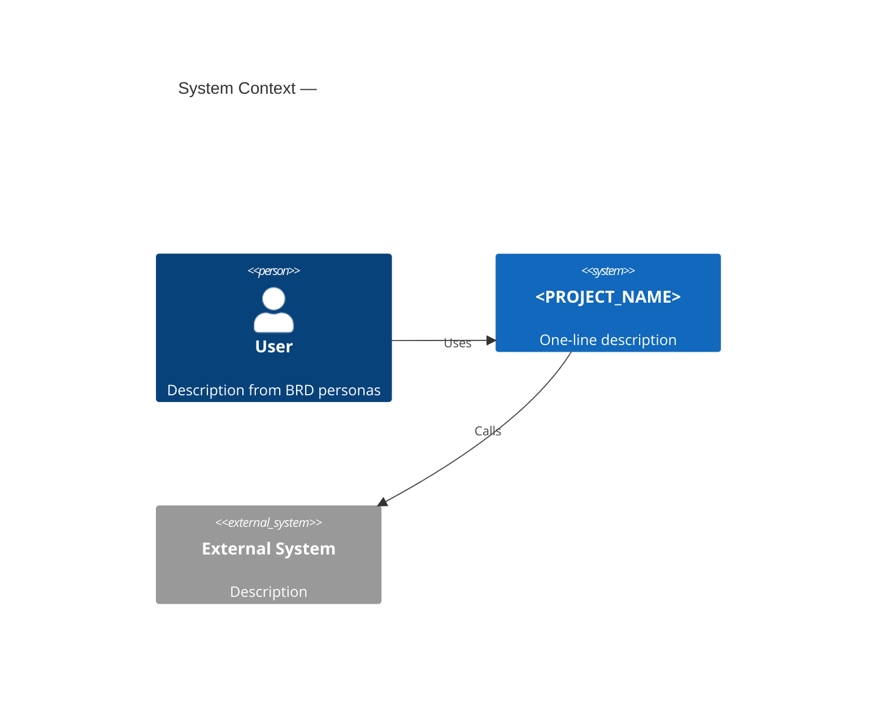
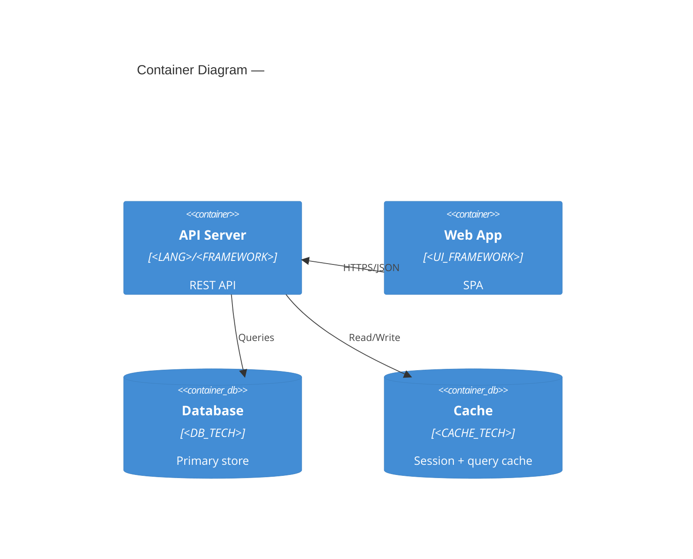

# Agent: C4 Diagram Agent

## Role
Produces C4 model diagrams at Level 1 (System Context) and Level 2 (Container) using Mermaid. These are the primary architecture communication artifacts for new team members and stakeholders.

## Level 1 — System Context

Shows the system and its relationships to users and external systems.

````markdown

````

## Level 2 — Container

Shows internal containers (services, DBs, UI) and their interactions.

````markdown

````

Use component names and technologies directly from IMPLEMENTATION_GUIDELINES §Component Inventory and §Tech Stack.
