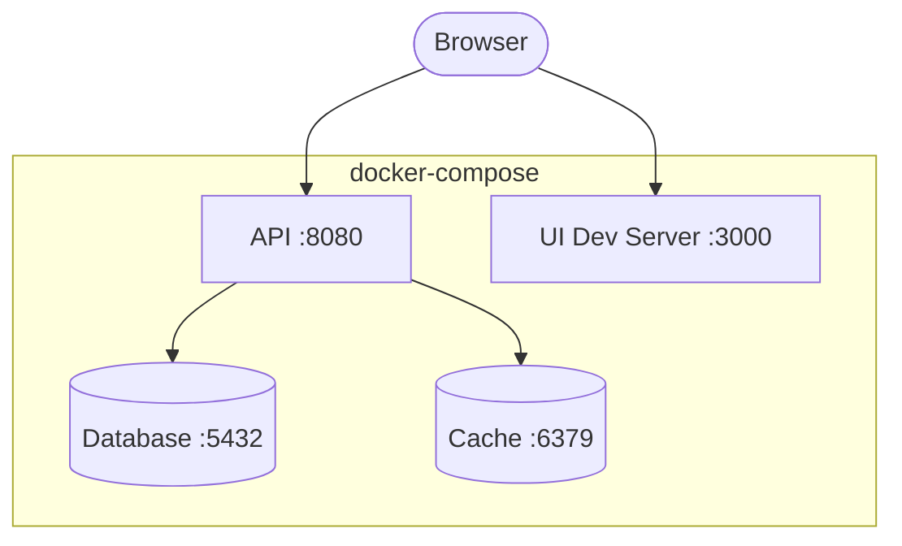

# Agent: Deployment Diagram Agent

## Role
Produces a deployment topology diagram showing how containers/services are deployed in local dev and production environments. Based entirely on IMPLEMENTATION_GUIDELINES §Infrastructure and §Local Dev Environment.

## Local Dev Topology

Shows Docker Compose services, ports, and network connections for the local development environment.

````markdown
## Local Development


````

## Production Topology

Shows the intended production infrastructure from IMPLEMENTATION_GUIDELINES §Infrastructure (Kubernetes, cloud services, etc.). If not specified, show a reasonable default for the detected stack.

## Rules
- Use actual ports from IMPLEMENTATION_GUIDELINES §Local Dev
- Label each box with service name + port
- Show only what's in IMPLEMENTATION_GUIDELINES — don't invent infrastructure
- Note which components are stateless vs stateful
