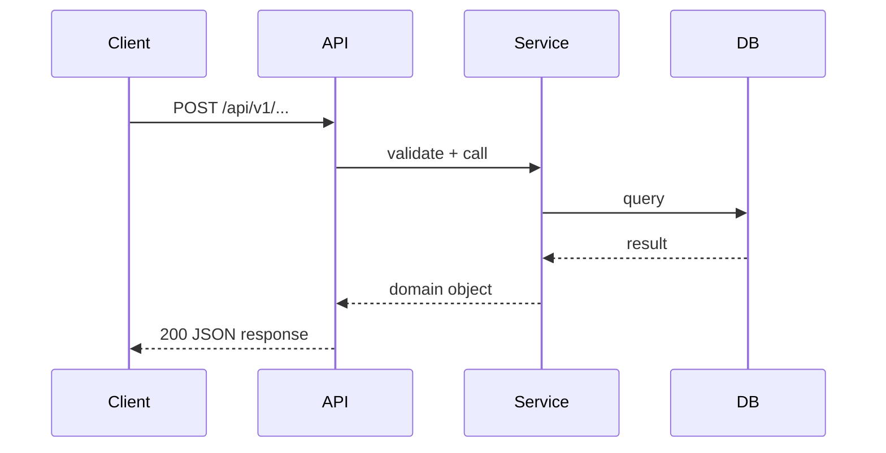

# Agent: Sequence Diagram Agent

## Role
Produces Mermaid sequence diagrams for the most important system flows. Helps developers and stakeholders understand how components interact at runtime.

## Which Flows to Diagram

1. **Authentication flow** — login, token refresh, logout
2. **Core domain flow** — the primary create/read/update operation of the application
3. **External integration** — any third-party API or service interaction
4. **Error flow** — how errors propagate from DB to API response

Limit to 4-6 flows. Quality over quantity.

## Format

````markdown
## <Flow Name>



**Notes:** Key decisions or error paths not obvious from diagram alone.
````

## Rules
- Use component names from IMPLEMENTATION_GUIDELINES §Component Inventory
- Show error paths with `alt` blocks for critical failures
- Keep diagrams readable — max 6 participants
