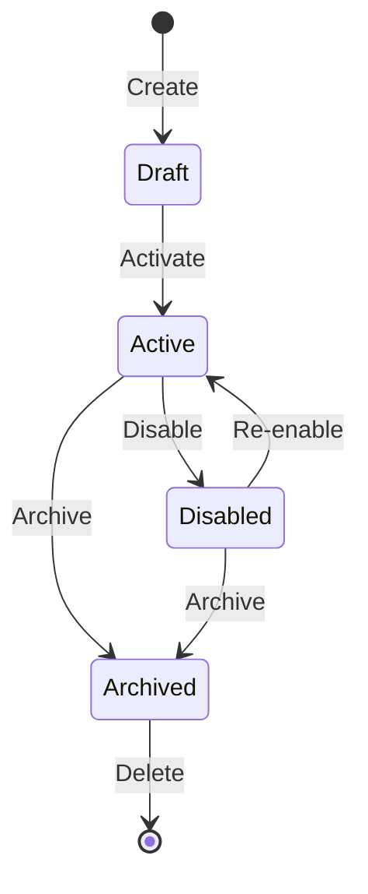

# /product-workflows — Deep Product Workflow Intelligence

Researches a product's configuration workflows from official documentation, video content, and community sources. Produces screen-by-screen guides, configuration schemas, dependency graphs, and persona-based workflow summaries.

**Use when:** You need to understand HOW a product works — not what it claims to do, but the actual screens, fields, prerequisite chains, and decision branches an administrator encounters when configuring it.

**Output:** `${OUTPUT}/${PRODUCT_SLUG}/` directory tree with per-capability deep-dives, unified dependency graph, persona workflows, and machine-readable reference files.

**Next step after product-workflows:** `/research` to build competitive analysis, or `/init` to start building a product that improves on the workflows documented here.

---

## Session Context Budget

> Full protocol: `.claude/skills/core/context-budget-protocol.md`. Per-step token targets below are specific to this command.

**Agent result discipline:** Every agent returns a 3-line summary to the parent. Full analysis content is in files — never echoed back to the conversation.

**Read discipline:** Agents read sources once and write structured output to files. The parent conversation receives only the 3-line summary. Per-capability agents are independent — each reads only its assigned capability's context.

**Per-step targets:**
| Step | Target input tokens |
|------|---------------------|
| Step 0 Orient | ~3K (argument parsing + resume detection) |
| Step 1 Documentation Research | ~25K (official docs, KB articles, training materials) |
| Step 2 Video Intelligence | ~20K (transcripts, chapter markers, navigation cues) |
| Step 3 Screenshot Analysis | ~10K per screenshot (multimodal image analysis) |
| Step 4 Capability Flow Mapping (per capability) | ~15K (screen hierarchy, config schema, prerequisites) |
| Step 5 Synthesis | ~20K (dependency graph, persona workflows, executive summary) |
| Step 6 Output | ~2K (summary + file listing) |

**Agent return protocol:** Every agent returns 3 lines to the parent:
```
<agent> complete -> wrote ${OUTPUT}/${PRODUCT_SLUG}/<file>
   Summary: <what was found - counts and key findings>
   Issues: none | <N items requiring attention>
```

---

## Pipeline Anti-Rationalization Guard

**One rule:** Never skip a step, shortcut a gate, or accept partial results — even if it "seems fine." If you're tempted to skip, that's exactly when the step matters most. The table below lists specific temptations and their correct responses.

Before skipping ANY step or accepting incomplete analysis, review this table.

| Your Internal Reasoning | Correct Response |
|---|---|
| "The official docs are enough, skip video research" | Videos contain gotchas and practical workflows NOT in docs. Always search for videos unless --depth=quick. Vendor docs describe the happy path; videos show what actually happens. |
| "This capability is simple, just list the fields" | Document the FULL prerequisite chain, decision points, and branching paths. Simple capabilities have complex dependencies. A "simple" policy rule may require 5 prerequisite objects to exist first. |
| "I'll skip the persona summary, the per-capability docs are enough" | Persona summaries are the PRIMARY deliverable for stakeholders. They connect capabilities into user stories. Per-capability docs serve developers; persona workflows serve product managers and trainers. |
| "No screenshots were provided, skip screen analysis" | Still build the screen hierarchy from documentation. Screenshots are supplementary, not required. Docs describe screens — extract that structure even without visual evidence. |
| "Community forums are unreliable, skip them" | Forums contain the ONLY source for gotchas and workarounds. Grade them (D/E) but include them. A forum post about a silent config dependency is worth more than 10 pages of marketing docs. |
| "I'll document the default path only" | Always document BOTH default and advanced paths. Power users need the advanced reference. Default-only documentation creates a ceiling that forces users to reverse-engineer the product. |
| "The dependency graph is obvious, skip it" | The graph is the most valuable single artifact. It shows what official docs never make explicit. Dependencies between capabilities are the #1 source of deployment failures. |
| "This product version is old, research the latest instead" | If --version was specified, research THAT version. Version-specific behavior differences are the #1 source of deployment failures. Document version-specific notes when found. |
| "I can infer the config schema from the description" | Never infer field types, defaults, or valid ranges. Research them from docs or mark as UNVERIFIED. A wrong default in a config schema causes silent misconfiguration. |
| "One source is enough for this claim" | Cross-reference against a second source whenever possible. Single-source claims get a lower evidence grade. Vendor docs can be outdated or aspirational. |

---

## Evidence Grading Standard

Every claim in every output file must carry an evidence grade:

| Grade | Source Type | Confidence | Example |
|-------|-----------|------------|---------|
| **A** | Official product documentation (current version) | Highest | Admin guide section 4.2, API reference |
| **B** | Vendor training materials, certification guides | High | Vendor training video, certification lab guide |
| **C** | Vendor blog posts, release notes, KB articles | Medium-High | KB-12345, release notes v11.2 |
| **D** | Community forums, Stack Overflow, Reddit | Medium | Community thread with vendor employee response |
| **E** | Inferred from screenshots, video observation, or logical deduction | Low | Observed in demo video at 14:32, inferred from UI layout |
| **U** | Unverified — no source found, assumption only | Unconfirmed | Assumed based on similar product behavior |

**Rules:**
- Grade A-C claims can be stated as facts
- Grade D claims must note the community source
- Grade E claims must note the inference method
- Grade U claims must be flagged as **ASSUMPTION** — these MUST be called out for human verification
- Video-sourced claims (B/E) must include timestamps

---

## Step 0 — Orient

### Parse arguments

```bash
PRODUCT="${ARG_PRODUCT}"
CAPABILITIES="${ARG_CAPABILITIES}"
SCREENSHOTS="${ARG_SCREENSHOTS}"
DEPTH="${ARG_DEPTH:-standard}"
VERSION="${ARG_VERSION}"
OUTPUT="${ARG_OUTPUT:-docs/product-workflows}"

# Generate slug from product name
PRODUCT_SLUG=$(echo "$PRODUCT" | tr '[:upper:]' '[:lower:]' | tr ' ' '-' | sed 's/[^a-z0-9-]//g')

# Determine research mode
if [ -z "$CAPABILITIES" ]; then
  MODE="FULL_SYSTEM_DISCOVERY"
  echo "Mode: FULL_SYSTEM_DISCOVERY — will discover complete capability taxonomy"
else
  MODE="TARGETED"
  IFS=',' read -ra CAPABILITY_LIST <<< "$CAPABILITIES"
  echo "Mode: TARGETED — ${#CAPABILITY_LIST[@]} capabilities specified"
fi

echo "Product:      ${PRODUCT}"
echo "Version:      ${VERSION:-latest available}"
echo "Depth:        ${DEPTH}"
echo "Output:       ${OUTPUT}/${PRODUCT_SLUG}/"
```

### Resume detection

```bash
EXISTING_RESEARCH="${OUTPUT}/${PRODUCT_SLUG}/research/doc-corpus.md"
if [ -f "$EXISTING_RESEARCH" ]; then
  echo "Previous research found at ${OUTPUT}/${PRODUCT_SLUG}/"
  echo "  Created: $(stat -f %Sm "$EXISTING_RESEARCH" 2>/dev/null || stat -c %y "$EXISTING_RESEARCH" 2>/dev/null)"
  echo "  Re-running will overwrite previous research."
fi
```

### Create output directories

```bash
mkdir -p "${OUTPUT}/${PRODUCT_SLUG}/research"
mkdir -p "${OUTPUT}/${PRODUCT_SLUG}/capabilities"
mkdir -p "${OUTPUT}/${PRODUCT_SLUG}/screens"
mkdir -p "${OUTPUT}/${PRODUCT_SLUG}/personas"
mkdir -p "${OUTPUT}/${PRODUCT_SLUG}/reference"
```

### Version context

If `--version` was provided, all research agents constrain their searches to that version. If omitted, target the latest generally available version and note the version discovered in `research/doc-corpus.md`.

---

## Step 1 — Documentation Research

**Agent:** `product_doc_researcher`

Search for and collect all available documentation for the product. This is the foundation — every subsequent step builds on what is discovered here.

### Search targets (ALL of these, not just the first that returns results)

1. **Official admin/product guides** — vendor documentation portal
2. **API reference** — REST, SOAP, CLI, PowerShell, SDK documentation
3. **Knowledge base articles** — vendor KB, support portal
4. **Training materials** — vendor university, certification guides, lab exercises
5. **Release notes** — version-specific changes, new features, deprecated features
6. **Best practices guides** — deployment guides, hardening guides, sizing guides
7. **Community documentation** — wikis, community-maintained guides
8. **Integration documentation** — how the product connects to other systems

### If FULL_SYSTEM_DISCOVERY mode

Discover the complete capability taxonomy from documentation before proceeding:

1. Read the product's top-level documentation structure (table of contents, navigation hierarchy)
2. Extract every major feature area, module, or configuration domain
3. Organize into a hierarchical taxonomy with at minimum 5 top-level capability groups
4. For each capability group, list the individual capabilities within it
5. Estimate complexity per capability (simple / moderate / complex) based on documentation volume

### Output

**`${OUTPUT}/${PRODUCT_SLUG}/research/doc-corpus.md`** — Contains: product version researched, all sources collected (with type, URL, evidence grade, relevance), documentation coverage assessment per area (complete/partial/minimal), and gaps in official documentation with alternative sources.

**`${OUTPUT}/${PRODUCT_SLUG}/research/capability-taxonomy.md`** (FULL_SYSTEM_DISCOVERY mode only) — Contains: discovery method, hierarchical taxonomy with numbered capability groups (each capability rated by complexity, doc coverage, priority), and capability count summary table.

### Agent return
```
product_doc_researcher complete -> wrote ${OUTPUT}/${PRODUCT_SLUG}/research/doc-corpus.md
   Summary: Collected N sources (N grade-A, N grade-B/C, N grade-D). Discovered N capability groups with N total capabilities.
   Issues: none | N documentation gaps identified
```

---

## Step 2 — Video Intelligence

**Agent:** `product_video_researcher`
**Skip if:** `--depth=quick`
**Depends on:** Step 1 (needs capability taxonomy to focus video search)

Search for and analyze video content that demonstrates the product's actual workflow behavior. Videos reveal practical navigation paths, field-level configuration details, and gotchas that official documentation omits.

### Search targets

1. **YouTube** — product name + "tutorial", "demo", "walkthrough", "configuration", "setup"
2. **Vendor site** — webinars, training videos, product tours
3. **Conference talks** — vendor conferences, industry events (RSA, Black Hat, AWS re:Invent, etc.)
4. **Training platforms** — Udemy, Pluralsight, LinkedIn Learning (metadata only — do not access paid content)

### For each video found

1. Extract metadata: title, channel, publish date, duration, view count
2. Obtain transcript (auto-generated or manual captions)
3. Identify chapter markers or logical sections
4. Analyze transcript for:
   - **Navigation cues** — "click on", "go to", "navigate to", "select", "expand"
   - **Field configurations** — "set this to", "enter the value", "choose from the dropdown"
   - **Gotchas** — "make sure you", "don't forget to", "common mistake", "note that"
   - **Workarounds** — "the trick is", "instead of", "a better way"
   - **Version-specific notes** — "in version X", "this changed in", "new in"
5. Cross-reference video findings against official docs — flag discrepancies as version-specific or undocumented behavior

### Output

**`${OUTPUT}/${PRODUCT_SLUG}/research/video-intelligence.md`** — Contains: videos analyzed table (title, channel, date, duration, views, relevance), navigation paths discovered (with timestamp + doc match status), configuration details NOT in official docs (with evidence grade), gotchas and workarounds (with impact + timestamp), version-specific discrepancies (docs vs video with versions), and video-to-capability mapping.

### Agent return
```
product_video_researcher complete -> wrote ${OUTPUT}/${PRODUCT_SLUG}/research/video-intelligence.md
   Summary: Analyzed N videos (N hours total). Found N navigation paths, N undocumented details, N gotchas.
   Issues: none | N version discrepancies flagged
```

---

## Step 3 — Screenshot Analysis (if --screenshots provided)

**Skip if:** `--screenshots` not provided
**Can run PARALLEL with Steps 1 and 2**

Read each screenshot image using multimodal analysis. Extract structural and configuration information from the visual content.

### For each screenshot

1. **Read the image** (multimodal) — identify the screen, its purpose, and its place in the navigation hierarchy
2. **Extract layout elements:**
   - Navigation breadcrumbs, tabs, sidebar items
   - Form fields with labels, types, current values, placeholder text
   - Buttons with labels and states (enabled/disabled/active)
   - Tables with column headers and sample data
   - Status indicators, alerts, notifications
   - Dropdown menus (if expanded)
3. **Infer screen identity** — match against capability taxonomy from Step 1
4. **Note relationships** — breadcrumbs reveal parent screens, tabs reveal sibling screens

### Output

**`${OUTPUT}/${PRODUCT_SLUG}/screens/${SCREEN_NAME}.md`** per screenshot — Contains: source (filename, mapped capability, evidence grade E), navigation path (from breadcrumbs or inferred), layout table (element type, label, value/state, notes for every field/button/control), and observations.

After processing all screenshots, produce a screenshot index mapping each file to screen name, capability, and field count.

### Agent return
```
screenshot_analyzer complete -> wrote ${OUTPUT}/${PRODUCT_SLUG}/screens/
   Summary: Analyzed N screenshots. Extracted N screens mapping to N capabilities. N fields documented.
   Issues: none | N screens could not be mapped to capabilities
```

---

## Step 4 — Capability Flow Mapping (PARALLEL per capability)

**Agent:** `capability_flow_mapper` (one instance per capability)
**Depends on:** Step 1 (doc corpus + taxonomy), Step 2 (video intelligence), Step 3 (screenshots — if available)
**Parallelization:** Launch one agent per capability. Max 5 concurrent agents — queue remaining.

For each capability (from `--capabilities` or from the discovered taxonomy in Step 1):

### 4a — Screen Hierarchy Tree

Build the complete screen navigation tree for this capability:
```
${CAPABILITY_NAME}
  ├── ${PARENT_SCREEN}
  │   ├── ${CHILD_SCREEN_1} (list view)
  │   │   └── ${DETAIL_SCREEN} (edit form)
  │   └── ${CHILD_SCREEN_2} (settings)
  └── ${RELATED_SCREEN} (referenced from other capability)
```

Source each screen from docs (grade A), video (grade E), or screenshot (grade E). If a screen is mentioned in docs but never shown, mark it as **INFERRED**.

### 4b — Configuration Schema

Document every configurable field for this capability:

```markdown
## Configuration Schema: ${CAPABILITY_NAME}

### ${SCREEN_NAME} — ${FORM_NAME}
| Field | Type | Required | Default | Valid Values | Constraints | Evidence |
|-------|------|----------|---------|-------------|-------------|----------|
| ${FIELD} | string | yes | "" | any | max 255 chars | A — Admin Guide 4.2 |
| ${FIELD} | enum | yes | "medium" | low, medium, high, critical | — | A — Admin Guide 4.3 |
| ${FIELD} | boolean | no | true | true/false | — | E — Video #2 at 8:15 |
| ${FIELD} | reference | yes | — | existing ${OBJECT_TYPE} | must exist before this object | B — Training Lab 3 |
```

### 4c — Prerequisite Chain

Map every dependency this capability has on other capabilities or configuration objects:

```markdown
## Prerequisites: ${CAPABILITY_NAME}

### Must Exist Before Configuration
| # | Prerequisite | Type | Why Required | What Happens Without It |
|---|-------------|------|-------------|------------------------|
| 1 | ${PREREQ} | ${TYPE} | Referenced in ${FIELD} | ${ERROR_OR_BLOCK} |

### Prerequisite Chain (ordered)
1. ${FIRST_THING_TO_CONFIGURE} — no dependencies
2. ${SECOND_THING} — depends on #1
3. ${THIS_CAPABILITY} — depends on #1 and #2

### Prerequisite Graph (Mermaid)
```mermaid
graph TD
    A[${PREREQ_1}] --> B[${PREREQ_2}]
    A --> C[${THIS_CAPABILITY}]
    B --> C
```
```

### 4d — Decision Points and Branching Paths

Document every point where the administrator must make a choice that affects the subsequent workflow:

```markdown
## Decision Points: ${CAPABILITY_NAME}

### Decision #1: ${DECISION_NAME}
- **Screen:** ${SCREEN_NAME}
- **Field/Action:** ${WHAT_TRIGGERS_THE_BRANCH}
- **Options:**
  | Option | Next Step | Unlocks | Hides | Impact |
  |--------|----------|---------|-------|--------|
  | ${OPTION_A} | ${NEXT_SCREEN_A} | ${FIELDS_A} | ${FIELDS_B} | ${IMPACT_A} |
  | ${OPTION_B} | ${NEXT_SCREEN_B} | ${FIELDS_B} | ${FIELDS_A} | ${IMPACT_B} |
- **Default:** ${DEFAULT_OPTION}
- **Recommendation:** ${WHICH_AND_WHY}
- **Reversible?** Yes / No — ${CONSEQUENCE_OF_CHANGING_LATER}
```

### 4e — Default vs Advanced Configuration Paths

```markdown
## Configuration Paths: ${CAPABILITY_NAME}

### Default Path (quickstart)
Minimal configuration using all defaults. Gets the capability running with least effort.
1. ${STEP_1} — accept default ${DEFAULT_VALUE}
2. ${STEP_2} — only required field: ${FIELD}
3. ${STEP_3} — save and activate

### Advanced Path (full control)
Every option documented for power users and production deployments.
1. ${STEP_1} — consider ${OPTION_A} vs ${OPTION_B} (see Decision #1)
2. ${STEP_2} — configure ${ADVANCED_FIELD_1}, ${ADVANCED_FIELD_2}
3. ...
```

### 4f — Known Limitations and Gotchas

```markdown
## Gotchas: ${CAPABILITY_NAME}

| # | Gotcha | Impact | Source | Evidence Grade | Workaround |
|---|--------|--------|--------|----------------|-----------|
| 1 | ${GOTCHA} | ${IMPACT} | ${SOURCE} | ${GRADE} | ${WORKAROUND} |
```

### 4g — Integration Touchpoints

```markdown
## Integration Points: ${CAPABILITY_NAME}

| # | Integration | Direction | Protocol | Data Exchanged | Required? |
|---|------------|-----------|----------|---------------|-----------|
| 1 | ${SYSTEM} | inbound / outbound / bidirectional | ${PROTOCOL} | ${DATA} | yes / no |
```

### 4h — Complexity Score

Rate the capability:
- **Simple** — single screen, < 5 fields, no prerequisites, no decision branches
- **Moderate** — 2-3 screens, 5-15 fields, 1-2 prerequisites, 1-2 decision branches
- **Complex** — 4+ screens, 15+ fields, 3+ prerequisites, 3+ decision branches, cross-capability dependencies

### 4i — Object Lifecycle State Diagram

If the capability involves an object with a lifecycle (e.g., policy: draft -> active -> disabled -> archived), generate a Mermaid state diagram:



### Output per capability

```
${OUTPUT}/${PRODUCT_SLUG}/capabilities/${CAPABILITY_SLUG}/
  ├── workflow.md         <- full deep-dive (sections 4a-4i combined)
  ├── quickstart.md       <- minimal path with defaults (from 4e default path)
  ├── advanced.md         <- every option documented (from 4e advanced path)
  ├── prerequisites.md    <- dependency chain (from 4c)
  └── gotchas.md          <- known limitations (from 4f)
```

### Agent return (per capability)
```
capability_flow_mapper[${CAPABILITY_SLUG}] complete -> wrote ${OUTPUT}/${PRODUCT_SLUG}/capabilities/${CAPABILITY_SLUG}/
   Summary: ${COMPLEXITY} capability. N screens, N fields, N prerequisites, N decision points, N gotchas.
   Issues: none | N fields with UNVERIFIED types, N ASSUMPTION claims
```

---

## Step 5 — Synthesis

**Agent:** `workflow_synthesizer`
**Depends on:** Step 4 (ALL capability flow maps must be complete)

Read all capability flow maps and produce unified cross-capability artifacts.

### 5a — Unified Dependency Graph

Build a single Mermaid DAG showing dependencies across ALL capabilities. Group capabilities into layers (e.g., Foundation, Policy, Enforcement, Operations) using Mermaid subgraphs. Include:
- **Dependency matrix** — each capability's upstream and downstream dependencies with layer assignment
- **Recommended configuration order** — topologically sorted, numbered, with dependency annotations
- **Circular dependencies** — if any exist, document the cycle, its impact, and resolution strategy

### 5b — Persona Workflow Summaries

For each identified persona (admin, analyst, auditor, end-user, etc.), write a cross-capability day-in-the-life narrative in `personas/${PERSONA_NAME}.md`. Each persona file contains:
- **Role description** and primary capabilities used (with frequency + criticality)
- **Day-in-the-life workflow** — time-sequenced narrative crossing capability boundaries. Each step names the screen, capability, action, and cross-references to other capabilities
- **Pain points** — what's difficult, which capabilities are involved, and the impact
- **Workflow optimization opportunities** — current steps vs optimized steps with savings estimate

### 5c — Executive Summary with Complexity Heatmap

Write `OVERVIEW.md` containing:
- **Executive summary** — capability group count, total capabilities, complexity range, recommended deployment stages
- **Complexity heatmap** — table of capability groups with simple/moderate/complex counts
- **Key findings** — top 3-5 insights from the research
- **Critical dependencies** — top 3-5 dependencies that block the most downstream capabilities
- **Common gotchas** — top 5 gotchas across all capabilities, ranked by impact

### 5d — Machine-Readable Reference Files

**`reference/screen-hierarchy.yaml`** — Product/version header, then array of screens each with: name, navigation path, capability, parent, children list, and fields (name, type, required, default).

**`reference/config-schemas.yaml`** — Product/version header, then array of capabilities each with: name, slug, complexity, and screens containing fields (name, type `string|integer|boolean|enum|reference|datetime`, required, default, valid_values, constraints, evidence_grade, evidence_source).

**`reference/integration-map.md`** — Three tables: inbound, outbound, and bidirectional integrations. Each row: system, protocol, data exchanged, capability, required flag.

**`reference/sources.md`** — All sources organized by evidence grade (A through E). Each entry: source name, URL, date accessed. Grade D adds reliability notes. Grade E adds timestamps.

### Full output tree produced by Step 5

```
${OUTPUT}/${PRODUCT_SLUG}/
  ├── OVERVIEW.md                       <- executive summary + complexity heatmap
  ├── CAPABILITY-TAXONOMY.md            <- full taxonomy (copy from Step 1 + enriched)
  ├── dependency-graph.md               <- unified Mermaid DAG
  ├── personas/
  │   └── ${PERSONA_NAME}.md            <- per-persona workflow summary
  ├── reference/
  │   ├── screen-hierarchy.yaml         <- machine-readable screen tree
  │   ├── config-schemas.yaml           <- machine-readable config schemas
  │   ├── integration-map.md            <- all integration touchpoints
  │   └── sources.md                    <- all sources with evidence grades
  ├── capabilities/                     <- from Step 4
  │   └── ${CAPABILITY_SLUG}/
  │       ├── workflow.md
  │       ├── quickstart.md
  │       ├── advanced.md
  │       ├── prerequisites.md
  │       └── gotchas.md
  ├── screens/                          <- from Step 3 (if screenshots provided)
  │   └── ${SCREEN_NAME}.md
  └── research/                         <- from Steps 1-2
      ├── doc-corpus.md
      ├── capability-taxonomy.md
      └── video-intelligence.md
```

### Agent return
```
workflow_synthesizer complete -> wrote ${OUTPUT}/${PRODUCT_SLUG}/OVERVIEW.md + dependency-graph.md + personas/ + reference/
   Summary: Synthesized N capabilities into unified graph. Generated N persona workflows. N integration points mapped.
   Issues: none | N capabilities with incomplete prerequisite chains
```

---

## Step 6 — Output

Print a summary of everything produced and suggest next steps.

```
Product workflow research complete: ${PRODUCT} ${VERSION}

  Capabilities:  N documented (N simple, N moderate, N complex)
  Personas:      N workflow summaries
  Screens:       N screens mapped
  Fields:        N configuration fields documented
  Dependencies:  N cross-capability dependencies
  Gotchas:       N known limitations documented
  Integrations:  N integration touchpoints mapped
  Sources:       N total (A: N, B: N, C: N, D: N, E: N, U: N)

  Output: ${OUTPUT}/${PRODUCT_SLUG}/

  Key files:
    OVERVIEW.md              <- start here (executive summary)
    dependency-graph.md      <- deployment sequence
    CAPABILITY-TAXONOMY.md   <- full system map
    personas/*.md            <- role-based workflow guides
    reference/*.yaml         <- machine-readable schemas

  Next steps:
    Review OVERVIEW.md for accuracy
    Check reference/sources.md for ASSUMPTION (grade U) claims
    /research --domain="${PRODUCT_DOMAIN}" to build competitive analysis
    /init to start building a product informed by these workflows
```

---

## Depth Mode Behavior

| Step | quick | standard | deep |
|------|-------|----------|------|
| Step 0 Orient | Full | Full | Full |
| Step 1 Documentation Research | Top-level overview + key capabilities only | Full system | Full system |
| Step 2 Video Intelligence | **SKIP** | Top 5 videos | Exhaustive video search + community forums |
| Step 3 Screenshot Analysis | If provided | If provided | If provided |
| Step 4 Capability Mapping | Top 5 capabilities only | All capabilities | All capabilities + community gotchas research |
| Step 5 Synthesis | Summary only (no personas) | Full synthesis | Full synthesis + competitive workflow comparison |
| Step 6 Output | Full | Full | Full |

---

## Rules

### Evidence rules
- Every claim must have an evidence source with grade (A-E or U). No ungraded claims.
- Video timestamps must be included for all video-extracted information. "From a video" is not a citation.
- Cross-reference video findings against official docs — flag discrepancies as version-specific with both sources cited.
- Grade U (ASSUMPTION) claims must be visually flagged with **ASSUMPTION** bold marker for human review.

### Completeness rules
- If FULL_SYSTEM_DISCOVERY mode: document at minimum the top 5 capability groups before mapping individual capabilities. Producing fewer than 5 groups indicates incomplete documentation research.
- Prerequisite chains must be verified — no forward references. If capability A requires B, then B must appear earlier in the recommended configuration order.
- Decision branches must document BOTH paths (not just the default). A decision with one documented option is not a decision — it is an assumption.
- Persona workflows must cross-reference multiple capabilities (not just repeat per-capability docs). A persona workflow that touches only one capability is a capability doc, not a persona workflow.

### Mandatory outputs
- The dependency graph is MANDATORY — never skip it. This is the most valuable single artifact.
- Machine-readable YAML outputs (`screen-hierarchy.yaml`, `config-schemas.yaml`) are MANDATORY. These enable downstream tooling and automation.
- The `sources.md` reference file is MANDATORY. Every source used across all outputs must appear here.
- The `OVERVIEW.md` executive summary is MANDATORY. It is the entry point for all consumers.

### Version rules
- If `--version` specified: constrain ALL research to that version. Note when findings apply to a different version.
- If version not specified: document the version discovered and note it in every output file header.
- When version-specific differences are found between docs and videos, document BOTH with version annotations.

### Quality rules
- Configuration field types must be researched, not inferred. If the type cannot be determined, mark as `unknown` with evidence grade U.
- Default values must be verified from official sources (grade A/B). Community-reported defaults get grade D.
- "Simple" complexity ratings must still include prerequisite chain documentation. Simple does not mean dependency-free.
- Screen hierarchies built without screenshots must note `source: documentation` on every screen entry.
