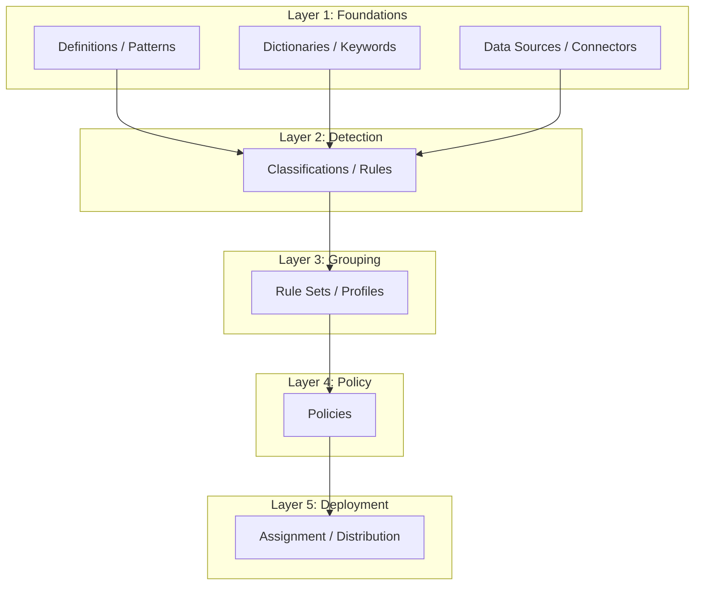

# Product Workflow Research — Skill Pack

Domain knowledge for agents that research enterprise product workflows, extract configuration hierarchies, and produce structured documentation from vendor sources.

---

## Universal Configuration Hierarchy Pattern

Every enterprise product (security, infrastructure, SaaS) follows this DAG (directed acyclic graph):

```
Layer 1: FOUNDATIONAL OBJECTS (definitions, data sources, identifiers, connectors)
    → Layer 2: DETECTION / CLASSIFICATION LOGIC (rules, classifiers, queries, patterns)
    → Layer 3: GROUPING CONTAINERS (rule sets, rule groups, policy groups, profiles)
    → Layer 4: POLICIES (combine detection + response + scope + exceptions)
    → Layer 5: DEPLOYMENT / ASSIGNMENT (to agents, servers, user groups, host groups, tenants)
```

**No circular dependencies exist.** The graph is always a clean DAG. Configuration must proceed bottom-up (foundational objects first, deployment last).

This pattern is validated across: DLP (Trellix, Symantec, Forcepoint, Microsoft Purview), SIEM (Splunk, Sentinel), EDR/XDR (CrowdStrike, SentinelOne), CASB (Netskope, Zscaler), IAM (Okta, Azure AD).

---

## Evidence Grading for Documentation Sources

| Grade | Source Type | Reliability | How to Cite |
|-------|-----------|-------------|-------------|
| **A — Official** | Admin guides, product guides, API reference, release notes | Highest | `docs.vendor.com/path — version X.Y` |
| **B — Training** | Vendor academy courses, training datasheets, certification guides | High | `training.vendor.com — course name` |
| **C — Demo** | Vendor YouTube demos, conference presentations, webinars | Medium-High | `youtube.com/watch?v=ID — timestamp MM:SS` |
| **D — Community** | Forums, KB articles, third-party blogs, community tutorials | Medium | `community.vendor.com/post-id` |
| **E — Inferred** | Deduced from API schemas, CLI help text, error messages | Low-Medium | `Inferred from: [evidence]` |

**Rule:** Always prefer Grade A over lower grades. When A and C conflict, C may reflect a newer version — note the discrepancy. Grade D captures gotchas not in official docs — always include these.

---

## Configuration Complexity Scoring

Rate each capability on three dimensions:

| Dimension | Simple | Moderate | Complex |
|-----------|--------|----------|---------|
| **Fields** | 3-5 fields | 10-20 fields | 50+ fields |
| **Screens** | 1 screen | 2-3 screens | 4+ screens with sub-tabs |
| **Dependencies** | No prerequisites | 1-2 prerequisites | Chain of 3+ prerequisites |

**Overall score:** Use the HIGHEST dimension. A capability with 5 fields but 4 prerequisite screens is COMPLEX.

---

## Screen Hierarchy Extraction Rules

When documenting a product's screen structure:

1. **Navigation path first:** `Menu > Section > Subsection > Tab > Action`
2. **Every tab is a separate screen** — even if visually on the same page
3. **Modal dialogs are child screens** — document as nested under the triggering screen
4. **Wizards have sequential steps** — each step is a screen with a step number
5. **List views vs. detail views** — document both: the list (columns, filters, sort) and the detail (all editable fields)
6. **Conditional screens** — if selecting Option A shows different fields than Option B, document BOTH branches

Format:
```yaml
screen:
  name: "Classification > Definitions > Advanced Pattern > Create"
  navigation: "Menu > Data Protection > Classification > Definitions tab > Advanced Pattern > Actions > New"
  parent: "Classification > Definitions"
  type: modal_dialog | page | tab | wizard_step
  fields:
    - name: "Pattern Name"
      type: text | dropdown | checkbox | radio | number | regex | date | multiselect
      required: true | false
      default: "value" | null
      options: ["opt1", "opt2"]  # for dropdown/radio/multiselect
      validation: "description of validation rule"
      description: "what this field does"
      gotcha: "common mistake or non-obvious behavior"
  actions:
    - name: "Save"
      type: button
      result: "Creates the pattern and returns to list view"
    - name: "Test"
      type: button
      result: "Opens test dialog to validate regex against sample text"
  prerequisites:
    - "Must have DLP extension installed in ePO"
  decision_points:
    - condition: "Validator = Luhn"
      effect: "Matches are validated against Luhn checksum — reduces false positives for credit cards"
```

---

## Video Transcript Analysis Protocol

When extracting workflow information from video transcripts:

### Signal Words to Detect

| Category | Signal Words |
|----------|-------------|
| **Navigation** | "go to", "click on", "navigate to", "open", "select from menu", "switch to tab" |
| **Field input** | "enter", "type", "set to", "choose", "enable", "disable", "toggle", "check", "uncheck" |
| **Decision** | "if you want", "for advanced users", "optionally", "depending on", "in this case" |
| **Prerequisite** | "make sure you've already", "first you need to", "before you can", "requires" |
| **Gotcha** | "common mistake", "don't forget", "this won't work if", "note that", "be careful", "important" |
| **Workaround** | "trick is to", "what I usually do", "faster way is", "shortcut" |
| **Version-specific** | "in version X", "new in this release", "this changed from", "deprecated" |

### Timestamp Mapping

Map every screen transition to a timestamp:
```
[MM:SS] Screen: {navigation path}
  → Action: {what the presenter does}
  → Field: {field name} = {value set}
  → Comment: "{what the presenter says about this step}"
```

### Cross-Reference Rule

Every video-extracted workflow step MUST be cross-referenced against official documentation:
- **Confirmed:** Video matches docs → HIGH confidence
- **Supplemented:** Video adds detail not in docs → MEDIUM-HIGH confidence (note: "from video demo, not in official docs")
- **Contradicted:** Video shows different behavior than docs → FLAG as potential version difference

---

## Persona Workflow Summary Template

```markdown
# {Persona Name} — Workflow Summary

## Role Overview
{1-2 sentences: who this person is and what they're responsible for}

## Daily Flow
┌──────────┐    ┌──────────┐    ┌──────────┐
│ Step 1   │ → │ Step 2   │ → │ Step 3   │
│ (Xm)     │    │ (Xm)     │    │ (Xm)     │
└──────────┘    └──────────┘    └──────────┘

## Capability Touchpoints
| Capability | How This Persona Uses It | Frequency | Complexity |
|-----------|-------------------------|-----------|------------|

## Narrative
### 1. {First activity} ({time estimate})
**Screen:** {navigation path}
**Actions:** {what they do, step by step}
**Decisions:** {choices they make and why}
**Output:** {what they produce / what state changes}

### 2. {Second activity} ...

## Prerequisites
- {What must be configured before this persona can do their job}

## Common Pain Points
- {Frustrations, workarounds, things that should be easier}

## Time Estimate: {total time for a complete workflow cycle}
## Complexity: SIMPLE | MODERATE | COMPLEX
```

---

## Dependency Graph Template (Mermaid)



---

## API Intelligence Protocol

API research reveals the real object model underneath the UI and exposes automation boundaries.

### Discovery Search Strategy

```
"{product}" REST API reference
"{product}" API documentation site:{vendor}.com
"{product}" OpenAPI swagger specification
"{product}" GraphQL schema
"{product}" PowerShell module | CLI reference
"{product}" Python SDK | Go SDK | Java SDK
site:github.com {vendor} {product} API client
"{product}" webhook events | event notifications
"{product}" SOAP WSDL (legacy products)
```

### API Coverage Levels

| Level | Meaning | Implication |
|-------|---------|-------------|
| **FULL** | All UI fields available via API | Can fully automate this capability |
| **PARTIAL** | Some fields API-accessible, some console-only | Partial automation; manual steps remain |
| **GAP** | No API endpoint exists for this operation | Must use UI — cannot script or integrate |
| **EXTRA** | API exposes operations NOT available in UI | Batch ops, raw queries, programmatic-only features |

### API ↔ UI Coverage Matrix Template

```markdown
| Capability | UI Action | API Endpoint | Method | Coverage | Gap Impact |
|-----------|-----------|-------------|--------|----------|------------|
```

**Gap Impact scoring:**
- **CRITICAL** — Core workflow blocked from automation (e.g., cannot create classifications via API)
- **HIGH** — Common operation requires manual UI interaction
- **MEDIUM** — Infrequent operation, manual workaround acceptable
- **LOW** — Edge case, rarely needed programmatically

### Object Schema Extraction

API endpoints reveal the canonical data model. For each entity:
```yaml
entity:
  name: "Classification"
  api_path: "/api/v1/classifications"
  fields:
    - api_name: "classificationId"
      ui_name: "Classification ID"
      type: string
      required: true
    - api_name: "criteria"
      ui_name: "Content Classification Criteria"
      type: array
      items: "ClassificationCriteria"
  relationships:
    - target: "Definition"
      type: "references"
      cardinality: "many-to-many"
    - target: "Rule"
      type: "referenced_by"
      cardinality: "one-to-many"
```

### Integration Surface Documentation

For each integration type:
```markdown
| Integration | Direction | Protocol | Auth | Capability Area | Notes |
|------------|-----------|----------|------|----------------|-------|
| Active Directory | Inbound | LDAP/S | Service account | User Groups | Required for user-based policy scoping |
| SIEM | Outbound | Syslog / REST | API key | Incident Mgmt | Forward DLP events for correlation |
| Email Gateway | Bidirectional | SMTP + API | Certificate | Email Protection | Inline inspection + quarantine |
```

---

## Output Quality Gates

Before producing final output, verify:

1. **Completeness:** Every capability has screen hierarchy + config schema + prerequisites
2. **Dependency accuracy:** Prerequisites chain is verified (no forward references)
3. **Evidence grading:** Every claim has a source with grade (A-E)
4. **No orphans:** Every screen in the hierarchy is reachable via navigation path
5. **Decision branches:** All conditional paths are documented (not just the default)
6. **Persona coverage:** Every capability is touched by at least one persona workflow
7. **Gotchas present:** At least 1 gotcha per MODERATE/COMPLEX capability (from community sources)
8. **Cross-reference:** Video-extracted steps confirmed against official docs where possible
9. **API coverage:** Every capability has API coverage level (FULL/PARTIAL/GAP/EXTRA) documented
10. **API gaps highlighted:** Console-only operations prominently flagged — these are the most valuable findings
11. **Integration map:** All external system touchpoints documented with direction and protocol
