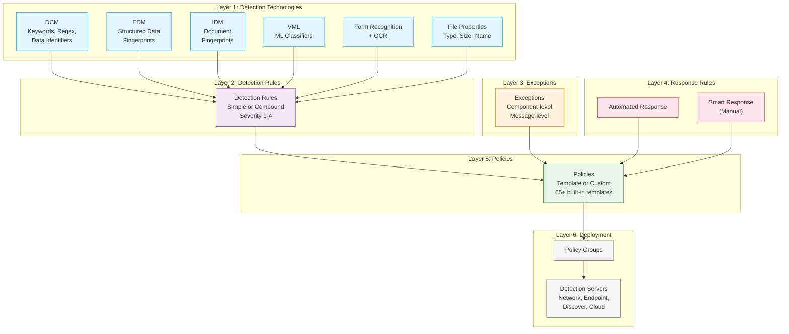

# Broadcom Symantec Data Loss Prevention -- Executive Overview

> **Product:** Symantec Data Loss Prevention (Broadcom)
> **Latest Version:** 26.1 | **Research Date:** 2026-05-21
> **Research Agents:** product_doc_researcher, video_researcher, api_researcher, capability_taxonomist, workflow_mapper, workflow_synthesizer

---

## At a Glance

| Dimension | Value |
|-----------|-------|
| **Capabilities Mapped** | 256 sub-capabilities across 9 categories |
| **Console Screens** | 40+ distinct navigation paths documented |
| **Form Fields** | 120+ configurable fields across detection, policy, response, and admin workflows |
| **API Endpoints** | 51 documented (Enforce REST + Detection REST 2.0 + CloudSOC + SOAP legacy) |
| **API Coverage** | ~70-75% of administrative operations; fine-grained rule authoring is console-only |
| **Personas** | Policy Author / DLP Administrator, SOC Analyst / Incident Responder, System Administrator, Compliance Officer |
| **Gotchas Documented** | 47 across 12 categories (5 CRITICAL, 16 HIGH, 18 MEDIUM, 8 LOW) |
| **Videos Cataloged** | 45 (official training + community + vendor demos) |
| **Documentation Sources** | 28 indexed sources (S1-S28), graded A through E |
| **Detection Technologies** | 6 distinct families (DCM, EDM, IDM, VML, Form Recognition, OCR) |
| **Deployment Vectors** | 7 detection server types + endpoint agents + cloud services |
| **Versions Covered** | 15.x through 26.1 (version gap: 16.x jumps to 25.x after Broadcom acquisition) |

---

## Complexity Assessment

**Overall Complexity: HIGH**

Symantec DLP is one of the most architecturally complex DLP products on the market. Its 6-layer hierarchical policy model (Detection Technologies > Detection Rules > Exceptions > Response Rules > Policies > Policy Groups/Deployment) provides maximum configurability but demands deep expertise.

| Factor | Assessment |
|--------|-----------|
| Infrastructure | VH -- Oracle DB dependency, hub-and-spoke architecture, multi-tier deployment |
| Policy Authoring | H -- 6 detection technologies, compound rule logic, dual exception model |
| Deployment | H -- 7 detection server types, endpoint agents, cloud services, ICAP/MTA integration |
| Integration | H -- REST API expanding but rule-level CRUD is console-only; dual API surfaces (on-prem vs cloud) |
| Operations | M-H -- 15-min agent poll interval, EDM/IDM index lifecycle, VML model retraining |

---

## Configuration Hierarchy



---

## Key Findings

### 1. Detection Technology Breadth -- Richest in Market

Symantec DLP offers six distinct detection technology families: Described Content Matching (DCM with 30+ data identifiers, keywords, regex), Exact Data Matching (EDM for structured data fingerprinting), Indexed Document Matching (IDM for unstructured document fingerprinting), Vector Machine Learning (VML for statistical content classification), Form Recognition (scanned form detection), and OCR (text extraction from images). This breadth exceeds both Trellix and Microsoft Purview.

### 2. API at 70-75% Coverage -- Expanding but Gaps Remain

The Enforce Server REST API has been progressively expanding since DLP 15.7 (2018). As of 25.1/26.1, it covers incident management (comprehensive), policy import/export, user/role management, Network Discover targets, EDM index triggering, server settings, and certificate management. **Critical gaps remain:** individual detection rule CRUD, classification creation, EDM/IDM/VML profile creation, and response rule CRUD are all console-only on-prem. The CloudSOC API has more granular profile authoring than the on-prem API.

### 3. Policy XML Import/Export Enables DLP-as-Code (25.1+)

The policy import/export API introduced in DLP 25.1 is the key workaround for the rule-level API gap. Policies can be exported as XML, stored in version control, and imported via API. This enables infrastructure-as-code patterns for DLP policy management, even though individual rule CRUD is not exposed.

### 4. Oracle Database Dependency -- Significant Infrastructure Requirement

Enforce Server requires Oracle Enterprise Edition (19c for DLP 16.0+). This is a substantial infrastructure dependency that adds licensing cost, operational complexity, and upgrade friction. Embedded database is available only for small deployments (<250 agents).

### 5. 15-Minute Agent Poll Interval -- Endpoint Propagation Lag

DLP agents check in with the Endpoint Prevent Server every 15 minutes. Policy changes, configuration updates, and enforcement mode switches take up to 15 minutes to reach endpoints. This creates a window where new policies are not yet active on endpoints.

### 6. Detection REST API 2.0 -- Unique Competitive Advantage

The Detection REST API 2.0 allows any application to submit content for DLP scanning via REST and receive policy violation results with response action recommendations. This positions Symantec DLP as an "inspection engine as a service" -- a capability few competitors match. It is being used for LLM/GenAI prompt safety (safeprompt project on GitHub).

### 7. Hub-and-Spoke Single Point of Failure

The single Enforce Server is the management hub for the entire deployment. High Availability requires Veritas Cluster Server or similar, and documentation for this configuration is sparse. Loss of the Enforce Server means no policy updates, no incident management, and no reporting until recovery.

### 8. Version Gap Creates Upgrade Confusion

Versions jump from 16.x to 25.1 (no 17-24) due to Broadcom's post-acquisition renumbering. Direct upgrades from pre-15.7 to 16.0 are not supported -- intermediate upgrade to 15.7 or 15.8 is required first.

---

## Critical API Gaps

| Gap | Impact | Workaround |
|-----|--------|------------|
| Individual detection rule CRUD | CRITICAL | Author in console, export/import policy XML via API (25.1+) |
| Classification creation | CRITICAL | Define in console, export as part of policy XML |
| EDM profile creation | HIGH | Create in console; trigger indexing via API |
| IDM profile creation | HIGH | Console only |
| VML model training | HIGH | Console only |
| Response rule CRUD | HIGH | Console only |
| Detection server provisioning | MEDIUM | Console only |
| Agent deployment/management | MEDIUM | Via endpoint management tools (SCCM, GPO) |
| Native webhook support | MEDIUM | Syslog response rules or API polling |
| OpenAPI/Swagger specification | MEDIUM | Not published; community wrappers in Python/PowerShell |

---

## Persona Summaries

### Policy Author / DLP Administrator
The primary user of the 6-layer policy model. Responsible for creating detection technologies (EDM profiles, IDM profiles, VML models), composing detection rules, defining exceptions, configuring response rules, assembling policies, and deploying via policy groups. Most time-intensive persona. See [personas/policy-author.md](personas/policy-author.md).

### SOC Analyst / Incident Responder
Interacts primarily with the incident management workflow. Triages incidents by severity, investigates matched content, executes Smart Response rules for remediation, and tunes policies based on false positive patterns. Heaviest API user via SOAR integrations. See [personas/incident-responder.md](personas/incident-responder.md).

### System Administrator
Manages infrastructure: Oracle database, Enforce Server, detection servers, agent deployment, directory connections, RBAC, authentication, syslog/SIEM forwarding, and upgrades. VH complexity role.

### Compliance Officer
Consumes dashboards and reports. Validates policy coverage against regulatory requirements (PCI DSS, HIPAA, GDPR, SOX). Reviews exception lists and policy effectiveness metrics.

---

## File Tree

```
broadcom-symantec-dlp/
  OVERVIEW.md                          <-- This file
  dependency-graph.md                  <-- Full Mermaid DAG with all layers
  capabilities/
    authoring-rules/
      workflow.md                      <-- Complete 6-layer workflow (field-level detail)
      gotchas.md                       <-- 47 gotchas across 12 categories
      prerequisites.md                 <-- Infrastructure, config order, dependency DAG
  personas/
    policy-author.md                   <-- Policy Author / DLP Administrator persona
    incident-responder.md              <-- SOC Analyst / Incident Responder persona
  reference/
    sources.md                         <-- All sources organized by grade
    integration-map.md                 <-- All integration touchpoints
  research/
    doc-corpus.md                      <-- 28 documentation sources indexed
    video-intelligence.md              <-- 45 videos cataloged with workflow extractions
    api-intelligence.md                <-- 6 API surfaces, 51 endpoints documented
    capability-taxonomy.md             <-- 256 sub-capabilities across 9 categories
```

---

## Recommended Next Steps

1. **Map remaining capabilities** -- The authoring-rules capability flow is complete. Next highest-value capabilities to map: Incident Management workflow, Network Discover scanning workflow, Agent Deployment workflow, Cloud DLP/CloudSOC workflow.

2. **Build policy XML schema documentation** -- The policy import/export API (25.1+) is the bridge to automation. Documenting the XML schema enables programmatic policy generation and "DLP-as-code" workflows.

3. **Map the CloudSOC API surface in detail** -- The CloudSOC API has more granular policy authoring than on-prem. Understanding this surface fully may reveal automation paths not available on-prem.

4. **Document upgrade path matrix** -- Cross-version compatibility (agent vs. server), Oracle version requirements, and intermediate upgrade steps are critical for production deployments and currently have sparse documentation.

5. **Investigate Detection REST API 2.0 integration patterns** -- This unique capability enables DLP-as-a-service. Documenting integration patterns for LLM safety, custom app scanning, and CI/CD pipeline scanning would be high-value.

---

*Synthesized from 28 documentation sources, 45 videos, 6 API surfaces, 51 endpoints, and 256 sub-capabilities. Research date: 2026-05-21.*
