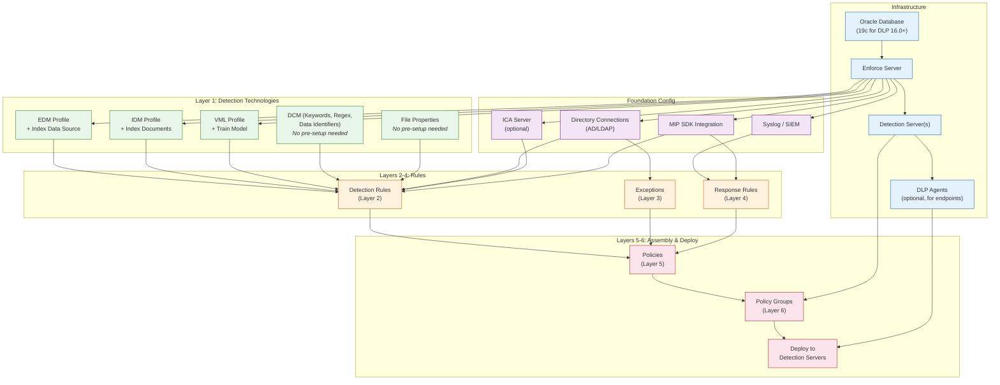

# Authoring Rules — Prerequisites
## Broadcom Symantec DLP (Enforce Server, version 16.x/25.x/26.x)

> **Purpose:** Infrastructure prerequisites, configuration order, and dependency graph for rule authoring.
> **Evidence sources:** doc-corpus.md [S1-S28], video-intelligence.md [V1-V45], api-intelligence.md

---

## 1. Infrastructure Prerequisites

### 1.1 Core Infrastructure (Required)

| Component | Requirement | Version | Notes | Evidence |
|-----------|------------|---------|-------|----------|
| **Oracle Database** | Oracle Enterprise Edition | 19c (DLP 16.0+) | Stores all policy definitions, incidents, configuration. Embedded DB available for small deployments (<250 agents). | A [S1, S4, V9] |
| **Enforce Server** | Central management hub | DLP 16.0+ / 25.1+ / 26.1 | Single Enforce Server per deployment. Windows Server or Linux. | A [S1, S4, V10] |
| **Detection Server(s)** | At least 1 detection server | Same version as Enforce | Must be registered with Enforce Server. Type determines available response actions. | A [S1, S4, V11] |
| **Web Browser** | Admin console access | Chrome, Firefox, Edge (current) | Enforce Server admin UI is browser-based. | A [S1] |

### 1.2 Detection Server Types (At Least 1 Required)

| Server Type | Data Channel | Required For | Notes | Evidence |
|-------------|-------------|-------------|-------|----------|
| Network Monitor Server | Data in Motion (passive) | Network traffic monitoring | Passive only; no blocking. Span/tap port required. | A [S1, S4] |
| Network Prevent for Email | Data in Motion (email) | Email blocking/quarantine/encrypt | MTA integration required (Postfix, Sendmail, Exchange). | A [S1, S4, S13] |
| Network Prevent for Web | Data in Motion (web) | Web traffic blocking | ICAP-compatible proxy required (Blue Coat, Squid, etc.). | A [S1, S4, S15] |
| Network Discover Server | Data at Rest | File share/DB/SharePoint scanning | Credentials for target systems required. | A [S1, S4] |
| Endpoint Prevent Server | Data in Use | Endpoint monitoring/blocking | DLP agents must be installed on endpoints. | A [S1, S4, V11, V12] |

### 1.3 Optional Infrastructure

| Component | Required For | Notes | Evidence |
|-----------|-------------|-------|----------|
| **DLP Agents** | Endpoint detection/prevention | Windows, macOS, Linux endpoints. Communicate with Endpoint Prevent Server every 15 min. | A [S1, S4, V12, V29] |
| **Active Directory / LDAP** | Directory Group Matching (DGM), user-based exceptions | System > Settings > Directory Connections | A [S1, S4] |
| **Email Gateway (SMG)** | Email quarantine response | Symantec Messaging Gateway for advanced quarantine workflows | A [S1, S4, S14] |
| **Web Proxy (ICAP)** | Web channel detection/blocking | Blue Coat/ProxySG, Squid 3.5.x, or other ICAP-compliant proxy | A [S1, S4, S15] |
| **Syslog Server / SIEM** | Log to Syslog response action | Splunk, QRadar, ArcSight, Sentinel, Chronicle | A [S1, S4] |
| **MIP SDK** | MIP label detection/application | Microsoft Information Protection integration on Enforce Server | A [S1, S2, S3] |
| **ICA Server** | User Risk-Based Detection | Information Centric Analytics for risk scoring (1-100) | B [S2, S25] |
| **Remote EDM Indexer** | Large-scale EDM indexing | Off-server indexing for large data sources (1M+ records) | A [S1, S4] |
| **Remote IDM Indexer** | Cloud IDM profiles | Creates cloud-compatible index files for CloudSOC | A [S1, S24] |
| **Load Balancer** | Multiple Endpoint Servers | Must set "Source IP persistence" to 24 hours | B [V-tribal] |

### 1.4 Version-Specific Prerequisites

| DLP Version | Oracle Requirement | OS Support | Key Dependency | Evidence |
|-------------|-------------------|------------|----------------|----------|
| 15.5 | Oracle 12c or 18c | Windows Server 2012+, RHEL 7 | .NET Framework 4.5.2 (agents) | A [S5, S19, S20] |
| 15.7 | Oracle 12c or 18c | Windows Server 2012+, RHEL 7 | REST API introduced | A [S1] |
| 15.8 | Oracle 12c, 18c, or 19c | Windows Server 2012+, RHEL 7 | End User Remediation, MIP | A [S1] |
| 16.0 | **Oracle 19c required** | Windows Server 2016+, RHEL 7/8 | ICA integration, REST API expansion | A [S1, V-gotcha] |
| 16.1 | Oracle 19c | Windows Server 2016+, RHEL 7/8 | High Speed Discovery, MIP auto-label | A [S6] |
| 25.1 | Oracle 19c+ | Windows Server 2019+, RHEL 8 | ARM64 agent, Policy API | A [S2] |
| 26.1 | Oracle 19c+ | Windows Server 2019+, RHEL 8 | Incident Workflows, Entra ID | A [S3] |

**CRITICAL:** Upgrading to DLP 16.0 requires upgrading Oracle to 19c FIRST. Run the Upgrade Readiness Tool (URT) before AND after the Oracle upgrade. [S1, V-gotcha]

**CRITICAL:** Upgrading from pre-15.7 requires an intermediate upgrade to 15.7 or 15.8 first. Direct jumps from 14.x/15.0-15.5 to 16.0 are NOT supported. [V-gotcha]

---

## 2. Configuration Order

Rule authoring must follow a specific order because each layer depends on the previous one. Creating objects out of order results in incomplete policies or orphaned configurations.

### 2.1 Mandatory Order

```
Step 1: Infrastructure Setup
  ├── Install Oracle Database
  ├── Install Enforce Server (connects to Oracle)
  ├── Install Detection Server(s) (registers with Enforce)
  └── Install DLP Agents (connects to Endpoint Prevent Server)

Step 2: Foundation Configuration
  ├── Configure Directory Connections (AD/LDAP) -- needed for DGM rules and exceptions
  ├── Configure Syslog/SIEM -- needed for syslog response actions
  └── Configure MIP integration -- needed for MIP tag rules and label response actions

Step 3: Detection Technology Preparation (Layer 1)
  ├── Create EDM Profiles and run initial indexing
  ├── Create IDM Profiles and run initial indexing
  ├── Create VML Profiles and run initial training
  └── (DCM, File Properties, Form Recognition require no pre-setup)

Step 4: Detection Rule Creation (Layer 2)
  └── Create detection rules referencing the technologies from Step 3

Step 5: Exception Creation (Layer 3)
  └── Create exceptions (can reference directory groups from Step 2)

Step 6: Response Rule Creation (Layer 4)
  └── Create response rules (can reference syslog from Step 2)

Step 7: Policy Assembly (Layer 5)
  └── Assemble policies combining rules (Step 4) + exceptions (Step 5) + response rules (Step 6)

Step 8: Policy Group Configuration (Layer 6)
  ├── Create policy groups
  ├── Assign detection servers to groups
  └── Assign policies to groups

Step 9: Deployment
  ├── Set policy mode (Test Without Notifications → Test With Notifications → Enabled)
  └── Apply/deploy policies to detection servers
```

### 2.2 Why Order Matters

| Dependency | Reason | Error if Skipped |
|-----------|--------|-----------------|
| Oracle before Enforce | Enforce Server stores all data in Oracle | Installation fails |
| Enforce before Detection Servers | Detection servers register with Enforce | Server cannot register |
| EDM/IDM/VML profiles before rules | Detection rules reference profiles | Rule cannot select profile |
| Directory connections before DGM rules | DGM rules reference AD/LDAP groups | Group selection dropdown empty |
| Response rules before policy assembly | Policies reference response rules | Cannot attach response to policy |
| Policy groups before deployment | Policies deploy via groups | Policy has no deployment target |
| Test mode before enforcement | Detection rules may have false positives | Legitimate business disrupted |

---

## 3. Dependency DAG



---

## 4. RBAC Prerequisites for Policy Authoring

Users must have appropriate role privileges to author rules. [S1, S4]

| Action | Required Privilege | Evidence |
|--------|-------------------|----------|
| Create/edit policies | Policy Authoring | A [S1, S4] |
| Create/edit detection rules | Policy Authoring | A [S1, S4] |
| Create/edit response rules | Response Rule Management | A [S1, S4] |
| Manage policy groups | Server Administration | A [S1, S4] |
| Create/edit data profiles (EDM, IDM, VML) | Policy Authoring | A [S1, S4] |
| View incidents | Incident access (scoped by role) | A [S1, S4] |
| Execute smart response rules | Response rule execution (per role) | A [S1, S4] |
| Manage directory connections | System Administration | A [S1, S4] |
| API access (REST) | "Incident Reporting API Web Service" role or equivalent | A [API-intelligence] |

**RBAC Navigation:** System > Login Management > Roles (or Manage > Roles depending on version)

**Note:** The built-in "Administrator" user (created at install) has unrestricted access and is not a member of any role. All other users must be assigned appropriate roles. [S1, S4]

---

## 5. Pre-Authoring Checklist

Before beginning rule authoring, verify:

| # | Check | How to Verify | Evidence |
|---|-------|---------------|----------|
| 1 | Enforce Server is running and accessible | Navigate to Enforce console URL in browser | A [S1] |
| 2 | At least 1 detection server is registered | System > Servers and Detectors > Overview | A [S1, S4] |
| 3 | Detection server(s) are "green" (online) | System > Servers and Detectors > Overview | A [S1, S4] |
| 4 | Oracle database is operational | Enforce console loads without errors | A [S1, S4] |
| 5 | User has Policy Authoring privilege | System > Login Management > Roles > [your role] | A [S1, S4] |
| 6 | Directory connections configured (if using DGM) | System > Settings > Directory Connections | A [S1, S4] |
| 7 | Syslog server reachable (if using syslog response) | Network connectivity test from Enforce to syslog host | A [S1, S4] |
| 8 | EDM source data prepared (if using EDM) | CSV file or database connection ready | A [S1, S4] |
| 9 | IDM source documents collected (if using IDM) | Documents in accessible file share or uploaded | A [S1, S4] |
| 10 | VML training documents prepared (if using VML) | 50+ positive and 50+ negative documents | A [S1, S7] |
| 11 | MIP SDK installed (if using MIP integration) | MIP tenant credentials configured in Enforce | A [S1, S2] |
| 12 | Endpoint agents deployed (if using endpoint channel) | System > Agents > Overview shows registered agents | A [S1, S4, V12] |
| 13 | Web proxy ICAP configured (if using web channel) | Network Prevent for Web server shows as connected | A [S1, S15] |
| 14 | Email MTA integration configured (if using email channel) | Network Prevent for Email server shows as connected | A [S1, S13] |

---

## 6. Capacity Planning

### EDM Profile Sizing

| Records | Indexing Time | Storage | Recommended Approach | Evidence |
|---------|--------------|---------|---------------------|----------|
| <100K | Minutes | <1 GB | Direct indexing on Enforce Server | A [S1, S4] |
| 100K-1M | 10-30 minutes | 1-5 GB | Direct or Remote EDM Indexer | A [S1, S4] |
| 1M-10M | 30 min-2 hours | 5-20 GB | Remote EDM Indexer recommended | A [S1, S4] |
| >10M | 2+ hours | 20+ GB | Remote EDM Indexer required | B [S4] |

### VML Training Set Sizing

| Documents per Set | Expected Accuracy | Recommended? | Evidence |
|-------------------|-------------------|-------------|----------|
| <50 | <75% | No -- insufficient training data | A [S7] |
| 50-100 | 75-85% | Minimum viable | A [S7] |
| 100-250 | 85-92% | Good for most use cases | A [S7, V20] |
| 250-500 | 90-96% | Best practice recommendation | A [S7, V20] |
| >500 | Diminishing returns | Only if accuracy still below target | B [S7] |

### Detection Server Sizing

| Server Type | Recommended CPU | RAM | Storage | Evidence |
|-------------|----------------|-----|---------|----------|
| Enforce Server | 8+ cores | 32+ GB | 500+ GB (SSD) | B [S9] |
| Network Prevent (Email/Web) | 4-8 cores | 16-32 GB | 200+ GB | B [S9] |
| Network Discover | 4-8 cores | 16-32 GB | 200+ GB (plus scan cache) | B [S9, S17] |
| Endpoint Prevent Server | 4-8 cores per 10K agents | 16-32 GB per 10K agents | 200+ GB | B [S9] |

---

## 7. Upgrade Path Prerequisites

If upgrading an existing deployment before authoring new rules:

| Current Version | Target Version | Upgrade Path | Evidence |
|----------------|---------------|-------------|----------|
| 14.x | 16.0 | 14.x -> 15.7 or 15.8 -> 16.0 (intermediate required) | A [V-gotcha] |
| 15.0-15.5 | 16.0 | 15.x -> 15.7 or 15.8 -> 16.0 (intermediate required) | A [V-gotcha] |
| 15.7 | 16.0 | Direct upgrade (Oracle 19c upgrade required first) | A [S1, V-gotcha] |
| 15.8 | 16.0 | Direct upgrade (Oracle 19c upgrade required first) | A [S1, V-gotcha] |
| 16.0 | 25.1 | Direct upgrade | A [S2] |
| 16.0 | 26.1 | 16.0 -> 25.1 -> 26.1 (check release notes) | B [S3] |
| 25.1 | 26.1 | Direct upgrade | A [S3] |

**Always run the Upgrade Readiness Tool (URT) before and after upgrades.** [V-gotcha]

**EDM profiles require special upgrade handling.** Follow EDM-specific upgrade instructions and verify profiles post-upgrade. [V-gotcha]

---

*End of prerequisites document. 7 sections covering infrastructure, configuration order, dependency DAG, RBAC, checklists, capacity planning, and upgrade paths.*
