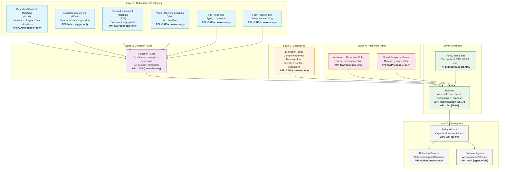
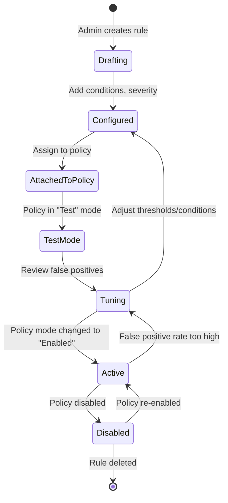
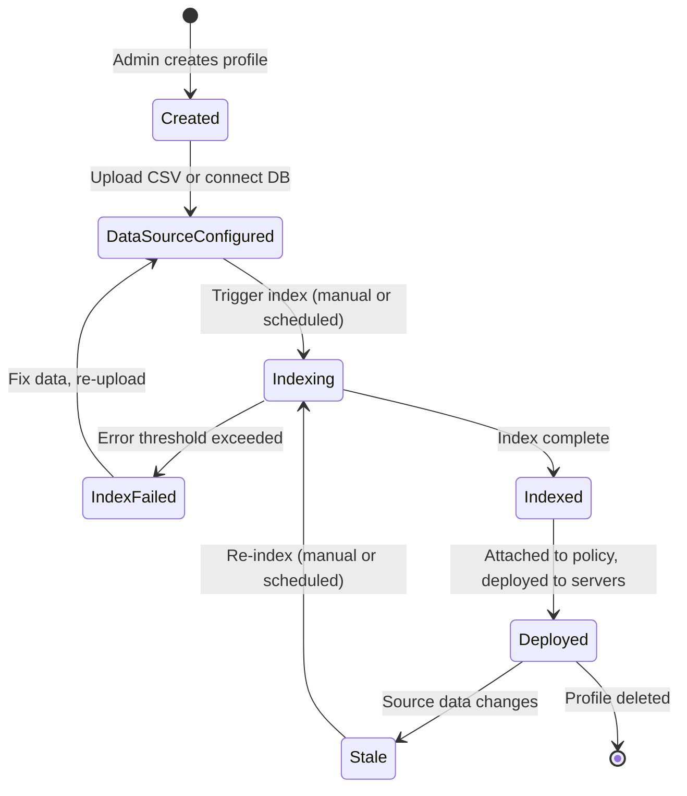
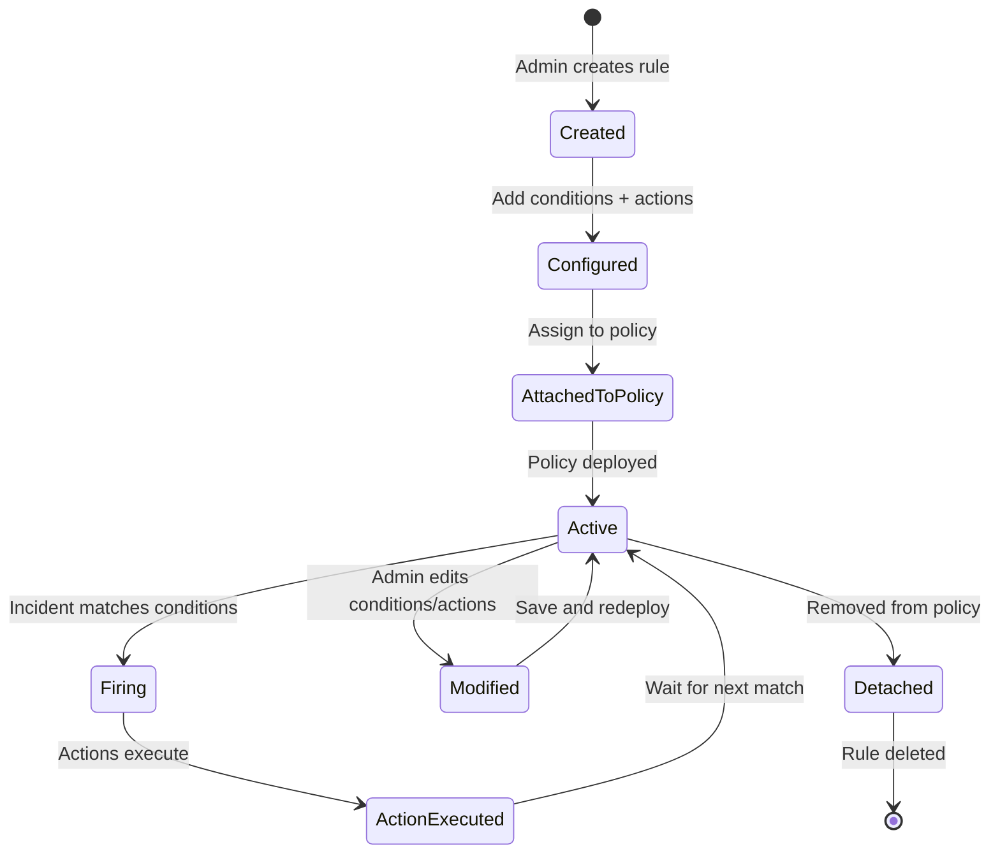
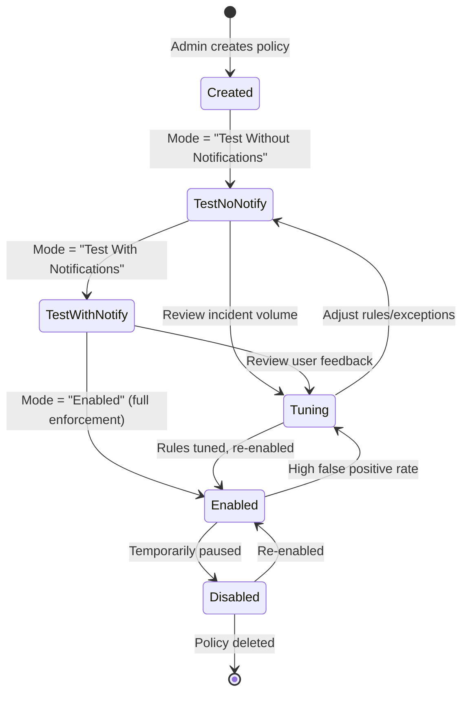

# Authoring Rules — Complete Workflow
## Broadcom Symantec DLP (Enforce Server, version 16.x/25.x/26.x)

> **Capability:** Authoring Rules (Detection Technologies, Detection Rules, Exceptions, Response Rules, Policies, Policy Groups & Deployment)
> **Complexity Score:** COMPLEX
> **Evidence sources:** doc-corpus.md [S1-S28], video-intelligence.md [V1-V45], api-intelligence.md [API surfaces 1-6]

---

## Overview

Rule authoring in Broadcom Symantec DLP is the process of defining what sensitive data to look for, how to detect it, what to exclude, what action to take when it is found, and where to deploy those definitions. Unlike some DLP products that flatten everything into a single "policy" concept, Symantec DLP uses a **6-layer hierarchical model** that separates detection technology selection, rule composition, exception logic, response actions, policy assembly, and deployment targeting into distinct, composable layers.

This separation is Symantec's core architectural strength for rule authoring: detection technologies can be reused across multiple rules, rules can be combined in policies, response rules can be shared across policies, and policy groups control which detection servers enforce which policies. It also means that authoring a complete DLP policy from scratch is a multi-step process that requires understanding all six layers.

**How Symantec differs from other DLP products:**

| Aspect | Symantec DLP | Trellix DLP | Microsoft Purview |
|--------|-------------|-------------|-------------------|
| Detection model | 6 distinct technologies (DCM, EDM, IDM, VML, File Properties, Form Recognition) | Classifications + rules | Sensitive Information Types + trainable classifiers |
| Rule composition | Explicit rule layer combining technologies with conditions | Embedded in policy definition | Embedded in policy rules |
| Exception model | Dedicated exception layer (component-level + message-level) | Per-rule exceptions | Conditions within rules |
| Response rules | Separate, reusable response rule objects (Automated + Smart) | Actions embedded in rules | Actions embedded in policy |
| Policy templates | 65+ pre-built compliance templates (XML-based) | ~50 templates | ~200+ templates |
| Deployment model | Policy groups mapped to detection servers | Server-to-policy direct assignment | Tenant-wide or scoped to locations |

[S1, S4, S22, V14, V16]

---

## Complexity Score: COMPLEX

**Justification:**

1. **6 distinct detection technologies** (DCM, EDM, IDM, VML, File Properties, Form Recognition) -- each with its own configuration workflow, data preparation requirements, and operational lifecycle
2. **Compound rule logic** -- detection rules can combine multiple technologies with AND/OR logic, thresholds, and severity assignments
3. **Dual exception model** -- component-level exceptions (match within a file part) vs. message-level exceptions (match across entire message envelope)
4. **Two response rule types** -- Automated (fire on detection) and Smart (manual by remediator), each with different action sets per detection server type
5. **Policy template system** -- 65+ pre-built templates with importable XML definitions
6. **Multi-server deployment** -- policies deploy to specific detection servers via policy groups; different servers support different response actions
7. **Data profile lifecycle** -- EDM, IDM, and VML profiles have their own creation, indexing/training, and refresh workflows that must precede policy creation
8. **API gap for fine-grained authoring** -- individual rule/classification CRUD is console-only; policy import/export (25.1+) is the API workaround

[S1, S4, S8, API-intelligence]

---

## Configuration Dependency Graph



[S1, S4, API-intelligence]

---

## The 6-Layer Hierarchy

### Layer 1: Detection Technologies

Detection technologies are the foundational building blocks of Symantec DLP. Each technology defines a *method* for identifying sensitive content. A detection rule references one or more detection technologies. Symantec provides six distinct detection technology families.

#### 1.1 Described Content Matching (DCM)

**Navigation:** Manage > Policies > Policy List > [policy] > Add Rule > [select condition type]
**Screen type:** Policy editor -- detection rule configuration panel
**Evidence:** [S1, S4, S8, V3, V6, V16]

DCM is the most commonly used detection technology. It detects content by matching on keywords, regular expressions, pre-built data identifiers, and dictionaries. DCM does not require pre-indexing or training -- rules evaluate content in real time.

##### 1.1.1 Data Identifiers

Data identifiers are pre-built detection patterns that combine pattern matching with validation algorithms (e.g., Luhn check for credit cards, format validation for SSNs). Symantec ships 30+ built-in data identifiers. Custom data identifiers can be created. [S1, S4, S8]

**Navigation:** Policy > Rules > Add Rule > Content Matches Data Identifier

| Field | Type | Required | Default | Options | Evidence |
|-------|------|----------|---------|---------|----------|
| Data Identifier | Dropdown | Yes | -- | US SSN, Credit Card Number, IBAN, Passport, Driver License, Custom... (30+ built-in) | A [S1, S4] |
| Minimum Matches | Integer | Yes | 1 | 1-999 | A [S1, S4] |
| Match Counting | Radio | Yes | Unique | Unique, All | A [S4] |
| Check for Existence | Checkbox | No | Unchecked | Checked = detect even 1 match | B [S8] |
| Input Validation | Auto | -- | Per-identifier | Luhn (CC), format check (SSN), checksum | A [S1, S4] |
| Breadth | Radio | No | Narrow | Narrow, Medium, Wide (controls pattern strictness) | B [S8] |

**Built-in Data Identifiers (partial list):** [S1, S4]

| Identifier | What It Detects | Validation |
|-----------|----------------|-----------|
| US Social Security Number (SSN) | XXX-XX-XXXX pattern | Format + area number validation |
| Credit Card Number | Visa, MC, Amex, Discover, JCB, Diners | Luhn algorithm + prefix validation |
| International Bank Account Number (IBAN) | Country-specific IBAN formats | Modulo-97 checksum |
| US Passport Number | 9-digit format | Format validation |
| US Driver License | State-specific formats | Per-state format validation |
| UK National Insurance Number | XX-XX-XX-XX-X | Format + prefix validation |
| Canadian Social Insurance Number | XXX-XXX-XXX | Luhn algorithm |
| Australian Tax File Number | 8-9 digits | Check digit algorithm |
| ABA Routing Number | 9-digit bank routing | Checksum validation |
| SWIFT/BIC Code | Bank identifier code | Format + country code |
| IP Address | IPv4 addresses | Octet range validation |
| Email Address | user@domain pattern | RFC 5322 format |
| Date of Birth | Various date formats | Range validation |

**ASCII UI Diagram -- Data Identifier Rule Configuration:**

```
+=========================================================================+
|  Manage > Policies > Policy List > [Policy Name]                        |
+=========================================================================+
|  Policy: PCI-Credit-Card-Protection                                     |
|  [General] [Detection] [Groups] [Response]                    [Save]    |
+-------------------------------------------------------------------------+
|                                                                         |
|  Detection Rules                                           [+ Add Rule] |
|  ---------------------------------------------------------------        |
|  | Rule Name: [Credit Card Detection Rule          ]                    |
|  |                                                                      |
|  | Condition: Content Matches Data Identifier  [v]                      |
|  |                                                                      |
|  | Data Identifier: [Credit Card Number            ] [v]                |
|  |                                                                      |
|  | Minimum Matches: [  1  ]                                             |
|  |                                                                      |
|  | Count: (*) Unique matches   ( ) All matches                          |
|  |                                                                      |
|  | Severity: [High  ] [v]                                               |
|  |                                                                      |
|  | Look In:                                                             |
|  |   [x] Message Body    [x] Message Subject                           |
|  |   [x] Attachments     [ ] Message Envelope                          |
|  |                                                                      |
|  | [Save Rule]  [Cancel]                                                |
|  ---------------------------------------------------------------        |
|                                                                         |
+=========================================================================+
```

**Examples -- Data Identifiers:**

```yaml
# Example 1: US SSN detection for HR data protection
detection_method: "data_identifier"
name: "SSN-Detection-Rule"
data_identifier: "US Social Security Number"
minimum_matches: 1
match_counting: "unique"
severity: "High"
look_in:
  - "message_body"
  - "attachments"
# WHY: SSN is the most commonly leaked PII in the US. Even a single
#      SSN in an outbound email is a potential compliance violation.
# GOTCHA: SSNs in the format "123456789" (no dashes) require the "Wide"
#         breadth setting. Default "Narrow" only catches XXX-XX-XXXX.
```

```yaml
# Example 2: Credit card detection with Luhn validation
detection_method: "data_identifier"
name: "PCI-Credit-Card-Rule"
data_identifier: "Credit Card Number"
minimum_matches: 1
match_counting: "unique"
severity: "High"
look_in:
  - "message_body"
  - "attachments"
  - "message_subject"
# WHY: PCI DSS requirement 3 mandates protection of stored cardholder data.
#      Luhn algorithm validation reduces false positives significantly.
# GOTCHA: Test credit card numbers (4111-1111-1111-1111) also pass Luhn
#         validation. Add exception for known test patterns if needed.
```

```yaml
# Example 3: Bulk credit card detection (data exfiltration scenario)
detection_method: "data_identifier"
name: "PCI-Bulk-CC-Exfil"
data_identifier: "Credit Card Number"
minimum_matches: 10
match_counting: "unique"
severity: "High"
look_in:
  - "message_body"
  - "attachments"
# WHY: 10+ unique credit card numbers in a single message strongly indicates
#      data exfiltration, not incidental exposure.
# GOTCHA: Set "unique" counting -- without it, repeated mentions of the same
#         card number could trigger the threshold.
```

```yaml
# Example 4: IBAN detection for EU financial compliance
detection_method: "data_identifier"
name: "IBAN-Financial-Data"
data_identifier: "International Bank Account Number (IBAN)"
minimum_matches: 3
match_counting: "unique"
severity: "Medium"
look_in:
  - "message_body"
  - "attachments"
# WHY: GDPR requires protection of financial data. 3+ IBANs suggests
#      a customer/partner list rather than a single transaction reference.
# GOTCHA: IBAN formats vary by country (DE = 22 chars, GB = 22 chars,
#         FR = 27 chars). The built-in identifier handles all formats.
```

```yaml
# Example 5: Australian Tax File Number for AU operations
detection_method: "data_identifier"
name: "AU-TFN-Protection"
data_identifier: "Australian Tax File Number"
minimum_matches: 1
match_counting: "unique"
severity: "High"
look_in:
  - "message_body"
  - "attachments"
# WHY: Australian Privacy Act 1988 specifically protects TFN data.
#      Check digit algorithm in the identifier ensures high accuracy.
# GOTCHA: TFN is 8-9 digits -- without the check digit validator, many
#         random number sequences would false-positive.
```

##### 1.1.2 Keyword Matching

Keywords detect specific words, phrases, or word combinations. Supports proximity matching and case sensitivity. [S1, S4, S8, V16]

**Navigation:** Policy > Rules > Add Rule > Content Matches Keyword

| Field | Type | Required | Default | Options | Evidence |
|-------|------|----------|---------|---------|----------|
| Keywords | Text area | Yes | -- | One keyword/phrase per line | A [S1, S4] |
| Case Sensitive | Checkbox | No | Unchecked (case-insensitive) | Checked = exact case match | A [S1, S4] |
| Whole Word Only | Checkbox | No | Unchecked | Checked = no partial word matches | B [S8] |
| Minimum Matches | Integer | Yes | 1 | 1-999 | A [S1, S4] |
| Proximity | Integer (words) | No | Disabled | 1-999 words between terms | B [S8] |
| Match Counting | Radio | Yes | Unique | Unique, All | A [S4] |

**Examples -- Keywords:**

```yaml
# Example 1: Simple confidential document markers
detection_method: "keyword"
name: "Confidential-Document-Markers"
keywords:
  - "CONFIDENTIAL"
  - "RESTRICTED"
  - "INTERNAL ONLY"
  - "DO NOT DISTRIBUTE"
  - "PROPRIETARY"
case_sensitive: false
whole_word_only: true
minimum_matches: 1
severity: "Medium"
# WHY: Low threshold because these words explicitly mark sensitive docs.
#      Whole-word-only prevents matching "confidentially" or "unrestricted."
# GOTCHA: Email disclaimers often contain "CONFIDENTIAL" -- this rule will
#         trigger on nearly every email with a legal disclaimer. Add an
#         exception for the standard disclaimer text or increase threshold.
```

```yaml
# Example 2: Keyword proximity -- "confidential" near "salary"
detection_method: "keyword"
name: "Salary-Confidential-Proximity"
keywords:
  - "salary"
  - "compensation"
  - "bonus"
keyword_proximity: 50  # words
proximity_keywords:
  - "confidential"
  - "restricted"
case_sensitive: false
minimum_matches: 1
severity: "High"
# WHY: "Salary" alone triggers too many false positives (job postings,
#      general HR communications). Proximity to "confidential" narrows
#      detection to actual confidential compensation data.
# GOTCHA: Proximity matching is measured in words, not characters. A
#         50-word window covers roughly one paragraph of text.
```

```yaml
# Example 3: Project code names (merger/acquisition scenario)
detection_method: "keyword"
name: "Project-CodeNames-MA"
keywords:
  - "Project Phoenix"
  - "Project Titan"
  - "Operation Sunrise"
case_sensitive: true
whole_word_only: false
minimum_matches: 1
severity: "High"
# WHY: M&A code names are the most sensitive terms in the company.
#      Case-sensitive because these are proper names, reducing false positives.
# GOTCHA: Update keywords when project code names change. Stale keywords
#         are a detection gap. Add new names BEFORE removing old ones.
```

```yaml
# Example 4: Multi-language keyword detection
detection_method: "keyword"
name: "Multilang-Confidential-Markers"
keywords:
  - "CONFIDENTIAL"
  - "CONFIDENTIEL"
  - "VERTRAULICH"
  - "CONFIDENCIAL"
  - "RISERVATO"
case_sensitive: false
minimum_matches: 1
severity: "Medium"
# WHY: Global organizations need detection in multiple languages.
# GOTCHA: Unicode normalization may affect matching. Test with actual
#         documents in each language before production deployment.
```

```yaml
# Example 5: Source code leak detection via code markers
detection_method: "keyword"
name: "Source-Code-Markers"
keywords:
  - "// Copyright"
  - "/* Proprietary */"
  - "Licensed under"
  - "TRADE SECRET"
  - "#include <proprietary"
case_sensitive: false
minimum_matches: 2
severity: "High"
# WHY: Multiple code markers suggest actual source code, not incidental text.
#      Threshold of 2 reduces false positives from single-line references.
# GOTCHA: Open-source license headers (Apache, MIT) will also match
#         "Licensed under." Add exceptions for known open-source projects.
```

##### 1.1.3 Regular Expression Matching

Full regex pattern matching against content. Used for custom patterns not covered by built-in data identifiers. [S1, S4, S8]

**Navigation:** Policy > Rules > Add Rule > Content Matches Regular Expression

| Field | Type | Required | Default | Options | Evidence |
|-------|------|----------|---------|---------|----------|
| Regular Expression | Text | Yes | -- | Perl-compatible regex (PCRE) | A [S1, S4] |
| Minimum Matches | Integer | Yes | 1 | 1-999 | A [S1, S4] |
| Match Counting | Radio | Yes | Unique | Unique, All | A [S4] |
| Validator | Dropdown | No | None | Luhn, custom script | B [S8] |

**Examples -- Regular Expressions:**

```yaml
# Example 1: Internal project codes (format: PRJ-XXXX-YYYY)
detection_method: "regex"
name: "Internal-Project-Codes"
pattern: "PRJ-[A-Z]{4}-\\d{4}"
minimum_matches: 1
severity: "Medium"
# WHY: Internal project codes follow a strict naming convention.
#      Regex catches all valid codes regardless of project name.
# GOTCHA: Regex performance degrades on large files. Keep patterns
#         as specific as possible -- avoid greedy quantifiers.
```

```yaml
# Example 2: Employee ID numbers (format: EMP followed by 6 digits)
detection_method: "regex"
name: "Employee-ID-Detection"
pattern: "EMP\\d{6}"
minimum_matches: 3
severity: "Medium"
# WHY: 3+ employee IDs in one message suggests a bulk employee data extract.
# GOTCHA: This pattern also matches "TEMP123456" because of substring matching.
#         Use word boundaries: \\bEMP\\d{6}\\b
```

##### 1.1.4 Dictionaries

Word lists for matching domain-specific terminology. [S1, S4]

| Field | Type | Required | Default | Options | Evidence |
|-------|------|----------|---------|---------|----------|
| Dictionary | Selection | Yes | -- | System dictionaries or custom-uploaded | A [S4] |
| Minimum Matches | Integer | Yes | 1 | 1-999 | A [S4] |

```yaml
# Example: Medical terms dictionary for HIPAA
detection_method: "dictionary"
name: "HIPAA-Medical-Terms"
dictionary: "Medical Terms (built-in)"
minimum_matches: 5
severity: "Medium"
# WHY: 5+ medical terms in a non-healthcare context suggests PHI leakage.
# GOTCHA: Medical terms are common in everyday language ("diagnosis," "treatment").
#         Combine with other detection (e.g., SSN data identifier) for accuracy.
```

---

#### 1.2 Exact Data Matching (EDM)

**Navigation:** Manage > Data Profiles > Exact Data Profiles
**Screen type:** Data profile management
**Evidence:** [S1, S4, V19, V22]

EDM detects structured, tabular data from databases or CSV/spreadsheet sources by creating non-reversible hash fingerprints. When monitored content contains data matching the fingerprinted records, EDM triggers a detection. EDM is the highest-accuracy detection technology for structured data because it matches on actual data values, not patterns.

**How EDM Works:**
1. Admin creates an Exact Data Profile
2. Admin uploads a delimited data source (CSV, TSV) or connects to a database/LDAP
3. System extracts text, normalizes whitespace/case, and creates non-reversible hashes
4. Hashes are distributed to all detection servers
5. At detection time, content is hashed and compared against the index
6. Match criteria: "at least N of M fields match" -- supports partial record matching

**ASCII UI Diagram -- EDM Profile Creation:**

```
+=========================================================================+
|  Manage > Data Profiles > Exact Data Profiles                           |
+=========================================================================+
|                                                     [+ Add Profile]     |
|                                                                         |
|  Profile Name: [Employee PII Protection    ]                            |
|                                                                         |
|  Data Source                                                            |
|  ---------------------------------------------------------------        |
|  | Source Type: (*) Delimited File  ( ) Database  ( ) LDAP              |
|  |                                                                      |
|  | File: [employee_pii.csv           ] [Browse...]                      |
|  |                                                                      |
|  | Delimiter: [Comma ,] [v]   Text Qualifier: ["     ] [v]              |
|  |                                                                      |
|  | First Row Contains Headers: [x]                                      |
|  ---------------------------------------------------------------        |
|                                                                         |
|  Column Mapping                                                         |
|  ---------------------------------------------------------------        |
|  | Column 1: "First Name"    -> Field Type: [First Name   ] [v]         |
|  | Column 2: "Last Name"     -> Field Type: [Last Name    ] [v]         |
|  | Column 3: "SSN"           -> Field Type: [US SSN       ] [v]  [Key]  |
|  | Column 4: "Email"         -> Field Type: [Email Address] [v]         |
|  | Column 5: "CC Number"     -> Field Type: [Credit Card  ] [v]  [Key]  |
|  ---------------------------------------------------------------        |
|                                                                         |
|  Indexing Schedule                                                       |
|  ---------------------------------------------------------------        |
|  | (*) Manual   ( ) Daily at [02:00] [v]   ( ) Weekly on [Sun] [v]      |
|  |                                                                      |
|  | Error Threshold: [5  ]%   (Indexing stops if errors exceed this)      |
|  ---------------------------------------------------------------        |
|                                                                         |
|  [Index Now]  [Save]  [Cancel]                                          |
+=========================================================================+
```

**EDM Configuration Fields:**

| Field | Type | Required | Default | Options | Evidence |
|-------|------|----------|---------|---------|----------|
| Profile Name | Text | Yes | -- | Free text | A [S1, S4] |
| Source Type | Radio | Yes | Delimited File | Delimited File, Database, LDAP | A [S1, S4] |
| File Upload | File | Yes (if delimited) | -- | CSV, TSV, custom-delimited | A [S1, S4] |
| Delimiter | Dropdown | Yes (if delimited) | Comma | Comma, Tab, Pipe, Custom | A [S4] |
| First Row Headers | Checkbox | No | Checked | -- | A [S4] |
| Column-to-Field Mapping | Mapping UI | Yes | -- | Map each column to a field type | A [S1, S4] |
| Key Fields | Checkbox per field | Yes (at least 1) | -- | Mark which fields are unique identifiers | A [S1, S4] |
| Error Threshold | Percentage | No | 5% | 0-100% | A [S1, V19] |
| Indexing Schedule | Radio + time | No | Manual | Manual, Daily, Weekly | A [S1, S4] |

**Examples -- EDM:**

```yaml
# Example 1: Employee PII records
profile_name: "Employee-PII-EDM"
source_type: "delimited_file"
file: "employee_records.csv"
delimiter: "comma"
columns:
  - { name: "First Name", field_type: "First Name" }
  - { name: "Last Name", field_type: "Last Name" }
  - { name: "SSN", field_type: "US SSN", key_field: true }
  - { name: "Email", field_type: "Email Address" }
  - { name: "Phone", field_type: "Phone Number" }
error_threshold: 5
schedule: "daily_at_0200"
# WHY: Employee SSNs are the highest-risk PII. EDM catches exact records,
#      not just pattern-matched numbers, eliminating false positives.
# GOTCHA: New hires added after the last index refresh will NOT be detected
#         until the next indexing run. Schedule daily if turnover is high.
```

```yaml
# Example 2: Customer database (PCI compliance)
profile_name: "Customer-PCI-Data"
source_type: "database"
database_connection: "Oracle-PCI-DB"
query: "SELECT first_name, last_name, card_number, expiry_date FROM customers"
columns:
  - { name: "card_number", field_type: "Credit Card Number", key_field: true }
  - { name: "first_name", field_type: "First Name" }
  - { name: "last_name", field_type: "Last Name" }
  - { name: "expiry_date", field_type: "Date" }
error_threshold: 3
schedule: "daily_at_0300"
# WHY: PCI DSS requires knowing exactly where cardholder data exists. EDM
#      detects actual customer card numbers, not just card-number patterns.
# GOTCHA: Database source queries run on the Enforce Server. For large
#         databases (1M+ rows), use Remote EDM Indexer to offload processing.
```

```yaml
# Example 3: Healthcare patient records (HIPAA)
profile_name: "Patient-PHI-Records"
source_type: "delimited_file"
file: "patient_export.csv"
columns:
  - { name: "MRN", field_type: "Custom", key_field: true }
  - { name: "Patient Name", field_type: "Full Name" }
  - { name: "SSN", field_type: "US SSN", key_field: true }
  - { name: "DOB", field_type: "Date of Birth" }
  - { name: "Diagnosis", field_type: "Free Text" }
match_criteria: "3_of_5_fields"
error_threshold: 5
schedule: "weekly_sunday_0100"
# WHY: HIPAA PHI requires protecting combinations of identifiers + health
#      data. Matching 3 of 5 fields catches partial record exposure.
# GOTCHA: Medical Record Numbers (MRN) use custom format. Create a custom
#         field type or use "Custom" and the system will hash the raw value.
```

```yaml
# Example 4: Financial account data
profile_name: "Financial-Account-EDM"
source_type: "delimited_file"
file: "account_data.csv"
columns:
  - { name: "Account Number", field_type: "Custom", key_field: true }
  - { name: "Routing Number", field_type: "ABA Routing Number" }
  - { name: "Account Holder", field_type: "Full Name" }
  - { name: "Balance", field_type: "Custom" }
match_criteria: "2_of_4_fields"
error_threshold: 5
schedule: "daily_at_0100"
# WHY: Bank account data with routing numbers is highly sensitive financial data.
# GOTCHA: Balance amounts change daily -- do NOT include volatile fields as key
#         fields. Only use stable identifiers (account number, routing number).
```

```yaml
# Example 5: Custom business data -- pricing/contracts
profile_name: "Pricing-Sheet-EDM"
source_type: "delimited_file"
file: "pricing_master.csv"
columns:
  - { name: "Product SKU", field_type: "Custom", key_field: true }
  - { name: "Customer Name", field_type: "Full Name" }
  - { name: "Negotiated Price", field_type: "Custom" }
  - { name: "Discount Pct", field_type: "Custom" }
match_criteria: "2_of_4_fields"
error_threshold: 10
schedule: "weekly_monday_0500"
# WHY: Negotiated pricing is competitive intelligence. Leaking customer-
#      specific pricing to competitors can lose deals.
# GOTCHA: Pricing data changes quarterly. Align index refresh with pricing
#         update cycles, not just arbitrary schedules.
```

---

#### 1.3 Indexed Document Matching (IDM)

**Navigation:** Manage > Data Profiles > Indexed Document Profiles
**Screen type:** Data profile management
**Evidence:** [S1, S4, V22]

IDM detects unstructured document content using rolling hash fingerprints. Unlike EDM (which works on structured data), IDM fingerprints entire documents and can detect both exact copies and partial derivatives (e.g., a paragraph copy-pasted from a confidential report into an email).

**How IDM Works:**
1. Admin creates an Indexed Document Profile
2. Admin uploads source documents or points to a file share
3. System creates rolling hash fingerprints of document content
4. Supports full document match (exact binary or content match)
5. Supports partial match (percentage-based -- "at least X% of content matches")
6. Detects "derived" content -- text extracted and placed in a new document

**IDM Configuration Fields:**

| Field | Type | Required | Default | Options | Evidence |
|-------|------|----------|---------|---------|----------|
| Profile Name | Text | Yes | -- | Free text | A [S1, S4] |
| Source Location | Path/Upload | Yes | -- | File share path, directory, or uploaded files | A [S1, S4] |
| Supported Formats | Auto-detected | -- | -- | MS Office, PDF, binary (JPEG, CAD, multimedia) | A [S1, S4] |
| Match Type | Radio | Yes | Full + Partial | Full Document, Partial Document, Both | A [S1, S4] |
| Partial Match Threshold | Percentage | No | 10% | 1-100% content match | B [S4] |
| Enable Endpoint IDM | Checkbox | No | Unchecked | Enables partial matching on endpoints | B [V22] |

**Examples -- IDM:**

```yaml
# Example 1: Legal contracts and M&A documents
profile_name: "Legal-MA-Documents"
source_location: "\\\\fileserver\\legal\\confidential\\ma_2024\\"
match_type: "both"
partial_match_threshold: 20
enable_endpoint_idm: true
# WHY: M&A documents are the most sensitive legal artifacts. Even a 20%
#      content overlap with a known deal document is a critical leak.
# GOTCHA: Binary fingerprinting (JPEG, PDF scans) only catches exact binary
#         matches. Text-based fingerprinting catches derived/edited content.
#         Ensure source documents are in native format, not scanned images.
```

```yaml
# Example 2: Source code repositories
profile_name: "Source-Code-Core-IP"
source_location: "\\\\devserver\\repos\\core-platform\\src\\"
match_type: "partial"
partial_match_threshold: 15
enable_endpoint_idm: true
# WHY: 15% threshold catches function/class-level copy-paste from source code
#      into external communications.
# GOTCHA: Source code changes frequently. Set up regular re-indexing or the
#         profile will miss new files. Very large repos (>100K files) may
#         require Remote Indexer Tool for performance.
```

```yaml
# Example 3: Design documents and engineering specs
profile_name: "Engineering-Design-Docs"
source_location: "\\\\engserver\\designs\\2024\\"
match_type: "both"
partial_match_threshold: 25
# WHY: Engineering specs contain trade secrets. Partial matching catches
#      excerpts shared externally.
# GOTCHA: CAD files and multimedia are matched by binary stamp only (no
#         partial content matching). For these, a full binary match is used.
```

---

#### 1.4 Vector Machine Learning (VML)

**Navigation:** Manage > Data Profiles > Vector Machine Learning Profiles
**Screen type:** ML profile training interface
**Evidence:** [S1, S4, S7, V20]

VML uses statistical analysis to detect content "similar" to a training set. Unlike EDM and IDM (which require locating all sensitive data), VML learns the *characteristics* of sensitive content and detects new, unseen documents that share those characteristics.

**How VML Works:**
1. Admin prepares positive training documents (content to protect)
2. Admin prepares negative training documents (content NOT to protect)
3. System trains a statistical model analyzing word frequencies and patterns
4. Admin reviews accuracy score and accepts or iterates
5. Accepted profile is deployed to detection servers via policy

**VML Configuration Fields:**

| Field | Type | Required | Default | Options | Evidence |
|-------|------|----------|---------|---------|----------|
| Profile Name | Text | Yes | -- | Free text | A [S1, S4] |
| Positive Training Set | File upload (ZIP or directory) | Yes | -- | Documents to protect | A [S1, S4, S7] |
| Negative Training Set | File upload (ZIP or directory) | Yes | -- | Documents NOT to protect | A [S1, S4, S7] |
| Min. Documents (recommended) | -- | -- | 50 per set | 250+ per set recommended for best accuracy | B [S7, V20] |
| Accuracy Threshold | Display | -- | -- | System-calculated after training | A [S7] |

**Examples -- VML:**

```yaml
# Example 1: Financial reports classification
profile_name: "VML-Financial-Reports"
positive_training:
  source: "\\\\finance\\confidential-reports\\2023-2024\\"
  document_count: 300
  types: "Annual reports, quarterly earnings, forecasts"
negative_training:
  source: "\\\\marketing\\public-materials\\2023-2024\\"
  document_count: 300
  types: "Press releases, marketing brochures, public filings"
# WHY: Financial reports share linguistic patterns (revenue projections,
#      margin analysis, EBITDA calculations) that keyword rules miss.
# GOTCHA: Training set quality > quantity. 300 diverse, representative
#         documents beat 1000 similar documents. Include variety in format,
#         author, and content style.
```

```yaml
# Example 2: Source code detection
profile_name: "VML-Source-Code"
positive_training:
  source: "\\\\dev\\proprietary-code-samples\\"
  document_count: 250
  types: "Java, Python, Go, C++ source files"
negative_training:
  source: "\\\\dev\\open-source-dependencies\\"
  document_count: 250
  types: "Open-source library code, documentation"
# WHY: VML learns the difference between proprietary code patterns and
#      open-source code, reducing false positives on license-compliant sharing.
# GOTCHA: Re-train periodically as coding patterns evolve. New frameworks
#         or languages may not match the existing model.
```

```yaml
# Example 3: Intellectual property -- design documents
profile_name: "VML-Design-IP"
positive_training:
  source: "\\\\engineering\\design-specs\\"
  document_count: 200
  types: "Product specs, architecture docs, patent drafts"
negative_training:
  source: "\\\\engineering\\public-tech-blog-posts\\"
  document_count: 200
  types: "Published blog posts, conference talks, whitepapers"
# WHY: Design documents use specialized internal vocabulary that VML
#      learns to distinguish from public engineering content.
# GOTCHA: If the model accuracy is below 80% after training, do NOT deploy.
#         Add more diverse training documents and retrain.
```

---

#### 1.5 File Properties

**Navigation:** Policy > Rules > Add Rule > [File property condition]
**Evidence:** [S1, S4]

File property detection matches on file metadata rather than content. Useful for blocking specific file types, large files, or files with suspicious naming patterns.

**File Property Fields:**

| Field | Type | Required | Default | Options | Evidence |
|-------|------|----------|---------|---------|----------|
| File Type | Multi-select | No | -- | 330+ recognized file types by binary signature | A [S1, S4] |
| File Size | Comparator + value | No | -- | Greater than, Less than, Equals (in KB/MB/GB) | A [S1, S4] |
| File Name Pattern | Regex or wildcard | No | -- | Pattern match against file name | A [S1, S4] |
| File Created Date | Date comparator | No | -- | Before, After, Between dates | B [S4] |
| Custom File Type | Checkbox | No | -- | User-defined file type by binary signature | B [S8] |

**Examples -- File Properties:**

```yaml
# Example 1: Large file exfiltration detection
detection_method: "file_property"
name: "Large-File-Alert"
condition: "file_size_greater_than"
value: "25MB"
severity: "Medium"
# WHY: Files over 25MB being sent via email or uploaded to cloud storage
#      often indicate bulk data exfiltration rather than normal business.
# GOTCHA: Legitimate large files (presentations, design assets) will trigger.
#         Combine with other detection or add exceptions for known use cases.
```

```yaml
# Example 2: Executable file blocking
detection_method: "file_property"
name: "Block-Executables-Outbound"
condition: "file_type_matches"
file_types:
  - "Windows Executable (EXE)"
  - "Dynamic Link Library (DLL)"
  - "Windows Installer (MSI)"
  - "Java Archive (JAR)"
  - "PowerShell Script (PS1)"
severity: "High"
# WHY: Outbound executables may contain embedded proprietary code or malware.
# GOTCHA: Symantec identifies file types by binary signature, not extension.
#         Renaming "malware.exe" to "malware.txt" does NOT bypass detection.
```

```yaml
# Example 3: Database export detection by file name pattern
detection_method: "file_property"
name: "Database-Export-Detection"
condition: "file_name_matches"
pattern: ".*\\.(sql|bak|mdf|dump|dmp)$"
severity: "High"
# WHY: Database backup/export files should never leave the network.
# GOTCHA: File name matching uses the file name reported by the transport
#         (email attachment name, HTTP upload name). Users can rename files.
#         Combine with file type detection for defense in depth.
```

---

#### 1.6 Form Recognition

**Navigation:** Manage > Data Profiles > Form Recognition
**Evidence:** [S1, S4, V21]

Form Recognition detects sensitive information in scanned forms by learning the layout and field positions of blank form templates.

**How It Works:**
1. Upload blank form templates as training data (W-2, insurance applications, medical forms)
2. System learns the form layout, field positions, and expected content areas
3. When a filled-out version is detected (scanned image, fax, PDF), it triggers
4. Works with scanned images via OCR integration

**Examples:**

```yaml
# Example 1: W-2 tax form detection
profile_name: "W2-Form-Recognition"
template: "blank_w2_form.pdf"
# WHY: W-2 forms contain SSN, salary, and employer information. They are
#      frequently scanned and emailed during tax season.
# GOTCHA: Form recognition requires OCR capability. Ensure OCR is enabled
#         on the detection servers. Low-resolution scans may reduce accuracy.
```

---

### Layer 2: Detection Rules

**Navigation:** Manage > Policies > Policy List > [policy] > Detection tab > Add Rule
**Evidence:** [S1, S4, V14, V16, V17]

Detection rules combine one or more detection technologies into a logical unit. A rule specifies: what to detect (technology + parameters), match criteria (thresholds, counting), severity assignment, and optionally contextual conditions.

#### Rule Types

| Rule Type | Description | Use Case |
|-----------|-------------|----------|
| Simple Rule | Single detection condition | Basic keyword or data identifier match |
| Compound Rule | Multiple conditions with AND logic (all must match) | Complex multi-factor detection |

[S1, S4]

#### Detection Rule Configuration Fields

| Field | Type | Required | Default | Options | Evidence |
|-------|------|----------|---------|---------|----------|
| Rule Name | Text | Yes | -- | Free text | A [S1, S4] |
| Rule Type | Radio | Yes | Simple | Simple, Compound | A [S1, S4] |
| Condition(s) | Condition builder | Yes (at least 1) | -- | Content match, sender/recipient, protocol, endpoint, file property | A [S1, S4] |
| Severity | Dropdown | Yes | Medium | High (1), Medium (2), Low (3), Informational (4) | A [S1, S4] |
| Look In | Checkboxes | No | All | Message Body, Subject, Attachments, Envelope, Headers | A [S1, S4] |

#### Condition Types Available in Detection Rules

**Content-based:**
- Content Matches Exact Data (EDM)
- Content Matches Indexed Documents (IDM)
- Content Matches Keyword
- Content Matches Regular Expression
- Content Matches Data Identifier
- Content Matches VML Profile
- Content Matches MIP Tag Rule (16.0+)

**Context-based:**
- Sender/Recipient Matches Pattern
- Sender/User Based on Directory Server Group (DGM)
- Endpoint events (copy, paste, print, screen capture, USB, cloud sync)
- File properties (name, type, size, creation date)
- Protocol (SMTP, HTTP, FTP, IM)
- User Risk Score (ICA integration, 16.0+)

[S1, S2, S4]

#### Severity Levels

| Level | Numeric Value | Typical Use | Color in UI |
|-------|--------------|-------------|-------------|
| High | 1 | Confirmed sensitive data, immediate action required | Red |
| Medium | 2 | Likely sensitive, review needed | Orange |
| Low | 3 | Possible sensitivity, monitoring | Yellow |
| Informational | 4 | Tracking only, no action needed | Blue |

[S1, S4]

**Examples -- Detection Rules:**

```yaml
# Example 1: Simple rule -- SSN detection in email
rule_name: "SSN-Email-Detection"
rule_type: "simple"
condition:
  type: "content_matches_data_identifier"
  data_identifier: "US Social Security Number"
  minimum_matches: 1
  look_in: ["message_body", "attachments"]
severity: "High"
# WHY: Any SSN in outbound email is a potential compliance violation.
# GOTCHA: SSNs in email signatures or auto-generated reports will trigger.
#         Add exceptions for known automated systems.
```

```yaml
# Example 2: Compound rule -- SSN + external recipient
rule_name: "SSN-External-Compound"
rule_type: "compound"
conditions:
  - type: "content_matches_data_identifier"
    data_identifier: "US Social Security Number"
    minimum_matches: 1
  - type: "recipient_matches_pattern"
    pattern: "NOT @company.com"
severity: "High"
# WHY: SSN sent to internal recipients may be legitimate HR workflow.
#      SSN to external recipients is almost always a violation.
# GOTCHA: Compound rules use AND logic -- ALL conditions must match.
#         If you need OR logic, create separate simple rules.
```

```yaml
# Example 3: Compound rule -- PCI data via non-encrypted channel
rule_name: "PCI-Unencrypted-Channel"
rule_type: "compound"
conditions:
  - type: "content_matches_data_identifier"
    data_identifier: "Credit Card Number"
    minimum_matches: 1
  - type: "protocol_matches"
    protocol: "HTTP"  # not HTTPS
severity: "High"
# WHY: Credit card data over unencrypted HTTP is a PCI DSS violation.
# GOTCHA: HTTPS traffic inspection requires SSL interception configured
#         on the web proxy. Without it, HTTPS content is invisible.
```

```yaml
# Example 4: EDM-based rule -- customer record detection
rule_name: "Customer-Record-EDM"
rule_type: "simple"
condition:
  type: "content_matches_exact_data"
  edm_profile: "Customer-PCI-Data"
  match_fields: "2_of_4"
severity: "High"
# WHY: EDM provides highest accuracy for structured data detection.
# GOTCHA: "2 of 4 fields" means ANY two fields matching triggers detection.
#         This may be too broad if one field is "First Name" (common values).
#         Consider requiring the key field (card number) to be one of the matches.
```

```yaml
# Example 5: VML + keyword compound rule for financial reports
rule_name: "Financial-Report-Leak"
rule_type: "compound"
conditions:
  - type: "content_matches_vml_profile"
    vml_profile: "VML-Financial-Reports"
  - type: "content_matches_keyword"
    keywords: ["Q1", "Q2", "Q3", "Q4", "FY20", "earnings", "forecast"]
    minimum_matches: 2
severity: "High"
# WHY: VML alone may have 5-10% false positive rate. Adding keyword
#      confirmation (fiscal quarter/year terms) dramatically improves precision.
# GOTCHA: This compound rule only fires if BOTH conditions match. A financial
#         report without quarter references will NOT trigger. Consider a
#         separate VML-only rule at Medium severity for broader coverage.
```

---

### Layer 3: Exceptions

**Navigation:** Manage > Policies > Policy List > [policy] > Detection tab > Add Exception
**Evidence:** [S1, S4, V17]

Exceptions override detection rules for specific conditions. They are evaluated AFTER detection -- if content matches a detection rule AND an exception, the exception wins and no incident is created. Symantec DLP supports two exception scope levels.

#### Exception Types

| Type | Scope | Use Case |
|------|-------|----------|
| Component-level exception | Applies to individual message parts (specific attachment, body section) | Exclude specific file types or content sections |
| Message-level exception | Applies to the entire message/transaction | Exclude all messages from a specific sender or to a specific recipient |

[S1, S4]

#### Exception Condition Types

| Condition | Description | Example |
|-----------|-------------|---------|
| Sender pattern | Exclude messages from specific senders | CEO, HR department |
| Recipient pattern | Exclude messages to specific recipients | Legal counsel, auditors |
| URL domain | Exclude specific web destinations | Trusted partner portals |
| IP address | Exclude specific source/destination IPs | Internal server ranges |
| Content keyword | Exclude messages containing specific text | "Public disclosure" marker |
| File type | Exclude specific file types from scanning | Encrypted archives |
| Directory group | Exclude users in specific AD/LDAP groups | Executive team |

**Exception Fields:**

| Field | Type | Required | Default | Options | Evidence |
|-------|------|----------|---------|---------|----------|
| Exception Name | Text | Yes | -- | Free text | A [S1, S4] |
| Scope | Radio | Yes | Message-level | Component-level, Message-level | A [S1, S4] |
| Condition(s) | Condition builder | Yes (at least 1) | -- | Same conditions as detection rules | A [S1, S4] |

**Important:** Email address patterns in exceptions do NOT support regex or wildcards. URL domain fields have a 512-character limit. IP address patterns DO support regex/wildcard. [S1, S4]

**Examples -- Exceptions:**

```yaml
# Example 1: Allow executive team to send financial reports externally
exception_name: "Executive-Financial-Exception"
scope: "message_level"
condition:
  type: "sender_based_on_directory_group"
  directory_group: "CN=Executives,OU=Groups,DC=company,DC=com"
# WHY: C-suite executives legitimately share financial data with board
#      members, investors, and legal counsel.
# GOTCHA: This is a BROAD exception. Any executive can send ANY policy-
#         violating content without detection. Consider narrowing to
#         specific recipient domains instead.
```

```yaml
# Example 2: Exclude encrypted archives from scanning
exception_name: "Encrypted-Archive-Exception"
scope: "component_level"
condition:
  type: "file_type_matches"
  file_types: ["Password-Protected ZIP", "Encrypted RAR"]
# WHY: Encrypted archives cannot be inspected. Blocking them generates
#      false positives. Handle encrypted content via a separate policy.
# GOTCHA: This creates a bypass vector -- users can encrypt sensitive data
#         before sending. Use a companion rule that DETECTS encrypted
#         archives and flags them for manual review.
```

```yaml
# Example 3: Exclude known automated systems
exception_name: "Automated-HR-Reports"
scope: "message_level"
condition:
  type: "sender_matches_pattern"
  pattern: "noreply-hr@company.com"
# WHY: Automated HR systems send SSN-containing reports to authorized
#      recipients. Without this exception, every automated report generates
#      an incident, overwhelming the security team.
# GOTCHA: Review this exception quarterly. If the automated system is
#         compromised, this exception would allow exfiltration undetected.
```

---

### Layer 4: Response Rules

**Navigation:** Manage > Policies > Response Rules
**Screen type:** Response rule management
**Evidence:** [S1, S2, S3, S4, S10, V23]

Response rules define what happens when a detection rule triggers. They are separate, reusable objects that can be attached to multiple policies.

#### Response Rule Types

| Type | Trigger | Action Set | Use Case |
|------|---------|-----------|----------|
| **Automated Response** | Fires automatically when Enforce Server evaluates incidents | Full action catalog | Default remediation; block, quarantine, encrypt, notify |
| **Smart Response** | Manually triggered by authorized user from Incident Snapshot | Limited: note, log, email, status | Human-in-the-loop remediation; false positive handling |

[S1, S4, V23]

**Smart Response limitations:** No triggering conditions; limited to informational actions (add note, log, send email notification, set status). Cannot block, quarantine, or encrypt. [S1, S4]

#### ASCII UI Diagram -- Response Rule Configuration:

```
+=========================================================================+
|  Manage > Policies > Response Rules                                     |
+=========================================================================+
|                                                   [+ Add Response Rule] |
|                                                                         |
|  Response Rule Type:                                                    |
|  (*) Automated Response Rule   ( ) Smart Response Rule                  |
|                                                          [Next >]       |
+=========================================================================+
|                                                                         |
|  Rule Name: [Block-Email-With-CC-Data          ]                        |
|                                                                         |
|  CONDITIONS (when to execute -- if none, always executes on match)      |
|  ---------------------------------------------------------------        |
|  | [+ Add Condition]                                                    |
|  |                                                                      |
|  | ( ) Severity equals: [High] [v]                                      |
|  | ( ) Protocol matches: [SMTP] [v]                                     |
|  | ( ) Detection server type: [Network Prevent for Email] [v]           |
|  ---------------------------------------------------------------        |
|                                                                         |
|  ACTIONS (at least one required)                                        |
|  ---------------------------------------------------------------        |
|  | [+ Add Action]                                                       |
|  |                                                                      |
|  | Action 1: [Block Message           ] [v]                             |
|  |   Block Type: (*) Block entire message                               |
|  |              ( ) Remove violating attachments only                    |
|  |                                                                      |
|  | Action 2: [Send Email Notification ] [v]                             |
|  |   To: [dlp-admins@company.com        ]                               |
|  |   Subject: [DLP Alert: $POLICY$ violation by $SENDER$]               |
|  |   Body: [See incident $INCIDENT_ID$ for details...]                  |
|  ---------------------------------------------------------------        |
|                                                                         |
|  [Save]  [Cancel]                                                       |
+=========================================================================+
```

#### Response Rule Actions by Detection Server Type

**All Detection Servers:**

| Action | Configuration Fields | Evidence |
|--------|---------------------|----------|
| Log to Syslog Server | Host, Port, Message template, Protocol (UDP/TCP), Severity level | A [S1, S4] |
| Set Status | Target status value (New, In Process, Resolved, etc.) | A [S1, S4] |
| Set Attribute | Custom attribute name + value | A [S1, S4] |
| Send Email Notification | To, CC, Subject, Body (supports variables: $POLICY$, $SENDER$, $SEVERITY$, $INCIDENT_ID$, etc.) | A [S1, S4] |
| Limit Incident Data Retention | Retention period | A [S1, S4] |

**Network Prevent for Email:**

| Action | Configuration Fields | Evidence |
|--------|---------------------|----------|
| Block Message | Block entire message OR remove violating attachments only | A [S1, S4] |
| Modify Message | Add/remove headers, redirect to different recipient, modify subject | A [S1, S4] |
| Quarantine Message | Via SMG integration; quarantine to review queue | A [S1, S4, S14] |
| Add Header | X-header name and value for downstream processing | A [S1, S4] |
| Encrypt | Via email gateway encryption integration | A [S1, S4] |

**Network Prevent for Web:**

| Action | Configuration Fields | Evidence |
|--------|---------------------|----------|
| Block | ICAP block response to proxy; optional block page URL | A [S1, S4] |
| Allow | Explicitly allow (override other block rules) | A [S1, S4] |
| Content Removal | Remove sensitive HTML content from response | A [S1, S4] |

**Endpoint Prevent:**

| Action | Configuration Fields | Evidence |
|--------|---------------------|----------|
| Block | Block data transfer + optional user notification popup | A [S1, S4, V23] |
| Notify | Display popup notification to user (no blocking) | A [S1, S4, V23] |
| User Cancel | Time-sensitive prompt; user decides to proceed or cancel; auto-blocks on timeout | A [S1, S4, V23] |
| Encrypt | Encrypt file via Endpoint Encryption integration | A [S1, S4] |
| FlexResponse | Custom plug-in action (Java JAR) | A [S1, S4, S10] |

**Network Discover/Protect (Data at Rest):**

| Action | Configuration Fields | Evidence |
|--------|---------------------|----------|
| Quarantine File | Move to quarantine location; replace with tombstone marker | A [S1, S4] |
| Copy File | Copy to investigation share | A [S1, S4] |
| Apply Encryption | Encrypt in place | A [S1, S4] |
| Apply DRM | Apply Digital Rights Management restrictions | A [S1, S4] |

[S1, S2, S3, S4, S10, V23]

**Response Rule Condition Fields:**

| Condition | Type | Options | Evidence |
|-----------|------|---------|----------|
| Severity | Dropdown | High, Medium, Low, Informational | A [S1, S4] |
| Policy | Multi-select | Specific policies or All | A [S1, S4] |
| Detection Server Type | Dropdown | Network Monitor, Email Prevent, Web Prevent, Endpoint Prevent, Discover | A [S1, S4] |
| Protocol | Dropdown | SMTP, HTTP, FTP, IM, Endpoint | A [S1, S4] |

**Examples -- Response Rules:**

```yaml
# Example 1: Block email with credit card data
response_rule_name: "Block-CC-Email"
type: "automated"
conditions:
  - severity: "High"
  - detection_server_type: "Network Prevent for Email"
actions:
  - type: "block_message"
    block_type: "entire_message"
  - type: "send_email_notification"
    to: "dlp-admins@company.com"
    subject: "BLOCKED: Credit card data in email from $SENDER$"
    body: "Incident $INCIDENT_ID$: Policy $POLICY$ violated."
# WHY: Credit card data in email is a PCI DSS violation. Block immediately
#      and notify the security team for investigation.
# GOTCHA: Blocking emails can disrupt business processes. Ensure the detection
#         rule is well-tuned (low false positive rate) before enabling blocking.
```

```yaml
# Example 2: Quarantine sensitive file on file share
response_rule_name: "Quarantine-PII-FileShare"
type: "automated"
conditions:
  - detection_server_type: "Network Discover"
actions:
  - type: "quarantine_file"
    quarantine_location: "\\\\secure\\dlp-quarantine\\"
    tombstone_message: "This file has been quarantined by DLP policy."
  - type: "send_email_notification"
    to: "$DATA_OWNER$"
    subject: "File quarantined: $FILE_NAME$"
    body: "Your file was quarantined because it contains sensitive data."
# WHY: Sensitive files on open file shares are a data-at-rest risk.
#      Quarantine removes access while preserving the file for review.
# GOTCHA: Tombstone files replace the original. Ensure quarantine storage
#         has sufficient capacity and appropriate access controls.
```

```yaml
# Example 3: Endpoint user notification (soft block)
response_rule_name: "Notify-USB-Transfer"
type: "automated"
conditions:
  - detection_server_type: "Endpoint Prevent"
actions:
  - type: "notify"
    notification_text: "Warning: You are copying potentially sensitive data to a USB device. Please ensure this is authorized."
# WHY: User awareness without blocking. Users learn what data is sensitive
#      while business processes continue uninterrupted.
# GOTCHA: Notify-only responses do not prevent data loss. Use as a
#         transitional measure before enabling blocking.
```

```yaml
# Example 4: User Cancel with justification
response_rule_name: "User-Cancel-Print"
type: "automated"
conditions:
  - detection_server_type: "Endpoint Prevent"
actions:
  - type: "user_cancel"
    timeout_seconds: 60
    timeout_action: "block"
    prompt_text: "This document contains sensitive data. Do you want to proceed with printing?"
    require_justification: true
# WHY: Printing sensitive documents may be legitimate (board meeting handouts).
#      User Cancel lets the user decide with accountability (justification logged).
# GOTCHA: If no response within timeout, the action auto-blocks. Set timeout
#         appropriately -- too short frustrates users; too long delays blocking.
```

```yaml
# Example 5: Encrypt email via gateway
response_rule_name: "Encrypt-Financial-Email"
type: "automated"
conditions:
  - severity: "Medium"
  - protocol: "SMTP"
actions:
  - type: "add_header"
    header_name: "X-DLP-Encrypt"
    header_value: "true"
  - type: "send_email_notification"
    to: "$SENDER$"
    subject: "Your email was automatically encrypted"
    body: "DLP policy detected sensitive financial data. Your email was encrypted for secure delivery."
# WHY: Encrypt rather than block when the communication is legitimate but
#      the channel is not secure. X-header triggers downstream encryption gateway.
# GOTCHA: Email gateway must be configured to read X-DLP-Encrypt header
#         and apply encryption. Without gateway configuration, the header is ignored.
```

```yaml
# Example 6: Log to SIEM (monitoring only)
response_rule_name: "Syslog-All-Violations"
type: "automated"
conditions: []  # No conditions = fires on every match
actions:
  - type: "log_to_syslog"
    host: "siem.company.com"
    port: 514
    protocol: "TCP"
    message: "CEF:0|Broadcom|DLP|16.0|$RULES$|$POLICY$|5|INCIDENT_ID=$INCIDENT_ID$ SENDER=$SENDER$ SEVERITY=$SEVERITY$"
# WHY: SIEM integration provides centralized visibility across all security tools.
#      Syslog is the universal integration mechanism.
# GOTCHA: CEF message template variables must match exactly. Typos in variable
#         names produce blank fields in SIEM, not errors.
```

```yaml
# Example 7: Smart response for false positive handling
response_rule_name: "Dismiss-False-Positive"
type: "smart"
conditions: []  # Smart responses have no triggering conditions
actions:
  - type: "set_status"
    status: "False Positive"
  - type: "add_note"
    note_template: "Dismissed as false positive by $CURRENT_USER$ on $DATE$"
# WHY: Security analysts need a quick, standardized way to dismiss false
#      positives with an audit trail.
# GOTCHA: Smart responses are manual only -- they appear in the Incident
#         Snapshot screen for authorized users to execute.
```

---

### Layer 5: Policies

**Navigation:** Manage > Policies > Policy List
**Evidence:** [S1, S4, V14, V16, V17]

A policy is the assembly point that brings together detection rules, exceptions, and response rules into a deployable unit. Every policy belongs to exactly one policy group.

#### Policy Creation Methods

**Method 1: From Template**
Navigation: Manage > Policies > Policy List > New Policy > Template List

1. Select template from 65+ built-in templates
2. Choose data profile if prompted (for EDM/IDM/VML templates)
3. Optionally customize policy name and description
4. Select policy group for deployment targeting
5. Optionally edit detection rules, exceptions, and response rules
6. Default status: "Test Without Notifications" (safe initial state)

**Method 2: From Scratch**
Navigation: Manage > Policies > Policy List > New Policy > Create New Policy

1. Enter policy name and description
2. Add one or more detection rules (Layer 2)
3. Add exceptions (Layer 3) -- optional
4. Assign response rules (Layer 4)
5. Select policy group (Layer 6)
6. Set initial policy mode

#### Policy Configuration Fields

| Field | Type | Required | Default | Options | Evidence |
|-------|------|----------|---------|---------|----------|
| Policy Name | Text | Yes | -- | Free text | A [S1, S4] |
| Description | Text | No | -- | Free text | A [S1, S4] |
| Policy Group | Dropdown | Yes | Default Policy Group | Any defined policy group | A [S1, S4] |
| Detection Rules | Rule list | Yes (at least 1) | -- | Rules configured in Layer 2 | A [S1, S4] |
| Exceptions | Exception list | No | None | Exceptions configured in Layer 3 | A [S1, S4] |
| Response Rules | Rule list | No | None | Response rules from Layer 4 | A [S1, S4] |
| Policy Mode | Dropdown | Yes | Test Without Notifications | See below | A [S1, V17] |

#### Policy Modes (Lifecycle Stages)

| Mode | Behavior | Use Case |
|------|----------|----------|
| Test Without Notifications | Detects but does not notify users or execute responses | Initial testing, tuning |
| Test With Notifications | Detects and sends notifications but does not block | Staged rollout, user awareness |
| Enabled (Active) | Full detection, notification, and enforcement | Production enforcement |
| Disabled | No detection | Temporarily paused |

[S1, S4, V17]

#### Pre-Built Policy Templates

Symantec DLP ships 65+ compliance and industry-specific templates. [S1, S4]

**Compliance Templates:**

| Template Category | Examples | Typical Detection |
|-------------------|----------|-------------------|
| PCI DSS | PCI DSS Credit Card Numbers | Credit card data identifiers + EDM |
| HIPAA | HIPAA (including PHI) | SSN + medical terms + patient identifiers |
| GLBA | GLBA Financial Information | Financial account numbers + PII |
| SOX | SOX Financial Data | Financial report content + keywords |
| GDPR | EU GDPR Personal Data | EU identifiers (NI number, IBAN, etc.) |
| CCPA | California Consumer Privacy | SSN + CA-specific identifiers |
| FERPA | Student Education Records | Student identifiers + education data |
| UK DPA | UK Data Protection | UK NI number + NHS number |

**Industry Templates:**

| Template Category | Examples |
|-------------------|----------|
| Financial Services | Bank account numbers, routing numbers, SWIFT codes |
| Healthcare | Patient records, medical device data, clinical trial data |
| Government | Classified markers, FOUO, controlled unclassified information |
| Technology | Source code, design documents, API keys |
| Legal | Attorney-client privilege markers, litigation hold |

**Template Import/Export:**
Navigation: Manage > Policies > Policy Template Import/Export
- Templates are XML files containing policy metadata, detection rules, group rules, and exceptions
- Custom templates can be exported and imported across Enforce Servers
- API: `POST /policies/import` and `POST /policies/export` (DLP 25.1+)

[S1, S4, API-intelligence]

**Examples -- Policies:**

```yaml
# Example 1: PCI DSS compliance policy from template
policy_name: "PCI-DSS-Credit-Card-Protection"
source: "template"
template: "PCI DSS - Credit Card Numbers"
policy_group: "Default Policy Group"
mode: "test_without_notifications"
customizations:
  - increase_cc_threshold: 1  # Keep at 1 for strictest compliance
  - add_response_rule: "Block-CC-Email"
# WHY: Starting from template ensures complete PCI DSS coverage. Templates
#      include both detection rules and recommended exceptions.
# GOTCHA: Template defaults may be too sensitive or too loose for your
#         environment. Review all rules and exceptions before enabling.
```

```yaml
# Example 2: Custom intellectual property protection policy
policy_name: "IP-Source-Code-Protection"
source: "custom"
detection_rules:
  - "Source-Code-Markers"       # Keyword rule (Layer 1.1)
  - "VML-Source-Code"           # VML rule (Layer 1.4)
  - "Source-Code-Core-IP"       # IDM rule (Layer 1.3)
exceptions:
  - "Open-Source-Dependency-Exception"
  - "CI-CD-Pipeline-Exception"
response_rules:
  - "Block-Email-With-Code"
  - "Notify-USB-Code-Transfer"
  - "Syslog-All-Violations"
policy_group: "Engineering Policy Group"
mode: "test_with_notifications"
# WHY: Multi-layered detection (keyword + VML + IDM) provides defense in
#      depth. If one technology misses, another catches the content.
# GOTCHA: Multiple detection rules in one policy means ANY rule match
#         triggers an incident. Monitor for rules that generate excessive
#         false positives and tune individually.
```

```yaml
# Example 3: Monitoring-only policy for shadow IT detection
policy_name: "Shadow-IT-Cloud-Upload-Monitor"
source: "custom"
detection_rules:
  - "Large-File-Alert"          # File property rule (Layer 1.5)
  - "Database-Export-Detection"  # File name pattern rule
response_rules:
  - "Syslog-All-Violations"    # Log only, no blocking
policy_group: "Default Policy Group"
mode: "enabled"
# WHY: Monitor for potential data exfiltration patterns without blocking.
#      Data feeds into SIEM for correlation with other security signals.
# GOTCHA: Monitoring-only policies can generate large incident volumes.
#         Use incident data retention limits to manage database growth.
```

---

### Layer 6: Policy Groups & Deployment

**Navigation:** System > Servers and Detectors > Policy Groups
**Evidence:** [S1, S4, V12]

Policy groups are organizational containers that control which policies are deployed to which detection servers.

#### Policy Group Configuration

| Field | Type | Required | Default | Options | Evidence |
|-------|------|----------|---------|---------|----------|
| Group Name | Text | Yes | -- | Free text | A [S1, S4] |
| Description | Text | No | -- | Free text | A [S1, S4] |
| Target Detection Servers | Multi-select | Yes | -- | All registered detection servers | A [S1, S4] |

**Default Policy Group:** Deployed to ALL detection servers. Every new policy is assigned here unless changed. [S1, S4]

**Creating a Policy Group:**
1. Navigate: System > Servers and Detectors > Policy Groups
2. Click Add
3. Provide name and description
4. Select target detection server(s)
5. Save

**Assigning Policies to Groups:**
1. Navigate: Manage > Policies > Policy List
2. Edit policy
3. Under General tab, select Policy Group dropdown
4. Save

**Deployment Flow:**
1. Policies are authored and assigned to policy groups
2. Policy groups are mapped to detection servers
3. When a policy is saved or "Apply" is clicked, the Enforce Server pushes updated policies to target detection servers
4. Detection servers apply the updated policies to their content inspection
5. Endpoint agents receive policy updates at next check-in (15-minute interval)

**Endpoint Agent Policy Distribution:**
- Endpoint Prevent Server receives policies from Enforce Server
- DLP Agents check in with Endpoint Prevent Server every 15 minutes
- Policy changes propagate to endpoints within 15 minutes of server-side deployment
- Agent configuration: System > Agents > Agent Configuration

[S1, S4, V12]

**RBAC Requirement:** Only users with "Server Administration" privilege can manage policy groups. Policy authoring privilege is separate from policy group management. [S1, S4]

---

## API Coverage Summary

Based on api-intelligence.md analysis:

| Layer | Object | API Coverage | API Surface | Notes |
|-------|--------|-------------|-------------|-------|
| Layer 1 | DCM (keywords, regex, data identifiers) | **GAP** | Console only | Cannot create individual DCM rules via API |
| Layer 1 | EDM Profiles | **PARTIAL** | `POST /edm/index` (16.0 RU2+) | Can trigger indexing; cannot create profiles |
| Layer 1 | IDM Profiles | **GAP** | Console only | Profile creation and indexing are console-only |
| Layer 1 | VML Profiles | **GAP** | Console only | Training and model creation are console-only |
| Layer 1 | File Properties | **GAP** | Console only | Part of detection rule (console-only) |
| Layer 1 | Form Recognition | **GAP** | Console only | Template upload is console-only |
| Layer 2 | Detection Rules | **GAP** | Console only | Cannot create/edit individual rules via API |
| Layer 3 | Exceptions | **GAP** | Console only | Part of policy definition (console-only) |
| Layer 4 | Response Rules | **GAP** | Console only | Cannot create/edit response rules via API |
| Layer 5 | Policies | **FULL** (25.1+) | `GET /policies`, `POST /policies/import`, `POST /policies/export`, `POST /policies/apply` | List, import/export XML, deploy |
| Layer 5 | Sender/Recipient Patterns | **FULL** (16.0+) | `POST/GET/PUT /senderRecipientPattern` | Full CRUD |
| Layer 6 | Policy Groups | **PARTIAL** (16.0+) | `GET /policies` returns groups | List only; creation is console-only |
| -- | Content Inspection | **FULL** | `POST /v2.0/DetectionRequests` (Detection API 2.0) | Submit content for policy scanning |
| -- | CloudSOC Profiles | **FULL** | `POST/GET/PUT /api/clouddlp/protect/public/profile` | Cloud DLP profile CRUD with rules |

**Workaround for API Gaps:** Author policies in the Enforce console, export as XML via API (`POST /policies/export`), store in version control, and import to other servers via API (`POST /policies/import`). This enables a "DLP-as-code" workflow. [API-intelligence]

---

## Object Lifecycle Diagrams

### Detection Rule Lifecycle



### EDM Profile Lifecycle



### Response Rule Lifecycle



### Policy Lifecycle



---

## Integration Touchpoints

### ICAP (Web Proxy Integration)
- Network Prevent for Web integrates with web proxies via ICAP (RFC 3507)
- Supported proxies: Blue Coat/ProxySG, Squid, Zscaler, Check Point, Cisco WSA, Palo Alto
- REQMOD (request modification) for outbound traffic inspection
- RESPMOD (response modification) for inbound content inspection
- Secure ICAP (TLS) supported
- Response actions: Block, Allow, Content Removal
- [S1, S4, S15, API-intelligence]

### SIEM Integration
- Response rules trigger syslog messages (UDP/TCP/TLS)
- CEF format with configurable message template
- Variables: `$INCIDENT_ID$`, `$POLICY$`, `$RULES$`, `$SEVERITY$`, `$SENDER$`, etc.
- Native integrations: Splunk, QRadar, ArcSight, Microsoft Sentinel, Google Chronicle, LogRhythm
- [S1, S4, API-intelligence]

### SOAR Integration
- Cortex XSOAR v2 pack: list/get/update incidents, manage patterns
- FortiSOAR v2.2.0 connector: incident management
- Swimlane Turbine connector: incident management
- ServiceNow DLP Incident Response: bidirectional sync
- All via Enforce Server REST API
- [API-intelligence]

### Email Gateway Integration
- MTA integration (Postfix, Sendmail, Exchange) for Network Prevent for Email
- Symantec Messaging Gateway (SMG) for advanced quarantine
- X-header-based policy enforcement (DLP adds headers, gateway acts on them)
- Email Quarantine Connect FlexResponse for custom quarantine workflows
- [S1, S4, S13, S14]

### CASB Integration
- CloudSOC / Cloud DLP integration for 100+ cloud applications
- Separate Cloud DLP API surface for cloud policy management
- DLP profiles applied to cloud app monitoring (Office 365, G-Suite, Box, Dropbox, Salesforce)
- EDM and IDM index support for cloud profiles via Remote Indexer Tool
- [S1, S2, S11, S24]

### Microsoft Information Protection (MIP)
- Read MIP sensitivity labels on documents for policy conditions
- Write/apply MIP labels as response actions based on DLP policy violations
- Policy condition: "Content Matches MIP Tag Rule" (DLP 16.0+)
- Auto-encrypt via MIP RMS when label applied
- [S1, S2, S3, V37]

---

*End of workflow document. Total evidence sources referenced: S1-S28, V1-V45, API surfaces 1-6.*
