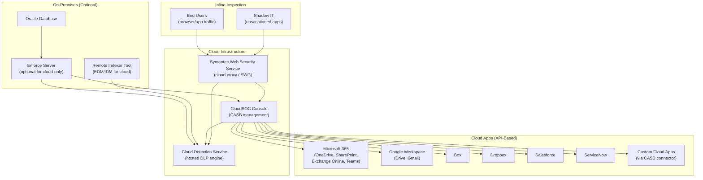

# Cloud DLP — Complete Workflow
## Broadcom Symantec DLP (Enforce Server, version 16.x/25.x/26.x)

> **Capability:** Cloud DLP (CloudSOC/CASB Integration, Cloud Detection Service, API-based Scanning, Proxy-based Inspection, Cloud-Specific Response Actions)
> **Complexity Score:** MODERATE-COMPLEX
> **Evidence sources:** doc-corpus.md [S1-S28], video-intelligence.md [V1-V45], api-intelligence.md [API surfaces 1-6]

---

## Overview

Cloud DLP extends Symantec's data loss prevention into cloud applications and services -- scanning data stored in SaaS apps, monitoring data uploaded to cloud services, and enforcing DLP policies on cloud-based collaboration. Unlike endpoint DLP (which runs on the user's machine) or network DLP (which operates at infrastructure choke points), cloud DLP operates at the cloud service layer, inspecting data within the cloud application itself.

Symantec's cloud DLP architecture has two primary integration modes:

1. **API-based scanning (out-of-band)** -- Connect to sanctioned cloud apps (Office 365, Google Workspace, Box, Salesforce) via their APIs. Scan data at rest and in transit within the cloud app. This is the CloudSOC/CASB "Securlet" approach.

2. **Proxy-based inline inspection** -- Route cloud app traffic through a web proxy (Symantec Web Security Service / SWG). Inspect data in real-time as users interact with cloud apps. This catches both sanctioned and unsanctioned ("Shadow IT") apps.

Both modes use the **Cloud Detection Service (CDS)** -- a hosted DLP scanning engine that performs content inspection in the cloud, avoiding the latency and complexity of routing cloud traffic back to on-premises DLP appliances.

**How Symantec's cloud DLP differs from other products:**

| Aspect | Symantec Cloud DLP | Trellix Cloud DLP | Microsoft Purview |
|--------|-------------------|-------------------|-------------------|
| Architecture | CloudSOC CASB + CDS detection engine | Skyhigh CASB + DLP engine | Native in Microsoft 365 |
| API scanning | 100+ cloud apps via Securlets | 30+ cloud apps | Microsoft 365 apps only (native) |
| Inline inspection | Proxy-based (SWG/WSS) | Proxy-based (SWG) | Microsoft Defender for Cloud Apps |
| Detection engine | Cloud-hosted DLP (CDS) -- same detection technologies as on-prem | Skyhigh DLP engine | SIT + trainable classifiers |
| Policy unification | Enforce Server policies + CloudSOC profiles | Separate cloud and on-prem policies | Unified across Microsoft 365 |
| Shadow IT | Discovery via proxy traffic analysis | Cloud Registry with risk assessment | Cloud App Discovery via Defender |
| GenAI protection | DLP applied to GenAI tool submissions | Not yet available | Via Purview + Copilot integration |

[S1, S2, S11, S24, V8, V34, V35, V38]

---

## Complexity Score: MODERATE-COMPLEX

**Justification:**

1. **Dual integration modes** -- API-based (out-of-band) and proxy-based (inline) each have different configuration, coverage, and latency characteristics
2. **Cloud Detection Service architecture** -- hosted detection engine with its own policy profile management separate from on-prem Enforce
3. **Per-app configuration** -- each cloud app (O365, Google Workspace, Box, etc.) has its own API connector, permission requirements, and supported actions
4. **Policy federation** -- three policy sources (Enforce-managed, CloudSOC Securlet, DLP Profile) that can overlap or conflict
5. **Cloud-specific response actions** -- quarantine in cloud, revoke sharing, apply sensitivity label, two-factor authentication
6. **EDM/IDM index management** -- cloud indexes require Remote Indexer Tool to convert on-prem indexes to cloud-compatible format

[S1, S2, S11, S24]

---

## Configuration Dependency Graph



---

## Workflow Phases

### Phase 1: CloudSOC / CASB Architecture

CloudSOC is Symantec's Cloud Access Security Broker (CASB) platform. It provides the management console for cloud DLP, integrates with cloud app APIs, and orchestrates DLP scanning via the Cloud Detection Service.

#### Deployment Models

| Model | Description | Use Case | Evidence |
|-------|-------------|----------|----------|
| **Cloud-only** | CloudSOC + CDS, no on-prem Enforce | Organizations with no on-prem DLP deployment | A [S11, S24] |
| **Hybrid** | CloudSOC + CDS + on-prem Enforce | Organizations with existing on-prem DLP extending to cloud | A [S1, S2, S24] |
| **Enforce-managed cloud** | Enforce Server manages cloud policies via CDS | Unified policy management from a single console | A [S1, S2] |

#### CloudSOC Console Overview

```
+=========================================================================+
|  CloudSOC Console (app.elastica.net)                                     |
+=========================================================================+
|  [Dashboard] [Protect] [Detect] [Investigate] [Admin]                   |
+-------------------------------------------------------------------------+
|  Protect > DLP Configuration                                             |
|                                                                         |
|  DLP Mode:                                                               |
|    [x] Cloud Detection Service enabled                                   |
|    [x] Enforce-managed policies (hybrid)                                 |
|    [x] CloudSOC Securlet policies                                        |
|                                                                         |
|  Connected Apps:                                                         |
|  +-------------------------------------------------------------------+ |
|  | App                | Status      | Mode       | Last Scan         | |
|  |--------------------|-------------|------------|-------------------| |
|  | Microsoft 365      | Connected   | API + Proxy| 2025-05-21 04:00  | |
|  | Google Workspace   | Connected   | API        | 2025-05-21 04:15  | |
|  | Box Enterprise     | Connected   | API        | 2025-05-20 22:00  | |
|  | Dropbox Business   | Connected   | API        | 2025-05-20 23:00  | |
|  | Salesforce         | Connected   | API        | 2025-05-21 01:00  | |
|  +-------------------------------------------------------------------+ |
|                                                                         |
|  DLP Profiles:                                                           |
|  +-------------------------------------------------------------------+ |
|  | Profile Name          | Rules | Apps Applied    | Last Modified    | |
|  |-----------------------|-------|-----------------|------------------| |
|  | PCI-Cloud-Protect     | 3     | All connected   | 2025-05-18       | |
|  | HIPAA-Cloud-Monitor   | 5     | O365, GWS       | 2025-05-15       | |
|  | Source-Code-Protect   | 2     | All connected   | 2025-05-10       | |
|  +-------------------------------------------------------------------+ |
|                                                                         |
+=========================================================================+
```

[S1, S2, S11, S24, V8, V34] Evidence: A

---

### Phase 2: API-Based Scanning (Sanctioned Apps)

API-based scanning connects CloudSOC to sanctioned cloud applications via their native APIs. This approach scans data already stored in the cloud app (data at rest) and monitors new data as it is created or uploaded (near-real-time).

#### How API-Based Scanning Works

```
API-Based Scanning Flow:

  1. Admin authorizes CloudSOC to access cloud app API
     (OAuth consent, service account, API key)

  2. CloudSOC Securlet connects to cloud app
     (Microsoft Graph API, Google API, Box API, etc.)

  3. Securlet enumerates content:
     - Files in OneDrive/SharePoint/Drive/Box
     - Email messages in Exchange Online/Gmail
     - Chat messages in Teams
     - Records in Salesforce

  4. Content sent to Cloud Detection Service (CDS) for DLP scanning

  5. CDS evaluates content against DLP profiles/policies

  6. If violation detected:
     a. Incident created in CloudSOC (and optionally in Enforce)
     b. Cloud-specific response action applied:
        - Quarantine file in cloud
        - Revoke sharing links
        - Apply sensitivity label
        - Notify file owner
        - Two-factor authentication enforcement
```

#### Supported Cloud Apps (API-Based)

| Cloud App | Content Types | API Used | Actions Available | Evidence |
|-----------|--------------|----------|-------------------|----------|
| **Microsoft 365 - OneDrive** | Files, folders | Microsoft Graph API | Quarantine, revoke sharing, label, notify | A [S1, S2, S24] |
| **Microsoft 365 - SharePoint** | Documents, libraries, sites | Microsoft Graph API | Quarantine, revoke sharing, label, notify | A [S1, S2, S24] |
| **Microsoft 365 - Exchange Online** | Email messages, attachments | Microsoft Graph API / EWS | Quarantine, notify, label | A [S1, S2, S24] |
| **Microsoft 365 - Teams** | Chat messages, shared files | Microsoft Graph API | Notify, quarantine shared files | A [S2, S24] |
| **Google Workspace - Drive** | Files, shared drives | Google Drive API | Quarantine, revoke sharing, notify | A [S1, S24] |
| **Google Workspace - Gmail** | Email messages, attachments | Gmail API | Quarantine, notify | A [S1, S24] |
| **Box** | Files, folders, shared links | Box API | Quarantine, revoke sharing, notify | A [S1, S24] |
| **Dropbox** | Files, folders, shared links | Dropbox API | Quarantine, revoke sharing, notify | A [S1, S24] |
| **Salesforce** | Records, attachments, files | Salesforce REST API | Quarantine, notify | A [S1, S24] |
| **ServiceNow** | Attachments, records | ServiceNow API | Quarantine, notify | B [S24] |
| **Custom Apps** | Via CASB connector framework | App-specific APIs | Varies by connector | B [S24] |

[S1, S2, S24, V8, V34, V38] Evidence: A

---

### Phase 3: Per-App Configuration

#### Microsoft 365 Configuration

**Navigation:** CloudSOC > Admin > App Connectors > Microsoft 365

```
+=========================================================================+
|  CloudSOC > App Connectors > Microsoft 365                               |
+=========================================================================+
|                                                                         |
|  Connection Status:    Connected (OAuth2 authorized)                     |
|  Tenant:               corp.onmicrosoft.com                              |
|  Last Sync:            2025-05-21 04:00 AM                              |
|                                                                         |
|  Authorization:                                                          |
|    Auth type:          [OAuth2 (Global Admin consent)       v]          |
|    Application ID:     [a1b2c3d4-e5f6-7890-abcd-ef1234567890]          |
|    Tenant ID:          [12345678-abcd-ef01-2345-6789abcdef01 ]          |
|    Permissions granted:                                                  |
|      [x] Files.Read.All (read all OneDrive/SharePoint files)            |
|      [x] Mail.Read (read Exchange Online email)                         |
|      [x] Chat.Read.All (read Teams chat messages)                       |
|      [x] Sites.Read.All (read SharePoint sites)                        |
|      [x] User.Read.All (read user profiles for identity)               |
|                                                                         |
|  Scan Scope:                                                             |
|    OneDrive:           [x] Scan all user OneDrive accounts              |
|    SharePoint:         [x] Scan all site collections                    |
|    Exchange Online:    [x] Scan all mailboxes                           |
|    Teams:              [x] Scan Teams file shares                       |
|                                                                         |
|  Scan Frequency:                                                         |
|    Real-time events:   [x] Monitor new/modified files in near-real-time |
|    Full rescan:        [Weekly, Sunday 3:00 AM               v]         |
|    Incremental:        [x] Only scan new/modified content               |
|                                                                         |
|  DLP Profiles Applied:                                                   |
|    [x] PCI-Cloud-Protect                                                |
|    [x] HIPAA-Cloud-Monitor                                              |
|    [x] Source-Code-Protect                                              |
|                                                                         |
+=========================================================================+
```

| Field | Type | Description | Evidence |
|-------|------|-------------|----------|
| Auth type | Dropdown | OAuth2 (recommended), Service Principal, or Delegated | A [S24] |
| Application ID | Text | Azure AD application registration ID | A [S24] |
| Tenant ID | Text | Azure AD tenant ID | A [S24] |
| Permissions | Checkboxes | Microsoft Graph API permissions (configured in Azure AD) | A [S24] |
| Real-time events | Checkbox | Near-real-time monitoring via Microsoft Graph change notifications | A [S24] |
| Full rescan | Schedule | Periodic full scan for catch-up | A [S24] |

**Example 1 -- Detect PCI data in OneDrive:**
DLP profile "PCI-Cloud-Protect" applied to all OneDrive accounts. When an employee uploads a spreadsheet containing credit card numbers to OneDrive, the CDS scanner detects the violation within minutes (near-real-time). Response action: revoke any sharing links on the file and notify the file owner.

**Example 2 -- Monitor Teams file sharing:**
DLP profile "Source-Code-Protect" with VML source code profile applied to Teams. When a developer shares a code file in a Teams channel, CDS scans the file. If it matches the source code VML profile, an incident is created and the shared file is quarantined from the Teams channel.

**Example 3 -- Scan Exchange Online for HIPAA compliance:**
DLP profile "HIPAA-Cloud-Monitor" applied to Exchange Online mailboxes. Full mailbox scan runs weekly. Emails containing 10+ SSNs or medical record identifiers generate incidents for compliance review.

[S1, S2, S24, V8] Evidence: A

---

#### Google Workspace Configuration

```
+=========================================================================+
|  CloudSOC > App Connectors > Google Workspace                            |
+=========================================================================+
|                                                                         |
|  Connection Status:    Connected (Service Account authorized)            |
|  Domain:               corp.example.com                                  |
|                                                                         |
|  Authorization:                                                          |
|    Auth type:          [Service Account (recommended)       v]          |
|    Service Account:    [dlp-scanner@corp.iam.gserviceaccount.com]       |
|    Domain-wide delegation: [x] Enabled                                   |
|    Scopes granted:                                                       |
|      [x] https://www.googleapis.com/auth/drive.readonly                 |
|      [x] https://www.googleapis.com/auth/gmail.readonly                 |
|                                                                         |
|  Scan Scope:                                                             |
|    Google Drive:       [x] All user drives + shared drives              |
|    Gmail:              [x] All mailboxes                                |
|                                                                         |
+=========================================================================+
```

**Example -- Detect sensitive data in Google Shared Drives:**
Apply PCI profile to Google Workspace. Shared Drives (formerly Team Drives) are scanned for documents containing customer financial data. Response: revoke external sharing and notify the drive owner.

[S1, S24] Evidence: A

---

#### Box / Dropbox Configuration

```
+=========================================================================+
|  CloudSOC > App Connectors > Box Enterprise                              |
+=========================================================================+
|                                                                         |
|  Connection Status:    Connected (Enterprise Admin authorized)           |
|  Enterprise ID:        12345678                                          |
|                                                                         |
|  Authorization:                                                          |
|    Auth type:          [JWT (Server Authentication)         v]          |
|    Client ID:          [abc123def456                         ]          |
|    Enterprise Admin:   [x] Admin approved in Box Admin Console          |
|                                                                         |
|  Scan Scope:                                                             |
|    [x] All managed user accounts                                         |
|    [x] Shared folders                                                    |
|    [x] External collaborations                                           |
|                                                                         |
+=========================================================================+
```

**Example -- Quarantine externally shared sensitive files in Box:**
DLP profile detects customer PII (EDM match) in files shared externally via Box shared links. Response: quarantine file (move to admin-controlled quarantine folder in Box), remove external shared link, notify file owner.

[S1, S24] Evidence: A

---

#### Salesforce Configuration

```
+=========================================================================+
|  CloudSOC > App Connectors > Salesforce                                  |
+=========================================================================+
|                                                                         |
|  Connection Status:    Connected (Connected App authorized)              |
|  Instance:             corp.my.salesforce.com                            |
|                                                                         |
|  Authorization:                                                          |
|    Auth type:          [Connected App (OAuth2)              v]          |
|    Consumer Key:       [abc123...                             ]          |
|    Callback URL:       [https://app.elastica.net/callback     ]         |
|                                                                         |
|  Scan Scope:                                                             |
|    [x] Attachments on records                                            |
|    [x] Salesforce Files (Content Library)                                |
|    [x] Chatter posts with attachments                                    |
|    [ ] Record field content (custom scan)                               |
|                                                                         |
+=========================================================================+
```

**Example -- Detect credit card data in Salesforce attachments:**
Support reps sometimes attach screenshots or documents containing customer credit card data to Salesforce cases. DLP profile scans attachments for credit card number matches. Response: quarantine attachment, notify case owner to remove sensitive data.

[S1, S24] Evidence: A

---

### Phase 4: Proxy-Based Inline Inspection

Proxy-based inspection routes user traffic through a web proxy (Symantec Web Security Service / SWG) that forwards content to the Cloud Detection Service for DLP scanning. This catches data in real-time as users upload or share data through cloud apps.

#### Architecture

```
Inline Inspection Flow:

  User Browser
       |
       v
  Cloud Proxy (Symantec WSS / SWG)
       |
  (1) User uploads file to cloud app
       |
  (2) Proxy intercepts upload
       |
  (3) Content forwarded to Cloud Detection Service (CDS)
       |
  (4) CDS evaluates against DLP profiles/policies
       |
  (5a) ALLOW: upload proceeds to cloud app
  (5b) BLOCK: proxy returns block page to user
  (5c) COACH: proxy shows coaching page (user can proceed)
       |
       v
  Cloud App (sanctioned or unsanctioned)
```

#### Proxy-Based vs API-Based Comparison

| Aspect | API-Based (Out-of-Band) | Proxy-Based (Inline) |
|--------|------------------------|---------------------|
| Timing | Near-real-time (minutes after upload) | Real-time (intercepts during upload) |
| Data at rest | Yes (scans existing data) | No (only sees new traffic) |
| Sanctioned apps | Yes (requires API connector) | Yes (any app through proxy) |
| Unsanctioned apps | No | Yes (Shadow IT detection) |
| Response actions | Cloud-native (quarantine, revoke sharing) | Proxy-native (block, coach, allow) |
| HTTPS inspection | Not needed (API access is authenticated) | Requires proxy SSL inspection |
| Coverage | Deep (all data in app) | Limited to web traffic (misses API-to-API transfers) |

**Example 1 -- Block sensitive uploads to unsanctioned cloud storage:**
User attempts to upload a customer database export to a personal Dropbox account via browser. The proxy routes the upload through CDS. DLP profile detects PII. Response: Block upload. User sees: "Upload blocked -- this content contains customer data and cannot be uploaded to unauthorized cloud storage."

**Example 2 -- Coach users on GenAI submissions:**
User pastes proprietary source code into ChatGPT. The proxy intercepts the form submission. CDS detects VML source code match. Response: Coach page: "You are about to submit content that matches our source code protection policy. Please confirm this does not contain proprietary code." User can choose to proceed (with justification logged) or cancel.

**Example 3 -- Shadow IT discovery:**
Proxy logs all cloud app traffic. CloudSOC analyzes traffic patterns and identifies 47 unsanctioned cloud apps being used by employees. Cloud Risk Assessment rates each app's security posture. Admin can create policies to block high-risk unsanctioned apps or coach users to use approved alternatives.

[S1, S2, S24, V34, V35, V36] Evidence: A

---

### Phase 5: Cloud Detection Service (CDS) Architecture

The Cloud Detection Service is the engine that performs DLP content inspection in the cloud. It hosts the same detection technologies as on-prem DLP (DCM, EDM, IDM, VML) but runs as a cloud-hosted service.

```
CDS Architecture:

  Policy Sources:
    +------------------+     +------------------+     +------------------+
    | Enforce Server   |     | CloudSOC         |     | DLP Profiles     |
    | Managed Policies |     | Securlet Policies|     | (Cloud-native)   |
    +--------+---------+     +--------+---------+     +--------+---------+
             |                        |                        |
             +------------------------+------------------------+
                                      |
                              +-------v-------+
                              | Cloud Detection|
                              | Service (CDS)  |
                              | - DCM Engine   |
                              | - EDM Engine   |
                              | - IDM Engine   |
                              | - VML Engine   |
                              | - OCR Engine   |
                              +-------+-------+
                                      |
                      +---------------+---------------+
                      |               |               |
               +------v-----+  +-----v------+  +-----v------+
               | API Scan   |  | Proxy Scan |  | Email Scan |
               | (Securlet) |  | (SWG/WSS)  |  | (Cloud     |
               |            |  |            |  |  Email DLP) |
               +------------+  +------------+  +------------+
```

#### CDS Policy Sources

| Source | Description | Configuration | Evidence |
|--------|-------------|---------------|----------|
| **Enforce-managed** | Policies created in on-prem Enforce and deployed to CDS | Enforce > Policy Groups > assign CDS | A [S1, S2] |
| **CloudSOC Securlet** | Policies created in CloudSOC for specific cloud apps | CloudSOC > Protect > Securlet Policies | A [S24] |
| **DLP Profiles** | Cloud-native DLP profiles with rules and data identifiers | CloudSOC > Protect > DLP Profiles (or via API) | A [S24, API-intelligence] |

**EDM/IDM for Cloud:**
Cloud EDM and IDM profiles require the **Remote Indexer Tool** to convert on-prem data source indexes into cloud-compatible format:

```
1. Create EDM/IDM profile on-prem (Enforce console)
2. Run Remote Indexer Tool to generate cloud-compatible index file
3. Upload index file to CloudSOC
4. Add index to DLP Profile in CloudSOC
5. CDS uses the cloud index for detection
```

[S1, S2, S11, S24] Evidence: A

---

### Phase 6: Cloud-Specific Response Actions

Cloud DLP response actions differ from on-prem actions because they operate within the cloud application's permission model.

| Action | Description | Supported Apps | Evidence |
|--------|-------------|---------------|----------|
| **Quarantine in Cloud** | Move file to admin-controlled quarantine location within the cloud app | OneDrive, SharePoint, Box, Dropbox, Google Drive | A [S1, S2, S24] |
| **Revoke Sharing** | Remove shared links and external collaborator access from a file | OneDrive, SharePoint, Box, Dropbox, Google Drive | A [S1, S2, S24] |
| **Apply Sensitivity Label** | Apply MIP/AIP sensitivity label to the file | OneDrive, SharePoint (MIP integration) | A [S1, S2, S3] |
| **Notify File Owner** | Send email or in-app notification to the file owner | All connected apps | A [S1, S24] |
| **Notify Admin** | Send notification to DLP admin or compliance team | All apps | A [S1, S24] |
| **Two-Factor Authentication** | Require 2FA for users accessing the flagged content | CloudSOC-managed apps | A [S1] |
| **Block (Proxy)** | Block the upload/download at the proxy level | All apps (via proxy inline mode) | A [S1, S24] |
| **Coach (Proxy)** | Show coaching page with justification prompt | All apps (via proxy inline mode) | A [S24] |
| **Encrypt** | Apply encryption to the file in the cloud | Apps with MIP/RMS integration | A [S1, S2] |

**Example 1 -- Quarantine + revoke sharing on OneDrive:**
Employee shares a spreadsheet containing customer SSNs via OneDrive external sharing link. DLP detects the violation. Response: (a) File moved to OneDrive quarantine folder accessible only to admin, (b) external sharing link removed, (c) employee notified via email with policy explanation.

**Example 2 -- Apply MIP "Highly Confidential" label:**
DLP detects financial report (IDM match) uploaded to SharePoint without a classification label. Response: automatically apply MIP "Highly Confidential" label. This triggers MIP encryption and access control restrictions.

**Example 3 -- Two-factor authentication enforcement:**
DLP detects high-severity incident (50+ PII matches in a single file). Response: enforce 2FA for the user's next access to the cloud app, ensuring the account is not compromised.

[S1, S2, S24] Evidence: A

---

### Phase 7: Cloud DLP vs On-Prem DLP -- Policy Sharing

Cloud DLP and on-prem DLP can share policies, but there are important differences in how policies are applied and managed.

#### Shared Policy Model

```
Unified Policy Approach:

  Enforce Server (on-prem):
    - Creates policies with detection rules
    - Deploys to on-prem detection servers (Network, Endpoint)
    - ALSO deploys to Cloud Detection Service (CDS)
    - Same policy evaluated on-prem AND in cloud

  CloudSOC (cloud):
    - Creates DLP Profiles (cloud-native policies)
    - Can import on-prem policies via XML export/import
    - DLP Profiles evaluated by CDS
    - Separate from Enforce-managed policies

  Coexistence:
    - Both Enforce-managed and CloudSOC policies can run simultaneously
    - If same content matches both, two incidents may be generated
    - Response actions from each policy source are applied independently
```

#### Policy Sharing Limitations

| Limitation | Impact | Workaround | Evidence |
|-----------|--------|-----------|----------|
| EDM/IDM profiles must be converted for cloud use | Profile indexes are not directly portable | Use Remote Indexer Tool to create cloud-compatible indexes | A [S1, S24] |
| Response rules differ between cloud and on-prem | Cloud has quarantine/revoke-sharing; on-prem has ICAP block | Create cloud-specific response rules | A [S1, S24] |
| VML profiles must be re-trained for cloud CDS | On-prem VML models are not directly portable | Re-train VML or use policy import/export (XML) | B [S1, S24] |
| CloudSOC DLP Profiles use a different rule format | Not 1:1 compatible with Enforce policies | CloudSOC API allows profile creation with rules and data identifiers | A [S24, API-intelligence] |

[S1, S2, S24] Evidence: A

---

### Phase 8: Shadow IT Detection

Shadow IT discovery uses proxy traffic analysis to identify unsanctioned cloud applications in use within the organization.

```
+=========================================================================+
|  CloudSOC > Detect > Cloud App Discovery                                 |
+=========================================================================+
|                                                                         |
|  Cloud Apps Discovered: 147                                              |
|  Sanctioned: 12     Unsanctioned: 135                                   |
|                                                                         |
|  Risk Distribution:                                                      |
|    High Risk:    23 apps (personal cloud storage, file sharing)         |
|    Medium Risk:  58 apps (collaboration, project management)            |
|    Low Risk:     64 apps (news, weather, utility)                       |
|                                                                         |
|  Top Unsanctioned Apps by Usage:                                         |
|  +-------------------------------------------------------------------+ |
|  | App              | Category       | Risk  | Users | Data Volume   | |
|  |------------------|----------------|-------|-------|---------------| |
|  | Personal Dropbox | Cloud Storage  | HIGH  | 234   | 45 GB/month   | |
|  | WeTransfer       | File Transfer  | HIGH  | 89    | 12 GB/month   | |
|  | ChatGPT          | GenAI          | HIGH  | 412   | 2 GB/month    | |
|  | Notion           | Collaboration  | MED   | 156   | 8 GB/month    | |
|  | Trello           | Project Mgmt   | LOW   | 203   | 1 GB/month    | |
|  +-------------------------------------------------------------------+ |
|                                                                         |
|  Actions:                                                                |
|    [Block App]  [Coach Users]  [Mark as Sanctioned]  [View Details]    |
|                                                                         |
+=========================================================================+
```

**Example 1 -- Block personal Dropbox, redirect to corporate OneDrive:**
Shadow IT discovery reveals 234 users using personal Dropbox. Admin creates proxy policy: block uploads to `dropbox.com` when user is not on the corporate Dropbox Business account. Coach page redirects users to corporate OneDrive.

**Example 2 -- Monitor ChatGPT usage with DLP:**
Shadow IT discovery reveals 412 users submitting content to ChatGPT. Instead of blocking (which drives users to mobile devices), admin applies DLP profile to ChatGPT traffic via proxy. Sensitive content is blocked; non-sensitive queries are allowed with logging.

[S24, V34, V35, V36] Evidence: A

---

## End-to-End Example: Connecting O365 + Enabling DLP on OneDrive

**Scenario:** Connect Microsoft 365 to CloudSOC and enable DLP scanning on all OneDrive accounts to detect and quarantine files containing PCI data.

### Step 1: Register Application in Azure AD
1. Navigate to Azure AD > App Registrations > New Registration
2. Name: "Symantec CloudSOC DLP"
3. Supported account types: Single tenant
4. Redirect URI: `https://app.elastica.net/callback`
5. Grant API permissions: Files.Read.All, Mail.Read, Sites.Read.All, User.Read.All
6. Admin consent: Grant admin consent for the organization
7. Generate client secret and save

### Step 2: Connect O365 in CloudSOC
1. Navigate to CloudSOC > Admin > App Connectors > Add App > Microsoft 365
2. Enter Application ID, Tenant ID, Client Secret from Step 1
3. Test connection
4. Enable scan scope: OneDrive (all users)

### Step 3: Create DLP Profile
1. Navigate to CloudSOC > Protect > DLP Profiles > New Profile
2. Profile name: "PCI-OneDrive-Protect"
3. Add rule: Data Identifier > Credit Card Number (Luhn)
4. Minimum matches: 1
5. Severity: High
6. Save profile

### Step 4: Configure Response Actions
1. In the DLP Profile, add response actions:
   - Quarantine file (move to admin quarantine folder in OneDrive)
   - Revoke sharing (remove all external sharing links)
   - Notify file owner (email with policy explanation)
2. Save

### Step 5: Apply Profile to O365 Connector
1. Navigate to CloudSOC > Protect > App Policies
2. Assign "PCI-OneDrive-Protect" profile to Microsoft 365 connector
3. Enable real-time event monitoring
4. Enable weekly full rescan

### Step 6: Verify Detection
1. Upload a test file containing credit card numbers to OneDrive
2. Wait 5-15 minutes for CDS to scan the file
3. Check CloudSOC > Investigate > Incidents for the detection
4. Verify file has been quarantined and sharing links removed

[S1, S2, S24, V8] Evidence: A

---

## Summary

Cloud DLP in Symantec extends data loss prevention into SaaS applications via two complementary approaches: API-based scanning for deep coverage of sanctioned apps and proxy-based inline inspection for real-time coverage of all cloud traffic including unsanctioned Shadow IT. The Cloud Detection Service provides the same detection technologies (DCM, EDM, IDM, VML, OCR) in a cloud-hosted engine, avoiding the latency of routing cloud traffic back to on-premises infrastructure. Cloud-specific response actions (quarantine in cloud, revoke sharing, apply sensitivity labels) operate within the cloud application's permission model, providing enforcement that is native to the cloud environment.

[S1, S2, S11, S24, V8, V34, V35, V36, V38] Evidence: A
