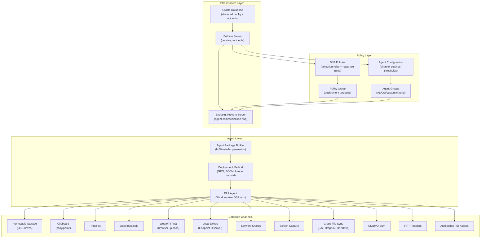

# Endpoint DLP — Complete Workflow
## Broadcom Symantec DLP (Enforce Server, version 16.x/25.x/26.x)

> **Capability:** Endpoint DLP (Agent Deployment, Detection Channels, Response Actions, Agent Configuration, Agent Groups)
> **Complexity Score:** COMPLEX
> **Evidence sources:** doc-corpus.md [S1-S28], video-intelligence.md [V1-V45], api-intelligence.md [API surfaces 1-6]

---

## Overview

Endpoint DLP is the enforcement layer that operates directly on the user's machine -- laptop, desktop, or virtual desktop. Unlike network DLP (which sees traffic flowing across the wire) or cloud DLP (which scans cloud app content), endpoint DLP intercepts data operations at the operating system level: file copies to USB drives, clipboard operations between applications, email attachments composed in Outlook, print jobs sent to local or network printers, web uploads from the browser, and screen capture attempts.

Symantec DLP's endpoint architecture consists of three components: the **Endpoint Prevent Server** (a detection server type that manages agent communication), the **DLP Agent** (lightweight software on each endpoint), and the **Enforce Server** (where policies are authored and incidents reported). The agent checks in with the Endpoint Prevent Server at **15-minute intervals** to receive policy updates, upload incident data, and report status. Between check-ins, the agent enforces the most recently cached policy set locally.

**How Symantec's endpoint DLP differs from other products:**

| Aspect | Symantec DLP Endpoint | Trellix DLP Endpoint | Microsoft Purview Endpoint |
|--------|----------------------|---------------------|---------------------------|
| Agent model | Standalone agent with 15-min server sync | ePO-managed agent (ePO dependency) | Built into Windows Defender |
| Channel coverage | 12+ channels (USB, clipboard, print, screen capture, web, email, local drives, network shares, CD/DVD, cloud file sync, AirDrop/BT) | USB, clipboard, print, web, email, network shares, cloud sync | USB, clipboard, print, browser upload, file access |
| Offline enforcement | Full policy cached locally; enforcement continues offline | Requires ePO connectivity for policy updates | Requires Defender connectivity |
| OS coverage | Windows (full), macOS (partial), Linux (Discover only) | Windows (full), macOS (partial) | Windows (full), macOS (partial) |
| Detection on endpoint | Full DCM, EDM, IDM, VML at agent level | Full classification scanning | SIT + trainable classifiers |
| User justification | Built-in "User Cancel" action with justification capture | Custom dialog (requires ePO config) | Built-in "override" with business justification |
| Browser monitoring | Browser extension + content analysis connector (Chrome, Edge, Firefox) | McAfee WebAdvisor / browser extension | Built into Edge; extension for Chrome |

[S1, S2, S4, V12, V15, V23, V29]

---

## Complexity Score: COMPLEX

**Justification:**

1. **12+ distinct detection channels** -- each channel (USB, clipboard, print, email, web, etc.) has its own agent configuration settings, response action compatibility, and OS coverage matrix
2. **Agent deployment logistics** -- agent package building, GPO/SCCM/Intune distribution, server addressing decisions, certificate management
3. **Offline behavior model** -- policies cached locally, incidents queued until next server contact, offline prevention rules differ from online rules
4. **Multi-OS support matrix** -- Windows has full channel coverage, macOS is partial, Linux is Discover-only; channel availability varies by OS
5. **Agent group targeting** -- different policies and configurations applied to different agent groups based on AD/OU/custom criteria
6. **Performance tuning** -- each channel has performance implications; monitoring all channels simultaneously degrades endpoint performance
7. **Browser integration complexity** -- content analysis connectors for Chrome, Edge, Firefox work differently; extension vs native API integration
8. **API gap** -- DLP agent deployment and configuration are console-only operations; no REST API for agent management

[S1, S2, S4, API-intelligence]

---

## Configuration Dependency Graph



---

## Workflow Phases

### Phase 1: Endpoint Server Setup

Before deploying any agents, at least one Endpoint Prevent Server must be installed and registered with the Enforce Server. This server acts as the communication hub for all endpoint agents.

**Navigation:** System > Servers and Detectors > Overview

**Steps:**

1. **Install Endpoint Prevent Server** on a dedicated Windows Server or Linux host
   - Follow the Installation Guide for your OS (S19 for Linux, S20 for Windows)
   - During installation, provide the Enforce Server hostname and port
   - The installer registers the detection server with Enforce
2. **Verify registration** in the Enforce console
   - Navigate to **System > Servers and Detectors > Overview**
   - Confirm the Endpoint Prevent Server appears with status "Running"
3. **Plan server topology** for enterprise deployments:

```
Corporate LAN:
  +------------------+     +------------------+
  | Endpoint Server  |     | Endpoint Server  |
  | (Primary LAN)    |     | (Secondary LAN)  |
  +--------+---------+     +--------+---------+
           |                        |
    LAN Agents connect       LAN Agents failover
           |                        |
           +--------+------+--------+
                    |
            +-------+-------+
            | Enforce Server |
            +-------+-------+
                    |
           +--------+------+--------+
           |                        |
  +--------+---------+     +--------+---------+
  | Endpoint Server  |     | Endpoint Server  |
  | (Primary DMZ)    |     | (Secondary DMZ)  |
  +------------------+     +------------------+
           |                        |
    Remote agents via         Remote agents
    load balancer              failover

    Load Balancer Config:
    - Source IP persistence = 24 hours (CRITICAL)
    - Health check on Endpoint Server port
```

**CRITICAL:** If deploying multiple Endpoint Servers behind a load balancer, set "Source IP persistence" to 24 hours. Without this, agents may report to different servers between check-ins, causing split incident data. [S1, V-tribal, KB173958]

4. **Assign to a policy group** -- navigate to System > Servers and Detectors > Policy Groups, ensure the Endpoint Server is assigned to the correct group

[S1, S4, V10, V11, KB173958] Evidence: A

---

### Phase 2: Agent Package Building

The DLP Agent package is built using the Enforce Server console or the standalone Agent Package Builder tool. The package is an MSI (Windows) or installer package (macOS/Linux) that contains the Endpoint Server address, certificates, and initial configuration.

**Navigation:** System > Agents > Agent Packages (or standalone Agent Package Builder tool)

**Steps:**

1. **Open the Agent Package Builder** -- available from the Enforce console or as a standalone tool
2. **Configure the Endpoint Server address:**

```
+=========================================================================+
|  Agent Package Builder                                                   |
+=========================================================================+
|                                                                         |
|  Endpoint Server Address Type:                                          |
|    (o) FQDN     ( ) Hostname     ( ) IP Address                        |
|                                                                         |
|  Server Address:  [dlp-endpoint01.corp.example.com  ]                   |
|  Server Port:     [443                               ]                  |
|                                                                         |
|  Agent Platform:                                                        |
|    (o) Windows x64     ( ) Windows ARM64 (25.1+)                       |
|    ( ) macOS            ( ) Linux                                       |
|                                                                         |
|  Package Name:    [DLP_Agent_Windows_x64             ]                  |
|                                                                         |
|                                                [Build Package]          |
+=========================================================================+
```

| Field | Description | Recommendation | Evidence |
|-------|-------------|----------------|----------|
| Address Type | How agent resolves Endpoint Server | **FQDN recommended** -- survives IP changes and server migrations | B [V29, V-tribal] |
| Server Address | FQDN, hostname, or IP of Endpoint Server | Must be reachable from all agent locations (LAN + VPN + DMZ) | A [S1, V12] |
| Server Port | TLS communication port | Default: 443. Must be open through firewalls. | A [S1] |
| Agent Platform | Target OS architecture | Match to endpoint fleet. ARM64 Windows 11 supported from DLP 25.1. | A [S2] |

3. **Build the package** -- the tool generates an MSI file (Windows) or platform-specific installer
4. **Store the package** on a network share accessible by your deployment tool

**CRITICAL:** The address type and server address are **baked into the agent package at build time**. Changing the Endpoint Server address later requires building and deploying a NEW agent package. Plan your addressing strategy (FQDN recommended) before building packages. [V29, V-tribal]

[S1, S4, V12, V29, V30] Evidence: A

---

### Phase 3: Agent Deployment

Multiple deployment methods are available. The choice depends on your endpoint management infrastructure.

#### Method 1: Group Policy (GPO) Deployment

**Best for:** Windows-only environments with Active Directory

```
Steps:
1. Copy MSI to a network share accessible by all domain computers
   \\fileserver\DLP_Agents\DLP_Agent_Windows_x64.msi

2. Open Group Policy Management Console (GPMC)
   Group Policy Management > Forest > Domains > [domain]

3. Create or edit a GPO linked to target OUs
   Right-click OU > "Create a GPO in this domain, and Link it here"
   Name: "DLP Agent Deployment"

4. Edit GPO > Computer Configuration > Software Installation
   Right-click > New > Package
   Browse to \\fileserver\DLP_Agents\DLP_Agent_Windows_x64.msi
   Select "Assigned" (installs at next boot)

5. Alternatively, use a Startup Script for more control:
   Computer Configuration > Windows Settings > Scripts > Startup
   Add script: install_agent.bat
   Contents:
     @echo off
     if not exist "C:\Program Files\Symantec\DLP Agent" (
       msiexec /i \\fileserver\DLP_Agents\DLP_Agent_Windows_x64.msi /qn
     )

6. Apply to target OU(s) -- start with IT department OU first
7. Force gpupdate on test machines: gpupdate /force
8. Reboot to trigger installation
```

[V30] Evidence: A

#### Method 2: SCCM/Intune Deployment

**Best for:** Enterprise environments with Microsoft Endpoint Manager

```
Steps:
1. Import MSI into SCCM as an Application
2. Create deployment targeting a test device collection
3. Set deployment purpose to "Required" (auto-install)
4. Monitor deployment in SCCM Monitoring workspace
5. Expand to production device collections after validation
```

#### Method 3: Manual Installation

**Best for:** Lab environments, POC testing, small deployments

```
Steps:
1. Copy MSI to target machine
2. Run from elevated command prompt:
   msiexec /i DLP_Agent_Windows_x64.msi /qn
3. Verify installation:
   - Check Services for "Symantec DLP Agent"
   - Check Enforce console: System > Agents > Overview
```

#### Method 4: Cloud-Managed Deployment (CloudSOC)

**Best for:** Remote workforce, cloud-first organizations

```
Steps:
1. In CloudSOC console: Admin > DLP Configuration
2. Enable Cloud Managed Endpoint
3. Generate cloud agent package
4. Distribute via cloud deployment mechanism (Intune, Jamf, etc.)
5. Agents register with Cloud Detection Service instead of on-prem Endpoint Server
```

[V8, V29, V30] Evidence: A-B

#### Verifying Agent Registration

After deployment, verify agents have registered successfully.

**Navigation:** System > Agents > Overview

```
+=========================================================================+
|  System > Agents > Overview                                              |
+=========================================================================+
|  Total Agents: 1,247    Online: 1,189    Offline: 58                    |
|                                                                         |
|  Filter: [All Groups v]  [All Statuses v]  [Search: ________]           |
|                                                                         |
|  +-------------------------------------------------------------------+ |
|  | Hostname         | User       | IP           | Status | Last Seen  | |
|  |------------------|------------|--------------|--------|------------| |
|  | WS-FINANCE-001   | jsmith     | 10.1.50.101  | Online | 2 min ago  | |
|  | WS-FINANCE-002   | jdoe       | 10.1.50.102  | Online | 5 min ago  | |
|  | LT-EXEC-015      | cjohnson   | 192.168.1.45 | Online | 12 min ago | |
|  | WS-DEV-042       | agarcia    | 10.2.10.42   | Offline| 3 days ago | |
|  | MAC-DESIGN-001   | klee       | 10.3.5.20    | Online | 8 min ago  | |
|  +-------------------------------------------------------------------+ |
|  Showing 1-5 of 1,247                    [< Prev] [1] [2] ... [Next >] |
+=========================================================================+
```

| Column | Description | Evidence |
|--------|-------------|----------|
| Hostname | Machine name from OS | A [S1] |
| User | Currently logged-in user (from AD SID) | A [S1] |
| IP | Current IP address | A [S1] |
| Status | Online (checked in within 15 min) or Offline | A [S1] |
| Last Seen | Time since last check-in | A [S1] |

[S1, S4, V12] Evidence: A

---

### Phase 4: Endpoint Detection Channels

Each endpoint detection channel monitors a specific data egress path on the user's machine. Channels are enabled/disabled per agent configuration, and policies define what content to detect on each channel.

#### Channel 1: Email (Outlook)

**What it monitors:** Email messages composed in Microsoft Outlook -- subject, body, and attachments. Detects sensitive content before the email leaves the endpoint.

**Navigation (Agent Config):** System > Agents > Agent Configuration > [config] > Channels > Email

```
+=========================================================================+
|  Agent Configuration: Default Config                                     |
+=========================================================================+
|  [General] [Channels] [Advanced]                               [Save]   |
+-------------------------------------------------------------------------+
|  Channels > Email (Outlook)                                             |
|                                                                         |
|  Enable Email Monitoring:     [x] Enabled                               |
|  Monitor Mode:                (o) Monitor and Prevent                    |
|                               ( ) Monitor Only                          |
|  Outlook Integration:         [x] Outlook Add-in                        |
|  Lotus Notes Integration:     [ ] Notes Add-in (Windows only)           |
|  Monitor Personal Email:      [x] Detect personal webmail via browser   |
|                                                                         |
|  Content Inspection:                                                     |
|    Scan subject:              [x]                                        |
|    Scan body:                 [x]                                        |
|    Scan attachments:          [x]                                        |
|    Max attachment size (MB):  [50 ]                                      |
|                                                                         |
+=========================================================================+
```

| Field | Type | Default | Description | Evidence |
|-------|------|---------|-------------|----------|
| Enable Email Monitoring | Checkbox | Enabled | Master toggle for Outlook email channel | A [S1, S4] |
| Monitor Mode | Radio | Monitor and Prevent | "Monitor Only" generates incidents without blocking; "Monitor and Prevent" allows block/notify/encrypt actions | A [S1, S4] |
| Outlook Add-in | Checkbox | Enabled | Installs add-in for native Outlook integration | A [S1] |
| Lotus Notes Add-in | Checkbox | Disabled | Windows-only; monitors Lotus Notes email | A [S1] |
| Monitor Personal Email | Checkbox | Disabled | Detects personal webmail via browser channel integration | A [S1, S4] |
| Max attachment size | Number | 50 MB | Attachments above this size are not scanned (performance limit) | A [S1] |

**OS Coverage:** Windows (full), macOS (Outlook for Mac)

**Example 1 -- Block PCI data in Outlook:**
Policy: "PCI-DSS-Credit-Card-Endpoint" triggers when email body or attachments contain 1+ credit card numbers (Luhn-validated). Response rule: Endpoint Prevent Block with user notification "This email contains credit card data and has been blocked. Please remove the sensitive data and try again."

**Example 2 -- Notify on HIPAA data in email:**
Policy: "HIPAA-PHI-Email-Endpoint" triggers when attachments contain 5+ SSNs. Response rule: Endpoint Prevent Notify (popup warning without blocking). User can proceed after acknowledging.

**Example 3 -- Encrypt sensitive attachments:**
Policy: "Auto-Encrypt-Confidential" triggers on files tagged "Confidential" by MIP label. Response rule: Endpoint Prevent Encrypt -- applies encryption before email is sent.

**Gotcha:** The Outlook add-in can conflict with other Outlook add-ins (particularly older antivirus email scanners). If Outlook performance degrades after agent deployment, check for add-in conflicts in Outlook > File > Options > Add-ins. [V-tribal]

**API coverage:** No API for agent email channel configuration. Agent configuration is console-only. Detection results are exposed as incidents through the Enforce REST API. [API-intelligence]

[S1, S2, S4, V12, V23] Evidence: A

---

#### Channel 2: Web/HTTP(S)

**What it monitors:** Web uploads from browsers -- file uploads to cloud apps, web forms, webmail attachments. Uses browser extension (content analysis connector) or local web proxy to intercept HTTP/HTTPS traffic from the endpoint.

**Navigation (Agent Config):** System > Agents > Agent Configuration > [config] > Channels > Web/HTTP(S)

```
+=========================================================================+
|  Channels > Web/HTTP(S)                                                  |
+=========================================================================+
|                                                                         |
|  Enable Web Monitoring:       [x] Enabled                               |
|  Monitor Mode:                (o) Monitor and Prevent                    |
|                               ( ) Monitor Only                          |
|                                                                         |
|  Browser Integration:                                                    |
|    Content Analysis Connector: [x] Chrome                               |
|                                [x] Microsoft Edge                        |
|                                [x] Mozilla Firefox (16.0.1+)            |
|                                                                         |
|  HTTPS Inspection:            [x] Enabled (certificate required)        |
|  Cloud App Detection:         [x] Detect uploads to known cloud apps    |
|                                                                         |
|  URL Whitelisting:                                                       |
|    Whitelisted Domains:       [corporate-intranet.example.com    ]      |
|                               [trusted-partner.example.com        ]      |
|                               [                                   ]      |
|                                                                         |
|  Performance:                                                            |
|    Max file upload scan (MB): [100]                                      |
|    Scan timeout (seconds):    [30 ]                                      |
|                                                                         |
+=========================================================================+
```

| Field | Type | Default | Description | Evidence |
|-------|------|---------|-------------|----------|
| Enable Web Monitoring | Checkbox | Enabled | Master toggle for HTTP/HTTPS channel | A [S1, S4] |
| Content Analysis Connector | Checkboxes | Chrome, Edge | Browser-specific extensions for content inspection. Firefox added in 16.0.1. | A [S1, S6] |
| HTTPS Inspection | Checkbox | Enabled | Decrypts HTTPS traffic locally for content inspection. Requires trusted certificate. | A [S1] |
| Cloud App Detection | Checkbox | Enabled | Recognizes uploads to known SaaS apps (Google Drive, Dropbox, Box, etc.) | A [S1, S4] |
| URL Whitelisting | Text list | Empty | Domains excluded from web DLP scanning | A [S1] |
| Max file upload scan | Number | 100 MB | Uploads larger than this are not scanned | A [S1] |

**OS Coverage:** Windows (full), macOS (partial -- Chrome and Safari only in some versions)

**Example 1 -- Block sensitive uploads to personal cloud storage:**
Policy: "Block-Sensitive-Cloud-Upload" triggers when user uploads files containing 10+ PII records to non-corporate cloud domains. Response rule: Endpoint Prevent Block with notification "Upload to personal cloud storage blocked. Use corporate OneDrive instead."

**Example 2 -- Monitor GenAI tool submissions:**
Policy: "GenAI-Data-Monitor" triggers when user pastes content containing source code patterns or customer data into ChatGPT, Claude, or similar AI service URLs. Response rule: Endpoint Prevent Notify (user warned, can proceed with justification via User Cancel action).

**Example 3 -- Allow uploads to trusted partners:**
Policy: "Partner-Data-Share" has exception for `*.trustedpartner.com` domains. Detection rules for IP/source code still fire for all other web destinations.

**Gotcha:** Content analysis connectors for Chrome and Edge require browser extension installation. If your organization uses a locked-down browser profile that blocks extensions, you must whitelist the Symantec DLP extension ID in your Chrome/Edge admin policy. Firefox connector available from DLP 16.0.1+. [S6, V-tribal]

**Gotcha:** The re-architected browser monitoring in DLP 16.0 uses native browser APIs alongside extensions. This replaces the older local proxy approach. If upgrading from pre-16.0, test browser monitoring thoroughly as the detection mechanism has changed fundamentally. [S1, S6]

**API coverage:** No API for web channel configuration. [API-intelligence]

[S1, S2, S4, S6, V35, V36] Evidence: A

---

#### Channel 3: Removable Storage (USB)

**What it monitors:** File copies to USB drives, external hard drives, SD cards, and other removable media. Can block, encrypt, or monitor files written to removable devices. Supports device whitelisting by vendor ID, product ID, or serial number.

**Navigation (Agent Config):** System > Agents > Agent Configuration > [config] > Channels > Removable Storage

```
+=========================================================================+
|  Channels > Removable Storage (USB)                                      |
+=========================================================================+
|                                                                         |
|  Enable USB Monitoring:       [x] Enabled                               |
|  Monitor Mode:                (o) Monitor and Prevent                    |
|                               ( ) Monitor Only                          |
|                                                                         |
|  Device Control:                                                         |
|    Block all removable devices: ( ) Yes  (o) No (DLP scans content)     |
|    Whitelisted devices:                                                  |
|      Vendor ID:  [0781] Product ID: [5583] Serial: [*         ] (SanDisk)|
|      Vendor ID:  [0951] Product ID: [1666] Serial: [*         ] (Kingston)|
|      [+ Add Device]                                                      |
|                                                                         |
|  Content Scanning:                                                       |
|    Scan files written to USB:   [x]                                      |
|    Scan files read from USB:    [ ] (read monitoring)                    |
|    Max file size to scan (MB):  [200]                                    |
|                                                                         |
|  Encryption:                                                             |
|    Auto-encrypt on USB write:   [ ] (requires Endpoint Encryption)      |
|    Encryption provider:         [Symantec Endpoint Encryption    v]     |
|                                                                         |
+=========================================================================+
```

| Field | Type | Default | Description | Evidence |
|-------|------|---------|-------------|----------|
| Enable USB Monitoring | Checkbox | Enabled | Master toggle for removable storage channel | A [S1, S4] |
| Block all removable devices | Radio | No | If Yes, all USB writes are blocked regardless of content. If No, DLP scans content and applies policy-based actions. | A [S1] |
| Whitelisted devices | Device list | Empty | Devices identified by Vendor ID, Product ID, Serial Number that are exempt from DLP scanning | A [S1, S4] |
| Scan files written to USB | Checkbox | Enabled | Content inspection on file writes to removable media | A [S1] |
| Scan files read from USB | Checkbox | Disabled | Monitor files read from USB (less common; used for data import tracking) | B [S1] |
| Max file size to scan | Number | 200 MB | Files larger than this are not scanned (performance limit) | A [S1] |
| Auto-encrypt on USB write | Checkbox | Disabled | Requires Symantec Endpoint Encryption integration | A [S1, S4] |

**OS Coverage:** Windows (full), macOS (partial -- USB write monitoring, no device whitelisting granularity)

**Example 1 -- Block PCI data on USB drives:**
Policy: "PCI-USB-Block" triggers when user copies files containing credit card numbers to any USB device. Response rule: Endpoint Prevent Block with notification "Copying payment card data to USB drives is prohibited by PCI-DSS policy."

**Example 2 -- Encrypt-on-copy for confidential files:**
Policy: "Encrypt-USB-Confidential" triggers on files containing keyword "CONFIDENTIAL" or MIP label "Highly Confidential." Response rule: Endpoint Prevent Encrypt -- file is encrypted using Symantec Endpoint Encryption before write completes.

**Example 3 -- Allow IT-approved encrypted USB drives:**
Policy: Whitelist corporate-issued Kingston IronKey drives (Vendor ID: 0951, Product ID: 1666) while blocking all other USB writes containing sensitive data. IT-approved drives are exempt from content scanning.

**Example 4 -- Monitor USB with user justification:**
Policy: "USB-Justify" triggers on any file containing 5+ SSN matches. Response rule: Endpoint Prevent User Cancel -- popup prompts user to provide business justification. If user provides justification, copy proceeds and justification is captured in incident. If user cancels or times out (30 seconds), copy is blocked.

**Gotcha:** USB device whitelisting uses Vendor ID + Product ID + Serial Number. If your organization uses generic USB drives without unique serial numbers, whitelisting by serial is unreliable. Use Vendor+Product ID pairs instead, but be aware this whitelists ALL drives from that manufacturer/model. [S1, V-tribal]

**API coverage:** No API for USB channel configuration. Incidents from USB events are accessible via Enforce REST API. [API-intelligence]

[S1, S2, S4, V12, V23] Evidence: A

---

#### Channel 4: Clipboard (Copy/Paste)

**What it monitors:** Clipboard operations between applications. Detects when sensitive content is copied from one application (e.g., database client, spreadsheet) and pasted into another (e.g., email, chat, browser).

**Navigation (Agent Config):** System > Agents > Agent Configuration > [config] > Channels > Clipboard

```
+=========================================================================+
|  Channels > Clipboard (Copy/Paste)                                       |
+=========================================================================+
|                                                                         |
|  Enable Clipboard Monitoring:  [x] Enabled                              |
|  Monitor Mode:                 (o) Monitor and Prevent                   |
|                                ( ) Monitor Only                         |
|                                                                         |
|  Monitoring Scope:                                                       |
|    Monitor cross-application paste: [x] (different source and target)   |
|    Monitor same-application paste:  [ ] (within same application)       |
|                                                                         |
|  Application Targeting:                                                  |
|    Source apps to monitor:     [All applications            v]          |
|    Target apps to monitor:     [All applications            v]          |
|                                                                         |
+=========================================================================+
```

| Field | Type | Default | Description | Evidence |
|-------|------|---------|-------------|----------|
| Enable Clipboard Monitoring | Checkbox | Disabled | Master toggle. Disabled by default due to performance impact. | A [S1, S4] |
| Monitor cross-application | Checkbox | Enabled | Detect paste when source and target are different applications | A [S1] |
| Monitor same-application | Checkbox | Disabled | Rarely needed; generates high volume of events | B [S1] |
| Source apps to monitor | Dropdown/list | All | Restrict to specific source applications | A [S1] |
| Target apps to monitor | Dropdown/list | All | Restrict to specific target applications | A [S1] |

**OS Coverage:** Windows only

**Example 1 -- Block copy-paste of customer SSNs to chat apps:**
Policy: "Clipboard-SSN-Block" triggers when content containing SSNs is pasted into Slack, Teams, or other messaging applications. Response: Endpoint Prevent Block.

**Example 2 -- Monitor database exports via clipboard:**
Policy: "Clipboard-DB-Monitor" triggers when tabular data (10+ rows of structured data matching EDM profile) is copied from database tools (SQL Server Management Studio, Toad, DBeaver) to any destination. Response: Notify + log to SIEM.

**Example 3 -- Allow internal productivity clipboard use:**
Policy exception: Exclude clipboard operations where both source and target are Microsoft Office applications (Word, Excel, PowerPoint). Only trigger when data leaves the Office suite.

**Gotcha:** Clipboard monitoring generates significant event volume and can impact endpoint performance, especially if monitoring same-application paste. Enable only for specific use cases and consider restricting to cross-application paste between specific source/target app pairs. [S1, KB176182]

**API coverage:** No API for clipboard channel configuration. [API-intelligence]

[S1, S4] Evidence: A

---

#### Channel 5: Print

**What it monitors:** Print jobs sent from the endpoint to local, network, and virtual printers. Intercepts the print spool to inspect document content before it reaches the printer.

**Navigation (Agent Config):** System > Agents > Agent Configuration > [config] > Channels > Print

```
+=========================================================================+
|  Channels > Print/Fax                                                    |
+=========================================================================+
|                                                                         |
|  Enable Print Monitoring:     [x] Enabled                               |
|  Monitor Mode:                (o) Monitor and Prevent                    |
|                               ( ) Monitor Only                          |
|                                                                         |
|  Printer Types:                                                          |
|    Local printers:            [x]                                        |
|    Network printers:          [x]                                        |
|    Virtual printers (PDF):    [x]                                        |
|    Fax:                       [x] (Windows only)                        |
|                                                                         |
|  Printer Whitelisting:                                                   |
|    Allowed printers:          [\\printserver\HR-Secure-Printer    ]     |
|                               [\\printserver\Legal-Printer         ]     |
|                               [                                    ]     |
|                                                                         |
+=========================================================================+
```

| Field | Type | Default | Description | Evidence |
|-------|------|---------|-------------|----------|
| Enable Print Monitoring | Checkbox | Enabled | Master toggle for print channel | A [S1, S4] |
| Printer Types | Checkboxes | All enabled | Select which printer types to monitor | A [S1] |
| Printer Whitelisting | Text list | Empty | Printers exempt from DLP scanning (e.g., secure printers in controlled rooms) | A [S1] |

**OS Coverage:** Windows (full: local, network, virtual, fax), macOS (DLP 16.0+: basic print monitoring via agent config)

**Example 1 -- Block printing of source code:**
Policy: "Block-Source-Print" triggers when print job contains files matching IDM profile of proprietary source code. Response: Endpoint Prevent Block with notification "Printing source code is restricted."

**Example 2 -- Monitor bulk PII printing:**
Policy: "PII-Print-Monitor" triggers when print job contains 50+ SSN or credit card matches (indicating a bulk data printout). Response: Notify + log to SIEM + set incident severity to High.

**Example 3 -- Allow printing to secure room printers:**
Policy: Exception for printer `\\printserver\HR-Secure-Printer` -- this physically secured printer in the HR office is allowed to print PII for authorized purposes.

**Gotcha:** Print monitoring inspects the print spool data, which is a rendered format. Some formatting-heavy documents may not yield clean text extraction, reducing detection accuracy for keyword-based rules. EDM and data identifier rules are more reliable for print channel detection. [S1, V-tribal]

**API coverage:** No API for print channel configuration. [API-intelligence]

[S1, S4] Evidence: A

---

#### Channel 6: Screen Capture

**What it monitors:** Screenshot and screen recording attempts. Detects when users take screenshots of applications displaying sensitive content using PrtScn key, Snipping Tool, or third-party screen capture software.

**Navigation (Agent Config):** System > Agents > Agent Configuration > [config] > Channels > Screen Capture

```
+=========================================================================+
|  Channels > Screen Capture                                               |
+=========================================================================+
|                                                                         |
|  Enable Screen Capture Monitoring: [x] Enabled                          |
|  Monitor Mode:                 ( ) Monitor and Prevent                   |
|                                (o) Monitor Only                          |
|                                                                         |
|  Detection Method:                                                       |
|    PrtScn key intercept:       [x]                                       |
|    Snipping Tool monitoring:   [x]                                       |
|    Third-party apps:           [x] (hooks common screen capture APIs)   |
|                                                                         |
|  Scope:                                                                  |
|    Monitor all applications:   [x]                                       |
|    Specific applications only: [ ]                                       |
|                                                                         |
+=========================================================================+
```

| Field | Type | Default | Description | Evidence |
|-------|------|---------|-------------|----------|
| Enable Screen Capture | Checkbox | Disabled | Master toggle. Partial support on Windows. | A [S1] |
| Detection Method | Checkboxes | All enabled | Which capture methods to intercept | B [S1] |
| Monitor all applications | Radio | Yes | Scope of screen capture monitoring | B [S1] |

**OS Coverage:** Windows only (partial -- known limitations with multi-monitor and some third-party capture tools)

**Example 1 -- Block screenshots of financial applications:**
Policy: "Screenshot-Financial-Block" triggers when screen capture is attempted while a financial application (SAP, Oracle EBS) is in the foreground and displaying data matching EDM financial profile. Response: Block screenshot.

**Gotcha:** Screen capture monitoring is labeled "Partial" for Windows in the official documentation. It does not reliably detect all third-party screen recording tools, and multi-monitor configurations can reduce detection accuracy. This channel should be used as a supplementary control, not a primary DLP mechanism. [S1, S4, doc-corpus gap analysis]

**API coverage:** No API. [API-intelligence]

[S1, S4] Evidence: B (partial support documented)

---

#### Channel 7: Local Drives (Endpoint Discover)

**What it monitors:** Scans local file system (C: drive, D: drive, etc.) for files that violate DLP policies. This is not real-time monitoring -- it is a scheduled or manual scan of existing files on the endpoint.

**Navigation (Agent Config):** System > Agents > Agent Configuration > [config] > Channels > Endpoint Discover

```
+=========================================================================+
|  Channels > Endpoint Discover (Local Drive Scanning)                     |
+=========================================================================+
|                                                                         |
|  Enable Endpoint Discover:    [x] Enabled                               |
|                                                                         |
|  Scan Scope:                                                             |
|    Scan all local drives:     ( )                                        |
|    Scan specific paths:       (o)                                        |
|      Path 1: [C:\Users\                                         ]       |
|      Path 2: [D:\Shared\                                        ]       |
|      [+ Add Path]                                                        |
|                                                                         |
|  Exclusions:                                                             |
|    Exclude paths:             [C:\Windows\                       ]       |
|                               [C:\Program Files\                  ]      |
|                               [C:\Program Files (x86)\            ]      |
|                                                                         |
|  Scan Behavior:                                                          |
|    Incremental scanning:      [x] (only scan new/modified files)        |
|    CPU throttle (%):          [25 ] (max CPU usage during scan)         |
|    Scan schedule:             [Manual Start/Stop only         v]        |
|                                                                         |
+=========================================================================+
```

| Field | Type | Default | Description | Evidence |
|-------|------|---------|-------------|----------|
| Enable Endpoint Discover | Checkbox | Disabled | Master toggle for local drive scanning | A [S1, S4] |
| Scan Scope | Radio + paths | Specific paths | Scan all drives or specific directories | A [S1] |
| Exclusions | Text list | OS directories | Paths excluded from scanning (always exclude Windows, Program Files) | A [S1] |
| Incremental scanning | Checkbox | Enabled | Only scan files that are new or modified since last scan | A [S1] |
| CPU throttle | Percentage | 25% | Limits CPU usage to prevent endpoint slowdown | A [S1] |
| Scan schedule | Dropdown | Manual | Manual start/stop only -- cannot be scheduled (limitation) | A [S1, S4] |

**OS Coverage:** Windows, macOS, Linux (DLP 16.0+)

**CRITICAL:** Endpoint Discover does NOT scan network-mounted drives or removable media. It is strictly for local file system scanning. For network shares, use Network Discover instead. [S1, S4]

**Example 1 -- Scan user home directories for PCI data:**
Policy: "Endpoint-Discover-PCI" scans `C:\Users\` for files containing credit card numbers. Incidents reported to Enforce for data-at-rest remediation.

**Example 2 -- Find classified documents on developer laptops:**
Policy: "Dev-Laptop-Discover" scans all local drives for files matching IDM profile of classified engineering documents. Discover actions: tag file, notify data owner.

**Gotcha:** Endpoint Discover scanning impacts endpoint performance even with CPU throttling. Do not scan all local drives on all endpoints simultaneously -- use Agent Groups to stagger scans across different groups. Run initial scans during off-hours or weekends. [S1, KB176182, V-tribal]

**Gotcha:** Endpoint Discover scans cannot be scheduled -- only manually started and stopped from the Enforce console. This is a documented limitation (unlike Network Discover, which supports full scheduling). [S1, S4]

**API coverage:** No API for initiating Endpoint Discover scans. [API-intelligence]

[S1, S2, S4] Evidence: A

---

#### Channel 8: Application File Access

**What it monitors:** Detects when specific applications access sensitive files. Monitors file open/read operations by application, not just file write/copy operations.

**Navigation (Agent Config):** System > Agents > Agent Configuration > [config] > Channels > Application File Access

```
+=========================================================================+
|  Channels > Application File Access                                      |
+=========================================================================+
|                                                                         |
|  Enable Application File Access Monitoring: [x] Enabled                 |
|                                                                         |
|  Monitored Applications:                                                 |
|    [x] All applications        ( ) Specific applications only           |
|                                                                         |
|  Specific Applications (if selected):                                    |
|    Application 1: [notepad.exe                            ]              |
|    Application 2: [winword.exe                            ]              |
|    [+ Add Application]                                                   |
|                                                                         |
+=========================================================================+
```

**OS Coverage:** Windows, macOS

**Example 1 -- Detect unauthorized apps accessing financial files:**
Policy: "Unauthorized-App-Finance" triggers when non-approved applications access files in `\\fileserver\Finance\` containing financial data. Approved apps (Excel, SAP) are excepted.

**Gotcha:** Application File Access monitoring generates very high event volume when set to "All applications." Restrict to specific applications of concern to maintain endpoint performance. [KB176182]

[S1, S4] Evidence: A-B

---

#### Channel 9: Network Share

**What it monitors:** File copies from the endpoint to network shares (CIFS/SMB). Detects when users copy sensitive files from their local machine to a shared network folder.

**Navigation (Agent Config):** System > Agents > Agent Configuration > [config] > Channels > Network Share

```
+=========================================================================+
|  Channels > Network Share                                                |
+=========================================================================+
|                                                                         |
|  Enable Network Share Monitoring: [x] Enabled                           |
|  Monitor Mode:                (o) Monitor and Prevent                    |
|                               ( ) Monitor Only                          |
|                                                                         |
|  Scope:                                                                  |
|    Monitor all network shares:  [x]                                      |
|    Whitelisted shares:          [\\fileserver\Public\             ]      |
|                                 [\\dfs\Approved-Shares\           ]      |
|                                                                         |
+=========================================================================+
```

**OS Coverage:** Windows (full), macOS (partial)

**Example 1 -- Block sensitive data copies to personal shares:**
Policy: "Block-Sensitive-Network-Copy" triggers when files containing 10+ PII records are copied to network shares outside the corporate DFS namespace. Response: Block.

**Example 2 -- Monitor copies to department shares:**
Policy: "Dept-Share-Monitor" monitors file copies to department shares and generates incidents for review when sensitive content is detected.

[S1, S4] Evidence: A

---

#### Channel 10: CD/DVD Burn

**What it monitors:** File writes to optical media (CD-R, CD-RW, DVD-R, DVD-RW, Blu-ray). Intercepts the burn operation before data is written.

**Navigation (Agent Config):** System > Agents > Agent Configuration > [config] > Channels > CD/DVD

```
+=========================================================================+
|  Channels > CD/DVD Burn                                                  |
+=========================================================================+
|                                                                         |
|  Enable CD/DVD Monitoring:    [x] Enabled                               |
|  Monitor Mode:                (o) Monitor and Prevent                    |
|                               ( ) Monitor Only                          |
|                                                                         |
+=========================================================================+
```

**OS Coverage:** Windows only

**Example:** Policy triggers when user attempts to burn a CD containing files matching confidential document IDM profile. Response: Block burn operation.

[S1, S4] Evidence: A

---

#### Channel 11: Cloud File Sync

**What it monitors:** File synchronization to cloud storage services via their desktop sync clients -- Box Sync, Dropbox, Google Drive, OneDrive, iCloud Drive.

**Navigation (Agent Config):** System > Agents > Agent Configuration > [config] > Channels > Cloud File Sync

```
+=========================================================================+
|  Channels > Cloud File Sync                                              |
+=========================================================================+
|                                                                         |
|  Enable Cloud Sync Monitoring: [x] Enabled                              |
|  Monitor Mode:                (o) Monitor and Prevent                    |
|                               ( ) Monitor Only                          |
|                                                                         |
|  Monitored Services:                                                     |
|    [x] Box Sync               [x] Dropbox                               |
|    [x] Google Drive            [x] Microsoft OneDrive                   |
|    [x] iCloud Drive                                                     |
|                                                                         |
|  Corporate Service Exceptions:                                           |
|    Allow corporate OneDrive:   [x] (tenant: corp.onmicrosoft.com)       |
|    Allow corporate Box:        [ ]                                       |
|                                                                         |
+=========================================================================+
```

**OS Coverage:** Windows only

**Example 1 -- Block personal Dropbox sync of source code:**
Policy: "Block-Personal-Cloud-Code" triggers when files matching VML source code profile are synced to personal Dropbox. Corporate OneDrive (identified by tenant) is excepted.

**Example 2 -- Monitor all cloud sync with justification:**
Policy: "Cloud-Sync-Justify" triggers on any sensitive file sync to any cloud service. Response: User Cancel -- user must provide justification before sync proceeds.

**Gotcha:** Cloud File Sync monitoring detects files placed in the sync folder, not the actual cloud upload. If the sync client is not running, the file copy to the sync folder is still detected and blocked/monitored. [S1, V-tribal]

[S1, S4] Evidence: A

---

#### Channel 12: FTP Transfers

**What it monitors:** File uploads via FTP clients (FileZilla, WinSCP, command-line FTP).

**OS Coverage:** Windows only

**Example:** Policy blocks FTP upload of files containing customer database exports (EDM match on customer records).

[S1, S4] Evidence: A

---

### Phase 5: Endpoint Response Actions

When a policy violation is detected on an endpoint channel, the response rule determines what happens. Endpoint-specific response actions differ from network and cloud actions.

**Navigation:** Manage > Policies > Response Rules > Add Response Rule

```
+=========================================================================+
|  Response Rule: Endpoint-PCI-Block                                       |
+=========================================================================+
|  Rule Type:  [Automated Response v]                                     |
|                                                                         |
|  Conditions (optional):                                                  |
|    [x] Severity is:           [High             v]                      |
|    [x] Policy is:             [PCI-DSS-*         ]                      |
|    [x] Detection server is:   [Endpoint Prevent   ]                     |
|                                                                         |
|  Actions:                                                                |
|  +-------------------------------------------------------------------+ |
|  | # | Action Type              | Configuration                      | |
|  |---|--------------------------|------------------------------------| |
|  | 1 | Endpoint: Block          | Notify user: Yes                   | |
|  | 2 | Endpoint: Notify         | Popup text: "PCI violation..."     | |
|  | 3 | All: Log to Syslog       | Server: siem.corp.com:514          | |
|  | 4 | All: Set Status           | Status: Escalated                  | |
|  +-------------------------------------------------------------------+ |
|                                                                         |
|                                                          [Save Rule]    |
+=========================================================================+
```

#### Action 1: Block

**Behavior:** Blocks the data transfer and optionally displays a notification popup to the user.

| Setting | Type | Description | Evidence |
|---------|------|-------------|----------|
| Block transfer | Automatic | Data operation is prevented from completing | A [S1, S4] |
| User notification | Toggle | Show popup to user explaining why operation was blocked | A [S1, V23] |
| Notification text | Rich text | Customizable HTML notification content | A [S1, KB159522] |
| Localization | Multi-language | Notification text can be localized per user language | B [KB159522] |

**Example notification popup:**
```
+===============================================+
|  Symantec DLP Agent                           |
+===============================================+
|                                               |
|  [!] Data Transfer Blocked                    |
|                                               |
|  Your attempt to copy a file to a USB drive   |
|  was blocked because it contains credit card  |
|  numbers, which violates PCI-DSS policy.      |
|                                               |
|  Policy: PCI-DSS-Credit-Card-Protection       |
|  File: customer_export_2025.xlsx              |
|                                               |
|  If you believe this is a false positive,     |
|  contact the security team:                   |
|  dlp-support@corp.example.com                 |
|                                               |
|                              [OK]             |
+===============================================+
```

[S1, S4, V23, KB159522] Evidence: A

---

#### Action 2: Notify

**Behavior:** Displays a notification popup to the user but does NOT block the data transfer. The user sees the warning and the operation continues.

**Use case:** Awareness training, gradual rollout before enforcement, low-severity policy matches.

[S1, S4, V23] Evidence: A

---

#### Action 3: User Cancel (Justification Prompt)

**Behavior:** Displays a time-sensitive popup prompting the user to either proceed (with justification) or cancel the operation. If the user provides justification and clicks "Proceed," the transfer completes and the justification text is captured in the incident record. If the user clicks "Cancel" or the timeout expires, the transfer is blocked.

```
+===============================================+
|  Symantec DLP Agent                           |
+===============================================+
|                                               |
|  [!] Sensitive Data Detected                  |
|                                               |
|  The file you are copying contains data that  |
|  may be sensitive. Please provide a business  |
|  justification to proceed.                    |
|                                               |
|  Justification:                               |
|  +-------------------------------------------+|
|  | Sending Q4 report to external auditor     ||
|  | per CFO request (ticket #INC-4521)        ||
|  +-------------------------------------------+|
|                                               |
|  Time remaining: [25 seconds]                 |
|                                               |
|  [Cancel (Block)]     [Proceed with Justification]|
+===============================================+
```

| Setting | Type | Description | Evidence |
|---------|------|-------------|----------|
| Timeout duration | Seconds | Time before auto-block if no response (default: 30s) | A [S1, V23] |
| Justification required | Toggle | User must enter text to proceed | A [S1] |
| Justification text captured | Automatic | Stored in incident record for audit | A [S1] |

**Use case:** Medium-sensitivity policies where blocking would disrupt business but oversight is needed.

[S1, S4, V23] Evidence: A

---

#### Action 4: Encrypt

**Behavior:** Encrypts the file before it completes the transfer (e.g., encrypts before writing to USB drive). Requires integration with an encryption provider (Symantec Endpoint Encryption, Microsoft BitLocker, etc.).

**Use case:** Allow data transfer to USB but ensure it is encrypted at rest on the removable device.

[S1, S4] Evidence: A

---

#### Action 5: FlexResponse (Custom Plugin)

**Behavior:** Executes a custom Java-based plugin action on the endpoint. FlexResponse allows organizations to implement custom remediation actions beyond the built-in block/notify/encrypt options.

**Examples:** Custom tagging, rights management application, custom encryption provider, audit logging to third-party system.

**Configuration:** FlexResponse plugins are deployed to endpoints as JAR files. Server-side FlexResponse is configured via `Plugins.properties`.

[S1, S4, S10] Evidence: A-B

---

### Phase 6: Agent Configuration

Agent configuration defines global behavior settings for DLP agents -- polling intervals, offline behavior, bandwidth throttling, and notification templates.

**Navigation:** System > Agents > Agent Configuration

```
+=========================================================================+
|  System > Agents > Agent Configuration                                   |
+=========================================================================+
|  Configuration: [Default Configuration        v]  [New] [Clone] [Delete]|
+-------------------------------------------------------------------------+
|  [General] [Channels] [Advanced] [Notifications]                [Save]  |
+-------------------------------------------------------------------------+
|                                                                         |
|  General Settings:                                                       |
|    Configuration Name:        [Default Configuration              ]     |
|    Polling Interval (min):    [15  ] (how often agent checks server)    |
|    Heartbeat Interval (min):  [60  ] (how often agent sends health)     |
|                                                                         |
|  Offline Behavior:                                                       |
|    Enforce policies offline:  [x] (use cached policies when offline)    |
|    Queue incidents offline:   [x] (store incidents, upload on reconnect)|
|    Max offline queue (MB):    [100 ]                                     |
|                                                                         |
|  Performance:                                                            |
|    Bandwidth throttle (KB/s): [512 ] (agent-to-server upload limit)     |
|    Max concurrent scans:      [2   ]                                     |
|    CPU priority:              [Below Normal    v]                        |
|                                                                         |
|  Agent Updates:                                                          |
|    LiveUpdate enabled:        [x]                                        |
|    Randomization window (hr): [4   ] (stagger updates across agents)    |
|                                                                         |
+=========================================================================+
```

| Field | Type | Default | Description | Evidence |
|-------|------|---------|-------------|----------|
| Polling Interval | Minutes | 15 | How often the agent contacts the Endpoint Server for policy updates and incident upload | A [S1, S4] |
| Heartbeat Interval | Minutes | 60 | Agent health check interval | A [S1] |
| Enforce policies offline | Checkbox | Enabled | Use last cached policy when server is unreachable | A [S1, S4] |
| Queue incidents offline | Checkbox | Enabled | Store incidents locally, upload when connection restored | A [S1] |
| Max offline queue | MB | 100 | Maximum disk space for offline incident queue | A [S1] |
| Bandwidth throttle | KB/s | 512 | Rate limit for agent-to-server communication | A [S1] |
| LiveUpdate enabled | Checkbox | Enabled | Allow automatic agent updates (DLP 25.1+) | A [S2] |
| Randomization window | Hours | 4 | Spread agent updates across this window to prevent bandwidth spike (DLP 25.1+) | A [S2] |

**CRITICAL:** The 15-minute polling interval means policy changes take up to 15 minutes to propagate to all agents. In an emergency (e.g., deploying a critical blocking policy), there is no way to force an immediate policy push to agents. Plan accordingly. [S1, S4]

[S1, S2, S4, V12] Evidence: A

---

### Phase 7: Agent Groups and Targeting

Agent Groups allow you to apply different agent configurations and policies to different sets of endpoints. Groups can be defined by Active Directory Security Group, Organizational Unit (OU), or custom criteria.

**Navigation:** System > Agents > Agent Groups

```
+=========================================================================+
|  System > Agents > Agent Groups                                          |
+=========================================================================+
|  [New Group]  [Edit]  [Delete]                                          |
|                                                                         |
|  +-------------------------------------------------------------------+ |
|  | Group Name        | Membership Criteria | Agents | Configuration   | |
|  |-------------------|---------------------|--------|----------------| |
|  | Finance Dept      | AD OU: Finance      | 145    | Finance-Strict | |
|  | Engineering       | AD OU: Engineering  | 312    | Dev-Monitor    | |
|  | Executives        | AD Group: C-Suite   | 28     | Exec-Light     | |
|  | Remote Workers    | Custom: VPN subnet  | 489    | Remote-Config  | |
|  | Default           | All others          | 273    | Default Config | |
|  +-------------------------------------------------------------------+ |
+=========================================================================+
```

| Field | Type | Description | Evidence |
|-------|------|-------------|----------|
| Group Name | Text | Descriptive name for the agent group | A [S1, S4] |
| Membership Criteria | AD Group/OU/Custom | How endpoints are assigned to this group | A [S1, S4] |
| Configuration | Dropdown | Which Agent Configuration to apply to this group | A [S1, S4] |

**Example 1 -- Strict Finance configuration:**
Finance department agents get the "Finance-Strict" configuration: all channels enabled (USB, clipboard, email, web, print, cloud sync), blocking mode on all channels, lower thresholds for PII detection.

**Example 2 -- Developer-friendly Engineering configuration:**
Engineering agents get "Dev-Monitor" configuration: USB and email monitoring in monitor-only mode (no blocking), web uploads to GitHub/GitLab excepted, clipboard monitoring disabled to avoid interfering with development workflows.

**Example 3 -- Executive light-touch configuration:**
C-Suite agents get "Exec-Light" configuration: monitor-only mode on all channels, no blocking (to avoid executive pushback), all incidents flagged as High severity for immediate review.

**Example 4 -- Remote workers with offline emphasis:**
Remote workers get "Remote-Config": increased offline queue size (500 MB), DMZ Endpoint Server as primary with load balancer, longer heartbeat interval (120 min) to reduce VPN bandwidth usage.

[S1, S4, V-tribal] Evidence: A

---

## Channel Availability Matrix

| Channel | Windows | macOS | Linux | Notes |
|---------|---------|-------|-------|-------|
| Email (Outlook) | Full | Partial (Outlook for Mac) | -- | Lotus Notes: Windows only |
| Web/HTTP(S) | Full | Partial (Chrome/Safari) | -- | Content analysis connectors: Chrome, Edge, Firefox (16.0.1+) |
| Removable Storage (USB) | Full | Partial (write monitoring) | -- | Device whitelisting: Windows only |
| Clipboard | Full | Partial | -- | High performance impact |
| Print/Fax | Full | Partial (16.0+) | -- | Fax: Windows only |
| Screen Capture | Partial | -- | -- | Known multi-monitor limitations |
| Local Drives (Discover) | Full | Full | Full (16.0+) | Manual start/stop only |
| Application File Access | Full | Partial | -- | Restrict to specific apps for performance |
| Network Share | Full | Partial | -- | CIFS/SMB monitoring |
| CD/DVD Burn | Full | -- | -- | Optical media only |
| Cloud File Sync | Full | -- | -- | Box, Dropbox, Google Drive, OneDrive, iCloud |
| FTP | Full | -- | -- | FTP client monitoring |

**Legend:** Full = all features available. Partial = subset of features. -- = not supported.

[S1, S2, S4] Evidence: A

---

## End-to-End Example: Deploying Endpoint DLP for a Finance Department

**Scenario:** A financial services company needs to protect credit card data, customer PII, and financial reports on Finance department endpoints. The company uses Windows laptops with Outlook, Chrome, and corporate USB drives.

### Step 1: Deploy Endpoint Prevent Server
- Install Endpoint Prevent Server on `dlp-eps01.corp.example.com`
- Register with Enforce Server
- Assign to "Finance" policy group

### Step 2: Build Agent Package
- Address type: FQDN
- Server: `dlp-eps01.corp.example.com`
- Platform: Windows x64
- Build MSI

### Step 3: Deploy via GPO
- Link GPO to Finance OU in Active Directory
- MSI installed on next reboot
- Verify 145 agents register within 24 hours

### Step 4: Create Agent Group
- Group name: "Finance Dept"
- Criteria: AD OU `OU=Finance,DC=corp,DC=example,DC=com`
- Configuration: "Finance-Strict"

### Step 5: Configure Agent Configuration "Finance-Strict"
- Channels enabled: Email, Web, USB, Clipboard, Print, Network Share, Cloud File Sync
- Monitor Mode: Monitor and Prevent (all channels)
- USB: Block all non-whitelisted devices; whitelist corporate Kingston IronKey
- Cloud Sync: Block personal Dropbox/Google Drive; allow corporate OneDrive
- Print: Monitor only (no blocking) with SIEM logging
- Polling: 15 minutes
- Offline: Full enforcement with 200 MB queue

### Step 6: Create Policies
- **PCI-CC-Endpoint**: Credit card data identifier (Luhn) on email, web, USB channels
  - Response: Block + user notification
- **PII-Customer-Endpoint**: EDM profile of customer database (SSN, name, email, phone)
  - Response: Block on USB/web/cloud sync; Notify on email/print
- **Financial-Reports-Endpoint**: IDM profile of quarterly financial reports
  - Response: User Cancel (justification required) on email/USB; Monitor-only on print

### Step 7: Deploy and Monitor
- Assign policies to "Finance" policy group
- Start in "Test With Notifications" for 2 weeks
- Review incidents and tune false positives
- Switch to "Enabled" after validation

[S1, S4, V12, V17, V23] Evidence: A

---

## Summary

Endpoint DLP in Symantec DLP is the most granular enforcement layer -- it intercepts data at the point of use on the user's machine across 12+ channels. The agent-based architecture provides offline enforcement, per-channel configuration, and OS-specific coverage. The primary trade-offs are: (a) agent deployment logistics across large endpoint fleets, (b) performance impact of monitoring too many channels simultaneously, (c) the 15-minute policy propagation delay, and (d) Windows-centric channel coverage with partial macOS and minimal Linux support.

The key to successful endpoint DLP deployment is **staged rollout with progressive enforcement**: deploy agents to a test group, enable monitoring without blocking, tune policies to reduce false positives, then gradually enable blocking actions.

[S1, S2, S4, V12, V15, V17, V23, V29, V30] Evidence: A
