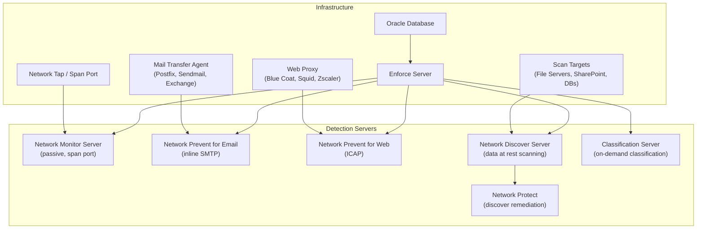

# Network DLP — Complete Workflow
## Broadcom Symantec DLP (Enforce Server, version 16.x/25.x/26.x)

> **Capability:** Network DLP (Network Monitor, Network Prevent for Email, Network Prevent for Web, Network Discover, Network Protect, Classification Server)
> **Complexity Score:** COMPLEX
> **Evidence sources:** doc-corpus.md [S1-S28], video-intelligence.md [V1-V45], api-intelligence.md [API surfaces 1-6]

---

## Overview

Network DLP is the enforcement layer that operates on the network infrastructure -- inspecting, monitoring, and blocking sensitive data as it traverses the network (data in motion) or sits on network-accessible storage (data at rest). Unlike endpoint DLP (which runs on the user's machine), network DLP operates at choke points in the infrastructure: mail transfer agents, web proxies, network taps, and file server scanners.

Symantec DLP's network architecture uses purpose-built **Detection Servers** -- each type handles a different network data channel. These servers register with the Enforce Server, receive policies, perform content inspection, and report incidents. The key architectural distinction is between **passive** monitoring (Network Monitor, which sees a copy of traffic) and **active** prevention (Network Prevent for Email and Web, which sit inline and can block/modify traffic).

**How Symantec's network DLP differs from other products:**

| Aspect | Symantec DLP Network | Trellix DLP Network | Microsoft Purview |
|--------|---------------------|--------------------|--------------------|
| Passive monitoring | Dedicated Network Monitor server (span/tap) | Network Monitor for DLP (span port) | No passive network monitoring |
| Email prevention | Dedicated server + MTA integration (reflecting mode) | Email Gateway DLP (McAfee ESS) | Exchange Online DLP (cloud only) |
| Web prevention | Dedicated server + ICAP proxy integration | Web Gateway DLP (SWG) | Microsoft Defender for Cloud Apps |
| Data at rest | Network Discover + Protect (scan + remediate) | Data Discover (limited remediation) | Information Protection scanner |
| Deployment model | Separate detection servers per function | Integrated with gateway products | Cloud-native (no on-prem network DLP) |
| SSL inspection | Certificate management on detection servers | Gateway-level SSL inspection | N/A (cloud-native) |
| Throughput | Up to 1 TB/hour (High Speed Discovery, DLP 16+) | Varies by gateway | N/A |

[S1, S4, S9, S13, S15, S17]

---

## Complexity Score: COMPLEX

**Justification:**

1. **5 distinct detection server types** -- each with different infrastructure requirements, protocol integrations, and response action capabilities
2. **Infrastructure integration complexity** -- MTA configuration for email, ICAP proxy configuration for web, port mirroring for monitoring, credential management for discover targets
3. **SSL/TLS inspection** -- certificate management for HTTPS inspection across network monitor and prevent servers
4. **Performance sizing** -- each server type has different sizing requirements based on traffic volume, scan throughput, and concurrent connections
5. **Scan target diversity** -- Network Discover supports 8+ target types (CIFS, NFS, DFS, SharePoint, Exchange, Lotus Notes, SQL databases, local file systems) each with different authentication and configuration requirements
6. **Multi-server topology** -- enterprise deployments require multiple detection servers placed at different network points
7. **Protocol-specific behavior** -- detection and response actions vary by protocol (SMTP, HTTP, FTP, IM)

[S1, S4, S9]

---

## Configuration Dependency Graph



---

## Workflow Phases

### Phase 1: Network Monitor (Passive Traffic Inspection)

Network Monitor is the entry point for most DLP deployments. It passively monitors a copy of network traffic without blocking or modifying any data -- providing visibility into data flows before enforcement is enabled.

#### Architecture

```
Network Traffic Flow:
                                    (copy of traffic)
  Users/Servers --> Switch --------+---------> Destination
                     |             |
                     | span port   |
                     v             |
              +------+------+      |
              | Network     |      |
              | Monitor     |      |
              | Server      |      |
              +------+------+      |
                     |             |
                     v             |
              +------+------+      |
              | Enforce     |      |
              | Server      |      |
              +-------------+
```

**Key principle:** Network Monitor receives a COPY of traffic (via port mirroring/SPAN port or network TAP). It never touches the original traffic flow. This makes it safe to deploy without risk of disrupting network operations.

**Navigation:** System > Servers and Detectors > Overview

#### Network Monitor Configuration

```
+=========================================================================+
|  Detection Server: Network Monitor                                       |
+=========================================================================+
|  Server Name:     [dlp-netmon01.corp.example.com         ]              |
|  Server Type:     Network Monitor                                        |
|  Status:          Running                                                |
|                                                                         |
|  Listener Configuration:                                                 |
|    Interface:     [eth1 (monitoring interface)            v]            |
|    Promiscuous:   [x] Enabled (capture all traffic on interface)        |
|                                                                         |
|  Protocol Support:                                                       |
|    [x] SMTP (email traffic)                                              |
|    [x] HTTP (web traffic)                                                |
|    [x] FTP (file transfer)                                               |
|    [x] IM (instant messaging)                                            |
|    [x] Custom TCP (user-defined ports)                                   |
|                                                                         |
|  SSL/TLS Inspection:                                                     |
|    Enable SSL inspection:     [x]                                        |
|    Certificate store:         [/opt/dlp/certs/ssl-inspect.jks  ]        |
|    Supported protocols:       TLS 1.2, TLS 1.3                          |
|                                                                         |
|  Performance:                                                            |
|    Max concurrent sessions:   [5000 ]                                    |
|    Packet buffer size (MB):   [512  ]                                    |
|                                                                         |
|  Policy Group:                [Default Policy Group              v]     |
|                                                                         |
+=========================================================================+
```

| Field | Type | Default | Description | Evidence |
|-------|------|---------|-------------|----------|
| Interface | Dropdown | eth0 | Network interface receiving mirrored traffic | A [S1, S4] |
| Promiscuous mode | Checkbox | Enabled | Capture all packets on the interface (required for SPAN) | A [S1] |
| SMTP monitoring | Checkbox | Enabled | Monitor email traffic | A [S1, S4] |
| HTTP monitoring | Checkbox | Enabled | Monitor web traffic | A [S1, S4] |
| FTP monitoring | Checkbox | Enabled | Monitor FTP file transfers | A [S1, S4] |
| IM monitoring | Checkbox | Enabled | Monitor instant messaging protocols | A [S1] |
| Custom TCP | Checkbox | Disabled | Define custom TCP ports for monitoring | A [S1] |
| SSL inspection | Checkbox | Disabled | Decrypt SSL/TLS traffic for content inspection | A [S1, S4] |
| Max concurrent sessions | Number | 5000 | Maximum simultaneous network sessions to track | B [S9] |

**Supported protocols:**
| Protocol | Port(s) | Detection | Evidence |
|----------|---------|-----------|----------|
| SMTP | 25, 587 | Email body, subject, attachments, headers | A [S1] |
| HTTP | 80 | Web uploads, form data, file transfers | A [S1] |
| HTTPS | 443 | Requires SSL inspection enabled | A [S1] |
| FTP | 20, 21 | File uploads/downloads | A [S1] |
| IM | Various | AIM, MSN, Yahoo (legacy protocols) | A [S1] |
| Custom TCP | Configurable | Any TCP-based protocol on specified ports | A [S1] |

**Example 1 -- Basic SMTP monitoring:**
Deploy Network Monitor on a server connected to the core switch SPAN port. Enable SMTP monitoring. All outbound email flowing through the network is passively inspected. Incidents generated for policy violations. No email is blocked or delayed.

**Example 2 -- HTTP upload monitoring:**
Enable HTTP monitoring to detect sensitive file uploads to external websites. Catches uploads that bypass endpoint DLP (e.g., from unmanaged devices or Linux workstations without endpoint agents).

**Example 3 -- SSL/TLS inspection for HTTPS monitoring:**
Enable SSL inspection with the organization's CA certificate. The Network Monitor decrypts HTTPS traffic to inspect content. This requires the monitor to have the private key or act as a man-in-the-middle (typically only possible when the monitor is on the same segment as a corporate SSL-terminating proxy).

**Gotcha:** SSL/TLS inspection on Network Monitor is limited compared to Network Prevent for Web. Network Monitor sees a copy of encrypted traffic -- it can only decrypt if it has access to the server's private key (passive decryption) or if traffic is already decrypted at a prior point (e.g., SSL-offloading load balancer). For active HTTPS inspection, use Network Prevent for Web with ICAP proxy integration. [S1, S4]

**API coverage:** No direct API for Network Monitor configuration. Incidents from Network Monitor are exposed through the Enforce REST API. [API-intelligence]

[S1, S4, S9, V-tribal] Evidence: A

---

### Phase 2: Network Prevent for Email (Active SMTP Inspection)

Network Prevent for Email sits inline with your email infrastructure. It inspects outbound email messages (including attachments) and can block, redirect, quarantine, modify headers, or encrypt messages based on DLP policy violations.

#### Architecture

```
Outbound Email Flow:
                    (1) Email composed
  User Mail Client -----> Corporate MTA (Exchange/Postfix)
                              |
                    (2) MTA routes to DLP for inspection
                              |
                              v
                    +-------------------+
                    | Network Prevent   |
                    | for Email Server  |
                    | (DLP inspection)  |
                    +--------+----------+
                             |
                    (3) DLP returns verdict + X-headers
                             |
                             v
                    Corporate MTA (applies action)
                              |
                    (4a) ALLOW: email delivered
                    (4b) BLOCK: email rejected/bounced
                    (4c) REDIRECT: email sent to quarantine
                    (4d) MODIFY: headers/subject altered
                              |
                              v
                    Internet / Recipient
```

**Key concept: Reflecting Mode.** The MTA sends the email to the DLP server for inspection. DLP analyzes the content, attaches X-headers with the verdict, and returns the message to the MTA. The MTA then applies the final action based on the X-headers. DLP does not deliver the email itself.

**Navigation:** System > Servers and Detectors > Overview > Network Prevent for Email

#### Network Prevent for Email Configuration

```
+=========================================================================+
|  Detection Server: Network Prevent for Email                             |
+=========================================================================+
|  Server Name:      [dlp-mailprevent01.corp.example.com  ]               |
|  Server Type:      Network Prevent for Email                             |
|  Status:           Running                                               |
|                                                                         |
|  SMTP Listener:                                                          |
|    Listen port:    [10025]  (MTA routes email to this port)             |
|    Bind address:   [0.0.0.0]                                            |
|    Max message size (MB): [50 ]                                          |
|    Max concurrent connections: [100]                                     |
|                                                                         |
|  MTA Integration:                                                        |
|    Integration mode:   (o) Reflecting (return to MTA with X-headers)    |
|                        ( ) Forwarding (DLP forwards to next hop)        |
|    MTA type:           [Postfix                          v]             |
|    Return-to MTA host: [mail01.corp.example.com          ]              |
|    Return-to MTA port: [10026]                                          |
|                                                                         |
|  X-Header Configuration:                                                 |
|    Block header:       [X-DLP-Action: BLOCK              ]              |
|    Allow header:       [X-DLP-Action: ALLOW              ]              |
|    Redirect header:    [X-DLP-Action: REDIRECT           ]              |
|    Custom headers:     [X-DLP-Policy: $POLICY$           ]              |
|                        [X-DLP-Severity: $SEVERITY$        ]              |
|                                                                         |
|  SMG Integration:                                                        |
|    Enable SMG quarantine: [ ] (requires Symantec Messaging Gateway)     |
|                                                                         |
|  Policy Group:     [Default Policy Group                  v]            |
|                                                                         |
+=========================================================================+
```

| Field | Type | Default | Description | Evidence |
|-------|------|---------|-------------|----------|
| Listen port | Number | 10025 | Port where DLP receives email from MTA | A [S1, S4, S13] |
| Integration mode | Radio | Reflecting | Reflecting = return to MTA; Forwarding = DLP routes | A [S1, S13] |
| MTA type | Dropdown | Postfix | MTA product for integration guidance | A [S13] |
| Return-to MTA host | Text | MTA hostname | Where to return inspected messages | A [S1, S13] |
| Max message size | Number (MB) | 50 | Messages larger than this are passed without scanning | A [S1] |
| X-Header Configuration | Text fields | Predefined | Custom X-headers added to inspected messages | A [S1, S13] |
| SMG Integration | Checkbox | Disabled | Enable quarantine via Symantec Messaging Gateway | A [S1, S14] |

#### Email Response Actions

| Action | Behavior | MTA Requirement | Evidence |
|--------|----------|----------------|----------|
| **Block Message** | MTA rejects the message. Sender receives bounce. | MTA must interpret X-DLP-Action: BLOCK | A [S1, S4] |
| **Redirect Message** | MTA redirects to quarantine mailbox or alternate recipient | MTA content filter rule on X-DLP-Action: REDIRECT | A [S1, S4] |
| **Quarantine Message** | Message sent to SMG quarantine for admin review | Symantec Messaging Gateway required | A [S1, S14] |
| **Modify Message** | Add disclaimer, modify subject (e.g., prepend "[SENSITIVE]"), add/remove headers | MTA header rewrite rules | A [S1, S4] |
| **Add Header** | Attach X-headers for downstream processing (e.g., encryption gateway) | Downstream system reads X-headers | A [S1] |
| **Encrypt** | Email encrypted before delivery via email encryption gateway | Email encryption gateway (PGP, S/MIME, ZixEncrypt) | A [S1, S4] |
| **Allow** | Message delivered normally (incident still generated) | No MTA action required | A [S1] |

**Example 1 -- Block outbound PCI data in email:**
Policy: "PCI-Email-Block" with Credit Card Number data identifier. Response rule: Block Message. When an employee sends an email with credit card numbers in the body or attachments, the MTA receives the X-DLP-Action: BLOCK header and rejects the message. The sender receives a bounce notification.

**Example 2 -- Quarantine HIPAA data for review:**
Policy: "HIPAA-Email-Quarantine" with SSN + medical terms compound rule. Response rule: Quarantine via SMG. The message is held in quarantine. A compliance officer reviews the message in SMG and either releases or blocks it.

**Example 3 -- Auto-encrypt sensitive email:**
Policy: "Auto-Encrypt-Confidential" triggers on files with MIP "Confidential" label. Response rule: Add Header (X-DLP-Encrypt: TRUE). The downstream email encryption gateway reads this header and encrypts the message before delivery.

**Example 4 -- Redirect to manager for review:**
Policy: "Executive-Financial-Review" triggers on financial report IDM matches sent by non-executive users. Response rule: Redirect to `dlp-review@corp.example.com` (manager review queue). Manager reviews and manually forwards if appropriate.

**Example 5 -- Subject line modification:**
Policy: "External-Sensitive-Tag" triggers on any outbound email to external domains containing 5+ PII matches. Response rule: Modify subject to prepend "[SENSITIVE - DLP]" to the original subject. Email is delivered but visually tagged for recipient awareness.

**Gotcha:** Reflecting mode is the recommended integration pattern. In forwarding mode, the DLP server becomes a single point of failure for email delivery. If the DLP server goes down in forwarding mode, email stops flowing. In reflecting mode, if the DLP server is unreachable, the MTA can be configured to deliver email without DLP inspection (fail-open). [S1, S13]

[S1, S4, S13, S14] Evidence: A

---

### Phase 3: Network Prevent for Web (ICAP Integration)

Network Prevent for Web uses the ICAP protocol (RFC 3507) to integrate with web proxies. The proxy routes web traffic through the DLP server for content inspection. DLP can block, allow, or modify web requests containing sensitive data.

#### Architecture

```
Web Traffic Flow:
                    (1) User browses web
  User Browser -----> Corporate Web Proxy (Blue Coat/Squid)
                              |
                    (2) Proxy sends ICAP request to DLP
                              |
                              v
                    +-------------------+
                    | Network Prevent   |
                    | for Web Server    |
                    | (ICAP server)     |
                    +--------+----------+
                             |
                    (3) DLP returns ICAP response (block/allow)
                             |
                             v
                    Corporate Web Proxy (enforces action)
                              |
                    (4a) ALLOW: request proxied to internet
                    (4b) BLOCK: proxy returns block page to user
                    (4c) CONTENT REMOVAL: proxy removes sensitive content
                              |
                              v
                    Internet / Web Server
```

#### Network Prevent for Web Configuration

```
+=========================================================================+
|  Detection Server: Network Prevent for Web                               |
+=========================================================================+
|  Server Name:      [dlp-webprevent01.corp.example.com   ]               |
|  Server Type:      Network Prevent for Web                               |
|  Status:           Running                                               |
|                                                                         |
|  ICAP Listener:                                                          |
|    ICAP port:      [1344]                                                |
|    Secure ICAP:    [x] Enable TLS (port 11344)                          |
|    ICAP URI:       [/reqmod] (request modification mode)                |
|    ICAP URI:       [/respmod] (response modification mode)              |
|                                                                         |
|  Proxy Integration:                                                      |
|    Proxy type:     [Blue Coat / ProxySG                  v]             |
|    Concurrent ICAP connections: [50  ]                                   |
|    Connection timeout (sec):   [120 ]                                    |
|                                                                         |
|  SSL/TLS:                                                                |
|    Keystore path:  [/opt/dlp/keystore/secureicap.jks     ]              |
|    Keystore type:  [JKS                                   ]             |
|                                                                         |
|  Performance:                                                            |
|    Max request body size (MB): [100]                                     |
|    Preview bytes:              [4096] (ICAP preview for quick scan)     |
|                                                                         |
|  Policy Group:     [Default Policy Group                  v]            |
|                                                                         |
+=========================================================================+
```

| Field | Type | Default | Description | Evidence |
|-------|------|---------|-------------|----------|
| ICAP port | Number | 1344 | Standard ICAP port | A [S1, S15] |
| Secure ICAP | Checkbox | Disabled | Enable TLS for ICAP communication | A [S1, S15] |
| ICAP URI | Text | /reqmod | ICAP service URI. REQMOD for outbound, RESPMOD for inbound. | A [S1, S15] |
| Proxy type | Dropdown | Generic | Proxy product for integration guidance | A [S1, S15] |
| Concurrent ICAP connections | Number | 50 | Must match proxy ICAP connection pool | A [S1, S9, S15] |
| Preview bytes | Number | 4096 | ICAP preview for quick decision on small payloads | A [S15] |

**Supported proxies:**
| Proxy | ICAP Mode | Secure ICAP | Notes | Evidence |
|-------|-----------|-------------|-------|----------|
| Blue Coat / ProxySG | REQMOD + RESPMOD | Yes | Primary integration target | A [S1, S15] |
| Squid 3.5.x | REQMOD + RESPMOD | Via stunnel | Dedicated integration guide (S15) | A [S15] |
| Zscaler | REQMOD | Yes | Cloud proxy integration | B [S1] |
| Check Point | REQMOD | Yes | Gateway ICAP integration | B [S1] |
| Cisco WSA | REQMOD + RESPMOD | Yes | Web Security Appliance | B [S1] |
| Palo Alto | REQMOD | Yes | Via ICAP connector | B [S1] |

#### Web Response Actions

| Action | Behavior | Evidence |
|--------|----------|----------|
| **Block** | Proxy returns a block page to the user. Upload is prevented. | A [S1, S4] |
| **Allow** | Request proceeds normally. Incident generated for review. | A [S1] |
| **Content Removal** | Sensitive HTML content is removed from the response before delivery | A [S1, S4] |

**Example 1 -- Block sensitive file uploads to non-corporate sites:**
Policy: "Block-Web-Upload-PCI" triggers when HTTP POST contains credit card numbers. Response: Block. Proxy returns custom block page: "Your upload was blocked because it contains payment card data."

**Example 2 -- Monitor web uploads without blocking:**
Policy: "Monitor-Web-Upload" triggers on any web upload containing EDM-matched customer data. Response: Allow (incident generated for review). Used during initial deployment to understand data flow patterns before enabling blocking.

**Example 3 -- Content removal for inbound HTML:**
Policy: "Remove-Inbound-SSN" triggers on HTML responses containing SSNs. Response: Content Removal. The sensitive numbers are redacted from the HTML before the page is delivered to the user's browser. (RESPMOD mode.)

**Gotcha:** The number of concurrent ICAP connections on the proxy MUST match the Web Prevent server configuration. If the proxy sends more concurrent connections than the DLP server can handle, connections queue up and users experience slow web browsing. If the DLP server allows more connections than the proxy sends, resources are wasted. Tune both sides together. [S1, S9, S15]

**Gotcha:** ICAP preview bytes should be set to 4096 or more. The preview feature allows the DLP server to make a quick allow/deny decision based on the first N bytes of the payload. For small web forms, the entire payload fits in the preview, eliminating a round-trip. For large file uploads, the preview provides enough data for preliminary analysis. [S15]

**API coverage:** No API for Web Prevent configuration. ICAP settings are managed via configuration files (`Protect.properties`). [API-intelligence]

[S1, S4, S9, S15] Evidence: A

---

### Phase 4: Network Discover (Data-at-Rest Scanning)

Network Discover scans data at rest on network-accessible storage. It connects to file servers, SharePoint sites, databases, Exchange servers, and other targets, reads file content, and applies DLP policies to find sensitive data stored in unauthorized locations.

#### Architecture

```
Network Discover Scanning:

  +-------------------+
  | Network Discover  |
  | Server            |
  +--------+----------+
           |
    +------+------+------+------+------+
    |      |      |      |      |      |
    v      v      v      v      v      v
  CIFS   NFS   SharePoint  Exchange  SQL DB  Cloud Storage
  File   File   Sites       Servers   Servers (Box, etc.)
  Shares Shares
```

**Navigation:** Manage > Discover Scanning > Discover Targets

#### Supported Scan Target Types

| Target Type | Protocol | Credential Type | Scan Capabilities | Evidence |
|-------------|----------|----------------|-------------------|----------|
| **CIFS File Shares** | SMB/CIFS | Domain credentials (username/password) | Files, folders, ACLs | A [S1, S4] |
| **NFS File Shares** | NFS | UID/GID | Files, folders | A [S1] |
| **DFS Shares** | DFS | Domain credentials | Distributed file system; Windows Discover Server only | A [S1] |
| **SharePoint** | HTTP/HTTPS | SharePoint credentials | Sites, document libraries, lists | A [S1, S4] |
| **Exchange** | EWS/MAPI | Exchange admin credentials | Mailboxes, public folders | A [S1] |
| **Lotus Notes** | Notes API | Notes ID file | Notes databases | A [S1] |
| **SQL Databases** | JDBC | DB credentials | Tables, views, stored procedure results | A [S1] |
| **Local File Systems** | Local | OS credentials | Windows, Linux, AIX, Solaris local drives | A [S1] |

#### Discover Target Configuration

```
+=========================================================================+
|  Manage > Discover Scanning > Discover Targets                           |
+=========================================================================+
|  [New Target v]  [Start]  [Stop]  [Pause]           [Search: ________] |
|                                                                         |
|  +-------------------------------------------------------------------+ |
|  | Target Name      | Type       | Status    | Last Scan  | Items    | |
|  |------------------|------------|-----------|------------|----------| |
|  | Finance-CIFS     | File Share | Completed | 2025-05-19 | 1.2M     | |
|  | HR-SharePoint    | SharePoint | Running   | In progress| 450K     | |
|  | Exchange-Exec    | Exchange   | Scheduled | 2025-05-25 | --       | |
|  | Customer-DB      | SQL DB     | Completed | 2025-05-18 | 500K     | |
|  +-------------------------------------------------------------------+ |
+=========================================================================+
```

#### Creating a File Share Scan Target

```
+=========================================================================+
|  New Discover Target: File Share (CIFS)                                  |
+=========================================================================+
|                                                                         |
|  Target Name:      [Finance-CIFS-Scan                    ]              |
|  Target Type:      File Share (CIFS)                                     |
|                                                                         |
|  Scan Roots:                                                             |
|    \\fileserver01\Finance\                                               |
|    \\fileserver01\Accounting\                                            |
|    \\fileserver02\Shared\Finance\                                       |
|    [+ Add Root]  [Import List]                                          |
|                                                                         |
|  Credentials:                                                            |
|    Read credentials:                                                     |
|      Username:   [CORP\dlp-scan-readonly                  ]             |
|      Password:   [********                                 ]             |
|    Write credentials (for protect actions):                              |
|      Username:   [CORP\dlp-scan-readwrite                 ]             |
|      Password:   [********                                 ]             |
|                                                                         |
|  Scan Filters:                                                           |
|    File types to include: [All types               v]                   |
|    File types to exclude: [.exe, .dll, .sys         ]                   |
|    Max file size (MB):    [500  ]                                        |
|    File age filter:       [Modified within last 365 days  v]            |
|                                                                         |
|  Schedule:                                                               |
|    Schedule type:    (o) One-time    ( ) Recurring                      |
|    Start date/time:  [2025-05-25 02:00 AM                ]              |
|    Recurring:        [ ] Daily  [x] Weekly (Sunday 2:00 AM)             |
|    Incremental:      [x] Only scan new/modified files                   |
|                                                                         |
|  Policy Group:       [Default Policy Group               v]             |
|                                                                         |
|  Detection Server:   [dlp-discover01.corp.example.com     v]            |
|                                                                         |
+=========================================================================+
```

| Field | Type | Default | Description | API | Evidence |
|-------|------|---------|-------------|-----|----------|
| Scan Roots | Text list | Empty | UNC paths to scan | YES (25.1+) | A [S1, S4] |
| Read credentials | Username/Password | None | Credentials for reading files (required) | YES (25.1+) | A [S1] |
| Write credentials | Username/Password | None | Credentials for protect actions (quarantine, encrypt) | YES (25.1+) | A [S1] |
| File type filter | Dropdown + exclusions | All types | Include/exclude specific file types | YES (25.1+) | A [S1] |
| Max file size | Number (MB) | 500 | Skip files larger than this | YES (25.1+) | A [S1] |
| File age filter | Dropdown | No filter | Only scan files modified within specified period | YES (25.1+) | A [S1] |
| Schedule | Radio + datetime | One-time | Schedule scan frequency | PARTIAL | A [S1] |
| Incremental | Checkbox | Enabled | Only scan new/modified files after first full scan | YES (25.1+) | A [S1] |

**Example 1 -- Weekly scan of finance file shares:**
Create a CIFS target for `\\fileserver01\Finance\` with weekly recurring schedule (Sunday 2:00 AM). Use incremental scanning after the first full scan. Apply PCI-DSS and SOX policies. Incidents reported for files containing credit card or financial data.

**Example 2 -- SharePoint site scan:**
Create a SharePoint target for the HR department site. Scan document libraries for HIPAA-relevant content. Use credentials with read-only access to SharePoint. Incidents identify documents containing PHI.

**Example 3 -- Database table scan:**
Create a SQL Database target connecting to the customer database. Scan the `Customers` table for SSN and credit card columns. DLP applies EDM and data identifier rules to database content.

**Example 4 -- Incremental scanning for large file shares:**
First scan of a 10 TB file share takes 10+ hours. Enable incremental scanning. Subsequent weekly scans only inspect files modified since the last scan, reducing scan time to 1-2 hours.

**Example 5 -- Exchange mailbox scan:**
Create an Exchange target to scan executive mailboxes for sensitive attachments. Scan public folders for accidentally shared confidential documents.

[S1, S4, S17] Evidence: A

---

### Phase 5: Network Protect (Discover Remediation)

Network Protect extends Network Discover by adding automated remediation actions for files found to be in violation. When Discover finds a sensitive file, Protect can quarantine, copy, encrypt, or apply DRM to the file.

#### Protect Response Actions

| Action | Behavior | Effect on Original File | Evidence |
|--------|----------|------------------------|----------|
| **Quarantine** | Move file to secure quarantine location. Replace original with tombstone file. | Original removed; replaced with marker file explaining quarantine. | A [S1, S4] |
| **Copy** | Copy file to investigation share for review | Original unchanged; copy placed in secure location | A [S1, S4] |
| **Encrypt** | Apply encryption to the original file | Original encrypted in-place | A [S1, S4] |
| **Apply DRM** | Apply digital rights management to the file | Original DRM-protected in-place | A [S1, S4] |

**Example -- Quarantine unencrypted PCI data on file shares:**
Policy: "PCI-Discover-Quarantine" triggers when files on finance shares contain credit card numbers and are NOT encrypted. Response: Quarantine file to `\\dlp-quarantine\PCI\`. Original file replaced with tombstone: "This file was quarantined by DLP policy. Contact security@corp.example.com for retrieval."

**Tombstone file example:**
```
This file has been quarantined by Symantec Data Loss Prevention.

Original file: \\fileserver01\Finance\reports\customer_export.xlsx
Policy violated: PCI-DSS-Credit-Card-Protection
Date quarantined: 2025-05-21 02:34:17 AM
Quarantine location: \\dlp-quarantine\PCI\QID-20250521-001.enc

To retrieve this file, contact the security team:
  Email: dlp-security@corp.example.com
  Ticket: Create a ServiceNow request under "DLP Quarantine Retrieval"
```

**Quarantine restoration:** Quarantined files can be restored from the Enforce console: Manage > Discover Scanning > Quarantined Files > [select file] > Restore.

[S1, S4] Evidence: A

---

### Phase 6: Detection Server Types Summary

| Server Type | Data State | Action Mode | Key Integration | Use Case | Evidence |
|-------------|-----------|-------------|-----------------|----------|----------|
| Network Monitor Server | Data in Motion | Passive (observe only) | Network tap / SPAN port | Visibility into all network data flows | A [S1] |
| Network Prevent for Email Server | Data in Motion | Active (block/modify/redirect) | MTA (Postfix, Sendmail, Exchange) | Email content enforcement | A [S1, S13] |
| Network Prevent for Web Server | Data in Motion | Active (block/allow) | Web proxy via ICAP (Blue Coat, Squid) | Web upload enforcement | A [S1, S15] |
| Network Discover Server | Data at Rest | Scan (read-only) | File shares, DBs, SharePoint, Exchange | Find sensitive data at rest | A [S1] |
| Network Protect | Data at Rest | Remediate (modify files) | Extends Discover with write actions | Quarantine, encrypt, DRM | A [S1] |
| Classification Server | On-demand | Classify content | API-driven | On-demand content classification | A [S1] |

---

### Phase 7: High Speed Discovery (DLP 16.0+)

DLP 16.0 introduced High Speed Discovery for dramatically faster file system scanning.

```
Performance Comparison:
  Standard Discover:       ~100 GB/hour (typical)
  High Speed Discovery:    Up to 1 TB/hour (file systems)

Requirements:
  - DLP 16.0 or later
  - Dedicated Network Discover Server
  - High-bandwidth network connection to scan targets
  - SSD storage on Discover Server (recommended)

Configuration:
  Enable High Speed Discovery in Discover Server settings.
  Works with CIFS file share targets.
  Supports MIP label detection and auto-labeling during scan.
```

**Example:** A 5 TB file share that previously took 50 hours to scan can now complete in approximately 5 hours with High Speed Discovery enabled. This makes weekend full-scan cycles practical for large storage environments.

[S1, S6] Evidence: A

---

## End-to-End Example: Setting Up Email Monitoring

**Scenario:** Deploy Network Monitor to passively monitor all outbound SMTP traffic for PCI violations.

### Step 1: Install Network Monitor Server
- Dedicated Linux server with 2 NICs (management + monitoring)
- Monitoring NIC connected to switch SPAN port
- Register with Enforce Server

### Step 2: Configure SPAN Port
- On the core switch, configure SPAN/mirror for the port carrying outbound email traffic
- Destination: monitoring NIC on Network Monitor Server
- Verify traffic is reaching the monitoring interface (`tcpdump -i eth1` should show SMTP traffic)

### Step 3: Enable SMTP Protocol
- In Enforce: System > Servers and Detectors > Network Monitor Server > Configure
- Enable SMTP monitoring on the monitoring interface

### Step 4: Create PCI Policy
- Manage > Policies > New Policy > Template List > "PCI DSS - Credit Card Numbers"
- Assign to Default Policy Group

### Step 5: Add Syslog Response Rule
- Create automated response rule: "Log to Syslog Server"
- Configure SIEM server address and CEF format

### Step 6: Verify Detection
- Send a test email with test credit card numbers through the monitored network path
- Check Incidents > Network > Incident List for the detection
- Verify syslog message received in SIEM

[S1, S4] Evidence: A

---

## Summary

Network DLP provides infrastructure-level data loss prevention across three data states: data in motion (Network Monitor, Prevent for Email, Prevent for Web), data at rest (Network Discover + Protect), and on-demand classification. The key architectural decisions are: passive vs active deployment, MTA vs proxy integration, and scan target topology. Network DLP complements endpoint DLP by providing coverage for unmanaged devices, server-to-server communication, and network-accessible storage that endpoint agents cannot reach.

[S1, S4, S9, S13, S15, S17] Evidence: A
