# Broadcom Symantec DLP -- Full Dependency Graph

> **Product:** Symantec Data Loss Prevention (Broadcom)
> **Scope:** All 6 configuration layers + infrastructure + integrations
> **Color Key:** Green = API FULL, Orange = API PARTIAL, Red = API GAP

---

## Full Dependency DAG

```mermaid
graph TD
    %% === INFRASTRUCTURE LAYER (Grey) ===
    subgraph "Infrastructure"
        ORA["Oracle Database<br/>(19c for DLP 16.0+)"]:::infra
        ENF["Enforce Server<br/>(Management Hub)"]:::infra
        NM["Network Monitor<br/>Server"]:::infra
        NPE["Network Prevent<br/>for Email"]:::infra
        NPW["Network Prevent<br/>for Web"]:::infra
        NDS["Network Discover<br/>Server"]:::infra
        EPS["Endpoint Prevent<br/>Server"]:::infra
        CDS["Cloud Detection<br/>Service"]:::infra
        AGT["DLP Agents<br/>(Win/Mac/Linux)"]:::infra
    end

    %% === FOUNDATION CONFIG (Purple) ===
    subgraph "Foundation Configuration"
        AD["Directory Connections<br/>(AD/LDAP/Entra ID)"]:::apiFull
        SYS["Syslog / SIEM<br/>Configuration"]:::apiGap
        MIP_CFG["MIP SDK<br/>Integration"]:::apiGap
        ICA_CFG["ICA Server<br/>Integration"]:::apiGap
        LB["Load Balancer<br/>(Source IP persistence=24h)"]:::infra
    end

    %% === LAYER 1: DETECTION TECHNOLOGIES ===
    subgraph "Layer 1: Detection Technologies"
        DCM["DCM<br/>Keywords, Regex,<br/>Data Identifiers, Dictionaries"]:::apiGap
        EDM["EDM Profile<br/>+ Index Data Source"]:::apiPartial
        IDM["IDM Profile<br/>+ Index Documents"]:::apiGap
        VML["VML Profile<br/>+ Train Model"]:::apiGap
        FP["File Properties<br/>(330+ types)"]:::apiGap
        FR["Form Recognition<br/>+ OCR"]:::apiGap
        MIP_DET["MIP Tag<br/>Detection"]:::apiGap
        ICA_DET["User Risk Score<br/>(ICA)"]:::apiGap
        DGM["Directory Group<br/>Matching"]:::apiGap
    end

    %% === LAYER 2: DETECTION RULES ===
    subgraph "Layer 2: Detection Rules"
        SR_RULE["Simple Rules<br/>(single condition)"]:::apiGap
        CR_RULE["Compound Rules<br/>(AND logic)"]:::apiGap
    end

    %% === LAYER 3: EXCEPTIONS ===
    subgraph "Layer 3: Exceptions"
        COMP_EX["Component-Level<br/>Exceptions"]:::apiGap
        MSG_EX["Message-Level<br/>Exceptions"]:::apiGap
    end

    %% === LAYER 4: RESPONSE RULES ===
    subgraph "Layer 4: Response Rules"
        AUTO_RR["Automated<br/>Response Rules"]:::apiGap
        SMART_RR["Smart Response<br/>Rules (Manual)"]:::apiGap
        SYSLOG_ACT["Syslog Action"]:::apiGap
        EMAIL_ACT["Email Notification<br/>Action"]:::apiGap
        BLOCK_ACT["Block/Quarantine<br/>Actions"]:::apiGap
        MIP_ACT["Apply MIP Label<br/>Action"]:::apiGap
        FLEX["FlexResponse<br/>Plugins (Java)"]:::apiGap
    end

    %% === LAYER 5: POLICIES ===
    subgraph "Layer 5: Policies"
        POL["Policies"]:::apiFull
        PT["Policy Templates<br/>(65+ built-in)"]:::apiFull
        SRP["Sender/Recipient<br/>Patterns"]:::apiFull
    end

    %% === LAYER 6: DEPLOYMENT ===
    subgraph "Layer 6: Deployment"
        PG["Policy Groups"]:::apiFull
        DEPLOY["Deploy to<br/>Detection Servers"]:::apiFull
    end

    %% === INCIDENT MANAGEMENT ===
    subgraph "Incident Management"
        INC["Incidents<br/>(Query/Update)"]:::apiFull
        INC_HIST["Incident History"]:::apiFull
        INC_MSG["Original Message"]:::apiFull
        CUST_ATTR["Custom Attributes"]:::apiFull
        REPORTS["Reports &<br/>Dashboards"]:::apiPartial
    end

    %% === USER/ROLE ADMIN ===
    subgraph "User & Role Admin"
        USERS["User Management"]:::apiFull
        ROLES["Role Management"]:::apiFull
        CERTS["Certificate<br/>Management"]:::apiFull
    end

    %% === DISCOVER ===
    subgraph "Network Discover"
        TARGETS["Discover Targets"]:::apiFull
        SCANS["Scan Execution"]:::apiPartial
    end

    %% === EXTERNAL INTEGRATIONS ===
    subgraph "External Integrations"
        SIEM["SIEM<br/>(Splunk, QRadar,<br/>Sentinel, Chronicle)"]:::external
        SOAR["SOAR<br/>(XSOAR, FortiSOAR,<br/>Swimlane)"]:::external
        SNOW["ServiceNow"]:::external
        PROXY["Web Proxy<br/>(ICAP)"]:::external
        MTA["Email Gateway<br/>(MTA/SMG)"]:::external
        CASB["CloudSOC<br/>(CASB)"]:::external
        ENTRA["Microsoft<br/>Entra ID"]:::external
    end

    %% === INFRASTRUCTURE DEPENDENCIES ===
    ORA --> ENF
    ENF --> NM
    ENF --> NPE
    ENF --> NPW
    ENF --> NDS
    ENF --> EPS
    ENF --> CDS
    EPS --> AGT
    LB --> EPS

    %% === FOUNDATION DEPENDENCIES ===
    ENF --> AD
    ENF --> SYS
    ENF --> MIP_CFG
    ENF --> ICA_CFG

    %% === LAYER 1 DEPENDENCIES ===
    ENF --> EDM
    ENF --> IDM
    ENF --> VML
    AD --> DGM
    MIP_CFG --> MIP_DET
    ICA_CFG --> ICA_DET

    %% === LAYER 2 DEPENDENCIES (Technologies -> Rules) ===
    DCM --> SR_RULE
    DCM --> CR_RULE
    EDM --> SR_RULE
    EDM --> CR_RULE
    IDM --> SR_RULE
    IDM --> CR_RULE
    VML --> SR_RULE
    VML --> CR_RULE
    FP --> SR_RULE
    FP --> CR_RULE
    FR --> SR_RULE
    MIP_DET --> SR_RULE
    MIP_DET --> CR_RULE
    ICA_DET --> CR_RULE
    DGM --> SR_RULE
    DGM --> CR_RULE

    %% === LAYER 3 DEPENDENCIES (Exceptions) ===
    AD --> COMP_EX
    AD --> MSG_EX

    %% === LAYER 4 DEPENDENCIES (Response Rules) ===
    SYS --> SYSLOG_ACT
    MIP_CFG --> MIP_ACT
    SYSLOG_ACT --> AUTO_RR
    EMAIL_ACT --> AUTO_RR
    BLOCK_ACT --> AUTO_RR
    MIP_ACT --> AUTO_RR
    FLEX --> AUTO_RR
    EMAIL_ACT --> SMART_RR

    %% === LAYER 5 DEPENDENCIES (Policies) ===
    SR_RULE --> POL
    CR_RULE --> POL
    COMP_EX --> POL
    MSG_EX --> POL
    AUTO_RR --> POL
    SMART_RR --> POL
    PT --> POL
    SRP --> POL

    %% === LAYER 6 DEPENDENCIES (Deployment) ===
    POL --> PG
    NM --> PG
    NPE --> PG
    NPW --> PG
    NDS --> PG
    EPS --> PG
    CDS --> PG
    PG --> DEPLOY
    AGT --> DEPLOY

    %% === INCIDENT FLOW ===
    DEPLOY --> INC
    INC --> INC_HIST
    INC --> INC_MSG
    INC --> CUST_ATTR
    INC --> REPORTS

    %% === ADMIN FLOW ===
    ENF --> USERS
    ENF --> ROLES
    ENF --> CERTS

    %% === DISCOVER FLOW ===
    NDS --> TARGETS
    TARGETS --> SCANS

    %% === EXTERNAL INTEGRATION FLOW ===
    SYSLOG_ACT --> SIEM
    INC --> SOAR
    INC --> SNOW
    PROXY --> NPW
    MTA --> NPE
    CDS --> CASB
    ENTRA --> AD

    %% === STYLES ===
    classDef infra fill:#eceff1,stroke:#607d8b,color:#37474f
    classDef apiFull fill:#c8e6c9,stroke:#2e7d32,color:#1b5e20
    classDef apiPartial fill:#ffe0b2,stroke:#e65100,color:#bf360c
    classDef apiGap fill:#ffcdd2,stroke:#c62828,color:#b71c1c
    classDef external fill:#e1f5fe,stroke:#0277bd,color:#01579b
```

---

## Dependency Matrix

### Infrastructure Layer

| Component | Depends On | Required By | API Status |
|-----------|-----------|-------------|------------|
| Oracle Database (19c) | -- | Enforce Server | GAP (console/installer) |
| Enforce Server | Oracle Database | All Detection Servers, All Config | GAP (console/installer) |
| Network Monitor Server | Enforce Server | Policy Groups | GAP (console) |
| Network Prevent for Email | Enforce Server, MTA/SMG | Policy Groups | GAP (console) |
| Network Prevent for Web | Enforce Server, Web Proxy (ICAP) | Policy Groups | GAP (console) |
| Network Discover Server | Enforce Server | Discover Targets, Policy Groups | GAP (console) |
| Endpoint Prevent Server | Enforce Server, Load Balancer (opt) | DLP Agents, Policy Groups | GAP (console) |
| Cloud Detection Service | Enforce Server | CloudSOC, Policy Groups | GAP (console) |
| DLP Agents | Endpoint Prevent Server | Endpoint Detection/Prevention | GAP (agent tools, GPO, SCCM) |

### Foundation Configuration

| Component | Depends On | Required By | API Status |
|-----------|-----------|-------------|------------|
| Directory Connections (AD/LDAP) | Enforce Server | DGM Rules, Exceptions, User Auth | PARTIAL (user/role API, not dir config) |
| Syslog / SIEM Config | Enforce Server | Syslog Response Actions | GAP (Manager.properties file) |
| MIP SDK Integration | Enforce Server | MIP Tag Rules, MIP Label Actions | GAP (console) |
| ICA Server Integration | Enforce Server | User Risk Score Conditions | GAP (console) |

### Layer 1: Detection Technologies

| Technology | Depends On | Required By | API Status |
|-----------|-----------|-------------|------------|
| DCM (Keywords, Regex, Data Identifiers) | Enforce Server (runtime) | Detection Rules | GAP (console-only) |
| EDM Profile + Index | Enforce Server, Data Source (CSV/DB) | Detection Rules | PARTIAL (index trigger via API; profile creation console-only) |
| IDM Profile + Index | Enforce Server, Source Documents | Detection Rules | GAP (console-only) |
| VML Profile + Training | Enforce Server, Training Documents | Detection Rules | GAP (console-only) |
| File Properties | Enforce Server (runtime) | Detection Rules | GAP (console-only) |
| Form Recognition + OCR | Enforce Server, OCR Enabled | Detection Rules | GAP (console-only) |
| MIP Tag Detection | MIP SDK Integration | Detection Rules | GAP (console-only) |
| User Risk Score (ICA) | ICA Server Integration | Detection Rules | GAP (console-only) |
| Directory Group Matching | Directory Connections | Detection Rules, Exceptions | GAP (console-only) |

### Layer 2: Detection Rules

| Component | Depends On | Required By | API Status |
|-----------|-----------|-------------|------------|
| Simple Rules | Layer 1 Technologies | Policies | GAP (console-only; import/export via policy XML) |
| Compound Rules | Layer 1 Technologies (multiple) | Policies | GAP (console-only; import/export via policy XML) |

### Layer 3: Exceptions

| Component | Depends On | Required By | API Status |
|-----------|-----------|-------------|------------|
| Component-Level Exceptions | Directory Connections (optional) | Policies | GAP (console-only; import/export via policy XML) |
| Message-Level Exceptions | Directory Connections (optional) | Policies | GAP (console-only; import/export via policy XML) |

### Layer 4: Response Rules

| Component | Depends On | Required By | API Status |
|-----------|-----------|-------------|------------|
| Automated Response Rules | Syslog (optional), MIP (optional) | Policies | GAP (console-only) |
| Smart Response Rules | -- | Policies | GAP (console-only) |
| FlexResponse Plugins | Plugin JAR + Plugins.properties | Automated Response Rules | GAP (file-based config) |

### Layer 5: Policies

| Component | Depends On | Required By | API Status |
|-----------|-----------|-------------|------------|
| Policies | Rules + Exceptions + Response Rules | Policy Groups | FULL (list 16.0+, import/export 25.1+) |
| Policy Templates | -- | Policies | FULL (import/export XML) |
| Sender/Recipient Patterns | -- | Policies, Exceptions | FULL (CRUD 16.0+) |

### Layer 6: Deployment

| Component | Depends On | Required By | API Status |
|-----------|-----------|-------------|------------|
| Policy Groups | Policies + Detection Servers | Deployment | FULL (list 16.0+) |
| Deploy to Detection Servers | Policy Groups + Agents | Incident Generation | FULL (apply 16.0+) |

### Post-Deployment

| Component | Depends On | Required By | API Status |
|-----------|-----------|-------------|------------|
| Incidents | Deployed Policies | Remediation, Reporting | FULL (comprehensive CRUD) |
| Incident History | Incidents | Audit Trail | FULL (15.8+) |
| Original Message | Incidents | Investigation | FULL (15.8+) |
| Custom Attributes | Incidents | Enrichment, Reporting | FULL (CRUD) |
| Reports & Dashboards | Incidents | Compliance, Management | PARTIAL (filter retrieval, export) |
| Network Discover Targets | Network Discover Server | Scans | FULL (CRUD 25.1+) |
| User Management | Enforce Server | RBAC | FULL (CRUD 25.1+) |
| Role Management | Enforce Server | RBAC | FULL (CRUD 25.1+) |

---

## Topologically Sorted Configuration Order

This is the correct order for configuring a Symantec DLP deployment from scratch. Dependencies flow top-to-bottom; no step should be attempted before its predecessors are complete.

| Step | Action | Layer | Depends On |
|------|--------|-------|-----------|
| 1 | Install Oracle Database (19c) | Infrastructure | -- |
| 2 | Install Enforce Server | Infrastructure | Step 1 |
| 3 | Install Detection Server(s) | Infrastructure | Step 2 |
| 4 | Install DLP Agents (if using endpoints) | Infrastructure | Step 3 (Endpoint Prevent Server) |
| 5 | Configure Directory Connections (AD/LDAP/Entra ID) | Foundation | Step 2 |
| 6 | Configure Syslog/SIEM forwarding | Foundation | Step 2 |
| 7 | Configure MIP SDK integration (if using MIP) | Foundation | Step 2 |
| 8 | Configure ICA integration (if using risk scoring) | Foundation | Step 2 |
| 9 | Create EDM Profiles and run initial indexing | Layer 1 | Step 2 + data source |
| 10 | Create IDM Profiles and run initial indexing | Layer 1 | Step 2 + source documents |
| 11 | Create VML Profiles and train models | Layer 1 | Step 2 + training documents |
| 12 | Create Detection Rules (simple and compound) | Layer 2 | Steps 9-11 (as needed) + Step 5 (for DGM) |
| 13 | Create Exceptions | Layer 3 | Step 5 (for directory-based exceptions) |
| 14 | Create Response Rules (Automated + Smart) | Layer 4 | Step 6 (for syslog) + Step 7 (for MIP actions) |
| 15 | Assemble Policies (rules + exceptions + response rules) | Layer 5 | Steps 12-14 |
| 16 | Create/Configure Policy Groups | Layer 6 | Step 3 (detection servers) |
| 17 | Assign Policies to Policy Groups | Layer 6 | Steps 15-16 |
| 18 | Set policy mode (Test Without Notifications) | Deployment | Step 17 |
| 19 | Apply/Deploy policies to detection servers | Deployment | Step 18 |
| 20 | Monitor incidents and tune | Operations | Step 19 |
| 21 | Graduate to enforcement (Test With Notifications > Enabled) | Operations | Step 20 (after tuning) |

---

## Cross-Layer Dependencies

| Source Layer | Target Layer | Dependency Type | Notes |
|-------------|-------------|-----------------|-------|
| Infrastructure | All | Hard prerequisite | Oracle > Enforce > Detection Servers must be installed first |
| Foundation | Layer 1 | Soft prerequisite | Directory connections needed only for DGM; MIP needed only for MIP tags |
| Layer 1 | Layer 2 | Hard prerequisite | Rules reference technologies; EDM/IDM/VML profiles must exist before rule creation |
| Layer 2 | Layer 5 | Hard prerequisite | Policies contain rules; at least one rule required |
| Layer 3 | Layer 5 | Optional | Exceptions are optional but strongly recommended |
| Layer 4 | Layer 5 | Optional | Policies can exist without response rules (monitoring only) |
| Foundation | Layer 3 | Soft prerequisite | Directory connections needed for identity-based exceptions |
| Foundation | Layer 4 | Soft prerequisite | Syslog config needed for syslog actions; MIP config needed for label actions |
| Layer 5 | Layer 6 | Hard prerequisite | Policies must exist before assignment to policy groups |
| Infrastructure | Layer 6 | Hard prerequisite | Detection servers must be registered before group assignment |

---

*Full dependency graph covering all 6 configuration layers, infrastructure, foundation config, and external integrations. 51 nodes, 80+ dependency edges.*
