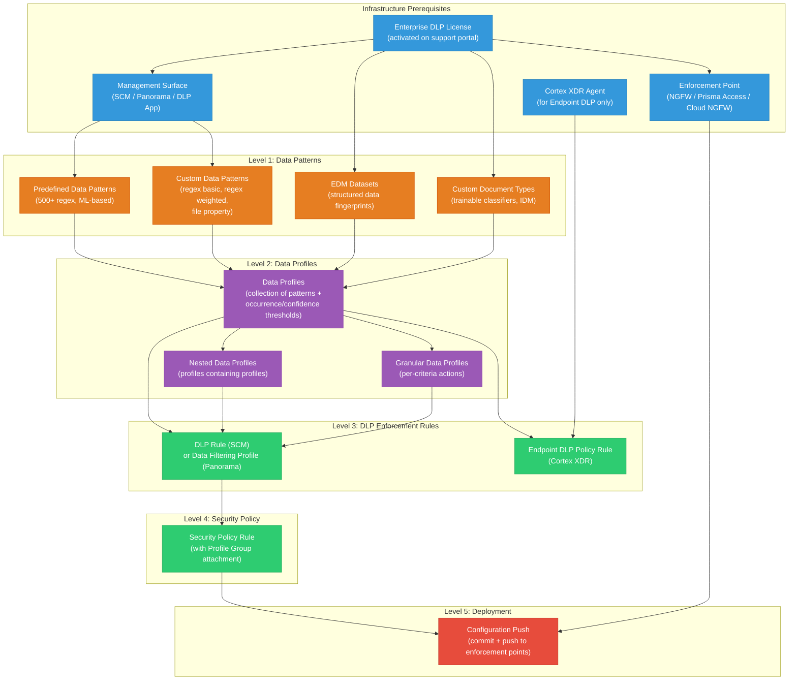

# Authoring Policies -- Dependency Chain & Prerequisites
## Palo Alto Enterprise DLP (Cloud-Delivered)

> Capability: authoring-policies | Generated: 2026-05-21

---

## Dependency Graph



---

## Ordered Configuration Sequence

### Phase 0: Infrastructure (Before Any Policy Work)

| # | Prerequisite | What It Is | What Configures It | What Happens If Missing |
|---|-------------|-----------|-------------------|------------------------|
| 0.1 | **Enterprise DLP License** | Cloud-delivered DLP subscription license | Palo Alto Networks Customer Support Portal > License activation | All DLP features are unavailable; data patterns and profiles do not appear in management surfaces |
| 0.2 | **Management Surface Access** | At least one of: Strata Cloud Manager, Panorama, or DLP App | Provisioned during SASE/NGFW onboarding | Cannot create or manage data patterns, profiles, or rules |
| 0.3 | **Enforcement Point** | NGFW appliance, Prisma Access tenant, Cloud NGFW, or SaaS Security | Hardware/cloud provisioning | Policies exist but have no enforcement point; traffic is not inspected |
| 0.4 | **Internet Connectivity** | Enterprise DLP is cloud-delivered; enforcement points must reach Palo Alto cloud | Network/firewall configuration | DLP verdicts cannot be rendered; inline inspection fails or falls back to local-only processing |
| 0.5 | **Cortex XDR Agent** (for Endpoint DLP) | XDR agent v5.0+ with DLP module enabled | Cortex XDR console > Endpoint Management | Endpoint DLP is not available; only network and cloud DLP function |

### Phase 1: Data Patterns (Foundation)

| # | Item | Depends On | What It Provides | What Happens If Missing |
|---|------|-----------|-----------------|------------------------|
| 1.1 | **Predefined Data Patterns** (500+ built-in) | Enterprise DLP License (0.1) | Ready-to-use regex and ML-based patterns for SSN, CCN, IBAN, PHI, etc. | Must create all patterns from scratch; no out-of-box detection |
| 1.2 | **Custom Data Patterns** (regex basic/weighted, file property) | Management Surface (0.2) | User-defined patterns for proprietary data, custom identifiers, internal codes | Only predefined patterns available; cannot detect organization-specific data |
| 1.3 | **EDM Datasets** (optional) | License (0.1) + EDM CLI App | Exact matching against structured records (database exports) | Cannot detect specific records from databases; regex-only detection has higher false positives for structured data |
| 1.4 | **Custom Document Types** (optional) | License (0.1) + 20+ training documents | ML-trained classifiers for proprietary document types | Cannot classify custom document categories; limited to predefined document types |

**Minimum viable:** Predefined data patterns (1.1) are sufficient for a first policy. They come pre-configured and require only enabling.

### Phase 2: Data Profiles

| # | Item | Depends On | What It Provides | What Happens If Missing |
|---|------|-----------|-----------------|------------------------|
| 2.1 | **Data Profile** (at least one) | At least one Data Pattern (1.1 or 1.2) | Named collection of patterns with match criteria (occurrence, confidence, AND/OR) | Cannot create a DLP rule or Data Filtering Profile; no content classification |
| 2.2 | **Nested Data Profile** (optional) | Multiple Data Profiles (2.1) | Consolidates multiple profiles for single security rule attachment | Must create separate security rules per profile; more management overhead |
| 2.3 | **Granular Data Profile** (optional) | Data Profile (2.1) | Per-match-criteria response actions within a single profile | All match criteria in a profile share the same action; no differentiation |

**Minimum viable:** One basic Data Profile (2.1) is sufficient.

### Phase 3: DLP Enforcement Rules

| # | Item | Depends On | What It Provides | What Happens If Missing |
|---|------|-----------|-----------------|------------------------|
| 3.1 | **DLP Rule** (SCM) or **Data Filtering Profile** (Panorama) | Data Profile (2.1) | Specifies traffic scope, file types, action (alert/block), and log severity | Data profiles exist but are not enforceable; no traffic inspection occurs |
| 3.2 | **Endpoint DLP Policy Rule** (optional) | Data Profile (2.1) + Cortex XDR Agent (0.5) | Endpoint-based enforcement for desktop apps, copy/paste, file operations | Only network/cloud DLP is active; endpoint data movements are not monitored |

**Minimum viable:** One DLP Rule or Data Filtering Profile (3.1) is required.

### Phase 4: Security Policy

| # | Item | Depends On | What It Provides | What Happens If Missing |
|---|------|-----------|-----------------|------------------------|
| 4.1 | **Profile Group** | DLP Rule/Data Filtering Profile (3.1) | Container that bundles DLP profile with other security profiles (AV, WF, etc.) | Cannot attach DLP to a security rule; must use inline profile attachment (less organized) |
| 4.2 | **Security Policy Rule** | Profile Group (4.1) + Enforcement Point (0.3) | Matches traffic (source/destination/app) and applies the DLP profile group | DLP profiles and rules exist but no traffic is evaluated; everything passes uninspected |

### Phase 5: Deployment

| # | Item | Depends On | What It Provides | What Happens If Missing |
|---|------|-----------|-----------------|------------------------|
| 5.1 | **Configuration Push** | Security Policy Rule (4.2) | Commits and pushes config to enforcement points (NGFW, Prisma Access) | Configuration changes exist in staging only; enforcement points run previous config |

---

## Fast-Path: Minimal Viable DLP Policy

If you use predefined data patterns and a simple data profile, the dependency chain collapses:

```
Enterprise DLP License (Phase 0)
    |
    v
Select predefined data patterns (Phase 1 -- already built-in)
    |
    v
Create Data Profile referencing predefined patterns (Phase 2)
    |
    v
Create DLP Rule / Data Filtering Profile (Phase 3)
    |
    v
Attach to Security Policy Rule via Profile Group (Phase 4)
    |
    v
Commit + Push to enforcement point (Phase 5)
```

This skips custom patterns, EDM, document types, nested profiles, and granular profiles entirely.

---

## Cross-Capability Prerequisites

| Prerequisite | Configured By | Required For |
|-------------|--------------|-------------|
| Enterprise DLP license activation | Procurement / Support Portal | All DLP features |
| Strata Cloud Manager tenant | SASE onboarding | SCM-managed DLP rules |
| Panorama deployment | Network team | Panorama-managed Data Filtering Profiles |
| NGFW PAN-OS 10.x+ | Network team | NGFW-based DLP enforcement |
| Prisma Access tenant | SASE onboarding | Cloud-based DLP enforcement |
| Cortex XDR v5.0 agent | Endpoint security team | Endpoint DLP module |
| Cloud Identity Engine (CIE) | Identity team | User/group-based policy scoping |

---

## Prerequisite Verification Checklist

```
[ ] Enterprise DLP license active: Hub > Licenses > verify "Enterprise DLP" is listed
[ ] DLP App accessible: Hub > Apps > Enterprise DLP opens without errors
[ ] At least one enforcement point connected: SCM > Deployment > verify connected firewalls/Prisma Access
[ ] Predefined data patterns visible: DLP App > Data Patterns > predefined patterns listed (500+)
[ ] Internet connectivity from enforcement point to DLP cloud (test: enforcement point can reach Palo Alto cloud URLs)
[ ] Your account has DLP Admin role: SCM > Identity & Access > verify role assignment
[ ] (For EDM) EDM CLI App downloaded: Download from DLP App > EDM section
[ ] (For Endpoint DLP) Cortex XDR agent v5.0+ deployed on target endpoints
```

If any item fails, resolve it before proceeding with policy authoring. The most common "silent failure" is a missing or expired Enterprise DLP license -- data patterns will not appear and DLP verdict rendering will silently fail.
