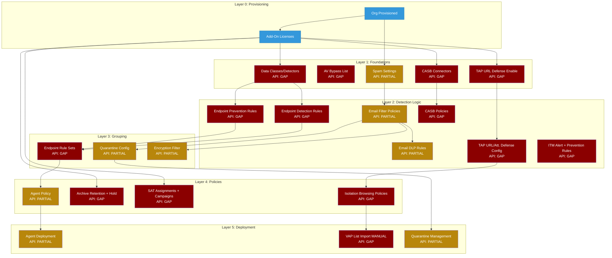

# Product Workflow Intelligence: Proofpoint

> Generated: 2026-05-21 | Research pipeline: doc_researcher → video_researcher → capability_flow_mapper → workflow_synthesizer
> Products: Essentials, PPS/PoD 8.22.x, TAP, Data Security, ITM 7.18.0, CASB, Isolation, SAT, Archive

---

## At a Glance

| Metric | Value |
|--------|-------|
| Capability groups | 14 |
| Sub-capabilities | 137 |
| Screens documented | 47 confirmed (+ 15+ INCOMPLETE behind auth wall) |
| Configuration fields | 195+ confirmed (significant additional fields behind auth wall) |
| Sources consulted | 28 documentation + 22 video |
| Source grades | A: 14 | B: 7 | C: 5 | D: 4 |
| API endpoints (Essentials REST v1) | Partial coverage — field parity unconfirmed |
| API endpoints (PPS XSOAR) | 7 quarantine commands confirmed |
| API endpoints (Data Security REST) | Partial incident/evidence retrieval |
| Console-only (no API) | ~60% of core authoring operations |
| Personas | 3 (Email Security Admin, Compliance Officer, Security Analyst) |
| Gotchas documented | 87 (across 14 capabilities) |
| Critical gotchas (HIGH severity) | 42 |
| Stale sources | 3 (S1: 2014, S3: 2020, S14: 2019) |
| Corpus confidence | MEDIUM — official sources available for Essentials, ITM, Data Security; PPS/PoD, CASB, TAP, Isolation admin guides behind auth wall |

---

## Capability Taxonomy

```
Proofpoint — Authoring Policies
├── 1.  Email Filtering Policies        MODERATE | API: PARTIAL  | Coverage: HIGH
├── 2.  PPS/PoD Rule Creation           COMPLEX  | API: PARTIAL  | Coverage: LOW
├── 3.  Spam Policy Configuration       SIMPLE   | API: PARTIAL  | Coverage: HIGH
├── 4.  Virus Policy Configuration      SIMPLE   | API: GAP      | Coverage: MODERATE
├── 5.  Email DLP Policies              COMPLEX  | API: PARTIAL  | Coverage: MODERATE
├── 6.  Email Encryption Policies       COMPLEX  | API: PARTIAL  | Coverage: MODERATE
├── 7.  Targeted Attack Protection      COMPLEX  | API: GAP      | Coverage: MODERATE
├── 8.  Insider Threat Management       COMPLEX  | API: GAP      | Coverage: HIGH (ITM 7.18.0)
├── 9.  Data Security / Endpoint DLP    COMPLEX  | API: PARTIAL  | Coverage: HIGH (current)
├── 10. CASB Policies                   COMPLEX  | API: GAP      | Coverage: LOW
├── 11. Browser/Email Isolation         COMPLEX  | API: GAP      | Coverage: LOW-MODERATE
├── 12. Security Awareness Training     COMPLEX  | API: GAP      | Coverage: HIGH (2020)
├── 13. Archive & Retention Policies    SIMPLE   | API: GAP      | Coverage: MODERATE
└── 14. Quarantine Management           MODERATE | API: PARTIAL  | Coverage: MODERATE
```

---

## Complexity Heatmap

| Capability | Fields | Screens | Deps | Gotchas | API Coverage | Score | Setup Time |
|-----------|--------|---------|------|---------|-------------|-------|-----------|
| Email Filtering | 17+ | 5 | 4 | 14 | PARTIAL | COMPLEX | 2-4 hrs |
| PPS/PoD Rules | 40+ est. | 8+ | 3 | 13 | PARTIAL | COMPLEX | 4-8 hrs |
| Spam Policy | 6 | 1 | 1 | 7 | PARTIAL | SIMPLE | 15-30 min |
| Virus Policy | 1 | 1 | 1 | 4 | GAP | SIMPLE | 5-15 min |
| Email DLP | 30+ | 6+ | 4+ | 15 | PARTIAL | COMPLEX | 2-4 hrs |
| Email Encryption | 28 | 7 | 4 | 14 | PARTIAL | COMPLEX | 1-3 hrs |
| TAP | 18 | 6 | 4 | 10 | GAP | COMPLEX | 1-2 hrs |
| ITM | 36+ | 7 | 5 | 13 | GAP | COMPLEX | 2-6 hrs |
| Endpoint DLP | 45+ | 8 | 5 | 14 | PARTIAL | COMPLEX | 4-8 hrs |
| CASB | ~30-60 est. | 6+ | 4+ | 8 | GAP | COMPLEX | 2-4 hrs |
| Isolation | ~20-40 est. | 5+ | 9 | 8 | GAP | COMPLEX | 2-4 hrs |
| SAT | 36 | 9 | 3 | 14 | GAP | COMPLEX | 1-3 hrs |
| Archive | 3 | 2 | 2 | 7 | GAP | SIMPLE | 15-30 min |
| Quarantine Mgmt | 14 | 3 | 2 | 7 | PARTIAL | MODERATE | 30-60 min |

---

## Dependency Graph



See: [Full Dependency Graph with validation](dependency-graph.md)

---

## API Coverage Summary

| Coverage Level | Capabilities | Notes |
|---------------|-------------|-------|
| PARTIAL (some operations automatable) | Email Filtering, Email DLP, Email Encryption, Spam, Quarantine, Endpoint DLP, PPS Quarantine | Core authoring (create/edit rules) is console-only even in PARTIAL coverage; only list/deploy/read is automatable |
| GAP (console-only) | Virus, TAP, ITM, CASB, Isolation, SAT, Archive | Zero public API coverage confirmed |
| FULL (not found in this portfolio) | — | No capability has complete end-to-end API coverage |

**Top 5 Critical API Gaps:**

1. **TAP URL Defense enable/configure** — GAP — blocks automation of URL Defense deployment; must be manually enabled after every new provisioning; no workaround
2. **Endpoint DLP Detection/Prevention rule enable/disable** — GAP — blocks automated incident response playbooks that would disable noisy rules; manual-only
3. **CASB policy authoring** — GAP — entire CASB policy creation workflow is console-only; blocks multi-tenant CASB automation
4. **Archive retention + legal hold** — GAP — compliance-critical configuration; first-deployment misconfiguration (12-month default) causes permanent data loss; no API to verify or enforce correct settings
5. **SAT campaign management + reporting** — GAP — compliance reporting fully manual; blocks automated compliance evidence collection

**Top 3 Available API Capabilities:**

1. **Essentials REST API v1** [S26] — filter CRUD, user management, quarantine operations for Essentials
2. **PPS XSOAR quarantine commands** [S16] — list/release/resubmit/forward/move/delete for PPS quarantine
3. **Data Security REST API** [S28] — Endpoint DLP incident retrieval and evidence collection for SOC automation

---

## Persona Summaries

### Email Security Administrator
Owns the full email protection stack: filter policies, spam thresholds, AV settings, email DLP, encryption triggers, TAP configuration, and quarantine management. Spends 2-4 hours on initial filter policy setup and 30-60 minutes daily on quarantine review. Primary pain points: filter precedence subtleties (User → Group → Company order silently bypasses Company DLP), the "Stop Processing Additional Filters" toggle that silently disables downstream compliance rules, and URL Defense being disabled by default after TAP provisioning. Most steps are PARTIAL AUTOMATE at best; TAP and AV configuration are MANUAL ONLY.
See: [Full Persona Flow](personas/email-security-admin.md)

### Compliance Officer
Validates that Proofpoint configurations satisfy regulatory requirements and produces compliance evidence. Configures archive retention period (must be changed from 12-month default immediately) and legal hold, monitors SAT completion rates, and audits DLP coverage. Primary pain points: company-wide-only legal hold blocks per-custodian e-discovery, default archive retention too short for all regulated industries, and SAT reporting has no API coverage. Almost entirely MANUAL ONLY across all touchpoints.
See: [Full Persona Flow](personas/compliance-officer.md)

### Security Analyst
Triages TAP alerts, reviews admin-only quarantine categories, investigates Endpoint DLP incidents, and conducts ITM insider threat investigations. Does not author policies — escalates tuning requests. Primary pain points: TAP VAP list must be manually imported to Isolation after every threat review (new VAPs unprotected during the gap), ITM API is OFF by default (SOAR playbooks silently fail), and Detection Rules with no Rule Set assignment silently fire on no agents. Investigation workflows are largely MANUAL ONLY.
See: [Full Persona Flow](personas/security-analyst.md)

---

## Top Findings

1. **TAP URL Defense is disabled by default after provisioning** — URL Defense requires explicit enablement at Administration > Account Management > Features. This step is NOT automatic. A provisioned TAP deployment with this step skipped provides zero URL protection silently. [V5 — Grade B] Contradicts some official documentation phrasing — follow the video.

2. **"Stop Processing Additional Filters" silently disables all downstream DLP/compliance rules** — Any allow-list or safe-sender filter with this toggle enabled will prevent lower-priority DLP, encryption, and compliance filters from evaluating matching messages. No log entry indicates the skip. This is the #1 source of "DLP rule that never fires" incidents in Essentials. [V20 — Grade B]

3. **User-scope filters evaluate BEFORE Company-scope filters (inverted precedence)** — The processing order is User → Group → Company. A user's personal safe-sender allow rule fires before the Company DLP policy for the same message. This means any user can inadvertently bypass organization-wide DLP by adding a sender to their personal safe-sender list. [V20 — Grade B, S1 — Grade A]

4. **TAP VAP list requires manual re-import to Isolation — no auto-sync** — The VAP (Very Attacked People) list in the TAP Dashboard does not automatically propagate to the Isolation Console. Newly identified high-risk users browse without isolation protection until an admin manually exports and re-imports the list. During an active targeted attack campaign, this gap can persist for days or weeks. [V17 — Grade C, S15 — Grade B]

5. **Default archive retention (12 months) causes compliance failure before anyone notices** — Proofpoint Essentials Archive defaults to 12 months. HIPAA requires 6 years, SEC Rule 17a-4 requires 7 years, SOX requires 7 years. Organizations that accept the default will delete compliance-required email without warning. No API exists to verify or enforce the retention period. [S27 — Grade A]

6. **Signal Type (DLP Only vs. ITM) in Endpoint Agent Policies is IRREVERSIBLE after save** — Selecting the wrong Signal Type requires deleting the entire policy and recreating all If/Then conditions and Prevention Rule assignments from scratch. This decision requires HR and Legal sign-off in many jurisdictions before selection (ITM captures screenshots and keystrokes). [S7 — Grade A]

7. **Detection Rules with no Rule Set assignment look active but fire on no agents — no warning** — A Detection Rule saved without a Rule Set assignment appears in the rule list with a valid configuration and no error indicator. It generates zero events forever. [S10 — Grade A]

8. **ITM API and Key Logging are both OFF by default** — SOAR/SIEM integrations that call the ITM API will fail silently until an admin enables the API toggle. Rules designed to capture keystroke patterns will capture nothing until Key Logging is enabled. Both require deliberate configuration steps that are easy to overlook during ITM deployment. [S4 — Grade A]

---

## Top Gotchas

Aggregated from all capabilities, ordered by estimated impact:

| # | Gotcha | Capability | Source | Impact |
|---|--------|-----------|--------|--------|
| 1 | "Stop Processing Additional Filters" silently breaks all downstream DLP/compliance filters | Email Filtering / Email DLP | V20 — Grade B | HIGH |
| 2 | User-scope filters fire BEFORE Company-scope — user allow rule bypasses Company DLP | Email Filtering / Email DLP | V20, S1 — Grade B/A | HIGH |
| 3 | URL Defense disabled by default after TAP provisioning | TAP | V5 — Grade B | HIGH |
| 4 | VAP list requires manual re-import to Isolation — new VAPs unprotected during gap | TAP / Isolation | V17, S15 — Grade C/B | HIGH |
| 5 | Default 12-month archive retention insufficient for all regulated industries | Archive | S27 — Grade A | HIGH |
| 6 | Signal Type in Agent Policy is IRREVERSIBLE after save | Endpoint DLP | S7 — Grade A | HIGH |
| 7 | Detection Rules with no Rule Set assignment silently never fire | Endpoint DLP | S10 — Grade A | HIGH |
| 8 | ITM API OFF by default — SOAR/SIEM integrations silently fail | ITM | S4 — Grade A | HIGH |
| 9 | Key Logging OFF by default — keystroke evidence never captured | ITM | S4 — Grade A | HIGH |
| 10 | Encrypt action disappears from dropdown without explanation when Scope/Direction wrong | Email Encryption | V7 — Grade B | HIGH |
| 11 | Prevention rules silently do nothing in Agent Passive Mode | ITM / Endpoint DLP | S4 — Grade A | HIGH |
| 12 | Filter propagation delay (5-30 min) causes false test negatives — wastes debugging cycles | All email capabilities | V2, V20 — Grade B | MEDIUM |
| 13 | DLP-flagged message subjects visible in user quarantine digest if Policy category not excluded | Quarantine | S19 — Grade D | HIGH |
| 14 | Legal hold is company-wide only — no per-custodian hold in Essentials | Archive | S27 — Grade A | HIGH |
| 15 | PPS rules without Route condition fire on ALL routes including outbound relay | PPS Rules / Email DLP | V2 — Grade B | HIGH |

---

## Recommended Next Steps

1. **Build runbook for "Day 1" TAP deployment checklist** — URL Defense disabled by default is the highest-impact silent failure mode. A mandatory post-provisioning checklist (enable URL Defense, verify URL rewriting active, configure per-group exemptions) prevents weeks of unprotected operation.

2. **Audit all Essentials filter policies for "Stop Processing Additional Filters" above DLP filters** — Sort the filter list by priority. Flag any filter with this toggle enabled. Verify no DLP/compliance filters exist below it. This audit is the highest-yield action for existing Essentials deployments.

3. **Set archive retention period to match regulatory requirement on Day 1** — No API exists to enforce this. A deployment checklist must include verifying the retention period before any messages accumulate. The 12-month default causes permanent data loss in regulated industries.

4. **Automate the TAP VAP list re-import cycle** — Currently MANUAL ONLY with no API. Recommend a calendar-based recurring task tied to the TAP threat review cadence (weekly or after any threat summary that changes the VAP roster). Until an API exists, this is the highest-frequency manual operation in the Security Analyst workflow.

5. **Prioritize PPS/PoD admin guide access for customers on PPS** — ~30% of sub-capabilities (PPS Rules, PPS Policy Routes, Module Precedence, PDR, RV, SMTP Rate Control) have LOW documentation coverage because the PPS admin guide requires authentication. Any customer deploying PPS should be provisioned with customer portal access before deployment begins.

6. **Verify ITM Key Logging and API toggle state during deployment** — Both are OFF by default and both are deployment-blocking for their use cases. Add both to the ITM deployment checklist.

7. **Evaluate Proofpoint Essentials API v1 completeness before building automation** — The API landing page [S26] is accessible but full endpoint documentation requires authentication. Field parity with the UI filter creation workflow is unconfirmed. Prototype automation against the API before committing to an API-first integration architecture for filter management.

---

## Artifact Index

| Artifact | Path | Description |
|---------|------|-------------|
| OVERVIEW | [OVERVIEW.md](OVERVIEW.md) | This file — executive summary and capstone document |
| Capability Taxonomy | [CAPABILITY-TAXONOMY.md](CAPABILITY-TAXONOMY.md) | Full 137-sub-capability taxonomy with complexity and coverage ratings |
| Dependency Graph | [dependency-graph.md](dependency-graph.md) | Full Mermaid DAG with configuration order and DAG validation |
| Persona: Email Security Admin | [personas/email-security-admin.md](personas/email-security-admin.md) | Filter policies, spam, AV, TAP, encryption, quarantine |
| Persona: Compliance Officer | [personas/compliance-officer.md](personas/compliance-officer.md) | DLP audit, archive retention, SAT tracking, quarterly reporting |
| Persona: Security Analyst | [personas/security-analyst.md](personas/security-analyst.md) | TAP triage, quarantine release, endpoint DLP incidents, ITM investigation |
| Integration Map | [reference/integration-map.md](reference/integration-map.md) | All external integration touchpoints with direction and protocol |
| Sources | [reference/sources.md](reference/sources.md) | Deduplicated source reference with stale source flags |
| Doc Corpus | [research/doc-corpus.md](research/doc-corpus.md) | 28 structured sources with coverage assessment |
| Video Intelligence | [research/video-intelligence.md](research/video-intelligence.md) | 22 video analyses with workflow extractions and gotchas |
| Capability Flows | [capabilities/](capabilities/) | Per-capability workflow.md, gotchas.md, prerequisites.md, lifecycle.md |
| Email Filtering | [capabilities/email-filtering/workflow.md](capabilities/email-filtering/workflow.md) | COMPLEX — 5 screens, 17+ fields, 14 gotchas |
| Email DLP | [capabilities/email-dlp/workflow.md](capabilities/email-dlp/workflow.md) | COMPLEX — 6+ screens, 30+ fields, 15 gotchas |
| Endpoint DLP | [capabilities/endpoint-dlp/workflow.md](capabilities/endpoint-dlp/workflow.md) | COMPLEX — 8 screens, 45+ fields, 14 gotchas |
| Email Encryption | [capabilities/email-encryption/workflow.md](capabilities/email-encryption/workflow.md) | COMPLEX — 7 screens, 28 fields, 14 gotchas |
| PPS Rules | [capabilities/pps-rules/workflow.md](capabilities/pps-rules/workflow.md) | COMPLEX — 8+ screens, 40+ fields, 13 gotchas |
| ITM | [capabilities/itm/workflow.md](capabilities/itm/workflow.md) | COMPLEX — 7 screens, 36+ fields, 13 gotchas |
| TAP | [capabilities/tap/workflow.md](capabilities/tap/workflow.md) | COMPLEX — 6 screens, 18 fields, 10 gotchas |
| SAT | [capabilities/sat/workflow.md](capabilities/sat/workflow.md) | COMPLEX — 9 screens, 36 fields, 14 gotchas |
| CASB | [capabilities/casb/workflow.md](capabilities/casb/workflow.md) | COMPLEX — 6+ screens, ~30-60 fields (INCOMPLETE), 8 gotchas |
| Isolation | [capabilities/isolation/workflow.md](capabilities/isolation/workflow.md) | COMPLEX — 5+ screens, ~20-40 fields (INCOMPLETE), 8 gotchas |
| Spam | [capabilities/spam/workflow.md](capabilities/spam/workflow.md) | SIMPLE — 1 screen, 6 fields, 7 gotchas |
| Virus | [capabilities/virus/workflow.md](capabilities/virus/workflow.md) | SIMPLE — 1 screen, 1 field, 4 gotchas |
| Quarantine | [capabilities/quarantine/workflow.md](capabilities/quarantine/workflow.md) | MODERATE — 3 screens, 14 fields, 7 gotchas |
| Archive | [capabilities/archive/workflow.md](capabilities/archive/workflow.md) | SIMPLE — 2 screens, 3 fields, 7 gotchas |

---

## Documentation Coverage Gaps (Flagged)

The following sub-areas have LOW or INCOMPLETE documentation coverage due to authentication walls. Claims in capability flow maps for these areas are marked INCOMPLETE or Grade U (ASSUMPTION):

| Area | Gap Reason | Capabilities Affected |
|------|-----------|----------------------|
| PPS/PoD Admin Guide | Requires Proofpoint customer portal login | PPS Rules (2.1-2.12), PPS-specific Email DLP (5.5-5.6), PPS Encryption (6.6) |
| TAP Admin Guide | Behind authentication | TAP URL/Attachment Defense fields (7.1-7.5) |
| CASB Admin Console | Behind authentication | All CASB policy fields (10.1-10.5) |
| Isolation Console | Behind authentication | All Isolation policy fields beyond Redirect Rules (11.1-11.6) |
| Essentials Archive Full Guide | Requires login | Archive Search Config (13.3), per-custodian hold availability |
| Essentials API v1 Full Docs | Behind authentication | Complete filter CRUD field parity (capability 1, 5) |
| Essentials post-2023 UI | 2014 admin guide [S1] is stale | All Essentials navigation paths from [S1] should be verified against current UI |
