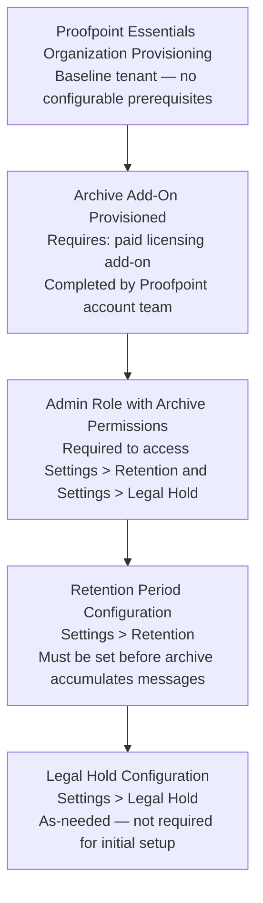

# Archive & Retention Policies — Prerequisites

## Dependency Chain

---

## Configuration Order

### 1. Proofpoint Essentials Organization Provisioning (~0 min — Proofpoint onboarding)

**What to configure:** Nothing.
**Minimum viable config:** Organization tenant created.
**Source:** [A — S1]

### 2. Archive Add-On Provisioned (~0 min — completed by Proofpoint)

**What to configure:** Nothing — this is a licensing and provisioning action by Proofpoint.
**Minimum viable config:** Archive module active; Settings > Retention page accessible in admin console.
**How to verify:** Log in to admin console and check for Archive navigation item.
**Source:** [A — S27]

**IMPORTANT:** Do not wait until after messages accumulate to configure retention. Once messages are captured with the default 12-month retention, those messages are already subject to the 12-month deletion window. Configure retention immediately after provisioning.

### 3. Admin Role with Archive Permissions (~2 min)

**Capability:** User Management
**What to configure:** Assign appropriate admin role. Exact archive management role name not documented in accessible sources.
**Minimum viable config:** At least one user able to access Settings > Retention.
**Source:** [A — S27, gap — exact role name not documented]

### 4. Retention Period Configuration (~3 min — IMMEDIATELY after archive provisioning)

**Ready when:** Steps 1–3 complete.
**Workflow:** [workflow.md](workflow.md) Steps 1–3
**Navigate to:** Settings > Retention
**What to configure:** Retention period in years and months to match regulatory requirement.
**Minimum viable config:** Years = 1, Months = 0 minimum (default); adjust to regulatory requirement.
**Source:** [A — S27]

### 5. Legal Hold Configuration (As needed — not initial setup)

**Ready when:** Step 4 complete.
**Workflow:** [workflow.md](workflow.md) Step 4
**Navigate to:** Settings > Legal Hold
**What to configure:** Activate Company Legal Hold slider only when instructed by legal counsel.
**Source:** [A — S27]

---

## Total Time Estimate: ~5 minutes (after archive add-on provisioned)

**Note:** Archive add-on provisioning (Step 2) requires engagement with Proofpoint account team and may take 1–5 business days depending on licensing process. The configuration itself (Steps 3–4) takes approximately 5 minutes.
