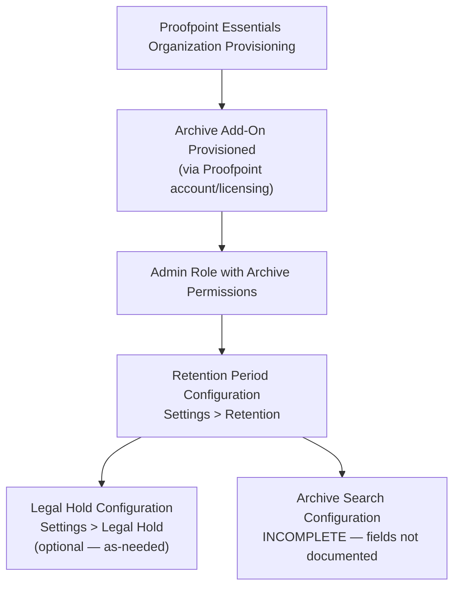

# Archive & Retention Policies — Workflow Reference

> Capability: archive | Product: Proofpoint Essentials Archive | Generated: 2026-05-21
> Taxonomy groups: 13.1–13.3

---

## Overview

Archive & Retention Policies in Proofpoint Essentials control how long email messages are preserved in the archive and whether legal holds suspend normal retention deletion. The Essentials archive is a separate system from the quarantine — archived messages are stored independently and are governed by retention policies set in the Archive settings. Legal hold, when activated, overrides the retention period and preserves all messages indefinitely until the hold is lifted. Archive search configuration is a third sub-capability with LOW documentation coverage in accessible sources.

**Complexity:** SIMPLE — Two primary configuration fields (retention period, legal hold toggle) on accessible settings pages. Archive search is INCOMPLETE.
**Prerequisite chain length:** 2 steps.
**Total configurable fields documented:** 3 (grades A/D); archive search fields INCOMPLETE.
**Screens involved:** 2 documented (Settings > Retention, Settings > Legal Hold); archive search screen INCOMPLETE.
**Evidence base:** 1 Grade A source [S27], 1 Grade A source [S1] (supplemental), 1 Grade D source [S19].

---

## Screen Hierarchy

```yaml
screen:
  name: "Settings > Retention"
  navigation: "Proofpoint Essentials Archive admin > Settings > Retention"
  parent: "Settings"
  type: page
  fields:
    - name: "Retention Period — Years"
      type: number
      required: false
      default: "1 (corresponding to 12 months total)"
      options: ["Integer — years component of retention period"]
      validation: "Minimum: 0 years; Maximum: 10 years (combined years + months must not exceed 10 years)"
      description: "Years component of the total retention period. Combined with Months field to set the total archive retention window."
      gotcha: "The maximum retention period is 10 years. Attempting to set values exceeding 10 years is not documented as resulting in an error vs. auto-cap — UNKNOWN behavior at boundary."
    - name: "Retention Period — Months"
      type: number
      required: false
      default: "12 (default is expressed as 12 months = 1 year)"
      options: ["Integer 0-11 — months component of retention period"]
      validation: "0–11 months; combined with Years must not exceed 10 years total"
      description: "Months component of the total retention period. Works in combination with the Years field."
      gotcha: "Default is 12 months (1 year) — short for many compliance use cases. HIPAA requires 6 years, SEC Rule 17a-4 requires 7 years for broker-dealers, FINRA requires 3 years. Verify your regulatory requirements before accepting the default."
  actions:
    - name: "Save"
      type: button
      result: "Saves retention period. Messages older than the retention period will be eligible for deletion per Proofpoint's archive deletion schedule."
  prerequisites:
    - "Proofpoint Essentials Archive add-on provisioned"
    - "Admin role with archive management permissions"
  decision_points:
    - condition: "Legal Hold is currently active"
      effect: "Retention period is superseded — messages are NOT deleted regardless of retention period setting until Legal Hold is deactivated"

screen:
  name: "Settings > Legal Hold"
  navigation: "Proofpoint Essentials Archive admin > Settings > Legal Hold"
  parent: "Settings"
  type: page
  fields:
    - name: "Company Legal Hold"
      type: toggle_slider
      required: false
      default: "Disabled (Off)"
      options: ["On (legal hold active)", "Off (normal retention applies)"]
      validation: "Toggle; no additional parameters"
      description: "When enabled (On), suspends retention policy deletion for ALL archived messages company-wide. Messages are retained indefinitely until the legal hold is deactivated. Use for litigation hold, regulatory investigation, or e-discovery preservation."
      gotcha: "Legal hold applies company-wide — there is no per-user or per-custodian legal hold documented in accessible sources. Activating legal hold stops ALL retention-based deletions for the entire organization. This will cause archive storage to grow indefinitely until the hold is lifted."
  actions:
    - name: "Save (slider state)"
      type: toggle
      result: "Activates or deactivates company-wide legal hold immediately upon save"
  prerequisites:
    - "Settings > Retention configured"
    - "Admin role with archive management permissions"
  decision_points:
    - condition: "When Legal Hold is turned On"
      effect: "All retention period deletion is suspended company-wide; archive storage grows without bound until hold is deactivated"
    - condition: "When Legal Hold is turned Off after a hold period"
      effect: "Normal retention-based deletion resumes; messages that passed their retention date during the hold may be immediately eligible for deletion [U — ASSUMPTION: behavior at hold deactivation not documented in accessible sources]"

screen:
  name: "Archive Search — INCOMPLETE"
  navigation: "UNKNOWN — Proofpoint Essentials Archive search interface"
  parent: "UNKNOWN"
  type: page
  fields:
    - name: "Archive Search"
      type: UNKNOWN
      description: "INCOMPLETE — Archive search policy configuration fields not documented in accessible grade-A sources. [S1] references archive search as a feature but provides no detailed configuration workflow. [S27] documents retention and legal hold only."
  prerequisites:
    - "Archive provisioned"
    - "Messages indexed in archive"
```

---

## Step-by-Step Walkthrough

### Step 1: Verify Archive Add-On is Provisioned

**Navigate to:** Check with your Proofpoint account team or tenant settings
**Purpose:** The Essentials Archive is an add-on module. Retention and legal hold settings only appear in the admin console when the archive module is provisioned for your organization.

Indicators that archive is provisioned:
- "Archive" or "Email Archive" navigation item appears in the admin console
- Settings > Retention and Settings > Legal Hold pages are accessible

If these pages are not visible, the archive add-on is not provisioned. Contact Proofpoint support.

### Step 2: Configure Retention Period

**Navigate to:** Proofpoint Essentials Archive admin > Settings > Retention
**Purpose:** Sets the maximum age of archived messages. Messages older than this period are eligible for deletion.

| Field | Type | Required | Default | Description |
|-------|------|----------|---------|-------------|
| Retention Period — Years | Number | No | 1 year (12 months total) | Years component [A — S27] |
| Retention Period — Months | Number | No | 12 (total default) | Months component [A — S27] |

**Regulatory reference table (not from Proofpoint docs — general compliance guidance):**

| Regulation | Minimum Retention | Notes |
|-----------|-----------------|-------|
| HIPAA | 6 years | Medical records and communications |
| SEC Rule 17a-4 | 7 years | Broker-dealer records |
| FINRA Rule 4511 | 3-6 years | Financial communications |
| SOX Section 802 | 7 years | Audit records |
| Default (no regulation) | 1 year | Proofpoint default |

**IMPORTANT:** Proofpoint Essentials archive defaults to 12 months (1 year). This is insufficient for most regulated industries. Set the retention period to match your regulatory requirement before the archive accumulates messages you need to retain.

**Decision point — Retention period:**

| Option | Implications | When to use |
|--------|-------------|------------|
| 12 months (default) | Minimal storage; messages deleted after 1 year | Unregulated organizations, low compliance requirements |
| 1-3 years | Moderate retention | General business records |
| 6-7 years | Higher storage; covers most regulations | Healthcare, finance, public companies |
| 10 years (maximum) | Maximum retention; highest storage costs | Highly regulated industries, conservative approach |

### Step 3: Click Save

**Navigate to:** Settings > Retention > Save button
**Purpose:** Commits retention period.

### Step 4: Configure Legal Hold (When Required)

**Navigate to:** Proofpoint Essentials Archive admin > Settings > Legal Hold
**Purpose:** Activates company-wide litigation hold, suspending retention-based deletion indefinitely.

| Field | Type | Required | Default | Description |
|-------|------|----------|---------|-------------|
| Company Legal Hold | Slider | No | Off | Company-wide legal hold toggle [A — S27] |

**This step is only required when:**
- Litigation has been filed or is reasonably anticipated
- A regulatory investigation requires preservation
- E-discovery request received requiring preservation of all communications

**Decision point — Legal hold activation:**

| State | When to use | Effect |
|-------|------------|--------|
| Off (default) | Normal operations | Retention period governs deletions |
| On | Litigation, investigation, e-discovery | All deletions suspended company-wide indefinitely |

**WARNING:** Legal hold activation is company-wide and will cause storage to grow without bound. Activate only when legally required. Deactivate promptly when the hold is no longer needed, following legal counsel guidance.

---

## Advanced Configuration

### Per-User or Per-Group Legal Hold

**INCOMPLETE** — Accessible documentation (S27) describes only company-wide legal hold. Per-user or per-custodian legal hold (typical in enterprise e-discovery systems) is not documented for Proofpoint Essentials Archive in accessible sources. This may exist in the full admin guide (behind authentication wall) or may not be a supported feature in Essentials tier. [A — S27, gap]

### Archive Search Policy Configuration (taxonomy item 13.3)

**INCOMPLETE** — Archive search exists as a feature but search policy configuration (who can search, what they can see, result sets) is not documented in accessible grade-A sources. [S1] references archive search but does not document the configuration workflow.

### Archive and Compliance Role Access

**INCOMPLETE** — The compliance officer or e-discovery user role for archive access is not documented in accessible sources. The relationship between organization admin role and archive access permissions is unclear from available documentation.

---

## Dependency Graph



### Prerequisite Chain (Ordered)

1. **Proofpoint Essentials Organization Provisioning** — baseline tenant. [A — S1]
2. **Archive Add-On Provisioned** — requires licensing add-on; completed by Proofpoint account team. Archive settings pages not visible until this is done. [A — S27]
3. **Admin Role with Archive Permissions** — admin must have appropriate permissions to access archive settings.
4. **Retention Period Configuration** — core setting; should be configured immediately after archive provisioning before any messages accumulate.
5. **Legal Hold Configuration** — activated as-needed when legally required. Not required for initial setup.

---

## Decision Points

| Screen | Decision | Options | Default | Implications | Recommended | Why |
|--------|----------|---------|---------|-------------|-------------|-----|
| Settings > Retention | Retention period length | 1 month to 10 years | 12 months | Shorter = less storage, shorter compliance window; longer = more storage, longer compliance window | Match regulatory requirement | Default 12 months is insufficient for most regulated industries [A — S27] |
| Settings > Legal Hold | Activate hold | On / Off | Off | On: all deletions stop, storage grows; Off: normal retention applies | Off by default; On only when legally required | Legal hold has storage and cost implications [A — S27] |

---

## Object Lifecycle

```mermaid
stateDiagram-v2
    [*] --> Archived : Message delivered (archive captures inbound/outbound)
    Archived --> RetentionActive : Normal retention period applies
    RetentionActive --> EligibleForDeletion : Message age exceeds retention period
    EligibleForDeletion --> Deleted : Proofpoint archive deletion process runs
    RetentionActive --> LegalHoldActive : Admin activates Company Legal Hold
    LegalHoldActive --> RetentionActive : Admin deactivates Legal Hold
    LegalHoldActive --> LegalHoldActive : Messages accumulate; no deletions
    EligibleForDeletion --> LegalHoldActive : Legal hold activated before deletion runs
    Deleted --> [*] : Permanent — not recoverable
```



---

## Integration Touchpoints

| Capability | Relationship | Direction | Notes |
|-----------|-------------|-----------|-------|
| [Quarantine Management](../quarantine/workflow.md) | Archive and quarantine are independent systems | Independent | Quarantined messages are NOT automatically archived [A — S27, gap — cross-system separation] |
| [Email Filtering Policies](../email-filtering/workflow.md) | Filter policies do not affect archiving; all messages are archived regardless of filter disposition | Independent | Archive captures messages before or independently of filter actions [U — ASSUMPTION based on standard archive architecture] |
| [Spam Policy Configuration](../spam/workflow.md) | Spam-quarantined messages may or may not be archived depending on archive configuration | Potentially linked | Archive policy scope (inbound only, all mail, etc.) determines whether spam-classified messages are captured [INCOMPLETE — scope config not documented] |

---

## Complexity Score

| Dimension | Simple | Moderate | Complex | This Capability |
|-----------|--------|----------|---------|-----------------|
| Fields | 3-5 fields | 10-20 fields | 50+ fields | 3 documented fields → SIMPLE |
| Screens | 1 screen | 2-3 screens | 4+ screens | 2 screens (+ 1 INCOMPLETE) → SIMPLE-MODERATE |
| Dependencies | No prerequisites | 1-2 prerequisites | Chain of 3+ | 2 prerequisites (provisioning + archive add-on) → SIMPLE |

**Overall complexity: SIMPLE**
Justification: Two configuration fields on two screens with a minimal prerequisite chain. The functional impact of incorrect configuration (especially retention period too short) is HIGH, but the configuration surface itself is minimal. Archive search adds a third screen that is INCOMPLETE.

---

## Sources

| # | Source | Grade | Used For |
|---|--------|-------|----------|
| S27 | Proofpoint Archive — Managing Retention and Legal Holds (help.proofpoint.com) | A | Retention period (years/months fields, 12-month default, 10-year max), legal hold slider, company-wide scope |
| S1 | Proofpoint Essentials Administrator Guide (2014) | A | Archive as a feature existence; supplemental context |
| S19 | How to Manage the Quarantine Console (InventiveHQ) | D | Quarantine vs. archive distinction; quarantine retention (30 days) as separate system |
