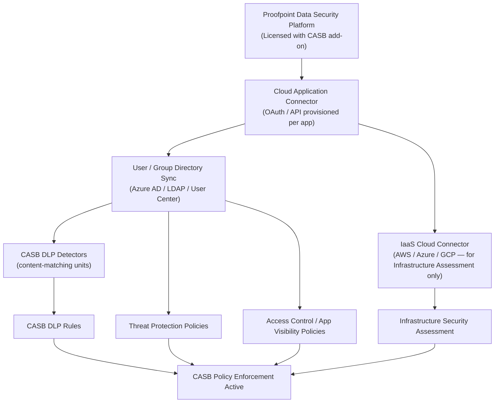

# CASB Policies — Prerequisites

> Capability: CASB Policies (group 10) | Product: Proofpoint CASB
> All time estimates are APPROXIMATE — time for connector provisioning varies significantly by cloud application complexity.

---

## Dependency Chain

---

## Configuration Order

### 1. Proofpoint Data Security Platform with CASB License (1-3 business days)

**Capability:** Platform provisioning
**What to configure:** Work with your Proofpoint account team to confirm CASB is included in your Data Security license. CASB is an add-on to the core Data Security platform and may require a separate SKU.
**Minimum viable config:** License activated; admin user has access to CASB section of the Data Security console.
**Source:** S13 — Grade A (capability listed as part of Data Security platform)

---

### 2. Cloud Application Connector (30–90 minutes per application)

**Capability:** CASB connectors
**Workflow:** INCOMPLETE — connector provisioning screen and fields not documented in accessible sources. Navigate to the Connectors section of the CASB console (exact path unknown).
**What to configure:** For each target cloud application (Microsoft 365, Google Workspace, Salesforce, Box, etc.):
- Authorize the CASB service account or OAuth application with the required permissions/scopes in the target app's admin console
- Complete the connector wizard in the CASB admin console
- Verify connector shows Active / Connected status
**Minimum viable config:** At least one connector in Active status before any policy can scan content.
**Note:** Required OAuth scopes vary per application. Microsoft 365 requires Global Admin or delegated permissions; Google Workspace requires a service account with domain-wide delegation. Exact scope lists are INCOMPLETE — check the per-application connector guide in the CASB console.
**Source:** S13 — Grade A (connectors implied by capability description); field details Grade U — **ASSUMPTION**

---

### 3. User / Group Directory Sync (15–30 minutes initial setup; ongoing automatic)

**Capability:** CASB user management
**Workflow:** INCOMPLETE — sync configuration screens not documented.
**What to configure:**
- Connect to Azure AD, LDAP, or Proofpoint User Center as directory source
- Trigger initial sync
- Verify target user groups appear in the CASB user list
**Minimum viable config:** At least one user group synced. Without groups, policies can only target all users (no staged rollout possible).
**Source:** S13 — Grade A (user group targeting described); configuration steps Grade U — **ASSUMPTION**

---

### 4a. CASB DLP Detectors (15–30 minutes per detector)

**Capability:** 10.6 CASB DLP Detector/Rule Creation
**Workflow:** [workflow.md Step 3](workflow.md)
**What to configure:** Create at least one detector defining the content pattern to match (keyword, smart identifier, regex, or document fingerprint).
**Minimum viable config:** One detector with a detection method and content target set.
**Source:** S25 — Grade B

---

### 4b. IaaS Cloud Connector (30–60 minutes — Infrastructure Assessment only)

**Capability:** 10.5 CASB Infrastructure Security Assessment
**What to configure:** Provision an IaaS connector to AWS, Azure, or GCP (separate from SaaS app connectors). Requires cloud admin permissions (AWS: IAM read-only role; Azure: Reader role at subscription level).
**Only needed for:** Infrastructure Security Assessment (sub-capability 10.5). Not required for DLP, Threat Protection, Access Control, or App Visibility.
**Source:** S13 — Grade A (IaaS assessment listed as capability); connector details Grade U — **ASSUMPTION**

---

### 5. All CASB Policy Types (15–30 minutes each, after prerequisites above)

**Ready when:** Steps 1–3 complete (and 4a for DLP, 4b for Infrastructure Assessment)
**Source:** S13 — Grade A, S25 — Grade B

---

## Total Time Estimate

| Phase | Estimated Time |
|-------|---------------|
| Platform license confirmation | 1-3 business days (account team engagement) |
| First cloud app connector | 30-90 minutes |
| User/group sync | 15-30 minutes |
| First DLP detector | 15-30 minutes |
| First DLP rule | 15-30 minutes |
| First Threat / Access / App Visibility policy | 15-30 minutes each |
| **Minimum to first active policy** | **~2-4 hours of hands-on configuration after license confirmed** |

**Important caveat:** Connector provisioning time varies significantly based on your cloud application's OAuth/API permission model and your organization's approval process for granting service account access to production cloud apps. Factor in change management cycles for production environments.
