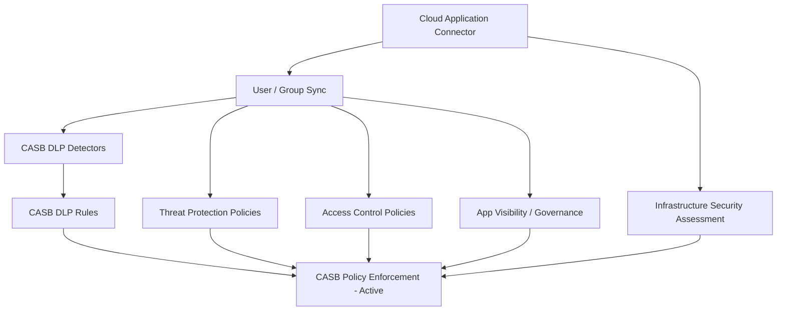
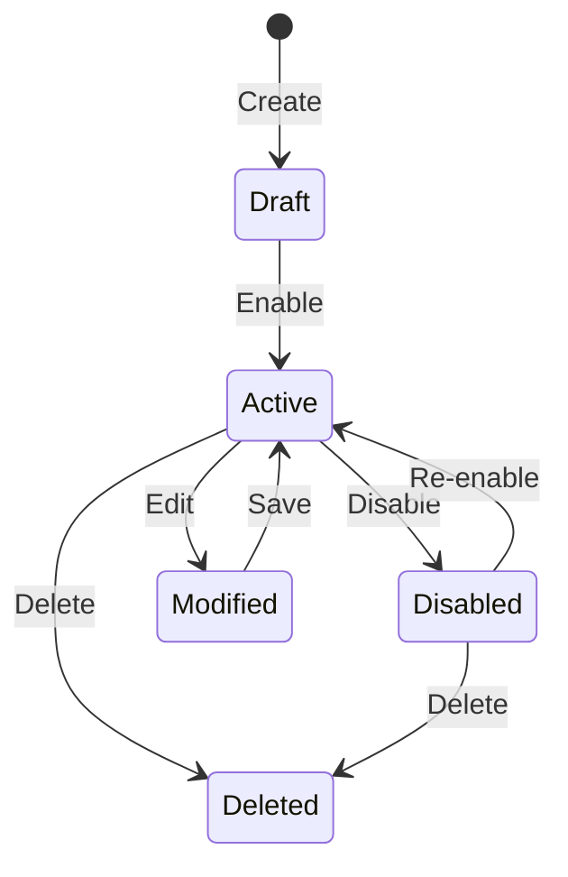

# CASB Policies — Workflow Reference

> Capability group: 10 (CASB Policies) | Sub-capabilities: 10.1 – 10.6
> Generated: 2026-05-21 | Product: Proofpoint CASB (Data Security platform)
> Doc corpus version: PPS 8.22.x / Data Security (current)

---

## Overview

Proofpoint CASB (Cloud Access Security Broker) secures email accounts, cloud applications, and cloud infrastructure against account compromise, malicious file sharing, data loss, and compliance risks. It is delivered as part of the Proofpoint Data Security platform and surfaces in the same administration console as endpoint DLP and ITM. CASB operates across five capability pillars: Threat Protection, Access Control, DLP, Application Visibility, and Infrastructure Security. Policy authoring for CASB involves creating detectors (content-matching units), assembling them into DLP rules, and configuring access-control and threat-protection policies that scope to specific cloud applications and user populations.

**Complexity:** COMPLEX — six distinct policy types, detector/rule hierarchy with at least two levels before enforcement, and dependency on cloud application connectors that must be provisioned before any CASB policy can be tested. Admin console screens are behind an authentication wall; field-level detail relies on Grade B and Grade A overview sources only.

**Prerequisite chain length:** 3 steps minimum (cloud app connector → user/group sync → policy)
**Total configurable fields:** INCOMPLETE — field names not documented in accessible sources; quantity estimated at 30–60 based on product category norms (Grade U — **ASSUMPTION**)
**Screens involved:** INCOMPLETE — screen names and navigation paths not available; see INCOMPLETE markers throughout
**Evidence base:** 1 Grade A source (S13), 1 Grade B source (S25), 0 Grade C-D sources specific to CASB policy config. No video coverage for CASB (confirmed absent — video-intelligence.md).

---

## Coverage Warning

**CASB has LOW documentation coverage in the research corpus.** The official docs landing page (S13) provides capability descriptions but no field-level screen documentation. The training datasheet (S25) confirms a DLP rule workflow exists but provides no UI field details. The CASB admin console and policy configuration screens require authentication at `docs.public.analyze.proofpoint.com/pcasb/`. All screen hierarchies, field names, and navigation paths in this document that are not directly quoted from S13 or S25 are marked Grade U (**ASSUMPTION**) and should be verified before use in production onboarding documentation.

---

## Screen Hierarchy

INCOMPLETE — The following is a partial screen hierarchy reconstructed from high-level capability descriptions. Screen names, exact navigation paths, field names, and field options are not documented in accessible sources.

```yaml
# Partial — reconstructed from S13 and S25 descriptions
# Requires verification against authenticated CASB admin console

screen:
  name: "CASB Console > Policies (root)"
  navigation: "UNKNOWN — likely accessible from Proofpoint Data Security admin portal"
  parent: null
  type: page
  notes: "INCOMPLETE — navigation path not documented in accessible sources"
  sub_sections:
    - "Threat Protection Policies"
    - "Access Control Policies"
    - "DLP Policies"
    - "Application Visibility / Governance"
    - "Infrastructure Security Assessment"
    - "DLP Detectors / Rules"

screen:
  name: "CASB > DLP > Detectors"
  navigation: "UNKNOWN"
  parent: "CASB Console > Policies"
  type: page
  notes: "INCOMPLETE — S25 confirms detector creation is part of CASB DLP workflow but fields not documented"
  fields:
    - name: "Detector Name"
      type: text
      required: true
      default: null
      description: "Identifies the content-matching unit"
      source: "Inferred from S25 — training datasheet describes 'building detectors to find DLP in documents'"
      evidence_grade: "E — Inferred"

screen:
  name: "CASB > DLP > Rules"
  navigation: "UNKNOWN"
  parent: "CASB Console > Policies"
  type: page
  notes: "INCOMPLETE — S25 confirms rule creation workflow exists; fields not documented"
  fields:
    - name: "Rule Name"
      type: text
      required: true
      default: null
      description: "Identifies the DLP rule"
      source: "Inferred from S25"
      evidence_grade: "E — Inferred"
    - name: "Remediation Action"
      type: dropdown
      required: true
      default: null
      description: "What happens when rule fires — e.g., quarantine, alert, block"
      source: "Inferred from S25 — training describes 'detecting and remediating DLP violations'"
      evidence_grade: "E — Inferred"

screen:
  name: "CASB > Threat Protection > Policies"
  navigation: "UNKNOWN"
  parent: "CASB Console > Policies"
  type: page
  notes: "INCOMPLETE — described in S13 as defending against account takeover; configuration fields unknown"

screen:
  name: "CASB > Access Control > Policies"
  navigation: "UNKNOWN"
  parent: "CASB Console > Policies"
  type: page
  notes: "INCOMPLETE — S13 describes user behavior analytics; policy fields unknown"

screen:
  name: "CASB > App Visibility > Governance"
  navigation: "UNKNOWN"
  parent: "CASB Console > Policies"
  type: page
  notes: "INCOMPLETE — S13 describes cloud app governance; configuration fields unknown"

screen:
  name: "CASB > Infrastructure > Security Assessment"
  navigation: "UNKNOWN"
  parent: "CASB Console > Policies"
  type: page
  notes: "INCOMPLETE — S13 describes vulnerability assessment; configuration fields unknown"
```

---

## Step-by-Step Walkthrough

### Step 1: Provision Cloud Application Connector

**Navigate to:** UNKNOWN — INCOMPLETE
**Screen:** CASB > Connectors (inferred name)
**Purpose:** CASB policies require a live connection to the cloud application (e.g., Microsoft 365, Google Workspace, Salesforce, Box) before any policy can scan content or user activity. Without a provisioned connector, policy creation may succeed but enforcement will silently fail.

| Field | Type | Required | Default | Description | Source |
|-------|------|----------|---------|-------------|--------|
| Cloud Application | Dropdown | Yes | None | Target SaaS application | S13 — Grade A (capability description only) |
| OAuth / API credentials | Credential | Yes | None | Application-specific; OAuth or API key depending on app | S13 — Grade A (implied); fields UNKNOWN |
| Connector Name | Text | Yes | None | Internal label | Grade U — **ASSUMPTION** |

**Note:** Connector provisioning details are INCOMPLETE. Field names, OAuth scopes, and per-application setup are not documented in accessible sources. [S13]

---

### Step 2: Sync Users and Groups

**Navigate to:** UNKNOWN — INCOMPLETE
**Screen:** CASB > Directory / User Sync (inferred name)
**Purpose:** CASB policies scope to user groups (e.g., "executives," "finance team"). User groups must be synchronized from the corporate directory (Azure AD, LDAP, or Proofpoint User Center) before policy targeting is possible.

| Field | Type | Required | Default | Description | Source |
|-------|------|----------|---------|-------------|--------|
| Directory Source | Dropdown | Yes | None | Azure AD, LDAP, Proofpoint User Center | Grade U — **ASSUMPTION** |
| Sync Frequency | Dropdown/Number | No | Unknown | How often user/group data refreshes | Grade U — **ASSUMPTION** |

**Note:** User sync configuration fields are INCOMPLETE. [S13]

---

### Step 3: Create CASB DLP Detectors (Sub-capability 10.6)

**Navigate to:** UNKNOWN
**Screen:** CASB > DLP > Detectors
**Purpose:** Detectors are the content-matching units inside CASB DLP rules. A rule must reference at least one detector. The training datasheet (S25) explicitly describes "building detectors to find DLP in documents" as a distinct workflow step preceding rule creation.

| Field | Type | Required | Default | Description | Source |
|-------|------|----------|---------|-------------|--------|
| Detector name | Text | Yes | None | Identifies detector | E — Inferred from S25 |
| Detection method | Dropdown | Yes | None | Likely: keywords, regex, smart identifiers, document fingerprints | E — Inferred from S13 ("DLP across cloud apps and email" shares classifiers with Email DLP) |
| Content to match | Text/multiselect | Yes | None | Keywords, regex patterns, or classifier selection | E — Inferred from S25 |
| Threshold / match count | Number | No | Unknown | Minimum matches before detector fires | Grade U — **ASSUMPTION** |

**INCOMPLETE — all field names require verification against authenticated CASB console.**
Source: S25 (Grade B — training datasheet, "CASB DLP Configuration Level 1")

---

### Step 4: Create CASB DLP Rules (Sub-capability 10.3, 10.6)

**Navigate to:** UNKNOWN
**Screen:** CASB > DLP > Rules
**Purpose:** DLP rules combine detectors with remediation actions and scope to specific cloud applications and user groups. S25 describes this as "building rules to detect and remediate DLP violations."

| Field | Type | Required | Default | Description | Source |
|-------|------|----------|---------|-------------|--------|
| Rule name | Text | Yes | None | Internal identifier | E — Inferred from S25 |
| Detector(s) | Multi-select | Yes | None | Reference to configured detectors from Step 3 | E — Inferred from S25 |
| Cloud application scope | Multi-select | Yes | None | Which connected apps this rule monitors | E — Inferred from S13 |
| User/group scope | Multi-select | No | All users | Narrows rule to specific user population | E — Inferred from S13 |
| Remediation action | Dropdown | Yes | None | Quarantine, alert, block share link, notify user/admin | E — Inferred from S13; exact options UNKNOWN |
| Rule enabled | Toggle | Yes | Disabled | Must be explicitly enabled after creation | Grade U — **ASSUMPTION** |

**INCOMPLETE — field names, options, and defaults require verification.**
Source: S13 (Grade A — overview), S25 (Grade B — training datasheet)

---

### Step 5: Configure Threat Protection Policies (Sub-capability 10.1)

**Navigate to:** UNKNOWN
**Screen:** CASB > Threat Protection > Policies
**Purpose:** Threat Protection policies defend against account takeover by detecting anomalous login behavior, impossible travel, OAuth app abuse, and malicious file sharing. [S13]

INCOMPLETE — configuration fields and workflow steps not documented in accessible sources.

Known capabilities (from S13 — Grade A):
- Account compromise / account takeover defense
- Anomalous activity detection
- Malicious file detection in cloud storage

---

### Step 6: Configure Access Control Policies (Sub-capability 10.2)

**Navigate to:** UNKNOWN
**Screen:** CASB > Access Control > Policies
**Purpose:** Access Control policies enforce user behavior analytics to detect and block risky access patterns (e.g., bulk downloads, access from unmanaged devices). [S13]

INCOMPLETE — configuration fields and workflow steps not documented in accessible sources.

Known capabilities (from S13 — Grade A):
- User behavior analytics
- Unmanaged device controls
- Conditional access enforcement

---

### Step 7: Configure Application Visibility / Governance (Sub-capability 10.4)

**Navigate to:** UNKNOWN
**Screen:** CASB > App Visibility > Governance
**Purpose:** Application Visibility policies identify and govern sanctioned/unsanctioned cloud app usage within the monitored environment. [S13]

INCOMPLETE — configuration fields and workflow steps not documented in accessible sources.

Known capabilities (from S13 — Grade A):
- Cloud app discovery and classification
- App risk scoring
- Governance rule creation (allow/block/monitor)

---

### Step 8: Configure Infrastructure Security Assessment (Sub-capability 10.5)

**Navigate to:** UNKNOWN
**Screen:** CASB > Infrastructure > Security Assessment
**Purpose:** Identifies vulnerabilities and compliance risks in cloud infrastructure (IaaS: AWS, Azure, GCP). [S13]

INCOMPLETE — configuration fields, scan frequency, and rule types not documented in accessible sources.

---

## Dependency Graph



### Prerequisite Chain (Ordered)

1. **Cloud Application Connector** — created at: CASB > Connectors — no prerequisites beyond admin credentials and OAuth access to target app. Without this, all CASB policies are non-functional. [S13 — Grade A]
2. **User / Group Directory Sync** — created at: CASB > Users — requires: [Cloud App Connector active]. Without user sync, policies cannot be scoped to user groups. [S13 — Grade A, inferred]
3. **CASB DLP Detectors** — created at: CASB > DLP > Detectors — requires: [Connector]. DLP rules cannot reference unbuilt detectors. [S25 — Grade B]
4. **CASB DLP Rules** — created at: CASB > DLP > Rules — requires: [Detectors, User/Group Sync]. [S25 — Grade B]
5. **Threat / Access / App Visibility Policies** — created at: respective screens — requires: [User/Group Sync, Connector]. [S13 — Grade A]
6. **Infrastructure Security Assessment** — created at: CASB > Infrastructure — requires: [Cloud IaaS Connector]. [S13 — Grade A]

---

## Decision Points

| Screen | Decision | Options | Default | Implications | Recommended | Why | Source |
|--------|----------|---------|---------|-------------|-------------|-----|--------|
| DLP Rule creation | Remediation action | Quarantine, Alert, Block, Notify (exact options UNKNOWN) | Unknown | Quarantine removes content from app; Alert-only is passive monitoring | Alert-only initially | Reduces operational disruption during policy tuning phase | E — Inferred from product category norms |
| Detector creation | Detection method | Keywords, regex, smart identifiers, document fingerprints (exact options UNKNOWN) | Unknown | Different methods have different false-positive rates | Smart identifiers | Pre-tuned, lower false-positive rate than raw regex | E — Inferred from S13 shared classifier architecture |
| Policy scope | User/group targeting | All users vs. specific groups | All users | All-users scope increases alert volume; group scope enables staged rollout | Specific group first | Staged rollout reduces noise and operational disruption | Grade U — **ASSUMPTION** |
| Policy enabled state | Enable immediately vs. draft | Enabled / Disabled | Unknown | Enabling immediately begins enforcement | Disabled (review first) | Review rule logic before live enforcement | Grade U — **ASSUMPTION** |

---

## Object Lifecycle

INCOMPLETE — CASB policy object state machine not documented in accessible sources. The following is based on standard CASB product patterns.



**Source for lifecycle diagram:** Grade U — **ASSUMPTION** based on common CASB product lifecycle patterns. Requires verification against CASB admin console.

---

## Integration Touchpoints

| Capability | Relationship | Direction | Notes | Source |
|-----------|-------------|-----------|-------|--------|
| [Email DLP](../../email-dlp/workflow.md) | Shared classifiers — CASB DLP and Email DLP use consistent classifier policies across email and cloud apps | Bidirectional | Proofpoint positions CASB DLP and Email DLP as a unified data protection layer | S13 — Grade A |
| [Data Security Agent Policies](../../data-security/workflow.md) | CASB is one detection channel within the broader Data Security platform | CASB reports into Data Security | Alerts from CASB surface in the same Data Security console as endpoint DLP events | S13 — Grade A |
| [Isolation Policies](../isolation/workflow.md) | TAP URL Isolation can redirect to isolated browser; CASB governs app-layer content — complementary scope | Peer | CASB governs authenticated app sessions; Isolation governs unauthenticated web browsing | S13, S15 — Grade A, B |
| [TAP Policies](../../tap/workflow.md) | TAP detects malicious URLs/attachments in email; CASB governs cloud app file sharing | Peer | TAP alert data can inform CASB access policies for VAPs | S13, S15 — Grade A, B |

---

## Complexity Score

| Dimension | Simple | Moderate | Complex | This Capability |
|-----------|--------|----------|---------|-----------------|
| Fields | 3-5 fields | 10-20 fields | 50+ fields | UNKNOWN — est. 30-60 across all policy types → COMPLEX (ASSUMPTION) |
| Screens | 1 screen | 2-3 screens | 4+ screens with sub-tabs | 6+ distinct policy type screens → COMPLEX |
| Dependencies | No prerequisites | 1-2 prerequisites | Chain of 3+ prerequisites | 3-level chain (connector → sync → policy) → COMPLEX |

**Complexity: COMPLEX**

**Justification:** Regardless of field count (which is undocumented), the capability presents at least 6 distinct policy type surfaces (Threat Protection, Access Control, DLP, App Visibility, Infrastructure, Detector/Rule creation), a minimum 3-step prerequisite chain before any enforcement is active, and a detector/rule two-level hierarchy within CASB DLP alone. The overall complexity follows the highest dimension, which is COMPLEX on both screens and dependencies.

---

## Sources

| # | Source | Grade | Used For |
|---|--------|-------|----------|
| S13 | Proofpoint CASB Overview — docs.public.analyze.proofpoint.com/pcasb/casb_overview.htm — Data Security (current) | A | Five core capability descriptions, integration with Data Security platform, IaaS assessment |
| S25 | CASB DLP Configuration Training Datasheet — proofpoint.com/sites/default/files/pfpt-us-ds-casb-dlp-configuration-level-1.pdf — CASB (current) | B | DLP rule workflow description: detector creation, rule creation, remediation |
| Video Intelligence | No CASB video coverage found | N/A | Confirmed absent — no walkthrough available |
