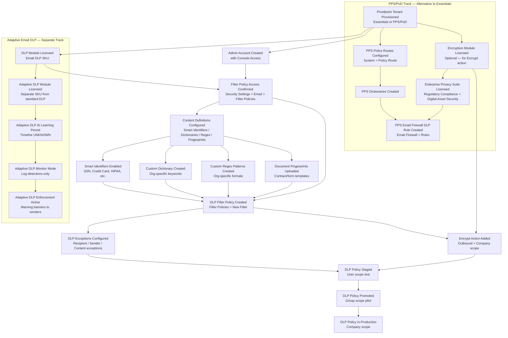

# Data Loss Prevention (DLP) Policies — Prerequisites
## Proofpoint Email DLP (Essentials / PPS / Adaptive)

---

## Dependency Graph

---

## Configuration Order

### 1. Proofpoint Tenant Provisioning (out of scope — vendor-managed)

**Capability:** Organization setup
**What to configure:** Proofpoint Essentials or PPS/PoD tenant is created by Proofpoint during onboarding.
**Minimum viable config:** Tenant exists; MX records pointed to Proofpoint
**Time estimate:** Vendor SLA — typically 1–5 business days
**Source:** [S1, Grade A]
**No prerequisites**

---

### 2. Admin Account with Console Access (5 minutes)

**Capability:** Identity and access management
**Workflow:** Essentials console login at admin.proofpoint.com (Essentials) or PPS admin console
**What to configure:** Confirm your account has Admin role (not End User role). Company-level filter creation requires Admin.
**Minimum viable config:** Login succeeds; Security Settings menu is visible in left nav
**Source:** [S1, Grade A]
**Requires:** [1]

---

### 3. DLP Module Licensed (vendor action — 0 min admin effort)

**Capability:** License management
**What to configure:** Email DLP module must be enabled on the Proofpoint account. Standard Essentials may not include DLP by default.
**Minimum viable config:** DLP module appears in Features or is confirmed active by account team
**Time estimate:** Contact Proofpoint account team; typically same-day or next business day
**Source:** [S24, Grade B]
**Requires:** [1]

---

### 4. Content Definitions Configured (15–60 minutes)

**Capability:** Smart identifier and content library setup
**Workflow:** INCOMPLETE — Smart identifier configuration screen behind auth wall
**What to configure:** Enable at least one detection method:

| Method | Use | Min Config | Source |
|--------|-----|-----------|--------|
| Smart Identifiers (pre-built) | Regulated data (SSN, credit card, HIPAA) | Enable the relevant identifier type(s) | [S18, Grade D]; [S24, Grade B] |
| Custom Dictionary | Industry-specific keywords | Create dictionary with keyword list | [S18, Grade D]; [S24, Grade B] |
| Custom Regex | Org-specific data formats | Define and test regex pattern | [S18, Grade D] |
| Document Fingerprinting | Template/form matching | Upload reference document | [S14, Grade B]; [S18, Grade D] |

**Minimum viable config:** At least one smart identifier enabled OR one custom dictionary created. Smart identifiers (credit card, SSN) may be pre-enabled — verify first.
**Time estimate:** 15 minutes (smart identifiers only) to 60 minutes (custom dictionary + regex)
**Source:** [S18, Grade D]; [S24, Grade B]
**Requires:** [2], [3]

---

### 5. DLP Filter Policy Created (10–15 minutes per policy)

**Capability:** [email-dlp/workflow.md](workflow.md)
**Workflow:** Security Settings > Email > Filter Policies > Outbound > New Filter
**What to configure:** Filter name, direction (Outbound), scope (start at User for testing), condition type (Email Message Content), operator (CONTAINS ALL OF), condition value (smart identifier name), primary action (Quarantine), and optional secondary actions.
**Minimum viable config:** Name + Direction + Scope + 1 Condition + 1 Action
**Time estimate:** 10–15 minutes per filter
**Source:** [S1, Grade A]; Video 7, 20 [Grade B]
**Requires:** [2], [4]

---

### 6. DLP Exceptions Configured (10–30 minutes, optional but recommended)

**Capability:** [email-dlp/workflow.md — Exception Management section](workflow.md)
**What to configure:** Add recipient/sender/content exception conditions to the DLP filter to prevent false positives for legitimate business use cases.
**Minimum viable config:** None required to activate the rule; recommended before Company scope promotion
**Time estimate:** 10–30 minutes (dependent on exception list size)
**Source:** [S18, Grade D]; [S1, Grade A]
**Requires:** [5]

---

### 7. Encryption Integration (10 minutes + vendor provisioning, optional)

**Capability:** [../email-encryption/workflow.md](../email-encryption/workflow.md) (if mapped)
**What to configure:** Add Encrypt as the secondary action (Do dropdown) on an Outbound + Company scope DLP filter. Requires Proofpoint Encryption module licensed separately.
**Minimum viable config:** Direction=Outbound, Scope=Company, Do=Encrypt
**Time estimate:** 10 minutes configuration; vendor provisioning for Encryption module
**Source:** Video 7 [Grade B]; [S14, Grade B]
**Requires:** [5], Encryption module licensed

---

### 8. Staging and Promotion (5–14 days)

**Capability:** DLP policy lifecycle management
**What to configure:** Progressive scope promotion: User → Group → Company. Monitor quarantine at each stage for false positives.
**Minimum viable config:** Production requires Company scope
**Time estimate:** Minimum 3 days per stage recommended; full promotion 5–14 days
**Source:** Video 20 ~4:30 [Grade B]
**Requires:** [5], [6]

---

### 9. Adaptive Email DLP Learning Period (duration UNKNOWN — separate track)

**Capability:** Adaptive Email DLP (5.11)
**What to configure:** Activate Adaptive DLP module; allow AI learning period to complete before enabling enforcement
**Minimum viable config:** Module licensed and activated; learning period elapsed
**Time estimate:** UNKNOWN — Proofpoint has not published a ramp-up timeline. Video 22 [Grade B] describes this as required but does not state duration.
**Source:** [S23, Grade B]; Video 22 [Grade B]
**Requires:** [3] (Adaptive DLP licensed separately from standard Email DLP)

---

### 10. PPS-Specific Prerequisites (PPS/PoD environments only — alternative to steps 4–5)

If deploying on PPS rather than Essentials, complete these steps BEFORE creating Email Firewall DLP rules:

| Step | Action | Screen | Source |
|------|--------|--------|--------|
| 10a | Configure Policy Routes | PPS Admin > System > Policy Route | Video 3 ~0:45 [Grade B] |
| 10b | Create Dictionaries | PPS Admin > Dictionary Management (INCOMPLETE — screen path unknown) | [S2, Grade B] |
| 10c | License Enterprise Privacy Suite (if needed) | Account team; enables Regulatory Compliance + Digital Asset Security modules | [S14, Grade B] |

---

## Total Time Estimate

| Track | Steps | Estimated Time |
|-------|-------|---------------|
| Essentials — Basic DLP rule (1 policy, smart identifiers) | 1–5, 8 | 30–45 minutes active config + 5–14 days staging |
| Essentials — DLP + Encryption | 1–8 | 45–60 minutes active config + vendor encryption provisioning |
| Adaptive Email DLP | 1–3, 9 | Active config: 30 min; learning period: UNKNOWN |
| PPS — Basic DLP rule | 1–3, 10a–10c, 5, 8 | 60–90 minutes (first-time policy route config adds complexity) |
| PPS — Full Enterprise Privacy Suite | All | Several days (module licensing + policy tuning at each layer) |

**Note:** Policy tuning (ongoing false positive reduction) is documented as taking 3–6 months for full enterprise deployments. Source: [S18, Grade D] — single source, Grade D.
