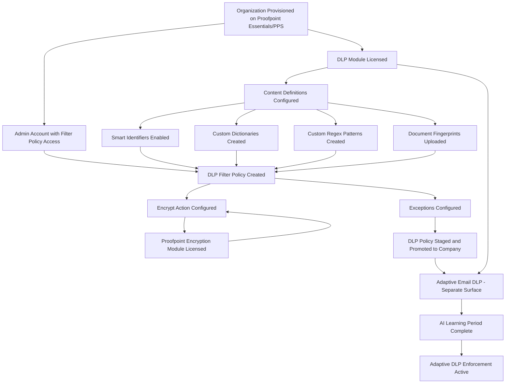
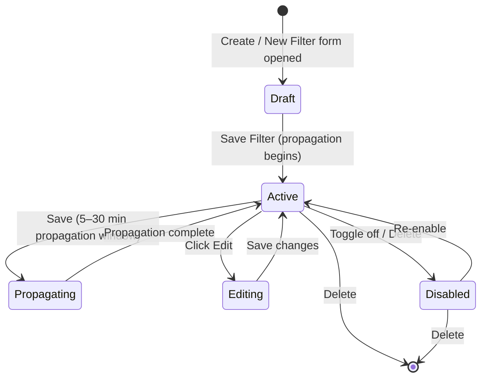
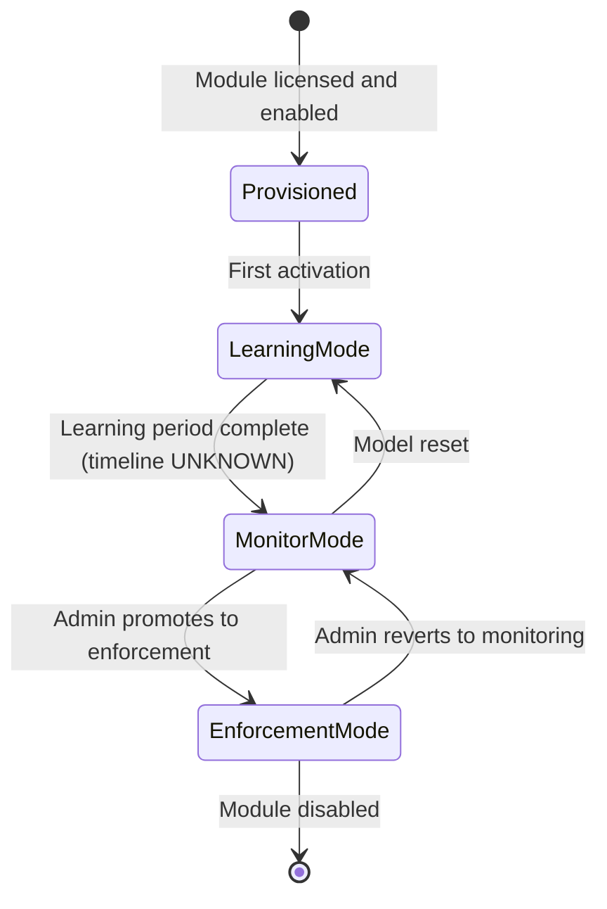

# Data Loss Prevention (DLP) Policies — Workflow Reference
## Proofpoint Email DLP (Essentials / PPS / Adaptive)

> Capability: email-dlp | Generated: 2026-05-21
> Sub-capabilities: 5.1–5.13 | Taxonomy group: 5

---

## Overview

Proofpoint Email DLP prevents sensitive data from leaving the organization via outbound (and monitored inbound) email channels. It combines pre-built smart identifiers (credit card, SSN, HIPAA, etc.), a 240+ classifier library, custom dictionaries, regular expression patterns, and document fingerprinting — all wired to a conditions-and-actions framework that can block, quarantine, encrypt, or log matched messages. In Proofpoint Essentials and PPS the DLP surface is implemented through the Filter Policies interface; in Adaptive Email DLP a behavioral AI layer adds pre-send interception for misdirected-email and human-error patterns; in PPS 8.22.x a Unified DLP module consolidates these surfaces.

The capability sits within the Email Filtering taxonomy (group 5) and has a direct integration dependency on the Email Encryption module (group 6) for auto-encrypt actions. It is the primary policy-authoring surface for content-based data protection.

**Complexity:** COMPLEX — 3+ prerequisite objects, multiple modules (rule-based + behavioral AI), encryption integration, and product-variant divergence (Essentials vs PPS vs Adaptive)
**Prerequisite chain length:** 3–4 steps (organization provisioning → filter policy access → smart identifiers/classifiers → DLP filter creation)
**Total configurable fields documented:** 30+ fields across screens (many more are INCOMPLETE due to auth-wall gaps)
**Screens involved:** 6+ screens across Essentials and PPS surfaces
**Evidence base:** 2 Grade A sources (S1, S24 indirect), 5 Grade B sources (S2, S14, S23, S24, S25), 3 Grade C sources (S16, S20, video-22), 2 Grade D sources (S17, S18), 2 Grade E/U (auth-wall inferred)

---

## Screen Hierarchy

```yaml
# Root entry point — Essentials console
screen:
  name: "Security Settings > Email > Filter Policies"
  navigation: "Log in to Essentials console > Security Settings (left nav) > Email > Filter Policies"
  parent: null
  type: page
  prerequisites:
    - "Organization provisioned on Proofpoint Essentials"
    - "Admin role assigned to logged-in user"
  description: "Lists all inbound and outbound filter policies; entry point for DLP policy creation"
  tabs:
    - "Inbound"
    - "Outbound"
  actions:
    - name: "New Filter"
      type: button
      result: "Opens Filter Policy creation modal/form"

---

screen:
  name: "Security Settings > Email > Filter Policies > New Filter (DLP)"
  navigation: "Filter Policies > Outbound tab > New Filter button"
  parent: "Security Settings > Email > Filter Policies"
  type: modal_dialog
  prerequisites:
    - "Outbound tab must be selected for DLP with Encrypt action"
    - "Smart identifiers or dictionaries pre-configured (optional but needed for content conditions)"
  fields:
    - name: "Filter Name / Description"
      type: text
      required: true
      default: null
      validation: "Free text; internal identifier only — not visible to end users"
      description: "Human-readable label for this DLP rule"
      gotcha: "Name is internal only; no end-user notification uses this label"
    - name: "Direction"
      type: dropdown
      required: true
      default: null
      options: ["Inbound", "Outbound"]
      description: "Determines mail flow direction for this filter"
      gotcha: "The Encrypt action is ONLY available when Direction = Outbound AND Scope = Company. Any other combination removes Encrypt from the action list. Source: Video 7 ~2:00 [Grade B]"
    - name: "Scope"
      type: dropdown
      required: true
      default: null
      options: ["Company", "Group", "User"]
      description: "Determines which level of the organization this filter applies to"
      gotcha: "User-level filters apply BEFORE Group and Company filters. A per-user safe-sender override can silently suppress a company-level DLP policy. Source: Video 20 ~1:30 [Grade B]"
    - name: "Priority"
      type: dropdown
      required: false
      default: "Low"
      options: ["Low", "Normal", "High"]
      description: "Relative processing priority vs other filters at the same scope level"
      gotcha: "Priority is relative to other filters; 'High' does not guarantee this fires before a User-scope filter that overrides it"
    - name: "Condition Type"
      type: dropdown
      required: true
      default: null
      options:
        - "Sender Address"
        - "Recipient Address"
        - "Email Size (kb)"
        - "Client IP Country"
        - "Email Subject"
        - "Email Headers"
        - "Email Message Content"
        - "Raw Email"
        - "Attachment Type"
        - "Attachment Name"
      description: "The attribute of the email evaluated by this condition"
      gotcha: "For DLP content-matching, 'Email Message Content' or 'Attachment Type' are the relevant types; Subject-only rules miss body content"
    - name: "Operator"
      type: dropdown
      required: true
      default: null
      options:
        - "IS"
        - "IS NOT"
        - "IS ANY OF"
        - "IS NONE OF"
        - "CONTAIN(S) ALL OF"
        - "CONTAIN(S) ANY OF"
        - "CONTAIN(S) NONE OF"
      description: "Logical operator applied to the condition value"
      gotcha: "CONTAINS ANY OF with a large dictionary creates broad matching and high false positives. Prefer CONTAINS ALL OF or AND-chained conditions. Source: Video 20 ~3:00 [Grade B]"
    - name: "Condition Value"
      type: text
      required: true
      default: null
      description: "The keyword, phrase, smart identifier name, or regex pattern to match"
      gotcha: "Smart identifiers are referenced here by name; their configuration is managed in a separate screen (INCOMPLETE — configuration screen behind auth wall)"
    - name: "Primary Action"
      type: dropdown
      required: true
      default: null
      options: ["Quarantine", "Allow", "Reject", "Nothing"]
      description: "Primary disposition applied when all conditions match"
      gotcha: "Encrypt is NOT in the Primary Action dropdown for DLP filters configured at Group or User scope, or for Inbound direction. Source: Video 7 ~2:00 [Grade B]"
    - name: "Encrypt (Secondary Action / Do)"
      type: dropdown
      required: false
      default: null
      options: ["Encrypt"]
      description: "Available only in Outbound + Company scope. Triggers Proofpoint Encryption on matched messages."
      gotcha: "This is surfaced as a 'Do' dropdown in some UI versions, not always as a secondary action checkbox. INCOMPLETE — exact UI control type and path require auth. Source: Video 7 ~2:00 [Grade B]"
    - name: "Notify Recipient"
      type: checkbox
      required: false
      default: "Disabled"
      description: "Secondary action: sends a notification to the message recipient"
    - name: "Notify Admin"
      type: checkbox
      required: false
      default: "Disabled"
      description: "Secondary action: sends an alert to the compliance/admin team"
    - name: "Add Header"
      type: checkbox
      required: false
      default: "Disabled"
      description: "Secondary action: inserts a custom header into the matched message. Source: Video 20 ~3:00 [Grade B]"
    - name: "Tag Subject"
      type: checkbox
      required: false
      default: "Disabled"
      description: "Secondary action: prepends a configurable tag to the email subject (e.g., '[DLP ALERT]'). Useful for passive monitoring phase before enforcement. Source: Video 20 ~3:00 [Grade B]"
    - name: "Override Previous Destination"
      type: toggle
      required: false
      default: "Disabled"
      description: "Forces this filter's action to override the destination already set by a higher-priority filter. Source: Video 20 ~3:30 [Grade B]"
      gotcha: "Interaction with quarantine-then-deliver scenarios is non-obvious. If a high-priority filter quarantines and this toggle is on for a lower-priority filter, the lower-priority action wins."
    - name: "Stop Processing Additional Filters"
      type: toggle
      required: false
      default: "Disabled"
      description: "When enabled, no lower-priority filters are evaluated after this one matches. Source: Video 20 ~3:30 [Grade B]"
      gotcha: "CRITICAL: If a spam allow-list filter has this toggle ON, DLP compliance filters with lower priority NEVER fire. This is silent — there is no warning in the UI. Source: Video 20 ~3:30 [Grade B]"
  actions:
    - name: "Save Filter"
      type: button
      result: "Creates the filter policy; begins propagation (5–30 min). Source: Videos 2, 20 [Grade B]"
    - name: "Cancel"
      type: button
      result: "Discards changes, returns to Filter Policies list"
  decision_points:
    - condition: "Direction = Outbound AND Scope = Company"
      effect: "Encrypt action becomes available in the action/Do dropdown"
    - condition: "Direction = Inbound OR Scope = Group/User"
      effect: "Encrypt action not available; quarantine or allow are the only primary actions"

---

screen:
  name: "Security Settings > Email > Filter Policies > [Filter] > Edit"
  navigation: "Filter Policies list > click filter name or edit icon"
  parent: "Security Settings > Email > Filter Policies"
  type: page
  description: "Edit all fields of an existing filter policy. Same fields as creation form."
  prerequisites:
    - "Filter must already exist"

---

# INCOMPLETE: Smart Identifier configuration screen
screen:
  name: "Smart Identifier / DLP Content Library Configuration"
  navigation: "UNKNOWN — likely within Security Settings or a DLP-specific sub-menu in Essentials console. INCOMPLETE — behind auth wall."
  parent: "UNKNOWN"
  type: UNKNOWN
  description: "Configuration screen where pre-built and custom smart identifiers (credit card, SSN, HIPAA, etc.) are enabled and tuned. Also where custom dictionaries and regex patterns are managed."
  fields:
    - name: "Smart Identifier Type"
      type: dropdown
      required: UNKNOWN
      default: UNKNOWN
      options:
        - "Credit Card Number"
        - "US Social Security Number"
        - "Bank Account Number"
        - "HIPAA / Health Information"
        - "Driver's License"
        - "Passport Number"
        - "(additional identifiers — full list UNKNOWN)"
      description: "Pre-built pattern matcher for regulated data types. Source: [S18, Grade D]; confirmed in [S24, Grade B]"
      gotcha: "INCOMPLETE — exact configuration fields, minimum occurrence thresholds, and activation mechanism not documented in accessible sources"
    - name: "Custom Dictionary"
      type: UNKNOWN
      required: false
      default: null
      description: "User-defined keyword/phrase list; can be created inline or uploaded. Source: [S18, Grade D]; [S24, Grade B] confirms feature exists"
      gotcha: "INCOMPLETE — upload format (CSV? plain text?), size limits, and case-sensitivity controls not documented in accessible sources"
    - name: "Custom Regular Expression"
      type: regex
      required: false
      default: null
      description: "Custom regex pattern for matching organization-specific data formats. Source: [S18, Grade D]"
      gotcha: "INCOMPLETE — regex syntax standard (PCRE? ECMAScript?), test utility availability, and max pattern count not documented"
    - name: "Document Fingerprint Template"
      type: file_upload
      required: false
      default: null
      description: "Upload a reference document (contract, form, etc.); system generates a fingerprint for full or partial matching. Source: [S14, Grade B]; [S18, Grade D]"
      gotcha: "INCOMPLETE — supported file formats, fingerprint update workflow, and partial match threshold configuration not documented in accessible sources"

---

# Adaptive Email DLP — separate product/surface
screen:
  name: "Adaptive Email DLP — Policy Configuration"
  navigation: "UNKNOWN — separate admin surface from standard Filter Policies. INCOMPLETE — no admin walkthrough video or public doc found."
  parent: null
  type: UNKNOWN
  description: "Behavioral AI-driven policy surface for misdirected email detection and human error prevention. Architecturally different from rule-based Filter Policies. Source: [S23, Grade B]; Video 22 [Grade B webinar]"
  fields:
    - name: "Enforcement Mode"
      type: UNKNOWN
      required: UNKNOWN
      default: UNKNOWN
      description: "INCOMPLETE — likely controls whether behavioral AI is in monitor-only or block/warn mode"
      gotcha: "Model requires a training/learning period before enforcement accuracy is reliable. Enforcing block actions before model is trained produces high false positive rates. Source: Video 22 [Grade B webinar]"
    - name: "Warning Banner Behavior"
      type: UNKNOWN
      required: UNKNOWN
      default: UNKNOWN
      description: "Adaptive DLP surfaces contextual warning banners to senders before delivery (pre-send interception) requiring user acknowledgment. Source: Video 22 [Grade B webinar]"
      gotcha: "This pre-send interception architecture is fundamentally different from rule-based quarantine/block — it requires user acknowledgment flow, not admin review. Source: Video 22 [Grade B webinar]"

---

# PPS / Enterprise surfaces (INCOMPLETE — admin guide behind auth wall)
screen:
  name: "PPS Admin Console > Email Firewall > Rules (DLP / Content-Based Rules)"
  navigation: "PPS Admin Console > Email Firewall > Rules (PPS-specific top-nav). INCOMPLETE — field-level detail behind auth wall."
  parent: null
  type: page
  description: "PPS rule creation surface for content-based DLP rules. Uses policy routes, conditions, and disposition types. Source: [S2, Grade B]; Video 2 [Grade B]"
  prerequisites:
    - "Policy Routes must be configured (System > Policy Route)"
    - "Dictionaries created before being referenced in rule conditions"
  fields:
    - name: "Rule ID"
      type: text
      required: true
      default: null
      description: "Unique identifier for the firewall rule. Source: Video 2 ~1:00 [Grade B]"
    - name: "Route Condition"
      type: dropdown
      required: true
      default: null
      options: ["default_inbound", "default_outbound", "(custom routes)"]
      description: "Which policy route this rule applies to. MUST be set explicitly. Source: Video 2 ~2:00 [Grade B]"
      gotcha: "CRITICAL: Omitting the Route condition causes the rule to apply to ALL policy routes including outbound. For DLP rules intended for outbound only, this causes inbound false positives. Source: Video 2 ~2:00 [Grade B]"
    - name: "Conditions"
      type: UNKNOWN
      required: true
      default: null
      description: "Content-based criteria using dictionaries, smart identifiers, or regex. INCOMPLETE — full condition type list not documented in accessible sources."
    - name: "Disposition / Action"
      type: UNKNOWN
      required: true
      default: null
      options: ["Deliver Now", "(additional dispositions — UNKNOWN)"]
      description: "Action applied to matched messages. Source: Video 2 ~2:30 [Grade B] shows 'Deliver Now'. Additional dispositions (quarantine, encrypt) INCOMPLETE."
```

---

## Step-by-Step Walkthrough

### Step 1: Verify Organization Provisioning and Admin Access

**Navigate to:** Essentials admin console login
**Screen:** Essentials console home
**Purpose:** Confirm your organization is provisioned on Proofpoint Essentials with admin privileges before attempting policy creation.

| Requirement | Details | Source |
|-------------|---------|--------|
| Organization provisioned | Organization must exist on Proofpoint Essentials | [S1, Grade A] |
| Admin role | Admin account required for company-level filter creation | [S1, Grade A] |
| DLP module licensed | Email DLP is a separately licensed module — verify with Proofpoint account team | [S24, Grade B] |
| Adaptive DLP licensed | Adaptive Email DLP is an additional SKU separate from standard Email DLP | [S23, Grade B] |

**Decision point:** If organization is on PPS rather than Essentials, the DLP workflow uses the PPS Admin Console (Email Firewall > Rules) and policy routes rather than the Essentials Filter Policies UI. See [PPS section](#pps-email-firewall-dlp-rules) below.

---

### Step 2: Identify Detection Method(s) and Configure Content Definitions

**Navigate to:** Smart Identifier / DLP Content Library configuration (INCOMPLETE — exact path behind auth wall)
**Screen:** Smart Identifier Configuration (INCOMPLETE)
**Purpose:** Before creating a DLP filter, determine which detection methods apply to your data type. The condition value in your filter policy references these definitions.

| Detection Method | Description | Best For | Source |
|-----------------|-------------|---------|--------|
| Smart Identifiers | Pre-built regex patterns: credit card, SSN, bank account, HIPAA, drivers license, passport | Regulated data with well-known formats | [S18, Grade D]; confirmed [S24, Grade B] |
| 240+ Pre-built Classifiers | Machine learning classifiers tuned to specific data categories and jurisdictions | Broad content classification without custom rules | [S24, Grade B] |
| Custom Dictionaries | Keyword/phrase lists for industry-specific terms or proprietary data | Trade secrets, HR terminology, project codenames | [S18, Grade D]; confirmed [S24, Grade B] |
| Custom Regular Expressions | Pattern matching for organization-specific data formats (employee IDs, contract numbers) | Structured data not covered by smart identifiers | [S18, Grade D] |
| Document Fingerprinting | Template matching for contracts, forms, templates | Protecting specific document formats/templates | [S14, Grade B]; [S18, Grade D] |
| Machine Learning (Behavioral) | Adaptive AI detecting misdirected email and unusual data transfers | Human error, accidental disclosure | [S23, Grade B] |

**Best practice:** Use a custom dictionary in conjunction with its corresponding smart identifier to reduce false positives. For example: a HIPAA smart identifier paired with a medical terminology dictionary, using AND logic. Source: [S24, Grade B].

**Decision point:** If using behavioral AI (Adaptive Email DLP), this entire step applies to a separate admin surface — see Step 6.

---

### Step 3: Navigate to Filter Policies and Select Direction

**Navigate to:** Security Settings > Email > Filter Policies
**Screen:** Filter Policies list (Inbound / Outbound tabs)
**Purpose:** Open the filter policy creation surface and select the appropriate direction for your DLP rule.

| Tab | Use Case | Encrypt Action Available |
|-----|---------|--------------------------|
| Outbound | Block/quarantine/encrypt data leaving the organization | Yes (Company scope only) |
| Inbound | Monitor or block sensitive data arriving from external sources | No |

**Navigation path (video-confirmed):** Security Settings (left nav) > Email > Filter Policies > Outbound tab. Source: Video 7 ~0:45, Video 20 ~0:30 [Grade B].

---

### Step 4: Create the DLP Filter Policy

**Navigate to:** Filter Policies > Outbound tab > New Filter
**Screen:** Filter Policy creation form
**Purpose:** Define the DLP rule with name, scope, conditions, and actions.

| Field | Type | Required | Default | Value for DLP | Source |
|-------|------|----------|---------|--------------|--------|
| Filter Name / Description | text | Yes | None | Descriptive name (e.g., "Block SSN in Outbound") | [S1, Grade A] |
| Direction | dropdown | Yes | None | Outbound (for data loss prevention) | [S1, Grade A] |
| Scope | dropdown | Yes | None | Company (required for Encrypt action) | [S1, Grade A]; Video 7 ~1:30 [Grade B] |
| Priority | dropdown | No | Low | Normal or High for DLP rules | [S1, Grade A] |
| Condition Type | dropdown | Yes | None | Email Message Content (for body); Attachment Type (for files) | [S1, Grade A] |
| Operator | dropdown | Yes | None | CONTAINS ALL OF (preferred for DLP to reduce false positives) | [S1, Grade A] |
| Condition Value | text | Yes | None | Smart identifier name, dictionary name, or keyword | [S18, Grade D] |
| Primary Action | dropdown | Yes | None | Quarantine (for review) or Reject (for hard block) | [S1, Grade A]; [S18, Grade D] |
| Notify Admin | checkbox | No | Disabled | Enable for compliance alerting | [S18, Grade D]; Video 20 ~3:00 [Grade B] |
| Notify Sender | checkbox | No | Disabled | Enable to alert users their email was flagged | [S18, Grade D] |
| Tag Subject | checkbox | No | Disabled | Enable during testing/monitoring phase | Video 20 ~3:00 [Grade B] |
| Stop Processing Additional Filters | toggle | No | Disabled | Leave DISABLED for DLP rules | Video 20 ~3:30 [Grade B] |

**To add the Encrypt action (Outbound + Company scope only):**

| Field | Type | Required | Value | Source |
|-------|------|----------|-------|--------|
| Direction | dropdown | Yes | Outbound | [S1, Grade A] |
| Scope | dropdown | Yes | Company | Video 7 ~2:00 [Grade B] |
| Do / Secondary Action | dropdown | No | Encrypt | Video 7 ~2:00 [Grade B] |

**Decision point:** Encrypt action only appears in the Do/action dropdown when Direction=Outbound AND Scope=Company. If these conditions are not met, the Encrypt option is silently absent from the dropdown. Source: Video 7 ~2:00 [Grade B].

---

### Step 5: Configure DLP Exceptions (Recipient / Sender / Content)

**Navigate to:** Filter Policies > [DLP filter] > Edit (add additional conditions)
**Screen:** Filter Policy edit form (additional conditions section)
**Purpose:** Exclude legitimate business use cases from triggering the DLP rule.

| Exception Type | Implementation | Source |
|---------------|----------------|--------|
| Recipient exception | Add condition: Recipient Address IS [trusted-partner@domain.com] with Operator IS NONE OF | [S1, Grade A] — inferred from filter condition logic |
| Sender exception | Add condition: Sender Address IS [internal-user@company.com] | [S1, Grade A] |
| Content exception | Add condition with CONTAINS NONE OF for exclusion keywords | [S1, Grade A] |

**INCOMPLETE:** Exception management screen fields not fully documented. The condition-layering approach is inferred from the filter creation form structure. Source: [S18, Grade D] describes exception concepts; implementation pattern inferred from [S1, Grade A] condition logic.

---

### Step 6: Adaptive Email DLP — Behavioral AI Configuration (Separate Surface)

**Navigate to:** INCOMPLETE — Adaptive Email DLP admin surface (separate from Filter Policies)
**Screen:** Adaptive Email DLP Configuration (INCOMPLETE)
**Purpose:** Configure the behavioral AI model for misdirected email and human error detection.

This surface is architecturally distinct from the rule-based Filter Policies workflow. Key characteristics confirmed from Video 22 webinar [Grade B] and [S23, Grade B]:

| Characteristic | Description | Source |
|---------------|-------------|--------|
| Learning period | AI model requires warm-up/training on org email patterns before enforcement accuracy is reliable. No published timeline. | Video 22 [Grade B]; NOVEL finding |
| Pre-send interception | Surfaces warning banners to senders before delivery — requires user acknowledgment | Video 22 [Grade B] |
| Architecture difference | Coexists with rule-based DLP but uses separate configuration interface | Video 22 [Grade B]; [S23, Grade B] |
| Enforcement modes | Monitor vs enforce (exact mode names INCOMPLETE) | [S23, Grade B] |

**INCOMPLETE:** Exact navigation path, configuration fields, and enforcement mode names for Adaptive Email DLP are not documented in accessible sources. Source for existence and behavior: [S23, Grade B]; Video 22 [Grade B webinar].

---

### Step 7: PPS Email Firewall DLP Rules (PPS/PoD deployments only)

**Navigate to:** PPS Admin Console > Email Firewall > Rules
**Screen:** Email Firewall Rule creation (INCOMPLETE — field-level detail behind auth wall)
**Purpose:** In PPS/PoD environments, DLP rules are created in the Email Firewall interface, not in Filter Policies.

| Prerequisite | Details | Source |
|-------------|---------|--------|
| Policy routes defined | System > Policy Route must have routes configured before rules can reference them | Video 3 ~0:45 [Grade B] |
| Dictionaries created | Word/phrase lists must be created before referencing in conditions | [S2, Grade B] |
| Enterprise Privacy Suite licensed | Regulatory Compliance and Digital Asset Security modules are licensed add-ons | [S14, Grade B] |

**Key steps (from Video 2 [Grade B]):**
1. Navigate to Email Firewall > Rules
2. Add Rule with unique Rule ID
3. Add Condition — CRITICAL: set Route condition to "default_inbound" (or equivalent) — omitting this applies rule to all routes including outbound
4. Configure content conditions using dictionaries or smart identifiers
5. Set Disposition/action
6. Save and wait 5–30 minutes for propagation

---

### Step 8: PPS Regulatory Compliance Module (PPS Enterprise Privacy Suite)

**Screens:** INCOMPLETE — admin guide behind auth wall
**Purpose:** The Regulatory Compliance module provides smart identifiers specifically for financial and healthcare regulated data within PPS. Source: [S14, Grade B].

| Component | Function | Source |
|-----------|---------|--------|
| Proofpoint Email Firewall | Detects sensitive info in content and email subject | [S14, Grade B] |
| Proofpoint Regulatory Compliance | Smart identifiers for financial data (PCI), healthcare (HIPAA), and other regulated categories | [S14, Grade B] |
| Proofpoint Digital Asset Security | Document fingerprinting with full and partial document matching | [S14, Grade B] |
| Proofpoint Encryption | Applies encryption as a policy action when DLP conditions are met | [S14, Grade B] |

**INCOMPLETE:** Configuration screens, field names, and workflow steps for enabling and tuning these modules are behind the auth wall. The above is product-level description from the Encryption data sheet.

---

### Step 9: Verify and Stage the DLP Rule

**Navigate to:** Filter Policies list
**Screen:** Filter Policies (Inbound/Outbound list)
**Purpose:** Confirm the rule is created and staged correctly before promoting to Company scope.

Recommended staging sequence (Video 20 ~4:30 [Grade B]):

| Stage | Scope | Duration | Action if OK |
|-------|-------|---------|-------------|
| 1 — Test | User (your own account) | 1–2 days | Monitor matched messages in quarantine |
| 2 — Group | Group (pilot team) | 3–5 days | Review false positive rate |
| 3 — Company | Company | Production | Monitor for 2 weeks; adjust thresholds |

**Wait for propagation:** Rule changes take 5–30 minutes to propagate. Testing immediately after save will produce false negatives. Source: Videos 2, 20 [Grade B].

---

## Dependency Graph



### Prerequisite Chain (Ordered)

```
1. Organization Provisioning — Proofpoint Essentials or PPS tenant created — no prerequisites
   Est. time: provisioned by vendor; out of scope for policy authoring
   Source: [S1, Grade A]

2. Admin Account Access — Admin role assigned; console access confirmed — requires [1]
   Est. time: 5 minutes
   Source: [S1, Grade A]

3. DLP Module Licensed — Email DLP module enabled on the account — requires [1]
   Est. time: vendor provisioning; confirm with account team
   Source: [S24, Grade B]

4. Content Definitions Configured — At least one smart identifier enabled OR custom dictionary/regex/fingerprint created — requires [2], [3]
   Est. time: 15–30 minutes
   Source: [S18, Grade D]; [S24, Grade B]
   NOTE: Screen path for this step is INCOMPLETE (auth wall)

5. DLP Filter Policy Created — Filter policy with condition + action created — requires [2], [4]
   Est. time: 10–15 minutes per policy
   Source: [S1, Grade A]; Video 7, 20 [Grade B]

6. Exceptions Configured (optional) — Recipient/sender/content exceptions added to policy — requires [5]
   Est. time: 10–20 minutes
   Source: [S18, Grade D]; [S1, Grade A]

7. Encrypt Integration (optional) — Proofpoint Encryption module licensed and encrypt action added — requires [5], encryption module [S14, Grade B]
   Est. time: vendor provisioning + 10 minutes to configure
   Source: [S14, Grade B]; Video 7 [Grade B]

8. DLP Policy Staged and Promoted — Staged through User > Group > Company scopes — requires [5]
   Est. time: 5–14 days for staged rollout
   Source: Video 20 [Grade B]

9. Adaptive Email DLP Learning Period (separate track) — AI model trained on org patterns — requires [3]
   Est. time: UNKNOWN — no published ramp-up timeline. Source: Video 22 [Grade B]

10. Adaptive Email DLP Enforcement Active — Behavioral enforcement enabled — requires [9]
    Est. time: after learning period
    Source: [S23, Grade B]
```

---

## Decision Points

| Screen | Decision | Options | Default | Implications | Recommended | Why | Reversible |
|--------|----------|---------|---------|-------------|-------------|-----|------------|
| Filter Policy > Direction | Inbound vs Outbound | Inbound, Outbound | None | Outbound unlocks Encrypt action; Inbound does not | Outbound for standard DLP | Data loss prevention is primarily an outbound concern | Yes |
| Filter Policy > Scope | Application level | Company, Group, User | None | Company scope required for Encrypt. User-level overrides higher scopes silently. | Company for production DLP | Widest enforcement coverage | Yes |
| Filter Policy > Operator | Matching logic | IS, IS NOT, CONTAINS ANY OF, CONTAINS ALL OF, CONTAINS NONE OF, etc. | None | ANY OF = broad match = high false positives; ALL OF = narrow match = higher precision | CONTAINS ALL OF | Reduces false positive rate for DLP rules | Yes |
| Filter Policy > Primary Action | Enforcement action | Quarantine, Allow, Reject, Nothing | None | Quarantine = admin review queue; Reject = hard block; Nothing = monitor-only | Quarantine (start) → Reject (after tuning) | Quarantine during tuning to catch false positives before hard-blocking | Yes |
| Filter Policy > Stop Processing | Filter chain behavior | On, Off | Off (Disabled) | On = no lower-priority filters fire after this matches | DISABLED for DLP rules | DLP rules must not be silently bypassed by upstream spam/allow filters | Yes |
| Filter Policy > Override Previous Destination | Destination override | On, Off | Off (Disabled) | On = this filter's action overrides any prior filter's destination | Situation-dependent | Only enable if this DLP rule must supersede all prior routing decisions | Yes |
| Encrypt Action > Scope requirement | Company vs Group | Company only | N/A | Group-level encryption cannot use standard Encrypt action in filter UI | Company scope | Only scope that supports Encrypt | Yes |
| Staging sequence | Scope rollout | User → Group → Company | N/A | Direct Company deployment risks org-wide mail disruption | Staged rollout | Catch false positives at small scope before widening | Yes |
| Detection method | Content matching approach | Smart ID, Dictionary, Regex, Fingerprint, Adaptive AI | N/A | Each has different false positive profile and maintenance burden | Smart ID + Dictionary (AND logic) | Balances recall and precision; official best practice from [S24, Grade B] | Yes |
| Adaptive DLP vs Rule-based | Architecture choice | Rule-based (Filter Policies), Behavioral AI (Adaptive DLP) | N/A | Different admin surfaces, different enforcement models; can coexist | Rule-based first; add Adaptive for human error | Establishes baseline coverage before adding behavioral layer | Yes |

---

## Object Lifecycle

### Filter Policy Lifecycle



Note: Proofpoint Essentials does not expose an explicit Draft state in the UI — filters are created and saved directly to Active state. The propagation window (5–30 minutes) represents a transitional state where the rule exists but may not yet be enforced by all processing nodes. Source: Videos 2, 20 [Grade B].

### Adaptive Email DLP Lifecycle



Source: [S23, Grade B]; Video 22 [Grade B]. State names PARTIALLY INFERRED (Grade E) — exact mode labels in admin console are UNKNOWN.

---

## Integration Touchpoints

| Capability | Relationship | Direction | Notes |
|-----------|-------------|-----------|-------|
| Email Encryption (cap 6) | DLP trigger activates encryption | DLP → Encryption | Encrypt action in DLP filter invokes Proofpoint Encryption module. Source: [S14, Grade B]; Video 7 [Grade B] |
| Email Filtering / Filter Policies (cap 1) | DLP policies are implemented as Filter Policies | Same surface | DLP is a sub-type of Filter Policy; shares the same creation form and scope/priority system. Source: [S1, Grade A]; Video 20 [Grade B] |
| PPS Email Firewall (cap 2) | PPS DLP implemented as Email Firewall Rules | PPS-specific | PPS uses different screen (Email Firewall > Rules) vs Essentials Filter Policies. Source: [S2, Grade B]; Video 2 [Grade B] |
| PPS Regulatory Compliance Module (cap 5.9) | Adds HIPAA/PCI smart identifiers to PPS DLP | Subcomponent | Part of Enterprise Privacy Suite. Source: [S14, Grade B] |
| PPS Digital Asset Security Module (cap 5.10) | Adds document fingerprinting to PPS DLP | Subcomponent | Partial and full document matching. Source: [S14, Grade B] |
| Adaptive Email DLP (cap 5.11) | Behavioral AI layer coexisting with rule-based DLP | Parallel | Separate admin surface; different enforcement model. Source: [S23, Grade B]; Video 22 [Grade B] |
| CASB DLP (cap 10.3) | Shared classifier framework across email and cloud apps | Cross-product | Proofpoint aims for consistent policies across email and cloud DLP surfaces. Source: [S13, Grade A] |
| Browser/Email Isolation (cap 11) | Inline DLP for upload/download during isolation sessions | Integration | Real-time DLP integrated with isolation. Source: [S15, Grade B] |
| Quarantine Management (cap 14) | DLP quarantine actions feed into quarantine console | Downstream | Quarantined DLP messages appear in admin quarantine for review. Source: [S19, Grade D] |

---

## Complexity Score

| Dimension | Simple | Moderate | Complex | This Capability |
|-----------|--------|----------|---------|-----------------|
| Fields | 3–5 fields | 10–20 fields | 50+ fields | 20+ documented fields (50+ with INCOMPLETE screens) → MODERATE-to-COMPLEX |
| Screens | 1 screen | 2–3 screens | 4+ screens with sub-tabs | 6+ screens (2 fully documented, 4 INCOMPLETE) → COMPLEX |
| Dependencies | No prerequisites | 1–2 prerequisites | Chain of 3+ prerequisites | 4+ prerequisite steps + licensing gating → COMPLEX |

**Overall complexity: COMPLEX**

**Justification:** The prerequisite chain requires organization provisioning, admin access, DLP module licensing, and content definition configuration before the first DLP filter can be created. The filter policies surface is documented at moderate depth, but the smart identifier configuration screen, the Adaptive DLP surface, and PPS-specific modules (Regulatory Compliance, Digital Asset Security) are all behind authentication walls, creating INCOMPLETE sections. Multiple product variants (Essentials, PPS, Adaptive) have divergent admin surfaces for the same capability. The encryption integration introduces an additional licensing and configuration dependency. Complexity follows the highest dimension (dependencies + screen count = COMPLEX).

---

## Sources

| # | Source | Grade | Used For |
|---|--------|-------|----------|
| S1 | Proofpoint Essentials Administrator Guide (2014) | A | Filter creation fields, scope/priority, condition types, operators, filter precedence rules |
| S2 | Enterprise Protection for the Administrator Training Datasheet | B | PPS rule architecture, policy routes, module precedence |
| S14 | Proofpoint Encryption Data Sheet | B | Encryption trigger parameters, Enterprise Privacy Suite components (Regulatory Compliance, Digital Asset Security), document fingerprinting |
| S18 | How to Configure DLP Rules in Proofpoint (InventiveHQ) | D | Detection methods list, DLP actions, exception management, deployment timeline |
| S23 | Proofpoint Adaptive Email DLP Product Page | B | Behavioral AI description, misdirected email detection |
| S24 | Proofpoint Email DLP Product Page | B | 240+ classifiers, smart identifiers, custom dictionaries, best practice (dictionary + smart ID combination) |
| S25 | CASB DLP Configuration Training Datasheet | B | DLP rule workflow (CASB context but applicable patterns) |
| Video 2 | How to Enable/Modify Email Firewall Rule (PPS) | B | Route condition gotcha, propagation time, PPS UI navigation |
| Video 7 | How to Enable Proofpoint Email Encryption — PPS Tutorial | B | Encrypt action scope restriction (Outbound + Company only), navigation path for encryption filter |
| Video 20 | Proofpoint Essentials — Configure Filter Policy | B | Secondary actions (Notify, Add Header, Tag Subject), Stop Processing toggle gotcha, Override Previous Destination, scope precedence, staging workflow |
| Video 22 | Live Demo: Adaptive Email DLP (webinar, Jan 2025) | B | Behavioral AI learning period, pre-send warning banner architecture |
| S13 | Proofpoint CASB Overview | A | CASB + Email DLP integration, shared classifier framework |
| S15 | Proofpoint Isolation Data Sheet | B | Inline DLP for isolation sessions |
