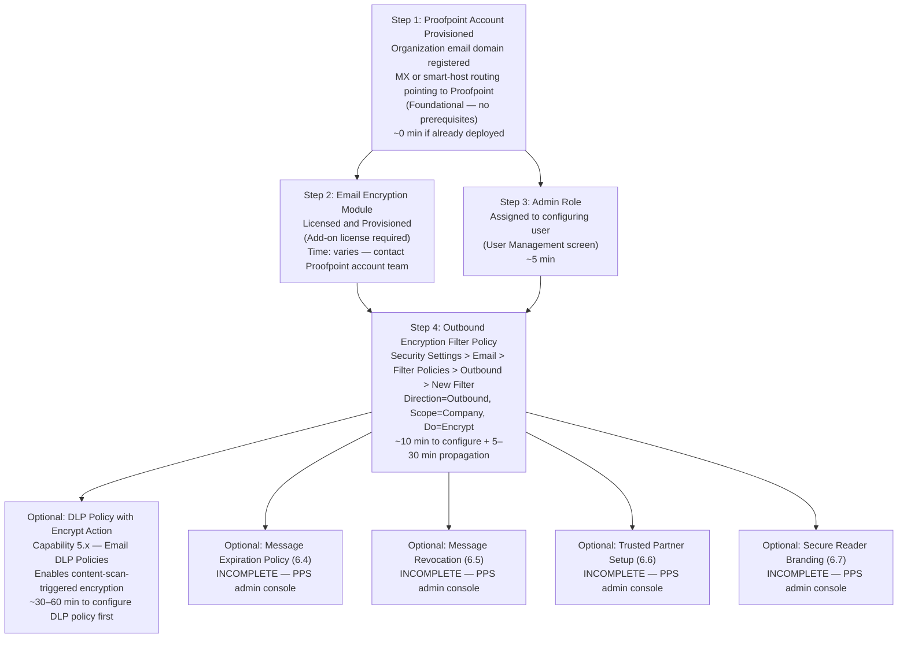

# Email Encryption Policies — Prerequisites

> Capability: email-encryption | Product: Proofpoint (Essentials + PPS/PoD)
> Dependency chain length: 4 steps to first working encryption filter
> Total time estimate: 35–75 minutes (excluding license procurement)

---

## Dependency Graph

---

## Configuration Order

### 1. Proofpoint Account Provisioned (0 minutes if already deployed)

**Capability:** Platform foundational
**What to configure:** Organization email domain registered with Proofpoint; MX record or smart-host relay confirmed pointing to Proofpoint infrastructure for outbound mail scanning
**Minimum viable config:** At least one verified sending domain; outbound mail routing confirmed through Proofpoint
**Verify:** Send a test email and confirm it routes through Proofpoint in the mail logs

**Source:** E — Inferred from [S14] architecture description; A — [S1] for domain configuration concepts

---

### 2. Email Encryption Module Licensed and Provisioned (varies)

**Capability:** Licensing — contact Proofpoint account team or admin portal
**What to configure:** Email Encryption add-on license applied to the account; encryption module provisioned
**Minimum viable config:** "Proofpoint Email Encryption" visible in licensed features list; Encrypt option visible in Filter Policies > Do dropdown
**Verify:** Navigate to Security Settings > Email > Filter Policies > New Filter (Direction=Outbound, Scope=Company); confirm "Encrypt" appears in the Do dropdown

**Critical:** If the Encrypt action does not appear in the Do dropdown after setting Direction=Outbound and Scope=Company, the encryption module is not provisioned. Contact Proofpoint support before proceeding.

**Source:** B — [S14] (encryption is a separately licensed product); E — Inferred from [V7] behavior documentation

---

### 3. Admin Role Assigned to Configuring User (5 minutes)

**Capability:** User Management — Users & Groups section of Essentials console
**What to configure:** Assign Admin role to the user who will create and manage encryption filter policies
**Minimum viable config:** User account with Admin role confirmed
**Verify:** Log in as the target admin user; confirm access to Company Settings and Security Settings top-level navigation

**Source:** A — [S1] (admin role required for organization-level filters)

---

### 4. Outbound Encryption Filter Policy (10 minutes + 5–30 min propagation)

**Capability:** This capability — [email-encryption/workflow.md](workflow.md)
**What to configure:** Outbound filter policy at Company scope with condition (trigger type) and Do=Encrypt action
**Minimum viable config:**
- Filter Name: any descriptive name
- Direction: Outbound
- Scope: Company
- Condition: Email Subject CONTAIN(S) ANY OF [ENCRYPT] (for user-initiated) or Email Message Content for DLP-triggered
- Do: Encrypt
**Ready when:** Test email with [ENCRYPT] in subject delivered to external recipient as Secure Reader-protected message

**Source:** B — Video 7 [V7]; A — [S1]

---

### 5. DLP Policy with Encrypt Action — Optional (30–60 minutes)

**Capability:** Email DLP Policies — [../email-dlp/workflow.md](../email-dlp/workflow.md) (if available)
**What to configure:** DLP policy that detects sensitive content (PHI, PII, financial data) and sets Encrypt as the response action; DLP detection feeds into the encryption pipeline automatically
**Minimum viable config:** DLP policy with at least one smart identifier or content condition and action=Encrypt
**When needed:** When encryption should be triggered automatically by content analysis rather than user subject-line keywords

**Source:** B — [S14]; D — [S18]

---

## Total Time Estimate

| Step | Time | Notes |
|------|------|-------|
| Account provisioned | 0 min | Assumed already deployed |
| Encryption module licensing | Varies | May require procurement/contract cycle |
| Admin role assignment | 5 min | If user account already exists |
| Encryption filter creation | 10 min | Core configuration |
| Propagation wait | 5–30 min | Cannot be shortened |
| Test and verify | 10 min | Send test email, check Secure Reader delivery |
| **Minimum total (excl. licensing)** | **~35–60 min** | |
| DLP integration (optional) | 30–60 min additional | Only if content-scan triggering is needed |

---

## What Breaks Without Each Prerequisite

| Missing Prerequisite | Symptom | How to Diagnose |
|---------------------|---------|-----------------|
| Encryption module not provisioned | "Encrypt" option absent from Do dropdown when Direction=Outbound, Scope=Company | Check Do dropdown after setting Direction=Outbound, Scope=Company |
| Admin role missing | Cannot access Company Settings or Security Settings to create org-level filters | Attempting to create Company-scope filter returns permissions error |
| Account not routing outbound mail through Proofpoint | Encryption filter never fires — mail bypasses Proofpoint entirely | Check mail headers on outbound messages for Proofpoint relay headers |
| Filter not propagated (tested too soon) | Encryption filter exists but does not fire on test messages | Wait full 30 minutes; re-test |

**Source:** E — Inferred from [S1] prerequisites and [V7] encryption filter creation walkthrough
