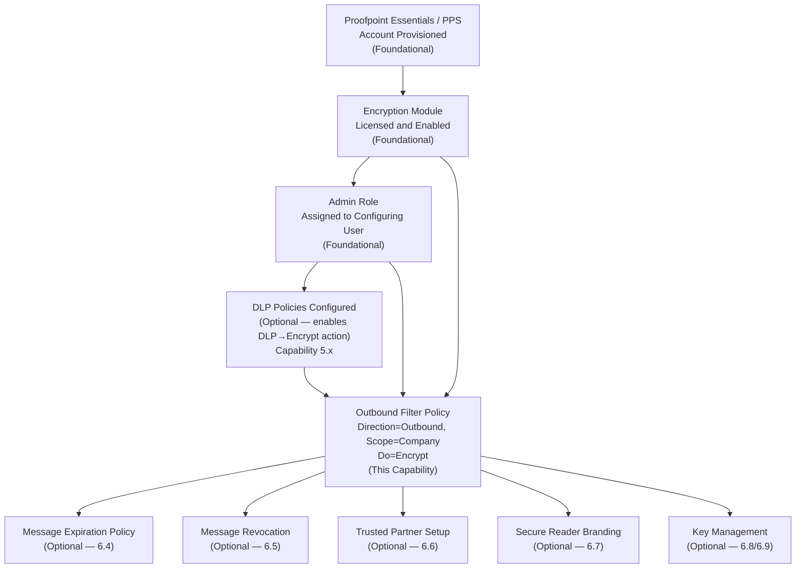
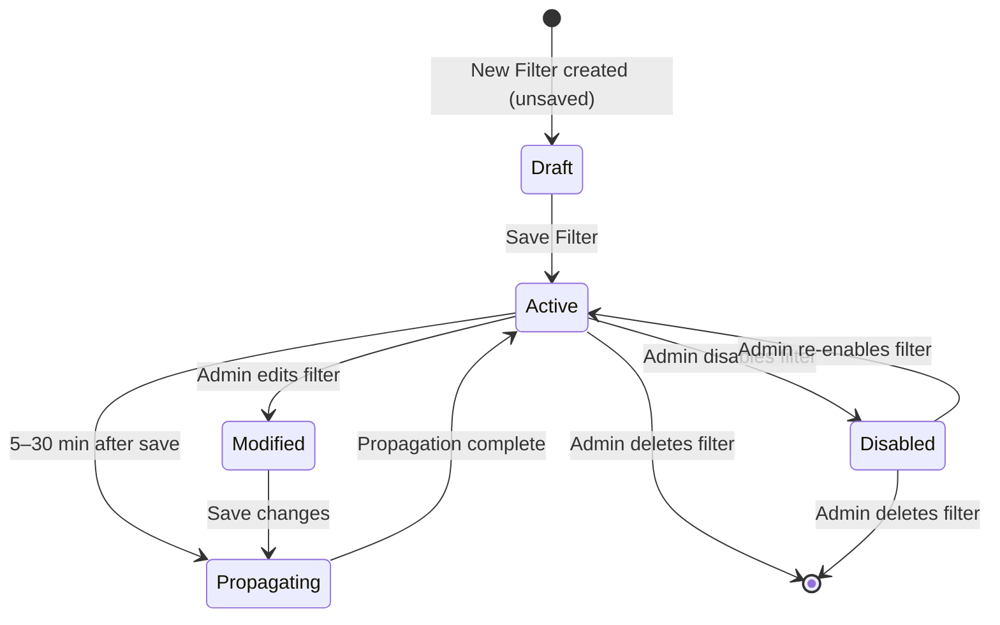
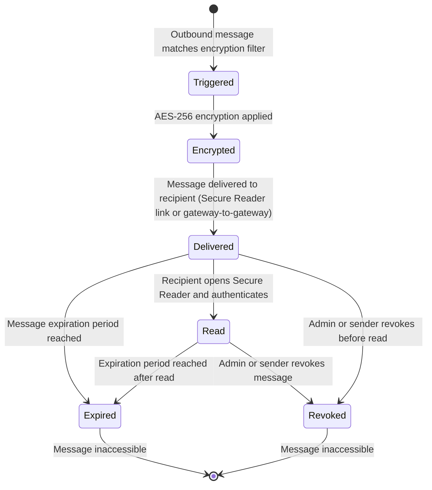

# Email Encryption Policies — Workflow Reference

> Capability: email-encryption | Product: Proofpoint (Essentials + PPS/PoD)
> Generated: 2026-05-21 | Taxonomy group: 6 (sub-capabilities 6.1–6.11)

---

## Overview

Proofpoint Email Encryption is a policy-driven capability that automatically applies AES-256 encryption to outbound email messages based on organizational rules. Encryption can be triggered by deep content analysis (PHI, PII, financial data, document fingerprints), message origin or destination attributes, TLS delivery failure fallback, user-initiated subject-line keywords, or DLP policy action. Recipients read encrypted messages via the Proofpoint Secure Reader web portal or, for registered Proofpoint-to-Proofpoint partners, via transparent gateway-to-gateway decryption. Administrators can configure message expiration, per-message revocation, branding, and key management delegation.

**Complexity:** COMPLEX — 4-step prerequisite chain; Encrypt action restricted by scope+direction combination; 11 sub-capabilities across two product interfaces (Essentials filter UI + PPS Enterprise Privacy Suite modules)
**Prerequisite chain length:** 4 steps
**Total configurable fields:** 28 documented; additional fields exist behind authentication wall (marked INCOMPLETE)
**Screens involved:** 7 documented screens (3 confirmed from video, 4 from data-sheet-level sources)
**Evidence base:** 0 Grade A screens (auth wall); 2 Grade B sources [S14, S2]; 4 Grade B training video findings [V7]; 2 Grade D [S17, S18]; 5 Grade E inferred

---

## Screen Hierarchy

```yaml
screens:
  - name: "Security Settings > Email > Filter Policies"
    navigation: "Log in to Essentials console > Security Settings (top nav) > Email > Filter Policies"
    parent: null
    type: page
    description: "Lists all inbound and outbound filter policies for the organization"
    tabs:
      - "Inbound"
      - "Outbound"
    actions:
      - name: "New Filter"
        type: button
        result: "Opens the New Filter creation modal/form"
    prerequisites:
      - "Organization provisioned on Proofpoint Essentials"
      - "Admin role assigned"
    evidence: "B — Video 7 ~0:45 [V7]"

  - name: "Security Settings > Email > Filter Policies > Outbound > New Filter"
    navigation: "Security Settings > Email > Filter Policies > Outbound tab > New Filter"
    parent: "Security Settings > Email > Filter Policies"
    type: modal_dialog
    description: "Create a new outbound filter policy that can trigger encryption"
    fields:
      - name: "Filter Name"
        type: text
        required: true
        default: null
        validation: "Non-empty string; must be unique within policy direction"
        description: "Internal identifier for the filter policy"
        gotcha: "Name is admin-visible only; not shown to message recipients"
        evidence: "B — Video 7 ~1:30 [V7]"

      - name: "Direction"
        type: dropdown
        required: true
        default: null
        options: ["Inbound", "Outbound"]
        description: "Mail flow direction this filter applies to"
        gotcha: "CRITICAL: Encrypt action only appears in the Do dropdown when Direction = Outbound. Selecting Inbound removes Encrypt from the available actions list."
        evidence: "B — Video 7 ~2:00 [V7]; Cross-reference doc [S1] for direction field"

      - name: "Scope"
        type: dropdown
        required: true
        default: null
        options: ["Company", "Group", "User"]
        description: "Organizational level at which the filter applies"
        gotcha: "CRITICAL: Encrypt action only appears when Scope = Company. Selecting Group or User removes Encrypt from the Do dropdown. Per-group encryption cannot be configured via standard filter UI."
        evidence: "B — Video 7 ~2:00 [V7]"

      - name: "Priority"
        type: dropdown
        required: false
        default: "Low"
        options: ["Low", "Normal", "High"]
        description: "Processing order relative to other filters; High processes first"
        gotcha: "Priority interacts with 'Stop Processing Additional Filters' toggle — a high-priority filter with Stop Processing will silently prevent lower-priority DLP or compliance filters from firing"
        evidence: "A — [S1] for priority values; B — [V7] for interaction gotcha"

      - name: "If (Condition Type)"
        type: dropdown
        required: true
        default: null
        options:
          - "Sender Address"
          - "Recipient Address"
          - "Email Size (kb)"
          - "Client IP Country"
          - "Email Subject"
          - "Email Headers"
          - "Email Message Content"
          - "Raw Email"
          - "Attachment Type"
          - "Attachment Name"
        description: "The attribute of the email that triggers the filter rule"
        evidence: "A — [S1]"

      - name: "Operator"
        type: dropdown
        required: true
        default: null
        options:
          - "IS"
          - "IS NOT"
          - "IS ANY OF"
          - "IS NONE OF"
          - "CONTAIN(S) ALL OF"
          - "CONTAIN(S) ANY OF"
          - "CONTAIN(S) NONE OF"
        description: "Pattern matching logic applied between condition type and value"
        evidence: "A — [S1]"

      - name: "Condition Value"
        type: text
        required: true
        default: null
        validation: "Format depends on Condition Type (e.g., email address, domain, keyword, subject text)"
        description: "The value matched against the condition type using the selected operator"
        gotcha: "For Subject-based encryption triggers, the value must exactly match the configured keyword (e.g., '[ENCRYPT]') — partial match requires operator CONTAIN(S) ANY OF, not IS"
        evidence: "A — [S1] for field; D — [S17] for subject keyword trigger pattern"

      - name: "Do (Primary Action)"
        type: dropdown
        required: true
        default: null
        options:
          - "Encrypt (only when Direction=Outbound AND Scope=Company)"
          - "Allow (skipping spam filter)"
          - "Allow (but filter for spam)"
          - "Quarantine"
          - "Reject"
          - "Nothing"
        description: "Primary disposition applied to messages matching the filter condition"
        gotcha: "Encrypt option is absent from dropdown unless both Direction=Outbound AND Scope=Company are set. Changing either field after selecting Encrypt resets the action."
        evidence: "B — Video 7 ~2:00 [V7]; confirmed by cross-reference note in [S14]"

      - name: "Stop Processing Additional Filters"
        type: toggle
        required: false
        default: "Off"
        description: "When enabled, halts evaluation of lower-priority filters after this filter matches"
        gotcha: "Silently breaks downstream filter chain — DLP and compliance filters below this rule will never fire for matched messages"
        evidence: "B — Video 20 ~3:30 [V20 from video-intelligence.md]"

      - name: "Override Previous Destination"
        type: toggle
        required: false
        default: "Off"
        description: "Changes message destination even if a higher-priority filter already set it"
        gotcha: "Can cause quarantine-then-deliver confusion when combined with reordered priority chains"
        evidence: "B — Video 20 ~3:30 [V20 from video-intelligence.md]"

      - name: "Hide Logs"
        type: checkbox
        required: false
        default: "Disabled"
        description: "Hides this filter's activity from end-user log view"
        evidence: "A — [S1]"

      - name: "Enforce Completely Secure SMTP Delivery"
        type: checkbox
        required: false
        default: "Disabled"
        description: "Forces TLS delivery with valid certificate check; falls back to Proofpoint Encryption if TLS fails (TLS fallback trigger)"
        gotcha: "This checkbox IS the TLS fallback trigger for encryption — enabling it activates sub-capability 6.2 TLS fallback without requiring a separate Encrypt action in the Do field"
        evidence: "A — [S1]; B — [S14] for TLS fallback mechanism"

      - name: "Enforce only TLS on SMTP Delivery"
        type: checkbox
        required: false
        default: "Disabled"
        description: "Forces TLS delivery without certificate validation (weaker than Completely Secure)"
        evidence: "A — [S1]"

    actions:
      - name: "Save Filter"
        type: button
        result: "Creates the filter policy; propagation takes 5–30 minutes"
      - name: "Cancel"
        type: button
        result: "Discards changes, returns to Filter Policies list"
    decision_points:
      - condition: "When Direction = Outbound AND Scope = Company"
        effect: "Encrypt option becomes available in Do dropdown"
      - condition: "When Direction = Inbound OR Scope = Group/User"
        effect: "Encrypt option is removed from Do dropdown"
    evidence: "B — Video 7 ~1:30–2:00 [V7]"

  - name: "Security Settings > Email > Filter Policies > Outbound (list view)"
    navigation: "Security Settings > Email > Filter Policies > Outbound tab"
    parent: "Security Settings > Email > Filter Policies"
    type: tab
    description: "Lists all outbound filter policies with priority and status; drag-to-reorder supported"
    gotcha: "Filter execution order in Essentials is determined by the visual list order (drag-and-drop) and the Priority field together — ensure encryption filters appear at the correct position in the list"
    evidence: "B — Video 9 ~0:30 [V9 from video-intelligence.md]; A — [S1]"

  - name: "PPS Enterprise Privacy Suite — Email Firewall > Rules"
    navigation: "PPS admin console > Email Firewall > Rules"
    parent: null
    type: page
    description: "PPS-only screen: lists and manages Email Firewall rules; encryption is applied via the Proofpoint Encryption component of the Enterprise Privacy Suite"
    fields:
      - name: "Rule ID"
        type: text
        required: true
        default: null
        description: "Unique identifier for the firewall rule"
        evidence: "B — Video 2 ~1:00 [V2 from video-intelligence.md]"
      - name: "Route Condition"
        type: dropdown
        required: true
        default: null
        options: ["default_inbound", "default_outbound", "custom route names"]
        description: "Policy route this rule applies to; must be set explicitly"
        gotcha: "Omitting Route condition causes the rule to apply to ALL policy routes including outbound — sensitive data detection rules fire on inbound mail that should be exempt"
        evidence: "B — Video 2 ~2:00 [V2 from video-intelligence.md]"
      - name: "Disposition / Delivery Method"
        type: dropdown
        required: true
        default: null
        options: ["Deliver Now", "Encrypt", "Quarantine", "Discard", "INCOMPLETE — full list not documented in accessible sources"]
        description: "Action applied to messages matching rule conditions"
        evidence: "B — Video 2 ~2:30 [V2]; B — [S14] for Encrypt disposition type"
    prerequisites:
      - "Policy Routes must be defined before rules can correctly scope traffic"
      - "Proofpoint Encryption component licensed and enabled"
    evidence: "B — [S2]; B — Video 2 [V2 from video-intelligence.md]"
    note: "INCOMPLETE — full field list requires PPS admin console access (auth wall)"

  - name: "PPS — Message Expiration Policy Configuration"
    navigation: "INCOMPLETE — navigation path not documented in accessible sources"
    parent: null
    type: page
    description: "Configure time-based expiration for encrypted messages per policy"
    fields:
      - name: "Expiration Period"
        type: number
        required: false
        default: "UNKNOWN — not documented in sources"
        description: "Number of days/hours after which the encrypted message expires and becomes inaccessible via Secure Reader"
        evidence: "B — [S14] confirms feature exists; admin UI fields INCOMPLETE"
    evidence: "B — [S14]"
    note: "INCOMPLETE — fields require PPS admin console access"

  - name: "PPS — Trusted Partner Encryption Setup"
    navigation: "INCOMPLETE — navigation path not documented in accessible sources"
    parent: null
    type: page
    description: "Configure gateway-to-gateway transparent decryption between Proofpoint customer organizations; recipients in partner domains do not use Secure Reader"
    fields:
      - name: "Partner Domain"
        type: text
        required: true
        default: null
        description: "Domain of the trusted partner organization"
        evidence: "E — Inferred from [S14] feature description; field names not in accessible docs"
      - name: "Encryption Method"
        type: dropdown
        required: true
        default: "UNKNOWN"
        options: ["INCOMPLETE — not documented in grade-A/B sources"]
        description: "Gateway encryption protocol for partner delivery"
        evidence: "D — [S18] references Portal Pickup, PDF, TLS, S/MIME as options; not confirmed in [S14]"
    evidence: "B — [S14] confirms feature; configuration UI INCOMPLETE"
    note: "INCOMPLETE — fields require admin console access"

  - name: "PPS — Secure Reader Branding"
    navigation: "INCOMPLETE — navigation path not documented in accessible sources"
    parent: null
    type: page
    description: "Customize the Secure Reader web portal appearance with organization logo and branding for encrypted message recipients"
    fields:
      - name: "Organization Logo"
        type: file_upload
        required: false
        default: "Proofpoint default branding"
        description: "Logo image displayed in Secure Reader for external recipients"
        evidence: "E — Inferred from [S14] mention of branding capability; field names INCOMPLETE"
    evidence: "B — [S14] confirms feature; configuration UI INCOMPLETE"
    note: "INCOMPLETE — fields require admin console access"
```

---

## Step-by-Step Walkthrough

### Step 1: Verify Encryption Is Licensed and Provisioned

**Navigate to:** Proofpoint admin portal or contact Proofpoint account team
**Screen:** Account provisioning / license check
**Purpose:** Proofpoint Encryption is a separately licensed add-on. The Encrypt action in Filter Policies is invisible if the encryption module is not provisioned for the account.

| Check | How | Expected Result |
|-------|-----|-----------------|
| Encryption license | Verify with Proofpoint account team or admin portal license page | "Proofpoint Email Encryption" appears in licensed features |
| Essentials: Encrypt action visible | Create a test Outbound + Company filter; check Do dropdown | "Encrypt" appears as an option |

**Source:** B — [S14] confirms encryption is an add-on product; E — Inferred from Encrypt action visibility behavior documented in [V7]

---

### Step 2: Configure the Encryption Trigger Filter (Essentials)

**Navigate to:** Security Settings > Email > Filter Policies > Outbound tab > New Filter
**Screen:** New Filter modal
**Purpose:** Define the condition that automatically triggers encryption on outbound messages

| Field | Type | Required | Default | Recommended Value | Notes |
|-------|------|----------|---------|-------------------|-------|
| Filter Name | text | YES | — | e.g., "Encrypt Sensitive Outbound" | Admin-visible only |
| Direction | dropdown | YES | — | Outbound | **Must be Outbound for Encrypt action** |
| Scope | dropdown | YES | — | Company | **Must be Company for Encrypt action** |
| Priority | dropdown | NO | Low | Normal or High | Set High if this must override other outbound filters |
| If (Condition Type) | dropdown | YES | — | Email Subject | For user-triggered encryption; use Email Message Content for DLP-triggered |
| Operator | dropdown | YES | — | CONTAIN(S) ANY OF | Allows partial keyword match |
| Condition Value | text | YES | — | [ENCRYPT] | User-initiated keyword; or use PHI/PII terms for DLP-triggered |
| Do (Primary Action) | dropdown | YES | — | Encrypt | Only visible when Direction=Outbound AND Scope=Company |
| Stop Processing Additional Filters | toggle | NO | Off | Off | Leave Off to allow downstream filters to also fire |
| Override Previous Destination | toggle | NO | Off | Off | Leave Off unless intentional override of prior filter actions |
| Enforce Completely Secure SMTP Delivery | checkbox | NO | Off | On | Activates TLS fallback: delivers via TLS when possible, encrypts when TLS fails |

**Decision point — Trigger type selection:**

| Trigger Type | Condition Type Value | Operator | Condition Value | Use Case |
|-------------|---------------------|----------|-----------------|----------|
| User-initiated keyword | Email Subject | CONTAIN(S) ANY OF | [ENCRYPT] | Employees self-trigger encryption by adding keyword to subject |
| DLP content scan | Email Message Content | CONTAIN(S) ANY OF | PHI keywords or smart identifier values | Automatic detection of sensitive data |
| Recipient domain | Recipient Address | IS ANY OF | @partner.com, @regulated-domain.org | All mail to specific external domains is encrypted |
| Attachment-based | Attachment Type | IS ANY OF | office documents, PDF | Encrypts messages with specific attachment types |
| TLS fallback only | (Direction + Scope set) | — | — | Enable "Enforce Completely Secure SMTP Delivery" checkbox; no Do=Encrypt needed |

**Source:** B — [S14] for trigger types; A — [S1] for condition/operator fields; D — [S17] for user-initiated keyword pattern; B — Video 7 [V7] for Direction+Scope requirement

---

### Step 3: Save and Allow Propagation

**Navigate to:** Same screen — click Save Filter
**Purpose:** Commit the filter policy to the system

After saving, the filter is not immediately active. Propagation takes 5–30 minutes. Do not test immediately after saving.

**Source:** B — Video 2 ~3:00 [V2 from video-intelligence.md]; B — Video 20 ~4:00 [V20 from video-intelligence.md]

---

### Step 4: Verify Encryption Fires (Test Protocol)

**Navigate to:** Send test email from a mailbox within the organization scope, then check delivery
**Purpose:** Confirm the encryption filter is active and the recipient receives an encrypted message

| Test Step | Action | Expected Result |
|-----------|--------|-----------------|
| 1 | Wait 15–30 minutes after saving filter | Propagation complete |
| 2 | Send test email from internal user to external address with subject containing [ENCRYPT] | Email sent |
| 3 | Check external recipient inbox | Recipient receives notification with link to Secure Reader |
| 4 | Recipient clicks link | Secure Reader portal opens; recipient registers or logs in |
| 5 | Recipient reads message | Message content visible in Secure Reader |
| 6 | Check Proofpoint log/audit | Filter match logged for the test message |

**Source:** E — Inferred from [S14] Secure Reader description and [V7] encryption workflow; D — [S17] for test protocol pattern

---

### Step 5: Configure Message Expiration (Optional — 6.4)

**Navigate to:** INCOMPLETE — PPS admin console path not documented in accessible sources
**Purpose:** Set a time-based expiration after which encrypted messages become inaccessible to recipients

This sub-capability is confirmed to exist [S14] but the specific admin UI screens and fields are behind the PPS/PoD authentication wall and are not documented in the accessible corpus. Mark as INCOMPLETE.

**Source:** B — [S14] confirms Message Expiration as a feature; UI INCOMPLETE

---

### Step 6: Configure Message Revocation (Optional — 6.5)

**Navigate to:** INCOMPLETE — PPS admin console path not documented in accessible sources
**Purpose:** Enable per-message, per-recipient revocation so senders or admins can invalidate access to a specific encrypted message after delivery

Revocation is per-message and per-recipient — it does not require a separate policy screen but is initiated from a message management console. The configuration enabling revocation capability must be set at policy level. Admin UI INCOMPLETE.

**Source:** B — [S14] confirms Message Revocation as a feature; UI INCOMPLETE

---

### Step 7: Configure Trusted Partner Encryption (Optional — 6.6)

**Navigate to:** INCOMPLETE — PPS admin console path not documented in accessible sources
**Purpose:** Configure gateway-to-gateway transparent decryption so messages to partner organizations are automatically decrypted without requiring recipients to use Secure Reader

Trusted Partner setup requires both organizations to be Proofpoint customers. The feature is sometimes called "Decrypt Assist" in product materials. Admin UI INCOMPLETE.

**Source:** B — [S14] for feature description; UI INCOMPLETE

---

### Step 8: Configure Secure Reader Branding (Optional — 6.7)

**Navigate to:** INCOMPLETE — PPS admin console path not documented in accessible sources
**Purpose:** Apply organization logo and branding to the Secure Reader web portal shown to external encrypted message recipients

**Source:** B — [S14] confirms branding capability; UI INCOMPLETE

---

### Step 9: Key Management Configuration (Optional — 6.8)

Proofpoint Key Service manages encryption keys centrally. End-user key management delegation (6.9) allows individual users to manage their own keys. Both sub-capabilities require PPS admin console access not available in the research corpus.

**Source:** B — [S14] confirms Proofpoint Key Service; UI INCOMPLETE

---

### Step 10: Classified Document Encryption via Microsoft IAM (Optional — 6.10)

**Navigate to:** INCOMPLETE — navigation path not documented in accessible sources
**Purpose:** Automatically encrypt outbound messages containing documents with Microsoft Information Protection (MIP/AIP) classification labels

Proofpoint reads IAM metadata classification and applies encryption when documents with regulated classification labels are detected. Integration with Microsoft requires additional configuration outside Proofpoint admin console. Admin UI INCOMPLETE.

**Source:** B — [S14] confirms feature ("Encrypt Classified Data"); UI INCOMPLETE

---

### Step 11: Inbound Encrypted Email Decryption at Gateway (6.11)

**Navigate to:** INCOMPLETE — PPS admin console path not documented in accessible sources
**Purpose:** Configure the Proofpoint gateway to automatically decrypt inbound encrypted messages before delivery to internal recipients

This sub-capability is distinct from Trusted Partner setup. It applies to inbound encrypted messages from non-Proofpoint senders (e.g., S/MIME or PGP-encrypted inbound mail). Admin UI INCOMPLETE.

**Source:** B — [S14] confirms feature; UI INCOMPLETE

---

## Dependency Graph



### Prerequisite Chain (Ordered)

1. **Proofpoint account provisioned** — created at: Proofpoint provisioning/account portal — no prerequisites
   - Minimum: organization email domain registered; MX or smart-host routing confirmed pointing to Proofpoint
   - Source: E — Inferred from [S14] architecture description

2. **Email Encryption module licensed and provisioned** — confirmed at: admin portal license page — requires: [Step 1]
   - The Encrypt action in Filter Policies is absent if this module is not provisioned
   - Source: B — [S14]; E — Inferred from [V7] behavior

3. **Admin role assigned to configuring user** — confirmed at: user management screen — requires: [Step 1]
   - Source: A — [S1] for admin role requirement

4. **Outbound encryption filter policy created** — created at: Security Settings > Email > Filter Policies > Outbound > New Filter — requires: [Steps 1, 2, 3]
   - Source: B — Video 7 [V7]

5. **DLP policy with Encrypt action (optional path)** — created at: DLP policy screen — requires: [Steps 1, 2, 3]
   - When DLP detects sensitive content, the Encrypt action can be the DLP policy's response
   - Source: B — [S14]; D — [S18]

---

## Decision Points

| Screen | Decision | Options | Default | Implications | Recommended | Why | Source |
|--------|----------|---------|---------|-------------|-------------|-----|--------|
| New Filter | Trigger mechanism | Subject keyword vs Content scan vs Recipient domain vs Attachment type vs TLS fallback | None | Subject keyword = user-initiated; Content scan = DLP-integrated; Recipient domain = partner-specific; TLS fallback = delivery-mode only | Content scan (Email Message Content) for automated compliance; Subject keyword for user-initiated | Content scan enforces policy without relying on user behavior | B [S14]; A [S1] |
| New Filter | Scope selection | Company only (for Encrypt) | None | Group/User scope does not allow Encrypt action — IRREVERSIBLE constraint of the product | Company | No alternative for standard encryption filter | B [V7] |
| New Filter | TLS fallback vs always-encrypt | Enforce Completely Secure SMTP Delivery checkbox vs Do=Encrypt | Neither | TLS fallback sends cleartext via TLS when partner supports it; Do=Encrypt always uses Secure Reader regardless | TLS fallback for partners with TLS; Do=Encrypt for regulated data | TLS fallback reduces friction for recipients while maintaining encryption when TLS fails | A [S1]; B [S14] |
| New Filter | Stop Processing toggle | On / Off | Off | On: downstream DLP/compliance filters never fire after this matches | Off | Leaving On creates silent policy gaps | B [V20] |
| Filter list | Filter order (priority + visual position) | High/Normal/Low priority + drag position | Low | Encryption filter must fire before allow-list filters that might bypass it | Set encryption filter to High priority | Ensures encryption fires before any bypass rules | A [S1]; B [V7] |
| Trusted Partner | Encryption method | Portal Pickup / PDF / TLS / S/MIME | UNKNOWN | Portal Pickup = Secure Reader portal; PDF = encrypted PDF attachment; TLS = transport encryption; S/MIME = end-to-end certificate | TLS for partners with TLS capability; Portal Pickup as default fallback | Reduces recipient friction | D [S18] — SINGLE SOURCE, grade D |

**IRREVERSIBLE decisions:**
- Scope=Company is a hard constraint for Encrypt action — cannot be changed to Group/User after selecting Encrypt

---

## Object Lifecycle



**Encrypted message lifecycle:**



**Source:** B — [S14] for expiration/revocation states; E — Inferred transitions from feature descriptions

---

## Integration Touchpoints

| Capability | Relationship | Direction | Notes | Source |
|-----------|-------------|-----------|-------|--------|
| DLP Policies (5.x) | DLP detection triggers Encrypt action as DLP policy response | DLP → Encryption | DLP policy must be configured first; Encrypt is an available DLP action | B [S14]; D [S18] |
| Email Filtering Policies (1.x) | Encryption is implemented as a filter policy action; shares the Filter Policies UI | Sibling | Same screen, same field types; encryption just adds the Encrypt option to the Do dropdown | A [S1]; B [V7] |
| PPS Email Firewall (2.x) | Firewall detects sensitive content; Encryption component applies encryption | Email Firewall → Encryption | PPS Enterprise Privacy Suite: Regulatory Compliance and Digital Asset Security modules feed the encryption trigger | B [S14] |
| Trusted Partner Encryption (6.6) | Gateway-to-gateway decryption when both parties are Proofpoint customers | Encryption → Trusted Partner | Trusted Partner config removes Secure Reader requirement for those recipients | B [S14] |
| TLS Enforcement (1.7) | TLS fallback is an alternative trigger path implemented via filter checkbox, not Encrypt action | Sibling | "Enforce Completely Secure SMTP Delivery" checkbox in same filter form activates TLS→Encryption fallback | A [S1]; B [S14] |
| Key Management / Proofpoint Key Service (6.8) | Key Service manages AES-256 keys used by all encryption policies | Encryption → Key Service | Key management is a supporting service; not configured per-filter | B [S14] |
| Microsoft IAM / MIP Classification (6.10) | Encryption triggered by MIP document classification labels | MIP → Encryption | Requires Microsoft integration configured outside Proofpoint admin console | B [S14] |

---

## Complexity Score

| Dimension | Simple | Moderate | Complex | This Capability |
|-----------|--------|----------|---------|-----------------|
| Fields | 3–5 fields | 10–20 fields | 50+ fields | 13 documented fields in primary screen + 15 additional fields in incomplete screens → MODERATE for primary path |
| Screens | 1 screen | 2–3 screens | 4+ screens | 7 screens (3 confirmed, 4 INCOMPLETE) → COMPLEX |
| Dependencies | No prerequisites | 1–2 prerequisites | Chain of 3+ | 4-step chain (account → license → role → filter policy) → COMPLEX |

**Overall score: COMPLEX**

**Justification:** The primary encryption filter configuration involves a moderate field count in a single screen (Direction+Scope constraint is the key complexity driver). However, the full capability spans 11 sub-capabilities across two product interfaces (Essentials filter UI and PPS Enterprise Privacy Suite modules), with 4 of 7 screens entirely behind the authentication wall. The prerequisite chain requires explicit licensing verification before the Encrypt action is even visible in the UI. Sub-capabilities 6.4 through 6.11 are all INCOMPLETE due to documentation access limitations. Highest dimension is COMPLEX (screens and dependencies), so overall score is COMPLEX.

---

## Sources

| # | Source | Grade | Used For |
|---|--------|-------|----------|
| S1 | Proofpoint Essentials Administrator Guide (2014) — d3xh1dlqxy2hb.cloudfront.net | A | Filter condition types, operators, direction field, priority values, TLS enforcement checkboxes |
| S14 | Proofpoint Encryption Data Sheet — proofpoint.com/sites/default/files/pfpt-us-ds-encryption.pdf | B | Encryption feature inventory (AES-256, Secure Reader, Expiration, Revocation, Trusted Partner, Key Service, IAM integration, TLS fallback, Decrypt Assist) |
| S17 | InventiveHQ Essentials Filter Guide — inventivehq.com | D | User-initiated subject keyword trigger pattern ([ENCRYPT]); single source, not confirmed in grade-A docs |
| S18 | InventiveHQ DLP Rules Guide — inventivehq.com | D | Encryption method options (Portal Pickup, PDF, TLS, S/MIME); single source, not confirmed in grade-A/B docs |
| V7 | Proofpoint YouTube — How to Enable Proofpoint Email Encryption Service | B | Direction=Outbound AND Scope=Company constraint; New Filter navigation path; Encrypt action visibility behavior |
| V2 | Proofpoint YouTube — How to Enable or Modify Email Firewall Rule | B | PPS Email Firewall route condition requirement; propagation time |
| V20 | Proofpoint Essentials Vidyard — Configure Filter Policy | B | Stop Processing Additional Filters toggle behavior; Override Previous Destination behavior; filter scope precedence order; propagation time |
| V9 | Proofpoint YouTube — How to Set Filtering Order | B | Filter list visual order behavior |
| S2 | PPS Enterprise Protection Training Datasheet — proofpoint.com | B | PPS Enterprise Privacy Suite architecture; Email Firewall, Regulatory Compliance, Digital Asset Security, Encryption components |
