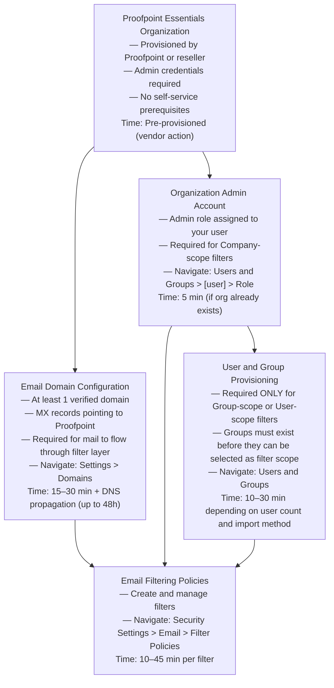

# Email Filtering Policies (Proofpoint Essentials) — Prerequisites

> What must exist before you can configure email filtering policies.
> Total prerequisite chain: 4 steps (3 mandatory, 1 conditional)
> Total estimated time (prerequisites only): 30–60 minutes for a new org

---

## Dependency Graph

**Note:** User and Group Provisioning (D) is only required if you plan to create Group-scope or User-scope filters. For Company-scope-only deployments, D is optional.

---

## Configuration Order

### 1. Proofpoint Essentials Organization (time: pre-provisioned)

**Capability:** Initial Provisioning (outside scope of this document)

**What to configure:** The Proofpoint Essentials tenant is provisioned by Proofpoint or an authorized reseller. You receive admin credentials to log in to the admin console.

**Minimum viable config:** Active tenant with at least one admin account.

**How to verify:** Log in to your Proofpoint Essentials admin console at `us1.proofpointessentials.com` (or your regional instance) with your admin credentials.

**Source:** [S1] (Grade A)

---

### 2. Email Domain Configuration (time: 15–30 min + DNS propagation up to 48 hours)

**Capability:** Domain Settings (Settings > Domains)

**What to configure:** Add your organization's email domain(s) to Proofpoint Essentials and update your DNS MX records to point to Proofpoint's mail exchange servers. Proofpoint will provide the required MX record values.

**Minimum viable config:**
- At least one domain added and verified in Settings > Domains
- MX records updated at your DNS registrar to route mail through Proofpoint

**Why it matters:** Email filtering policies only evaluate messages that pass through the Proofpoint Essentials mail relay. If MX records still point to your previous mail server, no messages will flow through Proofpoint and filters will never fire.

**How to verify:** Send a test email to a user in your organization from an external address. The email should appear in the Proofpoint Essentials message log (Security Settings > Logs or equivalent).

**Source:** [S1] (Grade A) — domain configuration is a prerequisite stated in the Essentials admin guide.

---

### 3. Organization Admin Account (time: 5 min if org already exists)

**Capability:** User Management (Users and Groups > [user] > Role)

**What to configure:** Ensure your user account has the Organization Admin role (or equivalent admin role that permits access to Security Settings > Email > Filter Policies).

**Minimum viable config:**
- Your user account has Organization Admin role assigned
- You can navigate to Security Settings > Email > Filter Policies and see the New Filter button

**Why it matters:** Filter policies at Company scope can only be created by Organization Admin or higher. End users can only create User-scope filters from their personal settings or quarantine digest link. Without the admin role, the Filter Policies management screen may be inaccessible or read-only.

**Role levels referenced in docs:**

| Role | Can Create Company-scope Filters | Can Create User-scope Filters | Source |
|------|----------------------------------|-------------------------------|--------|
| Organization Admin | Yes | Yes | [S1] |
| End User | No | Yes (own user only) | [S1] |
| INCOMPLETE — other roles (Group Admin, Read-only Admin) | UNKNOWN | UNKNOWN | — |

**Source:** [S1] (Grade A)

---

### 4. User and Group Provisioning — CONDITIONAL (time: 10–30 min)

**Required only if:** You plan to create Group-scope or User-scope filters.

**Capability:** User Management (Users and Groups)

**What to configure:**
- For Group-scope filters: Create the target group in Users and Groups, and add users to the group
- For User-scope filters: Ensure the target user account exists in the system

**Minimum viable config:**
- Group exists in Users and Groups with at least one member (for Group-scope filters)
- User account exists with a valid email address (for User-scope filters)

**Why it matters:** The Group and User selectors in the filter creation form reference provisioned entities. A filter targeting a non-existent group or user cannot be saved (or will save but never match any messages).

**How to verify:** Navigate to Security Settings > Email > Filter Policies > New Filter. Set Scope = Group and confirm the target group appears in the Group dropdown.

**Source:** [S1] (Grade A — implied by scope selection requiring existing groups/users)

---

### 5. Email Filtering Policies (time: 10–45 min per filter)

**Ready when:** All mandatory prerequisites (steps 1–3) are complete. Step 4 required only for Group/User scope filters.

**Navigate to:** Security Settings > Email > Filter Policies

**First filter time estimate:**
- Simple allow/block rule: 10–15 min (+ 5–30 min propagation)
- Attachment blocking rule: 15–20 min
- Outbound encryption trigger: 20–30 min (requires verifying Encrypt action availability)
- Full inbound + outbound policy set: 2–4 hours (including testing)

---

## Total Time Estimate

| Step | Estimated Time |
|------|---------------|
| 1. Organization provisioning | Pre-provisioned (vendor action; 0 admin time) |
| 2. Domain configuration + MX propagation | 15–30 min admin + up to 48h DNS propagation |
| 3. Admin account role verification | 5 min |
| 4. User/group provisioning (if needed) | 10–30 min |
| First filter creation and verification | 20–45 min |
| **Total (excluding DNS propagation wait)** | **50–110 minutes** |
| **Total (including DNS propagation wait)** | **Up to 49 hours** |

**Practical note:** If your organization already has MX records pointing to Proofpoint and an admin account established, the effective prerequisite time before your first filter is 5–10 minutes to confirm role and access.

---

## Sources

| # | Source | Grade | Used For |
|---|--------|-------|----------|
| S1 | Proofpoint Essentials Administrator Guide (PDF, July 2014) | A | All prerequisite requirements — organization, domain, admin role |
| V20 | Proofpoint Essentials — Configure Filter Policy (Proofpoint, 2023) | B | Navigation path confirmation, propagation time |
