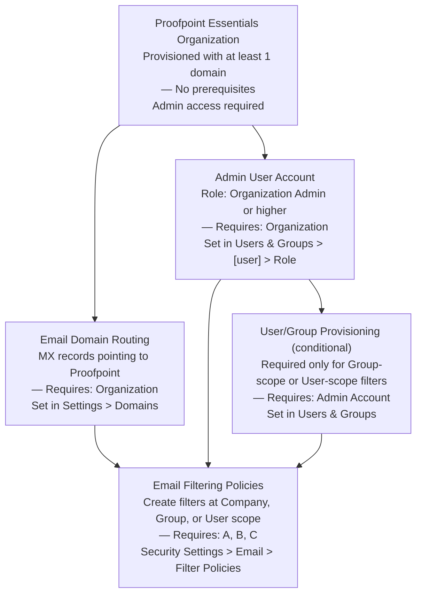
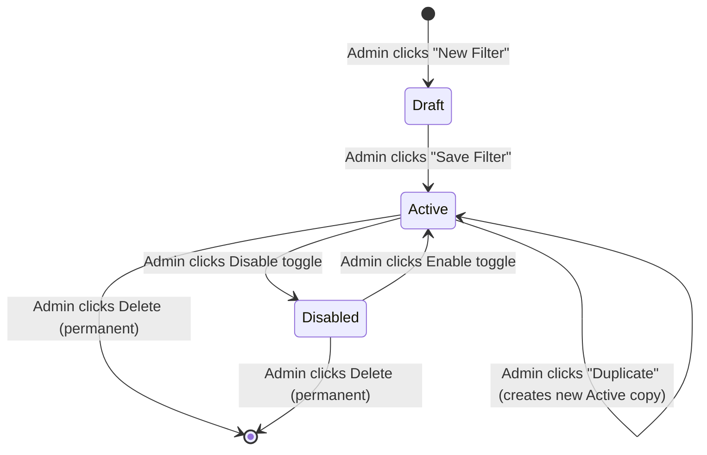
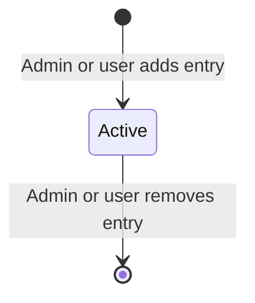

# Email Filtering Policies (Proofpoint Essentials) — Workflow Reference

> Capability: email-filtering | Generated: 2026-05-21
> Sources: doc-corpus (28 sources), video-intelligence (22 videos)
> Sub-capabilities: 1.1 through 1.10 (all 10 sub-capabilities in taxonomy group 1)

---

## Overview

Email Filtering Policies in Proofpoint Essentials is the conditions-and-actions framework that controls how the platform processes inbound and outbound email. Administrators build named filters by combining one or more conditions (sender address, subject content, attachment type, client IP country, message size, etc.) with an operator (IS, CONTAINS, IS ANY OF, etc.) and a primary action (Allow, Quarantine, Reject, or Nothing), plus optional secondary actions (notify recipient, notify admin, insert header, tag subject). Filters are scoped to Company, Group, or User level, assigned a priority, and can be enabled or disabled independently without deletion.

This capability is the foundation of Proofpoint Essentials email security. Every other email protection feature — spam filtering, DLP, outbound encryption triggers — ultimately relies on filters or runs alongside them. Understanding filter precedence rules and the interaction between priority, scope, and the "Stop Processing" toggle is required before deploying any filter at Company scope.

**Complexity:** COMPLEX — 4+ screens with conditional fields, a 3-level scope hierarchy that inverts expected priority order, 10 condition types, 7 operators, and a 3-step prerequisite chain (organization provisioning → domain routing → admin account).

**Prerequisite chain length:** 3 steps
**Total configurable fields:** 17 (primary filter form) + secondary action fields per action type
**Screens involved:** 5 distinct screens (filter list, create filter, edit filter, safe/blocked sender list, filter search)
**Evidence base:** 1 Grade A source [S1], 2 Grade B sources [S2, S14], 1 Grade D source [S17], 2 Grade B videos [V20, V7]

---

## Screen Hierarchy

```yaml
capability_root:
  name: "Email Filtering Policies"
  entry_nav: "Security Settings > Email > Filter Policies"
  product: "Proofpoint Essentials"
  note: "Pre-2023 UI path was 'Company Settings > Filters' [S1]; post-2023 path is 'Security Settings > Email > Filter Policies' [V20]. Both reach the same underlying feature."

screens:
  - name: "Security Settings > Email > Filter Policies"
    navigation: "Left nav: Security Settings → Email → Filter Policies"
    parent: null
    type: page
    description: "Top-level filter list view with Inbound and Outbound tabs"
    fields:
      - name: "Direction tab"
        type: radio_tab
        required: true
        default: "Inbound"
        options: ["Inbound", "Outbound"]
        description: "Switches the filter list between inbound and outbound filters. Inbound and outbound filters are managed in separate lists."
        gotcha: "Outbound filters include an 'Encrypt' primary action that does NOT appear in the Inbound tab. Admins switching tabs may not realize the action set differs."
    actions:
      - name: "New Filter"
        type: button
        result: "Opens the Create Filter form for the currently selected direction tab"
      - name: "Search Filters"
        type: text_input
        result: "Filters the visible filter list by name or condition keyword [S1]"
      - name: "[filter row] Edit"
        type: link
        result: "Opens Edit Filter form for selected filter"
      - name: "[filter row] Duplicate"
        type: link
        result: "Creates a copy of the filter with '(copy)' appended to the name [S1]"
      - name: "[filter row] Delete"
        type: link
        result: "Permanently deletes the filter after confirmation dialog"
      - name: "[filter row] Enable/Disable toggle"
        type: toggle
        result: "Enables or disables the filter without deleting it [S1]"
    prerequisites:
      - "Active Proofpoint Essentials organization with admin role"
    decision_points:
      - condition: "User selects Outbound tab"
        effect: "New Filter form will offer 'Encrypt' as an available primary action (Company scope only); Inbound tab does not offer Encrypt"

  - name: "Filter Policies > New Filter (Inbound)"
    navigation: "Security Settings > Email > Filter Policies > [Inbound tab] > New Filter"
    parent: "Security Settings > Email > Filter Policies"
    type: page
    description: "Create a new inbound filter. All inbound primary actions available."
    fields:
      - name: "Name / Description"
        type: text
        required: true
        default: null
        options: []
        validation: "Free text; must be unique within direction (Inbound). No documented character limit."
        description: "Internal label for the filter. Not shown to end users."
        gotcha: "Names are not enforced unique across Inbound and Outbound — you can have an Inbound filter and an Outbound filter with the same name. This creates confusion during audits."
      - name: "Scope"
        type: dropdown
        required: true
        default: null
        options: ["Company", "Group", "User"]
        description: "Determines which mailboxes the filter applies to. Company = all users in org. Group = selected group. User = single user."
        gotcha: "Processing order is User first, then Group, then Company [V20 ~1:30]. This means per-user filters fire before Company DLP filters. A user's safe-sender entry can suppress a Company quarantine rule."
      - name: "Group (conditional)"
        type: dropdown
        required: true
        default: null
        options: ["[List of provisioned groups]"]
        description: "Appears only when Scope = Group. Selects the target group."
        gotcha: "INCOMPLETE — the group selector field name and whether it supports multi-select is not documented in accessible sources."
        condition: "Visible only when Scope = Group"
      - name: "User (conditional)"
        type: text_or_lookup
        required: true
        default: null
        description: "Appears only when Scope = User. Enter the email address of the target user."
        condition: "Visible only when Scope = User"
      - name: "Priority"
        type: dropdown
        required: false
        default: "Low"
        options: ["Low", "Normal", "High"]
        description: "Controls processing order within the same scope level. High priority filters are evaluated before Normal, which are evaluated before Low."
        gotcha: "Priority ordering only applies within the same scope level. All User-scope filters (regardless of their priority) fire before any Company-scope filters."
      - name: "Condition Type"
        type: dropdown
        required: true
        default: null
        options:
          - "Sender Address"
          - "Recipient Address"
          - "Email Size (kb)"
          - "Client IP Country"
          - "Email Subject"
          - "Email Headers"
          - "Email Message Content"
          - "Raw Email"
          - "Attachment Type"
          - "Attachment Name"
        description: "The email attribute this condition tests against. See Section 1.5 for full detail on each type."
      - name: "Operator"
        type: dropdown
        required: true
        default: null
        options:
          - "IS"
          - "IS NOT"
          - "IS ANY OF"
          - "IS NONE OF"
          - "CONTAIN(S) ALL OF"
          - "CONTAIN(S) ANY OF"
          - "CONTAIN(S) NONE OF"
        description: "The logical relationship between the condition type and the condition value. Available operators vary by condition type."
        gotcha: "INCOMPLETE — which operators are available for each condition type is not fully enumerated in accessible sources [S1]. Email Size (kb) likely only supports IS / IS NOT / numeric comparators, not CONTAINS operators."
      - name: "Condition Value"
        type: text
        required: true
        default: null
        validation: "Depends on condition type. For addresses: user@domain.com or *@domain.com wildcards. For size: numeric (kb). For country: country codes or names. For content: keyword or phrase."
        description: "The value to match against. Multiple values can be entered depending on operator (IS ANY OF accepts comma-separated or newline-separated list)."
        gotcha: "Wildcard syntax beyond *@domain.com is not documented. Regex support is not confirmed in Grade A sources. For regex use cases see DLP-specific filters."
      - name: "Add Condition (button)"
        type: button
        description: "Adds another condition row. Multiple conditions are combined with AND logic by default."
        gotcha: "INCOMPLETE — whether conditions can be combined with OR logic is not documented in Grade A sources. Grade D source [S17] implies AND only at the condition-group level."
      - name: "Primary Action (Destination)"
        type: dropdown
        required: true
        default: null
        options:
          - "Allow (skipping spam filter)"
          - "Allow (but filter for spam)"
          - "Quarantine"
          - "Reject"
          - "Nothing"
        description: "The primary disposition when the filter matches. 'Allow (skipping spam filter)' bypasses spam scanning. 'Allow (but filter for spam)' permits delivery but still runs spam scoring. 'Quarantine' holds the message."
        gotcha: "'Reject' bounces the message with an SMTP 5xx response back to the sending MTA. This can leak information that the address exists. Prefer Quarantine for unknown senders."
      - name: "Hide Logs"
        type: checkbox
        required: false
        default: "Disabled"
        description: "When enabled, this filter's matches are hidden from the end user's email log / quarantine view. Admin logs still show matches."
        gotcha: "Not the same as 'Stop Processing Additional Filters'. Hide Logs only affects visibility; it does not change processing behavior."
      - name: "Enforce Completely Secure SMTP Delivery (TLS)"
        type: checkbox
        required: false
        default: "Disabled"
        description: "Forces delivery over TLS with valid certificate verification. If the receiving server cannot satisfy this, delivery fails."
        gotcha: "This is stricter than 'Enforce only TLS' — it validates the certificate. Use for high-assurance partners. Do NOT enable org-wide without first surveying recipient domains' TLS capabilities."
      - name: "Enforce only TLS on SMTP Delivery"
        type: checkbox
        required: false
        default: "Disabled"
        description: "Forces TLS encryption for delivery without certificate validation. Less strict than 'Completely Secure SMTP'; opportunistic TLS is upgraded to required TLS."
        gotcha: "Mutually exclusive with 'Enforce Completely Secure SMTP Delivery' — enabling both is undefined behavior in documentation."
      - name: "Override Previous Destination"
        type: toggle
        required: false
        default: "Disabled"
        description: "When enabled, this filter's action overrides a destination already set by a higher-priority filter."
        gotcha: "This can cause lower-priority allow-list filters to override quarantine decisions made by higher-priority DLP or spam filters. [V20 ~3:30]"
      - name: "Stop Processing Additional Filters"
        type: toggle
        required: false
        default: "Disabled"
        description: "When enabled, if this filter matches, no lower-priority filters in the same scope are evaluated. Acts as an explicit 'break' in the filter evaluation chain."
        gotcha: "HIGH RISK: An allow-list filter for safe senders with 'Stop Processing' enabled will silently bypass all downstream DLP and compliance filters. [V20 ~3:30]"
      - name: "Secondary Actions (multi-select)"
        type: multiselect
        required: false
        default: "None"
        options:
          - "Notify Recipient"
          - "Notify Admin"
          - "Add Header"
          - "Tag Subject"
        description: "Additional actions taken in addition to the Primary Action. Source: [V20 ~3:00]. Not fully documented in [S1] (Grade D cross-reference [S17])."
        gotcha: "Secondary action fields appear conditionally when each secondary action is selected. See conditional fields below."
    actions:
      - name: "Save Filter"
        type: button
        result: "Saves the filter and adds it to the active filter list. Propagation takes 5–15 minutes, up to 30 minutes. [V20 ~4:00]"
      - name: "Cancel"
        type: button
        result: "Discards changes and returns to Filter Policies list"
    prerequisites:
      - "Admin or organization admin role [S1]"
      - "At least one email domain configured in organization settings [S1]"
    decision_points:
      - condition: "Scope = Group"
        effect: "Group selector field appears; filter applies only to members of that group"
      - condition: "Scope = User"
        effect: "User email field appears; filter applies only to that individual user"
      - condition: "Secondary Action = Add Header"
        effect: "Header Name and Header Value text fields appear"
      - condition: "Secondary Action = Tag Subject"
        effect: "Subject Tag text field appears (e.g., '[SUSPICIOUS]')"
      - condition: "Secondary Action = Notify Recipient"
        effect: "Notification template selector appears (INCOMPLETE — template options not documented)"
      - condition: "Secondary Action = Notify Admin"
        effect: "Admin email address field appears"

  - name: "Filter Policies > New Filter (Outbound)"
    navigation: "Security Settings > Email > Filter Policies > [Outbound tab] > New Filter"
    parent: "Security Settings > Email > Filter Policies"
    type: page
    description: "Create a new outbound filter. Identical to Inbound form except Primary Action adds 'Encrypt' option (Company + Outbound scope only)."
    fields:
      - name: "All Inbound fields"
        description: "See Inbound filter form above. All fields identical except Primary Action options."
      - name: "Primary Action (Destination) — Outbound variant"
        type: dropdown
        required: true
        default: null
        options:
          - "Allow (skipping spam filter)"
          - "Allow (but filter for spam)"
          - "Quarantine"
          - "Reject"
          - "Nothing"
          - "Encrypt"
        description: "Outbound adds 'Encrypt' option. 'Encrypt' is only shown when Direction = Outbound AND Scope = Company."
        gotcha: "If you create an Outbound filter with Scope = Group or User, the 'Encrypt' action disappears from the dropdown. This is a hard platform constraint. [V7 ~2:00]"
    decision_points:
      - condition: "Scope = Group or User (Outbound)"
        effect: "'Encrypt' option removed from Primary Action dropdown. Cannot set group-level encryption via standard filter UI. IRREVERSIBLE for that filter — must change scope to Company to restore Encrypt option."

  - name: "Security Settings > Email > Filter Policies > [filter row] > Edit"
    navigation: "Security Settings > Email > Filter Policies > [click filter name or Edit link]"
    parent: "Security Settings > Email > Filter Policies"
    type: page
    description: "Edit an existing filter. Identical to Create form but pre-populated with saved values. Direction cannot be changed after creation."
    fields:
      - name: "All creation fields"
        description: "All fields from Create Filter form. Note: Direction (Inbound/Outbound) is fixed and cannot be edited."
        gotcha: "Direction is set at creation and cannot be changed. If you need to change an Inbound filter to Outbound, you must delete and recreate it. Consider using Duplicate to copy first."

  - name: "Security Settings > Email > Safe/Blocked Senders"
    navigation: "Security Settings > Email > Safe Senders OR Blocked Senders (separate tabs or pages)"
    parent: "Security Settings > Email"
    type: page
    description: "Organization-level safe sender and blocked sender lists. These function as pre-built allow/deny filters for specific email addresses and domains."
    fields:
      - name: "Sender Address / Domain"
        type: text
        required: true
        default: null
        validation: "user@domain.com or domain.com (domain wildcard). Full email address or domain only."
        description: "Email address or domain to add to the list."
        gotcha: "Organization safe sender list is overridden by organization blocked sender list for the same sender. A sender on both lists is BLOCKED. [S1]"
      - name: "List Type"
        type: radio_tab
        options: ["Safe Senders", "Blocked Senders"]
        description: "Select which list to manage. Safe Senders allows mail from those addresses. Blocked Senders rejects or quarantines."
    actions:
      - name: "Add"
        type: button
        result: "Adds the entered address/domain to the selected list"
      - name: "Remove / Delete"
        type: button
        result: "Removes the entry from the list"
    prerequisites:
      - "Admin role for organization-level lists [S1]"
      - "End users can manage their own personal safe/blocked sender lists from the quarantine digest link [S1]"
    decision_points:
      - condition: "Same sender appears on both org safe list and org blocked list"
        effect: "Blocked list takes precedence. Sender is blocked. [S1]"
      - condition: "Sender is on user's safe list but org's blocked list"
        effect: "Org blocked list takes precedence. Sender is blocked. [S1]"
```

---

## Step-by-Step Walkthrough

### Step 1: Navigate to Filter Policies

**Navigate to:** Left nav → Security Settings → Email → Filter Policies

**Screen:** Security Settings > Email > Filter Policies

**Purpose:** This is the management hub for all Essentials email filters. Inbound and outbound filters are displayed on separate tabs. The tab you are on when you click "New Filter" determines the direction of the filter being created.

| Field | Notes |
|-------|-------|
| Direction tab | Select Inbound or Outbound before creating a new filter |

**Source:** Navigation path from [V20 ~0:30] (Grade B, vendor training video, 2023 UI). Pre-2023 path: Company Settings > Filters [S1].

---

### Step 2: Create a New Filter

**Navigate to:** Security Settings > Email > Filter Policies > [select direction tab] > New Filter

**Screen:** New Filter form

**Purpose:** Define the filter's identity, scope, conditions, and actions.

#### Required Fields

| Field | Type | Required | Default | Description | Source |
|-------|------|----------|---------|-------------|--------|
| Name / Description | Text | Yes | — | Internal identifier, not user-visible | [S1] |
| Direction | Fixed (set by tab) | Yes | — | Inbound or Outbound; cannot change after save | [S1] |
| Scope | Dropdown | Yes | — | Company / Group / User | [S1] |
| Condition Type | Dropdown | Yes | — | 10 options; see 1.5 below | [S1] |
| Operator | Dropdown | Yes | — | 7 options; see 1.6 below | [S1] |
| Condition Value | Text | Yes | — | Value to match | [S1] |
| Primary Action | Dropdown | Yes | — | Allow / Quarantine / Reject / Nothing (+ Encrypt for Outbound+Company) | [S1, V20] |

#### Optional Fields

| Field | Type | Default | Description | Source |
|-------|------|---------|-------------|--------|
| Priority | Dropdown | Low | Low / Normal / High; affects order within same scope level | [S1] |
| Hide Logs | Checkbox | Off | Hides match from end-user log view | [S1] |
| Enforce Completely Secure SMTP Delivery | Checkbox | Off | TLS + valid certificate required | [S1] |
| Enforce only TLS on SMTP Delivery | Checkbox | Off | TLS required, no cert check | [S1] |
| Override Previous Destination | Toggle | Off | Overrides higher-priority filter's disposition | [V20] |
| Stop Processing Additional Filters | Toggle | Off | Halts filter chain after this filter matches | [V20, S17] |
| Secondary Actions | Multiselect | None | Notify Recipient / Notify Admin / Add Header / Tag Subject | [V20, S17] |

**Decision Point: Scope selection**
- Scope = Company: Filter applies to all users in the organization
- Scope = Group: Group selector appears; filter applies to group members
- Scope = User: User email field appears; filter applies to one user

**Recommended staging practice:** Create filter at User scope first to test behavior on a single mailbox. Expand to Group, then Company only after confirming correct behavior. [V20 ~4:30, Grade B]

---

### Step 3: Add Conditions

**Navigate to:** Same New Filter screen — Conditions section

**Purpose:** Define the matching criteria. A filter matches when ALL conditions evaluate to true (AND logic). Add multiple conditions using the "Add Condition" button.

#### Sub-capability 1.5: Condition Types

| Condition Type | Tests Against | Example Values | Notes | Source |
|---------------|--------------|----------------|-------|--------|
| Sender Address | SMTP envelope From or header From | `user@domain.com`, `*@domain.com` | Wildcard `*@domain.com` supported | [S1] |
| Recipient Address | SMTP envelope To | `user@domain.com`, `*@domain.com` | Useful for per-department filtering | [S1] |
| Email Size (kb) | Total message size in kilobytes | `5000` (5 MB) | Numeric comparator; operators IS, IS NOT likely | [S1] |
| Client IP Country | Sender's originating IP geolocation | `Russia`, `China` (country name or code) | Useful for geo-blocking | [S1] |
| Email Subject | Subject line text | `Invoice`, `Payment` | String matching | [S1] |
| Email Headers | Any header field value | `X-Mailer: BadMailer` | Useful for detecting bulk mailers or forged headers | [S1] |
| Email Message Content | Body text (plain text and HTML) | `confidential`, `SSN:` | Content scanning; may not parse attachments | [S1] |
| Raw Email | Full RFC 822 message source | Any string in the raw email | Most permissive; slowest to evaluate | [S1] |
| Attachment Type | Attachment file category | Windows executable components, installers, other executable components, office documents, archives, audio/visual, PGP encrypted files | Category-based, not by extension | [S1] |
| Attachment Name | Attachment filename | `invoice.exe`, `*.bat` | Filename pattern matching | [S1] |

**Note on Attachment Type categories:** These are pre-defined category buckets, not MIME types or file extensions. "Windows executable components" includes .exe, .dll, .sys, etc. Full category membership lists are not documented in accessible sources. [S1]

#### Sub-capability 1.6: Filter Operators

| Operator | Meaning | Condition Types | Notes | Source |
|----------|---------|-----------------|-------|--------|
| IS | Exact match | Sender Address, Recipient Address, Client IP Country | Full equality | [S1] |
| IS NOT | Exact non-match | Sender Address, Recipient Address, Client IP Country | Negation | [S1] |
| IS ANY OF | Matches any value in a list | Sender Address, Recipient Address, Attachment Type | Multi-value allow list | [S1] |
| IS NONE OF | Matches none of the values in a list | Sender Address, Recipient Address, Attachment Type | Multi-value deny list | [S1] |
| CONTAIN(S) ALL OF | Value contains all listed strings | Subject, Message Content, Raw Email, Email Headers | AND across multiple terms | [S1] |
| CONTAIN(S) ANY OF | Value contains at least one listed string | Subject, Message Content, Raw Email, Email Headers | OR across multiple terms | [S1] |
| CONTAIN(S) NONE OF | Value contains none of the listed strings | Subject, Message Content, Raw Email, Email Headers | Exclusion matching | [S1] |

**Note:** Operator availability by condition type is inferred from logical compatibility. Exact operator-to-condition-type mapping per the admin console is INCOMPLETE in accessible sources. [S1]

---

### Step 4: Set Primary Action

**Navigate to:** Same New Filter screen — Destination/Action section

**Purpose:** Define what happens to matching messages.

#### Sub-capability 1.7: Filter Actions

| Action | Direction | Scope Restriction | Description | Source |
|--------|-----------|------------------|-------------|--------|
| Allow (skipping spam filter) | Inbound + Outbound | None | Delivers message, bypasses spam scoring entirely | [S1] |
| Allow (but filter for spam) | Inbound + Outbound | None | Delivers message, spam scoring still runs | [S1] |
| Quarantine | Inbound + Outbound | None | Holds message in admin-accessible quarantine | [S1] |
| Reject | Inbound + Outbound | None | Returns SMTP 5xx; bounces message back to sender | [S1] |
| Nothing | Inbound + Outbound | None | Takes no action; useful as a no-op condition marker | [S1] |
| Encrypt | **Outbound only** | **Company scope only** | Encrypts message using Proofpoint Encryption service | [S1, V7 ~2:00] |

**CRITICAL CONSTRAINT:** The "Encrypt" action is only available when BOTH conditions are true: Direction = Outbound AND Scope = Company. Any other combination removes "Encrypt" from the dropdown. [V7 ~2:00, Grade B — CONFIRMED by docs]

---

### Step 5: Configure Optional Actions and Toggles

**Navigate to:** Same New Filter screen — Options section

**Purpose:** Fine-tune filter behavior, add secondary notifications, insert metadata.

#### Secondary Actions (from [V20 ~3:00], Grade B — supplemented in [S17])

| Secondary Action | When to Use | Fields Required |
|-----------------|-------------|-----------------|
| Notify Recipient | Alert the intended recipient that a message was filtered | Template selector (INCOMPLETE) |
| Notify Admin | Send alert to compliance/security team when filter fires | Admin email address |
| Add Header | Insert a custom SMTP header (for downstream filtering or audit) | Header Name, Header Value |
| Tag Subject | Prepend text to subject line (e.g., `[BLOCKED]`) | Subject tag text |

#### Control Toggles

| Toggle | Default | Risk Level | Use Case |
|--------|---------|------------|---------|
| Override Previous Destination | Off | MEDIUM | Allow a lower-priority "always deliver" filter to override an upstream quarantine | [V20] |
| Stop Processing Additional Filters | Off | HIGH | Prevent any further filter evaluation after this filter matches | [V20, S17] |
| Hide Logs | Off | LOW | Privacy use case — hide filter matches from user's digest and log view | [S1] |

**WARNING on Stop Processing:** Any filter with "Stop Processing Additional Filters" enabled will prevent all lower-priority filters from evaluating. A single safe-sender allow-list rule at High priority with "Stop Processing" enabled will bypass all Company-scope DLP and compliance filters for those senders. Always audit filters sorted by priority to find unintended chain breaks. [V20 ~3:30]

---

### Step 6: Save and Verify

**Navigate to:** New Filter form → Save Filter button

**Purpose:** Commit the filter to the Proofpoint Essentials platform and wait for propagation.

**Propagation time:** 5–15 minutes typical; up to 30 minutes in some cases. [V20 ~4:00, V2 ~3:00, Grade B — NOVEL, not in official docs]

**Verification steps:**
1. Navigate back to Filter Policies list and confirm the filter appears with correct direction, scope, and priority
2. Send a test message from a controlled address that should match the filter conditions
3. Wait at least 10 minutes before concluding a filter is not working
4. Check the filter match count on the filter list row (if available) or query the message log

---

### Step 7: Manage Safe/Blocked Sender Lists

**Navigate to:** Security Settings > Email > Safe Senders / Blocked Senders

**Screen:** Safe/Blocked Sender Lists

**Purpose:** Pre-built organization-level allow and deny lists for specific senders and domains. These are separate from filter policies but interact with them via filter precedence rules.

#### Sub-capability 1.9: Safe/Blocked Sender Lists

| List Type | Level | Who Controls | Precedence | Source |
|-----------|-------|-------------|------------|--------|
| Organization Safe Sender | Company | Org Admin | Allows delivery, overrides spam scoring | [S1] |
| Organization Blocked Sender | Company | Org Admin | Blocks delivery; overrides User safe sender list | [S1] |
| User Safe Sender | Per user | End user (via quarantine digest link or user UI) | Allows delivery for that user only | [S1] |
| User Blocked Sender | Per user | End user | Blocks delivery for that user only | [S1] |

**Precedence rules for conflicting lists:**
- Organization Blocked Sender > Organization Safe Sender (same sender on both = BLOCKED) [S1]
- Organization Blocked Sender > User Safe Sender (user override cannot unblock org blocks) [S1]
- User-level filters in general > Group-level > Company-level for filter policies [V20 ~1:30]

---

## Dependency Graph



### Prerequisite Chain (Ordered)

1. **Proofpoint Essentials Organization** — provisioned by Proofpoint. No self-service prerequisites. Admin must have organization admin credentials. [S1]

2. **Email Domain Configuration** — at least one domain must be configured and MX records must point to Proofpoint Essentials for email to flow through the filtering layer. Navigate to: Settings > Domains. [S1]

3. **Admin User Account with Organization Admin Role** — required to access Security Settings and create Company-scope filters. End users can only create User-scope filters. [S1]

4. **User/Group Provisioning** *(conditional — only for Group or User scope filters)* — groups and users must exist before they can be selected as filter scope targets. Navigate to: Users & Groups. [S1]

5. **Email Filtering Policies** — all above prerequisites satisfied. [S1]

**Total estimated setup time (prerequisites only):** 30–60 minutes for a new organization. Assumes domains are already delegated to Proofpoint and MX records are propagated.

---

## Decision Points

| Screen | Decision | Options | Default | Implications | Recommended | Why | Reversible |
|--------|----------|---------|---------|-------------|-------------|-----|------------|
| New Filter | Direction | Inbound, Outbound | — (set by tab) | Inbound: protects incoming mail. Outbound: protects data leaving org. Actions differ (Encrypt only on Outbound+Company). | Depends on use case | — | No — direction cannot be changed after save |
| New Filter | Scope | Company, Group, User | — (no default) | Company = broadest impact. User = lowest risk for testing. Processing order is User > Group > Company. | Start with User for testing; expand to Company for production | Limits blast radius during testing | Yes |
| New Filter | Priority | Low, Normal, High | Low | High priority evaluates first within same scope. Does not override cross-scope ordering. | Normal for most filters; High only for explicit allow-lists that must precede DLP rules | Predictable evaluation order | Yes |
| New Filter | Primary Action = Allow (skipping spam filter) | Yes/No | — | Bypasses spam scoring entirely. Legitimate use: trusted partner relay. Risk: spoofed sender can use this to bypass spam. | Prefer "Allow (but filter for spam)" unless sender is verified relay host | Defense in depth | Yes |
| New Filter | Stop Processing Additional Filters | Enabled/Disabled | Disabled | Enabled: all lower-priority filters in same scope are skipped when this filter matches. | Leave disabled unless explicitly building a priority override | Prevents silent DLP bypass | Yes |
| New Filter | Override Previous Destination | Enabled/Disabled | Disabled | Enabled: this filter's action overwrites disposition set by higher-priority filter. | Leave disabled except for explicit "last resort deliver" rules | Avoids quarantine escapes | Yes |
| New Filter | Scope = Outbound + Company, Primary Action = Encrypt | Scope=Company required | — | Encrypt action only available for Outbound + Company combination. | Use Company scope for org-wide encryption triggers | Platform constraint — no alternative | No (scope change removes Encrypt) |
| Safe/Blocked Senders | Same sender on both Safe and Blocked | — | Blocked wins | Blocked list always takes precedence | Never add the same sender to both lists | Confusing and blocked overrides always | Yes (remove from blocked list) |

---

## Object Lifecycle

### Filter Object State Machine



**State descriptions:**

| State | Description | Notes | Source |
|-------|-------------|-------|--------|
| Draft | Filter is being configured in the New Filter form but not yet saved | Draft is browser-local only; navigating away loses it | [S1] |
| Active (Enabled) | Filter is saved and evaluating incoming/outgoing mail | Propagation: 5–30 min after save | [S1, V20] |
| Disabled | Filter is saved but not evaluating mail | Can be re-enabled at any time without reconfiguration | [S1] |
| Deleted | Filter permanently removed | No recycle bin; deletion is immediate and irreversible | [S1] |

### Safe/Blocked Sender List Entry Lifecycle



Safe/blocked sender list entries have only two states: present (active) or absent (removed). No enable/disable toggle. [S1]

---

## Sub-capability 1.8: Filter Lifecycle Operations

| Operation | Location | Who Can Perform | Effect | Reversible |
|-----------|---------|-----------------|--------|------------|
| Create | Filter Policies > New Filter | Org Admin | Creates new filter in Active state | Yes (Delete) |
| Edit | Filter Policies > [filter] > Edit | Org Admin | Modifies all fields except Direction | Yes (re-edit) |
| Duplicate | Filter Policies > [filter] > Duplicate | Org Admin | Creates a copy with '(copy)' in name; new filter is Active by default | Yes (Delete copy) |
| Delete | Filter Policies > [filter] > Delete | Org Admin | Permanently removes filter | **No** |
| Enable | Filter Policies > [filter] > Enable toggle | Org Admin | Activates a Disabled filter | Yes (Disable) |
| Disable | Filter Policies > [filter] > Disable toggle | Org Admin | Deactivates without deleting | Yes (Enable) |

Source: [S1] for Create/Edit/Delete/Enable/Disable. Duplicate from [S1] ("users can also copy filters").

---

## Sub-capability 1.10: Filter Search

**Navigate to:** Security Settings > Email > Filter Policies

The filter list includes a search/filter field. Administrators can search by filter name or condition keyword to locate specific filters in organizations with large filter sets.

**Documented behavior:** Filter list is searchable by name. [S1]
**INCOMPLETE:** Whether search supports condition type, action type, or scope filtering is not documented in accessible sources. [S1]

---

## Integration Touchpoints

| Capability | Relationship | Direction | Notes | Source |
|-----------|-------------|-----------|-------|--------|
| Spam Policy Configuration | Filters run independently of Spam Settings UI; spam threshold is set in a separate screen | Parallel | Tuning spam aggressiveness requires configuring BOTH Filter Policies AND Spam Settings. See Gotcha G9. | [V21, S1] |
| Email Encryption (Proofpoint Encryption service) | Outbound filter with Encrypt action triggers policy-based encryption | Filter → Encryption | Encrypt action requires Company scope + Outbound direction. Encryption service must be provisioned. | [V7, S14] |
| Quarantine Management | Quarantine action in filters sends messages to the quarantine console | Filter → Quarantine | Quarantine category, digest, and release permissions managed separately in quarantine settings | [S1, S19] |
| DLP Policies (Essentials) | DLP detection can use Email Message Content condition type; advanced DLP uses separate smart identifier framework | Intersecting | Basic content keyword DLP can be done in filter conditions; regex/smart identifier DLP requires separate DLP policy layer | [S1, S18] |
| User/Group Management | Group-scope and User-scope filters reference provisioned users and groups | Filter → Users/Groups | Groups must exist before they can be selected as filter scope targets | [S1] |
| Safe/Blocked Sender Lists | Sender lists interact with filter precedence | Parallel | Blocked sender list can override user-level safe sender filters | [S1] |

---

## Complexity Score

**Rating: COMPLEX**

| Dimension | Count | Rating |
|-----------|-------|--------|
| Fields | 17 primary + conditional secondary action fields | MODERATE |
| Screens | 5 (filter list, create inbound, create outbound, edit, safe/blocked senders) | MODERATE |
| Dependencies | 4 prerequisites (org, domain, admin account, optional groups/users) + scope hierarchy processing order inversions + Stop Processing / Override interactions | COMPLEX |

**Overall: COMPLEX** (highest dimension)

**Justification:** While field count is moderate (17 fields), the dependency and behavioral complexity makes this capability COMPLEX overall. The scope hierarchy (User > Group > Company) inverts the intuitive "Company = highest authority" assumption. The Stop Processing toggle can silently disable DLP and compliance filters. The Encrypt action has a hard constraint (Outbound + Company only) that blocks per-group encryption. Propagation delays (5–30 min) make testing non-obvious. These interactions are not surfaced in the UI and require admin knowledge to avoid configuration gaps.

**Estimated time for a new admin to create their first working filter:**
- Simple allow/block filter with single condition: **10–15 minutes**
- Inbound attachment block rule with Company scope and exceptions: **30–45 minutes**
- Outbound encryption trigger with proper testing: **45–60 minutes**
- Full filter policy set (inbound DLP, outbound encryption, geo-block, attachment rules): **2–4 hours** (including testing and propagation wait cycles)

---

## Sources

| # | Source | Grade | Used For |
|---|--------|-------|----------|
| S1 | Proofpoint Essentials Administrator Guide (PDF, July 2014) | A | Primary reference for all filter fields, scope, actions, precedence rules, safe/blocked sender lists |
| S17 | How to Configure Email Filtering Policies in Proofpoint (InventiveHQ, current) | D | Secondary actions detail, Stop Processing behavior, testing protocol, propagation times |
| V7 | How to Enable Proofpoint Email Encryption Service — PPS Tutorial (Proofpoint YouTube, 2018) | B | Confirmed Encrypt action constraint (Outbound + Company scope only); filter creation walkthrough |
| V20 | Proofpoint Essentials — Configure Filter Policy (Proofpoint Vidyard training, 2023) | B | Navigation path (2023 UI), Secondary Actions, Stop Processing toggle, Override Previous Destination, scope precedence order, propagation time |
| V21 | Proofpoint Essentials — Manage Spam Settings (Proofpoint Vidyard training, 2023) | B | Confirmed Spam Settings and Filter Policies are separate UIs |
| S14 | Proofpoint Encryption Data Sheet | B | Encryption feature detail, TLS fallback, Encrypt action context |
| S2 | Enterprise Protection for the Administrator (Training Datasheet) | B | PPS cross-reference context |
