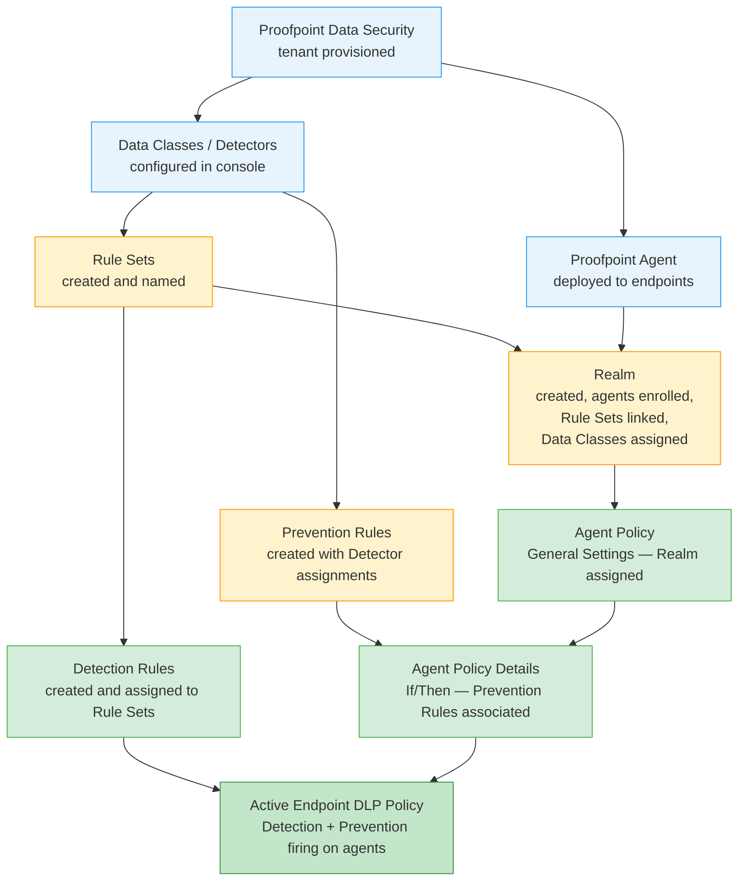

# Data Security / Endpoint DLP Policies — Prerequisites

> Capability: endpoint-dlp | Product: Proofpoint Data Security | Generated: 2026-05-21

---

## Dependency Graph

**Legend:**
- Blue: Foundational prerequisites (no dependencies)
- Orange: Intermediate objects (1–2 dependencies)
- Green: Direct configuration steps for this capability
- Dark green: Final activated state

---

## Configuration Order

### 1. Proofpoint Data Security Tenant Provisioned (pre-deployment)

**What it is:** The Proofpoint Data Security SaaS tenant must exist and admin access must be granted before any configuration is possible.

**Minimum viable config:**
- Admin user account with rights to Administration app
- Tenant provisioned by Proofpoint

**Time estimate:** Handled by Proofpoint provisioning (not self-service); typically 1–5 business days for new tenants.

**Source:** [S7] — A [docs.public.analyze.proofpoint.com/admin/agent_policies_overview.htm] (inferred from architecture)

---

### 2. Proofpoint Agents Deployed to Endpoints (15–60 min per endpoint group)

**What it is:** The Proofpoint Agent software must be installed on the Windows and/or macOS endpoints that will be governed by Endpoint DLP policies. Agents communicate with the Proofpoint Data Security cloud and enforce policy locally.

**Minimum viable config:**
- Agents installed on at least one test endpoint
- Agents reporting into the Proofpoint console (visible in agent list)

**Navigation:** INCOMPLETE — agent deployment configuration path not documented in accessible Grade-A sources for this research. Consult Proofpoint agent deployment guide (authenticated).

**Time estimate:** 15–60 minutes for initial deployment on a test group; enterprise rollout may take days or weeks depending on endpoint count and MDM tooling.

**Source:** [S7] — A (agents referenced as the object receiving Agent Policies)

---

### 3. Data Classes / Detectors Configured (30–60 min)

**Capability:** Data Classes / Detector configuration
**Navigation:** INCOMPLETE — exact navigation path not documented in accessible Grade-A sources. This is a known corpus gap.

**What to configure:**
- Create or verify at least one Data Class that corresponds to the sensitive content type you want to detect or prevent (e.g., PII, financial data, IP documents)
- Each Data Class contains one or more Detectors (pattern matchers)

**Minimum viable config:**
- At least one Data Class with at least one Detector
- Data Class is available for selection in Prevention Rules and Realm configuration

**Why this matters:**
- Prevention Rules reference Detectors when defining what content triggers enforcement
- Realm configuration requires Data Classes to be assigned before Prevention Rules can fire
- Without this step, Prevention Rules are created but silently never trigger

**Source:** [S11] — A [docs.public.analyze.proofpoint.com/rules/prevention_rules_overview.htm] (cross-reference: "Detectors must be included in Data Classes of assigned Realm")

---

### 4. Rule Sets Created (10 min)

**Capability:** Rule Set management
**Navigation:** Administration > Policies > Rule Sets (INCOMPLETE — exact path not confirmed in accessible docs; referenced from [S10])

**What to configure:**
- Create at least one Rule Set
- Rule Sets act as named containers that link Detection Rules to Realms
- A Rule Set must exist before Detection Rules can be assigned to it
- A Rule Set must be linked to a Realm before Detection Rules fire on agents in that Realm

**Minimum viable config:**
- Rule Set Name: descriptive name (e.g., "Standard DLP Rule Set")
- (Detection Rules are added after creation)
- Realm linkage is configured at the Realm level

**Source:** [S10] — A [docs.public.analyze.proofpoint.com/rules/rules_detection.htm] ("Rule Sets: Assign to specific Agent Realms; override source defaults")

---

### 5. Realm Created and Configured (15–30 min)

**Capability:** Realm management
**Navigation:** INCOMPLETE — Realm configuration path not documented in accessible Grade-A sources. This is a known corpus gap.

**What to configure:**
- Realm Name
- Enroll agents (endpoints) into the Realm
- Link Rule Sets to the Realm (so Detection Rules fire on Realm agents)
- Assign Data Classes to the Realm (so Prevention Rule Detectors are active)

**Minimum viable config:**
- At least one Realm with at least one enrolled agent
- At least one Rule Set linked
- At least one Data Class assigned

**Why this matters:**
- Agent Policies are assigned to a Realm — without a Realm, no Agent Policy can be created
- Detection Rules only fire on agents whose Realm is linked to a Rule Set containing those rules
- Prevention Rules only fire when their Detectors appear in the Realm's Data Class list

**Source:** [S7] — A (Realm concept and relationship to Agent Policies documented), [S10] — A (Rule Set-to-Realm linkage documented), [S11] — A (Data Class-to-Realm requirement documented)

---

### 6. Prevention Rules Created (5–10 min each)

**Capability:** Prevention Rule creation
**Workflow:** [Prevention Rules — advanced.md Screen 7](advanced.md#screen-7-prevention-rules)

**What to configure:**
- Rule Name
- Action (Block / Prompt / Allow / Data Redaction for GenAI / File Retention)
- Scope / Target (what operation or destination is governed)
- Detectors (which Data Class patterns trigger enforcement)

**Minimum viable config:**
- At minimum: Rule Name + Action + one Detector

**Time estimate:** 5–10 minutes per rule.

**Source:** [S11] — A

---

### 7. Detection Rules Created (10–15 min each)

**Capability:** Detection Rule creation
**Workflow:** [Detection Rules — advanced.md Screen 6](advanced.md#screen-6-new-detection-rule----4-step-wizard)

**What to configure:**
- Rule Name, Rule Sets assignment, Order Priority
- Condition (from library, Threat Library, or Custom)
- Severity, Notifications, Tags

**Minimum viable config:**
- Rule Name + at least one Rule Set assignment + Condition Source + Severity = High

**Time estimate:** 10–15 minutes per rule using Threat Library conditions; longer for Custom conditions.

**Source:** [S10] — A

---

### 8. Agent Policy — General Settings (5 min)

**Capability:** Agent Policy creation — this capability
**Workflow:** [General Settings — advanced.md Screen 2](advanced.md#screen-2-add--edit-agent-policy----general-settings)

**What to configure:**
- Policy Name
- Realm (must select from existing Realms configured in Step 5)
- Priority
- Signal Type (DLP Only or ITM — IRREVERSIBLE)
- Enabled = ON

**Minimum viable config:** All required fields; Signal Type selection is critical.

**Time estimate:** 5 minutes.

**Source:** [S8] — A

---

### 9. Agent Policy — Details / If/Then (5–10 min)

**Capability:** If/Then condition logic — this capability
**Workflow:** [Details tab — advanced.md Screen 3](advanced.md#screen-3-agent-policy----details-tab-ifthen-logic)

**What to configure:**
- If conditions (or leave empty for catch-all)
- Then — File Activity Monitoring
- Then — Prevention Rules (select rules from Step 6)

**Minimum viable config:** Enable File Activity Monitoring; associate at least one Prevention Rule if enforcement is required.

**Ready when:** Steps 1–8 are complete.

**Time estimate:** 5–10 minutes.

**Source:** [S9] — A

---

## Total Time Estimate

| Step | Object | Time Estimate | Blockers |
|------|--------|--------------|----------|
| 1 | Tenant provisioned | External (Proofpoint) | Cannot proceed without this |
| 2 | Agents deployed | 15–60 min (test group) | Must have endpoints enrolled |
| 3 | Data Classes configured | 30–60 min | Corpus gap — navigation path unknown |
| 4 | Rule Sets created | 10 min | Corpus gap — navigation path partially known |
| 5 | Realm created and configured | 15–30 min | Corpus gap — navigation path unknown |
| 6 | Prevention Rules created | 5–10 min per rule | Requires Step 3 complete |
| 7 | Detection Rules created | 10–15 min per rule | Requires Step 4 complete |
| 8 | Agent Policy — General Settings | 5 min | Requires Step 5 complete |
| 9 | Agent Policy — Details/If/Then | 5–10 min | Requires Steps 6, 8 complete |

**Total estimated time (excluding tenant provisioning and agent deployment): 80–145 minutes** for a single-rule, single-Realm deployment. Enterprise deployments with multiple rule sets and realms will require significantly more time.

**Primary blockers:** Realm configuration and Data Classes configuration paths are not documented in accessible Grade-A sources. These steps require access to Proofpoint's authenticated documentation or direct Proofpoint support engagement.
