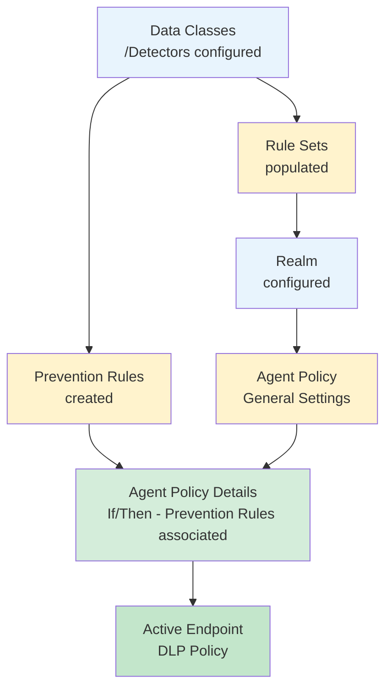
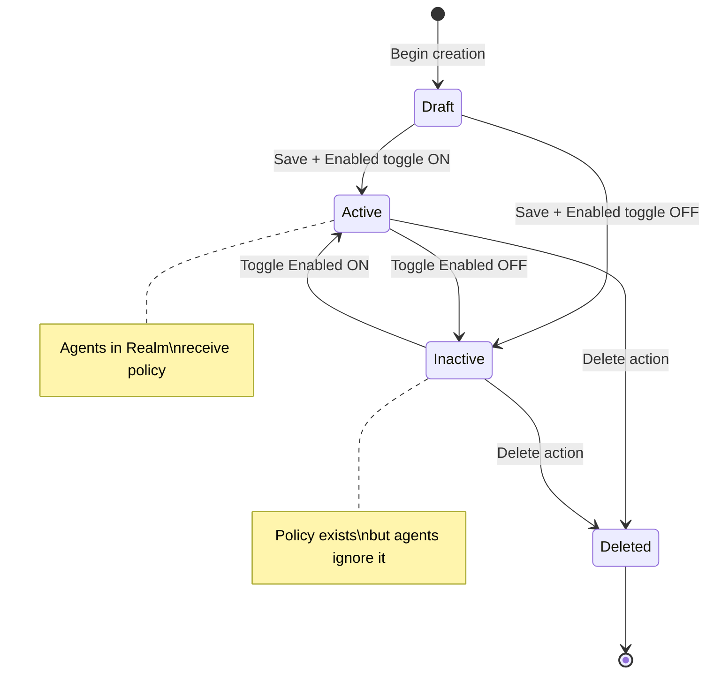
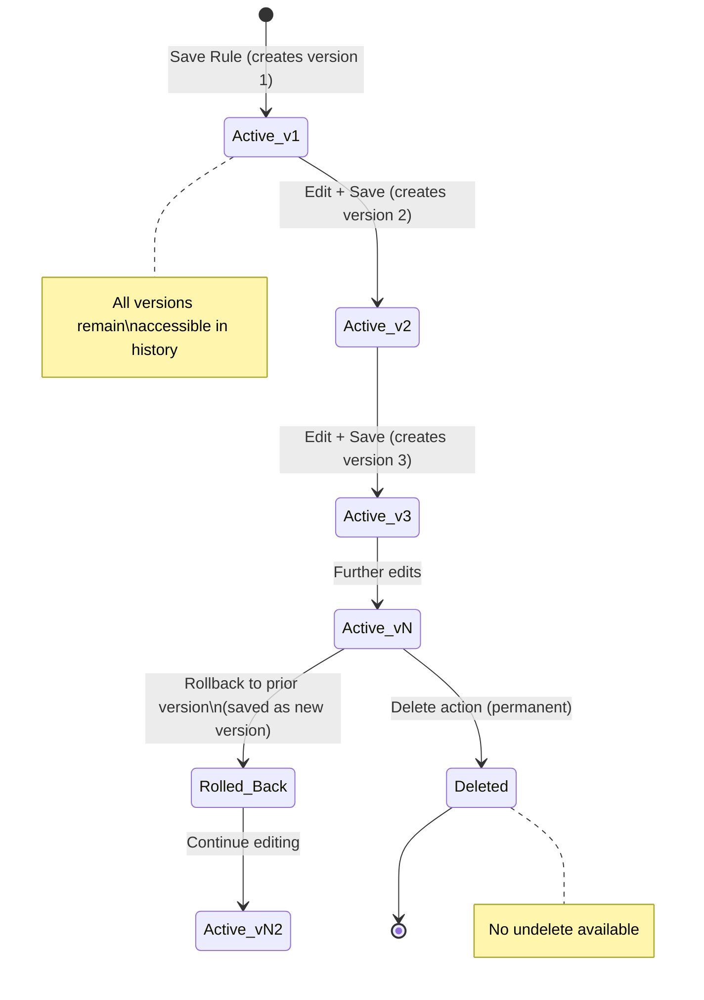
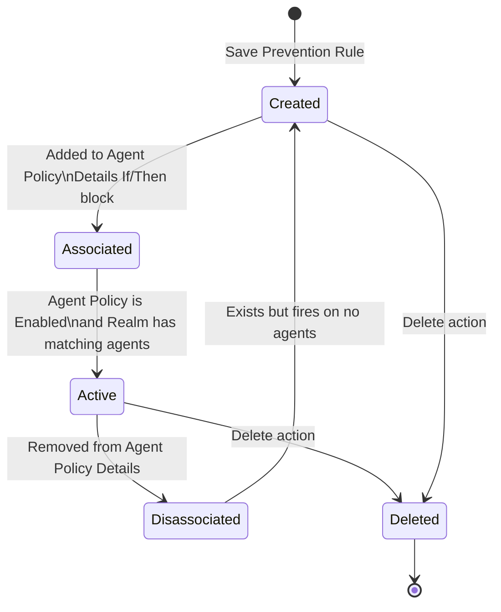

# Data Security / Endpoint DLP Policies — Workflow Reference

> Capability: endpoint-dlp | Product: Proofpoint Data Security | Generated: 2026-05-21
> Sub-capabilities: 9.1–9.16 (taxonomy group 9)

---

## Overview

Proofpoint Data Security Endpoint DLP is the policy authoring layer for the Proofpoint Agent deployed on Windows and macOS endpoints. The agent is controlled by Agent Policies that define signal capture scope (DLP-only file events vs full ITM activity), and by Detection Rules and Prevention Rules that determine what is alerted on, blocked, prompted, or redacted. Agent Policies are assigned to Realms — logical groupings of endpoints — so that different policy configurations can coexist in the same organization. Detection Rules expose a four-level severity model and support notifications via SMS, email, and webhook. Prevention Rules operate in real time on the endpoint and can block data exfiltration, prompt for user justification, or selectively allow while blocking siblings. GenAI prompt redaction and file retention are additional prevention actions. The entire rule estate is versioned, tagged, and supports rollback.

**Complexity:** COMPLEX — 3-step prerequisite chain (Realm + Data Class + Detection/Prevention Rules) feeds into Agent Policies; 4+ screens with significant conditional branching.
**Prerequisite chain length:** 3 foundational objects (Realm, Data Class, Rule Sets) before Agent Policy is functional.
**Total configurable fields:** ~45 documented across all screens.
**Screens involved:** 8 primary screens + multiple modal dialogs.
**Evidence base:** 5 Grade A sources [S7, S8, S9, S10, S11], 2 Grade B-C [S12, S28], 1 Grade D [Video 16].

---

## Screen Hierarchy

```yaml
screens:

  - name: "Administration app > Endpoint > Agent Policies"
    navigation: "Log in to Proofpoint Data Security admin console > Administration > Endpoint > Agent Policies"
    parent: "Administration app"
    type: page
    description: "List view of all Agent Policies in the tenant. Columns: Policy Name, Realm, Priority, Signal Type, Status."
    fields:
      - name: "Search / Filter"
        type: text
        required: false
        default: null
        description: "Filter policy list by name"
    actions:
      - name: "Add Policy"
        type: button
        result: "Opens the Add Agent Policy modal (screen: Add Agent Policy — General Settings)"
      - name: "Edit"
        type: row-action
        result: "Opens the Edit Agent Policy form pre-populated with selected policy"
      - name: "Delete"
        type: row-action
        result: "Deletes the selected policy"
      - name: "Prioritize"
        type: drag-handle or priority field
        result: "Reorders policies within a Realm; higher priority policies evaluated first"
    prerequisites:
      - "At least one Realm must exist before a policy can be assigned"
    notes: "Source: [S8] — docs.public.analyze.proofpoint.com/admin/agent_policies_setting_up.htm"

  - name: "Add Agent Policy — General Settings"
    navigation: "Administration > Endpoint > Agent Policies > Add Policy"
    parent: "Administration app > Endpoint > Agent Policies"
    type: modal_dialog
    fields:
      - name: "Policy Name"
        type: text
        required: true
        default: null
        validation: "Must be unique within tenant"
        description: "Human-readable identifier for the policy"
        gotcha: "No documented maximum character length — keep names under 64 characters as a practical limit"
      - name: "Realm"
        type: dropdown
        required: true
        default: null
        options: ["<list of configured Realms>"]
        description: "The Realm this policy applies to. All agents in the Realm are subject to this policy."
        gotcha: "Realm must exist before policy creation. If the Realm list is empty, navigate to Realm configuration first."
      - name: "Priority"
        type: number
        required: true
        default: "UNKNOWN — not documented; newly created policy placed at lowest priority"
        validation: "Integer; lower numeric value = higher priority when multiple policies apply to same Realm"
        description: "Determines evaluation order when more than one policy applies to a Realm"
        gotcha: "Default priority placement is undocumented. Verify priority after creation and adjust manually."
      - name: "Signal Type"
        type: radio
        required: true
        default: "DLP Only"
        options: ["DLP Only", "ITM"]
        description: "DLP Only: captures file activity events only. ITM: captures all user activity including screenshots, keystrokes, and application events."
        gotcha: "IRREVERSIBLE after save — changing signal type after policy is active requires deleting and recreating the policy. Confirm before saving."
      - name: "Enabled"
        type: toggle
        required: false
        default: "UNKNOWN — assumed Enabled on creation"
        description: "Whether the policy is active on agents in the assigned Realm"
    actions:
      - name: "Next / Save"
        type: button
        result: "Saves General Settings and opens the Details (If/Then) configuration screen"
      - name: "Cancel"
        type: button
        result: "Discards changes and returns to policy list"
    prerequisites:
      - "Realm must be configured"
    decision_points:
      - condition: "User selects Signal Type = DLP Only"
        effect: "Policy captures file activity events only. ITM-specific settings (screen capture, keystroke logging) are hidden in the Details tab."
      - condition: "User selects Signal Type = ITM"
        effect: "Policy captures all user activity events. Additional ITM-specific monitoring settings become available in the Details tab."
    notes: "Source: [S7] docs.public.analyze.proofpoint.com/admin/agent_policies_overview.htm, [S8] docs.public.analyze.proofpoint.com/admin/agent_policies_setting_up.htm"

  - name: "Agent Policy — Details (If/Then Logic)"
    navigation: "Administration > Endpoint > Agent Policies > [Policy] > Details tab"
    parent: "Add Agent Policy — General Settings"
    type: tab
    description: "Conditional logic engine. Defines which users/conditions trigger specific monitoring/prevention behaviors. Multiple If/Then blocks can be stacked."
    fields:
      - name: "If — Category"
        type: dropdown
        required: true
        default: null
        options: ["Username", "User Group", "OS Type", "Network Location", "Device Type", "UNKNOWN — full option list not published in accessible docs"]
        description: "The attribute to evaluate for this condition block"
        gotcha: "OS Type filter (Windows/Mac/Unix/Both) is available per [Video 16 ~1:00] — useful for mixed-OS environments but not documented in official admin guide."
      - name: "If — Value"
        type: text or multiselect
        required: true
        default: null
        description: "The specific value(s) to match against the Category (e.g., 'administrator', 'Finance Group')"
      - name: "If — Operator"
        type: radio
        required: true
        default: "AND"
        options: ["AND", "OR"]
        description: "Logical operator when multiple If conditions are present"
      - name: "Then — File Activity Monitoring"
        type: toggle
        required: false
        default: "UNKNOWN"
        description: "Enables file activity monitoring when the If conditions are met"
      - name: "Then — DLP Toggle"
        type: toggle
        required: false
        default: "Enabled"
        description: "Limits signal to DLP events only when enabled. Disabling this within an ITM-signal policy activates full ITM capture for the matched condition."
        gotcha: "The DLP toggle exists WITHIN the Details tab as a Then-condition setting, separate from the top-level Signal Type field in General Settings. Two separate controls govern capture scope."
      - name: "Then — Prevention Rules"
        type: multiselect
        required: false
        default: null
        description: "Associate one or more Prevention Rules with this If/Then block. Prevention rules activate only for agents matching this condition."
        gotcha: "Prevention rules must be created before the policy Details tab can associate them. Prevention rule creation is a prerequisite step."
      - name: "Then — Screenshots"
        type: toggle
        required: false
        default: "UNKNOWN"
        description: "Enable screenshot capture for agents matching this condition (ITM signal type only)"
    actions:
      - name: "Add Condition"
        type: button
        result: "Adds another If/Then block"
      - name: "Save"
        type: button
        result: "Saves all condition blocks and activates the policy"
    prerequisites:
      - "Prevention Rules must be created before they can be associated here"
    decision_points:
      - condition: "No If conditions are configured"
        effect: "The Then settings apply to ALL agents in the Realm (default-match behavior)"
      - condition: "Multiple If/Then blocks are stacked"
        effect: "Each block is evaluated independently; the first matching block's Then settings apply"
    notes: "Source: [S9] docs.public.analyze.proofpoint.com/admin/agent_policies_details.htm, [Video 16 ~1:00]"

  - name: "Default Account Policy"
    navigation: "Administration > Endpoint > Agent Policies > Default Account Policy (pre-existing entry)"
    parent: "Administration app > Endpoint > Agent Policies"
    type: page
    description: "A pre-configured policy automatically assigned to all Realms. It serves as the fallback when no other policy matches. It can be customized but not deleted."
    fields:
      - name: "(All fields same as Agent Policy — General Settings and Details)"
        type: inherited
        description: "Default Account Policy has the same field schema as a regular Agent Policy"
        gotcha: "This policy is always active as a catch-all. Customizing it affects ALL Realms that don't have a higher-priority policy. Review before modifying."
    actions:
      - name: "Edit"
        type: button
        result: "Opens Default Account Policy for editing"
    notes: "Source: [S7] — default policy is pre-configured and assigned to all Realms; cannot be deleted."

  - name: "Administration > Policies > Rules (Detection Rules list)"
    navigation: "Administration > Policies > Rules"
    parent: "Administration app"
    type: page
    description: "Master list of all Detection Rules in the tenant. Shows Rule Name, Severity, Tags, Last Modified, Version."
    fields:
      - name: "Search"
        type: text
        required: false
        description: "Filter rules by name or tag"
      - name: "Filter by Tags"
        type: multiselect
        required: false
        description: "Filter rule list by assigned tags"
    actions:
      - name: "New Rule"
        type: button
        result: "Opens New Detection Rule wizard (5-step: Assignment > Condition > Actions > Review)"
      - name: "Edit"
        type: row-action
        result: "Opens rule for editing; saves as new version"
      - name: "View Versions"
        type: row-action
        result: "Opens version history modal for the rule"
      - name: "Rollback"
        type: version-action
        result: "Reverts rule to selected prior version; the rollback is saved as a new version entry"
      - name: "Delete"
        type: row-action
        result: "Deletes the rule permanently (cannot be undone)"
      - name: "Manage Tags"
        type: row-action
        result: "Opens tag assignment modal"
    notes: "Source: [S10] docs.public.analyze.proofpoint.com/rules/rules_detection.htm, [S12] docs.public.analyze.proofpoint.com/rules/rules_overview.htm"

  - name: "New Detection Rule — Step 1: Assignment"
    navigation: "Administration > Policies > Rules > New Rule > Step 1"
    parent: "Administration > Policies > Rules"
    type: wizard_step
    fields:
      - name: "Rule Name"
        type: text
        required: true
        default: null
        validation: "Must be unique within the tenant"
        description: "Human-readable rule identifier"
      - name: "Rule Sets"
        type: multiselect
        required: false
        default: null
        description: "Assign the rule to one or more Rule Sets. Rule Sets are linked to Realms. Rules only fire on agents whose Realm is linked to a Rule Set containing this rule."
        gotcha: "A rule with no Rule Set assignment never fires. This is the #1 silent failure mode for detection rules."
      - name: "Order Priority"
        type: number
        required: true
        default: "UNKNOWN — position in rule evaluation order"
        validation: "Integer 1–1000; higher number = higher priority (fires first)"
        description: "Evaluation order within the Rule Set. Rule with highest number is evaluated first."
        gotcha: "Priority semantics are INVERTED relative to Agent Policy priority — in Agent Policies, lower number = higher priority; in Detection Rules, higher number = higher priority. Per [Video 16 ~3:00]."
      - name: "Tags"
        type: multiselect
        required: false
        default: null
        description: "Organizational labels for filtering and grouping rules"
    notes: "Source: [S10], [Video 16 ~2:00], [Video 16 ~3:00]"

  - name: "New Detection Rule — Step 2: Condition"
    navigation: "Administration > Policies > Rules > New Rule > Step 2"
    parent: "New Detection Rule — Step 1: Assignment"
    type: wizard_step
    fields:
      - name: "Condition Source"
        type: radio
        required: true
        default: null
        options: ["Existing (from library)", "Threat Library", "Custom (manual fields)"]
        description: "How the condition criteria are defined for this rule"
      - name: "Condition (from library)"
        type: dropdown
        required: true (when Source = Existing)
        default: null
        description: "Select a pre-built condition from the condition library"
      - name: "Threat Library Selection"
        type: dropdown or tree
        required: true (when Source = Threat Library)
        default: null
        description: "Select a scenario from the Insider Threat Library (300+ pre-built threat scenarios)"
      - name: "Custom Condition Fields"
        type: dynamic form
        required: true (when Source = Custom)
        default: null
        description: "Manually define condition criteria — specific fields INCOMPLETE, not fully enumerated in accessible docs"
        gotcha: "Custom condition syntax and available field names are not documented in accessible Grade-A sources. INCOMPLETE — requires additional research."
      - name: "Filters"
        type: multiselect or form
        required: false
        default: null
        description: "Narrow condition scope by user group, OS type, network location, or other attributes"
    decision_points:
      - condition: "Threat Library selected"
        effect: "Pre-built condition is locked; filter fields may still be adjustable"
      - condition: "Custom selected"
        effect: "Full condition builder opens; all fields are user-defined"
    notes: "Source: [S10] — condition types from library and Threat Library documented. Custom field syntax INCOMPLETE per corpus gap noted in [S10] source."

  - name: "New Detection Rule — Step 3: Actions"
    navigation: "Administration > Policies > Rules > New Rule > Step 3"
    parent: "New Detection Rule — Step 2: Condition"
    type: wizard_step
    fields:
      - name: "Severity"
        type: dropdown
        required: true
        default: "UNKNOWN — not documented; may default to Informational/Low"
        options: ["Low", "Medium", "High", "Critical"]
        description: "Severity level assigned to detections from this rule. Controls dashboard visibility and alert routing."
        gotcha: "Rules without explicit severity assignment default to Informational, which may not surface in dashboards configured to show only High/Critical. Per [Video 16 ~3:00] — always set severity explicitly."
      - name: "Alert Management"
        type: toggle or checkbox
        required: false
        default: null
        description: "Whether matching events generate managed alerts in the Alert Management interface"
      - name: "Notifications — Email"
        type: form
        required: false
        default: null
        description: "Configure email notification recipients and message template for this rule"
      - name: "Notifications — SMS"
        type: form
        required: false
        default: null
        description: "Configure SMS notification recipients for this rule"
      - name: "Notifications — Webhook"
        type: form
        required: false
        default: null
        description: "Configure webhook URL and payload for this rule"
      - name: "Tags (Action-level)"
        type: multiselect
        required: false
        default: null
        description: "Tags automatically applied to events generated by this rule"
      - name: "Drop Matching"
        type: toggle
        required: false
        default: null
        description: "When enabled, matching events are dropped (not forwarded to alert pipeline). Typically used for noise suppression."
    notes: "Source: [S10] — severity levels, notification types, tags, and drop-matching all documented."

  - name: "New Detection Rule — Step 4: Review"
    navigation: "Administration > Policies > Rules > New Rule > Step 4"
    parent: "New Detection Rule — Step 3: Actions"
    type: wizard_step
    description: "Summary view of all configured settings before saving. No new fields."
    actions:
      - name: "Save Rule"
        type: button
        result: "Creates the detection rule as version 1. Rule is immediately active in assigned Rule Sets."
      - name: "Back"
        type: button
        result: "Returns to previous step for editing"
    notes: "Source: [S10], [Video 16 ~2:00]"

  - name: "Administration > Policies > Prevention Rules (list)"
    navigation: "Administration > Policies > Prevention Rules"
    parent: "Administration app"
    type: page
    description: "Master list of all Prevention Rules. Prevention rules operate in real time on endpoints and must be associated with an Agent Policy via the Details tab."
    actions:
      - name: "New Prevention Rule"
        type: button
        result: "Opens New Prevention Rule creation form"
    notes: "Source: [S11] docs.public.analyze.proofpoint.com/rules/prevention_rules_overview.htm"

  - name: "New Prevention Rule — Configuration"
    navigation: "Administration > Policies > Prevention Rules > New Prevention Rule"
    parent: "Administration > Policies > Prevention Rules"
    type: page
    fields:
      - name: "Rule Name"
        type: text
        required: true
        default: null
        description: "Human-readable identifier for the prevention rule"
      - name: "Action"
        type: radio or dropdown
        required: true
        default: null
        options: ["Block", "Prompt", "Allow", "Data Redaction for GenAI", "File Retention"]
        description: "The real-time enforcement action applied when the rule triggers"
      - name: "Scope / Target"
        type: form
        required: true
        default: null
        description: "Define which file operations, destinations, or activities this rule applies to (e.g., cloud sync folders, web uploads, printing)"
        gotcha: "Block for web file uploads is Windows-only per [S11]. Attempting to apply to macOS has no effect — verify OS targeting."
      - name: "Data Redaction Target (GenAI only)"
        type: form
        required: true (when Action = Data Redaction for GenAI)
        default: null
        description: "Specify which text patterns or data classes to redact from GenAI prompt submissions"
        gotcha: "Data Redaction for GenAI is a distinct action — configuration fields for GenAI redaction are not documented in detail in accessible Grade-A sources. INCOMPLETE — requires additional research per corpus gap [S11]."
      - name: "File Retention Storage Target (File Retention only)"
        type: form
        required: true (when Action = File Retention)
        default: null
        description: "External storage location where retained file copies are sent"
      - name: "Detectors / Data Classes"
        type: multiselect
        required: true
        default: null
        description: "The data class detectors that trigger this prevention rule. Detectors must be included in the Data Classes of the Realm where this rule is active."
        gotcha: "If the prevention rule's Detectors are not included in the assigned Realm's Data Classes, the rule never triggers. This is a cross-object dependency that causes silent failures. Source: [S11] cross-reference."
    notes: "Source: [S11] — all five action types documented. Detailed configuration fields per action type partially documented."

  - name: "Rule Versioning Modal"
    navigation: "Administration > Policies > Rules > [Rule] > View Versions"
    parent: "Administration > Policies > Rules"
    type: modal_dialog
    description: "Version history for a detection rule. Shows version number, date modified, modified by, and change summary."
    actions:
      - name: "View"
        type: button
        result: "Opens read-only view of the selected version"
      - name: "Rollback to this version"
        type: button
        result: "Creates a new version identical to the selected historical version. The rollback is recorded as a versioned change."
    notes: "Source: [S10] — versioning and rollback capability documented."

  - name: "Rule Tag Management Modal"
    navigation: "Administration > Policies > Rules > [Rule] > Manage Tags"
    parent: "Administration > Policies > Rules"
    type: modal_dialog
    fields:
      - name: "Tags"
        type: multiselect
        required: false
        default: null
        options: ["<user-defined tag list>"]
        description: "Assign one or more tags to the rule for filtering and grouping"
    actions:
      - name: "Create New Tag"
        type: button
        result: "Opens tag creation form"
      - name: "Save"
        type: button
        result: "Applies selected tags to the rule"
    notes: "Source: [S10] — tag management documented."

  - name: "Realm Assignment (configuration prerequisite)"
    navigation: "INCOMPLETE — Realm configuration path not documented in accessible Grade-A sources"
    parent: "Administration app"
    type: page
    description: "Realms are logical groupings of endpoints. Agent Policies are assigned to Realms. Rule Sets are linked to Realms. The Realm configuration screen is the hub that connects Agent Policies, Rule Sets, and Detectors."
    fields:
      - name: "Realm Name"
        type: text
        required: true
        description: "Identifier for the Realm"
      - name: "Agents / Endpoint Assignment"
        type: multiselect or dynamic
        required: true
        description: "Which agents belong to this Realm — INCOMPLETE field details not documented"
      - name: "Rule Sets"
        type: multiselect
        required: true
        description: "Which Rule Sets (and therefore Detection Rules) apply to agents in this Realm"
      - name: "Data Classes"
        type: multiselect
        required: true
        description: "Which data class detectors are active for agents in this Realm. Prevention rule detectors must be in this list to trigger."
    notes: "Source: [S7] — Realm concept documented. Detailed screen fields INCOMPLETE — navigation path not available in accessible docs. Source: [S10] cross-reference confirms Rule Set-to-Realm linkage."
```

---

## Step-by-Step Walkthrough

### Step 1: Confirm Realm Exists (or Create One)

**Navigate to:** Administration > (Realm configuration — exact path INCOMPLETE per corpus gap)
**Screen:** Realm Assignment
**Purpose:** Realms group endpoints under a common policy configuration. Without a Realm, no Agent Policy can be assigned and no rules will fire.

| Field | Type | Required | Default | Description |
|-------|------|----------|---------|-------------|
| Realm Name | text | Yes | null | Identifier for this logical endpoint group |
| Rule Sets | multiselect | Yes | null | Detection rule sets active for this Realm |
| Data Classes | multiselect | Yes | null | Detectors available to prevention rules in this Realm |

**Source:** [S7] — A [docs.public.analyze.proofpoint.com/admin/agent_policies_overview.htm], [S10] — A [docs.public.analyze.proofpoint.com/rules/rules_detection.htm]

---

### Step 2: Create Detection Rules

**Navigate to:** Administration > Policies > Rules > New Rule
**Screen:** New Detection Rule wizard (4 steps)
**Purpose:** Detection Rules define what user activity to alert on. They must exist before Rule Sets can be populated and before Agent Policies are fully operational.

**Step 2a — Assignment tab:**

| Field | Type | Required | Default | Description |
|-------|------|----------|---------|-------------|
| Rule Name | text | Yes | null | Unique rule identifier |
| Rule Sets | multiselect | No | null | Must assign to a Rule Set or rule never fires |
| Order Priority | number | Yes | UNKNOWN | 1–1000; higher number fires first |
| Tags | multiselect | No | null | Organizational labels |

**Step 2b — Condition tab:**

| Field | Type | Required | Default | Description |
|-------|------|----------|---------|-------------|
| Condition Source | radio | Yes | null | Existing library / Threat Library / Custom |
| Condition | dropdown/tree | Yes | null | The specific condition to detect |
| Filters | form | No | null | Narrow scope by user, OS, location |

**Step 2c — Actions tab:**

| Field | Type | Required | Default | Description |
|-------|------|----------|---------|-------------|
| Severity | dropdown | Yes | UNKNOWN (likely Low) | Low / Medium / High / Critical |
| Alert Management | toggle | No | null | Generate managed alerts |
| Notifications — Email | form | No | null | Email recipients and template |
| Notifications — SMS | form | No | null | SMS recipients |
| Notifications — Webhook | form | No | null | Webhook URL and payload |
| Tags (action-level) | multiselect | No | null | Applied to generated events |
| Drop Matching | toggle | No | null | Suppress event forwarding |

**Decision point:** Severity assignment determines whether detections surface in dashboards. If the organization's dashboards are filtered to High/Critical only, rules with Low or Medium severity will generate events that are logged but never reviewed.

**Source:** [S10] — A [docs.public.analyze.proofpoint.com/rules/rules_detection.htm], [Video 16 ~2:00–3:00] — C

---

### Step 3: Create Prevention Rules (if enforcement is required)

**Navigate to:** Administration > Policies > Prevention Rules > New Prevention Rule
**Screen:** New Prevention Rule — Configuration
**Purpose:** Prevention Rules provide real-time enforcement on the endpoint. They are optional if the deployment goal is detection-only.

| Field | Type | Required | Default | Description |
|-------|------|----------|---------|-------------|
| Rule Name | text | Yes | null | Unique prevention rule identifier |
| Action | radio/dropdown | Yes | null | Block / Prompt / Allow / Data Redaction for GenAI / File Retention |
| Scope / Target | form | Yes | null | What file operations or destinations are in scope |
| Detectors / Data Classes | multiselect | Yes | null | Which detectors trigger this rule |

**Decision point:** Action selection changes visible fields:
- **Block** — no additional user-facing fields; operation is stopped silently
- **Prompt** — justification dialog configuration fields appear (justification text, response options)
- **Allow** — allow-list conditions appear (specific files, destinations, or user groups to exempt)
- **Data Redaction for GenAI** — redaction pattern fields appear; requires GenAI integration to be provisioned
- **File Retention** — external storage target field appears

**Source:** [S11] — A [docs.public.analyze.proofpoint.com/rules/prevention_rules_overview.htm]

---

### Step 4: Create Agent Policy — General Settings

**Navigate to:** Administration > Endpoint > Agent Policies > Add Policy
**Screen:** Add Agent Policy — General Settings
**Purpose:** The Agent Policy binds a Realm to a monitoring configuration and associates Prevention Rules.

| Field | Type | Required | Default | Description |
|-------|------|----------|---------|-------------|
| Policy Name | text | Yes | null | Unique policy name |
| Realm | dropdown | Yes | null | Target endpoint group |
| Priority | number | Yes | UNKNOWN | Evaluation order (lower = higher priority in Agent Policies) |
| Signal Type | radio | Yes | DLP Only | DLP Only or ITM — IRREVERSIBLE after save |
| Enabled | toggle | No | UNKNOWN (assumed Enabled) | Activate/deactivate the policy |

**CRITICAL decision point:** Signal Type selection. DLP Only restricts agent to file activity events only. ITM enables full user activity monitoring including screenshots, application events, and keystrokes. This choice is IRREVERSIBLE — if the wrong type is selected, the policy must be deleted and recreated.

**Source:** [S7] — A, [S8] — A

---

### Step 5: Configure Agent Policy — Details (If/Then Logic)

**Navigate to:** Administration > Endpoint > Agent Policies > [Policy] > Details tab
**Screen:** Agent Policy — Details (If/Then Logic)
**Purpose:** Conditional logic that maps specific user populations or conditions to specific monitoring behaviors and prevention rules.

| Field | Type | Required | Default | Description |
|-------|------|----------|---------|-------------|
| If — Category | dropdown | Yes | null | Attribute to evaluate (Username, User Group, OS Type, etc.) |
| If — Value | text/multiselect | Yes | null | Value(s) to match |
| If — Operator | radio | Yes | AND | AND / OR for multiple conditions |
| Then — File Activity Monitoring | toggle | No | UNKNOWN | Enable file activity monitoring for matched agents |
| Then — DLP Toggle | toggle | No | Enabled | Limits signal to DLP events when enabled |
| Then — Prevention Rules | multiselect | No | null | Prevention rules active for matched agents |
| Then — Screenshots | toggle | No | UNKNOWN | Enable screenshot capture (ITM only) |

**Source:** [S9] — A [docs.public.analyze.proofpoint.com/admin/agent_policies_details.htm], [Video 16 ~1:00] — C

---

### Step 6: Verify Priority Ordering

**Navigate to:** Administration > Endpoint > Agent Policies
**Screen:** Agent Policies list
**Purpose:** When multiple policies are assigned to the same Realm, priority order determines which policy's settings take effect for a given agent/condition.

Drag policies or edit priority numbers to establish correct evaluation order. The Default Account Policy is always lowest priority as a catch-all.

**Source:** [S8] — A

---

### Step 7: Manage Rule Versions and Tags (Ongoing)

**Navigate to:** Administration > Policies > Rules > [Rule] > View Versions / Manage Tags
**Screen:** Rule Versioning Modal / Rule Tag Management Modal
**Purpose:** Every edit to a detection rule creates a new version. Rollback is available to any prior version. Tags organize the rule estate for filtering.

**Source:** [S10] — A

---

## Dependency Graph



### Prerequisite Chain (Ordered)

1. **Data Classes / Detectors** — created at: Administration > (Data Classes configuration — path INCOMPLETE) — no prerequisites. These define what sensitive content patterns the agent recognizes.
2. **Rule Sets** — created at: Administration > Policies > Rule Sets — requires: [Data Classes] logically. Rule Sets are containers that link Detection Rules to Realms.
3. **Realms** — created at: Administration > (Realm configuration — path INCOMPLETE) — requires: [Rule Sets for Detection Rule association, Data Classes for Prevention Rule activation].
4. **Detection Rules** — created at: Administration > Policies > Rules — requires: [Rule Sets to be created first for assignment].
5. **Prevention Rules** — created at: Administration > Policies > Prevention Rules — requires: [Data Classes / Detectors that match the Realm's Data Classes].
6. **Agent Policy (General Settings)** — created at: Administration > Endpoint > Agent Policies — requires: [Realm].
7. **Agent Policy (Details/If-Then)** — configured at: Administration > Endpoint > Agent Policies > [Policy] > Details tab — requires: [Prevention Rules if enforcement is needed].
8. **Active Endpoint DLP Policy** — all prior steps complete; agents receive and enforce the policy.

---

## Decision Points

| Screen | Decision | Options | Default | Implications | Recommended | Why |
|--------|----------|---------|---------|--------------|-------------|-----|
| General Settings | Signal Type | DLP Only / ITM | DLP Only | DLP Only = file events only; ITM = all activity including screenshots, keystrokes | DLP Only for most deployments | Lower privacy risk; ITM requires additional legal/HR review in most jurisdictions. Upgrade to ITM only when insider threat monitoring is explicitly required. |
| General Settings | Signal Type | DLP Only / ITM | DLP Only | IRREVERSIBLE — cannot change after save | N/A — confirm before saving | Policy must be deleted and recreated if wrong type chosen |
| Detection Rule Step 3 | Severity | Low / Medium / High / Critical | UNKNOWN (likely Low) | Low/Medium may not surface in default dashboard views | High or Critical for enforcement rules | Ensures detections reach the SOC queue. Use Low/Medium for monitoring-phase rules only. |
| Detection Rule Step 3 | Drop Matching | Enabled / Disabled | Disabled | Enabled suppresses events from alert pipeline | Disabled (default) for all enforcement rules | Drop Matching is for noise suppression only; enabling it on a DLP rule causes silent data loss events |
| Detection Rule Step 2 | Condition Source | Existing / Threat Library / Custom | null | Threat Library = fastest deployment; Custom = most precise; Existing = balanced | Threat Library for initial deployment | 300+ pre-built scenarios cover most common insider threat patterns; tune with Custom after baselining |
| Prevention Rule | Action | Block / Prompt / Allow / Data Redaction / File Retention | null | Block stops operation silently; Prompt requires user interaction; Allow creates exception | Prompt for initial deployment | Prompt provides user education and audit trail; Block without Prompt creates friction and help desk load |
| Details (If/Then) | No If conditions | N/A — either set conditions or leave empty | null | Empty If conditions = policy applies to ALL agents in Realm | Set conditions for targeted deployment | Blanket application without conditions affects all users including privileged accounts, which may trigger SOC noise |

---

## Object Lifecycle

### Agent Policy



### Detection Rule



### Prevention Rule



---

## Integration Touchpoints

| Capability | Relationship | Direction | Notes |
|-----------|-------------|-----------|-------|
| ITM/ObserveIT Policies (taxonomy 8) | Signal type overlap | Bidirectional | When Agent Policy Signal Type = ITM, it activates ITM capture capabilities (taxonomy 8.1–8.8). The two configuration areas share the same agent but have separate admin screens. |
| Realm Configuration | Hard prerequisite | Inbound | Agent Policies cannot function without a Realm. Realm configuration is a prerequisite capability not fully documented in accessible sources. |
| Data Classes / Detectors | Hard prerequisite for Prevention Rules | Inbound | Prevention rule Detectors must be listed in the Realm's Data Classes. Cross-referenced in [S11]. |
| Rule Sets | Hard prerequisite for Detection Rules | Inbound | Detection Rules must be assigned to Rule Sets; Rule Sets must be linked to Realms. [S10] |
| CASB DLP Policies (taxonomy 10) | Policy consistency | Lateral | Proofpoint recommends consistent DLP definitions across Email, Endpoint, and CASB. Shared data class definitions are the mechanism, but cross-product configuration UI is not documented in accessible sources. |
| Detection Rule Simulation (Q1/Q3 2025) | Testing integration | Outbound | Q3 2025 innovation blog references a detection rule simulation feature that allows testing rules without deploying to endpoints. [S28] — C |

---

## Complexity Score

| Dimension | Simple | Moderate | Complex | This Capability |
|-----------|--------|----------|---------|-----------------|
| Fields | 3–5 fields | 10–20 fields | 50+ fields | ~45 documented fields → MODERATE |
| Screens | 1 screen | 2–3 screens | 4+ screens with sub-tabs | 8 primary screens + modals → COMPLEX |
| Dependencies | No prerequisites | 1–2 prerequisites | Chain of 3+ prerequisites | 3-step chain (Realms, Data Classes, Rule Sets) each with their own configuration + Detection + Prevention Rules before Agent Policy can fire → COMPLEX |

**Overall Complexity: COMPLEX**

**Justification:** While the field count is moderate (~45 across all screens), the dependency chain is COMPLEX. Before a single Agent Policy can fire a real-time prevention action, the following must exist: Data Classes/Detectors, Rule Sets, Realm configuration (path not fully documented), Detection Rules (4-step wizard), and Prevention Rules. The Signal Type field in Agent Policy General Settings is IRREVERSIBLE, adding significant risk to the initial configuration step. The inverted priority semantics between Agent Policies (lower number = higher priority) and Detection Rules (higher number = higher priority) are an additional complexity multiplier. Overall score follows the COMPLEX dimension per scoring rules.

---

## Sources

| # | Source | Grade | Used For |
|---|--------|-------|----------|
| S7 | Proofpoint Data Security — Agent Policies Overview | A | DLP-only vs ITM signal types, Default Account Policy, Realm assignment concept |
| S8 | Proofpoint Data Security — Setting Up Agent Policies | A | Add/edit policy workflow, priority management, General Settings fields |
| S9 | Proofpoint Data Security — Agent Policy Details | A | If/Then condition logic, DLP toggle, Prevention Rule association, screenshot settings |
| S10 | Proofpoint Data Security — Detection Rules | A | Detection rule creation wizard (all 4 steps), severity, notifications, tags, versioning, rollback, Rule Sets |
| S11 | Proofpoint Data Security — Prevention Rules | A | Block/Prompt/Allow/Redaction/Retention actions, web upload Windows-only limitation, Detector/Data Class dependency |
| S12 | Proofpoint Data Security — ITM/Endpoint DLP Rules Overview | A | 100-rule limit, on-demand policy, endpoint rule types |
| S28 | Proofpoint Data Security Innovations Blog Q1/Q3 2025 | C | Detection rule simulation feature (Q3 2025), GenAI DLP, endpoint prevention |
| Video 16 | Detecting Insider Threats with Proofpoint ITM — Product Demo | C | ITM rule creation UI walkthrough, OS Type filter, priority range 1–1000 (higher = fires first), severity default warning |
