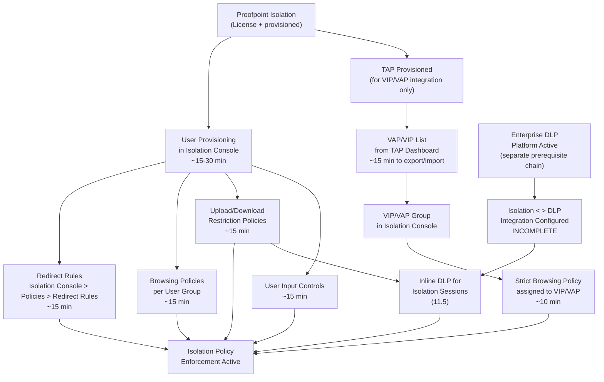

# Browser/Email Isolation Policies — Prerequisites

> Capability: Browser/Email Isolation Policies (group 11) | Product: Proofpoint Isolation
> Time estimates are approximate. Connector and user provisioning times vary by organizational complexity.

---

## Dependency Chain

---

## Configuration Order

### 1. Proofpoint Isolation License and Provisioning (1-3 business days)

**What it is:** Isolation is a licensed add-on to the Proofpoint TAP or Email Protection platform.
**What to configure:** Confirm Isolation is provisioned by your Proofpoint account team. Verify you can access the Isolation Console admin portal (URL provided by Proofpoint upon provisioning).
**Minimum viable config:** Admin access to Isolation Console confirmed.
**Source:** S15 — Grade B (standalone product with dedicated console)

---

### 2. User Provisioning in Isolation Console (15-30 minutes)

**What it is:** Import or sync users into the Isolation Console so policies can be scoped to groups.
**Workflow:** INCOMPLETE — user provisioning screens not documented in accessible sources.
**What to configure:**
- Connect identity source: SSO/SAML, Proofpoint User Center sync, or manual user import
- Verify target groups appear in Isolation Console user list
**Minimum viable config:** At least one user group visible in Isolation Console.
**Why required:** Browsing policies and redirect rules scoped to groups are silently non-functional without synced groups. Policies can only target all users without group provisioning.
**Source:** S15 — Grade B (per-group policies confirmed); provisioning method Grade U — **ASSUMPTION**

---

### 3a. Redirect Rules — Required for any URL interception (15 minutes)

**Capability:** 11.3 Redirect Rule Configuration
**Workflow:** [workflow.md Step 2](workflow.md)
**What to configure:** At least one redirect rule defining which URLs trigger isolation. Recommended starting point: Newly Registered Domains and Uncategorized URL categories.
**Minimum viable config:** One redirect rule, one URL category, Action = Isolate.
**Why required:** Without a redirect rule, no URL is ever intercepted — Isolation is provisioned but entirely passive.
**Source:** S15 — Grade B; navigation path confirmed: Isolation Console > Policies > Redirect Rules

---

### 3b. TAP Provisioned and VAP List Exported — Required for VIP/VAP isolation (15 minutes)

**Capability:** 11.4 TAP URL Isolation Integration, 11.7 VIP/VAP List Import
**Workflow:** [workflow.md Step 7](workflow.md)
**Only needed for:** VIP/VAP URL isolation sub-capabilities (11.4 and 11.7). Not required for standard browsing policies.
**What to configure:** Access TAP Dashboard, review and export current VAP list, import into Isolation Console VIP/VAP section.
**Minimum viable config:** At least one VAP/VIP user group imported and assigned a browsing policy.
**Critical:** This is a manual, recurring process. The VAP list does NOT auto-sync. Re-import is required after every TAP threat review cycle.
**Source:** S15 — Grade B; Video 17 ~1:30 — Grade C

---

### 4. Browsing Policies — Required for per-group access control (15 minutes per policy)

**Capability:** 11.1 Browsing Policy Creation (per user group)
**Workflow:** [workflow.md Step 3](workflow.md)
**What to configure:** Create at least one browsing policy defining interaction level for a user group.
**Minimum viable config:** Policy Name, User Group assigned, Interaction Level set.
**Source:** S15 — Grade B

---

### 5. Upload/Download Restriction Policies — Optional but recommended (15 minutes)

**Capability:** 11.2 Upload/Download Restriction Policies
**Workflow:** [workflow.md Step 4](workflow.md)
**What to configure:** File type restrictions and/or URL category restrictions for transfers in isolation sessions.
**Minimum viable config:** At least one restriction dimension selected; Action set.
**Source:** S15 — Grade B

---

### 6. User Input Controls — Optional (15 minutes)

**Capability:** 11.6 User Input Controls (Credential Theft Prevention)
**Workflow:** [workflow.md Step 5](workflow.md)
**What to configure:** Set input restriction type for target URL scope or user group.
**Minimum viable config:** Input Restriction Type and Target Scope set.
**Source:** S15 — Grade B

---

### 7. Enterprise DLP Integration — Required for Inline DLP only (time varies)

**Capability:** 11.5 Inline DLP for Isolation Sessions
**Only needed for:** Inline DLP scanning of uploads/downloads in isolation sessions.
**What to configure:**
- Enterprise DLP platform (Proofpoint Data Security) must be active with configured detection rules [S10, S11 — Grade A]
- Isolation < > Enterprise DLP integration must be configured (integration config screen UNKNOWN — INCOMPLETE)
- Upload/Download Restriction policy must have Sensitive Data Detection enabled
**Note:** This is a multi-product integration requiring both Proofpoint Isolation and Proofpoint Data Security to be licensed and configured. The integration configuration workflow is INCOMPLETE — not documented in accessible sources.
**Source:** S15 — Grade B; integration config details Grade U — **ASSUMPTION**

---

## Total Time Estimate

| Path | Steps | Estimated Time |
|------|-------|---------------|
| Minimum viable isolation (redirect rules only, all users) | Steps 1, 2, 3a | ~45-90 minutes |
| VIP/VAP isolation with browsing policies | Steps 1, 2, 3a, 3b, 4 | ~60-120 minutes |
| Full isolation with upload/download restrictions and user input controls | Steps 1-6 | ~90-150 minutes |
| Full isolation with inline DLP | Steps 1-7 | 2-4 hours + Enterprise DLP prerequisite chain |
| **Enterprise DLP prerequisite chain (if not already configured)** | See Data Security prerequisites | 1-2 days |

---

## Recurring Maintenance

| Task | Frequency | Why |
|------|-----------|-----|
| Re-import VAP list from TAP | After each TAP threat review cycle | VAP roster changes; new VAPs are unprotected until re-import [Video 17 — Grade C; S15 — Grade B] |
| Review redirect rule URL categories | Quarterly | URL category definitions update; new high-risk categories may emerge [Grade U — **ASSUMPTION**] |
| Audit user group sync | Monthly | New users added to high-risk groups may not be covered if sync is not current [Grade U — **ASSUMPTION**] |
