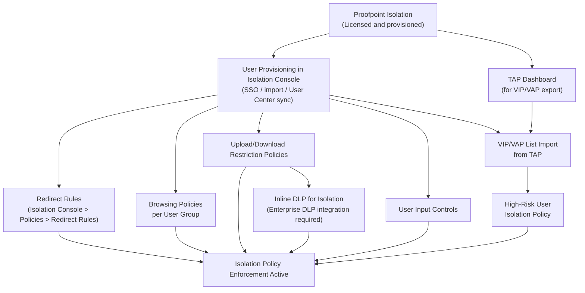
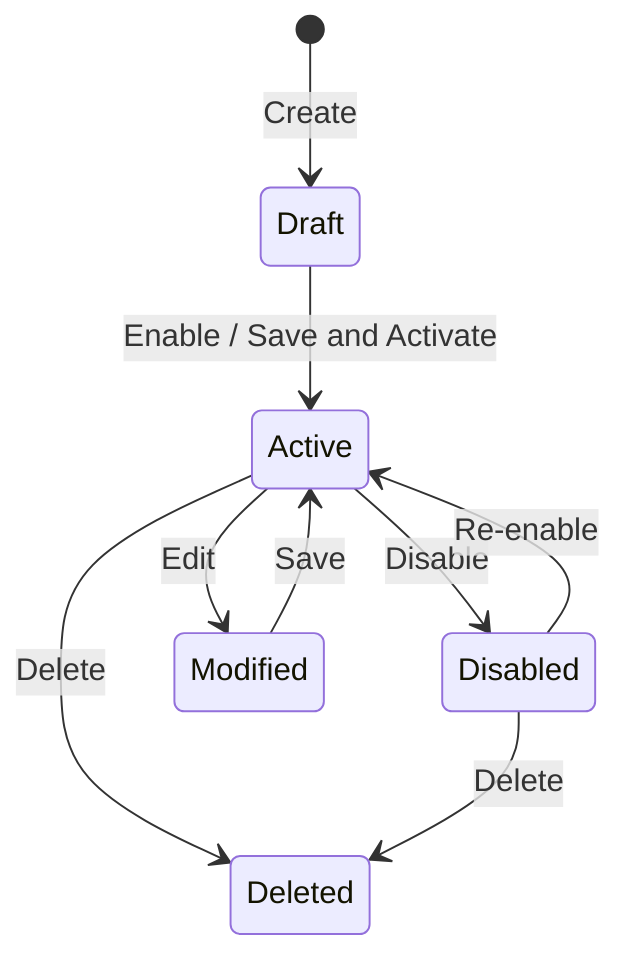

# Browser/Email Isolation Policies — Workflow Reference

> Capability group: 11 (Browser/Email Isolation Policies) | Sub-capabilities: 11.1 – 11.7
> Generated: 2026-05-21 | Product: Proofpoint Isolation (formerly TAP Browser Isolation)
> Doc corpus version: Isolation data sheet Aug 2023 [S15]

---

## Overview

Proofpoint Isolation renders web pages in a secure cloud container, stripping executable code and delivering only safe rendered content to the end user's browser. It protects against drive-by downloads, credential theft via fake login pages, and malicious web content embedded in email-delivered URLs. Policy authoring for Isolation involves creating browsing policies (per user group access rules), upload/download restriction policies, redirect rules (which URLs trigger isolation), inline DLP rules for session activity, user input controls (credential theft prevention), and importing VIP/VAP lists from TAP to identify high-risk users who require isolation for all TAP-delivered URLs.

Isolation policies are configured in the **Isolation Console** (a dedicated admin interface separate from the Email Protection console and the Data Security console). The product was originally part of the TAP (Targeted Attack Protection) suite and is now a standalone product, though TAP integration remains a core use case.

**Complexity:** COMPLEX — six distinct policy types with a prerequisite dependency on user provisioning and TAP integration for the most security-valuable use case (VIP/VAP URL isolation). Field-level documentation is at data-sheet level only (Grade B); admin console field names and navigation require authentication.

**Prerequisite chain length:** 2–4 steps depending on sub-capability (standalone browsing policies require 2 steps; TAP-integrated VIP/VAP isolation requires 4 steps)
**Total configurable fields:** INCOMPLETE — estimated 20–40 fields across all policy types based on data sheet descriptions (Grade U — **ASSUMPTION**)
**Screens involved:** INCOMPLETE — 4+ distinct screens inferred from data sheet; exact navigation not documented
**Evidence base:** 1 Grade B source (S15 — Isolation data sheet, Aug 2023), 2 Grade C sources (Video 17 — TAP Browser Isolation demo 2019, Video 18 — Proofpoint Isolation demo 2022). No Grade A source accessible. No policy authoring walkthrough video found — demos show end-user experience only.

---

## Coverage Warning

**Browser/Email Isolation has MODERATE documentation coverage at data-sheet level but LOW coverage for admin workflow detail.** The data sheet (S15) describes all seven sub-capability areas but does not document field names, required fields, or navigation paths. Two demo videos (Videos 17, 18) show the end-user isolation experience but neither demonstrates the admin policy authoring workflow. The Isolation Console configuration screens require authentication. All navigation paths and field names in this document that are not directly quoted from S15 are Grade U (**ASSUMPTION**) or Grade E (inferred).

---

## Screen Hierarchy

INCOMPLETE — the following is a partial screen hierarchy reconstructed from S15 data sheet descriptions and product architecture understanding.

```yaml
# Partial — reconstructed from S15 (Grade B) and inferred from capability descriptions
# Requires verification against live Isolation Console

screen:
  name: "Isolation Console > Policies (root)"
  navigation: "UNKNOWN — separate Isolation Console admin interface; distinct from Email Protection and Data Security consoles"
  parent: null
  type: page
  notes: "Isolation Console is a product-specific admin portal; URL UNKNOWN"
  sub_sections:
    - "Browsing Policies"
    - "Redirect Rules"
    - "Upload/Download Restrictions"
    - "User Input Controls"
    - "VIP/VAP Management"

screen:
  name: "Isolation Console > Policies > Redirect Rules"
  navigation: "Isolation Console > Policies > Redirect Rules"
  parent: "Isolation Console > Policies"
  type: page
  notes: "S15 explicitly states: 'Configurable via Isolation Console > Policies > Redirect Rules' — this is the only confirmed navigation path in accessible sources"
  source: "S15 — Grade B"
  fields:
    - name: "Redirect Rule URL / Pattern"
      type: text
      required: true
      default: null
      description: "URL or URL pattern that triggers isolation when a user navigates to it"
      evidence_grade: "E — Inferred from S15 description"

screen:
  name: "Isolation Console > Policies > Browsing Policies"
  navigation: "UNKNOWN — navigated from Isolation Console Policies section"
  parent: "Isolation Console > Policies"
  type: page
  notes: "INCOMPLETE — browsing policies are described in S15 as per-group access controls; field names unknown"

screen:
  name: "Isolation Console > Policies > Upload/Download Restrictions"
  navigation: "UNKNOWN"
  parent: "Isolation Console > Policies"
  type: page
  notes: "INCOMPLETE — restriction dimensions described in S15 (URL, category, file type, sensitive data, malware); field names unknown"

screen:
  name: "Isolation Console > Policies > User Input Controls"
  navigation: "UNKNOWN"
  parent: "Isolation Console > Policies"
  type: page
  notes: "INCOMPLETE — described in S15 as dynamic limits on form input; specific controls unknown"

screen:
  name: "Isolation Console > Users / VIP/VAP"
  navigation: "UNKNOWN"
  parent: "Isolation Console"
  type: page
  notes: "INCOMPLETE — S15 states VIP/VAP lists can be imported from User Center and TAP; import UI not described"
```

---

## Step-by-Step Walkthrough

### Step 1: Provision Users in Isolation Console

**Navigate to:** UNKNOWN — INCOMPLETE
**Screen:** Isolation Console > Users (inferred name)
**Purpose:** Isolation policies scope to user groups. Users must be provisioned in the Isolation Console before browsing policies can be assigned to them. Provisioning may happen via SSO/SAML, manual import, or sync from Proofpoint User Center.

| Field | Type | Required | Default | Description | Source |
|-------|------|----------|---------|-------------|--------|
| User provisioning method | Select | Yes | Unknown | SSO, manual, User Center sync | Grade U — **ASSUMPTION** |
| User group assignment | Multi-select | No | Default group | Which isolation policy group the user belongs to | E — Inferred from S15 per-group policy description |

**Note:** Field names and provisioning workflow INCOMPLETE. [S15 — Grade B, inferred]

---

### Step 2: Create Redirect Rules (Sub-capability 11.3)

**Navigate to:** Isolation Console > Policies > Redirect Rules
**Screen:** Redirect Rules list
**Purpose:** Redirect rules define which URLs cause Proofpoint to intercept the navigation and render the page inside the isolation container instead of the user's local browser. This is the foundational policy that enables all isolation features.

**This is the only confirmed navigation path in accessible sources.** [S15 — Grade B]

| Field | Type | Required | Default | Description | Source |
|-------|------|----------|---------|-------------|--------|
| URL / URL pattern | Text or regex | Yes | None | The URL(s) that trigger isolation | E — Inferred from S15 |
| URL category | Dropdown/multiselect | No | None | Predefined URL categories (e.g., "Newly Registered Domains," "Uncategorized") | E — Inferred from S15 upload/download restriction capability |
| User group scope | Multi-select | No | All users | Which user groups this redirect rule applies to | E — Inferred from S15 per-group browsing policies |
| Action | Select | Yes | Isolate | Isolate, Block, Allow | Grade U — **ASSUMPTION** |

**INCOMPLETE — all field names require verification.**

---

### Step 3: Create Browsing Policies per User Group (Sub-capability 11.1)

**Navigate to:** Isolation Console > Policies > Browsing Policies (exact path UNKNOWN)
**Screen:** Browsing Policies
**Purpose:** Browsing policies define what users can do within isolated sessions. S15 explicitly describes per-group access controls: "researchers might have less restrictive access; executives (VIPs) get stricter controls." Policy parameters control whether users can interact with page content, submit forms, or access specific URL categories.

| Field | Type | Required | Default | Description | Source |
|-------|------|----------|---------|-------------|--------|
| Policy Name | Text | Yes | None | Internal identifier | E — Inferred from S15 |
| User group | Multi-select | Yes | None | Which groups this policy applies to | S15 — Grade B |
| Access level | Select or toggle set | Yes | Unknown | Degree of restriction (e.g., read-only, interactive, full) | Grade U — **ASSUMPTION** |
| URL category restrictions | Multi-select | No | None | Block or monitor specific URL categories within isolation | E — Inferred from S15 |

**INCOMPLETE — field names and options require verification.**

---

### Step 4: Configure Upload/Download Restriction Policies (Sub-capability 11.2)

**Navigate to:** Isolation Console > Policies > Upload/Download Restrictions (exact path UNKNOWN)
**Screen:** Upload/Download Restrictions
**Purpose:** Controls file transfers within isolation sessions. S15 documents five restriction dimensions: by URL, URL category, file type, sensitive data content, and malware detection. This is where DLP integration for isolation sessions is configured.

| Field | Type | Required | Default | Description | Source |
|-------|------|----------|---------|-------------|--------|
| Restriction scope | Select | Yes | None | Apply to uploads, downloads, or both | E — Inferred from S15 |
| URL filter | Text | No | None | Restrict transfers to/from specific URLs | S15 — Grade B |
| URL category filter | Dropdown | No | None | Restrict transfers from specific categories | S15 — Grade B |
| File type filter | Multi-select | No | None | Restrict specific file types (e.g., .exe, .zip, .pdf) | S15 — Grade B |
| Sensitive data detection | Toggle/select | No | Disabled | Enable inline DLP scanning of upload/download content | S15 — Grade B |
| Malware scan | Toggle | No | Unknown | Block transfers detected as malware | E — Inferred from S15 malware restriction capability |
| Action | Select | Yes | None | Block, alert, allow-with-log | E — Inferred from product capability |

**Decision point:** Enabling "sensitive data detection" activates inline DLP for isolation sessions (sub-capability 11.5). This requires that the DLP integration between Isolation and the Enterprise DLP platform is configured. [S15 — Grade B]

---

### Step 5: Configure User Input Controls (Sub-capability 11.6)

**Navigate to:** Isolation Console > Policies > User Input Controls (exact path UNKNOWN)
**Screen:** User Input Controls
**Purpose:** Prevents credential theft by dynamically limiting what users can type into web forms during an isolation session. Specifically designed to prevent users from entering corporate credentials on phishing/impersonation sites that have been isolated rather than blocked.

| Field | Type | Required | Default | Description | Source |
|-------|------|----------|---------|-------------|--------|
| Form input restriction mode | Select | Yes | Unknown | Read-only, limited input, full interaction | Grade U — **ASSUMPTION** |
| Target URL or category | Text/Select | No | None | Apply input restriction to specific URLs or URL categories | E — Inferred from S15 |
| Credential detection | Toggle | No | Unknown | Detect and warn on potential credential entry | Grade U — **ASSUMPTION** |
| User notification | Toggle | No | Unknown | Notify user when input controls activate | Grade U — **ASSUMPTION** |

**INCOMPLETE — user input control field names require verification.**
Source: S15 — Grade B ("dynamic limits on form input to prevent credential theft")

---

### Step 6: Configure Inline DLP for Isolation Sessions (Sub-capability 11.5)

**Navigate to:** Enabled as part of Upload/Download Restriction policy (Step 4) — no dedicated navigation path confirmed
**Purpose:** Applies real-time DLP scanning to file uploads and downloads occurring within isolated browser sessions. Leverages the Enterprise DLP integration. [S15 — Grade B]

This sub-capability is activated by enabling "sensitive data detection" in the Upload/Download Restriction policy (Step 4). It does not have a standalone configuration screen documented in accessible sources.

| Prerequisite | Notes | Source |
|-------------|-------|--------|
| Enterprise DLP platform integration configured | Isolation DLP sends detected content to the Enterprise DLP engine for classification | S15 — Grade B; cross-reference S13 (CASB DLP), S10 (Detection Rules) |
| DLP rules/classifiers defined in Enterprise DLP | Without defined DLP rules, the inline scan has nothing to match against | E — Inferred from integration architecture |

---

### Step 7: Import VIP/VAP List from TAP (Sub-capability 11.7)

**Navigate to:** Isolation Console > Users / VIP-VAP (exact path UNKNOWN)
**Screen:** VIP/VAP management
**Purpose:** TAP (Targeted Attack Protection) identifies Very Important People (VIPs) and Very Attacked People (VAPs) — users who receive a disproportionate number of targeted attacks. Proofpoint Isolation can automatically isolate all TAP-delivered URLs for these users, providing a higher-protection browsing experience without requiring them to do anything differently.

S15 states: "you can import your VIP user list from User Center and the VAP list from TAP." [S15 — Grade B]

| Step | Action | Source |
|------|--------|--------|
| 1 | Open the TAP Dashboard and review the current VAP list | Video 17 ~1:30 — Grade C |
| 2 | Export VAP list from TAP Dashboard (or note the user group) | Video 17 ~1:30 — Grade C |
| 3 | Navigate to Isolation Console > VIP/VAP import (exact path UNKNOWN) | S15 — Grade B |
| 4 | Import the VAP list | S15 — Grade B |
| 5 | Assign a stricter browsing policy to the imported VAP group | E — Inferred from S15 per-group policy architecture |
| 6 | Set a reminder to re-import after each TAP threat review cycle | Video 17 ~1:30 — Grade C |

**CRITICAL GOTCHA:** VAP list does NOT automatically sync from TAP to Isolation. Manual import is required. New VAPs are unprotected until the next manual import. [Video 17 ~1:30 — Grade C; S15 — Grade B confirms "import" wording]

See also: [gotchas.md G1](gotchas.md) for the VAP auto-sync gap detail.

---

## Dependency Graph



### Prerequisite Chain (Ordered)

1. **Proofpoint Isolation license provisioned** — no prerequisites except Proofpoint account. [S15 — Grade B]
2. **User provisioning in Isolation Console** — created at: UNKNOWN screen — requires: [Isolation provisioned]. Policies cannot scope to user groups without users. [S15 — Grade B, inferred]
3. **Redirect Rules** — created at: Isolation Console > Policies > Redirect Rules — requires: [User provisioning]. At least one redirect rule must exist for any URL to be intercepted. [S15 — Grade B]
4. **Browsing Policies** — created at: UNKNOWN — requires: [User provisioning]. Controls user experience within isolation sessions. [S15 — Grade B]
5. **Upload/Download Restrictions** — created at: UNKNOWN — requires: [User provisioning, Redirect Rules active]. [S15 — Grade B]
6. **User Input Controls** — created at: UNKNOWN — requires: [User provisioning, Redirect Rules active]. [S15 — Grade B]
7. **Enterprise DLP integration** — configured at: UNKNOWN — requires: [Enterprise DLP platform active]. Required only for Inline DLP (11.5). [S15 — Grade B]
8. **Inline DLP for Isolation (11.5)** — enabled within Upload/Download Restrictions — requires: [Enterprise DLP integration configured, step 7]. [S15 — Grade B]
9. **TAP integration for VIP/VAP (11.4, 11.7)** — configured at: TAP Dashboard + Isolation Console — requires: [TAP provisioned, Isolation provisioned]. [S15 — Grade B; Video 17 — Grade C]

---

## Decision Points

| Screen | Decision | Options | Default | Implications | Recommended | Why | Source |
|--------|----------|---------|---------|-------------|-------------|-----|--------|
| Browsing Policies | Access level per group | Read-only, Limited, Full Interactive (options UNCONFIRMED) | Unknown | Read-only prevents data entry; full interactive allows all actions including credential entry | Limited for unknown users; Full for verified internal users | Limits attack surface while maintaining usability | S15 — Grade B; options Grade U — **ASSUMPTION** |
| Upload/Download Restrictions | Sensitive data detection (DLP) | Enabled / Disabled | Unknown | Enabling scans all isolation session transfers against Enterprise DLP; may add latency | Enabled | Real-time DLP is a primary value proposition of Isolation for data protection | S15 — Grade B |
| Redirect Rules | Trigger scope | Specific URLs, URL categories, All web traffic, TAP-rewritten URLs | Unknown | Isolating all web traffic is highest security but may impact performance; category-based is balanced | URL categories (Newly Registered + Uncategorized) | Covers highest-risk sites while limiting isolation overhead | E — Inferred from S15 |
| VIP/VAP import | Source | User Center (VIPs), TAP (VAPs), Manual list | N/A | Automated import preferred but does not auto-sync — manual refresh required | TAP VAP import | VAPs are empirically the highest-attack-risk users | S15 — Grade B; Video 17 — Grade C |

---

## Object Lifecycle

INCOMPLETE — Isolation policy object state machine not documented in accessible sources.



**Source for lifecycle diagram:** Grade U — **ASSUMPTION** based on common isolation product lifecycle patterns. Requires verification.

---

## Integration Touchpoints

| Capability | Relationship | Direction | Notes | Source |
|-----------|-------------|-----------|-------|--------|
| [TAP Policies](../../tap/workflow.md) | TAP URL isolation for VIPs/VAPs: TAP rewrites email URLs; Isolation renders them in container | Upstream: TAP → Isolation | TAP provides the VAP list and triggers URL rewriting; Isolation provides the secure rendering layer | S15 — Grade B; Video 17 — Grade C |
| [CASB Policies](../casb/workflow.md) | Complementary scope: CASB governs authenticated cloud app sessions; Isolation governs unauthenticated web browsing | Peer | A user clicking a link in email goes through Isolation; accessing SharePoint directly goes through CASB | S13, S15 — Grade A/B |
| [Data Security / Enterprise DLP](../../data-security/workflow.md) | Inline DLP for isolation sessions uses Enterprise DLP classification engine | Upstream: Enterprise DLP → Isolation | Upload/download scanning in Isolation sessions is classified by the same DLP rules used for endpoint DLP | S15 — Grade B |
| [Email Filtering Policies](../../email-filtering/workflow.md) | Email delivers URLs that Isolation may render; isolation policy triggered by TAP URL rewrites or redirect rules | Upstream: Email → TAP → Isolation | Isolation is the last layer of the email URL click-time protection chain | S15 — Grade B |

---

## Complexity Score

| Dimension | Simple | Moderate | Complex | This Capability |
|-----------|--------|----------|---------|-----------------|
| Fields | 3-5 fields | 10-20 fields | 50+ fields | Est. 20-40 fields across 6 policy types → MODERATE to COMPLEX |
| Screens | 1 screen | 2-3 screens | 4+ screens with sub-tabs | 5+ distinct policy screens confirmed from S15 → COMPLEX |
| Dependencies | No prerequisites | 1-2 prerequisites | Chain of 3+ prerequisites | Up to 9-step chain for full TAP/DLP integration → COMPLEX |

**Complexity: COMPLEX**

**Justification:** While any individual sub-capability (e.g., creating a single redirect rule) may be moderate in isolation, the full Isolation capability involves 5+ distinct policy type screens, requires user provisioning as a prerequisite before any scoped policy is functional, and for the highest-value use case (VIP/VAP TAP URL isolation with inline DLP) requires a 9-step dependency chain spanning three product lines (TAP, Isolation, Enterprise DLP). The highest dimension is COMPLEX on both screens and dependencies.

---

## Sources

| # | Source | Grade | Used For |
|---|--------|-------|----------|
| S15 | Proofpoint Isolation Data Sheet — proofpoint.com/sites/default/files/pfpt-us-ds-browser-isolation.pdf — Isolation (Aug 2023) | B | All seven sub-capability area descriptions; redirect rules navigation path; VIP/VAP import confirmation; DLP integration; browsing policies per group |
| Video 17 | Proofpoint TAP Browser Isolation Product Demo — youtube.com/watch?v=0c4FGolNnvk — 2019-08-15 | C | VAP list manual import requirement (critical gotcha); TAP integration workflow |
| Video 18 | Proofpoint Isolation Demo — youtube.com/watch?v=Nf5He2rjviw — 2022-12-29 | C | End-user isolation experience (no admin policy authoring demonstrated) |
| Video Intelligence | video-intelligence.md — Coverage Gaps table | N/A | Confirmed: no admin policy authoring walkthrough video exists for Isolation |
