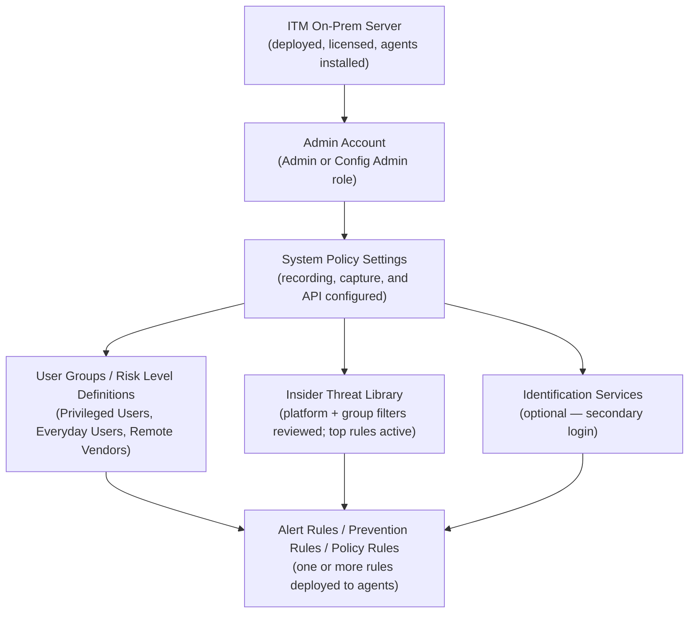

# ITM/ObserveIT Policy Configuration — Prerequisites

## Dependency Chain

---

## Configuration Order

### 1. ITM On-Prem Server (estimated time: hours to days — infrastructure, not configuration)

**Capability:** Foundational infrastructure
**What to configure:** Deploy the ITM On-Prem server, install agents on monitored endpoints, apply product license
**Minimum viable config:** Server reachable from agent endpoints; agents checking in to console
**Prerequisites:** None
**Source:** [S4] — ITM 7.18.0 configuration guide references server as assumed deployed

> This step is outside the policy configuration workflow. Contact Proofpoint Professional Services or follow the ITM On-Prem Deployment Guide for server installation. The policy configuration workflow in this document begins after agents are deployed and checking in.

---

### 2. Admin Account with Config Admin Role (estimated time: 5–10 minutes)

**Capability:** User management / role assignment
**Workflow:** ITM Web Console → User Management (path not documented in accessible sources — INCOMPLETE)
**What to configure:** Ensure your account has Admin or Config Admin role
**Minimum viable config:** At least one account with Config Admin role
**Prerequisites:** Step 1 (server running)
**Source:** [S6] prod.docs.oit.proofpoint.com — "Requires Admin or Config Admin role" for import/export and rule management

> Role requirements are confirmed for rule import/export [S6]. The full RBAC model and role assignment UI are INCOMPLETE — not documented in publicly accessible sources. **ASSUMPTION [Grade U]:** Admin and Config Admin are distinct roles with Config Admin being the minimum required for policy configuration tasks.

---

### 3. System Policy Settings (estimated time: 10–15 minutes)

**Capability:** 8.1 System Policy Settings (Recording/Monitoring)
**Workflow:** Web Console → Configuration → System Policy Settings
**What to configure:**
- Enable Recording = ON (verify — default is ON but may be off if previously disabled)
- Session Timeout = organization standard (default 15 min is acceptable)
- Enable Key Logging = ON if keystroke-based rules are needed
- Screen Recapturing Mode = appropriate for your privacy policy
- Image Format = Grayscale Server Compression (recommended for storage efficiency)
- Enable API = ON if SOAR/SIEM integration is planned
- Enable Agent Passive Mode = OFF if prevention rules are needed

**Minimum viable config:** Enable Recording = ON; all other settings can remain at defaults for initial deployment
**Prerequisites:** Step 2 (Config Admin role)
**Source:** [S4] prod.docs.oit.proofpoint.com/configuration_guide/system_policy_settings.htm — ITM 7.18.0

> System Policy Settings must be completed before rules are deployed, because rules referencing evidence types (keystrokes, screen captures) will produce no data if the corresponding capture feature is disabled. There is no warning in the rule creation wizard when a referenced capture type is disabled at the system level.

---

### 4. User Groups / Risk Level Targeting (estimated time: 5–15 minutes)

**Capability:** 8.11 User Group / Risk Level Targeting
**Workflow:** Insider Threat Library filters; rule condition targeting
**What to configure:** Identify which user populations to target (Privileged Users, Everyday Users, Remote Vendors); map these to actual AD/LDAP groups if custom group targeting is needed
**Minimum viable config:** Selecting the appropriate built-in group filter in the Library (no custom group creation needed for initial deployment)
**Prerequisites:** Step 3 (System Policy Settings)
**Source:** [S5] prod.docs.oit.proofpoint.com/insider_threat_library/itl_overview.htm — ITM 7.18.0

> Custom user group definition workflow is INCOMPLETE — not documented in accessible sources. Built-in group categories (Privileged Users, Everyday Users, Remote Vendors) are available without additional configuration. Custom AD/LDAP group integration requires additional research.

---

### 5. Alert Rules / Prevention Rules / Policy Rules (estimated time: 15–30 minutes for initial set)

**Capability:** 8.7, 8.8, 8.9 Rule creation; 8.6 Library activation
**Workflow:** Configuration → Alerts → Alert & Prevent Rules
**What to configure:** Activate relevant Insider Threat Library rules; create custom alert/prevention/policy rules as needed
**Prerequisites:** Steps 1–4
**Minimum viable config:** Activate at least one Insider Threat Library rule for the relevant platform and user group
**Source:** [S5], [S6]

> Ready when: Steps 1–4 are complete, agents are reporting in, and at least one admin account with Config Admin role can access the Web Console.

---

### Optional: Identification Services (estimated time: UNKNOWN — INCOMPLETE documentation)

**Capability:** 8.12 Identification Services (Secondary Login)
**Workflow:** Configuration → Identification Services
**What to configure:** Secondary login method for identifying real users behind shared accounts
**Prerequisites:** Step 3 (Enable Identity Theft Detection = ON in System Policy Settings)
**Source:** [S4] — partial; full configuration workflow INCOMPLETE

---

## Total Time Estimate

| Step | Time |
|------|------|
| 1. Server + agent deployment | hours to days (infrastructure; out of scope) |
| 2. Admin account / role verification | 5–10 minutes |
| 3. System Policy Settings | 10–15 minutes |
| 4. User group targeting | 5–15 minutes |
| 5. Initial rule activation / creation | 15–30 minutes |
| **Total (steps 2–5)** | **35–70 minutes** |
