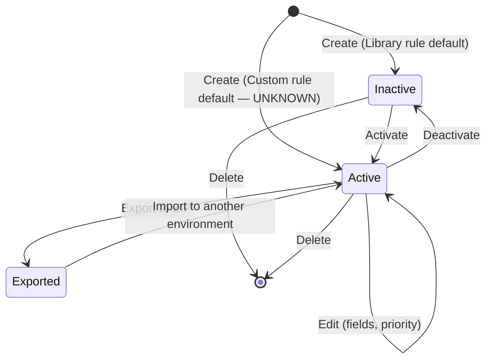

# ITM/ObserveIT Policy Configuration — Workflow Reference

> Capability: `itm` | Product: `proofpoint` | Generated: 2026-05-21
> Version scope: ITM On-Prem 7.18.0 (primary) / Data Security agent policies (current)

## Overview

Proofpoint ITM (Insider Threat Management, formerly ObserveIT) provides on-premises endpoint monitoring and policy enforcement for detecting and responding to insider threats. Policy configuration covers two distinct planes: **System Policy Settings** (controlling what the recording agent captures — keystrokes, screens, session timing, stealth mode) and **Rules** (alert rules, prevention rules, policy rules, and the Insider Threat Library of 300+ pre-built scenarios). Together these planes define what is monitored, when alerts fire, and what is actively blocked. ITM sits within the broader Proofpoint Data Security product family alongside the cloud-native Agent Policies (Data Security) that can also carry ITM signal types.

**Complexity:** COMPLEX — prerequisite chain spans admin roles, user group definitions, and identification services; rule authoring involves condition-action logic across Windows/Mac/Unix platforms with 13 system settings and 4 rule types.
**Prerequisite chain length:** 3 steps (ITM server deployment → admin account with Config Admin role → user groups/risk levels)
**Total configurable fields:** 36+ across system settings; rule fields vary by rule type (estimated 15–25 per rule)
**Screens involved:** 7 primary screens (Configuration, System Policy Settings, Alert & Prevent Rules, Rule Creation wizard, Insider Threat Library, Import/Export, Identification Services)
**Evidence base:** 4 Grade A sources (S4, S5, S6, S7), 1 Grade B video (Video 16), 0 Grade D/E for core flows

---

## Screen Hierarchy

```yaml
screens:
  - name: "Web Console > Configuration"
    navigation: "Log in to ITM Web Console → click Configuration (top or left nav)"
    parent: null
    type: page
    description: "Root configuration hub for all ITM settings"
    children:
      - "System Policy Settings"
      - "Alerts > Alert & Prevent Rules"
      - "Identification Services"
    source: "[S4] prod.docs.oit.proofpoint.com/configuration_guide/system_policy_settings.htm — ITM 7.18.0"

  - name: "Configuration > System Policy Settings"
    navigation: "Configuration → System Policy Settings"
    parent: "Web Console > Configuration"
    type: page
    description: "Master toggles for recording, key logging, screen capture, session timeouts, notifications, API, and passive mode. Settings are platform-scoped (Windows / Mac / Unix)."
    fields:
      - name: "Enable Recording"
        type: toggle
        required: false
        default: "Enabled"
        options: ["Enabled", "Disabled"]
        description: "Master switch for agent-based activity recording. When disabled, the Continue Recording After Lock field becomes available."
        platforms: ["Windows", "Mac", "Unix"]
        gotcha: "Disabling recording globally also disables all rule evaluations — alerts and prevention rules will not fire."
        source: "[S4]"

      - name: "Continue Recording After Lock"
        type: toggle
        required: false
        default: "N/A (only visible when Enable Recording is disabled)"
        options: ["Enabled", "Disabled"]
        description: "When Enable Recording is disabled, this option allows API-triggered recording sessions to continue."
        platforms: ["Windows", "Mac", "Unix"]
        condition: "Visible only when Enable Recording = Disabled"
        source: "[S4]"

      - name: "Session Timeout"
        type: number
        required: false
        default: "15 minutes"
        description: "Inactivity threshold after which a user session is automatically closed in ITM."
        platforms: ["Windows", "Mac", "Unix"]
        gotcha: "Setting to 0 may cause excessive session fragmentation in ITM reporting."
        source: "[S4]"

      - name: "Enable Key Logging"
        type: toggle
        required: false
        default: "Disabled"
        options: ["Enabled", "Disabled"]
        description: "Captures keystrokes and paste actions. Must be enabled before Keyboard Frequency can be configured."
        platforms: ["Windows", "Mac"]
        gotcha: "Key logging must be explicitly enabled — it is OFF by default. This is a common oversight when configuring clipboard monitoring rules."
        source: "[S4]"

      - name: "Keyboard Frequency"
        type: dropdown
        required: false
        default: "1 second"
        options: ["Every keystroke", "0.5 seconds", "1 second", "5 seconds", "10 seconds"]
        description: "Sampling interval for keystroke capture."
        platforms: ["Windows", "Mac"]
        condition: "Configurable only when Enable Key Logging = Enabled"
        gotcha: "'Every keystroke' is extremely CPU-intensive; use only for high-risk user investigation."
        source: "[S4]"

      - name: "Continuous Recording"
        type: toggle
        required: false
        default: "OFF"
        options: ["ON", "OFF"]
        description: "Enables interval-based screen capture independent of user activity. CPU-intensive."
        platforms: ["Windows", "Mac"]
        gotcha: "Enabling this on all endpoints significantly increases storage and CPU usage — limit to targeted user groups."
        source: "[S4]"

      - name: "Screen Recapturing Mode"
        type: radio
        required: false
        default: "Focused window only"
        options: ["Focused window only", "Entire screen"]
        description: "Controls whether screen captures include the active window or the complete desktop."
        platforms: ["Windows", "Mac"]
        source: "[S4]"

      - name: "Image Format"
        type: dropdown
        required: false
        default: "Grayscale Server Compression (Windows/Unix); Color (Mac)"
        options: ["Color", "Grayscale Server Compression", "Grayscale Client Compression"]
        description: "Determines compression and color depth for screen capture images. Server compression reduces bandwidth; client compression reduces endpoint CPU."
        platforms: ["Windows", "Mac", "Unix"]
        gotcha: "Switching to Color from Grayscale can multiply storage requirements 3–5x. Benchmark before changing."
        source: "[S4]"

      - name: "Enable Identity Theft Detection"
        type: toggle
        required: false
        default: "N/A (documented as available, default not specified)"
        options: ["Enabled", "Disabled"]
        description: "Notifies users about endpoint access, supporting secondary login identification workflows."
        platforms: ["Windows", "Mac", "Unix"]
        source: "[S4]"

      - name: "Enable Recording Notification"
        type: toggle
        required: false
        default: "Disabled"
        options: ["Enabled", "Disabled"]
        description: "Displays a yellow notification bar to Unix users informing them that their session is being recorded. Unix-only control."
        platforms: ["Unix only"]
        source: "[S4]"

      - name: "Enable Live and Lock Messages"
        type: toggle
        required: false
        default: "Disabled"
        options: ["Enabled", "Disabled"]
        description: "Enables console-to-endpoint communication — admins can send live messages or lock the session from the Web Console."
        platforms: ["Windows", "Mac"]
        source: "[S4]"

      - name: "Enable API"
        type: toggle
        required: false
        default: "Disabled"
        options: ["Enabled", "Disabled"]
        description: "Enables the ITM Agent API for programmatic control (start/stop recording, trigger sessions). Required before any API-based integrations function."
        platforms: ["Windows", "Mac"]
        gotcha: "The API is DISABLED by default. Third-party SIEM and SOAR integrations that expect API-triggered recording will silently fail until this is enabled."
        source: "[S4]"

      - name: "Enable Agent Passive Mode"
        type: toggle
        required: false
        default: "UNKNOWN — not specified in source"
        options: ["Enabled", "Disabled"]
        description: "When enabled, the agent receives events alongside applications rather than intercepting them. Changes fundamental agent behavior model."
        platforms: ["All"]
        gotcha: "Passive mode changes the agent from an intercepting to an observing model — prevention rules will NOT fire in passive mode."
        source: "[S4]"

    actions:
      - name: "Save"
        type: button
        result: "Persists all System Policy Settings changes; pushed to agents on next heartbeat"
    source: "[S4] prod.docs.oit.proofpoint.com/configuration_guide/system_policy_settings.htm — ITM 7.18.0"

  - name: "Configuration > Alerts > Alert & Prevent Rules"
    navigation: "Configuration → Alerts → Alert & Prevent Rules"
    parent: "Web Console > Configuration"
    type: page
    description: "Central rule management screen. Lists all Alert Rules, Prevention Rules, Policy Rules, and System Rules. Provides access to rule creation, the Insider Threat Library, and Import/Export."
    fields:
      - name: "Rule Type Filter"
        type: dropdown
        options: ["Alert Rules", "Prevention Rules", "Policy Rules", "System Rules"]
        description: "Filters the rule list to the selected type"
        source: "[S6]"
    actions:
      - name: "New Rule"
        type: button
        result: "Opens the rule creation wizard"
      - name: "Import"
        type: button
        result: "Opens the Import wizard for bulk rule import"
      - name: "Export"
        type: button
        result: "Exports selected rules as a ZIP file"
      - name: "Insider Threat Library"
        type: button
        result: "Opens the Library panel showing 300+ pre-built detection scenarios"
    source: "[S6] prod.docs.oit.proofpoint.com/configuration_guide/exporting_and_importing_rules.htm — ITM 7.18.0"

  - name: "Alert & Prevent Rules > New Rule Wizard"
    navigation: "Configuration → Alerts → Alert & Prevent Rules → New Rule"
    parent: "Configuration > Alerts > Alert & Prevent Rules"
    type: wizard_step
    description: "Multi-step rule creation flow covering rule type, OS target, condition assignment, and actions."
    fields:
      - name: "Rule Type"
        type: radio
        required: true
        default: null
        options: ["Alert Rule", "Prevention Rule", "Policy Rule"]
        description: "Determines whether the rule triggers an alert, blocks an action, or records a policy violation."
        gotcha: "Rule type cannot be changed after the rule is saved. Choose carefully."
        source: "[S6]"

      - name: "Rule Name"
        type: text
        required: true
        default: null
        description: "Internal identifier for the rule. Shown in alert console and reports."
        source: "[S6]"

      - name: "OS Type"
        type: dropdown
        required: true
        default: "UNKNOWN — not documented"
        options: ["Windows/Mac", "Unix", "Both"]
        description: "Limits rule evaluation to the specified platform(s). Relevant in mixed-OS environments."
        gotcha: "Rules targeting the wrong OS will never fire. In mixed Windows/Unix environments, confirm OS Type is set to 'Both' or create separate rules per platform."
        source: "Video 16 ~1:00 [B — Vendor training video]"

      - name: "Priority"
        type: number
        required: false
        default: "UNKNOWN — default position not documented"
        validation: "Range 1–1000; lower number = higher priority"
        description: "Determines evaluation order. Lower priority number fires first."
        gotcha: "Newly created rules may default to a low-priority position that places them after conflicting rules. Always explicitly set priority. No documented default."
        source: "Video 16 ~3:00 [B — Vendor training video]; supplemented [S6]"

      - name: "Condition"
        type: radio
        required: true
        default: null
        options: ["From Library", "Threat Library", "Custom"]
        description: "Source of the detection condition. 'From Library' uses existing saved conditions; 'Threat Library' uses ITM pre-built 300+ scenarios; 'Custom' builds from scratch."
        source: "Video 16 ~2:00 [B — Vendor training video]; supplemented [S6]"

      - name: "Action"
        type: multiselect
        required: true
        default: null
        options: ["Alert", "Block (Prevention Rules only)", "Notify User", "Log Only"]
        description: "What the rule does when triggered. Available actions depend on Rule Type."
        gotcha: "Rules without an explicit severity level default to informational, which may not surface in dashboards filtered to High/Critical. Always set severity."
        source: "Video 16 ~3:00 [B — Vendor training video]"

      - name: "Severity"
        type: dropdown
        required: false
        default: "UNKNOWN — likely informational if not set"
        options: ["Informational", "Low", "Medium", "High", "Critical"]
        description: "Severity level attached to triggered alerts. Determines visibility in alert dashboards."
        gotcha: "No documented default. If not explicitly set, alerts may be informational and invisible in dashboards configured for High/Critical only."
        source: "Video 16 ~3:00 [B — Vendor training video]"

    steps:
      - "Step 1: Select Rule Type (Alert / Prevention / Policy)"
      - "Step 2: Name the rule and set OS Type and Priority"
      - "Step 3: Assign Condition (Library / Threat Library / Custom)"
      - "Step 4: Configure Actions and Severity"
      - "Step 5: Review and Save"
    source: "Video 16 ~2:00 [B]; [S6]"

  - name: "Alert & Prevent Rules > Insider Threat Library"
    navigation: "Configuration → Alerts → Alert & Prevent Rules → Insider Threat Library"
    parent: "Configuration > Alerts > Alert & Prevent Rules"
    type: page
    description: "Panel showing 300+ pre-built detection scenarios organized by security category and target user group. Rules can be activated or deactivated individually."
    fields:
      - name: "Category Filter"
        type: dropdown
        description: "Filters library rules by security category (e.g., data exfiltration, privilege abuse)"
        source: "[S5]"
      - name: "Platform Filter"
        type: dropdown
        options: ["Windows", "Mac", "Unix/Linux", "All"]
        description: "Limits displayed rules to the selected platform"
        source: "[S5]"
      - name: "Target User Group Filter"
        type: dropdown
        options: ["Privileged Users", "Everyday Users", "Remote Vendors", "All"]
        description: "Filters by intended target population"
        source: "[S5]"
      - name: "Rule Status"
        type: toggle
        options: ["Active", "Inactive"]
        description: "Enables or disables individual library rules. Top-performing rules activated by default for Windows and Mac."
        gotcha: "Library updates are distributed as ZIP files by the Content Manager — activating a rule does not guarantee you have the latest version. Check for pending updates."
        source: "[S5]"
    actions:
      - name: "Activate"
        type: button
        result: "Enables selected library rule(s)"
      - name: "Deactivate"
        type: button
        result: "Disables selected library rule(s) without deleting them"
      - name: "Update Library"
        type: button
        result: "Imports new/updated rules from ZIP file provided by Content Manager"
    source: "[S5] prod.docs.oit.proofpoint.com/insider_threat_library/itl_overview.htm — ITM 7.18.0"

  - name: "Configuration > Alerts > Alert & Prevent Rules > Import/Export"
    navigation: "Configuration → Alerts → Alert & Prevent Rules → Import or Export button"
    parent: "Configuration > Alerts > Alert & Prevent Rules"
    type: modal_dialog
    description: "Bulk import and export of Alert Rules, Prevention Rules, Policy Rules, and System Rules. User Lists can be exported as CSV."
    prerequisites:
      - "Admin or Config Admin role required"
    fields:
      - name: "Rule Type (Export)"
        type: multiselect
        options: ["Alert Rules", "Prevention Rules", "Policy Rules", "System Rules"]
        description: "Selects which rule types to include in the export ZIP"
        source: "[S6]"
      - name: "Import File"
        type: file_upload
        required: true
        description: "ZIP file containing previously exported rules"
        source: "[S6]"
      - name: "Conflict Resolution"
        type: radio
        options: ["Skip", "Overwrite", "Rename"]
        description: "Determines behavior when an imported rule name conflicts with an existing rule"
        gotcha: "Import wizard detects conflicts and missing data — review the conflict summary before confirming. Overwrite replaces existing rules permanently."
        source: "[S6]"
    actions:
      - name: "Export Selected"
        type: button
        result: "Downloads ZIP file containing selected rule types"
      - name: "Import"
        type: button
        result: "Imports rules from uploaded ZIP after conflict review"
    source: "[S6] prod.docs.oit.proofpoint.com/configuration_guide/exporting_and_importing_rules.htm — ITM 7.18.0"

  - name: "Configuration > Identification Services"
    navigation: "Configuration → Identification Services"
    parent: "Web Console > Configuration"
    type: page
    description: "Secondary login (identification) configuration. Enables ITM to identify the actual user behind a shared account or secondary session, such as a helpdesk technician logging into a terminal server."
    prerequisites:
      - "Enable Identity Theft Detection must be ON in System Policy Settings"
    fields:
      - name: "Service Type"
        type: dropdown
        description: "INCOMPLETE — specific options not documented in accessible sources"
        source: "[S4] — partial coverage"
      - name: "Identification Method"
        type: radio
        description: "INCOMPLETE — specific identification methods not documented in accessible sources"
        source: "[S4] — partial coverage"
    source: "[S4] prod.docs.oit.proofpoint.com/configuration_guide/system_policy_settings.htm — ITM 7.18.0 (partial)"
```

---

## Step-by-Step Walkthrough

### Step 1: Configure System Policy Settings

**Navigate to:** Web Console → Configuration → System Policy Settings
**Screen:** Configuration > System Policy Settings
**Purpose:** Define what the endpoint agent records before creating any rules. Rules that reference screen capture or keystroke data will not produce evidence unless these settings are enabled first.

| Field | Type | Required | Default | Description |
|-------|------|----------|---------|-------------|
| Enable Recording | toggle | No | Enabled | Master recording switch |
| Session Timeout | number | No | 15 min | Inactivity threshold |
| Enable Key Logging | toggle | No | Disabled | Keystroke capture |
| Keyboard Frequency | dropdown | No | 1 second | Keystroke sampling interval |
| Continuous Recording | toggle | No | OFF | Interval-based screen capture |
| Screen Recapturing Mode | radio | No | Focused window only | Desktop vs window capture |
| Image Format | dropdown | No | Grayscale Server (Win/Unix); Color (Mac) | Capture compression |
| Enable Identity Theft Detection | toggle | No | UNKNOWN | Secondary login notification |
| Enable Recording Notification | toggle | No | Disabled | Unix-only yellow notification bar |
| Enable Live and Lock Messages | toggle | No | Disabled | Console-to-endpoint messaging |
| Enable API | toggle | No | Disabled | Programmatic agent control |
| Enable Agent Passive Mode | toggle | No | UNKNOWN | Observe-only vs intercept mode |
| Continue Recording After Lock | toggle | No | N/A | API session persistence when recording disabled |

**Decision point:** If agents are expected to receive API-triggered recording from a SOAR/SIEM, Enable API must be toggled ON here before any integration will function. [S4]

**Save:** Click Save. Settings propagate to agents on next heartbeat cycle.

---

### Step 2: Activate Insider Threat Library Rules (Recommended for Initial Deployment)

**Navigate to:** Configuration → Alerts → Alert & Prevent Rules → Insider Threat Library
**Screen:** Alert & Prevent Rules > Insider Threat Library
**Purpose:** The fastest path to coverage — 300+ pre-built scenarios that cover the most common insider threat patterns across Windows, Mac, and Unix without requiring custom condition authoring.

| Field | Type | Required | Default | Description |
|-------|------|----------|---------|-------------|
| Category Filter | dropdown | No | All | Filter by security category |
| Platform Filter | dropdown | No | All | Windows / Mac / Unix / All |
| Target User Group Filter | dropdown | No | All | Privileged Users / Everyday Users / Remote Vendors / All |
| Rule Status | toggle | No | Active (top performers) | Enable or disable individual rules |

**Note:** Top-performing rules for Windows and Mac are activated by default. [S5] Review the active set and deactivate any rules that are not applicable to your environment before deployment.

**Decision point:** If the organization needs custom detection logic not covered by the Library, proceed to Step 4 (custom rule creation). Library activation and custom rules are not mutually exclusive.

---

### Step 3: Create an Alert Rule

**Navigate to:** Configuration → Alerts → Alert & Prevent Rules → New Rule
**Screen:** Alert & Prevent Rules > New Rule Wizard
**Purpose:** Create a rule that fires an alert when a specified user behavior is detected.

| Field | Type | Required | Default | Description |
|-------|------|----------|---------|-------------|
| Rule Type | radio | Yes | — | Select "Alert Rule" |
| Rule Name | text | Yes | — | Descriptive name; visible in alerts and reports |
| OS Type | dropdown | Yes | UNKNOWN | Windows/Mac, Unix, or Both |
| Priority | number | No | UNKNOWN | 1–1000; lower fires first |
| Condition | radio | Yes | — | From Library / Threat Library / Custom |
| Action | multiselect | Yes | — | Alert, Notify User, Log Only |
| Severity | dropdown | No | UNKNOWN (likely Informational) | Low / Medium / High / Critical |

**Wizard steps:**
1. Select "Alert Rule" as Rule Type
2. Enter Rule Name; set OS Type and Priority
3. Choose condition source (Threat Library for pre-built; Custom for new condition)
4. Select Action(s) and set Severity level explicitly
5. Review summary → Save

---

### Step 4: Create a Prevention Rule

**Navigate to:** Configuration → Alerts → Alert & Prevent Rules → New Rule
**Screen:** Alert & Prevent Rules > New Rule Wizard
**Purpose:** Actively block a risky activity in real-time rather than just alerting.

| Field | Type | Required | Default | Description |
|-------|------|----------|---------|-------------|
| Rule Type | radio | Yes | — | Select "Prevention Rule" |
| Rule Name | text | Yes | — | Name |
| OS Type | dropdown | Yes | UNKNOWN | Platform target |
| Priority | number | No | UNKNOWN | Evaluation order |
| Condition | radio | Yes | — | Library / Threat Library / Custom |
| Action | multiselect | Yes | — | Block (primary for prevention) + optional Notify User |
| Severity | dropdown | No | UNKNOWN | Severity for the associated alert |

**Decision point:** Prevention Rules will NOT fire if Enable Agent Passive Mode is enabled in System Policy Settings. Passive mode is observe-only. [S4]

---

### Step 5: Create a Policy Rule

**Navigate to:** Configuration → Alerts → Alert & Prevent Rules → New Rule
**Screen:** Alert & Prevent Rules > New Rule Wizard
**Purpose:** Define an organizational policy that records and documents user behavior against stated policy (e.g., acceptable use policy compliance).

| Field | Type | Required | Default | Description |
|-------|------|----------|---------|-------------|
| Rule Type | radio | Yes | — | Select "Policy Rule" |
| Rule Name | text | Yes | — | Name |
| OS Type | dropdown | Yes | UNKNOWN | Platform target |
| Priority | number | No | UNKNOWN | Evaluation order |
| Condition | radio | Yes | — | Library / Threat Library / Custom |
| Action | multiselect | Yes | — | Log Only, Notify User, or Alert |

---

### Step 6: Export/Import Rules (Optional — for Migration or Backup)

**Navigate to:** Configuration → Alerts → Alert & Prevent Rules → Export / Import
**Screen:** Alert & Prevent Rules > Import/Export
**Purpose:** Transfer rule sets between ITM environments (e.g., staging to production) or create backups.

| Field | Type | Required | Description |
|-------|------|----------|-------------|
| Rule Type (Export) | multiselect | Yes | Types to include in export ZIP |
| Import File | file_upload | Yes | ZIP from prior export |
| Conflict Resolution | radio | No | Skip / Overwrite / Rename on conflict |

**Prerequisites:** Admin or Config Admin role. [S6]

---

### Step 7: Configure Agent API (Optional — for SOAR/SIEM Integration)

**Navigate to:** Configuration → System Policy Settings → Enable API = ON
**Screen:** Configuration > System Policy Settings
**Purpose:** Enable programmatic control of the ITM agent from external orchestration systems.

**Decision point:** Must be done in Step 1 / System Policy Settings. There is no separate "API Configuration" screen — the Enable API toggle in System Policy Settings is the only control surface documented. Advanced API configuration fields are INCOMPLETE — not fully documented in accessible sources. [S4]

---

## Dependency Graph

```mermaid
graph TD
    A["ITM On-Prem Server<br/>(deployed, licensed)"] --> B
    B["Admin Account<br/>(Admin or Config Admin role)"] --> C
    C["System Policy Settings<br/>(recording/key logging/API enabled)"] --> D
    C --> E
    C --> F
    D["User Groups / Risk Level Targeting<br/>(Privileged Users / Everyday / Remote Vendors)"] --> G
    E["Insider Threat Library<br/>(activate/deactivate pre-built rules)"] --> H
    F["Identification Services<br/>(secondary login — optional)"] --> G
    G["Alert Rules<br/>Prevention Rules<br/>Policy Rules"] --> H
    H["Active ITM Policy<br/>(rules deployed to agents)"]
```



### Prerequisite Chain (Ordered)

1. **ITM On-Prem Server** — deployed and licensed; no prerequisites. Required before any configuration is possible. [S4]
2. **Admin Account with Config Admin role** — created at: ITM user management; prerequisite: server running. Required for all configuration tasks including rule management and import/export. [S6]
3. **System Policy Settings** — configured at: Configuration → System Policy Settings; prerequisite: admin account. Must be configured before rules can capture meaningful evidence (key logging, screen capture must be ON). [S4]
4. **User Groups / Risk Level Targeting** — configured at: Insider Threat Library filters / rule condition targeting; prerequisite: System Policy Settings. Defines which populations rules target. [S5]
5. **Rules (Alert / Prevention / Policy)** — configured at: Configuration → Alerts → Alert & Prevent Rules; prerequisite: steps 1–4. [S6]

---

## Decision Points

| Screen | Decision | Options | Default | Implications | Recommended | Why |
|--------|----------|---------|---------|-------------|-------------|-----|
| System Policy Settings | Enable Recording | Enabled / Disabled | Enabled | Disabling stops all agent recording AND rule evaluations | Keep Enabled | No monitoring without this |
| System Policy Settings | Enable Agent Passive Mode | Enabled / Disabled | UNKNOWN | Passive = observe only; prevention rules cannot block in passive mode | Disabled (for prevention) | Prevention requires intercepting mode |
| System Policy Settings | Screen Recapturing Mode | Focused window / Entire screen | Focused window | Entire screen captures all monitors — much higher storage and potential privacy exposure | Focused window | Balanced coverage vs privacy |
| System Policy Settings | Image Format | Color / Grayscale Server / Grayscale Client | Grayscale Server (Win/Unix), Color (Mac) | Color: 3–5x storage increase; Grayscale Client: reduces endpoint CPU | Grayscale Server | Best balance of quality and storage |
| System Policy Settings | Enable Key Logging | Enabled / Disabled | Disabled | Disabled = no keystroke evidence in alerts; paste actions not captured | Context-dependent | Enable only for high-risk user groups or investigation mode |
| System Policy Settings | Continuous Recording | ON / OFF | OFF | ON = significant CPU and storage increase on all targeted endpoints | OFF (selective) | Enable only for targeted high-risk investigations |
| New Rule Wizard | Condition Source | From Library / Threat Library / Custom | — | Threat Library = 300+ pre-built, fastest; Custom = precise but requires condition expertise | Threat Library (initial) | Faster time-to-value; custom for org-specific patterns |
| New Rule Wizard | Rule Type | Alert / Prevention / Policy | — | Prevention blocks in real-time; Alert fires notification; Policy logs. IRREVERSIBLE after save. | Alert first | Validate detection before enabling blocking |
| Insider Threat Library | Rule Activation | Active / Inactive | Top-performers active | Activating all rules may generate alert noise for non-applicable scenarios | Selective activation | Start with platform-applicable + user-group-specific rules |

---

## Object Lifecycle

### ITM Rule



### System Policy Settings Object

```mermaid
stateDiagram-v2
    [*] --> Default : Server installation creates defaults
    Default --> Configured : Admin saves changes
    Configured --> Configured : Admin saves further changes
    note right of Configured : Settings push to agents\non next heartbeat cycle
```

---

## Integration Touchpoints

| Capability | Relationship | Direction | Notes |
|-----------|-------------|-----------|-------|
| [Data Security Agent Policies](../../data-security-agent-policies/workflow.md) | ITM signal type selection in Agent Policies enables full ITM activity capture beyond DLP-only | Bidirectional | Agent Policies (Data Security cloud) can be set to "ITM" signal type; ITM On-Prem is a separate but related product [S7] |
| [Data Security Detection Rules](../../data-security-detection-rules/workflow.md) | Detection rules (Data Security) can reference ITM event types | Downstream | Detection rules in the Data Security cloud app apply to agents with ITM signal type [S10] |
| [Data Security Prevention Rules](../../data-security-prevention-rules/workflow.md) | Prevention rules in Data Security supplement ITM on-prem prevention | Parallel | Two separate prevention rule sets; on-prem ITM rules and cloud Data Security prevention rules coexist [S11] |

---

## Complexity Score

| Dimension | Simple | Moderate | Complex | This Capability |
|-----------|--------|----------|---------|-----------------|
| Fields | 3–5 fields | 10–20 fields | 50+ fields | 36 system settings + 8+ per rule → MODERATE |
| Screens | 1 screen | 2–3 screens | 4+ screens with sub-tabs | 7 screens → COMPLEX |
| Dependencies | No prerequisites | 1–2 prerequisites | Chain of 3+ prerequisites | 5-step chain → COMPLEX |

**Overall score: COMPLEX**
**Justification:** The prerequisite chain requires server deployment, role-based admin access, and system policy settings before any rule can meaningfully fire. Rule creation spans 4 rule types across a wizard that varies by rule type. The Insider Threat Library adds a parallel activation workflow. Prevention rules are silently inoperable unless passive mode is disabled, creating a non-obvious cross-field dependency. The highest dimension (prerequisites + screens) both score COMPLEX.

---

## Sources

| # | Source | Grade | Used For |
|---|--------|-------|----------|
| S4 | prod.docs.oit.proofpoint.com/configuration_guide/system_policy_settings.htm — ITM 7.18.0 | A | System Policy Settings fields, defaults, platforms, API toggle, passive mode |
| S5 | prod.docs.oit.proofpoint.com/insider_threat_library/itl_overview.htm — ITM 7.18.0 | A | Insider Threat Library structure, 300+ rules, user group targeting, update mechanism |
| S6 | prod.docs.oit.proofpoint.com/configuration_guide/exporting_and_importing_rules.htm — ITM 7.18.0 | A | Rule types, import/export workflow, conflict resolution, role requirements |
| S7 | docs.public.analyze.proofpoint.com/admin/agent_policies_overview.htm — Data Security current | A | ITM vs DLP-only signal types, agent policy integration context |
| Video 16 | youtube.com/watch?v=qYPOnpgeNpE — ~1:00, ~2:00, ~3:00 | B | OS Type field, rule creation wizard steps, priority range 1–1000, severity default issue |
