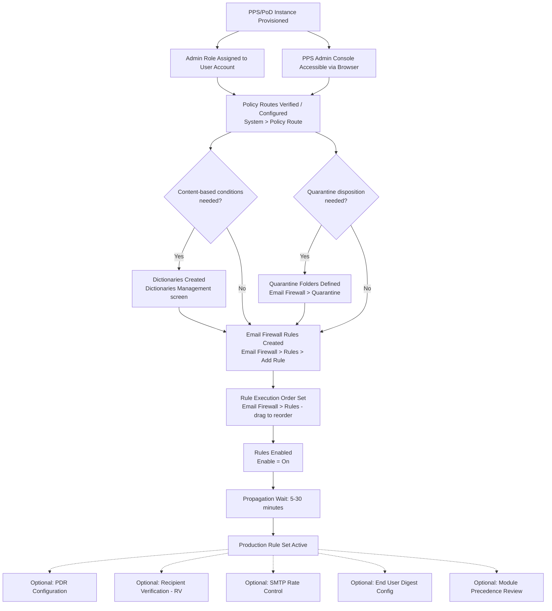

# PPS/PoD Rule Creation and Email Firewall — Prerequisites

> Product: Proofpoint Protection Server (PPS) / Proofpoint on Demand (PoD) 8.22.x
> Evidence base: B [S2], C [V2, V3, S16], D [community]

---

## Dependency Graph

---

## Configuration Order

### 1. PPS/PoD Instance Provisioned (~variable — infrastructure team)

**What it is:** The PPS on-premises appliance or PoD cloud tenant must be provisioned and network-reachable before any admin configuration is possible.

**What to configure:** Network access, MX record pointing to PPS/PoD, SMTP relay configuration. This is typically handled by the infrastructure or Proofpoint implementation team.

**Minimum viable config:** PPS appliance is reachable via browser; SMTP is flowing through it; admin console login is functional.

**Evidence:** U — ASSUMPTION (infrastructure prerequisite, not documented in corpus)

---

### 2. Admin Role Assigned to User Account (~5 minutes)

**What it is:** The configuring user must have an administrative role in the PPS console to access Email Firewall > Rules, System > Policy Route, and quarantine management.

**What to configure:** User account role assignment in PPS user management.

**Minimum viable config:** Account with administrative access to Email Firewall and System configuration sections.

**Evidence:** B [S2] — training documentation implies admin role; exact role name and assignment screen INCOMPLETE

---

### 3. Policy Routes Verified or Configured (~5–10 minutes)

**Capability:** Policy Route Configuration (sub-capability 2.1)
**Workflow:** [pps-rules/workflow.md](workflow.md) — Step 1
**Navigate to:** System > Policy Route

**What to configure:** Verify that `default_inbound` and `default_outbound` routes exist (they are pre-configured in standard PPS deployments). If your organization uses custom route names, document the exact names before creating Firewall rules.

**Minimum viable config:** At least one inbound policy route exists with a known name. Email Firewall rules will reference this name in their Route condition.

**Why it's prerequisite:** Firewall rules without an explicit Route condition fire on ALL routes including outbound relay. Without knowing the exact route name, you cannot correctly scope inbound protection rules.

**Evidence:** B [S2], C [V3 ~0:45]

---

### 4a. Dictionaries Created (conditional — ~15–30 minutes per dictionary)

**Capability:** Dictionary Management (sub-capability 2.7)
**Workflow:** [pps-rules/advanced.md](advanced.md) — Section 2.7

**What to configure:** Create keyword/phrase dictionaries in the Dictionaries management screen. Dictionary names will be referenced in Firewall rule conditions.

**Minimum viable config:** One dictionary containing the keyword list for the planned content-based condition.

**Required only if:** Your planned Firewall rules will use content/keyword matching conditions that reference dictionary objects. Rules using only connection-level conditions (route, sender IP, sender address) do not require dictionaries.

**Evidence:** B [S2]

**INCOMPLETE:** Navigation path for dictionary creation is not documented in accessible sources.

---

### 4b. Quarantine Folders Defined (conditional — ~5–10 minutes per folder)

**Capability:** Quarantine Folder Management (sub-capability 2.4)
**Workflow:** [pps-rules/advanced.md](advanced.md) — Section 2.4

**What to configure:** Create named quarantine folders that rule dispositions will reference. Assign each folder to the appropriate module type (spam, virus, content/DLP, firewall).

**Minimum viable config:** One quarantine folder with a descriptive name that matches your intended use (e.g., `email-firewall-inbound-block`).

**Required only if:** Any of your planned Firewall rules will use Quarantine as their disposition. Rules with Deliver Now or Discard dispositions do not require pre-created folders.

**Critical constraint:** Quarantine folders must exist before being referenced in a rule disposition. Referencing a non-existent folder causes silent disposition failure.

**Evidence:** B [S2], C [S16]

---

### 5. Email Firewall Rules Created (~10–20 minutes per rule)

**Capability:** Email Firewall Rule Creation (sub-capability 2.2) and Rule Conditions Configuration (2.3) and Disposition Type Selection (2.5)
**Workflow:** [pps-rules/workflow.md](workflow.md) — Steps 3–5
**Navigate to:** Email Firewall > Rules > Add Rule

**What to configure:**
- Rule ID (unique alphanumeric)
- Route condition (set to inbound route name from Step 3)
- Additional conditions as required by your policy
- Disposition (Deliver Now, Quarantine with folder reference, or Discard)
- Enable = Off (test before enabling)

**Minimum viable config:** Rule ID + Route condition + at least one policy-relevant condition + Disposition.

**Evidence:** B [S2], C [V2 ~1:00 to ~2:30]

---

### 6. Rule Execution Order Set (~5 minutes)

**Workflow:** [pps-rules/workflow.md](workflow.md) — Step 4
**Navigate to:** Email Firewall > Rules (list view)

**What to configure:** Drag rules to the correct execution position. Rules fire from top to bottom. Allow-list rules for trusted senders should typically be positioned above broad content-blocking rules. DLP/security rules should be positioned before general allow-list releases if DLP compliance is required.

**Minimum viable config:** New rule is in a position where it fires in the correct order relative to existing rules.

**Evidence:** C [V9 ~0:30]

---

### 7. Rules Enabled (~2 minutes)

**Workflow:** [pps-rules/workflow.md](workflow.md) — Step 5
**Navigate to:** Email Firewall > Rules (list view)

Set **Enable = On** for each rule ready for production use.

**After enabling:** Wait 5–30 minutes before testing. Rule changes are not instantaneous.

**Evidence:** C [V2 ~0:30, ~3:00]

---

### Optional: Supporting Sub-Capabilities

These sub-capabilities enhance the Email Firewall pipeline but are not blocking prerequisites for creating basic firewall rules:

| Sub-capability | Time Estimate | Prerequisite For | Navigation | Evidence |
|---------------|--------------|-----------------|-----------|---------|
| Module Precedence Review (2.8) | 15–30 min | Correct ordering of spam, virus, DLP, firewall modules | INCOMPLETE | B [S2] |
| PDR Configuration (2.9) | 15–30 min | IP reputation-based connection blocking | INCOMPLETE | B [S2] |
| Recipient Verification Setup (2.10) | 30–60 min (requires LDAP integration) | Directory harvest attack prevention | INCOMPLETE | B [S2] |
| SMTP Rate Control (2.11) | 10–15 min | Flood attack mitigation | INCOMPLETE | B [S2] |
| End User Digest Configuration (2.12) | 15–30 min | End user quarantine self-service | INCOMPLETE | B [S2] |
| Custom Spam Rules (2.6) | 20–40 min | Targeted spam classification beyond threshold | INCOMPLETE | B [S2] |

---

## Total Time Estimate

| Step | Min | Max | Notes |
|------|-----|-----|-------|
| Instance provisioning | N/A | N/A | Infrastructure team; outside admin workflow |
| Admin role assignment | 5 min | 15 min | Depends on user management complexity |
| Policy route verification | 5 min | 10 min | Typically pre-configured |
| Dictionaries (if needed) | 15 min | 60 min per dictionary | Depends on term list size |
| Quarantine folders (if needed) | 5 min | 15 min | Simple creation step |
| Rule creation (per rule) | 10 min | 20 min | Assumes conditions are known |
| Execution order | 5 min | 10 min | |
| Enable + propagation wait | 5 min + 30 min | 5 min + 30 min | Wait is fixed regardless of rule count |

**Estimated total for first production rule (with quarantine disposition, no content conditions):**
55–110 minutes (including propagation wait)

**Estimated total for content-based rule (with new dictionary):**
80–160 minutes (including dictionary creation and propagation wait)
