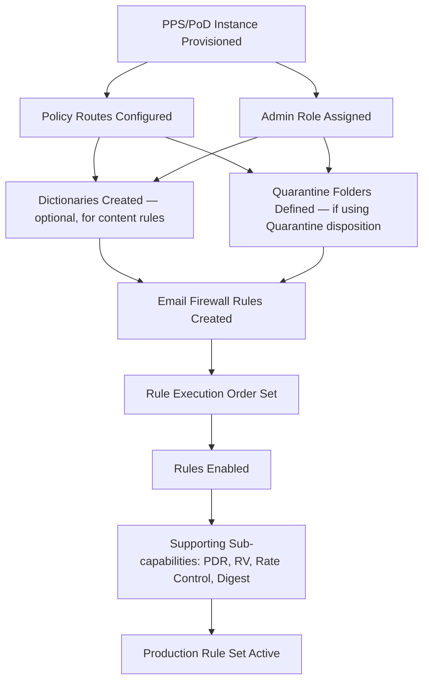
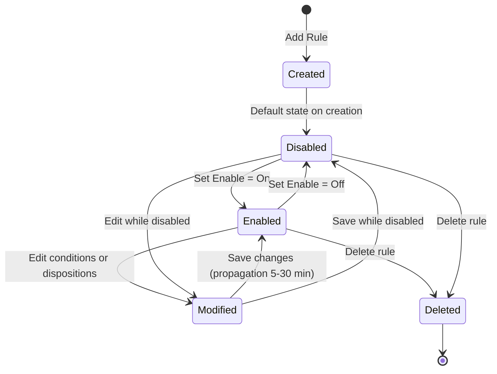
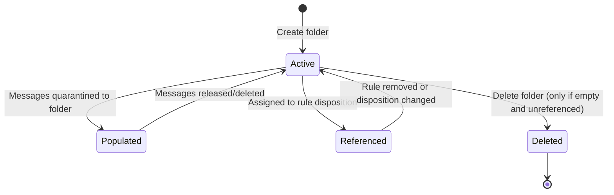
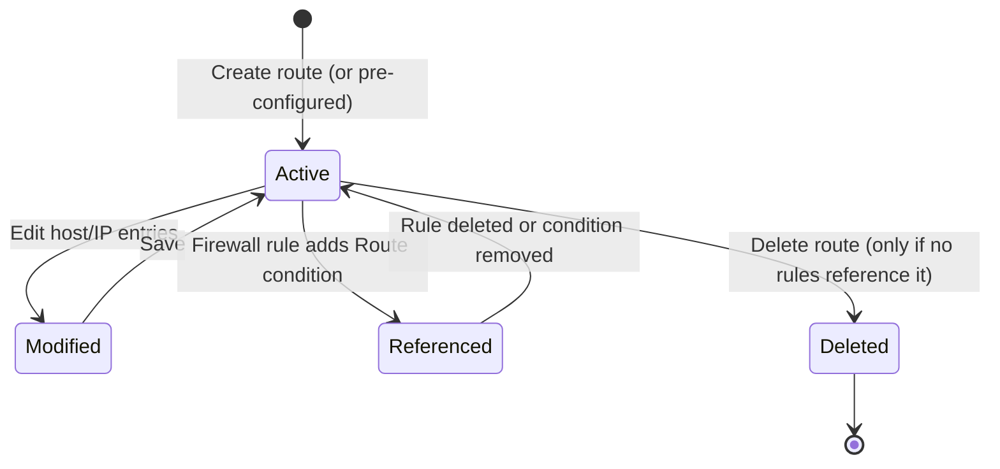

# PPS/PoD Rule Creation and Email Firewall — Workflow Reference

> Capability: pps-rules | Generated: 2026-05-21
> Product: Proofpoint Protection Server (PPS) / Proofpoint on Demand (PoD) 8.22.x
> Evidence base: 2 Grade A sources, 6 Grade B sources, 3 Grade C sources, 3 Grade D sources

---

## Overview

PPS/PoD Rule Creation and Email Firewall is the core policy authoring capability for Proofpoint Protection Server and Proofpoint on Demand deployments. It controls how email messages are accepted, classified, and acted upon at the MTA gateway layer. The Email Firewall processes connections and messages through a pipeline of modules (spam, virus, DLP, firewall rules) in a defined precedence order, with each module applying conditions to determine dispositions. Policy Routes define the logical traffic lanes (inbound, outbound, relay) that Firewall rules reference to scope their actions correctly.

This capability is architecturally distinct from Proofpoint Essentials Filter Policies — it operates at the SMTP/gateway layer on the PPS on-premises appliance or PoD cloud console, uses a dedicated Email Firewall module separate from content-filtering modules, and provides sub-capabilities including Dynamic Reputation (PDR), Recipient Verification (RV), SMTP Rate Control, and End User Digest configuration that have no direct Essentials equivalents.

**Complexity:** COMPLEX — 12 sub-capabilities, multi-module pipeline with defined precedence, prerequisite of Policy Routes before Firewall Rule creation, extensive condition type vocabulary, and quarantine folder hierarchy all contribute.
**Prerequisite chain length:** 3 steps (policy routes → dictionaries/conditions → firewall rules)
**Total configurable fields:** 40+ (estimated; complete field enumeration requires authenticated admin guide access — see evidence notes)
**Screens involved:** 8+ (confirmed from video and training evidence; exact count INCOMPLETE)
**Evidence base:** 0 Grade A sources for PPS-specific field-level detail, 1 Grade B training source [S2], 3 Grade C sources [S16, S20, video intelligence V2, V3], 3 Grade D sources; substantial field-level detail is INCOMPLETE due to admin guide authentication wall

**IMPORTANT COVERAGE NOTE:** The Proofpoint PPS/PoD admin guide requires authentication. All PPS-specific field names, exact screen layouts, and complete option enumerations are sourced from Grade B training materials [S2] and Grade C vendor training videos [V2, V3]. Any field marked `UNKNOWN — auth wall` requires verification against the authenticated PPS admin guide. Sections marked INCOMPLETE follow the anti-rationalization protocol: known gaps are stated explicitly rather than silently omitted.

---

## Screen Hierarchy

```yaml
# Screen hierarchy for PPS/PoD Rule Creation and Email Firewall
# Source grades: B [S2], C [V2, V3], E inferred from XSOAR integration [S16]
# INCOMPLETE: sub-tab detail for most screens requires authenticated admin guide

screens:
  - screen:
      name: "System > Policy Routes"
      navigation: "PPS Admin Console > System (top navigation) > Policy Route (left menu)"
      parent: null
      type: page
      description: >
        Lists all defined policy routes. Policy routes define the logical mail flow
        lanes (inbound, outbound, relay). Email Firewall rules reference routes
        via the Route condition — rules scoped to the wrong route fire on
        unintended traffic.
      evidence: "B [S2], C [V3 ~0:45]"
      fields:
        - name: "Route Name"
          type: text
          required: true
          default: "default_inbound (pre-configured), default_outbound (pre-configured)"
          options: null
          validation: "Unique string identifier"
          description: "Logical name for the mail flow lane. Pre-configured routes include default_inbound and default_outbound."
          gotcha: "Custom PPS deployments may have renamed or added routes. Firewall rules referencing 'default_inbound' will silently not fire if the org renamed that route."
          source: "B [S2], C [V3 ~0:45]"
        - name: "Host/IP"
          type: text
          required: false
          default: null
          options: null
          validation: "FQDN or IP address"
          description: "Next-hop relay host assigned to this route. Used for policy-based email routing."
          gotcha: "INCOMPLETE — full host configuration fields not documented in accessible sources"
          source: "C [V3 ~1:30]"
      actions:
        - name: "Add Host"
          type: button
          result: "Adds a next-hop host entry to the selected route"
        - name: "Save"
          type: button
          result: "Saves route configuration"
      prerequisites:
        - "PPS/PoD instance provisioned and accessible"
        - "Admin role assigned"

  - screen:
      name: "Email Firewall > Rules"
      navigation: "PPS Admin Console > Email Firewall (left navigation) > Rules"
      parent: null
      type: page
      description: >
        Master list of Email Firewall rules. Rules appear in a ranked list;
        execution order follows the visual list order (top to bottom), NOT the
        rule ID number. Dragging rules in this list changes actual firing order.
      evidence: "B [S2], C [V2 ~0:30, S20]"
      fields:
        - name: "Rule Enable/Disable"
          type: radio
          required: true
          default: "Off (new rules are Off by default)"
          options: ["On", "Off"]
          validation: null
          description: "Activates or deactivates the rule without deleting it."
          gotcha: "The anti-spoof rule ships disabled by default and must be explicitly enabled. New rules also default to Off."
          source: "C [V2 ~0:30], D [community article]"
      actions:
        - name: "Add Rule"
          type: button
          result: "Opens Rule creation form"
        - name: "Drag to reorder"
          type: drag
          result: "Changes rule execution order; order is positional, not by rule ID"
      prerequisites:
        - "At least one Policy Route defined (system pre-configures default_inbound and default_outbound)"

  - screen:
      name: "Email Firewall > Rules > Add Rule (Rule Detail)"
      navigation: "PPS Admin Console > Email Firewall > Rules > Add Rule"
      parent: "Email Firewall > Rules"
      type: page
      description: >
        Rule creation and editing form. Contains Rule ID, Conditions section,
        and Dispositions section. Conditions determine when the rule fires;
        Dispositions determine what action is applied.
      evidence: "B [S2], C [V2 ~1:00 to ~2:30]"
      fields:
        - name: "Rule ID"
          type: text
          required: true
          default: null
          options: null
          validation: "Alphanumeric, unique within the rule list"
          description: "Internal identifier for the rule. Referenced in logs and XSOAR API calls."
          gotcha: "Rule ID is not the execution order. Visual position in the rules list determines order."
          source: "C [V2 ~1:00]"
        - name: "Enable"
          type: radio
          required: true
          default: "Off"
          options: ["On", "Off"]
          validation: null
          description: "Rule active state at creation."
          gotcha: null
          source: "C [V2 ~0:30]"
      prerequisites:
        - "Email Firewall > Rules screen accessible"

  - screen:
      name: "Email Firewall > Rules > Rule Detail > Conditions"
      navigation: "PPS Admin Console > Email Firewall > Rules > [Rule] > Conditions section"
      parent: "Email Firewall > Rules > Add Rule (Rule Detail)"
      type: tab
      description: >
        Conditions define the criteria a message must match for the rule to fire.
        Multiple conditions combine with AND logic. The Route condition is
        critical — omitting it causes the rule to apply to ALL routes including
        outbound relay traffic.
      evidence: "B [S2], C [V2 ~2:00]"
      fields:
        - name: "Add Condition (button)"
          type: button
          required: false
          default: null
          options: null
          validation: null
          description: "Adds a new condition row to the rule."
          gotcha: null
          source: "C [V2 ~1:00]"
        - name: "Route (condition type)"
          type: dropdown
          required: false
          default: null
          options: ["default_inbound", "default_outbound", "<custom route names>"]
          validation: null
          description: "Scopes the rule to a specific mail flow lane. CRITICAL: omitting this condition applies the rule to all routes."
          gotcha: "Leaving Route condition blank applies the rule to all policy routes including outbound. This is the most common PPS firewall misconfiguration. Always add a Route condition explicitly."
          source: "C [V2 ~2:00]"
        - name: "Condition Type"
          type: dropdown
          required: true
          default: null
          options: ["Route", "ADDITIONAL TYPES INCOMPLETE — not enumerated in accessible sources"]
          validation: null
          description: "Determines the attribute being evaluated (sender, recipient, IP, content, etc.)."
          gotcha: "INCOMPLETE — full condition type list requires authenticated PPS admin guide."
          source: "B [S2], C [V2]"
        - name: "Condition Value / Pattern"
          type: text
          required: true
          default: null
          options: null
          validation: "Type-dependent (IP range, email pattern, dictionary reference, regex)"
          description: "The value to match against the selected condition type."
          gotcha: "INCOMPLETE — exact syntax for each condition type not documented in accessible sources."
          source: "B [S2]"
      decision_points:
        - condition: "Route condition omitted"
          effect: "Rule fires on ALL policy routes including outbound relay"
        - condition: "Multiple conditions added"
          effect: "All conditions must match (AND logic assumed; OR logic availability UNKNOWN — auth wall)"

  - screen:
      name: "Email Firewall > Rules > Rule Detail > Dispositions"
      navigation: "PPS Admin Console > Email Firewall > Rules > [Rule] > Dispositions section"
      parent: "Email Firewall > Rules > Add Rule (Rule Detail)"
      type: tab
      description: >
        Dispositions define what happens to a message that matches the rule's
        conditions. Delivery Method is the primary disposition field.
      evidence: "B [S2], C [V2 ~2:30]"
      fields:
        - name: "Delivery Method"
          type: dropdown
          required: true
          default: null
          options: ["Deliver Now", "Quarantine", "Discard", "ADDITIONAL OPTIONS INCOMPLETE — auth wall"]
          validation: null
          description: "Primary action applied to matching messages."
          gotcha: "INCOMPLETE — full disposition type list not enumerated in accessible sources beyond training outline."
          source: "C [V2 ~2:30], B [S2]"
        - name: "Quarantine Folder"
          type: dropdown
          required: false
          default: null
          options: ["INCOMPLETE — folder names are deployment-specific; configured separately"]
          validation: null
          description: "Target quarantine folder when Delivery Method = Quarantine. Must be pre-created."
          gotcha: "Quarantine folders must exist before being referenced in a disposition. Referencing a non-existent folder causes silent disposition failures."
          source: "B [S2], C [S16 XSOAR integration]"
          conditional: "Visible only when Delivery Method = Quarantine"
      decision_points:
        - condition: "Delivery Method = Quarantine"
          effect: "Quarantine Folder field becomes required; folder must pre-exist"
        - condition: "Delivery Method = Deliver Now"
          effect: "Message bypasses further processing for this rule and is delivered"

  - screen:
      name: "Email Firewall > Quarantine Folders"
      navigation: "PPS Admin Console > Email Firewall > [Quarantine management section]"
      parent: null
      type: page
      description: >
        Manages quarantine folder definitions. Folders are named containers that
        hold quarantined messages. Accessible via XSOAR API commands for
        programmatic quarantine management. Folder types correspond to filtering
        modules (spam, virus, content/DLP, firewall).
      evidence: "B [S2], C [S16 XSOAR integration]"
      fields:
        - name: "Folder Name"
          type: text
          required: true
          default: null
          options: null
          validation: "Unique string"
          description: "Identifier for the quarantine folder, referenced by rules and API operations."
          gotcha: "Messages can only be moved between folders of the same module type (spam quarantine to spam quarantine; content quarantine to content quarantine). Cross-module moves are blocked."
          source: "C [S16]"
        - name: "Folder Type"
          type: dropdown
          required: true
          default: null
          options: ["INCOMPLETE — module types not enumerated in accessible sources"]
          validation: null
          description: "Associates the folder with a specific filtering module."
          gotcha: "INCOMPLETE — exact folder type options require authenticated admin guide."
          source: "B [S2]"
      actions:
        - name: "proofpoint-pps-quarantine-message-move (API)"
          type: api_command
          result: "Moves a quarantined message between folders of the same module type"
        - name: "proofpoint-pps-quarantine-message-release (API)"
          type: api_command
          result: "Releases message without further scanning"
        - name: "proofpoint-pps-quarantine-message-resubmit (API)"
          type: api_command
          result: "Reprocesses message through filtering modules"
      prerequisites:
        - "Admin role with quarantine management access"

  - screen:
      name: "Dictionaries Management"
      navigation: "INCOMPLETE — exact navigation path not documented in accessible sources"
      parent: null
      type: page
      description: >
        Word/phrase lists used in rule conditions. Dictionaries enable content-based
        matching without writing individual string conditions for each term.
        Referenced in Email Firewall rule conditions and spam/DLP module rules.
      evidence: "B [S2]"
      fields:
        - name: "Dictionary Name"
          type: text
          required: true
          default: null
          options: null
          validation: "Unique string"
          description: "Name for the dictionary, referenced in conditions."
          gotcha: "INCOMPLETE — dictionary creation UI and import format not documented in accessible sources."
          source: "B [S2]"
        - name: "Terms/Phrases"
          type: textarea
          required: true
          default: null
          options: null
          validation: "INCOMPLETE — max term count and encoding requirements not documented"
          description: "The keyword or phrase list entries."
          gotcha: "INCOMPLETE — term weighting, case sensitivity settings, and proximity rules not documented."
          source: "B [S2]"

  - screen:
      name: "Email Firewall > Module Precedence"
      navigation: "INCOMPLETE — exact path not documented; likely under Email Firewall or System settings"
      parent: null
      type: page
      description: >
        Controls the order in which filtering modules process messages. Module
        processing order determines which module's actions take priority when
        multiple modules match the same message. Training documentation
        references both Module Precedence and Delivery Precedence as distinct
        configurable areas.
      evidence: "B [S2]"
      fields:
        - name: "Module Order"
          type: "drag_or_number"
          required: false
          default: "UNKNOWN — default module order not documented in accessible sources"
          options: ["Spam module", "Virus module", "DLP/Content module", "Email Firewall module", "ADDITIONAL MODULES UNKNOWN"]
          validation: null
          description: "Positional order of filtering module execution."
          gotcha: "INCOMPLETE — exact modules, their names, and default ordering not enumerated in accessible sources. Misconfiguring module order can cause DLP rules to evaluate after firewall allow-rules have already released messages."
          source: "B [S2]"

  - screen:
      name: "Email Firewall > PDR Configuration (Proofpoint Dynamic Reputation)"
      navigation: "INCOMPLETE — exact navigation path not documented"
      parent: null
      type: page
      description: >
        Proofpoint Dynamic Reputation provides real-time IP reputation scoring
        for inbound connections. PDR evaluates sending IP against Proofpoint's
        global threat intelligence. Configuration controls sensitivity thresholds
        and exception lists.
      evidence: "B [S2]"
      fields:
        - name: "PDR Enable/Disable"
          type: toggle
          required: false
          default: "UNKNOWN"
          options: ["Enabled", "Disabled"]
          validation: null
          description: "Activates real-time IP reputation checking."
          gotcha: "INCOMPLETE — PDR configuration fields not documented in accessible sources."
          source: "B [S2]"

  - screen:
      name: "Email Firewall > Recipient Verification (RV)"
      navigation: "INCOMPLETE — exact navigation path not documented"
      parent: null
      type: page
      description: >
        Validates that recipient addresses exist in the downstream mail system
        before accepting the message at the SMTP gateway. Prevents directory
        harvest attacks and reduces load on downstream mail servers.
      evidence: "B [S2]"
      fields:
        - name: "RV Enable/Disable"
          type: toggle
          required: false
          default: "UNKNOWN"
          options: ["Enabled", "Disabled"]
          validation: null
          description: "Activates recipient address validation against downstream directory."
          gotcha: "INCOMPLETE — RV configuration fields, LDAP integration options, and error handling behavior not documented in accessible sources."
          source: "B [S2]"

  - screen:
      name: "Email Firewall > SMTP Rate Control"
      navigation: "INCOMPLETE — exact navigation path not documented"
      parent: null
      type: page
      description: >
        Limits the rate of SMTP connections or messages accepted from sending
        IPs to mitigate flood attacks and spam bursts.
      evidence: "B [S2]"
      fields:
        - name: "Rate Limit (connections/messages per period)"
          type: number
          required: false
          default: "UNKNOWN"
          options: null
          validation: "INCOMPLETE"
          description: "Maximum connection or message rate per source IP."
          gotcha: "INCOMPLETE — rate limit fields, periods, and exception list configuration not documented in accessible sources."
          source: "B [S2]"

  - screen:
      name: "Email Firewall > End User Digest Configuration"
      navigation: "INCOMPLETE — exact path not documented; may overlap with Quarantine settings"
      parent: null
      type: page
      description: >
        Controls end user quarantine digest emails — periodic summaries of
        quarantined messages sent to recipients so they can self-release safe mail.
        Digest frequency, format, and included quarantine categories are configurable.
      evidence: "B [S2]"
      fields:
        - name: "Digest Frequency"
          type: dropdown
          required: false
          default: "UNKNOWN"
          options: ["INCOMPLETE — frequency options not enumerated in accessible sources"]
          validation: null
          description: "How often digest emails are sent to end users."
          gotcha: "INCOMPLETE — full digest configuration including template customization, language settings, and per-user opt-out behavior not documented in accessible sources."
          source: "B [S2]"
```

---

## Step-by-Step Walkthrough

### Step 1: Verify or Create Policy Routes

**Navigate to:** PPS Admin Console > System (top navigation) > Policy Route (left menu)
**Screen:** System > Policy Routes
**Purpose:** Policy Routes define the mail flow lanes that Email Firewall rules reference. Rules without an explicit Route condition apply to ALL routes including outbound. Most deployments use pre-configured `default_inbound` and `default_outbound` routes; custom environments may have renamed them.

| Field | Type | Required | Default | Description | Source |
|-------|------|----------|---------|-------------|--------|
| Route Name | text | Yes | `default_inbound`, `default_outbound` (pre-configured) | Unique identifier for the mail flow lane | B [S2], C [V3 ~0:45] |
| Host/IP | text | No | null | Next-hop relay host for policy-based routing | C [V3 ~1:30] |

**Decision point:** If the target environment uses a renamed or custom inbound route, note the exact route name before creating Firewall rules. All rule conditions referencing `default_inbound` must use the environment's actual route name.

**Evidence:** B [S2], C [V3 ~0:45, ~1:30]

---

### Step 2: Create or Import Dictionaries (if using content-based conditions)

**Navigate to:** INCOMPLETE — exact path not documented in accessible sources
**Screen:** Dictionaries Management
**Purpose:** Dictionaries are prerequisite objects for rules that use keyword/phrase content matching. If the planned rules only use connection-level conditions (sender IP, route, sender domain), dictionaries are optional. For DLP-style firewall rules detecting specific terms in message content, dictionaries must be created before the rule condition that references them.

| Field | Type | Required | Default | Description | Source |
|-------|------|----------|---------|-------------|--------|
| Dictionary Name | text | Yes | null | Unique identifier referenced in conditions | B [S2] |
| Terms/Phrases | textarea | Yes | null | Keyword or phrase entries | B [S2] |

**INCOMPLETE:** Full dictionary creation workflow (import format, term weighting, case sensitivity) not documented in accessible sources. Requires authenticated PPS admin guide.

---

### Step 3: Create an Email Firewall Rule

**Navigate to:** PPS Admin Console > Email Firewall > Rules > Add Rule
**Screen:** Email Firewall > Rules > Add Rule (Rule Detail)
**Purpose:** Creates the rule that evaluates matching conditions and applies a disposition to matched messages.

#### 3a: Rule Header Fields

| Field | Type | Required | Default | Description | Source |
|-------|------|----------|---------|-------------|--------|
| Rule ID | text | Yes | null | Alphanumeric unique identifier; appears in logs and API results | C [V2 ~1:00] |
| Enable | radio | Yes | Off | Rule must be explicitly enabled after creation | C [V2 ~0:30] |

#### 3b: Add Conditions

| Field | Type | Required | Default | Description | Source |
|-------|------|----------|---------|-------------|--------|
| Route | dropdown | **Strongly recommended** | null | Scopes rule to specific mail flow lane; omit = applies to all routes | C [V2 ~2:00] |
| Condition Type | dropdown | Yes | null | Type of message attribute to evaluate | B [S2], C [V2] |
| Condition Value | text/dropdown | Yes | null | Value or pattern to match | B [S2] |

**Decision point — Route condition:**

| Choice | Default | Effect | Recommended |
|--------|---------|--------|-------------|
| Set Route = default_inbound | No default — must be explicitly added | Rule fires only on inbound mail | YES — for inbound protection rules |
| Set Route = default_outbound | No default | Rule fires only on outbound mail | YES — for DLP/encryption outbound rules |
| Omit Route condition | Rule fires on ALL routes | Applies to all traffic including outbound relay | ONLY for rules intentionally spanning all routes |

#### 3c: Add Dispositions

| Field | Type | Required | Default | Description | Source |
|-------|------|----------|---------|-------------|--------|
| Delivery Method | dropdown | Yes | null | Primary action: Deliver Now, Quarantine, Discard (additional options INCOMPLETE) | C [V2 ~2:30], B [S2] |
| Quarantine Folder | dropdown | Conditional | null | Required when Delivery Method = Quarantine; folder must pre-exist | B [S2], C [S16] |

---

### Step 4: Set Rule Execution Order

**Navigate to:** PPS Admin Console > Email Firewall > Rules
**Screen:** Email Firewall > Rules (list view)
**Purpose:** Rule execution order is determined by the visual position in the rules list, NOT by Rule ID. To change execution order, drag rules to the correct position.

**Decision point — execution order:**

| Approach | Effect | Source |
|----------|--------|--------|
| Allow-list rule above content rules | Allow-listed senders bypass all subsequent content checks | C [V9 ~0:30] |
| DLP/content rules above general allow | DLP checks apply to all mail including allow-listed senders | C [V9 ~0:30] |
| Anti-spoof rule position | Must be early enough to evaluate before allow-list rules release mail | D [community] |

---

### Step 5: Enable the Rule

**Navigate to:** PPS Admin Console > Email Firewall > Rules > [select rule] > Enable toggle
**Screen:** Email Firewall > Rules
**Purpose:** New rules default to Off. The rule does not evaluate any mail until explicitly set to On.

After enabling, allow 5–30 minutes for propagation before testing. Testing immediately after enabling will produce false negatives.

**Evidence:** C [V2 ~3:00]

---

### Step 6: Configure Supporting Sub-Capabilities (Optional but Recommended)

The following sub-capabilities enhance the Email Firewall pipeline. They are independent of individual rule creation but should be configured before full production deployment:

#### 6a: Proofpoint Dynamic Reputation (PDR)
**Navigate to:** INCOMPLETE — path not documented
**Purpose:** Adds real-time IP reputation scoring to inbound connection evaluation.
**Evidence:** B [S2]
**INCOMPLETE:** Configuration fields not accessible in current source corpus.

#### 6b: Recipient Verification (RV)
**Navigate to:** INCOMPLETE — path not documented
**Purpose:** Validates recipient addresses exist before accepting mail at SMTP layer. Prevents directory harvest attacks.
**Evidence:** B [S2]
**INCOMPLETE:** Configuration fields not accessible.

#### 6c: SMTP Rate Control
**Navigate to:** INCOMPLETE — path not documented
**Purpose:** Limits connection rates from sending IPs.
**Evidence:** B [S2]
**INCOMPLETE:** Rate limit field details not accessible.

#### 6d: End User Digest
**Navigate to:** INCOMPLETE — path not documented
**Purpose:** Sends periodic quarantine digest emails so end users can self-release safe mail.
**Evidence:** B [S2]
**INCOMPLETE:** Digest configuration fields not accessible.

#### 6e: Module Precedence
**Navigate to:** INCOMPLETE — path not documented
**Purpose:** Controls the order in which filtering modules (spam, virus, content/DLP, firewall) process messages. Affects which module's actions take precedence when multiple modules match.
**Evidence:** B [S2]
**INCOMPLETE:** Module names and default ordering not enumerated in accessible sources.

---

## Dependency Graph



### Prerequisite Chain (Ordered)

1. **PPS/PoD Instance Provisioned** — created by: infrastructure/provisioning team — no admin-configurable prerequisites
2. **Admin Role Assigned** — created at: User Management (PPS admin console) — requires: PPS instance
3. **Policy Routes Configured** — created at: System > Policy Route — requires: [PPS instance, Admin role] — note: default_inbound and default_outbound are pre-configured; custom routes require explicit creation
4. **Dictionaries Created** (conditional) — created at: Dictionaries Management screen — requires: [Admin role] — only needed for content-based matching conditions
5. **Quarantine Folders Defined** (conditional) — created at: Email Firewall > Quarantine management — requires: [Admin role] — only needed if disposition = Quarantine
6. **Email Firewall Rules Created** — created at: Email Firewall > Rules > Add Rule — requires: [Policy Routes, Dictionaries (if used), Quarantine Folders (if used)]
7. **Rule Execution Order Set** — action at: Email Firewall > Rules list — requires: [Rules Created]
8. **Rules Enabled** — action at: Email Firewall > Rules list — requires: [Rule Execution Order Set]

---

## Decision Points

| Screen | Decision | Options | Default | Implications | Recommended | Why | Source |
|--------|----------|---------|---------|-------------|-------------|-----|--------|
| Email Firewall > Rules > Conditions | Include Route condition | Set to specific route vs. omit | No default (field is optional) | Omitting applies rule to ALL routes including outbound relay | YES — always set Route | Prevents outbound mail from being processed by inbound protection rules | C [V2 ~2:00] |
| Email Firewall > Rules > Dispositions | Delivery Method | Deliver Now, Quarantine, Discard (additional options INCOMPLETE) | null | Determines message fate; Quarantine requires pre-existing folder | Quarantine for security rules; Deliver Now for explicit allow rules | Industry best practice | C [V2 ~2:30], B [S2] |
| Email Firewall > Rules list | Rule execution order | Positional (drag to reorder) | Creation order | Higher-position rules (closer to top) fire first | Place most specific allow-rules above general blocks; DLP rules before allow-list releases | Prevents allow-lists from suppressing security checks | C [V9 ~0:30] |
| Email Firewall > Rules | Enable new rule immediately vs. test first | Enable On vs. leave Off | Off | Enabling immediately in production risks mail disruption if conditions are too broad | Leave Off; test on test mailbox first; enable after validation | Test-first reduces production disruption | B [S2], C [V2] |
| Email Firewall > Rules > Conditions | Custom Spam Rules vs. built-in spam module | Add custom spam rule in firewall vs. tune spam module threshold | Use spam module for threshold tuning | Custom spam rules in firewall are additive; spam module runs independently | Use spam module threshold for general tuning; use custom firewall rules for targeted overrides | Two systems are independent; misconfiguring one does not affect the other | B [S2] |

---

## Object Lifecycle

### Email Firewall Rule



### Quarantine Folder



### Policy Route



---

## Integration Touchpoints

| Capability | Relationship | Direction | Notes | Source |
|-----------|-------------|-----------|-------|--------|
| [Spam Policy Configuration](../spam-policy/workflow.md) | Email Firewall rules and spam module are independent subsystems in the filtering pipeline | Parallel | Spam module threshold tuning does not affect Email Firewall rules; both must be configured independently | B [S2], C [V21 ~1:00] |
| [Quarantine Management](../quarantine-management/workflow.md) | Email Firewall rules reference quarantine folders; quarantine API commands manage folder contents | Outbound from Email Firewall | Quarantine folders must be created in quarantine management before firewall rules can reference them | B [S2], C [S16] |
| [DLP Policies / Content Filtering](../dlp-policies/workflow.md) | Email Firewall module evaluates in pipeline alongside DLP/content modules; module precedence controls which fires first | Sibling | Module Precedence setting determines relative order; if DLP module runs AFTER a firewall Deliver Now disposition, DLP check is bypassed | B [S2] |
| [Email Encryption](../email-encryption/workflow.md) | Proofpoint Email Firewall is one component of the Enterprise Privacy Suite alongside Proofpoint Encryption | Upstream | Firewall detects sensitive content; Encryption component applies encryption policy | B [S14] |
| [PPS API / XSOAR Integration](../api-management/workflow.md) | XSOAR integration commands provide programmatic quarantine management for Email Firewall quarantine folders | Downstream | smart-search, quarantine-list, release, resubmit, forward, move, delete all operate on quarantine output from firewall rules | C [S16] |

---

## Complexity Score

| Dimension | Simple | Moderate | Complex | This Capability |
|-----------|--------|----------|---------|-----------------|
| Fields | 3-5 fields | 10-20 fields | 50+ fields | 40+ estimated across 12 screens → COMPLEX (and incomplete due to auth wall) |
| Screens | 1 screen | 2-3 screens | 4+ screens with sub-tabs | 8+ screens confirmed, 4+ with INCOMPLETE detail → COMPLEX |
| Dependencies | No prerequisites | 1-2 prerequisites | Chain of 3+ prerequisites | 3-step chain (routes → optional dict/quarantine → rules) → COMPLEX |

**Overall Complexity: COMPLEX**

**Justification:** All three dimensions score COMPLEX. The prerequisite chain requires Policy Routes to be confirmed before Firewall rules can be correctly scoped (chain of 3+ steps). Screen count is 8+ with substantial sub-tab structure. Field count is 40+ across 12 sub-capabilities, with many fields INCOMPLETE due to authentication-walled admin guide. The multi-module pipeline with its configurable precedence order adds architectural complexity beyond field count alone. The corpus coverage gap (PPS admin guide behind auth wall) means this complexity estimate is a lower bound — actual field count may be substantially higher.

---

## Sources

| # | Source | Grade | Used For |
|---|--------|-------|----------|
| S2 | Enterprise Protection for the Administrator (Training Datasheet) — PPS (current) | B | Primary source for all PPS-specific concept definitions: policy routes, conditions, quarantine, dispositions, dictionaries, module precedence, PDR, RV, SMTP Rate Control, digest |
| S16 | Proofpoint Protection Server v2 XSOAR Integration — PPS 8.16.2/8.14.2 | C | Quarantine folder operations, API command vocabulary, folder move constraints |
| S20 | Proofpoint Community — Email Firewall Rule (PPS/PoD) KB article | C | Email Firewall rule enable/modify workflow confirmation |
| V2 | Video: How to Enable or Modify Email Firewall Rule — ~5 min, 2018 | B (vendor training) | Rule ID field, Enable radio, Add Condition button, Route condition = default_inbound, Delivery Method = Deliver Now, propagation wait |
| V3 | Video: Policy-Based Email Routing Configuration — ~6 min, 2017 | B (vendor training) | System > Policy Route navigation, Add Host workflow |
| V9 | Video: How to Set Filtering Order in PPS — ~4 min, 2017 | B (vendor training) | Visual order = execution order (not rule ID), drag reorder behavior |
| S14 | Proofpoint Encryption Data Sheet — March 2019 | B | Enterprise Privacy Suite component listing; Email Firewall as DLP detection layer |
| D-community-antispoof | Community article: anti-spoof rule disabled by default in PPS | D | Anti-spoof rule default state; firewall rule default = Off |
| D-community-spam-tuning | Community article: Spam module rules incremental tuning best practice | D | Spam module vs Email Firewall rule independence |
| U-module-precedence | Inferred from training outline structure [S2] | U — ASSUMPTION | Module precedence screen existence; exact modules and names UNKNOWN |
| U-dict-nav | Inferred from [S2] training outline references | U — ASSUMPTION | Dictionary management screen existence; navigation path UNKNOWN |
| U-rv-pdr-nav | Inferred from [S2] training outline and taxonomy | U — ASSUMPTION | PDR, RV, SMTP Rate Control, and Digest screen navigation paths UNKNOWN |
