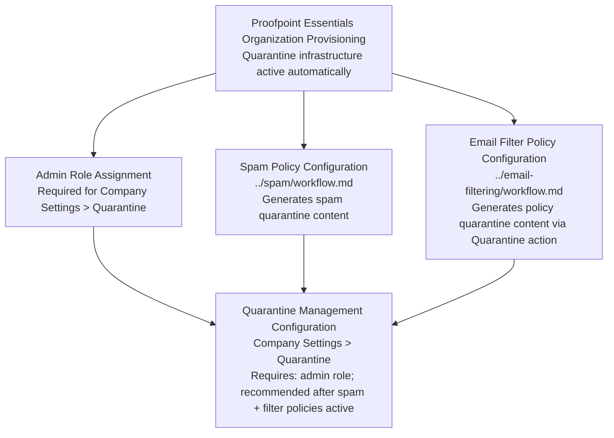

# Quarantine Management — Prerequisites

## Dependency Chain

---

## Configuration Order

### 1. Proofpoint Essentials Organization Provisioning (~0 min — Proofpoint onboarding)

**What to configure:** Nothing. Quarantine infrastructure is active immediately on provisioning.
**Minimum viable config:** Organization tenant exists.
**Source:** [A — S1]

### 2. Admin Role Assignment (~2 min)

**Capability:** User Management
**What to configure:** Assign Organization Admin role to the configuring administrator.
**Source:** [A — S1]

### 3. Spam Policy Configuration (~5 min — recommended before quarantine tuning)

**Capability:** [Spam Policy Configuration](../spam/workflow.md)
**What to configure:** Spam threshold and bulk email quarantine settings.
**Minimum viable config:** Navigate to Security Settings > Email > Spam Settings, accept defaults, save.
**Why required:** Until spam settings are active, the spam quarantine category will be empty and digest testing is not meaningful.
**Source:** [A — S1]

### 4. Email Filter Policy Configuration (~10 min — recommended before quarantine tuning)

**Capability:** [Email Filtering Policies](../email-filtering/workflow.md)
**What to configure:** At least one filter rule with Quarantine action.
**Minimum viable config:** Create one inbound filter rule targeting a test address with Quarantine action.
**Why required:** Until filter policies are active, the policy quarantine category will be empty.
**Source:** [A — S1, D — S17]

### 5. Quarantine Management Configuration (~10 min)

**Ready when:** Steps 1–2 complete (steps 3–4 recommended but not blocking).
**Workflow:** [workflow.md](workflow.md)
**Navigate to:** Company Settings > Quarantine
**What to configure:** Category release permissions, digest settings, retention period.

---

## Total Time Estimate: ~27 minutes (including spam and filter policy prerequisites)

**Note:** Quarantine configuration can be completed before spam and filter policies are active (steps 3–4). The configuration will save correctly, but testing end-to-end requires quarantined messages to exist.
