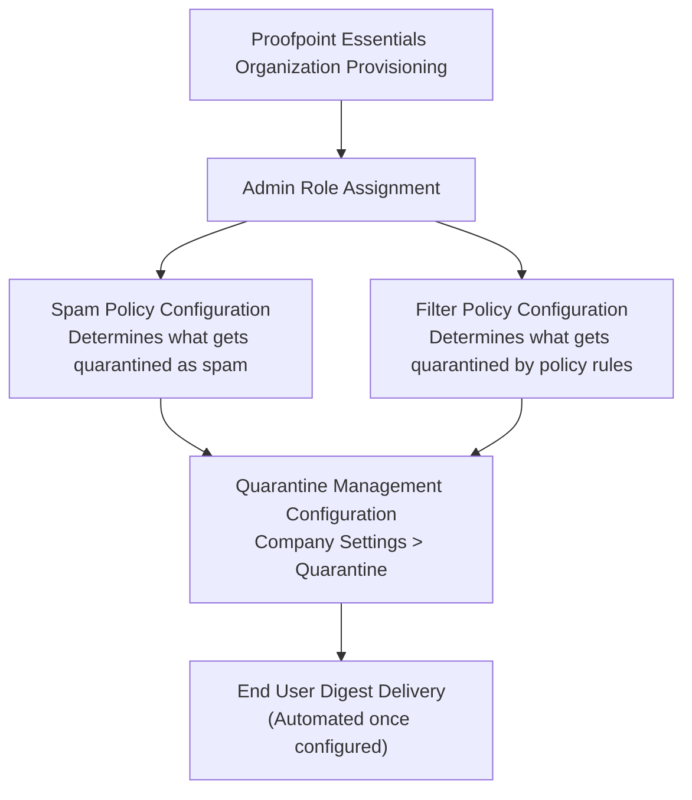

# Quarantine Management — Workflow Reference

> Capability: quarantine | Product: Proofpoint (Essentials + PPS/PoD) | Generated: 2026-05-21
> Taxonomy groups: 14.1–14.6

---

## Overview

Quarantine Management governs how Proofpoint holds, releases, and notifies end users about messages that were not delivered to their inbox. In Proofpoint Essentials, quarantine configuration covers six quarantine categories (spam, virus, adult, policy, bulk, phishing), per-category release permissions, end-user digest notifications, and retention periods. In PPS/PoD, quarantine is folder-based and manageable via UI and REST API. Quarantine configuration is tightly coupled to spam policy (what gets quarantined) and filter policy (what actions send messages to quarantine), but the management configuration itself is a separate administrative surface.

**Complexity:** MODERATE — Multiple screens (quarantine categories, digest config, retention), 14+ configurable fields, dependency on spam and filter policies being active to generate quarantine content.
**Prerequisite chain length:** 2 steps.
**Total configurable fields documented:** 14 (Essentials, grades A/D); PPS folder management is LOW coverage.
**Screens involved:** 3 (Essentials: quarantine categories, digest configuration, retention); PPS: INCOMPLETE.
**Evidence base:** 1 Grade A source [S1], 1 Grade D source [S19], 1 Grade C source [S16] (PPS API).

---

## Screen Hierarchy

```yaml
screen:
  name: "Company Settings > Quarantine > Categories"
  navigation: "Log in to Proofpoint Essentials admin console > Company Settings > Quarantine > Categories tab"
  parent: "Company Settings > Quarantine"
  type: tab
  fields:
    - name: "Spam Category — User Release"
      type: checkbox
      required: false
      default: "Enabled (users can release their own spam)"
      description: "When enabled, end users can release their own spam-quarantined messages via the quarantine digest link or self-service portal."
      gotcha: "Even with user release enabled, users cannot release messages from admin-only categories (virus, phishing, spoofed). User release only applies to spam category."
    - name: "Adult Category — User Release"
      type: checkbox
      required: false
      default: "UNKNOWN — not specified in S1; inferred as admin-only [U — ASSUMPTION]"
      description: "Controls whether end users can self-release messages quarantined as adult/explicit content."
    - name: "Policy Category — User Release"
      type: checkbox
      required: false
      default: "UNKNOWN — not specified in grade-A source [U — ASSUMPTION: admin-only default based on compliance intent]"
      description: "Controls whether end users can self-release messages quarantined by policy (DLP, compliance) rules."
      gotcha: "Allowing user self-release for Policy category could allow users to bypass compliance controls. Recommended to leave as admin-only for organizations under regulatory compliance requirements."
    - name: "Bulk Category — User Release"
      type: checkbox
      required: false
      default: "UNKNOWN [U — ASSUMPTION: enabled, consistent with spam category]"
      description: "Controls whether end users can self-release bulk/marketing email from quarantine."
    - name: "Phishing Category — Admin Only"
      type: read_only_indicator
      required: false
      default: "Admin-only (not user-releasable)"
      description: "Phishing-classified messages cannot be released by end users. Admin release only."
      gotcha: "This restriction is by design and cannot be changed via the admin UI. [D — S19]"
    - name: "Malware/Virus Category — Admin Only"
      type: read_only_indicator
      required: false
      default: "Admin-only (not user-releasable)"
      description: "Virus-detected messages cannot be released by end users. Admin release only."
    - name: "Spoofed Email Category — Admin Only"
      type: read_only_indicator
      required: false
      default: "Admin-only (not user-releasable)"
      description: "Spoofed sender messages cannot be released by end users. Admin release only. [D — S19]"
  prerequisites:
    - "Organization provisioned on Proofpoint Essentials"
    - "Admin role required"
  decision_points:
    - condition: "When user release is enabled for Policy category"
      effect: "End users can release compliance-quarantined messages, potentially bypassing DLP policies"

screen:
  name: "Company Settings > Quarantine > Digest"
  navigation: "Company Settings > Quarantine > Digest tab"
  parent: "Company Settings > Quarantine"
  type: tab
  fields:
    - name: "Digest Enabled"
      type: checkbox
      required: false
      default: "Enabled [A — S1]"
      description: "Master toggle for quarantine digest email delivery to end users."
    - name: "Digest Frequency"
      type: dropdown
      required: false
      default: "Daily [A — S1 implied; D — S19]"
      options: ["Daily", "Weekly", "UNKNOWN — full option list not documented in grade-A"]
      description: "How often the quarantine digest email is sent to users listing their quarantined messages."
      gotcha: "If digest frequency is too low (e.g., weekly), users may not be aware of quarantined messages in a timely manner. High-volume organizations should use daily digests."
    - name: "Digest Time"
      type: time
      required: false
      default: "UNKNOWN — not documented in grade-A sources"
      description: "Time of day the digest email is sent."
    - name: "Digest Exclusions"
      type: multiselect
      required: false
      default: "None"
      options: ["Specific quarantine categories can be excluded from digest"]
      description: "Controls which quarantine categories appear in the user-facing digest. Adult content category is commonly excluded from digest to avoid inappropriate content appearing in notification emails."
      gotcha: "Excluding the spam category from the digest means users are never notified about quarantined spam — they must log in to check the quarantine portal directly. [D — S19]"
  prerequisites:
    - "Company Settings > Quarantine > Categories configured"
  decision_points:
    - condition: "When Adult category is included in digest"
      effect: "Adult content titles/subjects appear in the digest email sent to users' inboxes — typically not appropriate for professional environments"

screen:
  name: "Company Settings > Quarantine > Retention"
  navigation: "Company Settings > Quarantine > Retention tab (or integrated into Quarantine Settings)"
  parent: "Company Settings > Quarantine"
  type: tab
  fields:
    - name: "Quarantine Retention Period"
      type: number
      required: false
      default: "30 days [A — S1]"
      options: ["Days — range UNKNOWN; 30 days documented as default"]
      validation: "Numeric; minimum and maximum values not documented in grade-A sources"
      description: "Number of days quarantined messages are retained before automatic deletion. After this period, messages are permanently deleted without admin notification."
      gotcha: "There is no warning before automatic deletion. If a user reports missing email that was spam-classified more than 30 days ago, the message cannot be recovered."
  prerequisites:
    - "Company Settings > Quarantine > Digest configured (optional but recommended)"
  decision_points:
    - condition: "Retention period set to less than 30 days"
      effect: "Messages deleted faster; reduces storage but increases risk of missing legitimate mail review window"

screen:
  name: "Quarantine Console (Admin View)"
  navigation: "Proofpoint Essentials > Quarantine tab (top nav)"
  parent: "Top navigation"
  type: page
  fields:
    - name: "Search/Filter"
      type: text
      description: "Search quarantine by sender, recipient, subject, date range, category"
    - name: "Message Actions"
      type: multiselect
      options: ["Release", "Delete", "Release and Allow", "Report as Not Spam"]
      description: "Bulk or per-message actions available to admins"
  prerequisites:
    - "Admin or delegated admin role"

screen:
  name: "PPS Quarantine Folder Management — INCOMPLETE"
  navigation: "UNKNOWN — PPS admin console"
  parent: "UNKNOWN"
  type: page
  fields:
    - name: "Quarantine Folder"
      type: UNKNOWN
      description: "INCOMPLETE — PPS organizes quarantine into named folders per module type. Folder configuration not documented in accessible grade-A sources. REST API exposes: list messages by folder, release, resubmit, forward, move (within same module type), delete. [C — S16]"
      gotcha: "PPS quarantine move API only allows moving messages between folders of the same module type. Cross-module moves are not supported. [C — S16]"
```

---

## Step-by-Step Walkthrough

### Step 1: Configure Quarantine Categories and Release Permissions

**Navigate to:** Company Settings > Quarantine > Categories tab
**Purpose:** Determines which quarantine categories end users can self-release vs. which require admin review.

| Category | Default Release | Admin-Only Override | Notes |
|----------|----------------|---------------------|-------|
| Spam | User-releasable | Optional | Most common category [A — S1] |
| Bulk | UNKNOWN (assumed user-releasable) | Optional | [U — ASSUMPTION] |
| Adult | UNKNOWN | Optional | Consider excluding from digest [D — S19] |
| Policy/DLP | UNKNOWN (assumed admin-only) | Required for compliance | [U — ASSUMPTION + D — S19] |
| Phishing | Admin-only | Cannot be changed | By design [D — S19] |
| Virus/Malware | Admin-only | Cannot be changed | By design [A — S1] |
| Spoofed | Admin-only | Cannot be changed | By design [D — S19] |

**Decision point:** For organizations with DLP/compliance requirements, ensure the Policy quarantine category is admin-only. User self-release of policy-quarantined messages defeats compliance intent.

### Step 2: Configure Quarantine Digest

**Navigate to:** Company Settings > Quarantine > Digest tab
**Purpose:** Controls the notification email sent to end users listing their quarantined messages. This is the primary user touchpoint for quarantine visibility.

| Field | Type | Required | Default | Description |
|-------|------|----------|---------|-------------|
| Digest Enabled | Checkbox | No | Enabled | Master digest on/off toggle [A — S1] |
| Digest Frequency | Dropdown | No | Daily (inferred) | How often digest emails are sent [D — S19] |
| Digest Time | Time | No | UNKNOWN | Time of day for digest delivery |
| Digest Exclusions | Multiselect | No | None | Which categories to exclude from digest |

**Recommended configuration:**
- Keep digest enabled to give users visibility into quarantined mail.
- Use daily frequency for active organizations.
- Exclude "Adult" category from digest to avoid adult content appearing in inbox notifications.

### Step 3: Configure Quarantine Retention Period

**Navigate to:** Company Settings > Quarantine > Retention tab
**Purpose:** Sets how long messages are held before automatic deletion.

| Field | Type | Required | Default | Description |
|-------|------|----------|---------|-------------|
| Retention Period | Number (days) | No | 30 days | Days before automatic deletion [A — S1] |

**Decision point:**

| Option | Implications | Recommended |
|--------|-------------|-------------|
| Less than 30 days | Faster deletion, less storage, shorter review window | Not recommended |
| 30 days (default) | Balanced — allows 30-day review window | Use as starting point |
| More than 30 days | Longer review window, more storage | For compliance environments needing longer hold |

### Step 4: Test Quarantine Visibility and Release

**Navigate to:** Quarantine tab (top nav, admin view)
**Purpose:** Verify the configuration works end-to-end.

1. Confirm a test message is quarantined (send from external address that matches spam classification).
2. Check the quarantine console for the message.
3. Send a test digest (if the option is available) or wait for the scheduled digest.
4. Confirm the end user receives the digest with the expected categories included.
5. Test user self-release from the digest link.

---

## Advanced Configuration

### PPS Quarantine Folder Management (taxonomy item 14.6)

In PPS, quarantine is organized into named folders by module type (spam module, virus module, DLP module, etc.). Folder management is accessible via:
- PPS admin console (navigation INCOMPLETE — behind auth wall)
- REST API via XSOAR integration [C — S16]

Available API actions for PPS quarantine:
| API Command | Action |
|-------------|--------|
| `proofpoint-pps-quarantine-messages-list` | Search by folder, sender, recipient, subject |
| `proofpoint-pps-quarantine-message-release` | Release without further scanning |
| `proofpoint-pps-quarantine-message-resubmit` | Reprocess through all filter modules |
| `proofpoint-pps-quarantine-message-forward` | Forward to alternative recipients |
| `proofpoint-pps-quarantine-message-move` | Move between folders (same module type only) |
| `proofpoint-pps-quarantine-message-delete` | Delete with optional archive |

Source: [C — S16]

**Important constraint:** The move API only works within the same module type. A message quarantined by the spam module cannot be moved to a DLP module folder via API. [C — S16]

---

## Dependency Graph



### Prerequisite Chain (Ordered)

1. **Proofpoint Essentials Organization Provisioning** — completed by Proofpoint onboarding. Quarantine infrastructure is available immediately.
2. **Admin Role Assignment** — required to access Company Settings > Quarantine.
3. **Spam Policy Configuration** _(recommended before quarantine tuning)_ — spam settings determine the volume and types of messages that enter the spam quarantine category. See [../spam/workflow.md](../spam/workflow.md).
4. **Filter Policy Configuration** _(recommended before quarantine tuning)_ — filter rules with Quarantine action create policy-quarantined messages. See [../email-filtering/workflow.md](../email-filtering/workflow.md).
5. **Quarantine Management Configuration** — configure at Company Settings > Quarantine. Can be done before steps 3-4, but quarantine categories will be empty until spam/filter policies generate quarantined messages.

---

## Decision Points

| Screen | Decision | Options | Default | Implications | Recommended | Why |
|--------|----------|---------|---------|-------------|-------------|-----|
| Quarantine Categories | Policy category release | User / Admin-only | UNKNOWN | User release defeats compliance controls | Admin-only for regulated environments | Compliance requirement |
| Quarantine Categories | Adult category release | User / Admin-only | UNKNOWN | User release allows users to access flagged explicit content | Admin-only | Reduces inappropriate content delivery |
| Digest Settings | Include Adult in digest | Include / Exclude | UNKNOWN | Adult content subjects appear in inbox notification | Exclude | Avoids adult content appearing in inbox [D — S19] |
| Retention Period | Days to retain | Less / 30 days / More | 30 days | Shorter = less storage; longer = longer recovery window | 30 days (default) for most; extend for compliance |  Balances storage and recovery [A — S1] |

---

## Object Lifecycle

```mermaid
stateDiagram-v2
    [*] --> Quarantined : Message matches spam/virus/policy criteria
    Quarantined --> Released : Admin releases OR user releases (if permitted)
    Quarantined --> Deleted : Retention period expires (automatic, no warning)
    Quarantined --> ReleasedAndAllowed : Admin selects "Release and Allow" (adds to safe list)
    Quarantined --> Resubmitted : Admin resubmits through filtering (PPS only)
    Released --> Delivered : Message delivered to recipient inbox
    ReleasedAndAllowed --> Delivered : Message delivered; sender added to safe list
    Deleted --> [*] : Permanent — not recoverable
```



---

## Integration Touchpoints

| Capability | Relationship | Direction | Notes |
|-----------|-------------|-----------|-------|
| [Spam Policy Configuration](../spam/workflow.md) | Spam threshold determines spam quarantine volume | Spam → Quarantine | Spam settings and quarantine are separate UIs but functionally linked [B — V21] |
| [Email Filtering Policies](../email-filtering/workflow.md) | Filter rules with Quarantine action populate policy quarantine | Filter → Quarantine | Policy category quarantine content comes from filter rules [A — S1] |
| [Virus Policy Configuration](../virus/workflow.md) | Virus-detected messages populate virus quarantine category | Virus → Quarantine | Virus quarantine is always admin-only release [A — S1] |
| [Archive/Retention Policies](../archive/workflow.md) | Quarantine and archive are distinct systems | Independent | Quarantine messages are NOT automatically archived — separate archive config required [A — S27] |

---

## Complexity Score

| Dimension | Simple | Moderate | Complex | This Capability |
|-----------|--------|----------|---------|-----------------|
| Fields | 3-5 fields | 10-20 fields | 50+ fields | ~14 fields → MODERATE |
| Screens | 1 screen | 2-3 screens | 4+ screens | 3 screens (tabs) → MODERATE |
| Dependencies | No prerequisites | 1-2 prerequisites | Chain of 3+ | 2-4 prerequisites → MODERATE |

**Overall complexity: MODERATE**
Justification: Three configuration screens (categories, digest, retention) with approximately 14 documented fields. Dependency on spam and filter policies to generate content, but quarantine can be configured independently before those policies are active.

---

## Sources

| # | Source | Grade | Used For |
|---|--------|-------|----------|
| S1 | Proofpoint Essentials Administrator Guide (2014) | A | Quarantine retention default (30 days), digest enabled default, spam category behavior |
| S19 | How to Manage the Quarantine Console (InventiveHQ) | D | Quarantine category types (6), admin-only categories (phishing/malware/spoofed), digest exclusion recommendations |
| S16 | Proofpoint Protection Server v2 XSOAR Integration | C | PPS quarantine API commands and folder constraints |
