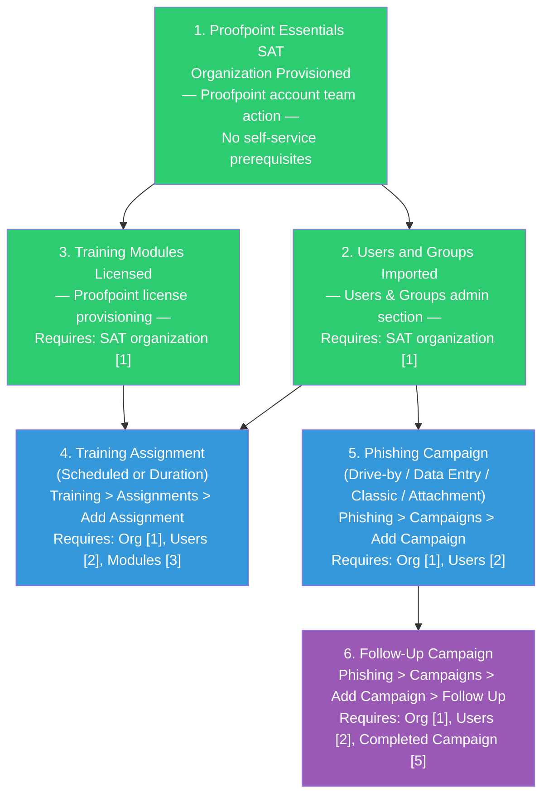

# Security Awareness Training Policies — Prerequisites

> Source for all prerequisite relationships: [S3 — Proofpoint Essentials Security Awareness Admin Guide, April 2020]

---

## Dependency Chain

**Legend:** Green = foundational infrastructure | Blue = first-order SAT configuration | Purple = second-order (requires prior SAT activity)

---

## Configuration Order

### 1. Proofpoint Essentials SAT Organization Provisioned (~1-5 business days)

**Capability:** Proofpoint account provisioning (not a self-service SAT workflow)
**Workflow:** Contact your Proofpoint account team or reseller to activate the SAT module on your Essentials organization
**What to configure:** Nothing — provisioning is performed by Proofpoint
**Minimum viable config:** Organization appears in SAT admin console; admin account has access

**Source:** [S3 — admin guide assumes organization is already provisioned at Step 1]

---

### 2. Users and Groups Imported (~30 minutes for directory-synced orgs)

**Capability:** Users & Groups management in Proofpoint Essentials
**Workflow:** [../../../capabilities/email-filtering/workflow.md] (user management is part of the Essentials platform, not the SAT workflow)
**What to configure:** Users must be visible in Users & Groups before they can be added to assignments or campaigns
**Minimum viable config:** At least one user or one group containing users

**Note:** Users may be provisioned via directory synchronization (Active Directory / Azure AD) or manually. The specific provisioning method is part of the core Essentials platform configuration, not the SAT capability. [S3 — implied; user provisioning method not documented in SAT admin guide]

**Source:** [S3]

---

### 3. Training Modules Licensed (~1-5 business days for new license; immediate if upgrading existing)

**Capability:** Proofpoint license management
**Workflow:** Contact Proofpoint account team to add training module licenses
**What to configure:** Nothing — licensed modules appear automatically in the Modules selector within assignment creation
**Minimum viable config:** At least one module visible when filtering by Licensed in Training > Assignments > Add Assignment > Modules

This prerequisite applies only to Training Assignments. Phishing Campaigns do not require licensed training modules — they use phishing email templates and Teachable Moments, which are separate from training module licenses. [S3]

**Source:** [S3]

---

### 4. Training Assignment — Scheduled or Duration (~10 minutes)

**Capability:** This capability (SAT)
**Workflow:** [workflow.md#step-1-create-a-scheduled-training-assignment]
**What to configure:** Name, Type, dates (Scheduled) or delays (Duration), Modules, Users
**Minimum viable config:**
- Name (unique)
- Start Date and Due Date (Scheduled) OR Enrollment Delay (Duration)
- At least one Module selected
- At least one User or Group selected

**Requires:** Prerequisites 1, 2, and 3

**Source:** [S3]

---

### 5. Phishing Campaign — First Campaign (~10 minutes)

**Capability:** This capability (SAT)
**Workflow:** [workflow.md#step-6-create-a-drive-by-phishing-campaign]
**What to configure:** Campaign Title, Email Templates, Campaign Users, Teachable Moment, Schedule, Data Collection Period
**Minimum viable config:**
- Campaign Title (unique)
- At least one Email Template selected
- At least one User or Group in Campaign Users
- Teachable Moment selected
- Schedule set (Specific or Random)

**Requires:** Prerequisites 1 and 2 only (no module license required for phishing campaigns)

**Source:** [S3]

---

### 6. Follow-Up Campaign (~10 minutes, plus wait time for source campaign to complete)

**Capability:** This capability (SAT)
**Workflow:** [workflow.md#step-10-create-a-follow-up-campaign]
**What to configure:** Campaign Title, Source Campaign, User Selection Criteria, Email Templates, Teachable Moment, Schedule
**Minimum viable config:**
- Campaign Title
- Source Campaign (must be Completed or Archived)
- User Selection Criteria (at least one criterion)
- At least one Email Template
- Teachable Moment
- Schedule

**Requires:** Prerequisites 1, 2, and 5 (completed campaign)

**Note:** The wait for the source campaign to complete is the primary bottleneck for this step. A phishing campaign must progress through its entire delivery window AND data collection period before it can be used as a source for a Follow-Up campaign. [S3]

**Source:** [S3]

---

## Optional Prerequisites (Not Required for Core SAT)

| Prerequisite | Required For | Notes |
|-------------|-------------|-------|
| PhishAlarm deployed to user email clients | Follow-Up campaign "Reported Phishing" criterion | Without PhishAlarm, the Reported Phishing criterion returns zero users |
| Custom training module uploaded | Using Custom modules in assignments | Workflow not documented in S3 |
| Custom Teachable Moment created | Using custom post-click education | Workflow not documented in S3 |

---

## Total Time Estimate

| Step | Time |
|------|------|
| 1. SAT provisioning | 1-5 business days (Proofpoint action) |
| 2. User import | 30 minutes |
| 3. Module licensing | 1-5 business days (Proofpoint action; may overlap with step 1) |
| 4. Training assignment creation | 10 minutes |
| 5. First phishing campaign | 10 minutes |
| Wait for campaign to complete | 7-14 days (campaign delivery + data collection) |
| 6. Follow-Up campaign creation | 10 minutes |
| **Total (admin hands-on-keyboard)** | **~1 hour** |
| **Total elapsed time (including Proofpoint provisioning + campaign cycle)** | **~2-3 weeks** |
