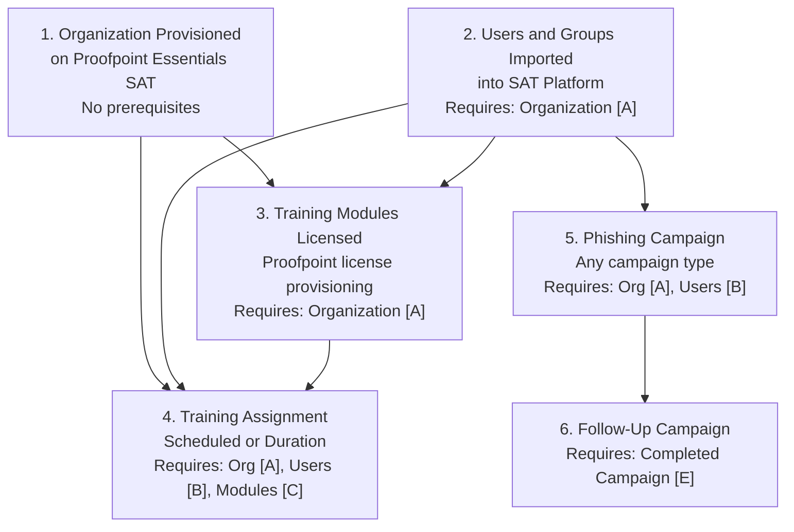
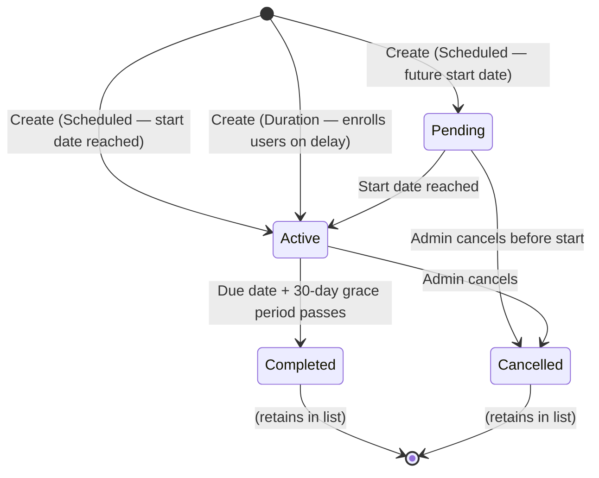
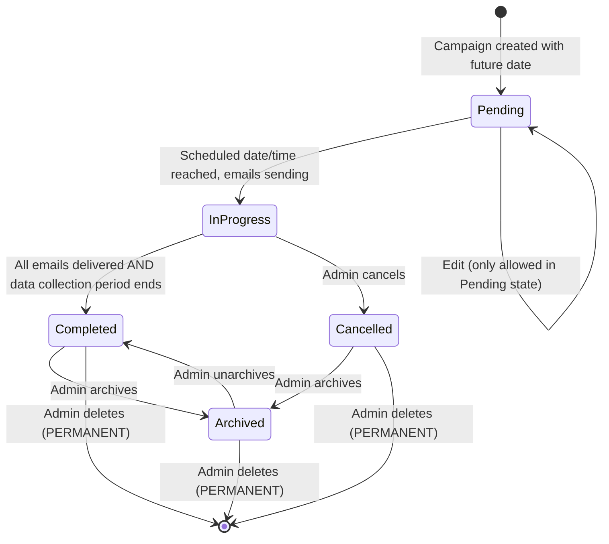

# Security Awareness Training Policies — Workflow Reference

> Capability: `sat` | Product: Proofpoint Essentials SAT | Generated: 2026-05-21
> Sources: doc-corpus (S3 primary), video-intelligence (no SAT-specific video found), capability-taxonomy (group 12)

---

## Overview

Security Awareness Training (SAT) in Proofpoint Essentials is the platform for delivering cybersecurity education and phishing simulation to users. It covers two primary workflows: **Training Assignments** (scheduled or rolling module delivery) and **Phishing Campaigns** (simulated attack testing with teachable moments). Together they form a closed-loop behavior change program: run a phishing campaign to identify vulnerable users, then assign targeted training to remediate.

**Complexity:** COMPLEX — four phishing campaign type variants plus two training assignment types, each with distinct field sets; dependency on pre-provisioned user/group data; 16 distinct sub-capabilities; campaign state machine has five lifecycle operations.
**Prerequisite chain length:** 2 steps (organization provisioned + users/groups imported)
**Total configurable fields:** 36 (across all screens and campaign types)
**Screens involved:** 9 (training assignments: 2; phishing campaigns: 5 type-specific + 2 shared + scheduling screen)
**Evidence base:** 1 Grade A source (S3 — SAT Admin Guide, April 2020), 0 Grade B-C, 0 Grade D-E for this capability. No video coverage exists for SAT.

> **Stale Source Warning:** S3 is dated April 2020. The SAT product has received significant updates since then (AIDA integration, expanded template libraries, new reporting). UI paths and field names documented here reflect the April 2020 admin guide. Current UI may differ. Mark all S3 findings as A (official) but flag version risk wherever noted. [S3 — stale source warning from doc-corpus.md]

---

## Screen Hierarchy

```yaml
screens:

  - name: "Training > Assignments"
    navigation: "Training (top nav) > Assignments"
    parent: null
    type: page
    description: "List view of all training assignments — scheduled and duration types"
    fields:
      - name: Assignment list
        type: table
        description: "Columns: Name, Type, Start Date, Due Date, Status, Actions"
    actions:
      - name: "Add Assignment"
        type: button
        result: "Opens assignment creation form (type selection branches the form)"
    prerequisites:
      - "Organization provisioned on Proofpoint Essentials SAT"
      - "At least one training module licensed"

  - name: "Training > Assignments > Add Assignment (Scheduled)"
    navigation: "Training > Assignments > Add Assignment > Type = Scheduled"
    parent: "Training > Assignments"
    type: page
    description: "Create a fixed-date training assignment delivered between start and due dates"
    fields:
      - name: "Name"
        type: text
        required: true
        default: null
        description: "Internal identifier for the assignment — NOT visible to end users"
        gotcha: "Name must be unique. No documented character limit in S3."
        source: "[S3]"
      - name: "Type"
        type: dropdown
        required: true
        default: "Scheduled"
        options: ["Scheduled", "Duration"]
        description: "Scheduled = fixed dates; Duration = rolling new-hire style"
        gotcha: "Type selection determines which date fields appear; switching type resets date fields"
        source: "[S3]"
      - name: "Start Date"
        type: date
        required: true
        default: null
        description: "Date training becomes available to users. Notification sent at 12:01 AM ET on this date."
        gotcha: "Time zone is hardcoded to Eastern Time (ET) — affects globally distributed teams. Set start date one day earlier than intended if most users are in non-ET time zones."
        source: "[S3]"
      - name: "Due Date"
        type: date
        required: true
        default: null
        validation: "Must be after Start Date"
        description: "Deadline for completing the assignment. A 30-day grace period applies after the due date — users can still complete training for 30 days after."
        gotcha: "30-day grace period is not visible to users; the displayed due date IS the enforcement target. Admins must account for this in compliance reporting."
        source: "[S3]"
      - name: "Training Notification"
        type: dropdown
        required: false
        default: "Default"
        options: ["None", "Always Active", "Default"]
        description: "Email notification template sent to users when assigned. Default uses the system default notification template."
        source: "[S3]"
      - name: "Completion Notification"
        type: dropdown
        required: false
        default: "Default"
        options: ["None", "Always Active", "Default"]
        description: "Email notification sent to users upon completing the assignment."
        source: "[S3]"
      - name: "Reminders"
        type: date_list
        required: false
        default: null
        description: "Comma-separated list of reminder dates. Reminders are ONLY sent to users who have NOT yet completed the assignment."
        gotcha: "Reminders fire only to incomplete users — completed users do not receive them. This is correct behavior but causes confusion when admins expect all users to get reminders."
        source: "[S3]"
      - name: "High Priority"
        type: checkbox
        required: false
        default: false
        description: "When enabled, this assignment locks access to all other training content until the user completes it."
        gotcha: "IRREVERSIBLE during active assignment — enabling High Priority after users have started other modules blocks their progress on those modules immediately."
        source: "[S3]"
      - name: "Enforce Module Order"
        type: checkbox
        required: false
        default: false
        description: "Requires users to complete modules in the order listed. Users cannot skip ahead."
        source: "[S3]"
      - name: "Modules"
        type: multiselect
        required: true
        default: null
        description: "Training modules to include in this assignment. Filter by Custom, Licensed, or All to narrow the module list."
        gotcha: "Only licensed modules appear in the selection list. If a required module is missing, it must be licensed through Proofpoint first."
        source: "[S3]"
      - name: "Users"
        type: multiselect
        required: true
        default: null
        description: "Users to include in the assignment. Filter by date range or group membership to find users."
        source: "[S3]"
    actions:
      - name: "Save"
        type: button
        result: "Creates assignment and sends Training Notifications to assigned users on the start date"
    decision_points:
      - condition: "High Priority = Enabled"
        effect: "Other active assignments are locked for the user until this one is complete"
      - condition: "Enforce Module Order = Enabled"
        effect: "Module list becomes ordered; users cannot complete out of sequence"

  - name: "Training > Assignments > Add Assignment (Duration)"
    navigation: "Training > Assignments > Add Assignment > Type = Duration"
    parent: "Training > Assignments"
    type: page
    description: "Create a rolling assignment for ongoing programs (e.g., new-hire onboarding). Users are enrolled on a delay after being added."
    fields:
      - name: "Name"
        type: text
        required: true
        default: null
        description: "Internal identifier"
        source: "[S3]"
      - name: "Type"
        type: dropdown
        required: true
        default: "Scheduled"
        options: ["Scheduled", "Duration"]
        description: "Select Duration for rolling enrollment"
        source: "[S3]"
      - name: "Training Notification"
        type: dropdown
        required: false
        default: "Default"
        options: ["None", "Always Active", "Default"]
        description: "Notification sent when user is enrolled"
        source: "[S3]"
      - name: "Completion Notification"
        type: dropdown
        required: false
        default: "Default"
        options: ["None", "Always Active", "Default"]
        description: "Notification sent upon completion"
        source: "[S3]"
      - name: "Enrollment Delay"
        type: number
        required: false
        default: null
        description: "Days after being added to the assignment before enrollment begins. Setting to 0 results in enrollment within approximately 30 minutes."
        gotcha: "A value of 0 does NOT mean immediate enrollment — there is a ~30-minute processing delay. Plan notifications accordingly."
        source: "[S3]"
      - name: "Assignment Due Within"
        type: number
        required: false
        default: null
        description: "Days after enrollment by which the user must complete the assignment."
        source: "[S3]"
      - name: "High Priority"
        type: checkbox
        required: false
        default: false
        description: "Locks other assignments until this one is complete"
        source: "[S3]"
      - name: "Enforce Module Order"
        type: checkbox
        required: false
        default: false
        description: "Requires sequential module completion"
        source: "[S3]"
      - name: "Modules"
        type: multiselect
        required: true
        default: null
        description: "Modules for the assignment"
        source: "[S3]"
      - name: "Users"
        type: multiselect
        required: true
        default: null
        description: "Initial user list. New users can be added later; each is enrolled on their individual delay timer."
        gotcha: "Adding a user to an existing Duration assignment restarts their enrollment delay timer from the date of addition — not from the assignment creation date."
        source: "[S3]"
    decision_points:
      - condition: "Enrollment Delay = 0"
        effect: "User enrolled approximately 30 minutes after being added (not instantaneous)"
      - condition: "Assignment Due Within = null"
        effect: "No due date enforced; assignment runs indefinitely — ASSUMPTION [Grade U] — doc says field is optional but does not explicitly state behavior when empty"

  - name: "Phishing > Campaigns"
    navigation: "Phishing (top nav) > Campaigns"
    parent: null
    type: page
    description: "List view of all phishing campaigns with status and lifecycle actions"
    fields:
      - name: Campaign list
        type: table
        description: "Columns include campaign name, type, status, scheduled date, actions (Edit/Clone/Cancel/Archive/Delete)"
    actions:
      - name: "Add Campaign"
        type: button
        result: "Opens campaign type selection — branches into one of five campaign creation flows"
    prerequisites:
      - "Organization provisioned on Proofpoint Essentials SAT"
      - "At least one user or group exists"

  - name: "Phishing > Campaigns > Add Campaign (Drive-by)"
    navigation: "Phishing > Campaigns > Add Campaign > Drive-by"
    parent: "Phishing > Campaigns"
    type: page
    description: "Simulates a phishing email with a malicious link. Users who click are redirected to a Teachable Moment page. No credential collection."
    fields:
      - name: "Campaign Title"
        type: text
        required: true
        default: null
        description: "Internal campaign name — NOT visible to end users"
        gotcha: "Title must be unique across all campaigns."
        source: "[S3]"
      - name: "Email Templates"
        type: multiselect
        required: true
        default: null
        description: "Phishing email templates to use. Filter by Language, Category, or Average Failure Rate (AFR). Multiple templates can be selected; each user receives one template from the pool."
        gotcha: "AFR is historical data from Proofpoint's aggregate user base, not your organization's. A low AFR template may still fool your users if it matches your industry context."
        source: "[S3]"
      - name: "Campaign Users"
        type: multiselect
        required: true
        default: null
        description: "Target users. Select from Groups, user lists, or import from completed campaign results (e.g., target users who clicked in a previous campaign)."
        source: "[S3]"
      - name: "Teachable Moment"
        type: dropdown
        required: true
        default: null
        description: "Educational page shown immediately after a user clicks the phishing link. Select by Category and Language. Multilingual options available."
        gotcha: "Teachable Moment selection is campaign-wide — all users see the same Teachable Moment regardless of which template they received."
        source: "[S3]"
      - name: "Schedule"
        type: radio
        required: true
        default: null
        options: ["Specific Date/Time", "Random"]
        description: "Specific: all phishing emails sent at once on a single date/time. Random: emails distributed randomly across a configured window of days and times to avoid recipients warning each other."
        gotcha: "Random scheduling is strongly recommended for campaigns with more than ~25 users. Large batches sent simultaneously generate IT helpdesk tickets before half the recipients have opened their email."
        source: "[S3]"
      - name: "Data Collection Period"
        type: select_or_number
        required: false
        default: "7 days"
        description: "Duration after campaign launch that click/open data is collected. After this period, new interactions are no longer recorded. Can be set to a custom number of days or indefinite."
        gotcha: "If a user clicks the phishing link AFTER the data collection period expires, the click is NOT recorded. For compliance tracking, set a longer period than the campaign delivery window."
        source: "[S3]"
    actions:
      - name: "Save / Launch"
        type: button
        result: "Campaign saved. If scheduled date is in the future, status becomes Pending. If date is now, emails begin sending immediately."
    decision_points:
      - condition: "Schedule = Specific Date/Time"
        effect: "All emails sent in a single batch at the specified time; recipients may warn each other"
      - condition: "Schedule = Random"
        effect: "Emails distributed across the configured window; reduces recipient-to-recipient warnings"

  - name: "Phishing > Campaigns > Add Campaign (Data Entry)"
    navigation: "Phishing > Campaigns > Add Campaign > Data Entry"
    parent: "Phishing > Campaigns"
    type: page
    description: "Simulates credential harvesting. Users who click land on a fake login page. Passwords entered are NOT collected — only the fact that the user submitted credentials is recorded."
    fields:
      - name: "Campaign Title"
        type: text
        required: true
        default: null
        source: "[S3]"
      - name: "Email Templates"
        type: multiselect
        required: true
        default: null
        description: "Data Entry-specific templates that include a credential capture landing page link"
        source: "[S3]"
      - name: "Campaign Users"
        type: multiselect
        required: true
        default: null
        source: "[S3]"
      - name: "Teachable Moment"
        type: dropdown
        required: true
        default: null
        source: "[S3]"
      - name: "Schedule"
        type: radio
        required: true
        default: null
        options: ["Specific Date/Time", "Random"]
        source: "[S3]"
      - name: "Data Collection Period"
        type: select_or_number
        required: false
        default: "7 days"
        source: "[S3]"
    gotcha: "IMPORTANT: Passwords entered on the fake login page are NOT collected or stored by Proofpoint. Only the event of form submission is recorded. This must be communicated to legal/compliance teams before running Data Entry campaigns to avoid privacy concerns. [S3]"

  - name: "Phishing > Campaigns > Add Campaign (Classic Attachment)"
    navigation: "Phishing > Campaigns > Add Campaign > Classic Attachment"
    parent: "Phishing > Campaigns"
    type: page
    description: "Sends a simulated malicious DOC or HTML file attachment. Records whether the user opened the attachment."
    fields:
      - name: "Campaign Title"
        type: text
        required: true
        default: null
        source: "[S3]"
      - name: "Email Templates"
        type: multiselect
        required: true
        default: null
        description: "Classic Attachment templates with simulated DOC or HTML attachment"
        source: "[S3]"
      - name: "Campaign Users"
        type: multiselect
        required: true
        default: null
        source: "[S3]"
      - name: "Teachable Moment"
        type: dropdown
        required: true
        default: null
        source: "[S3]"
      - name: "Schedule"
        type: radio
        required: true
        default: null
        options: ["Specific Date/Time", "Random"]
        source: "[S3]"
      - name: "Data Collection Period"
        type: select_or_number
        required: false
        default: "7 days"
        source: "[S3]"

  - name: "Phishing > Campaigns > Add Campaign (Attachment — PDF/DOCX/XLSX)"
    navigation: "Phishing > Campaigns > Add Campaign > Attachment"
    parent: "Phishing > Campaigns"
    type: page
    description: "Sends a simulated malicious PDF, DOCX, or XLSX attachment (newer attachment types vs Classic). Records whether the user opened the attachment."
    fields:
      - name: "Campaign Title"
        type: text
        required: true
        default: null
        source: "[S3]"
      - name: "Email Templates"
        type: multiselect
        required: true
        default: null
        description: "Attachment templates specifying PDF, DOCX, or XLSX attachment type"
        source: "[S3]"
      - name: "Campaign Users"
        type: multiselect
        required: true
        default: null
        source: "[S3]"
      - name: "Teachable Moment"
        type: dropdown
        required: true
        default: null
        source: "[S3]"
      - name: "Schedule"
        type: radio
        required: true
        default: null
        options: ["Specific Date/Time", "Random"]
        source: "[S3]"
      - name: "Data Collection Period"
        type: select_or_number
        required: false
        default: "7 days"
        source: "[S3]"
    decision_points:
      - condition: "Template attachment type = PDF"
        effect: "Simulated PDF file attached; tracks open event via embedded tracking pixel"
      - condition: "Template attachment type = DOCX or XLSX"
        effect: "Simulated Office document attached; tracks open via macro execution or link click within document"

  - name: "Phishing > Campaigns > Add Campaign (Follow Up)"
    navigation: "Phishing > Campaigns > Add Campaign > Follow Up"
    parent: "Phishing > Campaigns"
    type: page
    description: "Targets users based on their behavior in a prior phishing campaign. Used to send follow-up testing or remediation assignments to users who failed."
    fields:
      - name: "Campaign Title"
        type: text
        required: true
        default: null
        source: "[S3]"
      - name: "Source Campaign"
        type: dropdown
        required: true
        default: null
        description: "The completed campaign whose results define the user pool for this campaign"
        gotcha: "Source campaign must be in a COMPLETED or ARCHIVED state — active or pending campaigns cannot be used as source."
        source: "[S3]"
      - name: "User Selection Criteria"
        type: multiselect
        required: true
        default: null
        description: "Which users from the source campaign to target: Clicked, Submitted Data, Opened Attachment, or Reported Phishing (via PhishAlarm)"
        gotcha: "If source campaign had very low click rates, the Follow Up campaign user list may be very small — verify user count before scheduling."
        source: "[S3]"
      - name: "Email Templates"
        type: multiselect
        required: true
        default: null
        source: "[S3]"
      - name: "Teachable Moment"
        type: dropdown
        required: true
        default: null
        source: "[S3]"
      - name: "Schedule"
        type: radio
        required: true
        default: null
        options: ["Specific Date/Time", "Random"]
        source: "[S3]"
      - name: "Data Collection Period"
        type: select_or_number
        required: false
        default: "7 days"
        source: "[S3]"
    prerequisites:
      - "At least one prior phishing campaign must be in Completed or Archived state"
    decision_points:
      - condition: "User Selection Criteria includes Reported Phishing"
        effect: "Requires PhishAlarm to be deployed and configured; without PhishAlarm, no users will appear in this criterion"
```

---

## Step-by-Step Walkthrough

### Step 1: Create a Scheduled Training Assignment (Sub-capability 12.1)

**Navigate to:** Training > Assignments > Add Assignment
**Screen:** Training > Assignments > Add Assignment (Scheduled)
**Purpose:** Assign specific training modules to users within a defined date window.

| Field | Type | Required | Default | Description |
|-------|------|----------|---------|-------------|
| Name | Text | Yes | — | Internal name, not shown to users |
| Type | Dropdown | Yes | Scheduled | Keep as Scheduled for fixed-date delivery |
| Start Date | Date | Yes | — | Notification at 12:01 AM ET on this date |
| Due Date | Date | Yes | — | 30-day grace period after this date |
| Training Notification | Dropdown | No | Default | Notification on assignment |
| Completion Notification | Dropdown | No | Default | Notification on completion |
| Reminders | Date list | No | — | Reminder dates for incomplete users only |
| High Priority | Checkbox | No | false | Locks other assignments until complete |
| Enforce Module Order | Checkbox | No | false | Sequential completion required |
| Modules | Multiselect | Yes | — | Filter: Custom / Licensed / All |
| Users | Multiselect | Yes | — | Filter by date range or group |

**Source:** [S3 — Proofpoint Essentials SAT Admin Guide, April 2020]

**Decision point:** High Priority = Enabled locks all other training for the user. Use sparingly. IRREVERSIBLE while assignment is active — enable only at creation time if possible.

---

### Step 2: Create a Duration Training Assignment (Sub-capability 12.2)

**Navigate to:** Training > Assignments > Add Assignment
**Screen:** Training > Assignments > Add Assignment (Duration)
**Purpose:** Create a rolling assignment for continuous programs (new-hire onboarding, annual re-training on an individual schedule).

Differences from Scheduled (delta fields only):

| Field | Type | Required | Default | Description |
|-------|------|----------|---------|-------------|
| Enrollment Delay | Number (days) | No | — | Days after user addition before enrollment; 0 = ~30 min delay |
| Assignment Due Within | Number (days) | No | — | Days after enrollment to complete |

Note: No Start Date or Due Date fields on Duration type. The "due" is calculated per-user from their enrollment date. [S3]

---

### Step 3: Select and Order Training Modules (Sub-capability 12.3)

**Navigate to:** Within assignment creation form > Modules field
**Purpose:** Choose which training content users must complete.

The Modules multiselect supports three filters: [S3]
- **Custom** — modules created by your organization (upload workflow not documented in S3)
- **Licensed** — modules included in your Proofpoint SAT license
- **All** — combined view

If Enforce Module Order is enabled, the order in which modules appear in the selected list determines the completion sequence. Drag-and-drop reordering is implied by the UI but not explicitly documented in S3.

**INCOMPLETE — drag-to-reorder behavior requires UI verification; S3 does not describe the exact module ordering interaction.**

---

### Step 4: Configure Training Notifications (Sub-capability 12.4)

**Navigate to:** Within assignment creation form > Training Notification / Completion Notification fields
**Purpose:** Control what email notifications users receive about the assignment.

| Option | Behavior |
|--------|----------|
| None | No email sent for this event |
| Always Active | Email sent regardless of user notification preferences |
| Default | Uses system default notification template; respects user opt-out settings |

Both Training Notification (on assignment) and Completion Notification (on completion) have the same three options. [S3]

**INCOMPLETE — custom notification template creation and management workflow not documented in S3. PhishAlarm configuration details are behind auth wall per doc-corpus gap analysis.**

---

### Step 5: Schedule Training Reminders (Sub-capability 12.5)

**Navigate to:** Within Scheduled assignment creation form > Reminders field
**Purpose:** Send reminder emails to users who have not yet completed the assignment.

Enter dates as a comma-separated list in the Reminders field. Each date triggers a reminder email to all users in the assignment who have NOT yet completed it. Users who are already complete do NOT receive reminders. [S3]

Reminder dates must fall between the Start Date and the end of the 30-day grace period after the Due Date for them to be meaningful. [S3 — inferred from 30-day grace period behavior]

---

### Step 6: Create a Drive-by Phishing Campaign (Sub-capability 12.6)

**Navigate to:** Phishing > Campaigns > Add Campaign > Drive-by
**Screen:** Phishing > Campaigns > Add Campaign (Drive-by)
**Purpose:** Test user susceptibility to clicking malicious links. Users who click are redirected to a Teachable Moment.

| Field | Type | Required | Default | Description |
|-------|------|----------|---------|-------------|
| Campaign Title | Text | Yes | — | Internal name only |
| Email Templates | Multiselect | Yes | — | Filter by Language, Category, AFR |
| Campaign Users | Multiselect | Yes | — | Groups, lists, or from prior campaign results |
| Teachable Moment | Dropdown | Yes | — | Select by Category and Language |
| Schedule | Radio | Yes | — | Specific Date/Time or Random |
| Data Collection Period | Select/Number | No | 7 days | Days to record click events after launch |

**Source:** [S3]

---

### Step 7: Create a Data Entry Phishing Campaign (Sub-capability 12.7)

**Navigate to:** Phishing > Campaigns > Add Campaign > Data Entry
Same fields as Drive-by with Data Entry-specific templates. Passwords are NOT stored — only the submission event is recorded. [S3]

---

### Step 8: Create a Classic Attachment Phishing Campaign (Sub-capability 12.8)

**Navigate to:** Phishing > Campaigns > Add Campaign > Classic Attachment
Same fields as Drive-by. Uses DOC or HTML attachment templates. Records attachment open event. [S3]

---

### Step 9: Create an Attachment Phishing Campaign (Sub-capability 12.9)

**Navigate to:** Phishing > Campaigns > Add Campaign > Attachment
Same fields as Drive-by. Uses PDF, DOCX, or XLSX attachment templates — expanded format set vs Classic Attachment. [S3]

---

### Step 10: Create a Follow-Up Campaign (Sub-capability 12.10)

**Navigate to:** Phishing > Campaigns > Add Campaign > Follow Up
**Purpose:** Target users who failed a prior campaign.

Additional required field: Source Campaign (completed/archived campaign to pull user results from). User Selection Criteria determines which failure category to target (Clicked, Submitted Data, Opened Attachment, Reported). [S3]

---

### Step 11: Select and Filter Phishing Templates (Sub-capability 12.11)

**Navigate to:** Within campaign creation form > Email Templates field
**Purpose:** Choose which phishing email templates to send.

Filter options: [S3]
- **Language** — template language (multilingual support)
- **Category** — template theme/type (banking, IT helpdesk, HR, delivery, etc. — ASSUMPTION [Grade U]; specific category names not enumerated in S3)
- **Average Failure Rate (AFR)** — historical click-through rate from Proofpoint's aggregate data

When multiple templates are selected, each user receives one template from the pool. The distribution method (random per user, sequential, or weighted by AFR) is not documented in S3. **INCOMPLETE — template distribution logic when multiple templates are selected not documented.**

---

### Step 12: Select a Teachable Moment (Sub-capability 12.12)

**Navigate to:** Within campaign creation form > Teachable Moment field
**Purpose:** Choose the educational page shown to users immediately after they click/interact with the phishing simulation.

Selection criteria: Category and Language. Multilingual support exists. [S3]

Custom Teachable Moment creation is referenced in the admin guide but the workflow is not documented. **INCOMPLETE — custom Teachable Moment creation workflow not documented; behind auth wall per doc-corpus gap analysis.**

---

### Step 13: Configure Campaign Scheduling (Sub-capability 12.13)

**Navigate to:** Within campaign creation form > Schedule field
**Purpose:** Control when phishing emails are delivered.

| Option | Description | When to Use |
|--------|-------------|-------------|
| Specific Date/Time | All emails sent simultaneously | Small pilots (<25 users), controlled testing |
| Random | Emails spread across configured window | Large campaigns; avoids recipients warning each other |

Schedule = Random is recommended for campaigns exceeding approximately 25 users. [S3 — inferred from admin guide description; exact threshold is ASSUMPTION Grade U]

---

### Step 14: Manage Campaign Lifecycle (Sub-capability 12.14)

**Navigate to:** Phishing > Campaigns > [campaign row] > Actions
**Purpose:** Perform post-creation operations on campaigns.

| Operation | Available When | Notes |
|-----------|---------------|-------|
| Edit | Pending state only (before start date) | IRREVERSIBLE: once a campaign starts, it cannot be edited |
| Clone | Any state | Creates a copy in Pending state; useful for recurring campaigns |
| Cancel | In Progress | Stops sending. Emails already delivered are not recalled. |
| Archive | Completed or Cancelled | Removes from active list; data retained |
| Unarchive | Archived | Moves back to active list |
| Delete | Any state | Permanent deletion; data cannot be recovered |

**Source:** [S3]

---

### Step 15: Configure Campaign Users and Groups (Sub-capability 12.15)

**Navigate to:** Within campaign creation form > Campaign Users field
**Purpose:** Define who receives the phishing simulation.

Three selection methods: [S3]
1. **Groups** — select from existing user groups in the Essentials admin console
2. **User Lists** — select individual users or pre-defined lists
3. **From Completed Campaign** — import users from a prior campaign's results (e.g., all users who clicked in Campaign A become targets of Campaign B)

The third method is the enabler of sub-capability 12.10 (Follow-Up Campaign).

---

### Step 16: Configure Data Collection Period (Sub-capability 12.16)

**Navigate to:** Within campaign creation form > Data Collection Period field
**Purpose:** Set how long after launch the system records user interactions.

Default: 7 days. Options: custom number of days, or indefinite. [S3]

**Gotcha:** If a user clicks the phishing link after the data collection period closes, the click is NOT recorded and does not appear in reports. For regulatory compliance tracking, set the data collection period to at least 2x the campaign delivery window. [S3 — inferred from "default 7 days" behavior description]

---

## Dependency Graph



### Prerequisite Chain (Ordered)

1. **Organization provisioned on Proofpoint Essentials SAT** — created by Proofpoint during provisioning — no prerequisites
2. **Users and Groups imported** — created at: Users & Groups admin section — requires: [1]
3. **Training modules licensed** — provisioned by Proofpoint license — requires: [1]
4. **Training Assignment (Scheduled or Duration)** — created at: Training > Assignments > Add Assignment — requires: [1, 2, 3]
5. **Phishing Campaign (any type except Follow-Up)** — created at: Phishing > Campaigns > Add Campaign — requires: [1, 2]
6. **Follow-Up Campaign** — created at: Phishing > Campaigns > Add Campaign > Follow Up — requires: [1, 2, 5 completed]

---

## Decision Points

| Screen | Decision | Options | Default | Implications | Recommended | Why | Irreversible |
|--------|----------|---------|---------|-------------|-------------|-----|--------------|
| Add Assignment | Assignment Type | Scheduled / Duration | Scheduled | Scheduled = fixed window; Duration = rolling per-user timer | Duration for new-hire onboarding; Scheduled for annual training | Scheduled requires all users to complete simultaneously; Duration adapts to each user's start date | No — can create separate assignments |
| Add Assignment | High Priority | Enabled / Disabled | Disabled | Enabled locks all other training | Disabled unless immediate compliance deadline | Locking other training disrupts users mid-progress | IRREVERSIBLE while active |
| Add Assignment | Enforce Module Order | Enabled / Disabled | Disabled | Enabled requires sequential completion | Enable only for training paths with prerequisite logic | Most training modules stand alone | No |
| Add Campaign | Campaign Type | Drive-by / Data Entry / Classic Attachment / Attachment / Follow Up | None (must choose) | Determines what user action is simulated | Drive-by for first campaigns; Data Entry to test credential hygiene | Drive-by has lowest organizational friction; Data Entry requires legal/privacy clearance for credential simulation | No — can run multiple types |
| Add Campaign | Schedule | Specific / Random | None (must choose) | Specific sends all at once; Random distributes | Random for >25 users | Reduces recipient-to-recipient advance warning | No |
| Add Campaign | Data Collection Period | 7 days / Custom / Indefinite | 7 days | Short periods miss late interactions | Extend to 14–30 days for compliance | Default 7 days is often too short for slow-opening users | No |

---

## Object Lifecycle

### Training Assignment



Note: The exact state names in the Proofpoint SAT UI are INCOMPLETE — S3 describes the lifecycle operations but does not enumerate the exact state machine labels visible in the UI. [S3]

### Phishing Campaign



**Source:** [S3]

---

## Integration Touchpoints

| Capability | Relationship | Direction | Notes |
|-----------|-------------|-----------|-------|
| Users & Groups (Essentials user management) | SAT requires user/group data to target assignments and campaigns | SAT consumes | User provisioning must precede any SAT activity |
| PhishAlarm (Proofpoint email add-in) | Allows users to report phishing; results appear in Follow-Up campaign user criteria | SAT consumes | Reported Phishing criterion in Follow-Up campaigns requires PhishAlarm to be deployed |
| Training Module Library (Proofpoint licensed content) | Training assignments reference modules from this library | SAT consumes | Missing modules = incomplete assignments; requires license provisioning |
| Phishing Template Library | Campaign templates sourced from Proofpoint-managed library | SAT consumes | Template availability tied to SAT license tier |
| Teachable Moment Library | Post-click educational content | SAT consumes | Multilingual support; custom creation workflow not documented in S3 |
| SAT Reports | Assignments and campaigns generate completion/failure reports | SAT produces | Report scheduling and export formats not documented in S3 — gap per doc-corpus |

---

## Complexity Score

| Dimension | Simple | Moderate | Complex | This Capability |
|-----------|--------|----------|---------|-----------------|
| Fields | 3-5 | 10-20 | 50+ | 36 total across all screens → MODERATE |
| Screens | 1 | 2-3 | 4+ with sub-tabs | 9 screens (2 assignment + 5 campaign + 2 list) → COMPLEX |
| Dependencies | 0 | 1-2 | 3+ chain | 3 prerequisites (provisioning, users, modules) + 1 for Follow-Up → COMPLEX |

**Overall score: COMPLEX**

**Justification:** Field count is in the MODERATE range (36 fields total, but distributed across 9 screens — no single screen exceeds 12 fields). Screen count is COMPLEX (9 distinct configuration screens, 5 of which are type-branched campaign creation variants). Dependency chain is COMPLEX — while only 2-3 foundational prerequisites exist, the Follow-Up campaign creates a dependency chain of prior completed campaigns, and the full program loop (phish → train → phish → train) requires multiple campaign/assignment cycles with results. Highest dimension (COMPLEX) governs overall score.

---

## Sources

| # | Source | Grade | Used For |
|---|--------|-------|----------|
| 1 | Proofpoint Essentials Security Awareness Admin Guide — pax8nebula.com/m/290b594b… — SAT (April 2020) [S3] | A | All SAT field definitions, campaign types, assignment types, lifecycle operations, scheduling, data collection period, notification options |
| 2 | Capability Taxonomy — capability-taxonomy.md (group 12) | Internal reference | Sub-capability inventory, priority/complexity ratings, source mapping |
| 3 | Doc Corpus Coverage Assessment — doc-corpus.md | Internal reference | Gap identification, stale source warning, coverage level confirmation |
| 4 | Video Intelligence — video-intelligence.md | Internal reference | Confirmed NO video coverage exists for SAT capability |
