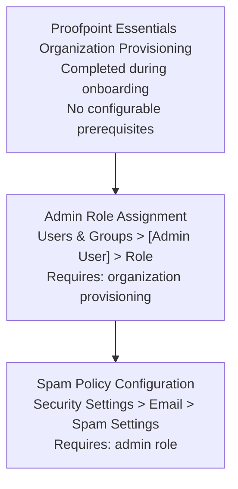

# Spam Policy Configuration — Prerequisites

## Dependency Chain

---

## Configuration Order

### 1. Proofpoint Essentials Organization Provisioning (~0 min — Proofpoint onboarding)

**Capability:** Pre-requisite infrastructure (not a configurable capability)
**What to configure:** Nothing — completed by Proofpoint during organization setup.
**Minimum viable config:** Organization tenant created with at least one admin user.
**Source:** [A — S1]

### 2. Admin Role Assignment (~2 min)

**Capability:** User Management
**Workflow:** Users & Groups > select user > edit role assignment
**What to configure:** Assign the Organization Admin role to the user who will configure spam settings.
**Minimum viable config:** At least one user with Organization Admin role.
**Source:** [A — S1]

### 3. Spam Policy Configuration (~5 min)

**Ready when:** Steps 1 and 2 are complete.
**Workflow:** [workflow.md](workflow.md)
**Navigate to:** Security Settings > Email > Spam Settings

---

## Total Time Estimate: ~7 minutes (excluding Proofpoint onboarding)

**Note for PPS/PoD deployments:** The spam module in PPS has additional prerequisites including module licensing and potentially policy route configuration. Those prerequisites are INCOMPLETE — not documented in accessible grade-A sources. [B — S2, training-level only]
