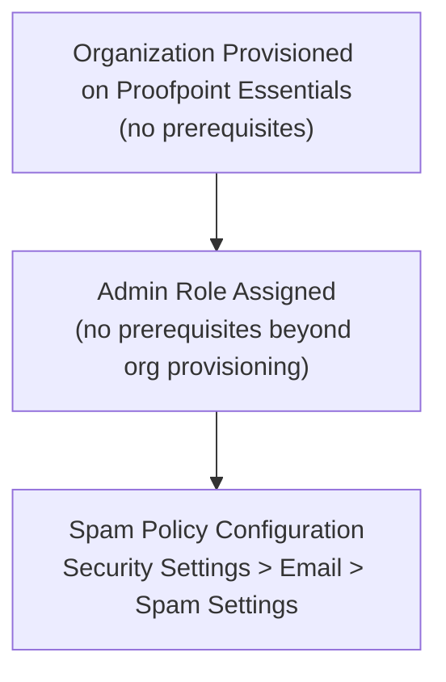
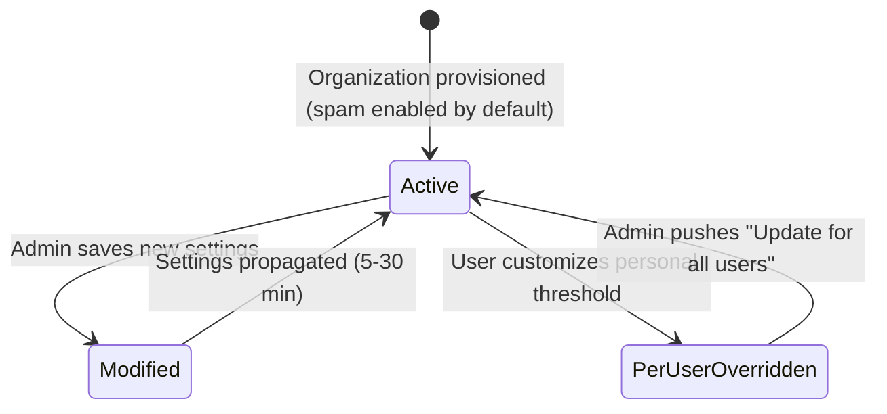

# Spam Policy Configuration — Workflow Reference

> Capability: spam | Product: Proofpoint (Essentials + PPS/PoD) | Generated: 2026-05-21
> Taxonomy groups: 3.1–3.9

---

## Overview

Spam Policy Configuration controls how Proofpoint classifies and handles unsolicited bulk email. In Proofpoint Essentials, a single settings page manages sensitivity thresholds, bulk email quarantine, subject-line stamping, and DNS-based sender checks. In PPS/PoD, the spam module exposes classifier scoring, suspected-spam thresholds, and custom spam rules with deeper tunability. Spam policy is independent of Filter Policies — threshold changes in Spam Settings do not alter filter rules and vice versa.

**Complexity:** SIMPLE — One primary screen (Essentials), 6 configurable fields, no prerequisite chain beyond organizational provisioning.
**Prerequisite chain length:** 1 step (organizational provisioning).
**Total configurable fields documented:** 6 (Essentials, grade-A); PPS fields are LOW coverage.
**Screens involved:** 1 primary (Essentials); 2 inferred (PPS spam module — LOW coverage).
**Evidence base:** 2 Grade A sources [S1, S27], 2 Grade B sources [S2, S26], 1 Grade B video [V21], 1 Grade D source [S19].

---

## Screen Hierarchy

```yaml
screen:
  name: "Security Settings > Email > Spam Settings"
  navigation: "Log in to Proofpoint Essentials admin console > Security Settings (top nav) > Email > Spam Settings"
  parent: "Security Settings > Email"
  type: page
  fields:
    - name: "Spam Trigger Level"
      type: slider
      required: false
      default: "System default (numeric value not published in accessible docs)"
      options: ["Numeric threshold — lower value = more aggressive filtering"]
      validation: "Numeric; lower threshold = more email classified as spam"
      description: "Adjusts sensitivity of spam detection engine. Lowering the value increases spam catch rate at the cost of potential false positives."
      gotcha: "Exact numeric range not documented in grade-A sources — UNKNOWN range."
    - name: "Quarantine Bulk Email"
      type: checkbox
      required: false
      default: "Disabled"
      options: ["Enabled", "Disabled"]
      validation: "Toggle"
      description: "When enabled, bulk/marketing email (newsletters, automated mailings) is quarantined rather than delivered."
      gotcha: "Bulk email is a distinct classification from spam — enabling this can quarantine legitimate marketing communications that users have subscribed to."
    - name: "Stamp & Forward"
      type: dropdown
      required: false
      default: "No"
      options: ["No", "Partial (score 9-19)", "All"]
      validation: "Select"
      description: "Appends a configurable text string (default: '***Spam***') to the subject line of messages matching the option. 'Partial' stamps messages with spam scores 9-19; 'All' stamps all classified spam."
      gotcha: "Subject-line stamping is visible to end users and may cause confusion if Stamp & Forward is enabled before users are informed."
    - name: "Easy Spam Reporting"
      type: checkbox
      required: false
      default: "Disabled"
      options: ["Enabled", "Disabled"]
      validation: "Toggle"
      description: "Appends a disclaimer to delivered messages with a link allowing end users to report the message as spam."
      gotcha: "Requires users to interact with links in email — some security-aware users may flag the disclaimer itself as suspicious."
    - name: "Inbound Sender DNS"
      type: checkbox
      required: false
      default: "Enabled"
      options: ["Enabled", "Disabled"]
      validation: "Toggle"
      description: "Performs MX record checks on inbound sender domains and rejects connections from private IP address ranges. Part of connection-level spam protection."
      gotcha: "Disabling Inbound Sender DNS removes a significant connection-level protection layer. Only disable when troubleshooting specific delivery failures."
    - name: "Update for all users"
      type: checkbox
      required: false
      default: "Disabled"
      options: ["Enabled", "Disabled"]
      validation: "Toggle"
      description: "When checked and settings are saved, overwrites per-user spam threshold settings with the organization-wide values. Does not create a lock — users can re-customize their thresholds after the push."
      gotcha: "This is a one-time push, not a permanent override. Users can immediately change their per-user settings after you save. To prevent per-user overrides, there is no persistent lock documented in grade-A sources."
  actions:
    - name: "Save"
      type: button
      result: "Saves spam settings to the organization. Propagation time: 5–30 minutes. [B — Video 21, ~1:00]"
  prerequisites:
    - "Organization provisioned on Proofpoint Essentials"
    - "Admin role required"
  decision_points:
    - condition: "When 'Update for all users' is checked before Save"
      effect: "All per-user spam threshold customizations are overwritten with organization defaults"

screen:
  name: "Users & Groups > [User] > Spam Settings"
  navigation: "Users & Groups > select user > Spam tab"
  parent: "Users & Groups"
  type: tab
  fields:
    - name: "Per-user Spam Trigger Level"
      type: slider
      required: false
      default: "Inherits organization default"
      description: "Individual user's spam threshold. Overrides company setting unless 'Update for all users' was used."
      gotcha: "Per-user spam settings are independent of Filter Policies. A user's personal spam threshold does not affect company-level filter rules."
  prerequisites:
    - "User must exist in Proofpoint Essentials"
  decision_points:
    - condition: "Organization admin saves with 'Update for all users' checked"
      effect: "This user's threshold reverts to organization default"

screen:
  name: "PPS Spam Module — INCOMPLETE"
  navigation: "UNKNOWN — PPS admin console; exact path behind authentication wall"
  parent: "UNKNOWN"
  type: page
  fields:
    - name: "Spam Classifier Configuration"
      type: UNKNOWN
      required: UNKNOWN
      default: UNKNOWN
      description: "INCOMPLETE — PPS spam module classifier configuration fields not documented in accessible sources. Training material [S2] confirms the module exists with tunable classifiers, safe/blocked sender lists, false positive/negative reporting."
  prerequisites:
    - "PPS on-premises or PoD deployment"
    - "Spam module licensed"
```

---

## Step-by-Step Walkthrough

### Step 1: Navigate to Spam Settings (Essentials)

**Navigate to:** Log in to Proofpoint Essentials admin console > Security Settings > Email > Spam Settings
**Screen:** Security Settings > Email > Spam Settings
**Purpose:** This is the single configuration page for all organization-level spam behavior in Essentials.

Note: Spam Settings are a **separate page** from Filter Policies. Changing spam sensitivity here does NOT affect any Filter Policies you have created. Both areas must be configured independently when tuning spam behavior. [B — Video 21, ~1:00]

| Field | Type | Required | Default | Description |
|-------|------|----------|---------|-------------|
| Spam Trigger Level | Slider | No | System default (value UNKNOWN) | Sensitivity threshold — lower = more aggressive [A — S1] |
| Quarantine Bulk Email | Checkbox | No | Disabled | Quarantines bulk/marketing mail [A — S1] |
| Stamp & Forward | Dropdown | No | No | Appends spam label to subject line [A — S1] |
| Easy Spam Reporting | Checkbox | No | Disabled | Adds user-facing report link to messages [A — S1] |
| Inbound Sender DNS | Checkbox | No | Enabled | MX record + private IP rejection [A — S1] |
| Update for all users | Checkbox | No | Disabled | One-time push of org settings to all users [A — S1] |

**Decision point:** If per-user customizations exist and you want to standardize, check "Update for all users" before saving. This is irreversible for the moment of saving (user settings are overwritten), but users can re-customize afterward.

### Step 2: Configure Spam Trigger Level

**Navigate to:** Same screen — Spam Trigger Level slider
**Purpose:** Sets how aggressively the spam engine classifies messages.

- Lower the threshold = more messages classified as spam = higher catch rate, higher false positive risk.
- Higher the threshold = fewer false positives = more spam may reach inboxes.
- Best practice from community sources: tune incrementally, starting from the highest-confidence (most aggressive) rules and monitoring false positives before tightening further. [D — S19, community article cross-reference]

**Decision point:**

| Option | When to use | Risk |
|--------|------------|------|
| Lower threshold (aggressive) | High-spam environments, executive protection | Higher false positives |
| Higher threshold (permissive) | Low-spam environments, troubleshooting | Some spam reaches inbox |
| System default | Initial deployment | Balanced starting point |

### Step 3: Configure Bulk Email and Stamping

**Navigate to:** Same screen
**Purpose:** Controls how bulk/marketing email and spam labeling behave.

- "Quarantine Bulk Email": Enable only if users do not rely on subscribed marketing email delivered to inbox.
- "Stamp & Forward": The "Partial (score 9-19)" option is useful for borderline messages — stamps them for user awareness without blocking.

### Step 4: Configure Reporting and DNS Checks

**Navigate to:** Same screen
**Purpose:** Enable user-facing reporting and connection-level protection.

- "Easy Spam Reporting": Recommended for end-user empowerment. Adds a disclaimer link users can click to report spam.
- "Inbound Sender DNS": Leave enabled (default). This performs MX record validation and blocks private-range IPs. [A — S1]

### Step 5: Save and Verify Propagation

**Navigate to:** Same screen > click Save
**Purpose:** Commits configuration to Proofpoint.

Propagation time: Allow 5–30 minutes before testing. Testing immediately after save may yield false negatives. [B — Video 21, ~1:00; B — Video 2, ~3:00]

---

## Advanced Configuration

### PPS/PoD Spam Module (taxonomy items 3.8, 3.9)

PPS exposes deeper spam tuning capabilities documented at training level only [S2]:

| Area | Description | Coverage |
|------|------------|----------|
| Spam Classifiers | Tunable scoring per classifier type | LOW [S2] — admin guide behind auth |
| Suspected Spam | Separate threshold for "likely spam" vs confirmed spam | LOW [S2] |
| Safe/Blocked Sender Lists | Organization-managed allow/deny at spam module level | LOW [S2] |
| False Positive/Negative Reporting | Feedback loop for classifier improvement | LOW [S2] |
| Custom Spam Rules | Specialized rules beyond classifier scoring | LOW [S2] |

**INCOMPLETE — PPS spam module configuration screens and fields not documented in accessible grade-A sources. The items above are confirmed to exist from training material [S2] but step-by-step workflow is unavailable.**

Community best practice for PPS spam tuning: Start with highest-confidence rules (score 100) and monitor false positives before reducing the threshold. Aggressive single-pass tuning is a documented common mistake. [D — community article, proofpoint.my.site.com]

### Per-User Spam Threshold Override (taxonomy item 3.6)

End users can adjust their own spam threshold via the quarantine digest email link or via their user portal. Organization administrators can manage per-user settings via Users & Groups > [User] > Spam tab.

The interaction between org settings and per-user settings:
- Per-user settings **override** org settings for that user.
- "Update for all users" pushes org settings to all users but does not lock them.
- No persistent lock mechanism documented in grade-A sources. [A — S1]

---

## Dependency Graph



### Prerequisite Chain (Ordered)

1. **Proofpoint Essentials Organization Provisioning** — completed by Proofpoint onboarding; no configurable prerequisites. Provides the admin console and organization tenant.
2. **Admin Role Assignment** — admin must have the organization admin role to access Company Settings. [A — S1]
3. **Spam Policy Configuration** — configure at Security Settings > Email > Spam Settings. Requires only steps 1 and 2.

---

## Decision Points

| Screen | Decision | Options | Default | Implications | Recommended | Why |
|--------|----------|---------|---------|-------------|-------------|-----|
| Spam Settings | Spam Trigger Level | Lower (aggressive) / Higher (permissive) | System default | Lower = more catch, more false positives; Higher = less catch, fewer false positives | Start at system default | Allows baseline before tuning [D — community article] |
| Spam Settings | Quarantine Bulk Email | Enable / Disable | Disabled | Enable quarantines marketing mail | Disabled until users consulted | Avoid disrupting subscribed newsletters [A — S1] |
| Spam Settings | Stamp & Forward | No / Partial / All | No | Partial stamps borderline messages; All stamps everything | Partial (score 9-19) | Visible signal without aggressive blocking [A — S1] |
| Spam Settings | Update for all users | Check / Don't check | Unchecked | Checking overwrites all per-user threshold customizations | Only check when standardizing org-wide | Destructive to per-user settings [A — S1] |

---

## Object Lifecycle

Spam settings in Proofpoint Essentials are not versioned objects — they are a persistent configuration state with no draft/active/disabled lifecycle. Changes take effect after Save and propagation.



---

## Integration Touchpoints

| Capability | Relationship | Direction | Notes |
|-----------|-------------|-----------|-------|
| [Email Filtering Policies](../email-filtering/workflow.md) | Separate system — spam threshold and filter policies are independent | Parallel | Changing spam settings does NOT affect filter rules and vice versa [B — Video 21, ~1:00] |
| [Quarantine Management](../quarantine/workflow.md) | Spam-classified messages route to quarantine when threshold exceeded | Spam → Quarantine | Quarantine digest configuration controls user visibility of spam quarantine [A — S1, S19] |
| [PPS Email Firewall Rules](../pps-rules/workflow.md) | PPS-only: spam module is one filtering stage in the module precedence order | Sequential | PPS module precedence determines when spam scanning runs relative to firewall rules [S2] |

---

## Complexity Score

| Dimension | Simple | Moderate | Complex | This Capability |
|-----------|--------|----------|---------|-----------------|
| Fields | 3-5 fields | 10-20 fields | 50+ fields | 6 fields → SIMPLE |
| Screens | 1 screen | 2-3 screens | 4+ screens | 1 primary screen → SIMPLE |
| Dependencies | No prerequisites | 1-2 prerequisites | Chain of 3+ | 1 prerequisite (provisioning) → SIMPLE |

**Overall complexity: SIMPLE**
Justification: Six fields on a single screen, one prerequisite. PPS spam module adds complexity but is LOW coverage and treated as an advanced/incomplete section. Essentials spam configuration is the documented path and is genuinely simple.

---

## Sources

| # | Source | Grade | Used For |
|---|--------|-------|----------|
| S1 | Proofpoint Essentials Administrator Guide (2014) | A | All Essentials spam fields, defaults, behavior |
| S2 | Enterprise Protection for the Administrator Training Datasheet | B | PPS spam module overview, classifier existence |
| S19 | How to Manage the Quarantine Console (InventiveHQ) | D | Community best practices for spam tuning |
| V21 | Proofpoint Essentials – Manage Spam Settings (Vidyard, 3:44, 2023) | B | Navigation path confirmation, propagation time, spam/filter separation |
| V2 | How to Enable or Modify Email Firewall Rule (YouTube, 2018) | B | Propagation time after save |
