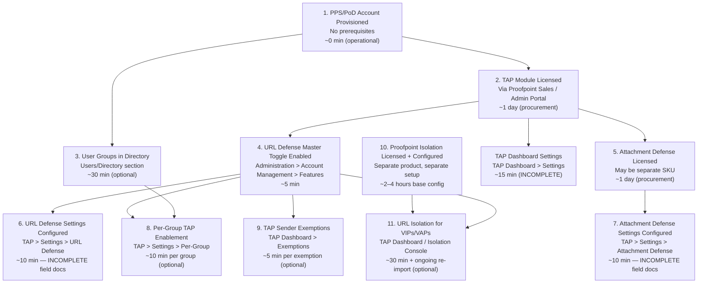

# Targeted Attack Protection (TAP) — Prerequisites

## Dependency Graph

---

## Configuration Order

### 1. PPS/PoD Account Provisioned (0 minutes — operational state)

**Capability:** PPS/PoD Rule Creation and Email Firewall
**Workflow:** [pps-rules/workflow.md](../pps-rules/workflow.md)
**What to configure:** Confirm the Proofpoint Protection Server or Proofpoint on Demand cloud account is active and you can authenticate as an administrator.
**Minimum viable config:** Admin login works; email is flowing through the Proofpoint MTA.
**Note:** TAP is a module within PPS/PoD — the base platform must exist before TAP can be licensed or configured. Source: [B, S2]

---

### 2. TAP Module Licensed (1 business day — procurement)

**Capability:** Licensing (outside product console)
**What to configure:** Contact Proofpoint sales or verify in Administration > Account Management that TAP (URL Defense, Attachment Defense) is listed as an active module.
**Minimum viable config:** TAP appears as an available feature in Account Management > Features.
**Note:** TAP URL Defense and TAP Attachment Defense may be licensed separately. Confirm which modules are active. Source: [B, S2; C, S22]

---

### 3. User Groups in Directory (30 minutes — only if per-group TAP enablement is planned)

**Capability:** User and Group Management
**What to configure:** User groups that should receive differentiated TAP settings (e.g., "Executives", "IT_Test_Accounts") must exist in the PPS/PoD user directory before they can be referenced in TAP per-group configuration.
**Minimum viable config:** At least one named group exists that corresponds to the population you want to target.
**Note:** Required only for sub-capability 7.4 (Per-Group TAP Enablement). Skip if applying TAP globally. Source: [C, S22]

---

### 4. URL Defense Master Toggle Enabled (5 minutes)

**Capability:** TAP — URL Defense Configuration (7.1)
**Workflow:** [tap/workflow.md](workflow.md) — Step 1
**What to configure:** Navigate to Administration > Account Management > Features. Enable URL Defense toggle. Save.
**Minimum viable config:** URL Defense toggle = Enabled, saved.
**Note:** This is the prerequisite for URL Defense settings configuration, per-group enablement, and URL Isolation. Source: [B, Video 5 ~0:30]

---

### 5. Attachment Defense Licensed (1 business day — procurement)

**Capability:** Licensing (outside product console)
**What to configure:** Confirm Attachment Defense is an active module — may be a separate SKU from URL Defense TAP.
**Minimum viable config:** Attachment Defense appears as configurable in TAP > Settings.
**Note:** Required only for sub-capability 7.3 (Attachment Defense Configuration). Source: [B, S2]

---

### 6. URL Defense Settings Configured (10 minutes)

**Capability:** TAP — URL Defense Configuration (7.1) and URL Rewrite Options (7.2)
**Workflow:** [tap/workflow.md](workflow.md) — Step 2
**What to configure:** TAP > Settings > URL Defense tab — set rewrite mode and any rewrite options.
**Minimum viable config:** Default settings accepted; rewrite mode saved.
**Note:** INCOMPLETE — exact field names and options behind auth wall. Source: [B, S2]

---

### 7. Attachment Defense Settings Configured (10 minutes)

**Capability:** TAP — Attachment Defense Configuration (7.3)
**Workflow:** [tap/workflow.md](workflow.md) — Step 3
**What to configure:** TAP > Settings > Attachment Defense tab — enable attachment sandboxing, select delivery mode.
**Minimum viable config:** Attachment Defense enabled; delivery mode set (hold-and-release recommended for regulated environments).
**Note:** INCOMPLETE — exact field names behind auth wall. Source: [B, S2]

---

### 8. Per-Group TAP Enablement (10 minutes per group — optional)

**Capability:** TAP — Per-Group TAP Enablement (7.4)
**Workflow:** [tap/workflow.md](workflow.md) — Step 4
**What to configure:** TAP > Settings > [group section] — select group, set URL Defense and/or Attachment Defense toggles.
**Minimum viable config:** At least one group selected with desired TAP toggles set.
**Note:** Requires steps 3 and 4 complete. Source: [C, S22]

---

### 9. TAP Sender Exemptions (5 minutes per sender — optional)

**Capability:** TAP — Sender Exemption from TAP (7.5)
**Workflow:** [tap/workflow.md](workflow.md) — Step 5
**What to configure:** TAP Dashboard > Exemptions — add sender addresses or domains.
**Minimum viable config:** At least one exemption entry with SMTP address or domain.
**Note:** Suppresses TAP alerts only — scanning continues. Independent from Email Protection safe-sender lists. Source: [C, S21]

---

### 10. Proofpoint Isolation Licensed and Configured (2–4 hours base setup)

**Capability:** Browser/Email Isolation Policies
**Workflow:** [../isolation/workflow.md](../isolation/workflow.md) (if available)
**What to configure:** Proofpoint Isolation is a separate licensed product. It must have at minimum one browsing policy created and active before URL Isolation for VIPs/VAPs can be assigned.
**Minimum viable config:** Isolation console accessible, one browsing policy exists.
**Note:** Required only for sub-capability 7.6 (TAP URL Isolation for VIPs/VAPs). Source: [B, S15]

---

### 11. URL Isolation for VIPs/VAPs (30 minutes + ongoing re-import — optional)

**Capability:** TAP — TAP URL Isolation for VIPs/VAPs (7.6)
**Workflow:** [tap/workflow.md](workflow.md) — Step 6
**What to configure:** Export VAP list from TAP Dashboard, export VIP list from User Center. Import into Isolation Console > Policies > URL Isolation. Assign isolation policy.
**Minimum viable config:** VIP or VAP list imported; isolation policy assigned.
**Note:** Manual import only — no automatic sync. Requires steps 4 and 10. Re-import required whenever TAP VAP roster changes. Source: [B, S15; C, Video 17 ~1:30]

---

## Total Time Estimates

| Path | Steps | Estimated Time |
|------|-------|---------------|
| Minimum viable TAP (URL Defense only) | 1, 2, 4, 6 | ~1 business day (licensing) + 20 minutes configuration |
| Full TAP (URL + Attachment Defense) | 1, 2, 4, 5, 6, 7 | ~1 business day (licensing) + 30 minutes configuration |
| TAP with per-group control | 1, 2, 3, 4, 5, 6, 7, 8 | ~1 business day (licensing) + 60 minutes configuration |
| TAP with URL Isolation for VIPs/VAPs | 1, 2, 4, 5, 6, 7, 10, 11 | ~1 business day (TAP licensing) + 2–4 hours (Isolation setup) + 45 minutes configuration |

**Note:** Licensing timelines (steps 2, 5, 10) depend on organizational procurement processes and are outside admin control. Configuration time estimates assume no troubleshooting. Add 5–30 minutes per saved change for propagation before testing. Source: [B, Videos 2, 20]
