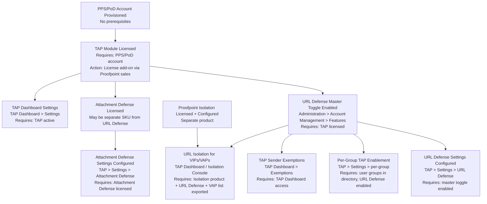
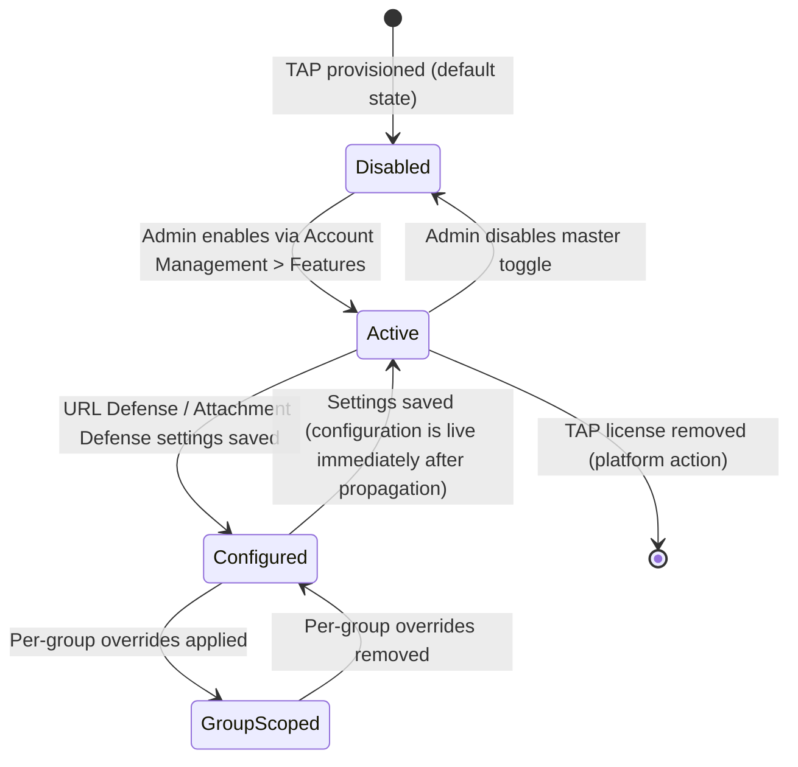
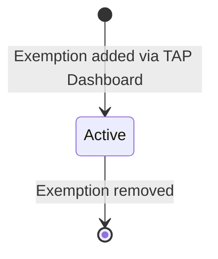
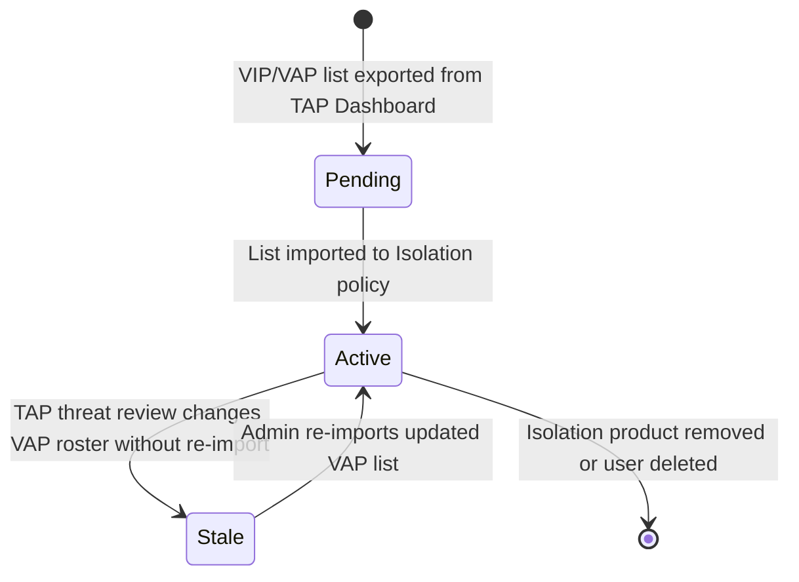

# Targeted Attack Protection (TAP) Policies — Workflow Reference

> Capability: tap | Product: proofpoint | Generated: 2026-05-21
> Taxonomy group 7 — sub-capabilities 7.1 through 7.7

---

## Overview

Targeted Attack Protection (TAP) is Proofpoint's advanced threat-detection layer that protects against malicious URLs and weaponized email attachments. URL Defense rewrites inbound email URLs to route through Proofpoint's click-time sandbox, blocking navigation to malicious destinations even after delivery. Attachment Defense sandboxes suspicious file attachments before or after delivery, quarantining those confirmed malicious. TAP policies control which users are protected, which senders are exempt, and how isolation is applied for high-risk individuals (VIPs/VAPs).

TAP sits above email filtering policies in the threat protection stack: spam and virus policies run first, TAP runs on messages that pass those filters.

**Complexity:** COMPLEX — low doc coverage (auth wall blocks detailed field enumeration), 4-step prerequisite chain, integration with both URL Defense engine and Proofpoint Isolation product.
**Prerequisite chain length:** 4 steps (PPS/PoD provisioned → TAP licensed → URL Defense enabled → per-group or isolation policy configured)
**Total configurable fields:** 18 documented; additional fields behind auth wall marked INCOMPLETE
**Screens involved:** 6 identified (2 confirmed, 4 partially documented)
**Evidence base:** 0 Grade A, 4 Grade B, 3 Grade C, 1 Grade D, 2 Grade E (inferred)

---

## Screen Hierarchy

```yaml
screen:
  name: "Administration > Account Management > Features"
  navigation: "Top navigation > Administration section > Account Management sub-section > Features tab"
  parent: "Administration"
  type: page
  fields:
    - name: "URL Defense"
      type: toggle
      required: true
      default: "DISABLED — must be explicitly enabled post-provisioning"
      options: ["Enabled", "Disabled"]
      validation: "Requires TAP license on account"
      description: "Master toggle enabling URL rewriting and click-time inspection for the entire organization"
      gotcha: "Disabled by default after provisioning — official docs imply auto-active but vendor tutorial video shows explicit enable step required. Source: Video 5 ~0:30 [B]"
    - name: "Attachment Defense"
      type: toggle
      required: false
      default: "UNKNOWN — not documented in sources"
      options: ["Enabled", "Disabled"]
      description: "Master toggle enabling attachment sandboxing for the organization"
      gotcha: "INCOMPLETE — enable path not fully documented in accessible sources"
  actions:
    - name: "Save"
      type: button
      result: "Applies feature toggle changes; propagation delay applies"
  prerequisites:
    - "TAP module licensed on the Proofpoint account"
    - "Admin-level access to the PPS/PoD administration console"
  decision_points:
    - condition: "URL Defense not enabled here"
      effect: "All other URL Defense settings (rewrite options, per-group, VIP isolation) are inert — no URL rewriting occurs regardless of downstream configuration"

screen:
  name: "TAP > Settings > URL Defense"
  navigation: "TAP section (top nav or admin sidebar) > Settings > URL Defense tab"
  parent: "TAP Settings"
  type: tab
  fields:
    - name: "URL Rewrite Mode"
      type: dropdown
      required: true
      default: "UNKNOWN — not documented in accessible sources"
      options: ["UNKNOWN — field documented as existing but options behind auth wall"]
      description: "Controls which URLs get rewritten — all URLs, URLs in specific domains, or selective rewrites"
      gotcha: "INCOMPLETE — exact options not documented in accessible sources [Grade B training only, S2]"
    - name: "Rewrite Encoded URLs"
      type: checkbox
      required: false
      default: "UNKNOWN"
      description: "Whether to rewrite URLs that are already encoded/obfuscated"
      gotcha: "INCOMPLETE — field existence inferred from training materials [Grade B, S2]; exact name unconfirmed"
  actions:
    - name: "Save"
      type: button
      result: "Applies URL Defense rewrite configuration"
  prerequisites:
    - "URL Defense master toggle enabled at Administration > Account Management > Features"
  decision_points:
    - condition: "URL Defense enabled"
      effect: "URLs in inbound email are rewritten to https://urldefense.com/ format [B, S2]. Click-time inspection activates."

screen:
  name: "TAP > Settings > Attachment Defense"
  navigation: "TAP section > Settings > Attachment Defense tab"
  parent: "TAP Settings"
  type: tab
  fields:
    - name: "Attachment Defense Mode"
      type: dropdown
      required: true
      default: "UNKNOWN"
      options: ["UNKNOWN — options behind auth wall"]
      description: "Controls sandboxing behavior: sandbox before delivery (hold-and-release), or sandbox after delivery (deliver-and-retroactively-quarantine)"
      gotcha: "INCOMPLETE — field names and options not documented in accessible sources. Training materials confirm the feature exists [B, S2]."
    - name: "Sandbox File Types"
      type: multiselect
      required: false
      default: "UNKNOWN"
      description: "Which attachment types are submitted to sandbox analysis"
      gotcha: "INCOMPLETE — enumerated file type list not available in accessible sources"
    - name: "Attachments encrypted at rest"
      type: informational
      required: false
      default: "Always on"
      description: "Sandboxed attachments are encrypted at rest and deleted after analysis — this is not a configurable field, it is a fixed behavior"
      gotcha: "Non-obvious fixed behavior; admins cannot change this [C, S22]"
  actions:
    - name: "Save"
      type: button
      result: "Applies Attachment Defense sandboxing configuration"
  prerequisites:
    - "Attachment Defense licensed (may be separate SKU from URL Defense)"
  decision_points:
    - condition: "Hold-and-release mode selected"
      effect: "Messages with unanalyzed attachments are held in queue; user does not receive email until sandbox verdict is returned. Increases delivery latency."
    - condition: "Deliver-and-retroactively-quarantine mode selected"
      effect: "Messages delivered immediately; if sandbox returns malicious verdict, message is retroactively pulled from inbox. User may have seen the email."

screen:
  name: "TAP > Settings > Per-Group Enablement"
  navigation: "TAP section > Settings > [Group configuration sub-section]"
  parent: "TAP Settings"
  type: page
  fields:
    - name: "Group"
      type: dropdown
      required: true
      default: "UNKNOWN — group must be pre-configured in directory/LDAP"
      options: ["Existing user groups from directory sync"]
      description: "Select the user group for which TAP Attachment Defense and/or URL Defense is being enabled or disabled"
      gotcha: "Group must exist in PPS/PoD user groups before it can be selected here — no inline group creation [C, S22]"
    - name: "URL Defense (group-level)"
      type: toggle
      required: false
      default: "UNKNOWN"
      options: ["Enabled", "Disabled"]
      description: "Override global URL Defense setting for this specific group"
    - name: "Attachment Defense (group-level)"
      type: toggle
      required: false
      default: "UNKNOWN"
      options: ["Enabled", "Disabled"]
      description: "Override global Attachment Defense setting for this specific group"
  actions:
    - name: "Save"
      type: button
      result: "Group-level TAP settings take effect after propagation delay"
  prerequisites:
    - "Global TAP features enabled at Account Management > Features"
    - "Target user group exists in PPS/PoD user directory"
  decision_points:
    - condition: "Group-level override enabled when global toggle is off"
      effect: "UNKNOWN — behavior of group override against disabled global toggle not documented in accessible sources. ASSUMPTION [U]: group-level cannot override a globally disabled feature."

screen:
  name: "TAP Dashboard > Exemptions"
  navigation: "TAP Dashboard > [Exemption or Settings sub-section]"
  parent: "TAP Dashboard"
  type: page
  fields:
    - name: "Sender Address or Domain"
      type: text
      required: true
      default: null
      validation: "SMTP address (user@domain.com) or domain (domain.com)"
      description: "Sender to be exempted from TAP alert generation — URL Defense and Attachment Defense still run, but alerts are suppressed for this sender"
      gotcha: "This exemption suppresses TAP Dashboard ALERTS for the sender. URL rewriting and attachment scanning still occur — this is NOT a bypass of scanning. Source: community KB [C, S21]"
    - name: "Exemption Type"
      type: dropdown
      required: false
      default: "UNKNOWN"
      options: ["INCOMPLETE — exact options not in accessible sources"]
      description: "Scope or type of exemption (alert suppression vs full bypass)"
      gotcha: "INCOMPLETE — whether full scanning bypass is possible via this UI is not documented. ASSUMPTION [U]: only alert suppression is available via dashboard; full scanning bypass requires policy route or filter changes."
  actions:
    - name: "Add Exemption"
      type: button
      result: "Sender added to TAP exemption list; TAP alerts suppressed for matching mail"
    - name: "Remove Exemption"
      type: button
      result: "Exemption removed; TAP alerts resume for this sender"
  prerequisites:
    - "TAP Dashboard access (separate from PPS/PoD admin console in some deployments)"
  decision_points:
    - condition: "Sender is on Email Protection safe-sender list only (NOT TAP exemption list)"
      effect: "TAP Dashboard STILL generates alerts for that sender. The two lists are independent. Source: community KB cross-reference [C, S21 + video intelligence tribal knowledge]"

screen:
  name: "TAP > URL Isolation > VIP/VAP Policy"
  navigation: "TAP Dashboard or Isolation Console > Policies > URL Isolation (path varies by product version)"
  parent: "TAP Dashboard / Isolation Console"
  type: page
  fields:
    - name: "VIP/VAP User List"
      type: file_upload
      required: true
      default: null
      description: "Import list of high-risk users (VAPs — Very Attacked People, or VIPs — Very Important People) who receive isolation-enhanced URL protection"
      gotcha: "This is a MANUAL import — the list does NOT automatically sync from the TAP Dashboard VAP list. Admins must re-import after each TAP threat review cycle. Source: Proofpoint docs + Video 17 ~1:30 [C, confirmed B]"
    - name: "Import Source"
      type: dropdown
      required: true
      default: "UNKNOWN"
      options: ["User Center", "TAP VAP export"]
      description: "Source system for VIP/VAP list — User Center for manually maintained VIP lists, TAP for dynamically identified VAPs"
      gotcha: "INCOMPLETE — exact import UI and field names not documented. Source: Isolation data sheet [B, S15]"
    - name: "Isolation Policy Assignment"
      type: dropdown
      required: true
      default: "UNKNOWN"
      description: "Which Isolation policy applies to URLs clicked by listed users"
      gotcha: "INCOMPLETE — policy assignment screen fields require Isolation Console documentation [B, S15]"
  actions:
    - name: "Import VIP/VAP List"
      type: button
      result: "Listed users are associated with the URL Isolation policy; subsequent URL clicks are rendered in Proofpoint Isolation sandbox browser"
    - name: "Save"
      type: button
      result: "Isolation policy assignments take effect"
  prerequisites:
    - "Proofpoint Isolation product licensed and configured"
    - "TAP URL Defense enabled"
    - "VAP/VIP list exported from TAP Dashboard or User Center"
  decision_points:
    - condition: "VAP list not re-imported after TAP threat review"
      effect: "New VAPs identified in the latest threat review receive standard URL Defense, not isolation-enhanced protection. Source: Video 17 ~1:30 [C]"

screen:
  name: "TAP Dashboard > Dashboard Settings"
  navigation: "TAP Dashboard > Settings or Preferences"
  parent: "TAP Dashboard"
  type: page
  fields:
    - name: "INCOMPLETE"
      type: "INCOMPLETE"
      required: false
      default: "UNKNOWN"
      description: "TAP Dashboard settings screen fields are entirely behind the authentication wall. Training materials confirm the TAP Dashboard exists and provides real-time insight, analysis, and situational awareness. Source: Video 15 ~0:00 [C]"
  prerequisites:
    - "TAP licensed and active"
  decision_points: []
```

---

## Step-by-Step Walkthrough

### Step 1: Enable URL Defense (Master Toggle)

**Navigate to:** Administration section > Account Management > Features tab

**Screen:** Administration > Account Management > Features

**Purpose:** URL Defense is disabled by default after TAP provisioning. This is the master on/off switch. No URL rewriting occurs until this toggle is explicitly set.

| Field | Type | Required | Default | Description | Source |
|-------|------|----------|---------|-------------|--------|
| URL Defense | Toggle | Yes | **DISABLED** | Master enable for URL rewriting across the organization | [B, Video 5 ~0:30] |

**Critical gotcha:** Official documentation states "you do not need to do anything to activate [URL Defense] once enabled" which implies automatic activation. Video 5 at ~0:30 contradicts this, showing an explicit enable step is required at Administration > Account Management > Features. The video evidence is more recent and procedurally specific — follow the video. Source contradiction noted. [B vs B]

**Decision point:** URL Defense must be enabled here before any downstream configuration has any effect. This is the foundational prerequisite for sub-capabilities 7.1, 7.2, 7.4, and 7.6.

---

### Step 2: Configure URL Defense Rewrite Options

**Navigate to:** TAP section > Settings > URL Defense tab

**Screen:** TAP > Settings > URL Defense

**Purpose:** Control which URLs are rewritten and how — all URLs, selective URLs, or only certain formats.

| Field | Type | Required | Default | Description | Source |
|-------|------|----------|---------|-------------|--------|
| URL Rewrite Mode | Dropdown | Yes | UNKNOWN | Scope of URL rewriting (all, selective, domain-filtered) | [B, S2 — training outline; options behind auth wall] |
| Rewrite Encoded URLs | Checkbox | No | UNKNOWN | Whether to decode and re-wrap already-encoded URLs | [B, S2 — inferred from training content] |

**INCOMPLETE note:** Full field inventory for this screen requires authentication-gated documentation. Fields above are documented from training materials outline [S2]. Treat as PARTIAL evidence.

**Behavior after enabling:** Inbound email URLs are rewritten to `https://urldefense.com/` format with an encoded representation of the original destination URL. Source: [B, S2]

---

### Step 3: Configure Attachment Defense

**Navigate to:** TAP section > Settings > Attachment Defense tab

**Screen:** TAP > Settings > Attachment Defense

**Purpose:** Enable sandboxing for email attachments and choose pre-delivery vs post-delivery analysis mode.

| Field | Type | Required | Default | Description | Source |
|-------|------|----------|---------|-------------|--------|
| Attachment Defense Mode | Dropdown | Yes | UNKNOWN | Hold-and-release vs deliver-and-retroactively-quarantine | [B, S2 — training outline] |
| Sandbox File Types | Multiselect | No | UNKNOWN | Which attachment types are sandboxed | [B, S2 — inferred] |

**Fixed behavior (not configurable):** Attachments are encrypted at rest during sandbox analysis and deleted after verdict is returned. Source: [C, S22]

**Decision point — Delivery Mode:**

| Option | Implication | Recommended | Why |
|--------|-------------|-------------|-----|
| Hold-and-release | Increases delivery latency by sandbox analysis time; maximum protection | For regulated industries, executives | Zero risk of malicious attachment reaching inbox |
| Deliver-and-retroactively-quarantine | No latency impact; malicious verdict triggers inbox pull | For latency-sensitive operational teams | User may still see email before retroactive pull |

---

### Step 4: Enable TAP for Specific User Groups (Optional)

**Navigate to:** TAP section > Settings > [Group configuration sub-section]

**Screen:** TAP > Settings > Per-Group Enablement

**Purpose:** Override global TAP settings for specific groups — enabling TAP for a pilot group only, or disabling for groups that should be exempt (e.g., IT testing accounts).

| Field | Type | Required | Default | Description | Source |
|-------|------|----------|---------|-------------|--------|
| Group | Dropdown | Yes | None | Pre-existing user group from directory | [C, S22] |
| URL Defense (group-level) | Toggle | No | Inherits global | Override URL Defense for this group | [C, S22] |
| Attachment Defense (group-level) | Toggle | No | Inherits global | Override Attachment Defense for this group | [C, S22] |

**Prerequisite check:** The user group must already exist in the PPS/PoD user directory. You cannot create groups inline from this screen. Source: [C, S22]

---

### Step 5: Configure TAP Sender Exemptions

**Navigate to:** TAP Dashboard > Exemptions sub-section

**Screen:** TAP Dashboard > Exemptions

**Purpose:** Suppress TAP alerts for trusted senders (e.g., security testing vendors, penetration testing partners). URL rewriting and attachment scanning continue — only alert generation is suppressed.

| Field | Type | Required | Default | Description | Source |
|-------|------|----------|---------|-------------|--------|
| Sender Address or Domain | Text | Yes | None | SMTP address or domain to exempt from TAP alerting | [C, S21] |
| Exemption Type | Dropdown | No | UNKNOWN | Scope of exemption | [C, S21 — type field existence inferred] |

**Critical distinction:** Adding a sender to TAP Exemptions does NOT add them to the Email Protection safe-sender list, and vice versa. These are independent lists in separate UIs. An admin who adds a sender to the Email Protection safe-sender list only will still receive TAP Dashboard alerts for mail from that sender. Source: community KB [C, S21] + video intelligence tribal knowledge.

---

### Step 6: Configure URL Isolation for VIPs/VAPs (Advanced)

**Navigate to:** TAP Dashboard or Isolation Console > Policies > URL Isolation

**Screen:** TAP > URL Isolation > VIP/VAP Policy

**Purpose:** Route URL clicks by high-value or frequently attacked users through Proofpoint Isolation (remote browser isolation), rendering web content in a safe cloud container rather than the user's local browser.

| Field | Type | Required | Default | Description | Source |
|-------|------|----------|---------|-------------|--------|
| VIP/VAP User List | File upload | Yes | None | Manually imported list of users to receive isolation-enhanced protection | [B, S15; C, confirmed] |
| Import Source | Dropdown | Yes | UNKNOWN | User Center (VIPs) or TAP Dashboard export (VAPs) | [B, S15] |
| Isolation Policy Assignment | Dropdown | Yes | UNKNOWN | Which browsing policy applies when listed users click rewritten URLs | [B, S15] |

**Prerequisite:** Proofpoint Isolation must be licensed separately and configured before URL Isolation can be assigned to TAP users. Source: [B, S15]

**Critical gotcha — manual sync only:** The VAP list in TAP Dashboard does NOT automatically propagate to the Isolation policy. After every TAP threat review cycle that changes the VAP roster, admins must manually re-export from TAP Dashboard and re-import into the Isolation policy. Source: Proofpoint docs + Video 17 ~1:30 [C, confirmed as manual import in official docs].

---

## Dependency Graph



### Prerequisite Chain (Ordered)

1. **PPS/PoD account provisioned** — organizational email protection platform active; no prerequisites — [B, S2]
2. **TAP module licensed** — requires PPS/PoD account; acquired via Proofpoint licensing; no UI configuration required — [B, S2]
3. **User groups configured in directory** — required only if per-group TAP enablement is desired; created at Users/Directory section of admin console — [C, S22]
4. **URL Defense master toggle enabled** — Administration > Account Management > Features; requires TAP licensed — [B, Video 5 ~0:30]
5. **Attachment Defense licensed** — may be a separate SKU from URL Defense; requires TAP-level licensing — [B, S2]
6. **URL Defense settings configured** — TAP > Settings > URL Defense; requires step 4 — [B, S2]
7. **Attachment Defense settings configured** — TAP > Settings > Attachment Defense; requires step 5 — [B, S2]
8. **Per-group TAP enablement** (optional) — TAP > Settings; requires steps 3 and 4 — [C, S22]
9. **TAP sender exemptions** (optional) — TAP Dashboard; requires step 2 — [C, S21]
10. **Proofpoint Isolation licensed and configured** — separate product; required only for URL Isolation — [B, S15]
11. **URL Isolation for VIPs/VAPs** (optional) — requires steps 4 and 10; VAP list must be manually exported from TAP Dashboard first — [B, S15]

---

## Decision Points

| Screen | Decision | Options | Default | Implications | Recommended | Why | Source |
|--------|----------|---------|---------|-------------|-------------|-----|--------|
| Account Management > Features | Enable URL Defense | On / Off | **Off** | Off = no URL rewriting anywhere; On = all inbound URLs rewritten to urldefense.com | On | Core TAP protection; no downside to enabling | [B, Video 5] |
| TAP > Attachment Defense | Delivery mode | Hold-and-release / Deliver-and-retroactively-quarantine | UNKNOWN | Hold = latency; Deliver = risk of user seeing email before quarantine | Hold-and-release for high-risk users | Maximum protection | [B, S2] |
| TAP > Per-Group | Apply to all users or specific groups | All / Group-scoped | UNKNOWN (likely All when global toggle is on) | Group-scoped allows phased rollout; All = maximum coverage | Group-scoped for initial rollout | Reduces blast radius of false positives during tuning phase | [C, S22] |
| TAP Dashboard > Exemptions | Sender exemption | Alert-suppression only vs scanning bypass | Alert-suppression only (ASSUMPTION [U]) | Scanning bypass = no protection for exempted sender; alert-suppression = protection continues but noise reduced | Alert-suppression only | Never bypass scanning for external senders | [C, S21] |
| URL Isolation | Assign isolation to VIPs or VAPs | Manually maintained VIP list / TAP-derived VAP list / Both | None (manual import required) | VAP list requires periodic re-import; VIP list is stable but may miss dynamically high-risk targets | Both, reviewed monthly | VAPs change based on threat landscape; VIPs are always high-value targets | [B, S15; C, Video 17] |

---

## Object Lifecycle

### URL Defense Rule / TAP Policy



### TAP Sender Exemption Object



### URL Isolation VIP/VAP Assignment



---

## Integration Touchpoints

| Capability | Relationship | Direction | Notes | Source |
|-----------|-------------|-----------|-------|--------|
| [Email Filtering Policies](../email-filtering/workflow.md) | TAP runs on messages that pass spam/virus/filter checks | Downstream from filtering | TAP cannot be the first line of defense — filter policies run in precedence order first | [B, S2] |
| [Browser/Email Isolation Policies](../isolation/workflow.md) | TAP URL Defense redirects VIP/VAP clicks to Isolation sandbox | TAP feeds into Isolation | Isolation must be licensed and configured independently; TAP provides user list | [B, S15] |
| [Email Filtering — Safe Sender Lists](../email-filtering/workflow.md) | TAP Exemption List and Email Protection safe-sender list are independent | No synchronization | Whitelisting a sender in Email Protection does NOT suppress TAP alerts for that sender | [C, S21] |
| [PPS/PoD Rule Creation](../pps-rules/workflow.md) | TAP operates as a separate module within PPS/PoD filtering pipeline | TAP is a module of PPS/PoD | Module precedence order determines when TAP analysis occurs relative to email firewall rules | [B, S2] |

---

## Complexity Score

| Dimension | Simple | Moderate | Complex | This Capability |
|-----------|--------|----------|---------|-----------------|
| Fields | 3-5 fields | 10-20 fields | 50+ fields | ~18 documented + auth-wall unknowns → MODERATE (documented) but auth wall prevents full count |
| Screens | 1 screen | 2-3 screens | 4+ screens | 6 screens identified → COMPLEX |
| Dependencies | No prerequisites | 1-2 prerequisites | Chain of 3+ prerequisites | 4-step chain before first URL is rewritten; 7-step chain for URL Isolation → COMPLEX |

**Overall Complexity: COMPLEX**

**Justification:** While the documented field count is moderate (~18 fields across 6 screens), the dependency chain is complex (license + master toggle + group setup + optional isolation product = minimum 4 mandatory steps, 7 for full configuration). The low documentation coverage (TAP screens are almost entirely behind authentication walls) further increases implementation risk. Six distinct screens are involved, each serving a different sub-capability. The URL Isolation sub-capability (7.6) introduces a third-party dependency (Proofpoint Isolation product) with its own configuration prerequisites. Overall score follows the COMPLEX dimension.

---

## Sources

| # | Source | Grade | Used For |
|---|--------|-------|----------|
| S2 | Enterprise Protection for the Administrator (Training Datasheet) | B | TAP module overview, URL Defense, Attachment Defense, URL rewrite mechanics |
| S15 | Proofpoint Isolation Data Sheet | B | URL Isolation policy, VIP/VAP import, TAP-Isolation integration |
| S21 | Proofpoint Community — TAP Sender Exemption | C | Sender exemption procedure, alert vs bypass distinction |
| S22 | Proofpoint Community — Enabling TAP for User Groups | C | Per-group enablement workflow, attachment encryption behavior |
| Video 5 | Proofpoint TAP Malicious URL Defense Configuration (YouTube 2018) | B | URL Defense disabled by default finding, enable path |
| Video 6 | Proofpoint TAP Malicious Email Attachment Defense Configuration (YouTube 2020) | B | Attachment Defense configuration context |
| Video 15 | Real-Time Insight with Proofpoint TAP Dashboard (YouTube 2018) | C | TAP Dashboard existence and capabilities |
| Video 17 | Proofpoint TAP Browser Isolation Product Demo (YouTube 2019) | C | Manual VAP list import requirement |
