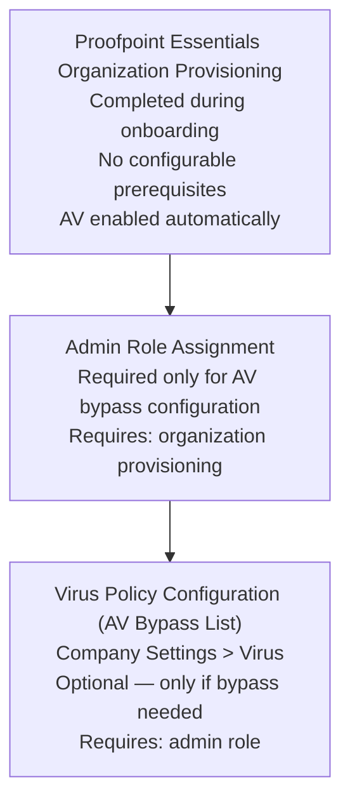

# Virus Policy Configuration — Prerequisites

## Dependency Chain

---

## Configuration Order

### 1. Proofpoint Essentials Organization Provisioning (~0 min — Proofpoint onboarding)

**What to configure:** Nothing. Anti-virus scanning is activated automatically when the organization is provisioned.
**Minimum viable config:** Organization tenant created.
**Source:** [A — S1]

**Key point:** AV protection is fully operational at this step with zero admin configuration. Steps 2 and 3 are only needed for AV bypass.

### 2. Admin Role Assignment (~2 min — only if AV bypass needed)

**Capability:** User Management
**What to configure:** Assign Organization Admin role to the configuring administrator.
**Minimum viable config:** At least one user with Organization Admin role.
**Source:** [A — S1]

### 3. Virus Policy Configuration — AV Bypass List (~2 min — optional)

**Ready when:** Steps 1 and 2 are complete.
**Workflow:** [workflow.md](workflow.md)
**Navigate to:** Company Settings > Virus
**What to configure:** AV Bypass Address entries for trusted senders whose mail is being incorrectly blocked.

---

## Total Time Estimate: ~4 minutes (only if bypass configuration is needed)

---

## Note on PPS/PoD

PPS/PoD virus module configuration has additional prerequisites (PPS deployment, module licensing). Those prerequisite details are INCOMPLETE — not documented in accessible grade-A sources. Virus module activation in PPS is covered in training material only [B — S2].
