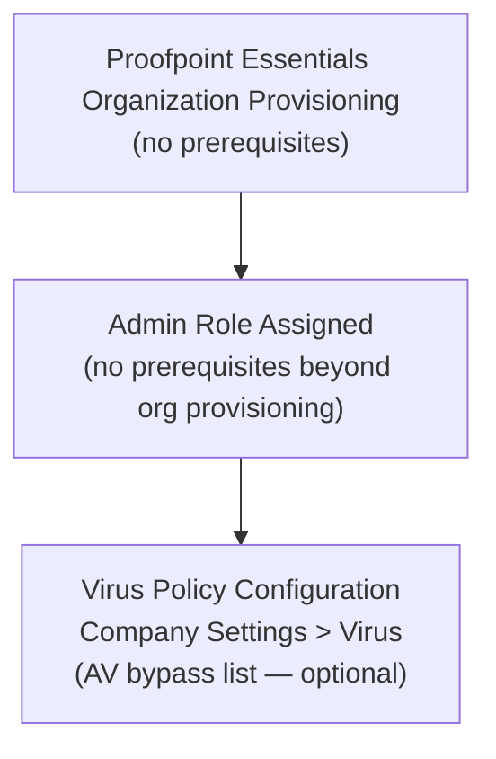
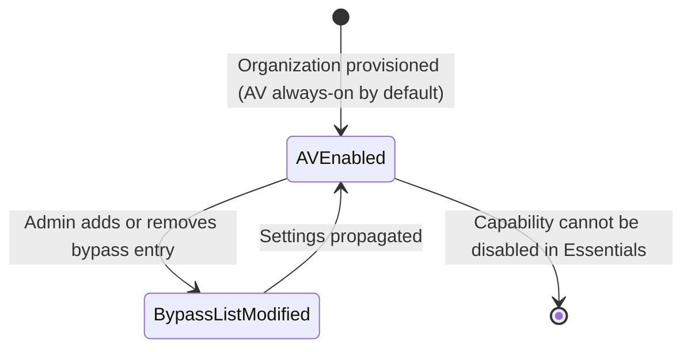

# Virus Policy Configuration — Workflow Reference

> Capability: virus | Product: Proofpoint (Essentials + PPS/PoD) | Generated: 2026-05-21
> Taxonomy groups: 4.1–4.4

---

## Overview

Virus Policy Configuration in Proofpoint Essentials is minimal by design: anti-virus (AV) scanning is enabled by default and cannot be disabled via the admin console. The sole configuration surface is an AV Bypass List that exempts specific senders or sender domains from AV scanning. In PPS/PoD, deeper multi-layer AV configuration exists including zero-hour anti-virus, engine management, and group-level encrypted file exception policies — but these configuration screens are behind the PPS authentication wall and are LOW coverage in available documentation.

**Complexity:** SIMPLE — One primary screen (Essentials), 1 configurable field (bypass address), no prerequisite chain beyond organizational provisioning.
**Prerequisite chain length:** 1 step (organizational provisioning).
**Total configurable fields documented:** 1 (Essentials, grade-A); PPS fields are LOW coverage.
**Screens involved:** 1 (Essentials); PPS screens INCOMPLETE.
**Evidence base:** 1 Grade A source [S1], 1 Grade B source [S2].

---

## Screen Hierarchy

```yaml
screen:
  name: "Company Settings > Virus"
  navigation: "Log in to Proofpoint Essentials admin console > Company Settings > Virus"
  parent: "Company Settings"
  type: page
  fields:
    - name: "AV Bypass Address"
      type: text
      required: false
      default: "None (empty list)"
      options: ["user@domain.com (specific sender)", "domain.com (all senders at domain)"]
      validation: "Valid email address or domain name. Format: user@domain.com OR domain.com"
      description: "Adds a sender address or sender domain to the AV bypass list. Messages from these senders are NOT scanned for viruses. Entries are additive — each entry adds one sender or domain."
      gotcha: "Adding a domain (e.g., partner.com) bypasses AV for ALL senders at that domain, including any spoofed or compromised accounts at that domain. Use individual email addresses rather than entire domains whenever possible."
  actions:
    - name: "Save"
      type: button
      result: "Adds the entered address/domain to the bypass list. Propagation time: 5–30 minutes (assumed, consistent with other Essentials settings — no specific citation for virus settings)."
    - name: "Remove"
      type: button
      result: "Removes selected entry from the bypass list"
  prerequisites:
    - "Organization provisioned on Proofpoint Essentials"
    - "Admin role required"
  decision_points:
    - condition: "Domain vs. email address entered"
      effect: "Domain bypasses all senders at that domain; email address bypasses only that specific sender"

screen:
  name: "PPS Virus Module — INCOMPLETE"
  navigation: "UNKNOWN — PPS admin console; exact path behind authentication wall"
  parent: "UNKNOWN"
  type: page
  fields:
    - name: "Multi-Layer Virus Protection"
      type: UNKNOWN
      required: UNKNOWN
      default: UNKNOWN
      description: "INCOMPLETE — PPS multi-layer virus protection configuration fields not documented in accessible sources. Training material [S2] confirms multi-layer AV and zero-hour anti-virus exist. Configuration screens not accessible."
    - name: "Zero-Hour Anti-Virus"
      type: UNKNOWN
      required: UNKNOWN
      default: UNKNOWN
      description: "INCOMPLETE — Zero-hour AV detects newly emerging viruses before signature databases are updated. Configuration options not documented in accessible sources. [B — S2]"
    - name: "Group-Level Encrypted File Exceptions"
      type: UNKNOWN
      required: UNKNOWN
      default: UNKNOWN
      description: "INCOMPLETE — PPS supports creating virus policies that allow specific groups to send encrypted files (which cannot be AV-scanned). Configuration workflow not accessible. [B — S2]"
  prerequisites:
    - "PPS on-premises or PoD deployment"
    - "Virus module licensed"
```

---

## Step-by-Step Walkthrough

### Step 1: Navigate to Virus Settings (Essentials)

**Navigate to:** Log in to Proofpoint Essentials admin console > Company Settings > Virus
**Screen:** Company Settings > Virus
**Purpose:** This is the only admin-facing virus configuration screen in Essentials. AV scanning is always active; the only configuration option is who to exempt from scanning.

### Step 2: Add AV Bypass Entries (Optional)

**Navigate to:** Same screen — AV Bypass Address text field
**Purpose:** Exempt specific trusted senders from AV scanning. Most appropriate use case: trusted business partners who send encrypted files that cannot be scanned.

| Field | Type | Required | Default | Description |
|-------|------|----------|---------|-------------|
| AV Bypass Address | Text | No | Empty | Sender email or domain to exempt from AV scan [A — S1] |

**Entry formats:**
- `user@partner.com` — bypasses AV only for this specific sender
- `partner.com` — bypasses AV for all senders at partner.com

**Decision point:** Domain-level bypass vs. address-level bypass:

| Option | Default | Implications | Recommended |
|--------|---------|-------------|-------------|
| Email address (user@domain.com) | N/A | Narrow scope — only this sender bypassed | Preferred — minimizes risk |
| Domain (domain.com) | N/A | Broad scope — all senders at this domain bypassed, including spoofed/compromised | Only when partner has many senders |

### Step 3: Save

**Navigate to:** Same screen > click Save
**Purpose:** Commits bypass list to Proofpoint.

Allow 5–30 minutes before testing (propagation time assumed consistent with other Essentials settings — exact time for virus settings not cited in grade-A source).

---

## Advanced Configuration

### PPS Multi-Layer Virus Protection (taxonomy item 4.2)

PPS provides multi-layer AV using multiple scanning engines for higher detection rates. Configuration is INCOMPLETE — admin guide behind authentication wall. Confirmed to exist: [B — S2]

### PPS Zero-Hour Anti-Virus (taxonomy item 4.3)

Zero-hour AV detects virus outbreaks before signature databases are updated by using heuristic analysis and behavioral patterns. Configuration options not documented in accessible sources. [B — S2]

### Group-Level Encrypted File Exceptions (taxonomy item 4.4)

PPS supports creating virus policies that allow specific groups to send encrypted files. This is the PPS equivalent of the Essentials AV Bypass List, but scoped to user groups and applicable to encrypted attachments. Configuration workflow INCOMPLETE — behind auth wall. [B — S2]

---

## Dependency Graph



### Prerequisite Chain (Ordered)

1. **Proofpoint Essentials Organization Provisioning** — completed by Proofpoint onboarding. AV scanning is enabled automatically; no admin action required to activate it. [A — S1]
2. **Admin Role Assignment** — required only if adding AV bypass entries.
3. **Virus Policy Configuration (AV Bypass List)** — optional. Only required if specific senders need AV exemption.

**Key insight:** Unlike spam settings, there is no threshold to configure and no default to override. AV scanning is always-on. The entire configuration surface is the bypass list, which starts empty and most organizations may never need to populate.

---

## Decision Points

| Screen | Decision | Options | Default | Implications | Recommended | Why |
|--------|----------|---------|---------|-------------|-------------|-----|
| Company Settings > Virus | Add bypass entries or not | Add entries / Leave empty | Empty | Non-empty list creates AV scan gaps | Leave empty unless specific need | AV bypass reduces security posture [A — S1] |
| AV Bypass Address | Domain vs. email address | domain.com / user@domain.com | N/A | Domain = broader bypass scope | Email address | Limits exposure to spoofed domain attacks |

---

## Object Lifecycle

Virus settings in Proofpoint Essentials are a persistent configuration state (bypass list entries). There is no draft/active/disabled lifecycle for the AV engine itself — it is always active.



---

## Integration Touchpoints

| Capability | Relationship | Direction | Notes |
|-----------|-------------|-----------|-------|
| [Email Filtering Policies](../email-filtering/workflow.md) | Virus scanning occurs before filter processing in message flow | Sequential (AV first) | Filter rules cannot override AV blocking — AV blocked messages do not reach filter evaluation [U — ASSUMPTION: standard email security architecture; not explicitly documented for Essentials] |
| [Spam Policy Configuration](../spam/workflow.md) | Parallel detection systems | Independent | AV bypass list does not affect spam scanning for the same sender |
| [Quarantine Management](../quarantine/workflow.md) | Virus-detected messages route to quarantine | Virus → Quarantine | Virus-quarantined messages are admin-only release by default [D — S19] |

---

## Complexity Score

| Dimension | Simple | Moderate | Complex | This Capability |
|-----------|--------|----------|---------|-----------------|
| Fields | 3-5 fields | 10-20 fields | 50+ fields | 1 field → SIMPLE |
| Screens | 1 screen | 2-3 screens | 4+ screens | 1 screen → SIMPLE |
| Dependencies | No prerequisites | 1-2 prerequisites | Chain of 3+ | 1 prerequisite → SIMPLE |

**Overall complexity: SIMPLE**
Justification: The Essentials virus configuration surface is a single text input on a single screen with one configurable field. AV is always-on by design. The PPS layer adds complexity but is LOW coverage and not the primary documented path.

---

## Sources

| # | Source | Grade | Used For |
|---|--------|-------|----------|
| S1 | Proofpoint Essentials Administrator Guide (2014) | A | AV bypass list field, navigation path, bypass behavior |
| S2 | Enterprise Protection for the Administrator Training Datasheet | B | PPS multi-layer AV, zero-hour AV, group-level policies existence |
| S19 | How to Manage the Quarantine Console (InventiveHQ) | D | Virus quarantine release restrictions |
