# Proofpoint — Configuration Dependency Graph

> Generated: 2026-05-21 | Capability scope: All 15 capability groups
> Covers the prerequisite hierarchy from organizational provisioning through final deployment/enforcement

---

## Full Dependency Graph (Mermaid)

```mermaid
graph TD
    subgraph "Layer 0: Organizational Provisioning"
        ORG["Proofpoint Essentials Org Provisioned<br/>OR PPS/PoD Deployment"]:::infra
        ADMIN["Admin Role Assigned"]:::infra
        ARCH_LIC["Add-On Licenses Provisioned<br/>(TAP, Encryption, Isolation, CASB,<br/>Archive, SAT — each separate)"]:::infra
    end

    subgraph "Layer 1: Foundation — Detection & Identity Objects"
        SPAM_THRESH["Spam Settings<br/>Security Settings > Email > Spam<br/>Complexity: SIMPLE | API: PARTIAL"]:::partial
        AV_BYPASS["AV Bypass List<br/>Company Settings > Virus<br/>Complexity: SIMPLE | API: GAP"]:::gap
        SAFE_BLOCK["Safe/Blocked Sender Lists<br/>Org-level + User-level<br/>Complexity: SIMPLE | API: PARTIAL"]:::partial
        DATA_CLASS["Data Classes / Detectors<br/>Endpoint DLP — classifiers<br/>Complexity: COMPLEX | API: GAP"]:::gap
        REALM["Realm Configuration<br/>Endpoint DLP scope container<br/>Complexity: COMPLEX | API: GAP"]:::gap
        CASB_CONN["CASB Cloud App Connectors<br/>SaaS + IaaS connectors<br/>Complexity: COMPLEX | API: GAP"]:::gap
        TAP_ENABLE["TAP URL Defense Enable<br/>Administration > Account Management<br/>Complexity: SIMPLE | API: GAP"]:::gap
        ISO_CONSOLE["Isolation Console Access<br/>Separate admin portal<br/>Complexity: MODERATE | API: GAP"]:::gap
        SAT_TEMPLATE["SAT Template Library<br/>Phishing + training templates<br/>Complexity: SIMPLE | API: GAP"]:::gap
        ARCHIVE_PROV["Archive Add-On Provisioned<br/>Via Proofpoint account team<br/>Complexity: SIMPLE | API: GAP"]:::gap
    end

    subgraph "Layer 2: Detection / Classification Logic"
        FILTER_POLICY["Email Filter Policies<br/>Security Settings > Email > Filter Policies<br/>Complexity: COMPLEX | API: PARTIAL"]:::partial
        EMAIL_DLP["Email DLP Rules<br/>Filter Policies with DLP conditions<br/>Complexity: COMPLEX | API: PARTIAL"]:::partial
        ADAPTIVE_DLP["Adaptive Email DLP<br/>Separate admin surface<br/>Complexity: COMPLEX | API: GAP"]:::gap
        DETECT_RULE["Endpoint Detection Rules<br/>Data Security > Rules<br/>Complexity: COMPLEX | API: GAP"]:::gap
        PREV_RULE["Endpoint Prevention Rules<br/>Data Security > Rules<br/>Complexity: COMPLEX | API: GAP"]:::gap
        PPS_FW_RULE["PPS Email Firewall Rules<br/>Email Firewall > Rules<br/>Complexity: COMPLEX | API: PARTIAL"]:::partial
        PPS_ROUTE["PPS Policy Routes<br/>System > Policy Route<br/>Complexity: COMPLEX | API: GAP"]:::gap
        TAP_URL_DEF["TAP URL Defense Config<br/>Group-level + exemptions<br/>Complexity: COMPLEX | API: GAP"]:::gap
        TAP_ATT_DEF["TAP Attachment Defense<br/>Group-level sandboxing<br/>Complexity: COMPLEX | API: GAP"]:::gap
        CASB_POLICY["CASB DLP + Threat Rules<br/>CASB admin console<br/>Complexity: COMPLEX | API: GAP"]:::gap
        ITM_SYSTEM["ITM System Policy Settings<br/>Configuration > System Policy<br/>Complexity: COMPLEX | API: GAP"]:::gap
        ITM_ALERT["ITM Alert Rules<br/>Configuration > Alerts<br/>Complexity: COMPLEX | API: GAP"]:::gap
        ITM_PREV["ITM Prevention Rules<br/>Configuration > Alerts > Prevent<br/>Complexity: COMPLEX | API: GAP"]:::gap
    end

    subgraph "Layer 3: Grouping / Containers"
        RULE_SET["Endpoint Rule Sets<br/>Data Security > Rule Sets<br/>Complexity: MODERATE | API: GAP"]:::gap
        QUAR_CATS["Quarantine Category Config<br/>Company Settings > Quarantine<br/>Complexity: MODERATE | API: PARTIAL"]:::partial
        QUAR_DIGEST["Quarantine Digest Config<br/>Company Settings > Quarantine > Digest<br/>Complexity: SIMPLE | API: PARTIAL"]:::partial
        QUAR_RETAIN["Quarantine Retention<br/>Company Settings > Quarantine > Retention<br/>Complexity: SIMPLE | API: PARTIAL"]:::partial
        ISO_REDIRECT["Isolation Redirect Rules<br/>Isolation Console > Policies<br/>Complexity: COMPLEX | API: GAP"]:::gap
        ENCRYPT_FILTER["Encryption Filter<br/>Filter Policies (Outbound+Company scope)<br/>Complexity: COMPLEX | API: PARTIAL"]:::partial
    end

    subgraph "Layer 4: Policies"
        AGENT_POLICY["Endpoint Agent Policy<br/>Data Security > Agent Policies<br/>Complexity: COMPLEX | API: PARTIAL"]:::partial
        ARCHIVE_RETAIN["Archive Retention Policy<br/>Archive Settings > Retention<br/>Complexity: SIMPLE | API: GAP"]:::gap
        ARCHIVE_HOLD["Archive Legal Hold<br/>Archive Settings > Legal Hold<br/>Complexity: SIMPLE | API: GAP"]:::gap
        SAT_ASSIGN["SAT Training Assignment<br/>Security Awareness > Assignments<br/>Complexity: COMPLEX | API: GAP"]:::gap
        SAT_PHISH["SAT Phishing Campaign<br/>Security Awareness > Campaigns<br/>Complexity: COMPLEX | API: GAP"]:::gap
        ISO_BROWSE["Isolation Browsing Policies<br/>Isolation Console > Policies<br/>Complexity: COMPLEX | API: GAP"]:::gap
        VAP_LIST["TAP VAP/VIP List<br/>TAP Dashboard<br/>Complexity: MODERATE | API: GAP"]:::gap
    end

    subgraph "Layer 5: Deployment / Assignment"
        AGENT_ASSIGN["Endpoint Agent Deployment<br/>Agent Policy > Realm Assignment<br/>Complexity: MODERATE | API: PARTIAL"]:::partial
        TAP_VAP_ISO["VAP List Import to Isolation<br/>MANUAL — no auto-sync<br/>Complexity: MODERATE | API: GAP"]:::gap
        QUAR_MGMT["Quarantine Management<br/>Admin review + release<br/>Complexity: MODERATE | API: PARTIAL"]:::partial
    end

    %% Layer 0 -> Layer 1
    ORG --> ADMIN
    ORG --> ARCH_LIC
    ADMIN --> SPAM_THRESH
    ADMIN --> AV_BYPASS
    ADMIN --> SAFE_BLOCK
    ARCH_LIC --> DATA_CLASS
    ARCH_LIC --> CASB_CONN
    ARCH_LIC --> TAP_ENABLE
    ARCH_LIC --> ISO_CONSOLE
    ARCH_LIC --> SAT_TEMPLATE
    ARCH_LIC --> ARCHIVE_PROV

    %% Layer 0 -> Layer 1 (Data Security / Endpoint)
    ARCH_LIC --> REALM

    %% Layer 1 -> Layer 2
    SPAM_THRESH --> FILTER_POLICY
    SAFE_BLOCK --> FILTER_POLICY
    ADMIN --> FILTER_POLICY
    FILTER_POLICY --> EMAIL_DLP
    FILTER_POLICY --> ENCRYPT_FILTER
    ADMIN --> ADAPTIVE_DLP
    DATA_CLASS --> DETECT_RULE
    DATA_CLASS --> PREV_RULE
    REALM --> DETECT_RULE
    REALM --> PREV_RULE
    ADMIN --> PPS_FW_RULE
    PPS_ROUTE --> PPS_FW_RULE
    TAP_ENABLE --> TAP_URL_DEF
    TAP_ENABLE --> TAP_ATT_DEF
    CASB_CONN --> CASB_POLICY
    ADMIN --> ITM_SYSTEM
    ITM_SYSTEM --> ITM_ALERT
    ITM_SYSTEM --> ITM_PREV

    %% Layer 2 -> Layer 3
    DETECT_RULE --> RULE_SET
    PREV_RULE --> RULE_SET
    FILTER_POLICY --> QUAR_CATS
    FILTER_POLICY --> QUAR_DIGEST
    FILTER_POLICY --> QUAR_RETAIN
    ISO_CONSOLE --> ISO_REDIRECT
    TAP_URL_DEF --> ISO_REDIRECT
    FILTER_POLICY --> ENCRYPT_FILTER

    %% Layer 3 -> Layer 4
    RULE_SET --> AGENT_POLICY
    ARCHIVE_PROV --> ARCHIVE_RETAIN
    ARCHIVE_RETAIN --> ARCHIVE_HOLD
    SAT_TEMPLATE --> SAT_ASSIGN
    SAT_TEMPLATE --> SAT_PHISH
    ISO_REDIRECT --> ISO_BROWSE
    TAP_ATT_DEF --> VAP_LIST
    TAP_URL_DEF --> VAP_LIST

    %% Layer 4 -> Layer 5
    AGENT_POLICY --> AGENT_ASSIGN
    VAP_LIST --> TAP_VAP_ISO
    ISO_BROWSE --> TAP_VAP_ISO
    QUAR_CATS --> QUAR_MGMT
    QUAR_DIGEST --> QUAR_MGMT
    QUAR_RETAIN --> QUAR_MGMT

    classDef infra fill:#3498db,stroke:#2980b9,color:#fff
    classDef gap fill:#8b0000,color:#fff
    classDef partial fill:#b8860b,color:#fff
    classDef full fill:#2d6a2d,color:#fff
```



**Legend:**
- Blue = Infrastructure / provisioning prerequisite
- Dark red = No API coverage (console-only)
- Gold = Partial API coverage (some operations automatable)
- Dark green = Full API coverage

---

## Dependency Matrix

| Object | Layer | Depends On | Required By | API Coverage |
|--------|-------|-----------|-------------|--------------|
| Proofpoint Org Provisioned | 0 | (none) | Everything | N/A |
| Admin Role | 0 | Org | All configuration | N/A |
| Add-On Licenses | 0 | Org | TAP, Encryption, Isolation, CASB, Archive, SAT, Data Security | N/A |
| Spam Settings | 1 | Admin | Filter Policies | PARTIAL |
| AV Bypass List | 1 | Admin | (standalone) | GAP |
| Safe/Blocked Sender Lists | 1 | Admin | Filter Policies | PARTIAL |
| Data Classes / Detectors | 1 | Data Security license | Detection Rules, Prevention Rules | GAP |
| Realm Configuration | 1 | Data Security license | Detection Rules, Prevention Rules | GAP |
| CASB Connectors | 1 | CASB license | CASB Policies | GAP |
| TAP URL Defense Enable | 1 | TAP license | TAP URL Defense Config | GAP |
| Isolation Console Access | 1 | Isolation license | Isolation Redirect Rules | GAP |
| SAT Template Library | 1 | SAT license | SAT Assignments, SAT Campaigns | GAP |
| Archive Add-On | 1 | Archive license | Archive Retention | GAP |
| Email Filter Policies | 2 | Spam Settings, Admin | Email DLP, Encryption Filter, Quarantine config | PARTIAL |
| Email DLP Rules | 2 | Filter Policies | Quarantine Management | PARTIAL |
| Adaptive Email DLP | 2 | Admin + Adaptive license | (standalone enforcement) | GAP |
| Endpoint Detection Rules | 2 | Data Classes, Realm | Rule Sets | GAP |
| Endpoint Prevention Rules | 2 | Data Classes, Realm | Rule Sets | GAP |
| PPS Email Firewall Rules | 2 | PPS Policy Routes, Admin | Quarantine Folders | PARTIAL |
| PPS Policy Routes | 2 | Admin | PPS Firewall Rules | GAP |
| TAP URL Defense Config | 2 | TAP Enable | Isolation Redirect Rules, VAP List | GAP |
| TAP Attachment Defense | 2 | TAP Enable | VAP List | GAP |
| CASB DLP + Threat Rules | 2 | CASB Connectors | (enforcement) | GAP |
| ITM System Policy Settings | 2 | Admin | ITM Alert Rules, ITM Prevention Rules | GAP |
| ITM Alert Rules | 2 | ITM System Policy | (enforcement) | GAP |
| ITM Prevention Rules | 2 | ITM System Policy | (enforcement) | GAP |
| Endpoint Rule Sets | 3 | Detection Rules, Prevention Rules | Agent Policy | GAP |
| Quarantine Category Config | 3 | Filter Policies | Quarantine Management | PARTIAL |
| Quarantine Digest Config | 3 | Quarantine Categories | Quarantine Management | PARTIAL |
| Quarantine Retention | 3 | Quarantine Categories | Quarantine Management | PARTIAL |
| Isolation Redirect Rules | 3 | TAP URL Defense, Isolation Console | Isolation Browsing Policies | GAP |
| Encryption Filter | 3 | Filter Policies (Outbound + Company) | (enforcement) | PARTIAL |
| Endpoint Agent Policy | 4 | Rule Sets | Agent Deployment | PARTIAL |
| Archive Retention Policy | 4 | Archive Add-On | Archive Legal Hold | GAP |
| Archive Legal Hold | 4 | Archive Retention | (supersedes retention) | GAP |
| SAT Training Assignment | 4 | SAT Templates | (enforcement) | GAP |
| SAT Phishing Campaign | 4 | SAT Templates | (enforcement) | GAP |
| Isolation Browsing Policies | 4 | Redirect Rules | VAP List Import | GAP |
| TAP VAP/VIP List | 4 | TAP URL + Attachment Defense | VAP List Import to Isolation | GAP |
| Endpoint Agent Deployment | 5 | Agent Policy | (terminal) | PARTIAL |
| VAP List Import to Isolation | 5 | VAP List, Isolation Browsing | (terminal — MANUAL) | GAP |
| Quarantine Management | 5 | Quarantine Config | (terminal — admin review) | PARTIAL |

---

## DAG Validation

### Cycle Check
No cycles detected. All dependency edges flow from lower to higher layer numbers. Validated dependency chains:

1. Org → Admin → Filter Policy → Email DLP → Quarantine Management (valid DAG path)
2. Org → Archive License → Archive Add-On → Retention Policy → Legal Hold (valid DAG path)
3. Org → Data Security License → Data Classes → Detection Rules → Rule Sets → Agent Policy → Agent Deployment (valid DAG path)
4. Org → TAP License → TAP Enable → URL Defense Config → ISO Redirect Rules → Browsing Policies → VAP Import (valid DAG path)
5. Org → Admin → PPS Routes → PPS Firewall Rules (valid DAG path; note: PPS Routes and Essentials Filter Policies are parallel paths)

### Orphan Check
- All Layer 1 nodes have at least one incoming edge from Layer 0
- All Layer 2-5 nodes have at least one incoming edge from the layer above
- No orphan nodes detected

### Completeness Check
All 14 capability groups from the taxonomy are represented in the graph:
- Email Filtering (Layer 2: Filter Policy) — PRESENT
- PPS/PoD Rules (Layer 2: PPS Firewall Rules + Routes) — PRESENT
- Spam Policy (Layer 1: Spam Settings) — PRESENT
- Virus Policy (Layer 1: AV Bypass List) — PRESENT
- Email DLP (Layer 2: Email DLP Rules) — PRESENT
- Email Encryption (Layer 3: Encryption Filter) — PRESENT
- TAP (Layer 2: TAP URL + Attachment Defense) — PRESENT
- ITM/ObserveIT (Layer 2: ITM System Policy + Rules) — PRESENT
- Endpoint DLP (Layer 2: Detection/Prevention Rules + Layer 3: Rule Sets) — PRESENT
- CASB (Layer 2: CASB Policies) — PRESENT
- Isolation (Layer 3-4: Redirect Rules + Browsing Policies) — PRESENT
- SAT (Layer 4: SAT Assignments + Campaigns) — PRESENT
- Quarantine Management (Layer 3: Quarantine config + Layer 5: Management) — PRESENT
- Archive (Layer 4: Retention + Legal Hold) — PRESENT

### Critical Missing Prerequisites (Flagged Gaps)
1. **CASB Connector OAuth scopes not documented** — must provision connectors but required OAuth permissions undocumented
2. **Isolation Console URL not in public docs** — admins must receive URL from Proofpoint account team at provisioning
3. **PPS Policy Route names** — exact inbound route name (`default_inbound`) must be confirmed before creating Firewall Rules; varies by deployment
4. **TAP admin guide behind auth wall** — TAP URL Defense and Attachment Defense configuration fields cannot be fully mapped from public sources
5. **Archive capture scope** — whether Archive captures messages at MTA level (before quarantine) or only delivered messages is undocumented in accessible sources

---

## Longest Prerequisite Chain (Critical Path)

TAP + Isolation + DLP integration (9 steps):

```
Org Provisioned
  → TAP License + Isolation License + Data Security License
    → TAP URL Defense Enabled (Administration > Account Management)
      → TAP URL Defense Config (group-level, per-rule enablement)
        → TAP VAP/VIP List (TAP Dashboard — ongoing maintenance)
          → Isolation Console Access (separate portal)
            → Isolation Redirect Rules (redirect URL categories to isolation)
              → Isolation Browsing Policies (per-group controls)
                → Isolation DLP Integration (Enterprise DLP must be configured)
                  → VAP List Manual Import (MANUAL — no auto-sync)
```

This 9-step chain with multiple cross-product dependencies and a manual final step is the most complex configuration path in the entire Proofpoint portfolio covered here.

---

## Recommended Configuration Order (First-Deployment Sequence)

| Phase | Capability | Layer | Est. Time | Blocker If Skipped |
|-------|-----------|-------|-----------|-------------------|
| 1 | Organization provisioning + admin role | 0 | Via PP team | Nothing works |
| 2 | Spam Settings threshold | 1 | 15 min | Spam volume uncontrolled |
| 3 | AV Bypass List (if needed) | 1 | 5 min | Can skip if no trusted encrypted-file senders |
| 4 | Safe/Blocked Sender Lists | 1 | 15-30 min | False positives and negatives in filters |
| 5 | Email Filter Policies (pilot scope) | 2 | 1-3 hrs | No content-based email control |
| 6 | Quarantine Management config | 3 | 30 min | Quarantine unmanageable; users not notified |
| 7 | Encryption Filter (if needed) | 3 | 30 min | Requires Outbound + Company scope filter |
| 8 | Archive Retention (if licensed) | 4 | 15 min | Default 12mo retention too short for compliance |
| 9 | TAP URL Defense Enable | 1 | 5 min | URL Defense silently inactive after provisioning |
| 10 | TAP per-group config + exemptions | 2 | 30-60 min | TAP fires for all users without per-group scoping |
| 11 | Data Classes + Realms (if licensed) | 1 | 2-4 hrs | Endpoint DLP cannot be configured |
| 12 | Detection + Prevention Rules | 2 | 2-6 hrs | No endpoint DLP enforcement |
| 13 | Rule Sets | 3 | 30 min | Rules fire on no agents |
| 14 | Agent Policies | 4 | 1-2 hrs | Rules not delivered to endpoints |
| 15 | CASB Connectors + Policies (if licensed) | 1-2 | 2-4 hrs | No cloud app visibility |
| 16 | Isolation Console setup (if licensed) | 1-4 | 2-4 hrs | TAP VAPs unprotected by isolation |
| 17 | SAT Assignments + Campaigns (if licensed) | 4 | 1-3 hrs | No security awareness training |
| 18 | ITM System Policy + Rules (if licensed) | 2 | 2-4 hrs | No insider threat monitoring |
