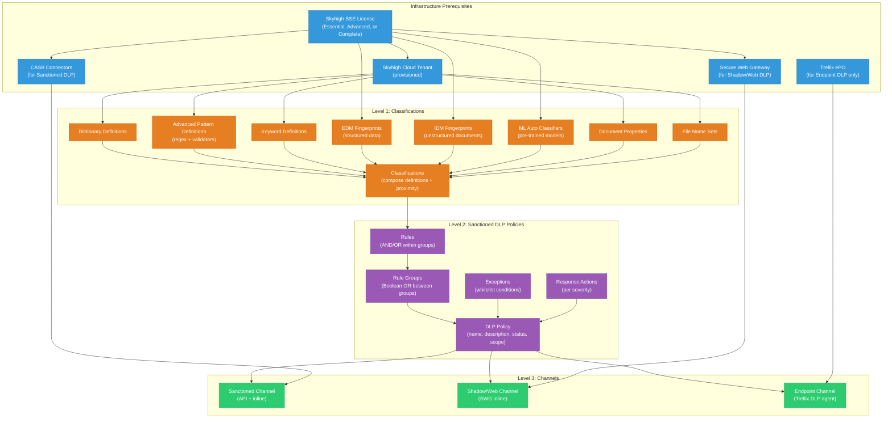

# Authoring Policies -- Dependency Chain & Prerequisites
## Skyhigh Security DLP (SSE Platform)

> Capability: authoring-policies | Generated: 2026-05-21

---

## Dependency Graph



---

## Ordered Configuration Sequence

### Phase 0: Infrastructure (Before Any Policy Work)

| # | Prerequisite | What It Is | What Happens If Missing |
|---|-------------|-----------|------------------------|
| 0.1 | **Skyhigh SSE License** | Skyhigh Security Service Edge subscription (Essential, Advanced, or Complete tier) | DLP features may be limited or unavailable depending on tier. Advanced DLP (EDM, IDM, ML classifiers) requires Advanced or Complete tier |
| 0.2 | **Skyhigh Cloud Tenant** | Provisioned Skyhigh Security cloud tenant | No access to Skyhigh Dashboard; cannot create classifications or policies |
| 0.3 | **CASB Connectors** (for Sanctioned DLP) | API connectors to sanctioned cloud services (M365, Google Workspace, Box, Salesforce, etc.) | Sanctioned DLP scanning cannot inspect cloud service content |
| 0.4 | **Secure Web Gateway** (for Shadow/Web DLP) | Skyhigh SWG deployed and traffic routed through it | Shadow IT and web DLP cannot inspect browser/web traffic |
| 0.5 | **Trellix ePO** (for Endpoint DLP) | Trellix ePolicy Orchestrator with DLP Endpoint agent deployed | Endpoint DLP is not available; only cloud DLP (CASB/SWG) functions |

### Phase 1: Classifications (Foundation)

| # | Item | Depends On | What It Provides | What Happens If Missing |
|---|------|-----------|-----------------|------------------------|
| 1.1 | **Classification Definitions** (Dictionary, Advanced Pattern, Keyword, Doc Properties, File Name, File Size, True File Type) | Tenant (0.2) | Building blocks that identify sensitive content patterns | Cannot create meaningful classifications; rules have nothing to match |
| 1.2 | **EDM Fingerprints** (optional) | Advanced/Complete License + DLP Integrator tool | Exact matching against structured records (database exports) | Cannot detect specific database records; regex-only has higher FP |
| 1.3 | **IDM Fingerprints** (optional) | Advanced/Complete License + IDMTrain tool | Unstructured document fingerprinting for proprietary documents | Cannot detect copies/derivatives of specific sensitive documents |
| 1.4 | **ML Auto Classifiers** (optional) | Advanced/Complete License | Pre-trained ML models for text + image classification | Must rely on regex/dictionary only; no AI-assisted detection |
| 1.5 | **Classifications** | At least one definition type (1.1) | Named, reusable classification objects with match criteria and proximity | Rules cannot reference detection logic; policies have no content criteria |

**Minimum viable:** One classification (1.5) using a built-in definition (e.g., predefined Credit Card regex) is sufficient for a first policy.

### Phase 2: Sanctioned DLP Policies

| # | Item | Depends On | What It Provides | What Happens If Missing |
|---|------|-----------|-----------------|------------------------|
| 2.1 | **Rules** (at least one) | Classifications (1.5) | Match criteria with severity level | Policy has no detection logic |
| 2.2 | **Rule Groups** (at least one) | Rules (2.1) | Boolean containers; multiple rule groups combined with OR | Cannot compose complex detection logic |
| 2.3 | **Exceptions** (optional) | Rule types (same as rules) | Whitelist conditions to exclude specific matches | All matches trigger; no way to exclude known good |
| 2.4 | **Response Actions** | Policy (2.5) | What happens on match (alert, block, quarantine, encrypt) | No enforcement action; detections have no consequence |
| 2.5 | **DLP Policy** | Rule Groups (2.2) + Response Actions (2.4) | Complete policy object ready for channel assignment | No enforcement container; classifications and rules exist but are not active |

### Phase 3: Channel Assignment

| # | Item | Depends On | What It Provides | What Happens If Missing |
|---|------|-----------|-----------------|------------------------|
| 3.1 | **Enable policy on Sanctioned channel** | Policy (2.5) + CASB Connectors (0.3) | DLP inspection of sanctioned cloud service content | Cloud services are unmonitored |
| 3.2 | **Enable policy on Shadow/Web channel** | Policy (2.5) + SWG (0.4) | DLP inspection of web/shadow IT traffic | Web browsing and shadow IT data unmonitored |
| 3.3 | **Sync policy to Endpoint channel** | Policy (2.5) + Trellix ePO (0.5) | DLP inspection of desktop application activity | Endpoint data movements unmonitored |

---

## Fast-Path: Using Policy Templates

Skyhigh provides pre-built policy templates (GDPR, HIPAA, PCI, GLBA, SOX) that include pre-configured classifications and rules:

```
Infrastructure (Phase 0)
    |
    v
Select a Policy Template (Phase 2 -- includes Phase 1 pre-configured)
    |
    v
Customize rules and thresholds
    |
    v
Set Response Actions
    |
    v
Enable on channels (Phase 3)
```

This skips manual classification creation entirely.

---

## License Tier Impact on DLP Features

| Feature | Essential | Advanced | Complete |
|---------|-----------|----------|----------|
| Basic classifications (Dictionary, Regex, Keyword) | Yes | Yes | Yes |
| Sanctioned DLP policies | Yes | Yes | Yes |
| Shadow/Web DLP policies | Yes | Yes | Yes |
| EDM fingerprints | No | Yes | Yes |
| IDM fingerprints | No | Yes | Yes |
| ML Auto Classifiers | No | Yes | Yes |
| AI RegEx Generator | No | Yes | Yes |
| Endpoint DLP (Trellix) | No | No | Yes |
| Advanced incident management | No | Yes | Yes |

---

## Prerequisite Verification Checklist

```
[ ] Skyhigh Dashboard accessible: https://<tenant>.myshn.net
[ ] DLP module visible: Policy > DLP Policy appears in navigation
[ ] At least one CASB connector active: Settings > Service Management shows connected services
[ ] SWG deployed and traffic routing confirmed (for Shadow/Web DLP)
[ ] Built-in classifications visible: Policy > DLP Policy > Classifications shows predefined items
[ ] Your account has DLP Administrator role
[ ] (For EDM) DLP Integrator v6.4.0+ installed on secure server
[ ] (For IDM) IDMTrain tool available on Windows or Linux
[ ] (For Endpoint DLP) Trellix ePO accessible with DLP extension installed
```
