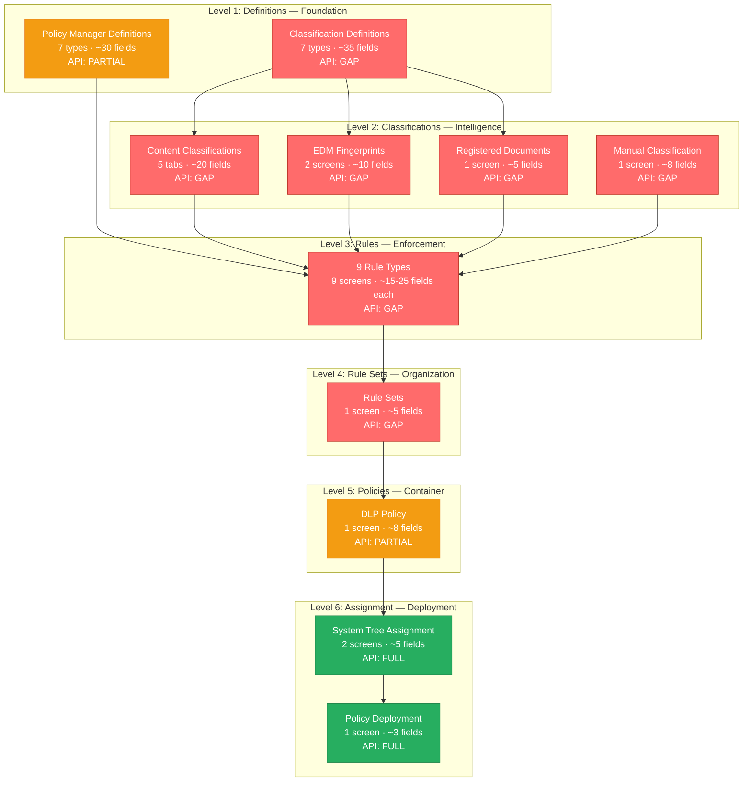

# Product Workflow Intelligence: Trellix DLP
> Generated: 2026-05-21 | Capability: Authoring Policies | Depth: deep

## At a Glance

| Metric | Value |
|--------|-------|
| Capabilities documented | 1 (Authoring Policies) |
| Configuration levels | 6 (Definitions > Classifications > Rules > Rule Sets > Policies > Assignment) |
| Total screens | 33 (7 classification definition types + 7 policy manager definition types + 4 classification screens + 9 rule type screens + 1 rule set + 2 policy screens + 3 assignment/deployment screens) |
| Total configuration fields | ~145 (across all screens, including type-specific rule fields) |
| API endpoints | 25 (11 ePO Web API commands + 7 DLP Server REST + 5 DLP SaaS + 2 Cloud Gateway) |
| API surfaces | 4 (ePO On-Prem REST, DLP Server REST, DLP SaaS REST, OpenDXL Message Bus) |
| API coverage | 47% (14 of 30 operations automatable; 16 console-only including all core authoring) |
| Rule types | 9 (Email, Web, Cloud, Removable Storage, Network Share, Network Comm, Clipboard, Printer, App File Access) |
| Reactions available | 9 (No Action, Monitor, Block, Encrypt, Quarantine, Request Justification, Notify User, Apply RM Policy, Redirect) |
| Personas identified | 2 (Policy Administrator, SOC Analyst) |
| Known gotchas | 25 (5 critical, 5 deployment, 3 API/automation, 3 operational, 5 tribal knowledge, 4 documentation gaps) |
| Videos analyzed | 53 (30 official Trellix + 5 recent/marketing + 12 Jay Appell community + 6 McAfee legacy) |
| Sources consulted | 75 documentation + 53 video + 25 API references (Grade A: 65, B: 4, C: 3, D: 2, E: 1) |

## Complexity Assessment

**Rating: COMPLEX**

**Justification:**
- 6-level dependency hierarchy where each level must be configured before the next
- 9 distinct rule types, each with channel-specific conditions and varying reaction availability
- 2 separate definition namespaces (Classification Definitions vs Policy Manager Definitions) that are invisible to each other -- the single most common source of admin confusion
- Boolean logic with score thresholds and occurrence counts in classification criteria
- Multiple prerequisite infrastructure components (ePO server, LDAP, DLP extensions, Trellix Agent, DLP Endpoint Agent, evidence storage)
- EDM (Exact Data Matching) requires external command-line tooling (EDMTrain) outside the console
- Agent communication interval (default 60 min) adds latency to every policy change test cycle

**Estimated first-time configuration:**
- With pre-built compliance templates: **45-60 minutes**
- Custom single-channel policy from scratch: **2-3 hours**
- Full multi-channel policy with EDM and custom definitions: **1-2 days**
- Production-ready policy suite across all channels: **1-2 weeks** (includes monitoring phase)

## Configuration Hierarchy



**Legend:** Red = No API (console only) | Orange = Partial API | Green = Full API coverage

## Key Findings

1. **Dual definition namespaces** -- Classification Definitions and Policy Manager Definitions are separate and invisible to each other. Definitions created in the wrong context cannot be found when configuring a classification or rule. This is the #1 source of admin confusion confirmed across documentation, community forums, and video tutorials.

2. **Policy authoring is 100% console-only** -- No API exists for creating definitions, classifications, rules, or rule sets. Only the "last mile" (policy deployment, definition list imports, incident retrieval) has API coverage. The entire "author a policy from scratch" workflow is blocked at every step except final deployment. DLP-as-code is not possible.

3. **User-scoping is rule-level only** -- DLP policies are assigned to systems via the ePO System Tree, NOT to users. ePO's user-based policy assignment rules explicitly do not work with DLP. User targeting requires End-User Groups configured within individual rules, referencing Active Directory groups.

4. **RE2 regex engine** -- Trellix DLP does NOT use PCRE. Negative lookahead (`(?!...)`), lookbehind (`(?<=...)`), and backreferences are unsupported. Patterns imported from other DLP products or regex testers will silently fail if they use these features.

5. **Shared classification engine across endpoint and network** -- A single email/web protection policy created in ePO enforces on both the endpoint agent (Outlook/browser plugin) and the network appliance (SMTP/HTTP gateway). No need to create duplicate rules.

6. **Pre-built compliance templates collapse the dependency chain** -- GDPR, HIPAA, PCI-DSS, SOX, NIST, ISO 27001, and SOC 2 templates include pre-configured definitions, classifications, and rules. Using templates skips Levels 1-3 entirely, reducing first policy from hours to under 60 minutes.

7. **Phased deployment is critical** -- Trellix Professional Services recommends: Discovery (classification only) > Monitor (all rules, no blocking) > Educate (request justification) > Enforce (block) > Optimize. Deploying blocking rules directly to production causes business disruption and executive escalations.

8. **Agent communication interval creates testing lag** -- The default ASCI of 60 minutes means policy changes take up to an hour to reach endpoints unless administrators explicitly use "Wake Up Agents" with force policy push. This significantly slows iterative policy development.

## Critical API Gaps

| # | Operation | Impact | What It Blocks | Competitive Opportunity |
|---|-----------|--------|---------------|------------------------|
| 1 | Create/edit classifications | CRITICAL | Cannot define "what is sensitive data" programmatically | API-first classification CRUD with version control integration |
| 2 | Create/edit data protection rules | CRITICAL | Cannot create enforcement logic via API | Full rule CRUD with OpenAPI spec and Terraform provider |
| 3 | Create/edit rule sets | CRITICAL | Cannot organize rules programmatically | Policy-as-code with Git-backed rule set management |
| 4 | Create regex/pattern definitions | HIGH | Cannot automate pattern library updates from threat feeds | Definition API with bulk import/export and regex validation |
| 5 | Enable/disable individual rules | HIGH | Cannot toggle rules for incident response automation | Rule state API enabling automated response playbooks |

**Bottom line:** A competing product offering API-first policy authoring would have a decisive differentiation advantage. Trellix's API gap means no CI/CD for policies, no version-controlled policy management, no multi-tenant templating, and no automated incident response that modifies policy state.

## Persona Summaries

### Policy Administrator
The primary user of the policy authoring capability. Works across all 6 configuration levels daily, from creating regex patterns and keyword dictionaries to deploying policies across the ePO System Tree. Spends 60-90 minutes creating a complete policy from scratch. Pain points center on the dual definition namespace confusion, lack of API for repeatable deployments, and the 60-minute agent communication delay during testing. See [personas/policy-administrator.md](personas/policy-administrator.md).

### SOC Analyst
A secondary consumer of DLP policy output. Does not author policies but triages DLP incidents, reviews evidence, and escalates to Policy Administrators when rule tuning is needed. Interacts with DLP Incident Manager, ePO Queries & Reports, and the incident REST API. Better served by the API (incident retrieval is fully automatable) but frustrated by inability to programmatically disable rules during active incidents. See [personas/soc-analyst.md](personas/soc-analyst.md).

## Files in This Package

```
trellix-dlp/
  OVERVIEW.md                                    <-- This file (entry point)
  dependency-graph.md                            <-- Full Mermaid dependency graph + topological sort
  capabilities/
    authoring-policies/
      workflow.md                                <-- Complete screen-by-screen workflow (6 levels, 33 screens, ~145 fields)
      gotchas.md                                 <-- 25 known limitations and tribal knowledge items
      prerequisites.md                           <-- Dependency chain and prerequisite verification checklist
  personas/
    policy-administrator.md                      <-- Policy Administrator workflow narrative
    soc-analyst.md                               <-- SOC Analyst incident response workflow
  reference/
    sources.md                                   <-- All sources organized by evidence grade
    integration-map.md                           <-- Inbound, outbound, and bidirectional integrations
  research/
    doc-corpus.md                                <-- 75 documentation sources with extraction notes
    video-intelligence.md                        <-- 53 video analyses with workflow extractions
    api-intelligence.md                          <-- 4 API surfaces, 25 endpoints, coverage matrix
  screens/
    (reserved for future screen capture analysis)
```

## Recommended Next Steps

- Review `capabilities/authoring-policies/workflow.md` for the complete screen-by-screen guide across all 6 configuration levels
- Check `capabilities/authoring-policies/gotchas.md` for 25 known limitations, with 14 rated HIGH or CRITICAL impact
- Use `reference/sources.md` to verify claims -- Grade U (ASSUMPTION) items need verification against official docs
- Review `dependency-graph.md` for the topologically sorted configuration order and cross-level dependencies
- Run `/research --domain="DLP"` to build competitive analysis using these workflow insights
- Run `/init` to start building a product informed by these workflows
