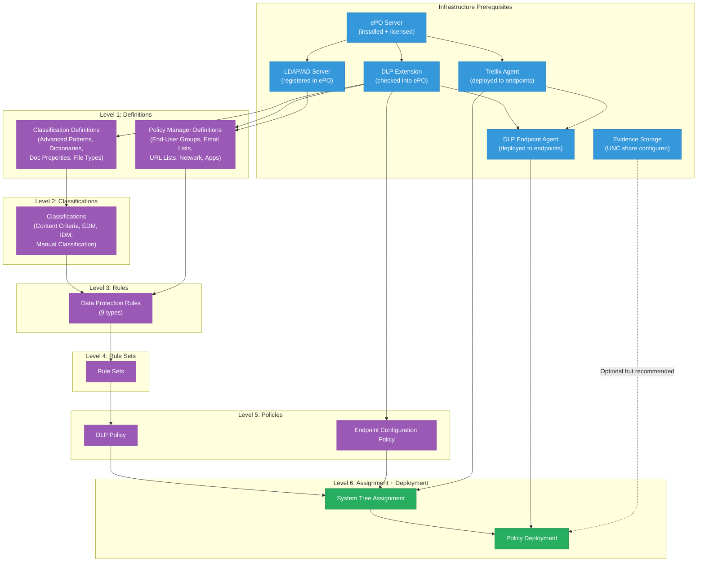

# Authoring Policies -- Dependency Chain & Prerequisites
## Trellix DLP (ePO-managed, version 11.x)

> Capability: authoring-policies | Generated: 2026-05-21

---

## Dependency Graph



---

## Ordered Configuration Sequence

Configure these items in this order. Each step depends on all prior steps being complete.

### Phase 0: Infrastructure (Before Any Policy Work)

| # | Prerequisite | What It Is | What Configures It | What Happens If Missing |
|---|-------------|-----------|-------------------|------------------------|
| 0.1 | **ePO Server** | Trellix ePolicy Orchestrator management server | ePO installer (separate product) | Nothing works -- ePO is the management platform for all Trellix products |
| 0.2 | **DLP Extension** | DLP product module installed into ePO | Menu > Software > Extensions > Install Extension > upload DLP .zip | DLP Policy Manager, Classification, and all policy authoring screens do not appear in the ePO console |
| 0.3 | **LDAP/AD Server Registration** | Active Directory server registered in ePO for user/group lookups | Menu > Configuration > Registered Servers > Add > LDAP Server | End-User Groups cannot reference AD groups; user-based rule scoping is limited to manual SID entry |
| 0.4 | **Trellix Agent** | Base management agent on each endpoint | ePO > Menu > Software > Deployment > deploy Trellix Agent package | Endpoints cannot communicate with ePO; no policy delivery possible |
| 0.5 | **DLP Endpoint Agent** | DLP-specific agent running on endpoints | ePO > Menu > Software > Deployment > deploy DLP Endpoint package | Endpoints do not enforce DLP policies even if assigned; rules are not active |
| 0.6 | **Evidence Storage (Optional)** | UNC file share for storing evidence copies of policy violations | DLP Endpoint Configuration policy > Evidence Server Path | "Store Original Evidence" option in rules will fail; evidence cannot be reviewed in DLP Incident Manager |

### Phase 1: Definitions (Foundation)

| # | Item | Depends On | What It Provides | What Happens If Missing |
|---|------|-----------|-----------------|------------------------|
| 1.1 | **Classification Definitions** (Advanced Patterns, Dictionaries, Doc Properties, File Types) | DLP Extension (0.2) | Building blocks for classifications -- patterns, keyword lists, file type groups | Cannot create meaningful classifications; classification criteria have nothing to reference |
| 1.2 | **Policy Manager Definitions** (End-User Groups, Email Lists, URL Lists, Network Defs, App Templates) | DLP Extension (0.2), LDAP (0.3 -- for End-User Groups) | Source/destination conditions for rules -- who, where, which apps | Rules apply to ALL users, ALL destinations, ALL applications (no scoping); no user-based filtering |

**Minimum viable:** You can skip 1.2 entirely for a first policy. Rules will apply globally (all users, all destinations). End-User Groups specifically require LDAP (0.3).

### Phase 2: Classifications

| # | Item | Depends On | What It Provides | What Happens If Missing |
|---|------|-----------|-----------------|------------------------|
| 2.1 | **Content Classifications** | Classification Definitions (1.1) | Named, reusable "what to protect" objects that rules reference | Rules have nothing to match against; no content detection occurs |
| 2.2 | **EDM Fingerprints** (Optional) | EDMTrain utility + CSV data export | Exact data matching for structured data (database records) | Cannot detect specific database records (SSN+Name+DOB combos); regex-only detection has higher false positives |
| 2.3 | **Registered Documents** (Optional) | Document repository on accessible file share | Content fingerprinting for entire documents | Cannot detect copies/derivatives of specific sensitive documents |
| 2.4 | **Manual Classification** (Optional) | DLP Extension (0.2) | User-applied labels from within applications | Users cannot self-classify; all classification is automatic-only |

**Minimum viable:** Only 2.1 is required. Built-in classifications (SSN, credit card, etc.) can be used without creating any custom definitions (1.1) -- they come pre-configured.

### Phase 3: Rules

| # | Item | Depends On | What It Provides | What Happens If Missing |
|---|------|-----------|-----------------|------------------------|
| 3.1 | **Data Protection Rules** (at least one of the 9 types) | Classifications (2.1), optionally PM Definitions (1.2) | Enforcement logic: when classified data appears in a channel, take an action | No enforcement occurs; classifications exist but are not acted upon |

**Minimum viable:** One rule of any type is sufficient for a working policy.

### Phase 4: Rule Sets

| # | Item | Depends On | What It Provides | What Happens If Missing |
|---|------|-----------|-----------------|------------------------|
| 4.1 | **Rule Set** (containing at least one rule) | Data Protection Rules (3.1) | Organizational container for rules; required for policy assignment | Rules cannot be assigned to a policy; the policy has no enforcement content |

**Alternative:** Use pre-built rule set templates (GDPR, HIPAA, PCI-DSS, etc.) to skip Phases 1-3 entirely. These templates include definitions, classifications, and rules pre-configured.

### Phase 5: Policies

| # | Item | Depends On | What It Provides | What Happens If Missing |
|---|------|-----------|-----------------|------------------------|
| 5.1 | **DLP Policy** (with assigned rule sets) | Rule Sets (4.1) | Deployable policy object in Policy Catalog | Nothing can be assigned to endpoints |
| 5.2 | **Endpoint Configuration Policy** | DLP Extension (0.2) | Controls which DLP modules are active, operational modes, evidence settings | Default configuration applies; all modules enabled; default logging; may not match operational requirements |

**Minimum viable:** 5.1 is required. 5.2 can use defaults (the "My Default" endpoint configuration).

### Phase 6: Assignment + Deployment

| # | Item | Depends On | What It Provides | What Happens If Missing |
|---|------|-----------|-----------------|------------------------|
| 6.1 | **System Tree Assignment** | DLP Policy (5.1), Endpoint Config (5.2), Trellix Agent (0.4) | Connects policy to specific systems/groups | Policy exists in catalog but is not enforced anywhere |
| 6.2 | **Policy Deployment** (Wake Up Agents or ASCI) | System Tree Assignment (6.1), DLP Endpoint Agent (0.5) | Actual delivery of policy to endpoint agents | Policy is assigned but endpoints have not received it; enforcement delayed until next ASCI (default: 60 minutes) |

---

## Fast-Path: Using Pre-Built Templates

If you use pre-built compliance templates (GDPR, HIPAA, PCI-DSS, etc.), the dependency chain collapses:

```
Infrastructure (Phase 0)
    |
    v
Duplicate built-in Rule Set template (Phase 4 -- includes Phases 1-3 pre-configured)
    |
    v
Assign to DLP Policy (Phase 5)
    |
    v
Assign to System Tree + Deploy (Phase 6)
```

This skips Phases 1, 2, and 3 entirely. The templates contain pre-configured definitions, classifications, and rules.

---

## Cross-Capability Prerequisites

Items configured by other capabilities that policy authoring depends on:

| Prerequisite | Configured By | Capability | Required For |
|-------------|--------------|------------|-------------|
| ePO Server installation | Infrastructure/install capability | N/A (infrastructure) | Everything |
| DLP Extension check-in | Infrastructure/install capability | N/A (infrastructure) | All DLP screens in ePO |
| LDAP Server registration | ePO administration capability | N/A (infrastructure) | End-User Groups, user-scoped rules |
| Trellix Agent deployment | Agent deployment capability | N/A (infrastructure) | Policy delivery to endpoints |
| DLP Endpoint Agent deployment | Agent deployment capability | N/A (infrastructure) | Policy enforcement on endpoints |
| System Tree group structure | ePO administration capability | N/A (infrastructure) | Policy assignment targeting |
| Evidence storage share | Infrastructure/IT ops | N/A (infrastructure) | Evidence capture for incident review |

---

## Prerequisite Verification Checklist

Before starting policy authoring, verify all infrastructure prerequisites:

```
[ ] ePO console accessible at https://<server>:8443
[ ] DLP extension visible: Menu > Software > Extensions > filter "Data Loss Prevention"
[ ] LDAP server registered: Menu > Configuration > Registered Servers > LDAP entry present
[ ] Trellix Agent deployed: Menu > Systems > System Tree > target group shows managed systems
[ ] DLP Endpoint Agent deployed: Systems > [system] > Products tab > "DLP Endpoint" listed
[ ] Evidence share accessible (optional): \\server\share accessible from endpoints
[ ] Your ePO account has DLP administrator permissions
```

If any item fails, resolve it before proceeding with policy authoring. The most common "silent failure" is a missing DLP Endpoint Agent -- policies will be assigned and show as deployed, but no enforcement occurs on the endpoint because the DLP agent is not installed.
