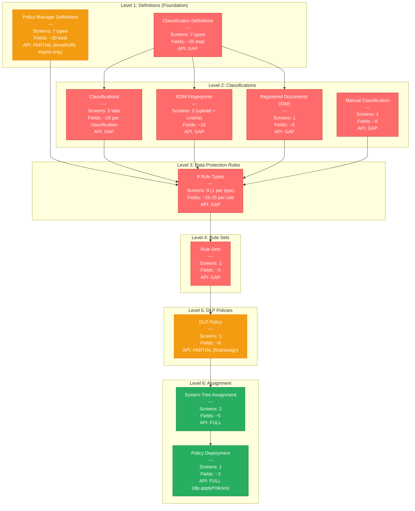
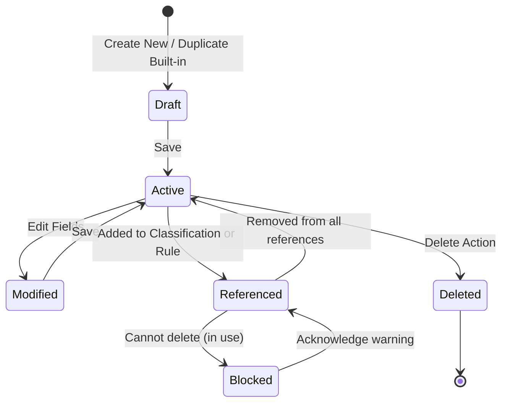
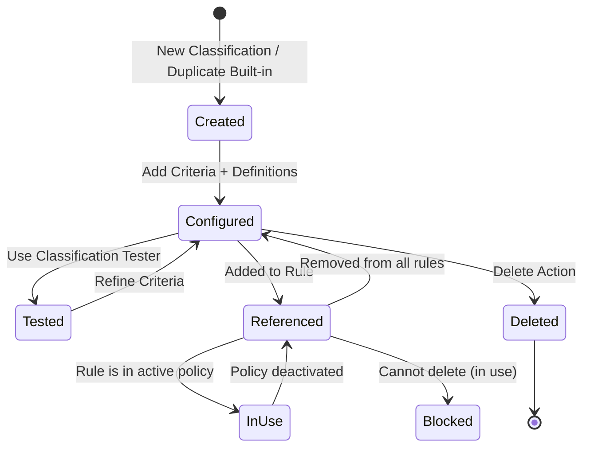
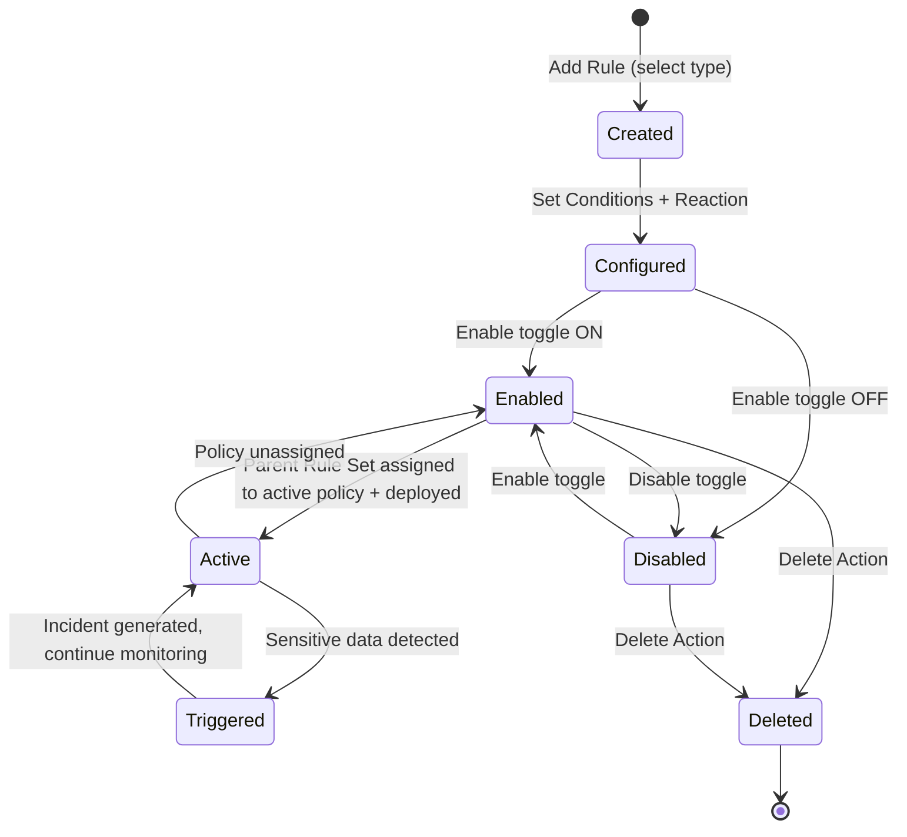
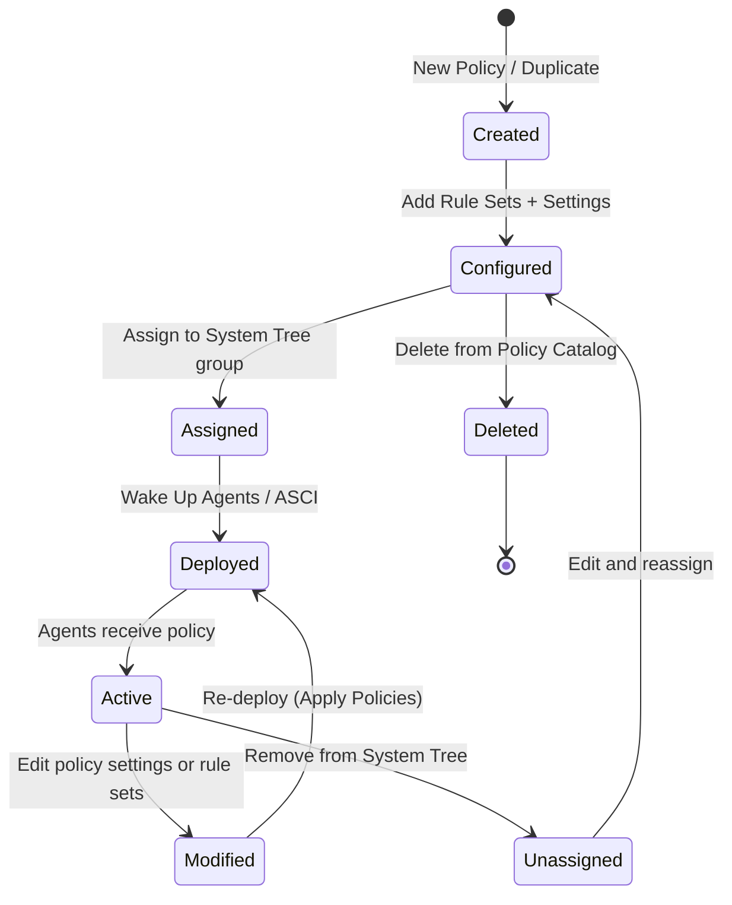

# Authoring Policies -- Complete Workflow
## Trellix DLP (ePO-managed, version 11.x)

> Capability: authoring-policies | Generated: 2026-05-21
> Sources: doc-corpus (75 sources), video-intelligence (53 videos), api-intelligence (4 API surfaces, 25+ endpoints)

---

## Overview

Policy authoring is the central configuration activity in Trellix DLP. It is the process of defining **what** constitutes sensitive data, **where** that data can flow, and **what happens** when a policy violation is detected. The output of policy authoring is a deployable DLP Policy object that, once assigned to endpoints and network appliances via the ePO System Tree, enforces data protection rules across email, web, cloud, removable storage, network shares, clipboard, printers, and application file access channels.

Policy authoring follows a strict bottom-up, six-level hierarchy. Each level depends on the levels below it being configured first. Skipping or misordering these levels is the single most common source of "rules that don't fire" support cases.

**What policy authoring produces:**
- One or more DLP Policy objects in the ePO Policy Catalog
- Each policy contains Rule Sets, which contain Data Protection Rules
- Each rule references Classifications, which reference Definitions
- The policy is assigned to systems (not users) via the ePO System Tree

---

## Complexity Score

**Rating: COMPLEX**

**Justification:**
- 6-level dependency hierarchy (Definitions > Classifications > Rules > Rule Sets > Policies > Assignment)
- 9 distinct rule types, each with channel-specific conditions
- 2 separate definition namespaces (Classification vs Policy Manager) that are invisible to each other
- Boolean logic with score thresholds in classification criteria
- Multiple prerequisite infrastructure components (ePO server, LDAP, DLP extensions, endpoint agents)
- Reactions matrix varies by rule type and deployment mode (Endpoint vs Network)
- EDM requires external tooling (EDMTrain utility) outside the console

**Estimated time for a new admin to create their first policy from scratch:**
- With pre-built templates: **45-60 minutes** (duplicate template, customize, assign, deploy)
- Custom policy from scratch (single rule type): **2-3 hours** (including understanding the hierarchy)
- Full multi-channel policy with EDM and custom definitions: **1-2 days**
- Production-ready policy suite across all channels: **1-2 weeks** (includes monitoring phase)

---

## Configuration Dependency Graph



**Legend:** Red = No API coverage (console only) | Orange = Partial API | Green = Full API coverage

---

## The 6-Level Hierarchy

### Level 1: Definitions (Foundation Layer)

Definitions are the atomic building blocks of Trellix DLP. They describe patterns, lists, groups, and properties that are consumed by Classifications (Level 2) and Rules (Level 3).

**CRITICAL ARCHITECTURAL NOTE:** Definitions exist in TWO separate namespaces:
- **Classification Definitions** (under Classification menu) -- used by classifications as content criteria
- **Policy Manager Definitions** (under DLP Policy Manager > Definitions) -- used directly by rules as source/destination conditions

These are **NOT shared**. A definition created in one context is invisible to the other. Some definition types (Advanced Patterns, Dictionaries) appear in both contexts but are managed separately. This dual-namespace design is a known source of admin confusion. [Source: S73 community post, doc-corpus]

---

#### 1.1 Classification Definitions (Menu > Data Protection > Classification > Definitions tab)

These definitions are used exclusively within Classification criteria. They define WHAT the sensitive content looks like.

##### 1.1.1 Advanced Patterns (Regex)

**Navigation:** Menu > Data Protection > Classification > [classification name] > Content Classification Criteria > Add Component > Advanced Pattern > Actions > New Item
**Screen type:** Modal dialog within classification criteria builder
**Evidence:** [S11][S12][S13][S14][S75]

| Field | Type | Required | Default | Valid Values | Constraints | Evidence |
|-------|------|----------|---------|--------------|-------------|----------|
| Name | Text input | Yes | (empty) | Free text | Must be unique within classification context | A [S11] |
| Description | Text area | No | (empty) | Free text | No length limit documented | A [S11] |
| Matched Expression (Regex) | Text input (multiline) | Yes | (empty) | Regular expression | RE2 engine (NOT PCRE) -- no negative lookahead/lookbehind | A [S14][S75] |
| Ignored Expressions | Text input (multiline) | No | (empty) | Regular expression(s) | Patterns to exclude from matches; same regex engine | A [S14] |
| Validator | Dropdown | No | None | None, Luhn 10, USPS Checksum, Custom Script | Custom validator requires script path | A [S11][S13] |
| Score | Numeric input | No | 1 | Positive integer | Weight when used in score-threshold classifications | A [S11] |
| Required / Optional | Radio button | No | Required | Required, Optional | Required patterns must match; Optional contribute to score | B [S11] |

**Decision Points:**
- **Validator selection: None vs Luhn vs Custom** -- Selecting `Luhn 10` validates matched numbers against the Luhn algorithm (credit card checksum), dramatically reducing false positives for credit card detection. Selecting `None` relies solely on regex pattern matching. Custom validators require an external script. For SSN patterns, use format validation with `None` and rely on proximity/dictionary co-occurrence to reduce false positives instead.
- **Score thresholds** -- If a classification uses score-based matching, each pattern's Score value is summed. Only set scores > 1 for high-confidence patterns. Low-confidence patterns should use score = 1.

**Gotchas:**
- Trellix DLP uses the RE2 regex engine, NOT PCRE. Negative lookahead (`(?!...)`) and lookbehind (`(?<!...)`) are NOT supported. Patterns using these features will silently fail or cause errors. Rewrite patterns to use supported RE2 syntax. [Source: Video research gotcha #6, Trellix docs / Skyhigh Security]
- Built-in advanced patterns (Credit Card Number, SSN, ABA Routing Number, Driver's License per-state, and ~100+ more) are read-only. To customize, duplicate and modify. [S8][S13]

##### 1.1.2 Dictionaries

**Navigation:** Menu > Data Protection > Classification > [classification name] > Content Classification Criteria > Add Component > Dictionary > Actions > New Item (or Import)
**Screen type:** Modal dialog / bulk import
**Evidence:** [S15][S16][S17]

| Field | Type | Required | Default | Valid Values | Constraints | Evidence |
|-------|------|----------|---------|--------------|-------------|----------|
| Name | Text input | Yes | (empty) | Free text | Must be unique | A [S15] |
| Description | Text area | No | (empty) | Free text | -- | B [S15] |
| Entries | Table (string + score) | Yes (at least 1) | (empty) | Keyword/phrase strings | One entry per row; each has an associated score | A [S16] |
| Score (per entry) | Numeric | No | 1 | Positive integer | Contributes to classification score threshold | A [S16] |
| Match Mode (per entry) | Dropdown | No | Contains | Start With, End With, Contains, Exact Match | Per-entry matching strategy | B [S17] |
| Case Sensitive | Checkbox | No | No (unchecked) | Yes/No | When enabled, matching is case-sensitive | B [S17] |
| Import Source | File upload | No | N/A | CSV file, Text file | Bulk import keywords from file | A [S17] |

**Decision Points:**
- **Manual entry vs bulk import** -- For small dictionaries (<50 terms), manual entry is practical. For medical/financial term lists with hundreds of entries, use CSV import. The import format is one keyword per line or CSV with keyword,score columns.
- **Score-weighted vs uniform** -- If all entries are equally important, leave scores at 1. For graduated detection (e.g., highly sensitive medical terms scored 10, common medical terms scored 1), set individual scores.

**Built-in dictionaries:** Medical terms, profanity, financial terms, legal terms, HIPAA-related terms. These are read-only but can be duplicated. [S8]

##### 1.1.3 Keywords

**Navigation:** Classification > Content Classification Criteria > Add Component > Keyword
**Evidence:** [S9]

Simple keyword matching without the scoring/dictionary structure. Functionally a simplified dictionary with flat keyword lists.

| Field | Type | Required | Default | Valid Values | Constraints | Evidence |
|-------|------|----------|---------|--------------|-------------|----------|
| Keyword(s) | Text input | Yes | (empty) | One or more keywords | Comma or newline separated | B [S9] |
| Match Mode | Dropdown | No | Contains | Contains, Exact Match | -- | B [S9] |

##### 1.1.4 Document Properties

**Navigation:** Classification > Content Classification Criteria > Add Component > Document Properties
**Evidence:** [S18]

| Field | Type | Required | Default | Valid Values | Constraints | Evidence |
|-------|------|----------|---------|--------------|-------------|----------|
| Property Name | Dropdown | Yes | -- | Author, Keywords/Tags, Last Saved By, Subject, Title, Custom Property | Standard document metadata fields | A [S18] |
| Property Value | Text input | Yes | (empty) | Free text or pattern | Matches against the document metadata value | A [S18] |
| Match Operator | Dropdown | No | Contains | Is, Contains, Starts With, Ends With | -- | B [S18] |

##### 1.1.5 File Extensions

**Navigation:** Classification > Definitions > File Extensions (or within criteria)
**Evidence:** [S18][S19]

| Field | Type | Required | Default | Valid Values | Constraints | Evidence |
|-------|------|----------|---------|--------------|-------------|----------|
| Extension(s) | Text input / checklist | Yes | (empty) | File extension strings (e.g., .docx, .pdf, .xlsx) | Without leading dot or with -- both accepted | A [S19] |
| Include/Exclude | Radio | No | Include | Include, Exclude | Whether to match or exclude these extensions | B [S19] |

**Note:** For reliable file type detection regardless of extension renaming, use **True File Type** (binary detection) instead of File Extensions. [S20]

##### 1.1.6 True File Type

**Navigation:** Classification > Definitions > True File Type
**Evidence:** [S20]

Detects files by their binary signature (magic bytes), not by extension. Catches renamed files.

| Field | Type | Required | Default | Valid Values | Constraints | Evidence |
|-------|------|----------|---------|--------------|-------------|----------|
| File Type Groups | Checklist | Yes | (none) | Pre-defined groups: Documents, Spreadsheets, Presentations, Images, Archives, Executables, Audio, Video, Database, etc. | Select one or more groups | A [S20] |
| Individual Types | Checklist (within group) | No | All in group | Individual file types within each group | Fine-grained selection | B [S20] |

##### 1.1.7 Third-Party Tags / File Encryption

**Navigation:** Classification > Content Classification Criteria > Add Component
**Evidence:** [S55]

Used to detect files tagged by third-party classification tools (e.g., Boldon James, Titus) or files protected by encryption products.

| Field | Type | Required | Default | Valid Values | Constraints | Evidence |
|-------|------|----------|---------|--------------|-------------|----------|
| Tag Source | Dropdown | Yes | -- | Supported third-party tag providers | Must have the third-party product installed | C [S55] |
| Tag Value | Text input | Yes | (empty) | Tag value to match | Depends on third-party product | C [S55] |

---

#### 1.2 Policy Manager Definitions (Menu > Data Protection > DLP Policy Manager > Definitions)

These definitions are used within Data Protection Rules as source/destination conditions. They define WHO, WHERE, and WHICH APPLICATIONS are involved.

**Navigation:** Menu > Data Protection > DLP Policy Manager > Definitions tab [S23]

##### 1.2.1 End-User Groups

**Navigation:** DLP Policy Manager > Definitions > End-User Groups
**Evidence:** [S23][S73]

**Prerequisite:** A registered LDAP server must be configured in ePO before End-User Groups can reference Active Directory. Without LDAP, only SID-based individual user entries are possible.

| Field | Type | Required | Default | Valid Values | Constraints | Evidence |
|-------|------|----------|---------|--------------|-------------|----------|
| Name | Text input | Yes | (empty) | Free text | Must be unique | A [S23] |
| Description | Text area | No | (empty) | Free text | -- | B [S23] |
| Source Type | Radio / selection | Yes | AD Groups | AD Groups, Individual Users, Both | -- | A [S73] |
| AD Group Selection | Tree browser | Conditional (if AD) | (none) | Browse/search registered LDAP directories | LDAP server must be registered in ePO | A [S73] |
| Individual User | Text input | Conditional (if Individual) | (empty) | SID or DOMAIN\username | -- | B [S73] |

**API Coverage:** PARTIAL -- End-user groups can be imported via CSV using `dlp.importDefinitions`. LDAP sync configuration is console-only.

**Important limitation:** DLP policies CANNOT be assigned to users via ePO's user-based policy assignment rules. User-scoping is done within individual rules by referencing End-User Groups. The policy itself is always assigned to systems. [S73]

##### 1.2.2 Email Address Lists

**Navigation:** DLP Policy Manager > Definitions > Email Address Lists
**Evidence:** [S23]

| Field | Type | Required | Default | Valid Values | Constraints | Evidence |
|-------|------|----------|---------|--------------|-------------|----------|
| Name | Text input | Yes | (empty) | Free text | Must be unique | A [S23] |
| Email Addresses | Table / text area | Yes | (empty) | Email addresses, domain wildcards (e.g., *@example.com) | One per line | A [S23] |
| Import | File upload | No | N/A | CSV file | Bulk import supported | A [S43] |

**API Coverage:** FULL -- Email address lists can be imported via `dlp.importDefinitions` or `/rest/dlp/definitions/import`. [S43]

##### 1.2.3 URL Lists

**Navigation:** DLP Policy Manager > Definitions > URL Lists
**Evidence:** [S23][S74]

| Field | Type | Required | Default | Valid Values | Constraints | Evidence |
|-------|------|----------|---------|--------------|-------------|----------|
| Name | Text input | Yes | (empty) | Free text | Must be unique | A [S23] |
| URLs | Table / text area | Yes | (empty) | Full URLs or URL patterns with wildcards | One per line | A [S74] |
| Import | File upload | No | N/A | CSV file | Bulk import supported | A [S74] |

**API Coverage:** FULL -- URL lists can be imported via `dlp.importDefinitions` or `/rest/dlp/definitions/import`. [S43][S74]

**Note:** URL-based definitions are supported by Web Protection, Cloud Protection, Clipboard Protection, Printing Protection, and Screenshot Protection rules -- but NOT all rule types. Check compatibility before creating URL-targeted rules. [Video gotcha #10]

##### 1.2.4 Network Definitions

**Navigation:** DLP Policy Manager > Definitions > Network Definitions
**Evidence:** [S23]

| Field | Type | Required | Default | Valid Values | Constraints | Evidence |
|-------|------|----------|---------|--------------|-------------|----------|
| Name | Text input | Yes | (empty) | Free text | Must be unique | B [S23] |
| Address Type | Dropdown | Yes | IP Address | IP Address, IP Range, Subnet, CIDR | -- | B [S23] |
| Address Value | Text input | Yes | (empty) | Valid IP/range/subnet/CIDR | Standard network notation | B [S23] |

**API Coverage:** GAP -- Network definitions are console-only.

Additional sub-types include:
- **Network Port Definitions** -- Port numbers and port ranges for Network Communication Protection rules
- **Network Printer Definitions** -- UNC path or IP address of network printers [S58]

##### 1.2.5 Application Templates

**Navigation:** DLP Policy Manager > Definitions > Application Templates
**Evidence:** [S21][S22]

| Field | Type | Required | Default | Valid Values | Constraints | Evidence |
|-------|------|----------|---------|--------------|-------------|----------|
| Name | Text input | Yes | (empty) | Free text | Must be unique | A [S21] |
| Operating System | Dropdown | Yes | Windows | Windows, macOS | -- | A [S22] |
| Product Name | Text input | No | (empty) | From file properties | Matched against executable metadata | A [S21] |
| Vendor Name | Text input | No | (empty) | From file properties | Matched against executable metadata | A [S21] |
| Executable File Name | Text input | No | (empty) | Exact name or wildcard (e.g., chrome.exe, firefox*) | -- | A [S21] |
| Window Title | Text input | No | (empty) | Contains or equals string | Matched against application window title | A [S21] |
| SHA-256 Hash | Text input | No | (empty) | 64-character hex string | Most specific identification method | B [S22] |
| Strategy | Dropdown | Yes | Monitored | Trusted, Monitored, Blocked | Controls default DLP behavior for this app | A [S22] |

**Built-in templates:** Chrome, Firefox, Edge, Outlook, OneDrive, Dropbox, Google Drive, Box, Slack, Teams, Zoom, and many more. These can be duplicated and customized. [S22]

**API Coverage:** GAP -- Application templates are console-only.

---

### Level 2: Classifications

**Navigation:** Menu > Data Protection > Classification [S10]

Classifications are the intelligence layer. They define WHAT constitutes sensitive data by combining definitions into criteria with boolean logic and score thresholds. Classifications are the bridge between definitions (Level 1) and rules (Level 3).

**Classification page tabs:** [S10]
1. **Content Classification Criteria** -- rule-based content matching
2. **Manual Classification** -- user-applied labels
3. **Register Documents** -- document fingerprinting (IDM)
4. **Ignored Text** -- boilerplate exclusions (whitelisted text)
5. **Definitions** -- classification-scoped definitions (distinct from Policy Manager definitions)

**Built-in classifications:** PII per country (US SSN, UK NIN, etc.), HIPAA, PCI-DSS, GDPR, financial data, legal documents, source code. These are read-only but can be duplicated and customized. [S64]

#### 2.1 Content Classification Criteria

**Navigation:** Menu > Data Protection > Classification > [New or existing classification] > Content Classification Criteria tab
**Evidence:** [S9][S10][S54][S55]

A content classification is built from one or more **conditions** combined with AND/OR logic.

**Creating a classification:**
1. Navigate to Menu > Data Protection > Classification
2. Click Actions > New Classification (or duplicate existing)
3. Enter Name and Description
4. On Content Classification Criteria tab, click the `+` icon to add criteria
5. For each criterion, select the definition type and configure
6. Combine criteria with AND/OR operators
7. Save the classification

**Condition types available:**

| Condition Type | What It Matches | Definition Source | Evidence |
|---------------|-----------------|-------------------|----------|
| Advanced Pattern | Regex matches with optional validation | Classification Definitions | A [S13] |
| Dictionary | Keyword/phrase matches with scores | Classification Definitions | A [S16] |
| Document Properties | File metadata (author, title, etc.) | Classification Definitions | A [S18] |
| True File Type | Binary file type detection | Classification Definitions | A [S20] |
| File Extension | File extension string | Classification Definitions | A [S19] |
| Keyword | Simple keyword matches | Inline | B [S9] |
| Proximity | Patterns within N characters of each other | Classification Definitions | B [S9] |
| Exact Data Match (EDM) | Fingerprinted structured data (database records) | EDM fingerprint file | A [S45] |
| Content Fingerprinting | Fingerprinted document content | Registered document repository | A [S54] |

**Boolean logic for combining conditions:**
- **ANY (OR):** Any single condition within a group must match
- **ALL (AND):** All conditions within a group must match
- **Groups:** Multiple condition groups can be combined; conditions within a group use AND, groups use OR
- **Score threshold:** Cumulative score from weighted definitions must exceed a configured threshold
- **Occurrence count:** Minimum number of matches required to trigger

**Classification fields:**

| Field | Type | Required | Default | Valid Values | Constraints | Evidence |
|-------|------|----------|---------|--------------|-------------|----------|
| Name | Text input | Yes | (empty) | Free text | Must be unique | A [S9] |
| Description | Text area | No | (empty) | Free text | -- | A [S9] |
| Condition Groups | Visual builder | Yes (at least 1) | (empty) | AND/OR groups of conditions | At least one condition required | A [S10] |
| Score Threshold | Numeric | Conditional | 0 | Positive integer | Only if using score-based matching | B [S10] |
| Occurrence Count | Numeric | No | 1 | Positive integer | Minimum matches to trigger | B [S10] |

#### 2.2 Exact Data Matching (EDM)

**Navigation:** Classification criteria > Add Component > Exact Data Match
**Evidence:** [S45][S46][S47][S48]

EDM protects structured data (database records) by fingerprinting actual values in rows/columns from a CSV/TSV export.

**Two versions exist:**
1. **EDM Enhanced** (current, recommended) -- improved performance and accuracy [S45]
2. **EDM Old** (legacy) -- maintained for backward compatibility [S46]

**Configuration steps (EDM Enhanced):**
1. Export database records to CSV/TSV file
2. Prepare the fingerprint file using the **EDMTrain** command-line utility
3. Upload fingerprint file to ePO server
4. Create a classification with EDM criteria
5. Select columns to match (e.g., SSN + Name + DOB)
6. Configure match threshold (minimum columns that must match in the same row)
7. Reference the classification in data protection rules

**EDM-specific fields:**

| Field | Type | Required | Default | Valid Values | Constraints | Evidence |
|-------|------|----------|---------|--------------|-------------|----------|
| Fingerprint File | File upload | Yes | (empty) | .edm file (output of EDMTrain) | Must be generated by EDMTrain utility | A [S48] |
| Column Selection | Checkbox list | Yes | All columns | Column names from fingerprint file | At least one column must be selected | A [S47] |
| Required Columns | Checkbox | No | None | Subset of selected columns | These columns MUST match (others are optional) | A [S45] |
| Match Threshold | Numeric | Yes | All selected | 1 to N (number of selected columns) | Minimum columns matching in same row | A [S45] |

**API Coverage:** GAP -- EDM configuration is console-only. The EDMTrain utility runs outside ePO.

#### 2.3 Registered Documents (IDM)

**Navigation:** Menu > Data Protection > Classification > Register Documents tab
**Evidence:** [S52][S53]

Document fingerprinting creates content signatures. When content matching these signatures appears in any data channel, the associated rule triggers.

| Field | Type | Required | Default | Valid Values | Constraints | Evidence |
|-------|------|----------|---------|--------------|-------------|----------|
| Shared Storage Location | Text input (UNC/WebDAV) | Yes | (empty) | UNC path or WebDAV URL | Must be accessible from ePO server | A [S53] |
| Document Source | File browser / upload | Yes | (empty) | File share path, specific files, or folder | -- | A [S52] |
| Recurse Subfolders | Checkbox | No | Yes | Yes/No | Scan subdirectories | A [S53] |
| Auto Registration Schedule | Schedule picker | No | None | Periodic re-scanning schedule | Keeps fingerprints up-to-date | B [S52] |
| Match Percentage Threshold | Numeric | No | 80% | 1-100% | How much of document must match to trigger | B [S54] |

**API Coverage:** GAP -- Document fingerprinting is console-only.

#### 2.4 Manual Classification

**Navigation:** Menu > Data Protection > Classification > Manual Classification tab
**Evidence:** [S49][S50][S51]

Manual classification enables end users to apply classification labels from within applications (Microsoft Office, email clients, Windows Explorer).

| Field | Type | Required | Default | Valid Values | Constraints | Evidence |
|-------|------|----------|---------|--------------|-------------|----------|
| Force Classify on Save | Checkbox | No | Disabled | Enabled/Disabled | Prompts user to classify before saving | A [S49] |
| Force Classify on Send | Checkbox | No | Disabled | Enabled/Disabled | Prompts before sending email | A [S49] |
| Force Classify on Print | Checkbox | No | Disabled | Enabled/Disabled | Prompts before printing | A [S49] |
| Classification Labels | Table | Yes (if enabled) | Built-in set | Label name + properties | Labels appear in user's context menu/ribbon | A [S50] |
| Visual Labels (11.14.x+) | Configuration panel | No | Disabled | Header, Footer, Watermark | Visible markings applied based on classification | A [S51] |
| Persistent Tags | Checkbox | No | Enabled | Enabled/Disabled | Embedded metadata that travels with the file | B [S50] |

**End-user interface locations:**
- Right-click context menu in Windows Explorer
- Ribbon button in Microsoft Office applications
- Dialog prompt before save/send/print (if forced)

---

### Level 3: Data Protection Rules

**Navigation:** Menu > Data Protection > DLP Policy Manager > Rule Sets > [Rule Set Name] > Add Rule
**Evidence:** [S25][S28][S29][S56]

Data Protection Rules define the enforcement action taken when classified data is detected in a specific channel. Each of the 9 rule types targets a different data loss vector. All 9 share a common structure (Classification + Conditions + Reactions) but each adds channel-specific conditions.

**API Coverage:** GAP -- All rule CRUD operations are console-only. Cannot create, edit, enable/disable, or delete rules via API.

#### Common Rule Structure (All 9 Types)

Every data protection rule contains these sections:

**Condition Tab:**

| Field | Type | Required | Default | Valid Values | Constraints | Evidence |
|-------|------|----------|---------|--------------|-------------|----------|
| Classification | Multi-select | Yes | (none) | Available classifications | At least one required | A [S28] |
| End-User | Multi-select | No | All users | End-User Group definitions | Scope rule to specific users | A [S28] |
| Application | Multi-select | No | All applications | Application Template definitions | Scope rule to specific applications | B [S28] |
| File Conditions | Panel | No | Any | True File Type, Extension, Size | Additional content filters | B [S28] |

**Reaction Tab:**

| Field | Type | Required | Default | Valid Values | Constraints | Evidence |
|-------|------|----------|---------|--------------|-------------|----------|
| Action | Dropdown | Yes | No Action | No Action, Monitor, Block, Encrypt, Quarantine, Request Justification, Apply RM Policy, Redirect | Availability varies by rule type (see matrix) | A [S29] |
| Notify User | Checkbox + text | No | Disabled | Enabled + notification message text | Custom popup text shown to end user | A [S29] |
| Report to ePO | Checkbox | No | Yes | Yes/No | Generate incident in DLP Incident Manager | A [S29] |
| Store Original Evidence | Checkbox | No | No | Yes/No | Capture copy of triggering data | A [S29] |
| Severity | Dropdown | Yes | Medium | Critical, High, Medium, Low, Informational | Incident severity classification | A [S29] |

**State:**

| Field | Type | Required | Default | Valid Values | Constraints | Evidence |
|-------|------|----------|---------|--------------|-------------|----------|
| State | Toggle | Yes | Enabled | Enabled / Disabled | Controls whether rule is active | A [S25] |

#### Reactions Matrix (Actions by Rule Type)

| Reaction | Email | Web | Cloud | Removable Storage | Network Share | Network Comm | Clipboard | Printer | App File Access |
|----------|:-----:|:---:|:-----:|:-----------------:|:------------:|:------------:|:---------:|:-------:|:---------------:|
| No Action | Y | Y | Y | Y | Y | Y | Y | Y | Y |
| Monitor | Y | Y | Y | Y | Y | Y | Y | Y | Y |
| Block | Y | Y | Y | Y | Y | Y | Y | Y | Y |
| Encrypt | Y | -- | -- | Y | -- | -- | -- | -- | -- |
| Quarantine | Y* | -- | -- | -- | -- | -- | -- | -- | -- |
| Request Justification | Y | Y | Y | Y | Y | Y | Y | Y | Y |
| Notify User | Y | Y | Y | Y | Y | Y | Y | Y | Y |
| Apply RM Policy | Y | -- | -- | Y | -- | -- | -- | -- | -- |
| Redirect | Y* | -- | -- | -- | -- | -- | -- | -- | -- |
| Store Original File | Y | Y | Y | Y | Y | Y | Y | Y | Y |

*Y\* = Available only on DLP Prevent (network appliance), not DLP Endpoint*

[S28][S29]

---

#### 3.1 Email Protection Rule

**Navigation:** DLP Policy Manager > Rule Sets > [rule set] > Add Rule > Email Protection
**Applies to:** DLP Endpoint (Outlook integration) AND DLP Prevent (SMTP gateway)
**Evidence:** [S30][S57]

| Field | Type | Required | Default | Valid Values | Constraints | Evidence |
|-------|------|----------|---------|--------------|-------------|----------|
| Rule Name | Text | Yes | (empty) | Free text | Must be unique within rule set | A [S30] |
| Sender | Multi-select | No | Any | End-User Groups, Email Address Lists | Source filter | A [S30] |
| Recipient | Multi-select | No | Any | Email Address Lists (to/cc/bcc), Domain patterns | Destination filter | A [S30] |
| Envelope/Header/Body | Checkboxes | No | All | Envelope, Header, Body | What parts of the email to scan | A [S57] |
| Scan Attachments | Checkbox | No | Yes | Yes/No | Scan attachment content, name, type | A [S57] |
| Classification | Multi-select | Yes | (none) | Available classifications | Content match criteria | A [S30] |
| Recipient Threshold | Numeric range | No | None | Min/Max recipient count | Trigger based on recipient count | B [S30] |

**Notes:** DLP Endpoint and DLP Prevent share a common classification engine, allowing a single email policy to enforce consistently across endpoints and the network gateway. [S57]

#### 3.2 Web Protection Rule

**Navigation:** DLP Policy Manager > Rule Sets > [rule set] > Add Rule > Web Protection
**Applies to:** DLP Endpoint (browser/HTTP agent) AND DLP Prevent (web proxy)
**Evidence:** [S38]

| Field | Type | Required | Default | Valid Values | Constraints | Evidence |
|-------|------|----------|---------|--------------|-------------|----------|
| Rule Name | Text | Yes | (empty) | Free text | Unique within rule set | A [S38] |
| URL List | Multi-select | No | Any | URL List definitions | Destination URL filter | A [S38] |
| HTTP Method | Multi-select | No | POST | POST, PUT, others | Which HTTP methods to inspect | B [S38] |
| Classification | Multi-select | Yes | (none) | Available classifications | Content match criteria | A [S38] |
| End-User | Multi-select | No | All | End-User Group definitions | User scope | A [S38] |

#### 3.3 Cloud Protection Rule

**Navigation:** DLP Policy Manager > Rule Sets > [rule set] > Add Rule > Cloud Protection
**Applies to:** DLP Endpoint only
**Evidence:** [S36]

| Field | Type | Required | Default | Valid Values | Constraints | Evidence |
|-------|------|----------|---------|--------------|-------------|----------|
| Rule Name | Text | Yes | (empty) | Free text | Unique within rule set | A [S36] |
| Cloud Service | Multi-select | Yes | (none) | OneDrive, Dropbox, Google Drive, Box, iCloud, others | Target cloud apps | A [S36] |
| Operation | Multi-select | No | All | Upload, Download, Sync | Which operations to inspect | B [S36] |
| Classification | Multi-select | Yes | (none) | Available classifications | Content match criteria | A [S36] |
| End-User | Multi-select | No | All | End-User Group definitions | User scope | A [S36] |

#### 3.4 Removable Storage Protection Rule

**Navigation:** DLP Policy Manager > Rule Sets > [rule set] > Add Rule > Removable Storage Protection
**Applies to:** DLP Endpoint only
**Evidence:** [S31]

| Field | Type | Required | Default | Valid Values | Constraints | Evidence |
|-------|------|----------|---------|--------------|-------------|----------|
| Rule Name | Text | Yes | (empty) | Free text | Unique within rule set | A [S31] |
| Device Type | Multi-select | No | All removable | USB drive, CD/DVD, Bluetooth, SD Card, etc. | Target device types | A [S31] |
| Classification | Multi-select | Yes | (none) | Available classifications | Content match criteria | A [S31] |
| End-User | Multi-select | No | All | End-User Group definitions | User scope | A [S31] |
| File Conditions | Panel | No | Any | True File Type, Extension, Size | Additional filters | B [S31] |

**Gotcha:** A "block all" USB rule without device-type scoping can block USB keyboards and mice. Always deploy in Monitor mode first, then refine. [Video tribal knowledge #10, DLP 001/002 Jay Appell]

#### 3.5 Network Share Protection Rule

**Navigation:** DLP Policy Manager > Rule Sets > [rule set] > Add Rule > Network Share Protection
**Applies to:** DLP Endpoint only
**Evidence:** [S35]

| Field | Type | Required | Default | Valid Values | Constraints | Evidence |
|-------|------|----------|---------|--------------|-------------|----------|
| Rule Name | Text | Yes | (empty) | Free text | Unique within rule set | A [S35] |
| Network Share Path | Multi-select | No | Any | Network Definition (UNC paths) | Target share paths | A [S35] |
| Classification | Multi-select | Yes | (none) | Available classifications | Content match criteria | A [S35] |
| End-User | Multi-select | No | All | End-User Group definitions | User scope | B [S35] |

#### 3.6 Network Communication Protection Rule

**Navigation:** DLP Policy Manager > Rule Sets > [rule set] > Add Rule > Network Communication Protection
**Applies to:** DLP Endpoint only
**Evidence:** [S32]

| Field | Type | Required | Default | Valid Values | Constraints | Evidence |
|-------|------|----------|---------|--------------|-------------|----------|
| Rule Name | Text | Yes | (empty) | Free text | Unique within rule set | A [S32] |
| Protocol/Port | Multi-select | No | Any | Network Port Definitions, protocol selections | Target network protocols | A [S32] |
| Application | Multi-select | No | Any | Application Template definitions | Source/dest application | A [S32] |
| Classification | Multi-select | Yes | (none) | Available classifications | Content match criteria | A [S32] |
| Direction | Dropdown | No | Both | Inbound, Outbound, Both | Traffic direction | B [S32] |

#### 3.7 Clipboard Protection Rule

**Navigation:** DLP Policy Manager > Rule Sets > [rule set] > Add Rule > Clipboard Protection
**Applies to:** DLP Endpoint only
**Evidence:** [S33]

| Field | Type | Required | Default | Valid Values | Constraints | Evidence |
|-------|------|----------|---------|--------------|-------------|----------|
| Rule Name | Text | Yes | (empty) | Free text | Unique within rule set | A [S33] |
| Source Application | Multi-select | No | Any | Application Template definitions | App where copy originates | A [S33] |
| Destination Application | Multi-select | No | Any | Application Template definitions | App where paste targets | A [S33] |
| Classification | Multi-select | Yes | (none) | Available classifications | Content match criteria | A [S33] |

#### 3.8 Printer Protection Rule

**Navigation:** DLP Policy Manager > Rule Sets > [rule set] > Add Rule > Printer Protection
**Applies to:** DLP Endpoint only
**Evidence:** [S34]

| Field | Type | Required | Default | Valid Values | Constraints | Evidence |
|-------|------|----------|---------|--------------|-------------|----------|
| Rule Name | Text | Yes | (empty) | Free text | Unique within rule set | A [S34] |
| Printer Type | Dropdown | No | Any | Local Printer, Network Printer, Virtual Printer (PDF) | Target printer type | A [S34] |
| Network Printer | Multi-select | Conditional | Any | Network Printer definitions | Only if Printer Type = Network | B [S58] |
| Classification | Multi-select | Yes | (none) | Available classifications | Content match criteria | A [S34] |
| End-User | Multi-select | No | All | End-User Group definitions | User scope | B [S34] |

#### 3.9 Application File Access Protection Rule

**Navigation:** DLP Policy Manager > Rule Sets > [rule set] > Add Rule > Application File Access Protection
**Applies to:** DLP Endpoint only
**Evidence:** [S37]

| Field | Type | Required | Default | Valid Values | Constraints | Evidence |
|-------|------|----------|---------|--------------|-------------|----------|
| Rule Name | Text | Yes | (empty) | Free text | Unique within rule set | A [S37] |
| Application | Multi-select | Yes | (none) | Application Template definitions | Which apps trigger the rule | A [S37] |
| File Location | Text / path | No | Any | File paths, folders | Where the accessed file resides | B [S37] |
| Access Type | Multi-select | No | Any | Read, Write, Execute | Type of file access | B [S37] |
| Classification | Multi-select | Yes | (none) | Available classifications | Content match criteria | A [S37] |

---

### Level 4: Rule Sets

**Navigation:** Menu > Data Protection > DLP Policy Manager > Rule Sets tab
**Evidence:** [S25][S27]

Rule Sets are containers that group related Data Protection Rules. They provide organizational structure and enable reuse across multiple policies.

| Field | Type | Required | Default | Valid Values | Constraints | Evidence |
|-------|------|----------|---------|--------------|-------------|----------|
| Name | Text input | Yes | (empty) | Free text | Must be unique | A [S25] |
| Description | Text area | No | (empty) | Free text | -- | A [S25] |
| State | Toggle | Yes | Enabled | Enabled / Disabled | Can disable entire rule set | A [S25] |
| Rules | Ordered list | No | (empty) | Data protection rules | Rules evaluated in order | A [S25] |

**Actions available:**
- New Rule Set -- create empty container
- Duplicate -- copy existing rule set
- Delete -- remove rule set
- Import -- import from exported XML/JSON
- Export -- export rule set configuration

**Pre-built rule set templates:** Organized by compliance framework -- GDPR, HIPAA, PCI-DSS, SOX, NIST, ISO 27001, SOC 2. These contain pre-configured rules referencing built-in classifications. Can be used as-is or duplicated and customized. [S64][S27]

**Creating a rule set:**
1. Navigate to Menu > Data Protection > DLP Policy Manager
2. Click the Rule Sets tab
3. Click Actions > New Rule Set
4. Enter Name and Description
5. Click the new rule set name to open it
6. Use Actions > New Rule to add rules (select type from the 9 available)
7. Configure each rule (Condition + Reaction)
8. Enable/disable individual rules as needed
9. Save

**API Coverage:** GAP -- All rule set CRUD operations are console-only.

---

### Level 5: DLP Policies

**Navigation:** Menu > Policy > Policy Catalog > Product: "Data Loss Prevention [version]"
**Evidence:** [S1][S27]

DLP Policies are the top-level containers assigned to systems. A DLP Policy contains one or more Rule Sets plus global policy settings.

**Policy Catalog -- DLP Product Categories:**

| Product Name | Contains |
|-------------|----------|
| Data Loss Prevention [version] - Endpoint | DLP Policy, Endpoint Configuration, Operational Modes |
| Data Loss Prevention [version] - Discover | Discover scan policies |
| Data Loss Prevention [version] - Network | Network Prevent/Monitor settings |

**DLP Policy settings:**

| Field | Type | Required | Default | Valid Values | Constraints | Evidence |
|-------|------|----------|---------|--------------|-------------|----------|
| Policy Name | Text input | Yes | (empty) | Free text | Must be unique | A [S1] |
| Application Strategy | Dropdown | Yes | Unknown | Trusted, Monitored, Unknown | Default behavior for unlisted applications | A [S1] |
| Device Class Overrides | Configuration panel | No | None | Device class selections (Windows only) | Override status/filter for specific device classes | A [S1] |
| Privileged Users | Multi-select | No | None | AD users/groups | Users fully exempt from DLP enforcement | A [S1] |
| Rule Sets | Ordered list | Yes (at least 1) | (empty) | Available rule sets | Priority order (top-to-bottom evaluation) | A [S26] |

**Creating a DLP policy:**
1. Navigate to Menu > Policy > Policy Catalog
2. Select Product: "Data Loss Prevention [version]"
3. Select Category: "DLP Policy"
4. Click Actions > New Policy (or Duplicate from existing)
5. Enter Policy Name
6. Configure global settings (Application Strategy, Device Class Overrides, Privileged Users)
7. Click the Rule Sets assignment area
8. Add one or more rule sets to the policy
9. Arrange rule set priority order
10. Save

**Endpoint Configuration Policy (separate from DLP Policy):**

The Endpoint Configuration policy controls HOW the DLP agent operates, separate from WHAT the policy enforces:

| Setting Category | Key Fields | Evidence |
|-----------------|------------|----------|
| Operational Modes | Data-in-Use on/off, Device Control on/off, Discovery on/off | A [S60] |
| Active Modules | Which protection modules are active (email, web, cloud, etc.) | A [S60] |
| Corporate Connectivity | On-network vs off-network detection | A [S61] |
| Logging | Event logging verbosity and destinations | B [S59] |
| Advanced Settings | Evidence server path, classification tester, debug settings | B [S59] |

**API Coverage:** PARTIAL -- `policy.find` can locate policies, `policy.assignToGroup` can assign them. But creating/editing policy content (rule set assignment, settings) is console-only.

---

### Level 6: Applicability / Assignment

**Navigation:** Menu > Systems > System Tree > [select group/system] > Assigned Policies tab
**Evidence:** [S39][S40][S70][S71]

Policy assignment connects DLP policies to managed systems through the ePO System Tree.

#### ePO System Tree Structure

```
Root (My Organization)
  |-- Group (e.g., "North America")
  |     |-- Sub-group (e.g., "Engineering")
  |     |     |-- System (endpoint-001.corp.example.com)
  |     |     |-- System (endpoint-002.corp.example.com)
  |     |-- Sub-group (e.g., "Finance")
  |           |-- System (finance-ws-01.corp.example.com)
  |-- Group (e.g., "Europe")
        |-- ...
```

**Policy inheritance:** Policies assigned at a parent group are inherited by all child groups and systems. A policy at a lower level overrides the inherited policy ("break inheritance"). [S70][S71]

#### Assignment Process

**Task: Assign a DLP policy to an endpoint group:**
1. Navigate to Menu > Systems > System Tree
2. Select the target group or individual system
3. Click the Assigned Policies tab
4. Find the "Data Loss Prevention [version]" product row
5. Click "Edit Assignment" for the DLP Policy category
6. Select the desired policy from the dropdown
7. Choose "Break inheritance" if overriding a parent assignment
8. Click Save
9. To push immediately: Actions > Agent > Wake Up Agents > check "Send Policies"

**User-based scoping limitation:** DLP policies CANNOT be assigned via user-based policy assignment rules in ePO. Policy assignment is system-based only. User-scoping must be done within individual rules using End-User Groups. [S73]

#### Agent Communication and Policy Delivery

| Setting | Default | Description | Evidence |
|---------|---------|-------------|----------|
| ASCI (Agent-to-Server Communication Interval) | 60 minutes | How often agents check for policy updates | A [S72] |
| Wake Up Agents | On-demand | Force immediate policy delivery | A [S72] |
| Send Policies flag | Checkbox | Include policy push in wake-up call | A [S72] |

**API Coverage:** FULL
- `policy.assignToGroup` -- assign policy to System Tree group
- `policy.getAssignments` -- query current assignments
- `dlp.applyPolicies` -- trigger policy push to endpoints
- `system.find` / `system.applyTag` -- find and tag systems for assignment

---

## API Coverage Summary

Based on the api-intelligence research, the API situation for policy authoring is heavily skewed toward deployment and incident management, with the core authoring workflow being entirely console-only.

### What CAN Be Automated

| Operation | API Endpoint | Surface |
|-----------|-------------|---------|
| Import email address lists | `dlp.importDefinitions` | ePO Web API |
| Import URL lists | `dlp.importDefinitions` | ePO Web API |
| Import end-user groups (CSV) | `dlp.importDefinitions` | ePO Web API |
| Find/list policies | `policy.find` | ePO Web API |
| Assign policy to group | `policy.assignToGroup` | ePO Web API |
| View policy assignments | `policy.getAssignments` | ePO Web API |
| Deploy policy to endpoints | `dlp.applyPolicies` | ePO Web API |
| Create policy backup | `dlp.createBackup` | ePO Web API |
| Query incidents | `/rest/dlp/event/incidents` | DLP REST API |
| Retrieve evidence | `/rest/dlp/event/evidence/get` | DLP REST API |
| Run saved queries | `core.executeQuery` | ePO Web API |
| Tag systems | `system.applyTag` | ePO Web API |

### The 12 Console-Only Gaps

| # | Operation | Impact | Why It Matters |
|---|-----------|--------|---------------|
| 1 | Create/edit classification | CRITICAL | Cannot programmatically define what sensitive data is |
| 2 | Create/edit data protection rules | CRITICAL | Cannot programmatically create enforcement rules |
| 3 | Create/edit rule sets | CRITICAL | Cannot programmatically organize rules |
| 4 | Assign rule sets to policies | HIGH | Cannot bind rules to policies via API |
| 5 | Create regex/pattern definitions | HIGH | Cannot automate pattern library updates |
| 6 | Create dictionary definitions | HIGH | Cannot automate dictionary management |
| 7 | Register document fingerprints | HIGH | Fingerprinting workflow is manual |
| 8 | Export/import classifications | HIGH | No programmatic classification migration |
| 9 | Enable/disable individual rules | HIGH | Cannot toggle rules for incident response |
| 10 | Create network/app definitions | MEDIUM | Manual for less-frequently-changed definitions |
| 11 | Configure DLP Discover scans | MEDIUM | Scan config is manual |
| 12 | Manage operational events settings | LOW | Rarely changed |

**Bottom line:** The entire "author a policy from scratch" workflow (define > classify > create rules > build rule sets > assign) is blocked at every step except the final deployment. A "DLP-as-code" workflow is not possible with Trellix DLP's current API surface.

---

## Object Lifecycle Diagrams

### Definition Lifecycle



### Classification Lifecycle



### Rule Lifecycle



### Policy Lifecycle



---

## Integration Touchpoints

### LDAP / Active Directory
- **Purpose:** End-User Group definitions, user-based rule scoping
- **Configuration:** ePO > Menu > Configuration > Registered Servers > Add LDAP Server
- **Prerequisite for:** End-User Groups in Policy Manager Definitions
- **Sync:** ePO syncs LDAP on configurable schedule

### SIEM Integration
- **Mechanism:** Syslog (CEF/LEEF format) from DLP appliance or ePO event forwarding
- **Supported SIEMs:** Splunk (TA-trellix-epo add-on), Google Chronicle (native parser), Devo (native collector), Elastic (requested, not native)
- **Data exported:** DLP incidents, evidence metadata, policy violation events
- **API alternative:** `/rest/dlp/event/incidents` for programmatic incident retrieval

### Email Gateway (DLP Prevent)
- **Purpose:** Network-level email scanning (SMTP gateway)
- **Relationship:** Shares classification engine with DLP Endpoint -- single email policy enforces on both
- **Configuration:** DLP Prevent appliance configured in System Tree, receives same DLP Policy

### ePO Infrastructure
- **Agent communication:** Trellix Agent on each endpoint checks for policy updates every 60 minutes (ASCI)
- **Policy distribution:** System Tree group assignment + agent wake-up for immediate delivery
- **Server tasks:** Automated policy assignment using ePO tags + scheduled server tasks [Video #5]

### OpenDXL (Message Bus)
- **Purpose:** Event-driven DLP event subscription, certificate-based automation
- **Wraps:** Same ePO commands (`dlp.*`) over MQTT-based DXL fabric
- **Libraries:** Python (opendxl-epo-client-python), JavaScript (opendxl-epo-client-javascript)
- **Value-add:** Pub/sub for real-time DLP event processing

### Cloud Gateway Integration
- **API:** `/dlp/v1/classify` and `/dlp/v1/scan` endpoints for cloud gateways
- **Purpose:** Send content to DLP engine for classification from external cloud services
- **Auth:** OAuth2 (SaaS) or ePO Basic Auth (on-prem)
