# Trellix DLP -- Configuration Dependency Graph

> Generated: 2026-05-21 | Capability: Authoring Policies
> Covers the complete policy authoring hierarchy from infrastructure prerequisites through deployment

---

## Full Hierarchy (Mermaid)

```mermaid
graph TD
    subgraph "Infrastructure Prerequisites"
        EPO["ePO Server<br/>(installed + licensed)"]:::infra
        DLP_EXT["DLP Extension<br/>(checked into ePO)"]:::infra
        LDAP["LDAP/AD Server<br/>(registered in ePO)"]:::infra
        AGENT["Trellix Agent<br/>(deployed to endpoints)"]:::infra
        DLP_AGENT["DLP Endpoint Agent<br/>(deployed to endpoints)"]:::infra
        EVIDENCE["Evidence Storage<br/>(UNC share — optional)"]:::infra
    end

    subgraph "Level 1: Definitions — Foundation"
        AP["Advanced Patterns<br/>(regex definitions)"]:::gap
        DICT["Dictionaries<br/>(keyword lists)"]:::gap
        KW["Keywords<br/>(simple terms)"]:::gap
        DOCPROP["Document Properties<br/>(metadata matchers)"]:::gap
        FEXT["File Extensions"]:::gap
        TFT["True File Type<br/>(binary detection)"]:::gap
        TAGS["Third-Party Tags"]:::gap
        EUG["End-User Groups<br/>(AD-based)"]:::partial
        EMAIL_LIST["Email Address Lists"]:::full
        URL_LIST["URL Lists"]:::full
        NET_DEF["Network Definitions<br/>(IP/subnet/CIDR)"]:::gap
        NET_PORT["Network Port Defs"]:::gap
        NET_PRINT["Network Printers"]:::gap
        APP_TMPL["Application Templates"]:::gap
    end

    subgraph "Level 2: Classifications — Intelligence"
        CLS["Content Classifications<br/>(AND/OR criteria + scores)"]:::gap
        EDM["EDM Fingerprints<br/>(structured data)"]:::gap
        IDM["Registered Documents<br/>(content fingerprints)"]:::gap
        MC["Manual Classification<br/>(user-applied labels)"]:::gap
    end

    subgraph "Level 3: Rules — Enforcement"
        R_EMAIL["Email Protection Rule"]:::gap
        R_WEB["Web Protection Rule"]:::gap
        R_CLOUD["Cloud Protection Rule"]:::gap
        R_USB["Removable Storage Rule"]:::gap
        R_SHARE["Network Share Rule"]:::gap
        R_NETCOM["Network Comm Rule"]:::gap
        R_CLIP["Clipboard Rule"]:::gap
        R_PRINT["Printer Rule"]:::gap
        R_APP["App File Access Rule"]:::gap
    end

    subgraph "Level 4: Rule Sets — Organization"
        RS["Rule Sets<br/>(ordered rule containers)"]:::gap
    end

    subgraph "Level 5: Policies — Container"
        POL["DLP Policy<br/>(rule sets + settings)"]:::partial
        EP_CFG["Endpoint Configuration<br/>(operational modes)"]:::gap
    end

    subgraph "Level 6: Assignment — Deployment"
        ASSIGN["System Tree Assignment"]:::full
        DEPLOY["Policy Deployment<br/>(dlp.applyPolicies)"]:::full
    end

    %% Infrastructure dependencies
    EPO --> DLP_EXT
    EPO --> LDAP
    EPO --> AGENT
    DLP_EXT --> DLP_AGENT
    AGENT --> DLP_AGENT

    %% Definition dependencies
    DLP_EXT --> AP
    DLP_EXT --> DICT
    DLP_EXT --> KW
    DLP_EXT --> DOCPROP
    DLP_EXT --> FEXT
    DLP_EXT --> TFT
    DLP_EXT --> TAGS
    DLP_EXT --> EUG
    DLP_EXT --> EMAIL_LIST
    DLP_EXT --> URL_LIST
    DLP_EXT --> NET_DEF
    DLP_EXT --> NET_PORT
    DLP_EXT --> NET_PRINT
    DLP_EXT --> APP_TMPL
    LDAP --> EUG

    %% Classification dependencies
    AP --> CLS
    DICT --> CLS
    KW --> CLS
    DOCPROP --> CLS
    FEXT --> CLS
    TFT --> CLS
    TAGS --> CLS
    AP --> EDM
    DLP_EXT --> IDM
    DLP_EXT --> MC

    %% Rule dependencies (classifications feed rules)
    CLS --> R_EMAIL
    CLS --> R_WEB
    CLS --> R_CLOUD
    CLS --> R_USB
    CLS --> R_SHARE
    CLS --> R_NETCOM
    CLS --> R_CLIP
    CLS --> R_PRINT
    CLS --> R_APP
    EDM --> R_EMAIL
    EDM --> R_WEB
    EDM --> R_USB
    IDM --> R_EMAIL
    IDM --> R_WEB
    MC --> R_EMAIL
    MC --> R_WEB

    %% Policy Manager Definitions feed rules directly (Level 1 -> Level 3)
    EUG --> R_EMAIL
    EUG --> R_WEB
    EUG --> R_CLOUD
    EUG --> R_USB
    EUG --> R_SHARE
    EUG --> R_CLIP
    EUG --> R_PRINT
    EUG --> R_APP
    EMAIL_LIST --> R_EMAIL
    URL_LIST --> R_WEB
    URL_LIST --> R_CLOUD
    NET_DEF --> R_NETCOM
    NET_PORT --> R_NETCOM
    NET_PRINT --> R_PRINT
    APP_TMPL --> R_CLIP
    APP_TMPL --> R_APP
    APP_TMPL --> R_NETCOM

    %% Rules -> Rule Sets
    R_EMAIL --> RS
    R_WEB --> RS
    R_CLOUD --> RS
    R_USB --> RS
    R_SHARE --> RS
    R_NETCOM --> RS
    R_CLIP --> RS
    R_PRINT --> RS
    R_APP --> RS

    %% Rule Sets -> Policy
    RS --> POL
    DLP_EXT --> EP_CFG

    %% Policy -> Assignment
    POL --> ASSIGN
    EP_CFG --> ASSIGN
    AGENT --> ASSIGN

    %% Assignment -> Deployment
    ASSIGN --> DEPLOY
    DLP_AGENT --> DEPLOY
    EVIDENCE -.->|Optional| DEPLOY

    classDef infra fill:#3498db,stroke:#2980b9,color:#fff
    classDef gap fill:#ff6b6b,stroke:#c0392b,color:#fff
    classDef partial fill:#f39c12,stroke:#e67e22,color:#fff
    classDef full fill:#27ae60,stroke:#1e8449,color:#fff
```



**Legend:**
- Blue = Infrastructure prerequisite
- Red = No API coverage (console only)
- Orange = Partial API coverage
- Green = Full API coverage

---

## Dependency Matrix

| Object Type | Level | Depends On | Required By | API Coverage |
|-------------|-------|-----------|-------------|--------------|
| ePO Server | Infra | (none) | Everything | N/A |
| DLP Extension | Infra | ePO Server | All DLP objects | N/A |
| LDAP/AD Server | Infra | ePO Server | End-User Groups | N/A |
| Trellix Agent | Infra | ePO Server | DLP Agent, System Tree Assignment | N/A |
| DLP Endpoint Agent | Infra | Trellix Agent, DLP Extension | Policy Deployment | N/A |
| Evidence Storage | Infra | (none) | Policy Deployment (optional) | N/A |
| Advanced Patterns | L1 | DLP Extension | Classifications, EDM | GAP |
| Dictionaries | L1 | DLP Extension | Classifications | GAP |
| Keywords | L1 | DLP Extension | Classifications | GAP |
| Document Properties | L1 | DLP Extension | Classifications | GAP |
| File Extensions | L1 | DLP Extension | Classifications, Rules | GAP |
| True File Type | L1 | DLP Extension | Classifications, Rules | GAP |
| Third-Party Tags | L1 | DLP Extension | Classifications | GAP |
| End-User Groups | L1 | DLP Extension, LDAP | Rules (all 9 types) | PARTIAL (CSV import) |
| Email Address Lists | L1 | DLP Extension | Email Protection Rules | FULL (dlp.importDefinitions) |
| URL Lists | L1 | DLP Extension | Web/Cloud Protection Rules | FULL (dlp.importDefinitions) |
| Network Definitions | L1 | DLP Extension | Network Comm Rules | GAP |
| Network Port Definitions | L1 | DLP Extension | Network Comm Rules | GAP |
| Network Printers | L1 | DLP Extension | Printer Rules | GAP |
| Application Templates | L1 | DLP Extension | Clipboard, App File Access, Network Comm Rules | GAP |
| Content Classifications | L2 | Classification Definitions (L1) | Rules (all 9 types) | GAP |
| EDM Fingerprints | L2 | Advanced Patterns, EDMTrain utility | Rules (select types) | GAP |
| Registered Documents | L2 | DLP Extension, file share | Rules (select types) | GAP |
| Manual Classification | L2 | DLP Extension | Rules (select types) | GAP |
| Data Protection Rules (x9) | L3 | Classifications (L2), PM Definitions (L1) | Rule Sets | GAP |
| Rule Sets | L4 | Data Protection Rules (L3) | DLP Policies | GAP |
| DLP Policy | L5 | Rule Sets (L4) | System Tree Assignment | PARTIAL (find/assign) |
| Endpoint Configuration | L5 | DLP Extension | System Tree Assignment | GAP |
| System Tree Assignment | L6 | DLP Policy, Endpoint Config, Trellix Agent | Policy Deployment | FULL (policy.assignToGroup) |
| Policy Deployment | L6 | System Tree Assignment, DLP Agent | (terminal) | FULL (dlp.applyPolicies) |

---

## Recommended Configuration Order

This is the topologically sorted order. Each step depends on all prior steps being complete.

### Phase 0: Infrastructure (Before Any Policy Work)

| Step | Item | Dependencies | Time Est. | API |
|------|------|-------------|-----------|-----|
| 0.1 | Install ePO Server | (none) | 2-4 hours | N/A |
| 0.2 | Check in DLP Extension | ePO Server | 15 min | N/A |
| 0.3 | Register LDAP/AD Server | ePO Server | 15 min | N/A |
| 0.4 | Deploy Trellix Agent to endpoints | ePO Server | 30-60 min | N/A |
| 0.5 | Deploy DLP Endpoint Agent | Trellix Agent, DLP Extension | 30-60 min | N/A |
| 0.6 | Configure Evidence Storage (optional) | UNC share accessible | 15 min | N/A |

### Phase 1: Definitions (Foundation Layer)

| Step | Item | Dependencies | Time Est. | API |
|------|------|-------------|-----------|-----|
| 1.1 | Create Advanced Pattern definitions (regex) | DLP Extension | 15-30 min per pattern | GAP |
| 1.2 | Create/import Dictionary definitions | DLP Extension | 10-20 min per dictionary | GAP |
| 1.3 | Configure Document Properties definitions | DLP Extension | 5-10 min | GAP |
| 1.4 | Configure File Extension / True File Type definitions | DLP Extension | 5-10 min | GAP |
| 1.5 | Create End-User Group definitions | DLP Extension, LDAP | 10-15 min per group | PARTIAL |
| 1.6 | Import Email Address Lists | DLP Extension | 5 min (API automatable) | FULL |
| 1.7 | Import URL Lists | DLP Extension | 5 min (API automatable) | FULL |
| 1.8 | Create Network Definitions (IP/subnet) | DLP Extension | 5-10 min | GAP |
| 1.9 | Create Application Templates (or use built-in) | DLP Extension | 10-15 min per template | GAP |

### Phase 2: Classifications (Intelligence Layer)

| Step | Item | Dependencies | Time Est. | API |
|------|------|-------------|-----------|-----|
| 2.1 | Create Content Classifications with criteria | Definition types from Phase 1 | 15-30 min per classification | GAP |
| 2.2 | Configure EDM Fingerprints (optional) | EDMTrain utility + CSV data | 30-60 min | GAP |
| 2.3 | Register Documents for IDM (optional) | Accessible file share | 15-30 min | GAP |
| 2.4 | Configure Manual Classification labels (optional) | DLP Extension | 15-20 min | GAP |

### Phase 3: Data Protection Rules

| Step | Item | Dependencies | Time Est. | API |
|------|------|-------------|-----------|-----|
| 3.1 | Create rules for each channel (1 of 9 types per rule) | Classifications (L2), PM Definitions (L1) | 10-15 min per rule | GAP |
| 3.2 | Configure reactions per rule (Monitor/Block/Encrypt) | Rule created | 5 min per rule | GAP |
| 3.3 | Set severity levels per rule | Rule created | 2 min per rule | GAP |

### Phase 4: Rule Sets

| Step | Item | Dependencies | Time Est. | API |
|------|------|-------------|-----------|-----|
| 4.1 | Create Rule Set(s) and add rules | Data Protection Rules (L3) | 5-10 min per rule set | GAP |
| 4.2 | Arrange rule priority order within each set | Rules added to set | 5 min | GAP |

### Phase 5: Policies

| Step | Item | Dependencies | Time Est. | API |
|------|------|-------------|-----------|-----|
| 5.1 | Create DLP Policy in Policy Catalog | (DLP Extension) | 5 min | PARTIAL |
| 5.2 | Assign Rule Sets to Policy | Rule Sets (L4) | 5 min | GAP |
| 5.3 | Configure Endpoint Configuration Policy (optional) | DLP Extension | 10-15 min | GAP |

### Phase 6: Assignment and Deployment

| Step | Item | Dependencies | Time Est. | API |
|------|------|-------------|-----------|-----|
| 6.1 | Assign DLP Policy to System Tree group | DLP Policy (L5), Trellix Agent | 5 min | FULL |
| 6.2 | Assign Endpoint Config to System Tree group | Endpoint Config (L5) | 5 min | FULL |
| 6.3 | Deploy policy (Wake Up Agents or wait for ASCI) | System Tree Assignment, DLP Agent | 1-60 min | FULL |

---

## Cross-Level Dependencies

These are cases where Level N objects reference Level N-2 (or deeper) objects directly, bypassing intermediate levels.

| Source (Level) | Target (Level) | Relationship | Notes |
|---------------|---------------|-------------|-------|
| Policy Manager Definitions (L1) | Data Protection Rules (L3) | Direct reference | PM Definitions (End-User Groups, Email Lists, URL Lists, Network Defs, App Templates) feed directly into Rule conditions, bypassing L2 Classifications entirely. This is the "source/destination" path vs the "content" path. |
| EDMTrain Utility (External) | Classifications (L2) | Direct input | EDM fingerprint files are prepared outside ePO using a command-line utility, then uploaded. This is the only L2 object requiring external tooling. |
| LDAP Server (Infra) | End-User Groups (L1) | Direct reference | End-User Groups reference AD groups via the registered LDAP server. Without LDAP, only SID-based individual users are possible. |
| System Tree (L6) | Trellix Agent (Infra) | Direct dependency | Policy assignment requires the Trellix Agent to be deployed and communicating. Assignment to a system with no agent has no effect. |
| Evidence Storage (Infra) | Policy Deployment (L6) | Optional dependency | If rules are configured with "Store Original Evidence," the evidence share must be accessible from endpoints at enforcement time. |

---

## Fast-Path: Pre-Built Compliance Templates

If using pre-built compliance templates (GDPR, HIPAA, PCI-DSS, SOX, NIST, ISO 27001, SOC 2), the dependency chain collapses dramatically:

```
Infrastructure (Phase 0)
    |
    v
Duplicate built-in Rule Set template (Phase 4 — includes Phases 1-3 pre-configured)
    |
    v
Assign to DLP Policy (Phase 5)
    |
    v
Assign to System Tree + Deploy (Phase 6)
```

**Time:** 45-60 minutes vs 2-3 hours for a custom policy.

Templates include pre-configured definitions, classifications, and rules. They can be duplicated and customized after deployment to refine false positive rates.
