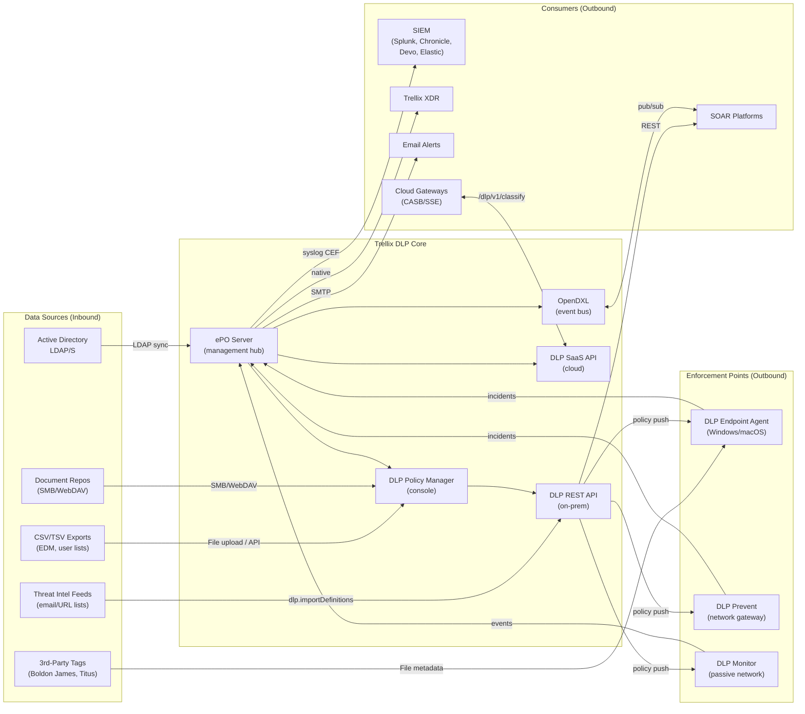

# Integration Map -- Trellix DLP

> Generated: 2026-05-21 | Capability: Authoring Policies
> Covers all integration points discovered across documentation, API research, and video analysis

---

## Inbound Integrations

Systems that feed data INTO Trellix DLP.

| System | Protocol | Data | Capability | Required | API | Evidence |
|--------|----------|------|-----------|----------|-----|----------|
| Active Directory / LDAP | LDAP/S (port 389/636) | Users, Groups, OUs | End-User Group definitions for rule scoping | Yes (for user-scoped rules) | Console-configured sync; CSV import via `dlp.importDefinitions` | A [S23][S73] |
| CSV/TSV Data Exports | File upload | Structured records (SSN, Name, DOB, etc.) | EDM fingerprinting via EDMTrain utility | No (only if using EDM) | GAP -- upload is console-only | A [S45][S48] |
| Document Repositories | SMB/WebDAV | Sensitive documents | Registered Documents (IDM) content fingerprinting | No (only if using IDM) | GAP -- registration is console-only | A [S52][S53] |
| Threat Intelligence Feeds | CSV import via API | Email address lists, URL lists | Definition list updates (blocklist/allowlist) | No | FULL -- `dlp.importDefinitions` | A [S43][S74] |
| Third-Party Classification Tools | File metadata tags | Boldon James, Titus, Microsoft MIP labels | Third-Party Tags in Classification Definitions | No | GAP -- tag source config is console-only | C [S55] |
| HR Systems (via CSV export) | CSV file | User lists, department mappings | End-User Group population | No | PARTIAL -- CSV import via `dlp.importDefinitions` | B [S44] |

---

## Outbound Integrations

Systems that receive data FROM Trellix DLP.

| System | Protocol | Data | Capability | Required | API | Evidence |
|--------|----------|------|-----------|----------|-----|----------|
| SIEM -- Splunk | Syslog (CEF/LEEF) + Splunk TA | DLP incidents, operational events | Incident correlation, dashboards, alerting | No | Syslog forwarding from ePO; `TA-trellix-epo` add-on | A [API research] |
| SIEM -- Google Chronicle | Syslog (CEF) + native parser | DLP incidents, events | Incident correlation with Google SecOps | No | Native `trellix-dlp` parser | A [API research] |
| SIEM -- Devo | Syslog + native collector | DLP incidents, events | Incident aggregation | No | Native Trellix DLP collector | B [API research] |
| SIEM -- Elastic | Syslog (CEF) + custom parsing | DLP incidents | Incident search (no native parser yet) | No | Community -- requested in Kibana issue #164115 | D [API research] |
| SIEM -- Generic | Syslog (CEF/LEEF format) | DLP incidents, events | Any SIEM supporting syslog ingestion | No | Configurable syslog forwarding from ePO/DLP appliance | A [API research] |
| Trellix XDR | Native (internal) | DLP events, incident metadata | Cross-product correlation (DLP + EDR + Email Security) | No | Native integration within Trellix platform | B [API research] |
| Trellix Helix (SOAR) | Native | DLP incidents, evidence | Automated playbook execution for DLP events | No | Via XDR correlation | B [API research] |
| Email Notifications | SMTP | Incident alerts, user notifications | Admin alerting on policy violations | No | ePO email notification configuration | A [Video #24] |
| Managed Endpoints | Trellix Agent protocol | DLP policies, client configuration | Policy enforcement on Windows/macOS endpoints | Yes | Agent communication via ASCI (default 60 min) | A [S72] |
| DLP Prevent Appliance | Trellix Agent protocol | DLP policies | Network-level email/web protection | No (endpoint-only without it) | Same policy distribution as endpoints | A [S40] |
| DLP Monitor Appliance | Trellix Agent protocol | DLP policies | Network traffic monitoring (passive) | No | Same policy distribution | A [S40] |

---

## Bidirectional Integrations

Systems with two-way data exchange with Trellix DLP.

| System | Protocol | Inbound Data | Outbound Data | Capability | Required | API | Evidence |
|--------|----------|-------------|---------------|-----------|----------|-----|----------|
| ePO Server (ePolicy Orchestrator) | Internal (web console + DB) | Policy definitions, System Tree structure, agent status | Policy assignments, deployment commands, incident data | Central management platform -- all DLP config flows through ePO | Yes (mandatory) | ePO Web API (`https://<epo>:8443/remote/`) for automation | A [S1][S2] |
| OpenDXL Fabric | DXL (MQTT-based) | ePO commands via DXL, event subscriptions | DLP events, command responses | Event-driven automation layer wrapping ePO commands | No | Certificate-based mutual TLS; Python/JS client libraries | A [API research] |
| DLP SaaS Platform | HTTPS REST (OAuth2) | Policy config (cloud-managed mode) | Incidents, events, scan results | Cloud-managed DLP for organizations using Trellix SaaS | No (on-prem alternative) | OAuth2 client credentials; `https://api.manage.trellix.com/dlp/` | A [API research] |
| Cloud Gateways (CASB/SSE) | HTTPS REST | Content for classification/scanning | Classification results, policy decisions | Real-time content inspection for cloud traffic | No | `/dlp/v1/classify` and `/dlp/v1/scan` endpoints | A [S62] |
| n8n (Workflow Automation) | HTTP Webhook + ePO API | Webhook triggers, external data | ePO commands, policy operations | Low-code automation bridging external events to DLP actions | No | Community connector at n8n.io | D [API research] |

---

## Integration Architecture Diagram

---

## Authentication Models by Integration

| Integration | Auth Method | Credentials | Rotation | Notes |
|------------|------------|-------------|----------|-------|
| ePO Web API (on-prem) | HTTP Basic over TLS | ePO admin username + password | Manual (ePO account management) | Self-signed TLS cert common; port 8443 |
| DLP REST API (on-prem) | HTTP Basic over TLS | Same ePO credentials | Same as ePO | Runs on DLP server, not ePO server |
| DLP SaaS API | OAuth2 Client Credentials | Client ID + Secret from Developer Portal | Token TTL: 300 seconds; regenerate within 280s | Portal: developer.manage.trellix.com |
| OpenDXL | Mutual TLS (X.509 certificates) | Certificates provisioned via ePO DXL broker | Certificate expiry-based | MQTT transport, not HTTP |
| LDAP/AD | LDAP bind credentials | AD service account | Per organizational policy | Configured in ePO Registered Servers |
| Syslog (SIEM) | Transport-level (TCP/UDP/TLS) | No application auth | N/A | Configure ePO > Registered Servers > Syslog |
| Splunk TA | HTTP Event Collector or syslog | HEC token or syslog config | Per Splunk policy | Community add-on: `TA-trellix-epo` |

---

## SDK and Client Library Map

| Library | Language | GitHub | Maintainer | Covers |
|---------|----------|--------|-----------|--------|
| opendxl-epo-client-python | Python | [opendxl/opendxl-epo-client-python](https://github.com/opendxl/opendxl-epo-client-python) | Trellix/OpenDXL | All ePO commands including `dlp.*` via DXL |
| opendxl-epo-client-javascript | JavaScript | [opendxl/opendxl-epo-client-javascript](https://github.com/opendxl/opendxl-epo-client-javascript) | Trellix/OpenDXL | All ePO commands via DXL |
| Trellix-API scripts | Python | [Trellix-plb/Trellix-API](https://github.com/Trellix-plb/Trellix-API) | Trellix (unofficial) | General Trellix API examples |
| KB87855 samples | C#, Java, PowerShell | [Trellix KB](https://kcm.trellix.com/corporate/index?page=content&id=KB87855) | Trellix | DLP endpoint definition import samples |
| ePO Web API (raw HTTP) | Any language | N/A | N/A | Direct HTTP via `https://<epo>:8443/remote/<cmd>` |

**Note:** There is NO official Trellix DLP SDK. All programmatic access uses raw HTTP (ePO Web API, DLP REST) or OpenDXL client libraries that wrap ePO commands.

---

## Integration Gaps and Opportunities

| Gap | Impact | Opportunity |
|-----|--------|------------|
| No native webhook support | SOC teams must poll API or parse syslog for real-time alerting | Webhook endpoint registration for push-based incident notifications |
| No Elastic native parser | Elastic/Kibana SOCs require custom CEF parsing | Official Elastic integration package |
| No Terraform/Pulumi provider | Cannot manage DLP policies as infrastructure-as-code | Terraform provider for DLP policy CRUD (requires API gaps to be filled first) |
| No OpenAPI/Swagger spec | API consumers must reverse-engineer endpoints from documentation | Published OpenAPI 3.0 spec for all DLP REST endpoints |
| No bidirectional SOAR integration | SOAR can read incidents but cannot modify rules/policies | API for rule enable/disable and incident status management |
| Limited cloud gateway API | Only classify/scan endpoints; cannot manage cloud DLP policies | Full policy management API for cloud-managed DLP |
